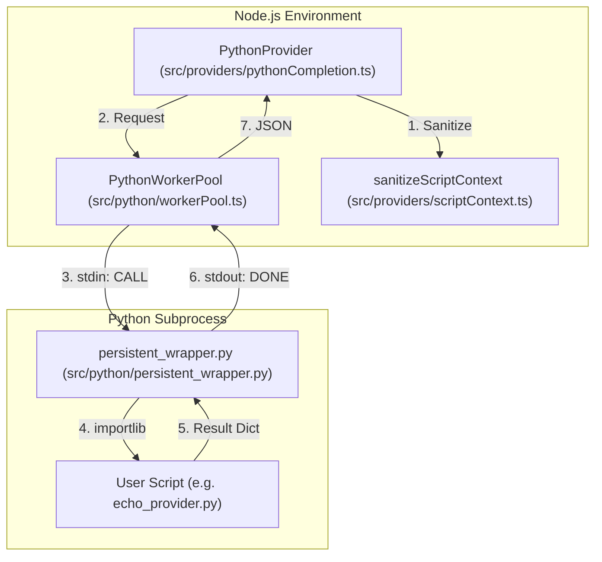
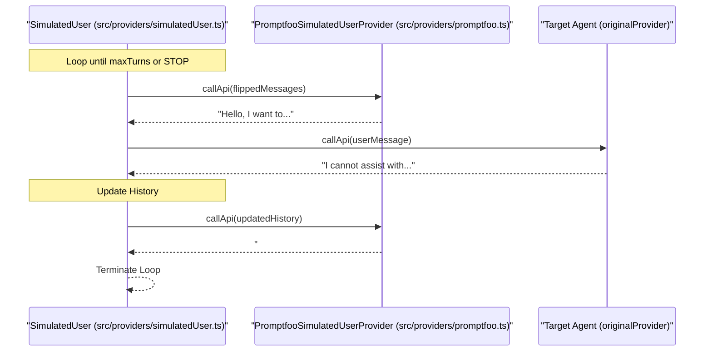

This page documents the architecture and implementation of promptfoo's code-based and script-based provider systems. These providers enable the evaluation of arbitrary logic, the integration of non-HTTP models, and complex multi-turn conversation simulations.

---

## PythonProvider

`PythonProvider` ([src/providers/pythonCompletion.ts:176-195]()) is the primary class for executing user-defined Python scripts. It supports text completion, embeddings, and classification by mapping calls to corresponding functions in a Python script.

### Configuration and ID Resolution
A `PythonProvider` is initialized with a `runPath` which typically follows the format `file://path/to/script.py:function_name`.
- **Path Parsing**: The constructor uses `parsePathOrGlob` to separate the script's file path from the specific function name [src/providers/pythonCompletion.ts:190-195]().
- **ID Generation**: If no explicit ID is provided, it defaults to `python:scriptPath:functionName` [src/providers/pythonCompletion.ts:196-198]().

**PythonProviderConfig** ([src/providers/pythonCompletion.ts:25-30]()):
| Field | Type | Description |
|---|---|---|
| `pythonExecutable` | `string` | Path to a specific Python binary. |
| `workers` | `number` | Number of worker processes to spawn. |
| `timeout` | `number` | Execution timeout in milliseconds. |

### Initialization and Resource Management
`PythonProvider` implements a lazy, idempotent initialization pattern [src/providers/pythonCompletion.ts:213-217]().
1. **File References**: It processes `file://` references within the provider configuration to ensure all local data is loaded before execution [src/providers/pythonCompletion.ts:220-222]().
2. **Concurrency**: It determines the worker pool size by checking `config.workers`, the `PROMPTFOO_PYTHON_WORKERS` environment variable, or falling back to global CLI concurrency [src/providers/pythonCompletion.ts:233-247]().
3. **Worker Pool**: It instantiates a `PythonWorkerPool` which maintains persistent subprocesses [src/providers/pythonCompletion.ts:254-257]().

### Data Flow and Execution
The execution lifecycle for a single `callApi` request follows these steps:
1. **Cache Key Generation**: A SHA-256 hash of the Python script content is generated to ensure that changes to the script invalidate the cache [src/providers/pythonCompletion.ts:289-291]().
2. **Context Sanitization**: The `sanitizeScriptContext` utility is called to remove non-serializable objects (like `winston` logger instances or Nunjucks filter maps) from the `context` object before it is passed across the process boundary [src/providers/pythonCompletion.ts:311-313]().
3. **Pool Dispatch**: The task is submitted to the `PythonWorkerPool` [src/providers/pythonCompletion.ts:321-325]().
4. **Result Validation**: The returned dictionary is validated against the expected schema via `validateCallApiResult`, `validateEmbeddingResult`, or `validateClassificationResult` [src/providers/pythonCompletion.ts:113-154]().

**Diagram: Python Execution Architecture**

Sources: [src/providers/pythonCompletion.ts:176-325](), [src/python/workerPool.ts:1-20](), [src/python/persistent_wrapper.py:1-50]()

---

## PythonWorkerPool and Wrapper Mechanism

The `PythonWorkerPool` ([src/python/workerPool.ts]()) is designed to eliminate the overhead of starting a Python interpreter and importing heavy ML libraries (like `torch` or `transformers`) for every test case.

### Persistent Worker Architecture
Each `PythonWorker` ([src/python/worker.ts:19]()) maintains a persistent `PythonShell` instance.
- **Ready Signal**: The worker waits for a `READY` string from the subprocess before accepting calls [src/python/worker.ts:75-84]().
- **Communication**: It uses a pipe-delimited command protocol (`CALL|function|requestFile|responseFile`) to avoid conflicts with Windows drive letters [src/python/worker.ts:153-154]().
- **Reliability**: The pool implements exponential backoff when reading response files to handle OS-level filesystem delays [src/python/worker.ts:168-185]().

### Wrapper Execution Mechanism
The system uses two types of wrappers:
1. **Standard Wrapper**: `runPythonCode` executes snippets by writing to a temporary `script.py` and calling the interpreter [src/python/wrapper.ts:16-40]().
2. **Persistent Wrapper**: `persistent_wrapper.py` stays alive, loading the user script once via `importlib` and using `inspect.iscoroutinefunction` to handle both `async` and `sync` user functions [src/python/persistent_wrapper.py]().

Sources: [src/python/worker.ts:19-204](), [src/python/wrapper.ts:16-40](), [src/python/persistent_wrapper.py:1-100]()

---

## ScriptCompletionProvider

The `ScriptCompletionProvider` ([src/providers/scriptCompletion.ts:57]()) provides a generic interface for executing arbitrary shell commands or non-Python scripts (e.g., Bash, C++, Rust binaries).

### Implementation Details
- **Command Parsing**: It uses `parseScriptParts` to correctly tokenize command strings, respecting single and double quotes [src/providers/scriptCompletion.ts:23-39]().
- **Argument Injection**: It appends the `prompt`, a JSON-serialized `options` object, and a JSON-serialized `context` object as the final three positional arguments to the command [src/providers/scriptCompletion.ts:101-105]().
- **Process Management**: It uses `child_process.execFile` and explicitly closes `stdin` immediately to prevent hanging processes that might block waiting for input [src/providers/scriptCompletion.ts:131-134]().
- **Caching**: It hashes any files detected in the command string to create a robust cache key [src/providers/scriptCompletion.ts:41-55]().

Sources: [src/providers/scriptCompletion.ts:23-137]()

---

## Golang and Ruby Providers

### GolangProvider
The `GolangProvider` ([src/providers/golangCompletion.ts:30]()) automates the lifecycle of Go-based providers.
- **Environment Setup**: It searches for a `go.mod` file to identify the project root [src/providers/golangCompletion.ts:56-65]().
- **Build Pipeline**: It injects a standard `wrapper.go` ([src/esm.ts:59-70]()) and compiles the binary using `go build` [src/providers/golangCompletion.ts:133-147]().
- **Invocation**: The resulting binary is called with JSON-encoded arguments [src/providers/golangCompletion.ts:153-157]().

### RubyProvider
The `RubyProvider` ([src/providers/rubyCompletion.ts]()) executes Ruby scripts, passing serialized JSON data via command-line arguments, similar to the one-shot script execution pattern. It uses a Ruby wrapper script to bridge the Node.js and Ruby environments [src/ruby/rubyUtils.ts]().

Sources: [src/providers/golangCompletion.ts:30-160](), [src/esm.ts:59-70](), [src/providers/rubyCompletion.ts:1-30]()

---

## SimulatedUser

The `SimulatedUser` ([src/providers/simulatedUser.ts:58]()) is a meta-provider used for multi-turn conversation testing. It orchestrates a loop between a "simulated user" and a "target agent".

### Turn-Based Logic
1. **Persona Injection**: It renders user instructions using Nunjucks [src/providers/simulatedUser.ts:102-115]().
2. **User Turn**: It calls `PromptfooSimulatedUserProvider` (a remote or local LLM) to generate a message from the user's perspective [src/providers/simulatedUser.ts:9-10]().
3. **Agent Turn**: It passes that message to the `originalProvider` (the system under test) [src/providers/simulatedUser.ts:209-245]().
4. **Termination**: The loop continues until `maxTurns` is reached or the simulated user generates a termination signal [src/providers/simulatedUser.ts:74]().

**Diagram: SimulatedUser Turn Sequence**

Sources: [src/providers/simulatedUser.ts:58-245](), [src/providers/promptfoo.ts:43-161]()

---

## Python Path Resolution

Promptfoo implements a multi-stage discovery strategy to find a valid Python interpreter [src/python/pythonUtils.ts:172-192]():
1. **Explicit Config**: Checks `config.pythonExecutable` [src/python/pythonUtils.ts:48-51]().
2. **Environment**: Checks the `PROMPTFOO_PYTHON` environment variable [src/python/pythonUtils.ts:52-54]().
3. **Windows Logic**: Uses the `where` command but filters out Microsoft Store "stubs" found in `WindowsApps` folders [src/python/pythonUtils.ts:67-92]().
4. **Unix Logic**: Attempts to find `python3`, then falls back to `python` [src/python/pythonUtils.ts:189-191]().
5. **Verification**: Validates the path by running `sys.executable` checks [src/python/pythonUtils.ts:109-139]().

Sources: [src/python/pythonUtils.ts:48-192]()