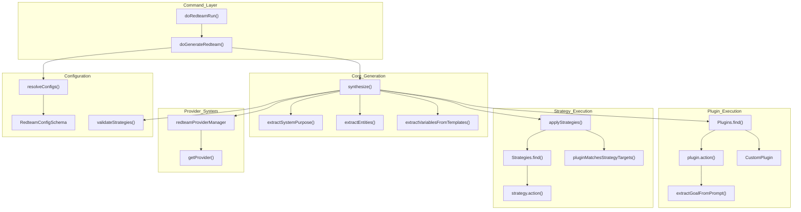
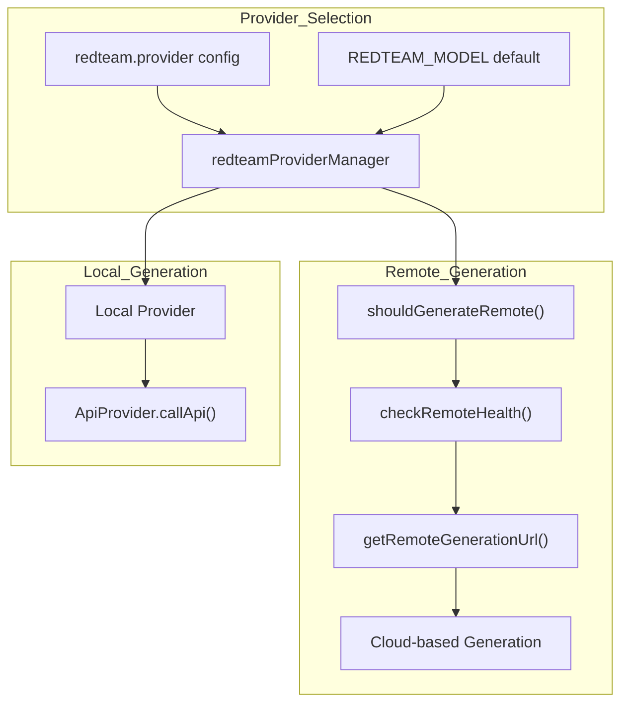
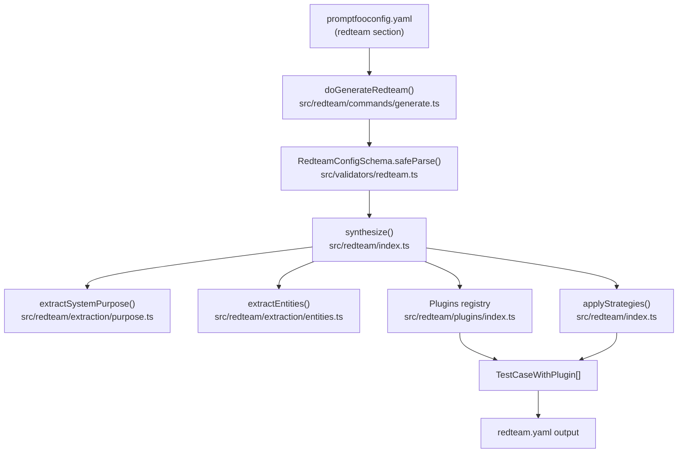
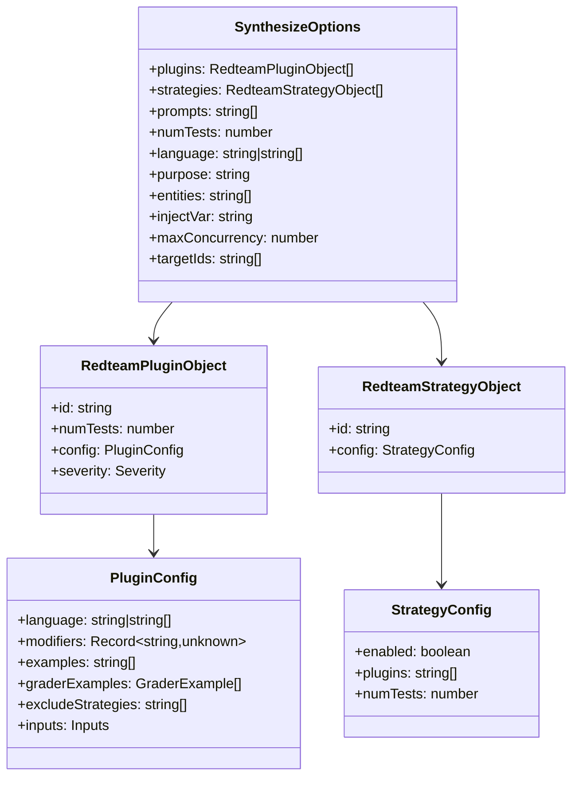
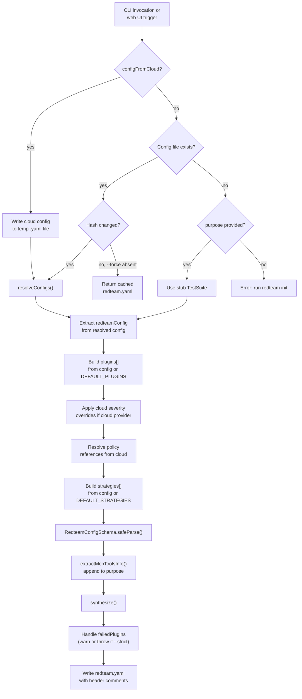
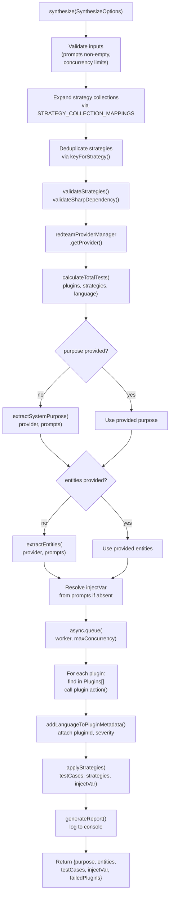

The red team system in promptfoo is designed to identify vulnerabilities in LLM applications through systematic adversarial testing. It uses a two-phase approach: **generation** (creating adversarial test cases) and **evaluation** (executing those tests and grading the results).

## Two-Phase Architecture

The red team workflow consists of distinct generation and evaluation phases:

**Generation Phase** (`synthesize()` in [src/redteam/index.ts:514-1042]()):
1. Extract system context including `purpose`, `entities`, and `injectVar` [src/redteam/index.ts:742-805]().
2. Execute plugins in parallel to generate base adversarial inputs [src/redteam/index.ts:821-1018]().
3. Apply strategies to transform base inputs into sophisticated attacks [src/redteam/index.ts:1027-1064]().
4. Return enriched test cases with complete metadata and grading rubrics.

**Evaluation Phase** (handled by core eval system):
1. Execute generated test cases against the target LLM [src/redteam/commands/run.ts:114-124]().
2. Apply `RedteamGraderBase` implementations to detect policy violations [src/redteam/graders.ts:1-120]().
3. Generate reports with severity classifications and framework compliance mappings [src/redteam/commands/run.ts:126-135]().

## Core `synthesize()` Function

The `synthesize()` function orchestrates the entire test generation pipeline. It accepts `SynthesizeOptions` [src/redteam/types.ts:72-72]() and returns test cases with extracted context.

### System Architecture Diagram

Title: Red Team System Architecture


**Sources:** [src/redteam/index.ts:514-1042](), [src/redteam/commands/generate.ts:105-628](), [src/redteam/commands/run.ts:18-136]()

## Synthesis Execution Flow

The `synthesize()` function orchestrates test generation through five sequential phases:

### Synthesis Flow Diagram

Title: Red Team Synthesis Execution Flow

```mermaid
flowchart TD
    start["synthesize() Entry"]

    subgraph "Phase_1_Input_Processing"
        validatePrompts["Validate prompts array"]
        expandStrategies["Expand strategy collections"]
        dedupeStrategies["Deduplicate by keyForStrategy()"]
        validateStrategies["validateStrategies()"]
        checkLanguage["Check language disallowed strategies"]
    end

    subgraph "Phase_2_Provider_and_Context"
        getProvider["redteamProviderManager.getProvider()"]
        checkHealth["checkRemoteHealth() if remote"]
        extractPurpose["extractSystemPurpose()"]
        extractEntities["extractEntities()"]
        extractInjectVar["extractVariablesFromTemplates()"]
    end

    subgraph "Phase_3_Plugin_Generation"
        validatePlugin["validatePlugin() for each"]
        expandPlugins["Expand plugin collections"]
        forEachLimit["async.forEachLimit(plugins, maxConcurrency)"]
        findPlugin["Plugins.find()"]
        executeAction["plugin.action()"]
        addPluginMetadata["addLanguageToPluginMetadata()"]
        extractGoal["extractGoalFromPrompt()"]
    end

    subgraph "Phase_4_Strategy_Application"
        retryFirst["Apply retry strategy first"]
        applyStrategies["applyStrategies()"]
        filterApplicable["pluginMatchesStrategyTargets()"]
        executeStrategy["strategy.action()"]
        addStrategyMetadata["Add strategyId, strategyConfig"]
        multilingualLast["Apply multilingual strategy last"]
    end

    subgraph "Phase_5_Result_Assembly"
        combineTests["Combine plugin + strategy test cases"]
        generateReport["generateReport()"]
        returnResult["Return { testCases, purpose, entities, injectVar }"]
    end

    start --> validatePrompts
    validatePrompts --> expandStrategies
    expandStrategies --> dedupeStrategies
    dedupeStrategies --> validateStrategies
    validateStrategies --> checkLanguage

    checkLanguage --> getProvider
    getProvider --> checkHealth
    checkHealth --> extractPurpose
    extractPurpose --> extractEntities
    extractEntities --> extractInjectVar

    extractInjectVar --> validatePlugin
    validatePlugin --> expandPlugins
    expandPlugins --> forEachLimit
    forEachLimit --> findPlugin
    findPlugin --> executeAction
    executeAction --> addPluginMetadata
    addPluginMetadata --> extractGoal

    extractGoal --> retryFirst
    retryFirst --> applyStrategies
    applyStrategies --> filterApplicable
    filterApplicable --> executeStrategy
    executeStrategy --> addStrategyMetadata
    addStrategyMetadata --> multilingualLast

    multilingualLast --> combineTests
    combineTests --> generateReport
    generateReport --> returnResult
```


**Key Code Entities:**

| Entity | Location | Purpose |
|--------|----------|---------|
| `synthesize()` | [src/redteam/index.ts:514-1042]() | Main orchestration function for red team test generation |
| `async.forEachLimit()` | [src/redteam/index.ts:821-1018]() | Parallel plugin execution with concurrency control |
| `applyStrategies()` | [src/redteam/index.ts:246-387]() | Transform base tests with strategies |
| `extractGoalFromPrompt()` | [src/redteam/util.ts:62-62]() | Extract attack goal from each test for strategy guidance |
| `generateReport()` | [src/redteam/index.ts:87-120]() | Create summary of generated tests for CLI output |

**Sources:** [src/redteam/index.ts:514-1042](), [src/redteam/index.ts:246-387](), [src/redteam/index.ts:87-120]()

## Plugin and Strategy Ecosystem

The red team system organizes vulnerabilities into plugins and delivery techniques into strategies.

### Vulnerability Categories (Plugins)
Plugins generate adversarial payloads across several categories [site/docs/_shared/data/plugins.ts:1-8]():
- **Security**: Prompt injection, SQL injection, SSRF, RBAC, Shell Injection [src/redteam/plugins/index.ts:67-72]().
- **Privacy**: PII leaks (direct, session), Cross-session leak [src/redteam/plugins/index.ts:47-61]().
- **Harmful Content**: Hate speech, violence, illegal drugs, weapons (via `harmful` plugin) [src/redteam/plugins/harmful/common.ts:55]().
- **Misinformation & Misuse**: Hallucinations, copyright violations (contracts), competitor endorsements [src/redteam/plugins/index.ts:46-78]().
- **Dataset-backed**: HarmBench, BeaverTails, CybersecEval, Pliny [src/redteam/plugins/index.ts:45-77]().

### Attack Strategies
Strategies transform payloads to bypass filters [src/redteam/strategies/index.ts:56-56]():
- **Encoding**: Base64, Hex, Rot13, Leetspeak, Homoglyphs [src/redteam/constants/strategies.ts:151-168]().
- **Dynamic Single-Turn**: Best-of-N, Citation, Math Prompt, GCG [src/redteam/constants/strategies.ts:169-181]().
- **Multi-turn/Agentic**: Iterative, Goat, Hydra, Tree-based attacks [src/redteam/constants/strategies.ts:188-203]().
- **Custom**: User-defined transformations using Javascript files (`file://`) or natural language instructions [src/validators/redteam.ts:165-184]().

**Sources:** [src/redteam/constants/strategies.ts](), [src/redteam/plugins/index.ts](), [src/redteam/strategies/index.ts](), [site/docs/_shared/data/plugins.ts]()

## Compliance Framework Mappings

Promptfoo maps red team findings to global compliance frameworks to help organizations meet regulatory requirements. Mappings are defined in `FRAMEWORK_COMPLIANCE_IDS` [src/redteam/constants/frameworks.ts:1-20]().

| Framework ID | Framework Name |
|--------------|----------------|
| `owasp:llm` | OWASP Top 10 for LLM Applications |
| `nist:ai:measure` | NIST AI Risk Management Framework |
| `mitre:atlas` | MITRE ATLAS |
| `eu:ai-act` | EU AI Act |
| `iso:42001` | ISO/IEC 42001 (AI Management System) |
| `gdpr` | General Data Protection Regulation |

**Sources:** [src/redteam/constants/frameworks.ts:1-20](), [site/docs/red-team/configuration.md:95-106]()

## Provider Management and Remote Generation

The red team system supports both local and remote test generation through `redteamProviderManager` [src/redteam/providers/shared.ts](). Remote generation allows access to specialized, uncensored models for high-quality attack probes.

Title: Red Team Provider and Remote Generation Flow


**Sources:** [src/redteam/index.ts:742-760](), [src/redteam/remoteGeneration.ts:23-27](), [src/redteam/providers/shared.ts]()

# Test Generation and Configuration


This page documents how promptfoo's red team system generates adversarial test cases: the `synthesize()` function, the `SynthesizeOptions` and `RedteamConfigSchema` types, plugin and strategy resolution, and the `redteam` configuration block in `promptfooconfig.yaml`.

For general architecture of the red team system (plugins, strategies, graders), see [5.1](). For the full plugin registry and writing custom plugins, see [5.3](). For the CLI commands that invoke generation, see [5.7]().

---

## Overview

The test generation pipeline takes a YAML configuration, resolves plugins and strategies, extracts the target's purpose, and produces a set of `TestCaseWithPlugin` objects. These test cases are then written to `redteam.yaml` and consumed by the evaluation engine.

**Test Generation Data Flow**



Sources: [src/redteam/index.ts:700-723](), [src/redteam/commands/generate.ts:19-60](), [src/validators/redteam.ts:48-60]()

---

## The `redteam` Configuration Block

The `redteam` key in `promptfooconfig.yaml` (or a standalone config file) is validated by `RedteamConfigSchema`. The following fields are supported:

| Field | Type | Default | Description |
|---|---|---|---|
| `injectVar` | `string` | Inferred from prompts | Template variable to substitute adversarial content into |
| `purpose` | `string` | Extracted from prompts | Describes the target system; used by plugins to guide generation |
| `testGenerationInstructions` | `string` | — | Additional instructions passed to plugins to guide attack creation |
| `provider` | `string \| object` | `openai:gpt-4o` | LLM used to generate adversarial inputs |
| `plugins` | `RedteamPlugin[]` | `default` | Plugins to run (adversarial generators) |
| `strategies` | `RedteamStrategy[]` | `basic`, `jailbreak:meta`, `jailbreak:composite` | Strategies to apply (attack delivery techniques) |
| `numTests` | `number` | 5 | Default tests per plugin |
| `language` | `string \| string[]` | English | Language(s) for test generation |
| `maxConcurrency` | `number` | 4 | Max parallel plugin generation calls (capped at 20) |
| `delay` | `number` | 0 | Milliseconds between API calls; forces `maxConcurrency = 1` |
| `entities` | `string[]` | Extracted from prompts | Named entities used to make probes realistic |
| `contexts` | `RedteamContext[]` | — | Test contexts for different app states |

### Minimal example

```yaml
redteam:
  purpose: "Customer support chatbot for an e-commerce platform"
  numTests: 10
  plugins:
    - id: harmful:hate
    - id: sql-injection
    - id: pii:direct
      numTests: 3
  strategies:
    - id: jailbreak
    - id: base64
```

Sources: [src/validators/redteam.ts:206-360](), [site/docs/red-team/configuration.md:70-95](), [src/redteam/index.ts:186-203]()

---

## Schema Validation: `RedteamConfigSchema`

`RedteamConfigSchema` is defined in [src/validators/redteam.ts]() and built from composable sub-schemas:

| Schema | Purpose |
|---|---|
| `RedteamPluginObjectSchema` | Validates a single plugin: `{ id, numTests, config, severity }` |
| `RedteamPluginSchema` | Union of string shorthand and `RedteamPluginObjectSchema` |
| `RedteamStrategySchema` | Union of string shorthand and `{ id, config }` object |
| `strategyIdSchema` | Validates strategy IDs against `ALL_STRATEGIES` or `file://` paths |
| `RedteamConfigSchema` | Top-level schema composing the above |
| `RedteamGenerateOptionsSchema` | Schema for the `redteam generate` CLI command options |

Plugin `id` validation accepts:
- Any member of `pluginOptions` (built-in plugins and collections like `owasp:llm`) [src/validators/redteam.ts:85-111]()
- A string starting with `file://` (custom plugin path) [src/validators/redteam.ts:102-110]()

Strategy `id` validation accepts:
- Any member of `ALL_STRATEGIES` [src/validators/redteam.ts:153-164]()
- A `file://` path ending in `.js` or `.ts` [src/validators/redteam.ts:165-176]()
- A custom strategy identifier (via `isCustomStrategy()`) [src/validators/redteam.ts:177-185]()

Sources: [src/validators/redteam.ts:85-198](), [src/validators/redteam.ts:206-250]()

---

## Plugin and Strategy Types

**Type Hierarchy**



Sources: [src/redteam/types.ts:55-165](), [src/redteam/types.ts:169-180](), [src/redteam/index.ts:70-73]()

---

## Plugin Collections and Expansion

Named collections expand to lists of individual plugin IDs at resolution time. This happens via `ALIASED_PLUGIN_MAPPINGS` and `COLLECTIONS`.

| Collection | Description | Source |
|---|---|---|
| `harmful` | All keys of `HARM_PLUGINS` | [src/redteam/constants/plugins.ts]() |
| `pii` | All entries of `PII_PLUGINS` | [src/redteam/constants/plugins.ts]() |
| `foundation` | All entries of `FOUNDATION_PLUGINS` | [src/redteam/constants/plugins.ts]() |
| `medical` | All entries of `MEDICAL_PLUGINS` | [src/redteam/constants/plugins.ts]() |
| `nist:ai:measure` | NIST AI RMF mapping | [src/redteam/constants/frameworks.ts]() |
| `owasp:llm` | OWASP Top 10 for LLMs mapping | [src/redteam/constants/frameworks.ts]() |

Strategy collections similarly expand. In `synthesize()`, any strategy whose `id` matches a key in `STRATEGY_COLLECTION_MAPPINGS` is expanded into constituent strategy IDs [src/redteam/index.ts:32-36]().

Sources: [src/redteam/index.ts:15-36](), [src/validators/redteam.ts:3-26]()

---

## `doGenerateRedteam()`: Configuration Resolution

`doGenerateRedteam()` in [src/redteam/commands/generate.ts:19]() orchestrates everything before `synthesize()` is called.

**`doGenerateRedteam()` Resolution Steps**



Sources: [src/redteam/commands/generate.ts:19-118](), [src/redteam/commands/generate.ts:170-195]()

---

## `synthesize()`: Core Test Generation

`synthesize()` is the central function that produces adversarial test cases.

**`synthesize()` Internal Flow**



Sources: [src/redteam/index.ts:114-185](), [test/redteam/index.test.ts:133-180]()

### Concurrency and rate limiting

- `maxConcurrency` defaults to 4; capped at `MAX_MAX_CONCURRENCY = 20` [src/redteam/index.ts:187](), [site/docs/red-team/configuration.md:93]()
- If `delay` is set, `maxConcurrency` is forced to 1 [site/docs/red-team/configuration.md:94]()
- Plugin generation tasks are queued with `async.queue()` from the `async` library [src/redteam/index.ts:3]()

Sources: [src/redteam/index.ts:187](), [site/docs/red-team/configuration.md:93-94]()

---

## Multi-Input Materialization

For targets with multiple input variables, promptfoo uses a materialization process to map single adversarial strings into complex JSON structures or multi-variable sets.

- `rematerializeStrategyInputVars()`: Re-parses adversarial inputs to extract specific variables if `inputs` configuration is provided [src/redteam/index.ts:114-185]().
- `extractMaterializedVariablesFromJsonWithMetadata()`: Extracts variables from JSON responses to populate `TestCase.vars` [src/redteam/index.ts:156-165]().

Sources: [src/redteam/index.ts:114-185]()

---

## Metadata Attached to Generated Test Cases

Every generated `TestCase` has a `metadata` object populated during generation.

| Metadata Key | Set by | Description |
|---|---|---|
| `pluginId` | `synthesize()` | Short plugin ID (e.g. `harmful:hate`) |
| `pluginConfig` | `computeModifiersFromConfig()` | Resolved plugin config including modifiers |
| `severity` | `getPluginSeverity()` | `Severity` enum value (`Low`, `Medium`, `High`, `Critical`) |
| `strategyId` | `applyStrategies()` | Strategy that produced this variant |
| `inputMaterialization` | `rematerializeStrategyInputVars()` | Materialized variables for multi-input testing |

Severity defaults come from `riskCategorySeverityMap` and can be overridden per plugin or via cloud severity override profiles.

Sources: [src/redteam/index.ts:195-204](), [src/redteam/plugins/index.ts:114-132](), [src/redteam/index.ts:114-184]()

---

## Strict Mode and Partial Generation Errors

By default, if a plugin generates zero test cases, `synthesize()` logs a warning and continues. With the `--strict` flag, `handleFailedPlugins()` [src/redteam/commands/generate.ts:85-118]() throws a `PartialGenerationError` instead, halting the run.

`PartialGenerationError` carries a `failedPlugins: FailedPluginInfo[]` array, where each entry has `{ pluginId, requested }`.

Sources: [src/redteam/commands/generate.ts:85-118](), [src/redteam/commands/generate.ts:64]()