The Red Team Report UI provides a comprehensive visualization of adversarial evaluation results. It transforms raw evaluation data into an executive-style dashboard that highlights vulnerabilities, strategy effectiveness, and compliance with security frameworks.

## Overview and Data Flow

The Red Team Report is a specialized view within the promptfoo web application, accessible via the `/reports` route [src/app/src/App.tsx:120](). It operates in two modes: a list view (`ReportIndex`) for browsing historical reports and a detail view (`Report`) for analyzing specific evaluation IDs [src/app/src/pages/redteam/report/page.tsx:33]().

### Component Hierarchy

The report interface is composed of several specialized components that consume a unified data state derived from evaluation results.

| Component | Responsibility |
| :--- | :--- |
| `Report.tsx` | Main container; handles API fetching, data processing, and global filtering [src/app/src/pages/redteam/report/components/Report.tsx:72](). |
| `Overview.tsx` | High-level summary of vulnerabilities categorized by severity [src/app/src/pages/redteam/report/components/Report.tsx:53](). |
| `TestSuites.tsx` | Detailed table of plugins, risk scores, and attack success rates (ASR) [src/app/src/pages/redteam/report/components/TestSuites.tsx:59](). |
| `RiskCategoryDrawer.tsx` | Slide-out panel for inspecting specific test cases, prompts, and outputs for a plugin [src/app/src/pages/redteam/report/components/RiskCategoryDrawer.tsx:136](). |
| `StrategyStats.tsx` | Breakdown of which adversarial strategies (e.g., jailbreak, PII) were most effective [src/app/src/pages/redteam/report/components/StrategyStats.tsx:35](). |
| `FrameworkCompliance.tsx` | Mapping of results to external standards like OWASP LLM Top 10 or NIST AI RMF [src/app/src/pages/redteam/report/components/FrameworkCompliance.tsx:30](). |

### Data Retrieval Implementation

The report fetches data using the `callApi` utility [src/app/src/pages/redteam/report/components/Report.tsx:30](). If an `evalId` is provided in the URL search parameters, it fetches that specific result; otherwise, it retrieves the latest evaluation from the `/results` endpoint [src/app/src/pages/redteam/report/components/Report.tsx:95-149]().

**Data Flow Diagram**
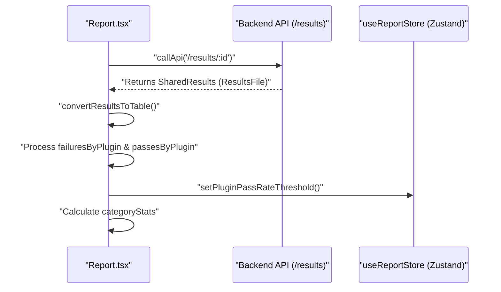

**Sources:**
- [src/app/src/pages/redteam/report/components/Report.tsx:72-149]()
- [src/app/src/pages/redteam/report/page.tsx:33]()
- [src/app/src/pages/redteam/report/components/Report.test.tsx:103-143]()

## Risk Category Visualization

The report organizes findings by "Plugins" (vulnerability categories). Each category is assigned a severity and a risk score calculated based on the impact and the complexity of the successful attacks.

### Severity and Risk Scoring
Severity is mapped from the plugin definition. The `TestSuites` component calculates a `riskScore` using the `calculatePluginRiskScore` utility [src/app/src/pages/redteam/report/components/TestSuites.tsx:25](), which factors in the severity and the `complexityScore` of the attack strategy used [src/app/src/pages/redteam/report/components/TestSuites.tsx:121-146]().

- **Critical/High/Medium/Low**: Visualized using color-coded badges and cards. The UI uses `getSeverityColor` to determine visual styling [src/app/src/pages/redteam/report/components/TestSuites.tsx:31]().
- **Attack Success Rate (ASR)**: The percentage of adversarial attempts that successfully bypassed model safeguards, calculated via `calculateAttackSuccessRate` [src/app/src/pages/redteam/report/components/TestSuites.tsx:170]().

### Detailed Inspection (RiskCategoryDrawer)
When a user selects a specific category in `TestSuites`, the `RiskCategoryDrawer` opens. It displays:
1. **Pass/Fail Stats**: A summary of total tests vs. successful attacks [src/app/src/pages/redteam/report/components/RiskCategoryDrawer.tsx:168-170]().
2. **Conversation History**: Full multi-turn interactions for failed tests, reconstructed from `redteamHistory` or `redteamTreeHistory` metadata via `buildChatMessages` [src/app/src/pages/redteam/report/components/RiskCategoryDrawer.tsx:99-134]().
3. **Suggestions**: Remediation advice generated by the grading engine, extracted from `gradingResult.componentResults` [src/app/src/pages/redteam/report/components/RiskCategoryDrawer.tsx:192-194]().

**Sources:**
- [src/app/src/pages/redteam/report/components/TestSuites.tsx:47-177]()
- [src/app/src/pages/redteam/report/components/RiskCategoryDrawer.tsx:99-196]()
- [src/app/src/pages/redteam/report/components/shared.ts:1-21]()

## Strategy Effectiveness

Adversarial strategies (e.g., `jailbreak:composite`, `pliny`, `prompt-injections`) are analyzed in `StrategyStats.tsx`. This allows developers to understand which attack vectors their model is most susceptible to.

- **ASR per Strategy**: Calculates how often a specific strategy succeeded across all plugins by iterating through `succeededAttacksByPlugin` and `failedAttacksByPlugin` [src/app/src/pages/redteam/report/components/StrategyStats.tsx:54-89]().
- **Visualization**: Uses red-toned progress bars via `getProgressBarColor` where higher success (for the attacker) indicates higher risk [src/app/src/pages/redteam/report/components/StrategyStats.tsx:22-33]().

**Sources:**
- [src/app/src/pages/redteam/report/components/StrategyStats.tsx:22-192]()

## Framework Compliance

The `FrameworkCompliance` component maps internal plugin results to industry-standard security frameworks.

### Compliance Mapping Logic
Mappings are defined in `ALIASED_PLUGIN_MAPPINGS` [src/app/src/pages/redteam/report/components/FrameworkCompliance.tsx:7](). The UI determines compliance by checking if the pass rate for all plugins associated with a framework requirement exceeds the `pluginPassRateThreshold` (managed in the report store) [src/app/src/pages/redteam/report/components/FrameworkCompliance.tsx:63-68]().

**Framework Mapping Diagram**
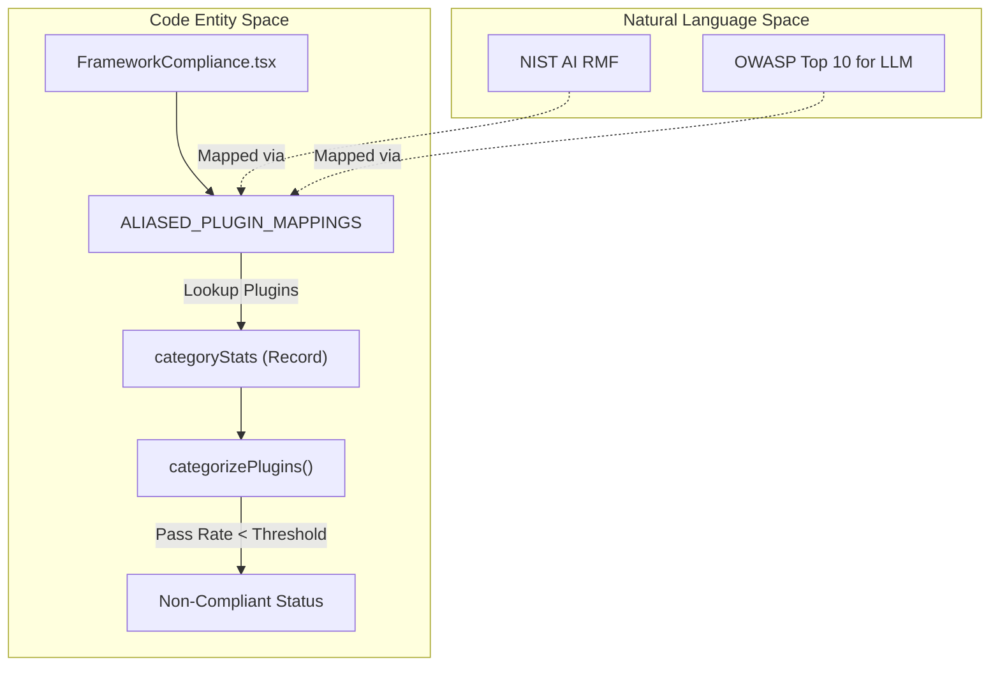

### Features
- **CSV Export**: Allows exporting compliance data for auditing purposes via `FrameworkCsvExporter.tsx` [src/app/src/pages/redteam/report/components/FrameworkCompliance.tsx:183-187]().
- **Severity Aggregation**: The overall severity of a framework violation is determined by the highest severity of its non-compliant plugins [src/app/src/pages/redteam/report/components/FrameworkCompliance.tsx:73-102]().

**Sources:**
- [src/app/src/pages/redteam/report/components/FrameworkCompliance.tsx:30-192]()
- [src/app/src/pages/redteam/report/components/FrameworkComplianceUtils.ts:1-19]()

## State Management

The report uses a specialized Zustand store, `useReportStore`, to manage UI state across the various components [src/app/src/pages/redteam/report/components/Report.tsx:59]().

| State Property | Description |
| :--- | :--- |
| `pluginPassRateThreshold` | The percentage (0.0 - 1.0) required for a plugin to be considered "passed" [src/app/src/pages/redteam/report/components/Report.tsx:82](). |
| `severityFilter` | Current filter applied to the Overview and TestSuites (e.g., only show 'Critical') [src/app/src/pages/redteam/report/components/TestSuites.tsx:68](). |
| `showUntestedPlugins` | Toggle to display or hide categories that were not included in the eval [src/app/src/pages/redteam/report/components/FrameworkCompliance.tsx:31](). |

**Sources:**
- [src/app/src/pages/redteam/report/components/Report.tsx:82]()
- [src/app/src/pages/redteam/report/components/TestSuites.tsx:68]()
- [src/app/src/pages/redteam/report/components/FrameworkCompliance.tsx:31]()

## UI Interaction Diagram

The following diagram illustrates how a user navigates from the high-level overview to specific failure logs.

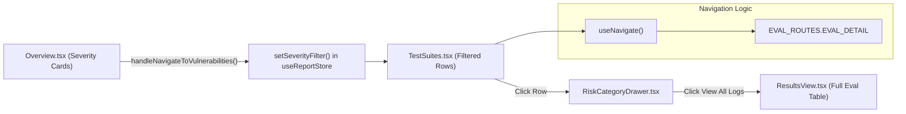

**Sources:**
- [src/app/src/pages/redteam/report/components/Report.tsx:73]()
- [src/app/src/pages/redteam/report/components/TestSuites.tsx:67-69]()
- [src/app/src/pages/redteam/report/components/RiskCategoryDrawer.tsx:146-154]()

# Model Audit UI


The Model Audit UI provides a web-based interface for the `promptfoo scan-model` capability. It allows users to perform static security analysis on machine learning models to detect malicious code, unsafe operations, and configuration risks across various formats (PyTorch, TensorFlow, ONNX, etc.). The interface facilitates path selection, advanced scanner configuration, real-time progress monitoring, and historical result management.

## System Architecture

The Model Audit UI bridges the React-based frontend with the underlying `modelaudit` Python package via an Express backend. The backend manages the lifecycle of the scanning process by spawning `modelaudit` as a subprocess.

### Component Relationship Diagram

This diagram shows how UI components interact with the Zustand state and the backend API routes.

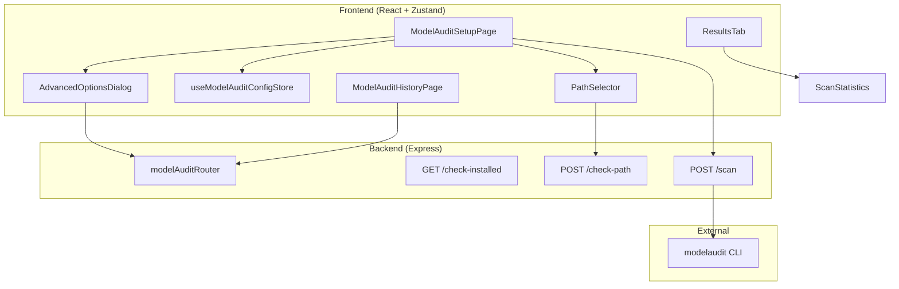
**Sources:** [src/app/src/App.tsx:80-111](), [src/server/routes/modelAudit.ts:21-200](), [src/types/api/modelAudit.ts:8-105]()

## Scan Configuration

Users configure scans through a multi-step process involving path validation and advanced parameter tuning.

### Path Selection and Validation
The `PathSelector` component allows users to specify local files or directories. It communicates with the `POST /api/model-audit/check-path` endpoint to verify the existence and type of the provided path.
*   **Path Verification:** The backend uses `fs.stat` to confirm if a path exists and determines if it is a `file` or `directory` [src/server/routes/modelAudit.ts:171-179]().
*   **Home Directory Expansion:** Both the path check and the scan execution handle `~/` expansion to the user's home directory [src/server/routes/modelAudit.ts:160-163](), [src/server/routes/modelAudit.ts:224-226]().
*   **Remote Sources:** While the UI facilitates local selection, the underlying system supports `hf://`, `s3://`, `gs://`, and `models:/` protocols for remote scanning [site/docs/model-audit/index.md:118-126]().

### Advanced Options
The `AdvancedOptionsDialog` manages the fine-grained configuration of the `modelaudit` engine.
*   **Scanner Catalog:** The UI fetches available scanners via `GET /api/model-audit/scanners` [src/server/routes/modelAudit.ts:109-146](). This returns a list of `ScannerInfo` including IDs, descriptions, and supported extensions [src/types/api/modelAudit.ts:20-28]().
*   **Blacklist Patterns:** Users can define regex patterns for disallowed model names or strings [src/types/api/modelAudit.ts:73-73]().
*   **Resource Limits:** Configuration for `timeout` (seconds) and `maxSize` (e.g., "1GB") are passed to the scanner to prevent resource exhaustion [src/types/api/modelAudit.ts:74-86]().
*   **Scanner Control:** Users can explicitly include specific scanners via `scanners` or remove noisy ones via `excludeScanner` [src/types/api/modelAudit.ts:87-88]().

**Sources:** [src/server/routes/modelAudit.ts:109-146](), [src/types/api/modelAudit.ts:43-105](), [site/docs/model-audit/index.md:169-189]()

## State Management

The `useModelAuditConfigStore` is a Zustand store that persists configuration and scan history in the browser. It utilizes the types defined in `ModelAudit.types.ts` to maintain consistency with the backend schemas.

| State Property | Type | Purpose |
| :--- | :--- | :--- |
| `recentScans` | `RecentScan[]` | Persists metadata of previously executed scans in localStorage [src/app/src/pages/model-audit/ModelAudit.types.ts:17-22](). |
| `scanOptions` | `ScanOptions` | Stores current global configuration like `blacklist`, `timeout`, and `strict` [src/app/src/pages/model-audit/ModelAudit.types.ts:34-50](). |
| `installationStatus` | `InstallationStatus` | Tracks if the `modelaudit` CLI is available on the host system [src/app/src/pages/model-audit/ModelAudit.types.ts:27-32](). |

**Sources:** [src/app/src/pages/model-audit/ModelAudit.types.ts:5-50](), [src/app/src/pages/model-audit/stores/useModelAuditConfigStore.ts:1-20]()

## Backend Execution Flow

The backend acts as a bridge, translating HTTP requests into CLI commands.

### Scan Subprocess Logic
When a scan is initiated via `POST /api/model-audit/scan`, the server:
1.  **Validation:** Validates the request body against `ScanRequestSchema` [src/server/routes/modelAudit.ts:196-200]().
2.  **Path Resolution:** Resolves relative paths to absolute locations on the host filesystem [src/server/routes/modelAudit.ts:215-231]().
3.  **Argument Parsing:** Maps UI options to CLI arguments using `parseModelAuditArgs` [src/util/modelAuditCliParser.ts:142-182](). This function handles boolean flags (e.g., `--strict`), strings, and arrays (e.g., multiple `--blacklist` entries) [src/util/modelAuditCliParser.ts:156-178]().
4.  **Delegation:** Spawns the `modelaudit` process with `PROMPTFOO_DELEGATED: 'true'` to signal it is being run by promptfoo [src/server/routes/modelAudit.ts:28-33]().
5.  **Output Capture:** Captures `stdout` and `stderr` using `StringDecoder` to handle real-time streams [src/server/routes/modelAudit.ts:40-89]().

### Process Flow Diagram

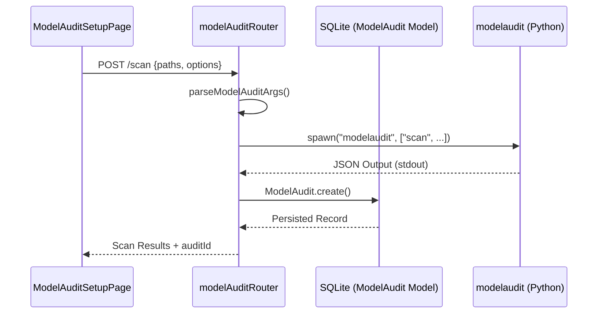
**Sources:** [src/server/routes/modelAudit.ts:195-280](), [src/util/modelAuditCliParser.ts:142-182](), [src/commands/modelScan.ts:1-150]()

## Results and Statistics

Once a scan completes, results are displayed using the `ResultsTab` and `ScanStatistics` components, mapping the `ModelAuditScanResults` data structure to UI elements.

*   **ScanStatistics:** Summarizes the scan using `total_checks`, `passed_checks`, and `failed_checks`. It also displays `bytes_scanned` and `duration` [src/types/modelAudit.ts:83-86]().
*   **Findings Display:** Issues are categorized by severity (`critical`, `error`, `warning`, `info`). Each `ModelAuditIssue` includes a `message`, `location`, and a `why` field explaining the security risk [src/types/modelAudit.ts:12-19]().
*   **Asset Inspection:** The UI lists `assets` detected within the model, such as embedded shared libraries or configuration files [src/types/modelAudit.ts:21-25]().
*   **Historical Audits:** The `ListScansResponseSchema` defines the structure for paginated historical results, allowing users to sort by `createdAt`, `failedChecks`, or `modelPath` [src/types/api/modelAudit.ts:128-179]().

### Versioning and Updates
The UI checks for `modelaudit` updates by comparing the local version against PyPI.
*   **Local Version Check:** Executes `modelaudit --version` and parses the output [src/updates.ts:89-98]().
*   **Remote Version Check:** Fetches metadata from `https://pypi.org/pypi/modelaudit/json` [src/updates.ts:70-87]().
*   **CLI UI Support:** The `supportsCliUiWithOutput` helper determines if the installed version supports advanced UI features based on semver [src/commands/modelScan.ts:104-113]().

**Sources:** [src/types/modelAudit.ts:62-105](), [src/types/api/modelAudit.ts:139-180](), [src/updates.ts:70-128](), [src/commands/modelScan.ts:104-113]()

# Sharing and Cloud Integration


This page covers how promptfoo uploads evaluation results to a remote server, generates shareable URLs, and manages authenticated access to the promptfoo Cloud service. It includes the sharing pipeline for both standard evaluations and model audits, the `CloudConfig` singleton, cloud API utilities, and the `auth` CLI commands.

For details on the CLI commands that trigger sharing (e.g., `promptfoo eval --share`, `promptfoo share`), see page [CLI System](#4). For details on the web UI that displays shared evaluations, see page [Web Interface](#6). For details on self-hosting the promptfoo server, see page [Self-Hosting and Deployment](#9.4).

---

## System Overview

The sharing and cloud integration system has three distinct concerns that work together:

1.  **Sharing** — uploading eval results or model audit results to a remote server and returning a URL.
2.  **Cloud Configuration** — storing and retrieving the API key, API host, app URL, and team/org context.
3.  **Cloud API Utilities** — making authenticated HTTP calls to the cloud API for providers, configs, permissions, etc.

**System context diagram**

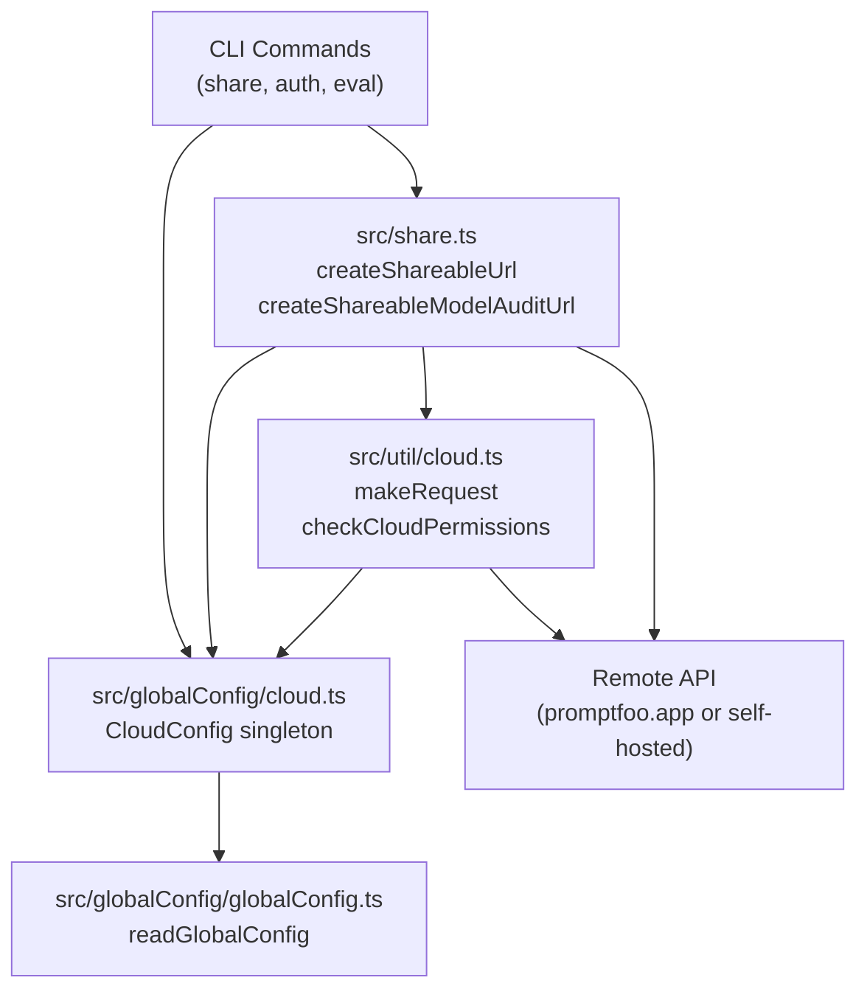

Sources: [src/share.ts:1-24](), [src/util/cloud.ts:1-17](), [src/globalConfig/cloud.ts:1-13]()

---

## Sharing System

For a deep dive into the chunked upload mechanism and rollback logic, see [Sharing System](#7.1).

### Entry Points

| Function | File | Purpose |
| :--- | :--- | :--- |
| `createShareableUrl()` | `src/share.ts` | Share an `Eval` record, return URL |
| `createShareableModelAuditUrl()` | `src/share.ts` | Share a `ModelAudit` record, return URL |
| `isSharingEnabled()` | `src/share.ts` | Check whether sharing is configured for an eval |
| `isModelAuditSharingEnabled()` | `src/share.ts` | Check whether model audit sharing is configured |
| `hasEvalBeenShared()` | `src/share.ts` | Check if an eval already exists on the remote |
| `hasModelAuditBeenShared()` | `src/share.ts` | Check if a model audit already exists on the remote |

Sources: [src/share.ts:53-73](), [src/share.ts:75-89](), [src/commands/share.ts:25-38](), [src/commands/share.ts:40-53]()

### `isSharingEnabled()` Logic

The function checks three sources in order. Any one being truthy returns `true`:

1.  `eval.config.sharing.apiBaseUrl` is set (per-eval config) [src/share.ts:54-55]().
2.  `getShareApiBaseUrl()` returns a URL that does **not** contain `api.promptfoo.app` (i.e., it is a custom self-hosted URL) [src/share.ts:56-66]().
3.  `cloudConfig.isEnabled()` returns `true` (an API key is present) [src/share.ts:58-70]().

Sources: [src/share.ts:53-73]()

### Chunked Upload Mechanism

`sendChunkedResults` (invoked via `createShareableUrl`) handles large eval result sets by calculating an adaptive chunk size based on the largest result sample [src/share.ts:111-122](). It handles network timeouts or payload size errors by recursively splitting chunks in half. Large media assets are handled via `uploadBlobRefsForShare` or `inlineBlobRefsForShare` before upload [src/share.ts:7](), [src/share.ts:19]().

Sources: [src/share.ts:111-122](), [src/share.ts:7](), [src/share.ts:19]()

---

## Cloud Configuration

For details on API key management and team context, see [Cloud Configuration](#7.2).

### `CloudConfig` Class

The `CloudConfig` class is a singleton in `src/globalConfig/cloud.ts`, backed by the global config file (`~/.promptfoo/promptfoo.yaml`) [src/globalConfig/cloud.ts:94-95](). It manages the `apiKey`, `apiHost`, and `appUrl` used for all cloud interactions [src/globalConfig/cloud.ts:73-92]().

**CloudConfig data structure**

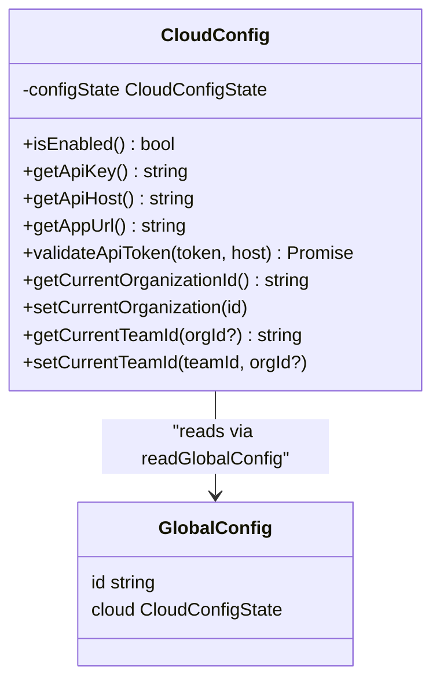

Sources: [src/globalConfig/cloud.ts:94-124](), [src/globalConfig/accounts.ts:52-61]()

### Authentication and Teams

Authentication is handled via the `auth` CLI command group [src/commands/auth.ts:55-57](). Users can login via API key or browser [src/commands/auth.ts:85](), [src/commands/auth.ts:110-114](). Team and organization context is managed through `setupTeamContext`, which allows users to select from available teams returned by the cloud API [src/commands/auth.ts:120-207]().

Sources: [src/commands/auth.ts:85](), [src/commands/auth.ts:120-207](), [src/globalConfig/cloud.ts:189-192]()

---

## Model Audit Sharing

For details on how model scanning results are shared, see [Model Audit Sharing](#7.3).

`createShareableModelAuditUrl()` performs an upload of the `ModelAudit` data structure [src/commands/share.ts:44](). Unlike evaluation sharing, it does not use a chunked mechanism as model audit payloads are typically smaller and consolidated. It utilizes `isModelAuditSharingEnabled` to determine if sharing is permitted [src/share.ts:75-89]().

Sources: [src/commands/share.ts:40-53](), [src/share.ts:75-89]()

---

## Telemetry and Analytics

For details on PostHog integration and data anonymization, see [Telemetry and Analytics](#7.4).

The `Telemetry` class records events to help improve the tool [src/telemetry.ts:53](). It uses PostHog for event capture [src/telemetry.ts:139](). The system respects the `PROMPTFOO_DISABLE_TELEMETRY` environment variable and can be completely disabled by users [src/telemetry.ts:19](). User identity is managed via `getUserId()` and `getUserAuthInfo()` to provide context while maintaining privacy [src/globalConfig/accounts.ts:51-73]().

Sources: [src/telemetry.ts:19-40](), [src/telemetry.ts:53-175](), [src/globalConfig/accounts.ts:51-73]()

---

## Cloud API Utilities

`src/util/cloud.ts` provides authenticated wrappers for the Cloud API, ensuring that requests include the correct `Authorization` headers.

| Function | Purpose |
| :--- | :--- |
| `makeRequest(path, method, body)` | Generic authenticated request using `fetchWithProxy` [src/util/cloud.ts:27-43]() |
| `getProviderFromCloud(id)` | Fetches a provider configuration from the cloud by ID [src/util/cloud.ts:51-80]() |
| `checkCloudPermissions(config)` | Validates user permissions for cloud features [src/util/cloud.ts:103]() |
| `getUserTeams()` | Retrieves the list of teams the user belongs to [src/commands/auth.ts:131]() |
| `setupTeamContext()` | Sets the current team/org in `CloudConfig` [src/commands/auth.ts:120-207]() |

Sources: [src/util/cloud.ts:27-43](), [src/util/cloud.ts:51-80](), [src/commands/auth.ts:120-207]()

# Sharing System


This page documents how promptfoo uploads evaluation results to a remote server and generates shareable URLs. It covers the `createShareableUrl()` function, the chunked upload mechanism, adaptive retry logic, rollback behavior, and the `isSharingEnabled()` check.

For cloud authentication setup (API keys, organization and team management) see [Cloud Configuration](7.2). For model audit sharing specifics see [Model Audit Sharing](7.3). For the `share` CLI command surface, see [Utility Commands](4.3).

---

## Overview

Sharing serializes a local `Eval` record (configuration metadata + all result rows) and uploads it to a remote server — either promptfoo's managed cloud or a self-hosted instance. The upload uses a two-phase approach: first POST the eval shell, then stream result rows in size-bounded chunks. If any chunk fails, an adaptive split-and-retry strategy is applied; if the entire upload fails, a DELETE rollback is issued.

**Primary entry point:** `createShareableUrl()` in [src/share.ts:609-652]().

---

## Key Interfaces and Types

| Symbol | File | Purpose |
|---|---|---|
| `ShareOptions` | [src/share.ts:30-35]() | Options for `createShareableUrl` — `silent` and `showAuth` |
| `ChunkSizeError` | [src/share.ts:38]() | Union type: `PAYLOAD_TOO_LARGE`, `NETWORK_TIMEOUT`, `UNKNOWN` |
| `ChunkSendResult` | [src/share.ts:41-45]() | Result of one chunk attempt: `success`, `errorType`, `originalError` |
| `AdaptiveChunkConfig` | [src/share.ts:48-51]() | Bounds for adaptive chunking: `minResultsPerChunk`, `maxResultsPerChunk` |
| `ShareDomainResult` | [src/share.ts:26-28]() | Return type of `determineShareDomain` — `{ domain }` |

**Sources:** [src/share.ts:26-51]()

---

## isSharingEnabled

`isSharingEnabled(evalRecord: Eval): boolean` [src/share.ts:53-73]() determines whether sharing can proceed. It returns `true` when any of the following conditions hold:

**Sharing Enabled Logic:**

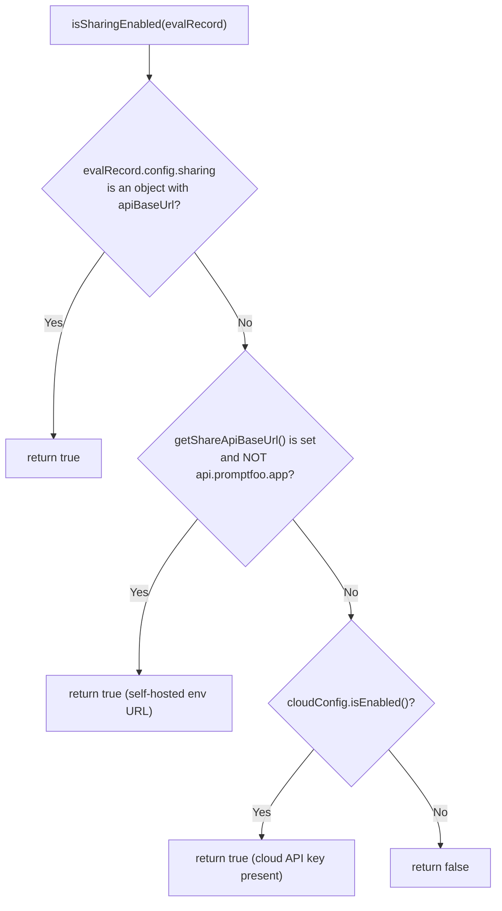

**Sources:** [src/share.ts:53-73](), [src/globalConfig/cloud.ts:178-180]()

The function reads from three sources in priority order:

1. **Eval config object** — `evalRecord.config.sharing.apiBaseUrl` being set signals a self-hosted target [src/share.ts:54-55]().
2. **Environment variable** — `getShareApiBaseUrl()` returning a non-default URL signals a self-hosted target [src/share.ts:64-66]().
3. **Cloud config** — `cloudConfig.isEnabled()` returns `true` when a `PROMPTFOO_API_KEY` or stored API key is present [src/share.ts:68-70]().

---

## API Endpoint Selection

`getApiConfig(evalRecord)` [src/share.ts:557-575]() determines which API endpoint to use:

| Mode | Endpoint | Auth |
|---|---|---|
| Cloud (`cloudConfig.isEnabled()`) | `{cloudConfig.getApiHost()}/api/v1/results` | `Authorization: Bearer {apiKey}` |
| Self-hosted | `{evalRecord.config.sharing.apiBaseUrl ?? getShareApiBaseUrl()}/api/eval` | None |

**Sources:** [src/share.ts:557-575](), [src/globalConfig/cloud.ts:198-200]()

---

## createShareableUrl

**Signature:** `createShareableUrl(evalRecord: Eval, options: ShareOptions): Promise<string | null>` [src/share.ts:609-652]()

**Upload Flow Diagram:**

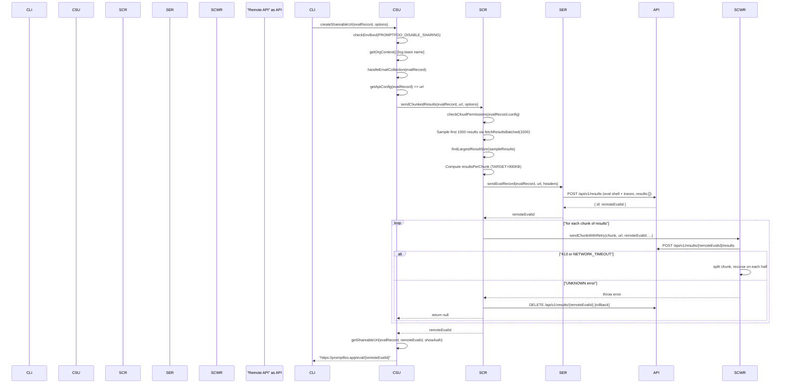

**Sources:** [src/share.ts:609-652](), [src/share.ts:368-514](), [src/share.ts:137-211]()

---

## Chunked Upload: sendChunkedResults

`sendChunkedResults(evalRecord, url, options)` [src/share.ts:368-514]() manages the full upload lifecycle:

### Chunk Size Calculation

```
TARGET_CHUNK_SIZE = 900 KB (0.9 * 1024 * 1024 bytes)
resultsPerChunk = max(1, floor(TARGET_CHUNK_SIZE / largestResultSizeInSample))
```

- `findLargestResultSize()` [src/share.ts:115-122]() samples up to 1,000 results to find the maximum serialized byte size.
- The env var `PROMPTFOO_SHARE_CHUNK_SIZE` (read via `getEnvInt`) overrides this calculation when set to a positive integer [src/share.ts:398-403]().

### Blob Inlining

If `isBlobStorageEnabled()` and `PROMPTFOO_SHARE_INLINE_BLOBS` is set (defaults to `true` when cloud is disabled), blob references in results are resolved inline before upload via `inlineBlobRefsForShare()` [src/share.ts:379-390]().

### Progress Reporting

A `cliProgress.SingleBar` is shown unless any of [src/share.ts:430-435]():
- Debug logging is enabled (`isDebugEnabled()`)
- Running in CI (`isCI()`)
- `silent` option is `true`

---

## Adaptive Retry: sendChunkWithRetry

`sendChunkWithRetry(chunk, url, evalId, headers, config, onProgress, depth, maxDepth)` [src/share.ts:274-349]() implements recursive binary splitting on retryable errors.

**Retry Decision Tree:**

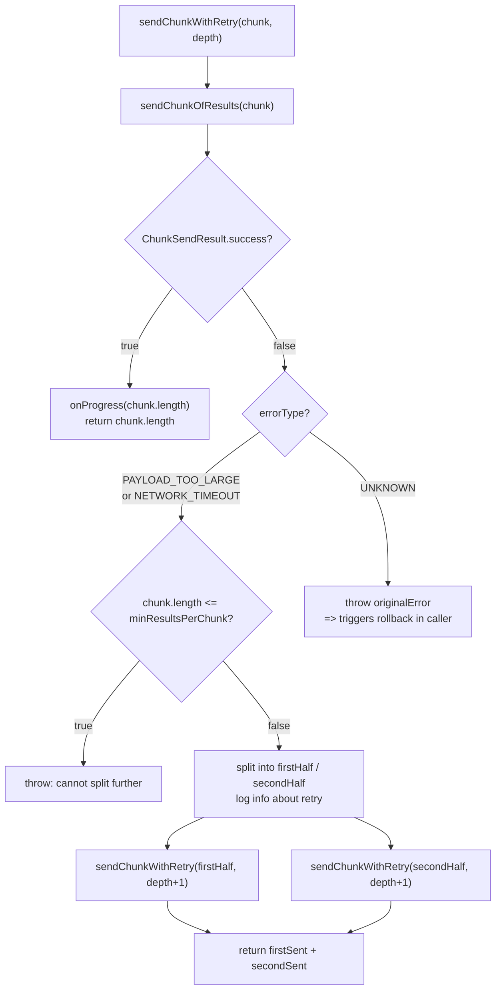

**Sources:** [src/share.ts:274-349]()

**Max depth** is computed as `ceil(log2(chunk.length / minResultsPerChunk)) + 1` — allowing splits all the way down to a single result [src/share.ts:451-452](). `minResultsPerChunk` is always `1`.

**Error classification** in `sendChunkOfResults()` [src/share.ts:213-268]():

| HTTP status / exception | `ChunkSizeError` | Behavior |
|---|---|---|
| `413 Payload Too Large` | `PAYLOAD_TOO_LARGE` | Recursive split and retry |
| `TypeError('fetch failed')` | `NETWORK_TIMEOUT` | Recursive split and retry |
| Any other non-OK status | `UNKNOWN` | Throw immediately, triggers rollback |

---

## Rollback

`rollbackEval(url, evalId, headers)` [src/share.ts:351-366]() issues a `DELETE` to `{url}/{evalId}`. It is called from `sendChunkedResults` catch block only when an `evalId` was already assigned (i.e., the initial `sendEvalRecord` succeeded before a chunk failed) [src/share.ts:503-505](). Rollback failures are logged as warnings but do not re-throw.

---

## URL Generation

**Domain resolution** is handled by `determineShareDomain(eval_)` [src/share.ts:91-108]():

| Priority | Source |
|---|---|
| 1 (highest) | `cloudConfig.getAppUrl()` when cloud is enabled [src/share.ts:100-101]() |
| 2 | `eval_.config.sharing.appBaseUrl` [src/share.ts:102-103]() |
| 3 | `PROMPTFOO_REMOTE_APP_BASE_URL` env var [src/share.ts:97]() |
| 4 (default) | `getDefaultShareViewBaseUrl()` → `https://promptfoo.app` [src/share.ts:104]() |

**Final URL format** in `getShareableUrl()` [src/share.ts:583-601]():

| Scenario | URL pattern |
|---|---|
| Cloud enabled | `{cloudConfig.getAppUrl()}/eval/{remoteEvalId}` |
| Default share view / no custom domain | `{domain}/eval/{remoteEvalId}` |
| Custom self-hosted domain | `{domain}/eval/?evalId={remoteEvalId}` |

`stripAuthFromUrl(urlString)` [src/share.ts:527-537]() strips any embedded `user:password@` from the URL before returning it, unless `showAuth: true` is passed. This behavior prevents accidental credential leakage.

---

## Idempotency: hasEvalBeenShared

`hasEvalBeenShared(eval_: Eval): Promise<boolean>` [src/share.ts:659-687]() is called by the CLI share command before re-uploading [src/commands/share.ts:172](). It uses `makeCloudRequest` to `GET results/{eval_.id}` (with optional `?teamId=` scope) and interprets HTTP 200 as already-shared, 404 as not-shared.

This check is only available when cloud is enabled; self-hosted instances always re-upload.

---

## Email Collection

`handleEmailCollection(evalRecord)` [src/share.ts:539-555]() prompts for a work email on first share in interactive terminals [src/share.ts:544-547](). The email is stored via `setUserEmail()` and written to `evalRecord.author` before saving [src/share.ts:549-552]().

---

## Initial Eval Record Payload

`sendEvalRecord()` [src/share.ts:137-211]() POSTs:
```
{ ...evalRecord, results: [], traces: [...] }
```
- Results are excluded from the initial POST — they are sent separately as chunks [src/share.ts:153]().
- Traces are fetched via `evalRecord.getTraces()` and included in the initial payload [src/share.ts:143]().
- When cloud is enabled and a `currentTeamId` is set, it is injected into `config.metadata.teamId` to route the eval to the correct team [src/share.ts:156-170]().

---

## Function and Module Map

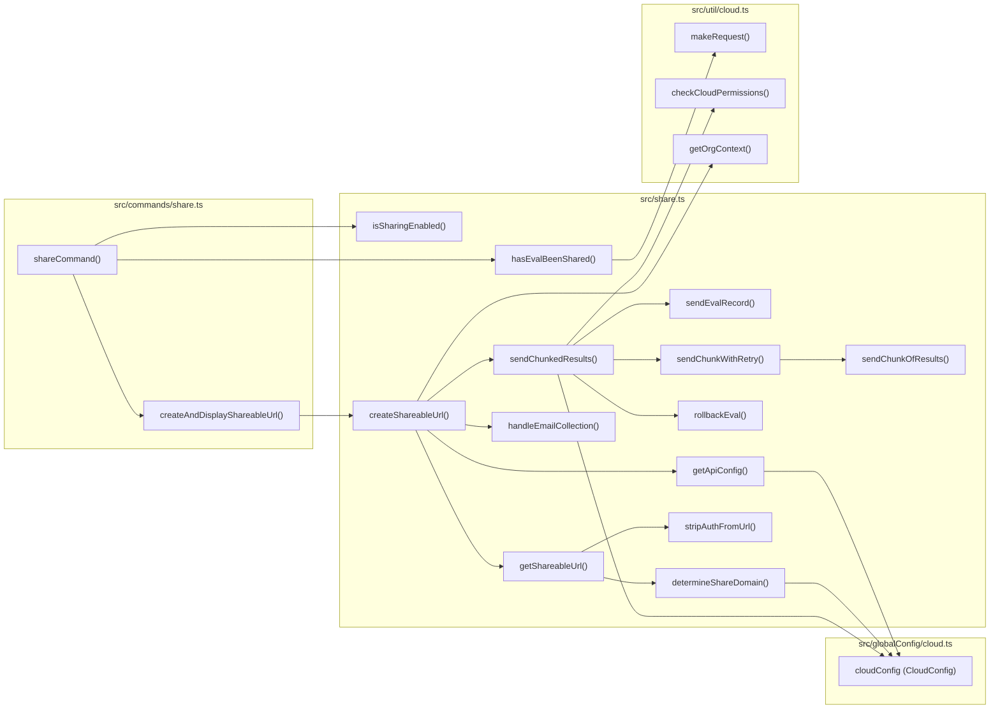

**Sources:** [src/share.ts](), [src/commands/share.ts](), [src/globalConfig/cloud.ts](), [src/util/cloud.ts]()

---

## Relevant Environment Variables

| Variable | Effect |
|---|---|
| `PROMPTFOO_DISABLE_SHARING` | Causes `createShareableUrl` to return `null` immediately [src/share.ts:616]() |
| `PROMPTFOO_SHARE_CHUNK_SIZE` | Overrides calculated `resultsPerChunk` [src/share.ts:398-403]() |
| `PROMPTFOO_REMOTE_APP_BASE_URL` | Custom base URL for the generated shareable link [src/share.ts:97]() |
| `PROMPTFOO_SHARE_INLINE_BLOBS` | Inline blob refs before upload [src/share.ts:380]() |
| `PROMPTFOO_DISABLE_SHARE_EMAIL_REQUEST` | Skip email prompt in `handleEmailCollection` [src/share.ts:540]() |
| `PROMPTFOO_API_KEY` | Enables cloud mode via `cloudConfig` [src/globalConfig/cloud.ts:131]() |

**Sources:** [src/share.ts](), [src/globalConfig/cloud.ts]()

# Cloud Configuration


## Purpose and Scope

The Cloud Configuration system manages authentication, feature detection, and API routing for Promptfoo Cloud integration. This page covers the `CloudConfig` singleton that provides a centralized interface for managing cloud-related functionality including API authentication, URL resolution, and team/organization context. It also documents the `auth` command suite, identity management via `accounts.ts`, and the `makeRequest` utility for authenticated cloud communication.

For information about sharing evaluation results to cloud or self-hosted instances, see [Sharing System (7.1)](). For model audit sharing specifically, see [Model Audit Sharing (7.3)]().

## Cloud Configuration Module

The `CloudConfig` class, instantiated as a singleton `cloudConfig`, is located at `src/globalConfig/cloud.ts`. It manages the persistence of cloud credentials and context within the global Promptfoo configuration file.

### Core Implementation

The class maintains an internal state synced with the global configuration file via `readGlobalConfig` and `writeGlobalConfigPartial` [src/globalConfig/cloud.ts:103-124]().

| Method | Return Type | Purpose |
|--------|-------------|---------|
| `isEnabled()` | `boolean` | Determines if Promptfoo Cloud integration is active based on the presence of an API key [src/globalConfig/cloud.ts:178-180](). |
| `getApiHost()` | `string` | Returns the cloud API base URL, defaulting to `https://api.promptfoo.app` [src/globalConfig/cloud.ts:198-200](). |
| `getAuthHeaderName()` | `string` | Returns the header name (default `Authorization`) used for cloud auth [src/globalConfig/cloud.ts:207-209](). |
| `getApiKey()` | `string \| undefined` | Returns the API key from config or `PROMPTFOO_API_KEY` env var [src/globalConfig/cloud.ts:194-196](). |
| `getCurrentTeamId(orgId?)` | `string \| undefined` | Returns the active team context for a specific organization [src/globalConfig/cloud.ts:251-264](). |

Sources: [src/globalConfig/cloud.ts:94-209](), [src/globalConfig/cloud.ts:251-264]()

### Data Flow and Code Entities

The following diagram bridges the natural language requirements to the specific code entities responsible for cloud configuration.

**Cloud Configuration Entity Mapping**
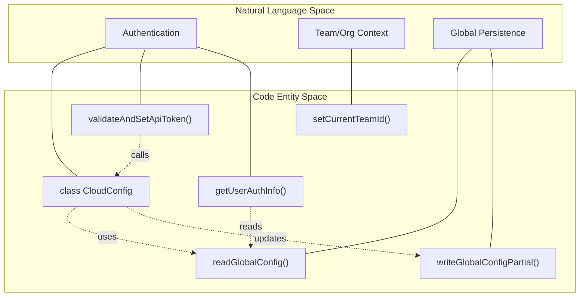
Sources: [src/globalConfig/cloud.ts:94-124](), [src/globalConfig/cloud.ts:237-249](), [src/globalConfig/accounts.ts:51-61]()

## Identity and Account Management

Identity management is handled in `src/globalConfig/accounts.ts`, which abstracts user-level details like emails and unique identifiers.

### User Authentication Info
The `getUserAuthInfo()` function provides a snapshot of the current user's status by reading the global configuration [src/globalConfig/accounts.ts:51-61]().

```typescript
export function getUserAuthInfo(): UserAuthInfo {
  const globalConfig = readGlobalConfig();
  const email = globalConfig?.account?.email || null;
  const isLoggedIntoCloud = !!(globalConfig?.cloud?.apiKey || process.env.PROMPTFOO_API_KEY);

  return {
    email,
    isLoggedIntoCloud,
    authMethod: isLoggedIntoCloud ? 'api-key' : email ? 'email' : 'none',
  };
}
```
Sources: [src/globalConfig/accounts.ts:51-61]()

### User Identification
Each installation is assigned a unique UUID via `getUserId()`. If no ID exists in the global config, one is generated and persisted [src/globalConfig/accounts.ts:63-73](). This ID is used as the `distinctId` for telemetry events [src/telemetry.ts:67-69]().

## API Key Management

### Validation and Persistence
The `validateAndSetApiToken` method is the entry point for establishing a cloud session. It verifies the token and retrieves associated metadata (user, organization, app, and license status) [src/globalConfig/cloud.ts:237-249]().

```typescript
// src/globalConfig/cloud.ts
async validateAndSetApiToken(token: string, apiHost?: string, authHeaderName?: string) {
  const { user, organization, app, hasActiveLicense } = await this.validateApiToken(
    token,
    apiHost,
    authHeaderName,
  );
  this.saveValidatedApiToken(token, apiHost, user, app, hasActiveLicense, authHeaderName);
  return { user, organization, app, hasActiveLicense };
}
```
Sources: [src/globalConfig/cloud.ts:237-249]()

### Sharing Preference Logic
Promptfoo implements a grandfathering policy for auto-sharing. Users created before `2026-03-09T00:00:00Z` (`SHARING_CUTOFF_DATE`) are grandfathered into auto-sharing even if they lack an active license [src/globalConfig/cloud.ts:13, 188-211]().

## Authentication Commands

The CLI `auth` command (implemented in `src/commands/auth.ts`) provides the user interface for managing cloud identity.

### Command Structure
- `login`: Supports `--api-key` for direct token entry or interactive browser login via `openAuthBrowser` [src/commands/auth.ts:223-273]().
- `logout`: Calls `cloudConfig.delete()` and clears the local email to purge credentials [src/commands/auth.ts:468-473]().
- `whoami`: Displays current identity and active team/organization context [src/commands/auth.ts:475-507]().
- `teams`: Allows users to switch their active team context within an organization [src/commands/auth.ts:509-519]().

**Authentication Sequence**
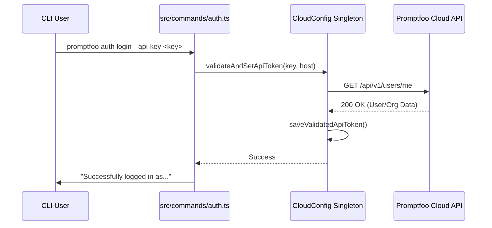
Sources: [src/commands/auth.ts:223-250](), [src/globalConfig/cloud.ts:213-249]()

## Team and Organization Context

Promptfoo Cloud supports multi-tenancy through Organizations and Teams. The `CloudConfig` state tracks these contexts to ensure evaluations and providers are associated with the correct entity.

### Context Resolution
When a user logs in, the CLI attempts to resolve the team context via `setupTeamContext` [src/commands/auth.ts:120-207]():
1. If a team is specified via `--team`, it is validated against accessible teams [src/commands/auth.ts:145-150]().
2. If only one team exists in the organization, it is automatically selected [src/commands/auth.ts:151-152]().
3. In interactive mode with multiple teams, the user selects one via a searchable list [src/commands/auth.ts:162-189]().
4. The selection is persisted via `setCurrentTeamId` [src/globalConfig/cloud.ts:276-285]().

## Cloud Utility: makeRequest

The `makeRequest` utility in `src/util/cloud.ts` is the standard way to perform authenticated calls to the cloud API [src/util/cloud.ts:27-43]().

```typescript
// src/util/cloud.ts
export function makeRequest(path: string, method: string, body?: any): Promise<Response> {
  const apiHost = cloudConfig.getApiHost();
  const url = `${apiHost}/api/v1/${path.startsWith('/') ? path.slice(1) : path}`;
  try {
    return fetchWithProxy(url, {
      method,
      body: JSON.stringify(body),
      headers: { ...(cloudConfig.getAuthHeaders() ?? {}), 'Content-Type': 'application/json' },
    });
  } catch (e) {
    logger.error(`[Cloud] Failed to make request to ${url}: ${e}`);
    throw e;
  }
}
```
Sources: [src/util/cloud.ts:27-43]()

## Configuration Summary Table

| Config Key | Code Accessor | Default Value | Env Var Override |
|------------|---------------|---------------|------------------|
| `apiHost` | `getApiHost()` | `https://api.promptfoo.app` | `PROMPTFOO_CLOUD_API_URL` [src/globalConfig/cloud.ts:4, 150]() |
| `apiKey` | `getApiKey()` | `undefined` | `PROMPTFOO_API_KEY` [src/globalConfig/cloud.ts:131]() |
| `authHeader` | `getAuthHeaderName()` | `Authorization` | `PROMPTFOO_CLOUD_AUTH_HEADER` [src/globalConfig/cloud.ts:175]() |
| `appUrl` | `getAppUrl()` | `https://www.promptfoo.app` | N/A [src/globalConfig/cloud.ts:115]() |

Sources: [src/globalConfig/cloud.ts:4-10](), [src/globalConfig/cloud.ts:112-176]()