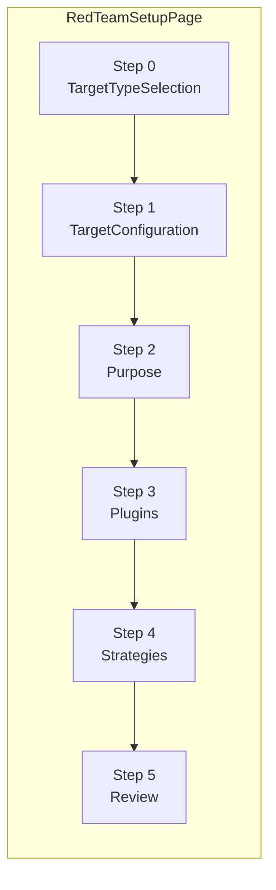
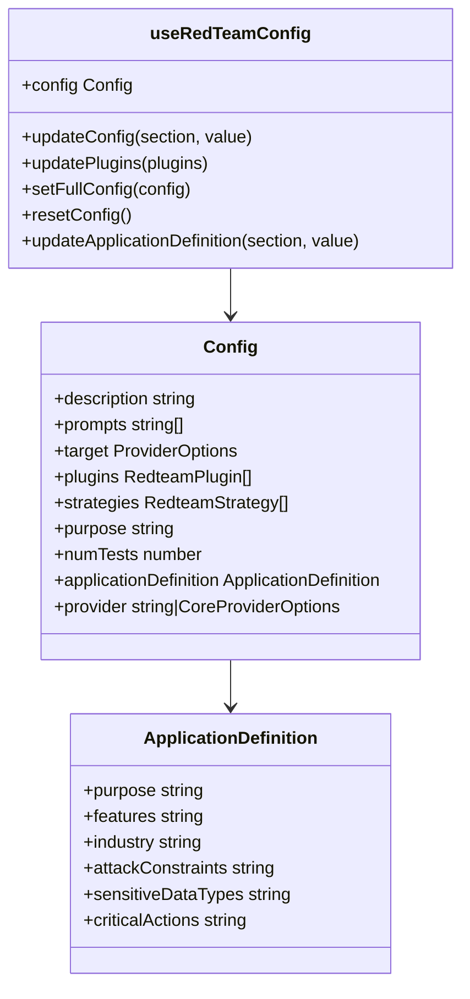

This page documents the multi-step red team configuration wizard in the promptfoo web application. It covers the page component, its Zustand state store, the plugins selection interface, and the review/run step. For the underlying red team system that generates and executes the attacks, see [Red Team Architecture](#5.1). For the backend API endpoints that this UI calls, see [Backend Server](#6.6). For the Zustand stores used elsewhere in the app, see [State Management](#6.3).

---

## Overview

The red team setup UI is a six-step wizard that guides a user from choosing a target, through describing the application, selecting plugins and strategies, and finally running an evaluation. It lives entirely under `src/app/src/pages/redteam/setup/`.

The wizard state is held in a persisted Zustand store (`useRedTeamConfig`) so that configuration survives page refreshes and tab navigation. On the final step, the UI submits the configuration to the backend via `/redteam/run`, polls for job status, and displays live logs.

---

## Wizard Steps and Routing

**Wizard step routing diagram**

The top-level component `RedTeamSetupPage` in [src/app/src/pages/redteam/setup/page.tsx:124]() uses a numeric `value` state (0–5) to control which step is visible. The current step is persisted in the URL hash (`#0` through `#5`), enabling browser back/forward navigation [src/app/src/pages/redteam/setup/page.tsx:131-134]().

Step configuration is defined in `TAB_CONFIG` at [src/app/src/pages/redteam/setup/page.tsx:109-122]():

| Step | Label | Icon | Component |
|------|-------|------|-----------|
| 0 | Target Type | `Crosshair` | `TargetTypeSelection` |
| 1 | Target Config | `Settings` | `TargetConfiguration` |
| 2 | Application Details | `LayoutGrid` | `Purpose` |
| 3 | Plugins | `Puzzle` | `Plugins` |
| 4 | Strategies | `Brain` | `Strategies` |
| 5 | Review | `ClipboardCheck` | `Review` |

The wizard handles navigation via `handleNext` and `handleBack` functions which update the numeric step and sync the URL hash [src/app/src/pages/redteam/setup/page.tsx:196-202]().

Sources: [src/app/src/pages/redteam/setup/page.tsx:109-202]()

---

## Sidebar Actions

In addition to step navigation, the sidebar provides global actions for configuration management:

| Action | Logic | Backend / Utility |
|--------|-------------|-------------|
| Save | Opens `SaveConfigDialog` | `POST /configs` with `{name, type: 'redteam', config}` |
| Load | Opens `LoadConfigDialog` | `GET /configs?type=redteam`, then `GET /configs/redteam/:id` |
| Reset | Opens `ResetConfigDialog` | Calls `resetConfig()` on the Zustand store |

The **Load Config** functionality also supports importing a YAML file directly. The file is read via `readFileAsText` [src/app/src/pages/redteam/setup/page.tsx:73-80](), parsed with `loadYaml` [src/app/src/pages/redteam/setup/page.tsx:30](), and applied to the store via `setFullConfig()`.

Sources: [src/app/src/pages/redteam/setup/page.tsx:73-155](), [src/app/src/pages/redteam/setup/hooks/useRedTeamConfig.ts:313-324]()

---

## State Management: `useRedTeamConfig`

**State store structure diagram**

`useRedTeamConfig` is a Zustand store with `persist` middleware stored in localStorage under the key `"redTeamConfig"`. It is defined in [src/app/src/pages/redteam/setup/hooks/useRedTeamConfig.ts:7]().

### Key behaviors

- **`updatePlugins(plugins)`**: Merges the incoming plugin list while preserving existing configurations for specific plugins. It handles both string IDs and object-based plugin definitions [src/app/src/pages/redteam/setup/components/Plugins.tsx:159-186]().
- **Validation**: The store and associated hooks use `isPlainObject` [src/app/src/pages/redteam/setup/hooks/useRedTeamConfig.ts:69-75]() and `isValidHttpUrlOrTemplate` [src/app/src/pages/redteam/setup/hooks/useRedTeamConfig.ts:139-153]() to ensure configuration integrity before persistence.
- **Target Reconciliation**: Uses `registerTargetConfigReconciler` to synchronize UI state with the underlying provider configuration [src/app/src/pages/redteam/setup/hooks/useRedTeamConfig.ts:12]().

A second store, `useRecentlyUsedPlugins`, tracks the last `NUM_RECENT_PLUGINS` (default 6) plugins enabled by the user [src/app/src/pages/redteam/setup/hooks/useRedTeamConfig.ts:19-24]().

Sources: [src/app/src/pages/redteam/setup/hooks/useRedTeamConfig.ts](), [src/app/src/pages/redteam/setup/types.ts]()

---

## Step 0 & 1: Target Setup

The target configuration is split into two phases:
1.  **Target Type Selection** (`TargetTypeSelection`): The user selects the provider type from a categorized list including "My Application", "Agent Frameworks", and "AI Providers" [src/app/src/pages/redteam/setup/components/Targets/ProviderTypeSelector.tsx:30-248]().
2.  **Target Configuration** (`Targets`): Detailed configuration of the selected provider using `ProviderEditor` [src/app/src/pages/redteam/setup/components/Targets/index.tsx:189-190]().

### HTTP Endpoint Configuration
The `HttpEndpointConfiguration` component provides a specialized UI for REST APIs [src/app/src/pages/redteam/setup/components/Targets/HttpEndpointConfiguration.tsx:92]():
- **Connection**: URL and Method selection [src/app/src/pages/redteam/setup/components/Targets/HttpEndpointConfiguration.tsx:157-166]().
- **Authentication**: Header management [src/app/src/pages/redteam/setup/components/Targets/HttpEndpointConfiguration.tsx:108-113]().
- **Validation**: A `handleTestTarget` function calls `/providers/test` to verify connectivity and configuration [src/app/src/pages/redteam/setup/components/Targets/HttpEndpointConfiguration.tsx:169-215]().

### Foundation Model Configuration
Supports major providers like OpenAI, Anthropic, and Google. It maps user-friendly names to internal provider IDs like `openai:chat:gpt-4o` or `anthropic:messages:claude-3-5-sonnet-latest` [src/app/src/pages/redteam/setup/hooks/useRedTeamConfig.ts:25-45]().

Sources: [src/app/src/pages/redteam/setup/components/Targets/HttpEndpointConfiguration.tsx](), [src/app/src/pages/redteam/setup/components/Targets/ProviderTypeSelector.tsx](), [src/app/src/pages/redteam/setup/components/Targets/index.tsx]()

---

## Step 2: Application Details (`Purpose`)

The `Purpose` component [src/app/src/pages/redteam/setup/components/Purpose.tsx:83]() collects context about the application.

### Auto-Discovery
The UI integrates with the Target Discovery Agent. `handleTargetPurposeDiscovery` calls `POST /providers/discover` [src/app/src/pages/redteam/setup/components/Purpose.tsx:164-186](). Results are rendered via `DiscoveryResult` components, allowing users to "Apply" discovered features or purpose statements directly to their configuration [src/app/src/pages/redteam/setup/components/Purpose.tsx:34-78]().

### Completion Tracking
The UI calculates a completion percentage for each application section (e.g., "Core Application Details", "Access & Permissions") based on which fields in `ApplicationDefinition` are populated [src/app/src/pages/redteam/setup/components/Purpose.tsx:123-152]().

Sources: [src/app/src/pages/redteam/setup/components/Purpose.tsx](), [src/app/src/pages/redteam/setup/types.ts:44-65]()

---

## Step 3: Plugins (`Plugins` and `PluginsTab`)

### `Plugins` component
The `Plugins` container [src/app/src/pages/redteam/setup/components/Plugins.tsx:107]() manages the high-level tabs:
- **Plugins**: Modular vulnerability tests [src/app/src/pages/redteam/setup/components/Plugins.tsx:43-60]().
- **Custom Intents**: Seed phrases for attack generation [src/app/src/pages/redteam/setup/components/Plugins.tsx:61-97]().
- **Custom Policies**: Rules for AI adherence testing [src/app/src/pages/redteam/setup/components/Plugins.tsx:98-104]().

### `PluginsTab` component
`PluginsTab` [src/app/src/pages/redteam/setup/components/PluginsTab.tsx:179]() provides:
- **Presets**: Groups like `Recommended`, `NIST`, and `OWASP LLM Top 10` [src/app/src/pages/redteam/setup/components/PluginsTab.tsx:77-142]().
- **Enterprise Mappings**: Specific regulatory frameworks like `EU AI Act` or `DoD AI Ethical Principles` [src/app/src/pages/redteam/setup/components/PluginsTab.tsx:131-150]().
- **Configuration**: Certain plugins (e.g., `indirect-prompt-injection`) trigger a `PluginConfigDialog` [src/app/src/pages/redteam/setup/components/PluginsTab.tsx:206-207]().

Sources: [src/app/src/pages/redteam/setup/components/Plugins.tsx](), [src/app/src/pages/redteam/setup/components/PluginsTab.tsx]()

---

## Step 4: Strategies (`Strategies`)

The `Strategies` component [src/app/src/pages/redteam/setup/components/Strategies.tsx:73]() handles the selection of attack methodologies.

- **Hero Strategies**: High-impact strategies like `jailbreak` and `prompt-injection` [src/app/src/pages/redteam/setup/components/strategies/HeroStrategiesSection.tsx:29]().
- **Multi-turn & Agentic**: Specialized categories for testing conversational state and tool-use capabilities [src/app/src/pages/redteam/setup/components/Strategies.tsx:130-140]().
- **Gating**: Strategies requiring remote generation (e.g., `gcg`) are disabled if `apiHealthStatus` is 'disabled' [src/app/src/pages/redteam/setup/components/Strategies.tsx:93-104]().

Sources: [src/app/src/pages/redteam/setup/components/Strategies.tsx]()

---

## Step 5: Review (`Review`)

The `Review` component [src/app/src/pages/redteam/setup/components/Review.tsx:160]() provides the final interface for execution.

### Execution Pipeline
1. **Validation**: Checks for target configuration errors via `useRedTeamTargetConfigValidation` [src/app/src/pages/redteam/setup/components/Review.tsx:167]().
2. **Unified Config**: Generates the final YAML-compatible configuration using `getUnifiedConfig` [src/app/src/pages/redteam/setup/components/Review.tsx:41]().
3. **Job Management**: Submits the run to the backend and tracks the `jobId` in `useRedteamJobStore` [src/app/src/pages/redteam/setup/components/Review.tsx:173]().
4. **Monitoring**: Displays live logs via `LogViewer` and progress estimations [src/app/src/pages/redteam/setup/components/Review.tsx:50-51]().

### YAML Export
The `generateOrderedYaml` utility [src/app/src/pages/redteam/setup/utils/yamlHelpers.ts:59]() ensures that the exported configuration follows the standard `promptfooconfig.yaml` structure, ordering keys like `description`, `targets`, `plugins`, and `strategies` correctly.

Sources: [src/app/src/pages/redteam/setup/components/Review.tsx](), [src/app/src/pages/redteam/setup/page.tsx:59]()