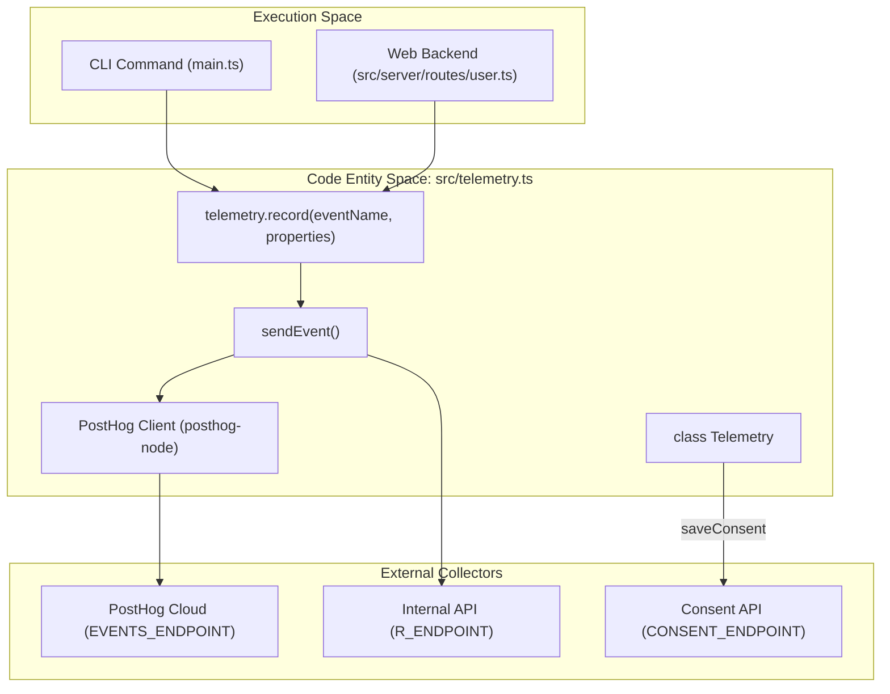
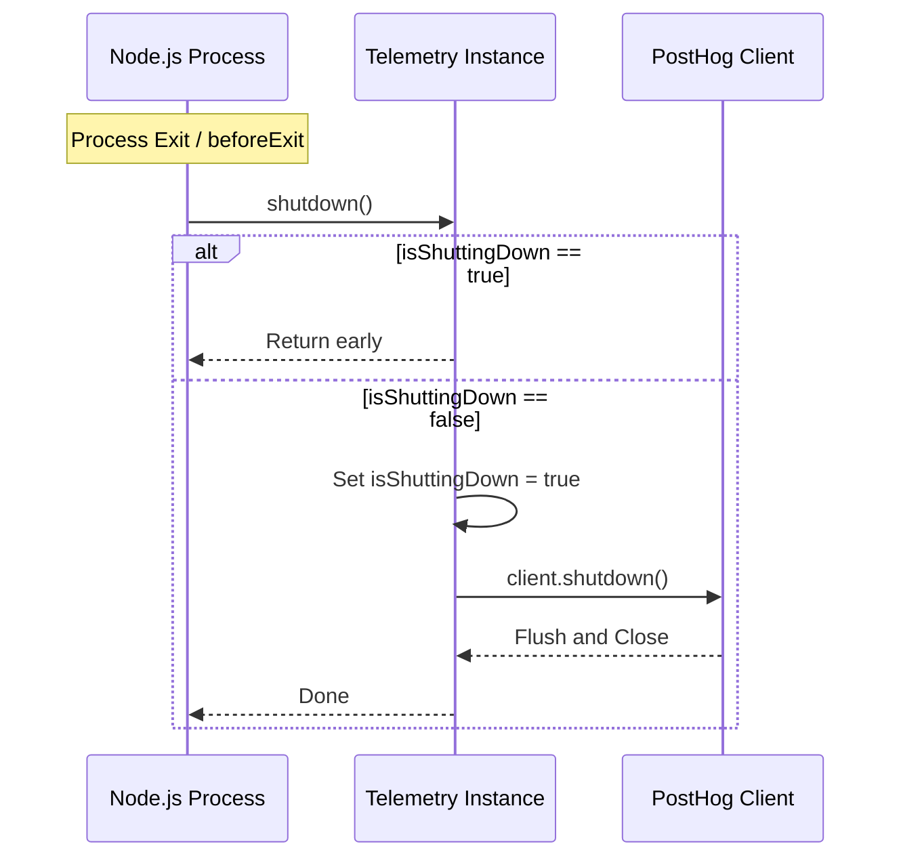
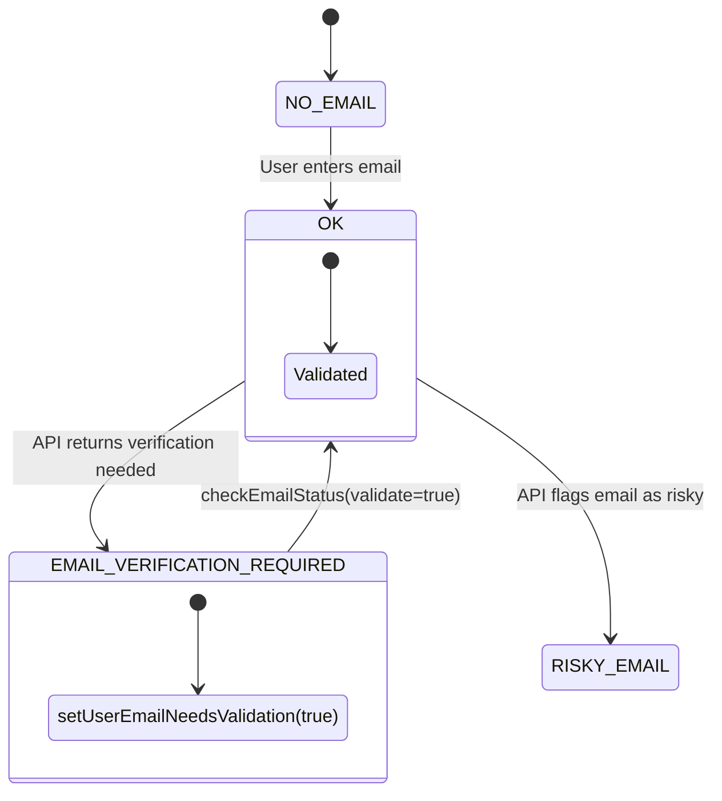
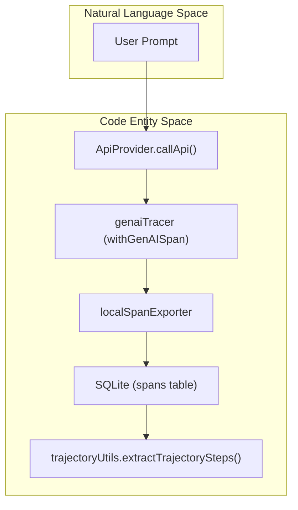
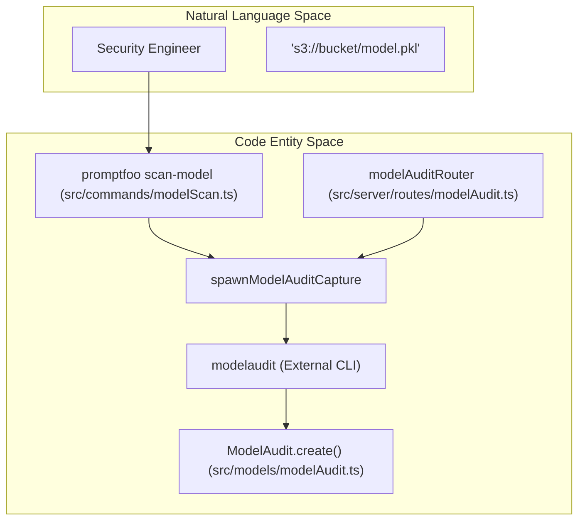
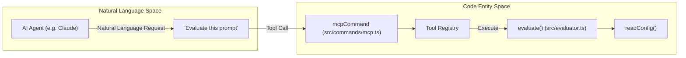

The promptfoo telemetry system is designed to collect anonymized usage data to improve the tool's performance and identify popular features. It employs a multi-channel approach, sending events to both **PostHog** and a custom internal endpoint, while providing strict controls for user privacy and environment-specific behavior.

## System Architecture

The telemetry system is centered around the `Telemetry` class, which manages user identification, event recording, and graceful shutdown of tracking clients.

### Telemetry Data Flow

The following diagram illustrates how an event triggered in the CLI or Web UI flows through the `Telemetry` class to external collectors.

**Telemetry Event Pipeline**

**Sources:** [src/telemetry.ts:117-124](), [src/telemetry.ts:126-175](), [src/telemetry.ts:201-221](), [src/server/routes/user.ts:65-72]()

## Key Components

### The Telemetry Class
The `Telemetry` class is the primary interface for recording analytics. It is typically instantiated as a singleton.

- **`initialize()`**: Associates the current session with a unique user ID retrieved via `getUserId()` and triggers the identity sequence [src/telemetry.ts:63-69]().
- **`identify()`**: Associates the current session with user properties such as email and CI status. It calls `client.identify` on the PostHog instance [src/telemetry.ts:84-104]().
- **`record(eventName, properties)`**: The main entry point for logging. If telemetry is disabled via environment variables, it calls `recordTelemetryDisabled()` to log the opt-out status once [src/telemetry.ts:117-124]().
- **`sendEvent()`**: Orchestrates the delivery of data. It appends runtime metadata (Node version, platform, arch) and package version before sending to PostHog and the internal `R_ENDPOINT` via `fetchWithProxy` [src/telemetry.ts:126-175]().

### Account and Identity Management
Identity is managed via the `globalConfig/accounts.ts` utilities, which interact with the user's global configuration file.

- **User ID**: A persistent UUID is stored in the global configuration. If missing, `getUserId()` generates a new one using `crypto.randomUUID()` and persists it via `writeGlobalConfig` [src/globalConfig/accounts.ts:63-73]().
- **User Properties**: The `getPersonProperties()` method aggregates data from `getUserAuthInfo()`, including the user's email, cloud login status, and the `authMethod` (`api-key`, `email`, or `none`) [src/telemetry.ts:76-82](), [src/globalConfig/accounts.ts:51-61]().

### PostHog Integration
Promptfoo uses the `posthog-node` library. The client is configured with specific settings to ensure CLI performance and prevent process hangs:
- **`flushInterval: 0`**: Disables the internal automatic flush timer. Without this, PostHog's internal `setInterval` keeps the Node.js event loop alive indefinitely, causing processes that import promptfoo to hang [src/telemetry.ts:25-34]().
- **Immediate Flushing**: Events are sent immediately, and `client.flush()` is called after each capture to ensure data is transmitted before the CLI command completes [src/telemetry.ts:139-152]().

**Sources:** [src/telemetry.ts:18-40](), [src/globalConfig/accounts.ts:51-73]()

## Data Collection and Anonymization

The system collects specific event properties alongside a standard set of runtime metadata.

| Data Type | Fields | Source |
| :--- | :--- | :--- |
| **Identity** | `distinctId` (UUID), `email` | [src/telemetry.ts:94](), [src/globalConfig/accounts.ts:53]() |
| **Runtime** | `nodeVersion`, `platform`, `arch`, `packageVersion` | [src/telemetry.ts:44-51](), [src/telemetry.ts:131]() |
| **Environment** | `isRunningInCi`, `NODE_ENV` | [src/telemetry.ts:132](), [src/telemetry.ts:165]() |
| **Auth Context** | `isLoggedIntoCloud`, `authMethod` | [src/globalConfig/accounts.ts:51-61]() |

### Telemetry Control

Users can opt-out of telemetry using environment variables.

| Variable | Effect |
| :--- | :--- |
| `PROMPTFOO_DISABLE_TELEMETRY` | Disables PostHog initialization and prevents `sendEvent` from firing [src/telemetry.ts:19-21](), [src/telemetry.ts:106-108](). |
| `IS_TESTING` | Blocks telemetry in test environments to prevent network calls during CI/unit tests [src/telemetry.ts:19-21](), [src/telemetry.ts:137](). |

**Sources:** [src/telemetry.ts:19-21](), [src/telemetry.ts:106-108]()

## Implementation Details

### Process Lifecycle and Shutdown
The telemetry system provides a shutdown mechanism to ensure the PostHog client is properly closed when the process exits.

**Shutdown Logic**

The `shutdown()` method uses an `isShuttingDown` flag to guard against multiple calls from `beforeExit` and explicit CLI shutdown handlers [src/telemetry.ts:177-196]().

### Red Team Consent and Email Validation
A specialized endpoint `CONSENT_ENDPOINT` is used specifically for redteaming. This is triggered when a user provides their email for "harmful" plugin synthesis or logs into the Web UI [src/telemetry.ts:201-221]().

The system also performs email status checks via `checkEmailStatus`, which communicates with the Promptfoo API to verify if an email is risky, disposable, or requires verification. In CI environments, a synthetic placeholder `CI_PLACEHOLDER_EMAIL` is used to bypass interactive prompts [src/globalConfig/accounts.ts:161-184]().

**Email Validation State Machine**

**Sources:** [src/telemetry.ts:177-196](), [src/telemetry.ts:201-221](), [src/globalConfig/accounts.ts:161-213](), [src/types/email.ts:1-15]()

# Advanced Features

This section provides an overview of the advanced capabilities within the promptfoo ecosystem that extend beyond standard evaluation and red teaming. These features include deep observability through OpenTelemetry, static security analysis for machine learning models, automated code vulnerability scanning, and agentic integration via the Model Context Protocol (MCP).

## 8.1 OpenTelemetry Tracing

Promptfoo integrates with the OpenTelemetry (OTLP) ecosystem to provide deep visibility into LLM provider execution flows. It acts as an **OpenTelemetry receiver**, allowing it to ingest traces from external applications or internal provider calls and visualize them directly in the web UI [site/docs/tracing.md:8-16]().

### Core Components
*   **OTLP Receiver**: Collects traces during evaluation runs to provide visibility into nested calls and tool executions via `src/tracing/otlpReceiver.ts` [src/cliState.ts:60-67]().
*   **GenAI Instrumentation**: Built-in providers are instrumented using `genaiTracer` and `withGenAISpan` to capture standardized attributes like `gen_ai.system`, `gen_ai.request.model`, and token usage [site/docs/tracing.md:68-82]().
*   **Trajectory Assertions**: Analyzes the sequence of spans (e.g., tool calls, reasoning steps) using `extractTrajectorySteps` to verify agent behavior [src/assertions/trajectoryUtils.ts:177-187]().
*   **Trace-Aware Assertions**: Specialized handlers like `handleTrajectoryStepCount`, `handleTrajectoryToolUsed`, and `handleTrajectoryToolSequence` allow for assertions based on the execution path of the underlying trace [test/assertions/trajectory.test.ts:2-7]().

### Trace-to-Code Mapping
The following diagram illustrates how OpenTelemetry spans are processed from a Provider call into the promptfoo persistence layer.

**Trace Ingestion Pipeline**

Sources: [src/tracing/genaiTracer.ts:1-20](), [src/assertions/trajectoryUtils.ts:177-197](), [site/docs/tracing.md:38-43]()

For details, see [OpenTelemetry Tracing](#8.1).

---

## 8.2 Model Audit (ModelAudit)

The `scan-model` command provides static security analysis for machine learning models. It leverages the `modelaudit` library to detect malicious code, unsafe configurations, and backdoors in over 30 model formats [site/docs/model-audit/index.md:2-10]().

### Key Capabilities
*   **Static Analysis**: Scans for dangerous Python opcodes in pickle-based models (`.pkl`, `.pt`) and unsafe Lambda layers in Keras [site/docs/model-audit/scanners.md:39-58]().
*   **Remote Scanning**: Supports scanning models directly from HuggingFace (`hf://`), S3, GCS, and JFrog Artifactory using environment-based authentication [site/docs/model-audit/usage.md:34-62]().
*   **Scanner Management**: Users can list available scanners with `--list-scanners` and selectively run or exclude them via CLI flags [src/commands/modelScan.ts:78-80]().
*   **Web UI**: A dedicated interface at `/model-audit` uses `modelAuditRouter` to manage path checks and scan execution [src/server/routes/modelAudit.ts:21-30]().

**Model Scan Execution Flow**

Sources: [src/commands/modelScan.ts:216-230](), [src/server/routes/modelAudit.ts:195-210](), [site/docs/model-audit/scanners.md:27-35]()

For details, see [Model Audit (ModelAudit)](#8.2).

---

## 8.3 Code Scanning

Code scanning identifies LLM-related security vulnerabilities within application source code, such as insecure prompt construction or unsafe handling of LLM outputs.

### Key Components
*   **CLI Command Group**: Managed via `code-scans` commands for local repository analysis.
*   **GitHub Action**: The `code-scan-action` analyzes `git diff` to identify new risks in pull requests.
*   **Vulnerability Detection**: Identifies patterns that lead to prompt injection or data leakage.
*   **Reporting**: Results are reported back to the CLI or CI environment, often in SARIF format for integration with security dashboards [site/docs/model-audit/usage.md:211-217]().

For details, see [Code Scanning](#8.3).

---

## 8.4 MCP Server

Promptfoo implements a **Model Context Protocol (MCP)** server via `mcpCommand`, allowing AI agents to use promptfoo as a toolset.

### Available Tools
The MCP server exposes several capabilities to agents:
*   `runEvaluation`: Execute evaluations from a configuration.
*   `generateDataset`: Synthesize test cases for a given prompt.
*   `redteamGenerate`: Generate adversarial test cases.
*   `testProvider`: Verify provider connectivity and output.
*   `validatePromptfooConfig`: Perform schema validation on `promptfooconfig.yaml`.

### Architecture
The server supports both `stdio` and `http` transport modes, enabling integration with desktop agents like Claude or remote orchestration services.

**MCP Tool Execution Flow**

Sources: [src/cliState.ts:60-67](), [src/server/routes/modelAudit.ts:123-130]()

For details, see [MCP Server](#8.4).