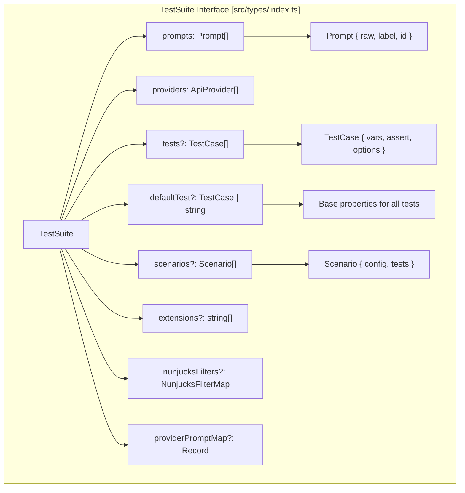
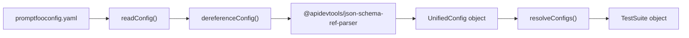
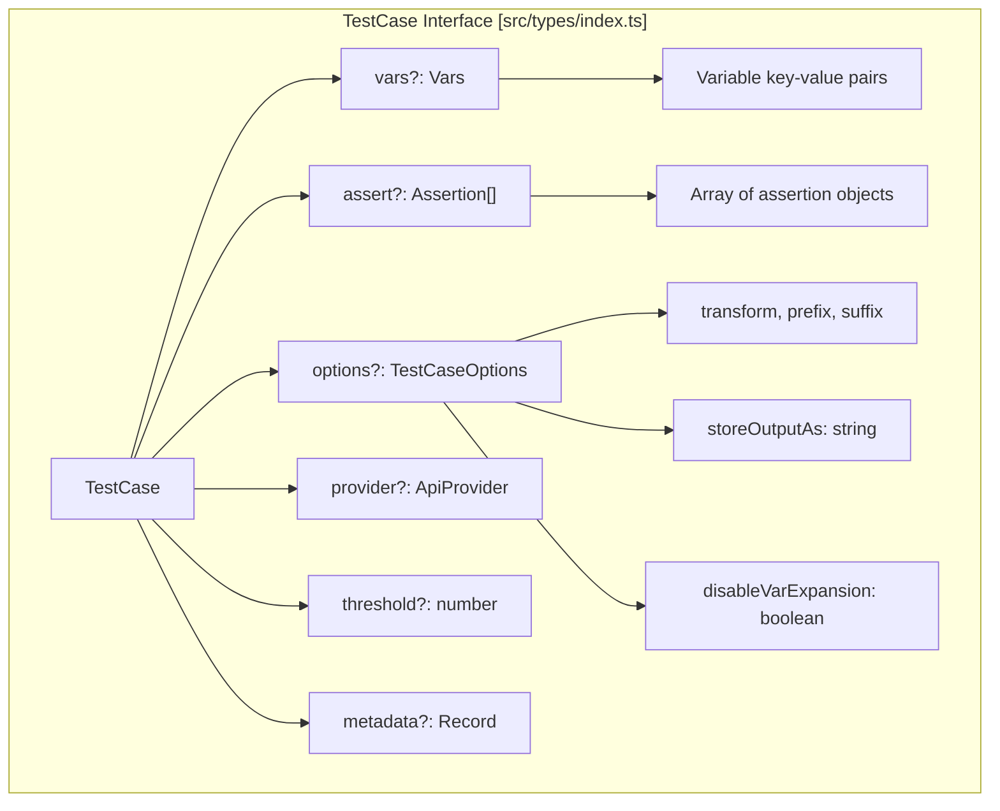
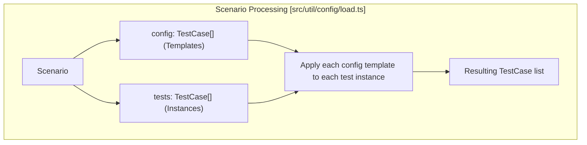

The test suite system defines how evaluations are structured in promptfoo. A test suite consists of prompts, providers, test cases, and configuration options. The system handles variable expansion, test case merging with defaults, and configuration resolution from multiple sources.

For information about how test suites are executed, see [Evaluation Engine](#2.1). For provider configuration, see [Provider System](#3).

## Test Suite Structure

A test suite in promptfoo is defined primarily through the `TestSuite` interface, which specifies prompts, providers, and test cases. The system processes this structure to generate all test combinations.

### TestSuite Core Components

**TestSuite Structure**

Sources: [src/types/index.ts:566-605]()

**Configuration Loading and Dereferencing Pipeline**

Sources: [src/util/config/load.ts:183-228](), [src/util/config/load.ts:439-491]()

### Test Suite YAML Configuration

The `promptfooconfig.yaml` file defines the test suite structure. The schema ensures validation of all evaluation parameters.

| Section | Type | Purpose |
|---------|------|---------|
| `prompts` | `string[]` or `Prompt[]` | Prompt templates to evaluate. Supports `file://` and glob patterns. |
| `providers` | `string[]` or `Provider[]` | LLM providers to test against. |
| `tests` | `TestCase[]` or `string` | Individual test cases with variables and assertions. |
| `defaultTest` | `TestCase` or `string` | Default properties inherited by all tests. |
| `scenarios` | `Scenario[]` | Grouped test configurations for combinatorial testing. |
| `extensions` | `string[]` | Hook functions (JS/Py) for custom behavior. |
| `redteam` | `RedteamConfig` | Configuration for adversarial testing and vulnerability scanning. |

Sources: [src/types/index.ts:566-605](), [site/docs/configuration/guide.md:25-42](), [site/static/config-schema.json:9-69]()

## Test Case Definition

Test cases define the inputs and expected outputs for each evaluation. The `TestCase` interface allows flexible specification of variables, assertions, and test-specific configuration.

### TestCase Structure

**TestCase Components**

Sources: [src/types/index.ts:647-715]()

### Test Case Formats

Promptfoo supports multiple formats for test cases, loaded via `readTests` and `readTest`.

*   **YAML/JSON**: The standard format within the config file.
*   **CSV**: Loaded via `src/csv.ts`. Variables are mapped from columns. [src/csv.ts:127-214]()
*   **External Files**: Using `file://` prefix in the `tests` or `vars` section. [site/docs/configuration/guide.md:131-151]()
*   **HuggingFace**: Loading datasets directly from HuggingFace via `huggingface://`. [site/docs/configuration/parameters.md:110-114]()
*   **Excel (XLSX)**: Supported via the `src/util/xlsx.ts` utility. [src/util/xlsx.ts:7-40]()

Sources: [src/util/testCaseReader.ts:182-273](), [src/util/config/load.ts:46-48]()

## Dereferencing and Merging

The configuration pipeline uses a dereferencing step to resolve `$ref` pointers and external file references before merging configurations.

### The Dereferencing Pipeline

The `dereferenceConfig` function uses `@apidevtools/json-schema-ref-parser` to resolve references. The system includes specific logic to handle environment variables and recursive merging.

1.  **Environment Variable Rendering**: The system renders environment variables in the raw object using `renderEnvOnlyInObject`. [src/util/config/load.ts:39]()
2.  **Dereference**: The `$RefParser.dereference` call resolves all `$ref` and file pointers. This can be disabled by setting `PROMPTFOO_DISABLE_REF_PARSER`. [src/util/config/load.ts:184-187]()
3.  **Sanitization**: Tracing configurations are preserved during the process to ensure credentials aren't leaked or lost. [src/util/config/load.ts:46]()

Sources: [src/util/config/load.ts:183-243]()

### Config Merging with `combineConfigs`

When multiple configuration files are provided via the CLI (e.g., `promptfoo eval -c config1.yaml -c config2.yaml`), the system merges them into a single `UnifiedConfig`.

*   **Prompts**: Concatenated into a single list. [src/util/config/load.ts:349-354]()
*   **Providers**: Concatenated. [src/util/config/load.ts:356-361]()
*   **Tests**: Concatenated. [src/util/config/load.ts:363-368]()
*   **EvaluateOptions**: Shallow merged, with later configs overriding earlier ones. [src/util/config/load.ts:376-381]()

Sources: [src/util/config/load.ts:349-437]()

## defaultTest Merging

The `defaultTest` property provides base configuration that is merged with each individual test case. This merging happens during test suite processing in `resolveConfigs`.

### defaultTest Merge Rules

| Property | Merge Behavior |
|----------|----------------|
| `vars` | Shallow merge - individual test vars override defaults. |
| `assert` | Concatenation - default assertions run first, then test-specific. |
| `options` | Shallow merge - individual options override defaults. |
| `metadata` | Shallow merge - individual metadata overrides defaults. |
| `threshold` | Override - individual threshold takes precedence. |

Sources: [src/util/config/load.ts:316-347](), [src/util/testCaseReader.ts:133-180]()

## Variable Resolution and Expansion

Variables in test cases can be static, file-based, or dynamically generated via scripts.

### Scripted Variables

Variables can be loaded from JavaScript or Python files using the `file://` prefix.
*   **JavaScript**: The file should export a function receiving `(varName, prompt, otherVars, provider)`. [site/docs/configuration/guide.md:215-240]()
*   **Python**: The file should define a `get_var(var_name, prompt, other_vars)` function. [site/docs/configuration/guide.md:242-262]()

Sources: [src/util/config/load.ts:38-40](), [site/docs/configuration/guide.md:191-199]()

### Variable Expansion

If a variable value is an array, promptfoo can expand it into multiple test cases (Cartesian product). This behavior can be disabled globally via environment variables or per-test via the `disableVarExpansion` option in `TestCaseOptions`.

Sources: [src/util/config/load.ts:180-182](), [src/types/index.ts:685]()

## Scenarios

Scenarios allow for high-level grouping and combinatorial testing by applying a set of configurations to a set of tests.

### Scenario Expansion Flow

Sources: [src/types/index.ts:762-767](), [src/util/config/load.ts:103-111]()

## CLI Provider Resolution

When providers are passed via the CLI (`--providers`), `resolveCliProvidersWithConfig` matches these tokens against providers defined in the YAML configuration to preserve their specific configurations (like `temperature` or `max_tokens`).

**Matching Priority**:
1. Exact match on provider `id`. [src/util/config/load.ts:164-167]()
2. Exact match on provider `label`. [src/util/config/load.ts:169-172]()
3. Suffix match (e.g., CLI `llama3.1:8b` matches config `ollama:llama3.1:8b`). [src/util/config/load.ts:174-177]()
4. Fallback to raw string for fresh provider creation. [src/util/config/load.ts:179]()

Sources: [src/util/config/load.ts:146-181]()