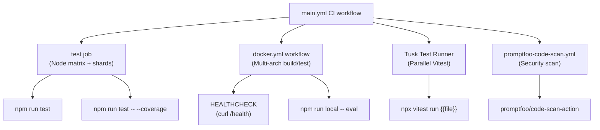
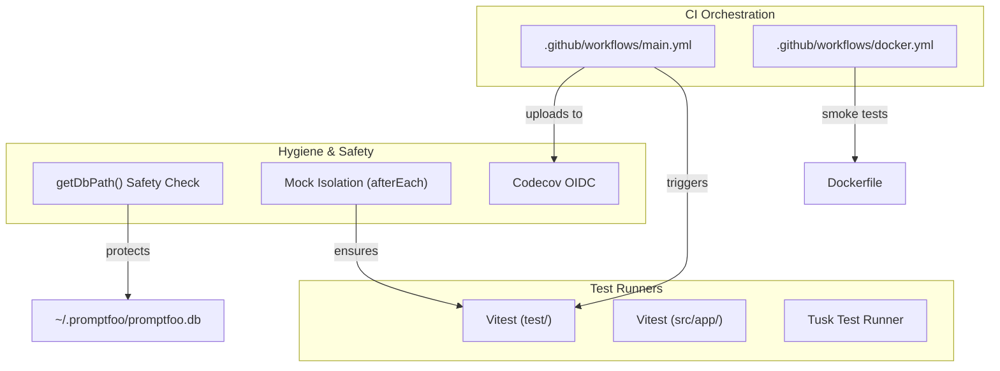
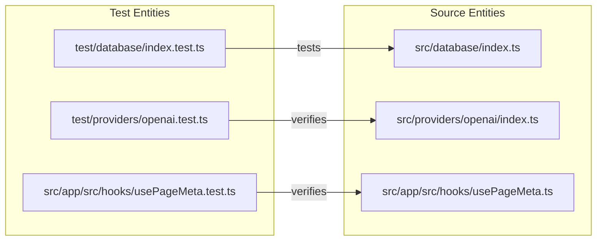
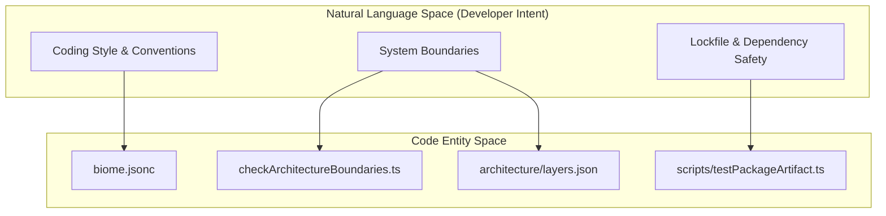
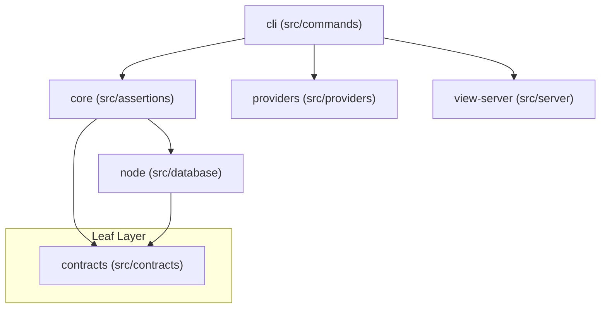
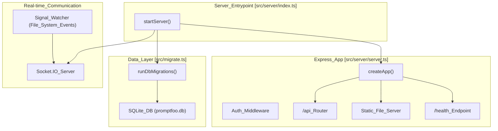
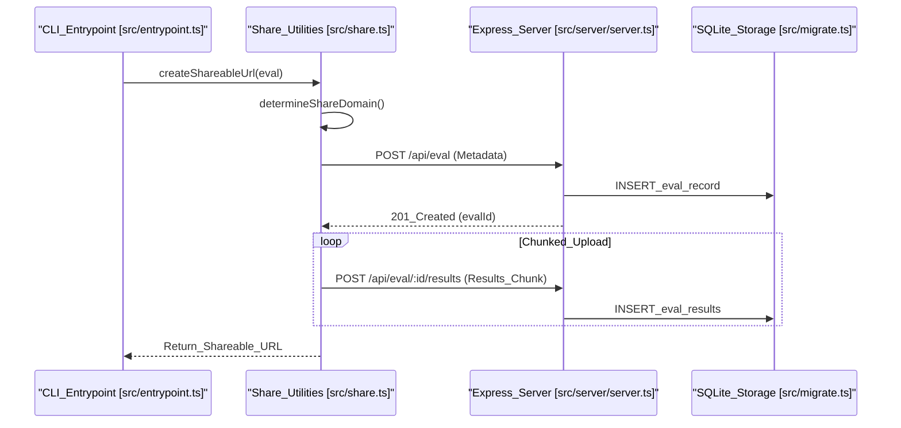

This page documents the testing approach, framework configurations, test categories, coverage reporting, and parallelized execution for the promptfoo codebase. It covers the test suite under `test/`, `src/app/`, and the ancillary language wrappers in `src/python/`, `src/ruby/`, and `src/golang/`.

For information about CI/CD pipelines and release automation, see [Build System and CI/CD](9.1). For code quality tooling (linting, formatting), see [Code Quality](9.3).

---

## Test Frameworks

The codebase uses two test frameworks depending on the layer being tested:

| Layer | Framework | Config Location | Runner Script |
|---|---|---|---|
| Backend (TypeScript core) | Vitest | `vitest.config.ts` (root) | `npm run test` |
| Frontend (React, `src/app`) | Vitest | `src/app/vitest.config.ts` | `npm run test:app` |
| Python utilities | `unittest` (stdlib) | N/A | `python -m unittest discover` |
| Ruby wrapper | Manual script | N/A | `ruby src/ruby/wrapper.rb ...` |
| Go wrapper | `go test` | `src/golang/go.mod` | `go test -v wrapper.go wrapper_test.go` |

Test files in `test/` import directly from `vitest` [test/AGENTS.md:40-43](). The configuration for the primary test suite is defined in `vitest.config.ts` and `vitest.setup.ts`.

Sources: [test/AGENTS.md:7-22](), [vitest.config.ts:1-10](), [vitest.setup.ts:1-5]()

---

## Test Categories

The following diagram maps test categories to their corresponding entry points in CI.

**Test Category to CI Job Mapping**



Sources: [.github/workflows/main.yml:130-132](), [.github/workflows/docker.yml:164-167](), [.github/workflows/promptfoo-code-scan.yml:52-53](), [.github/workflows/tusk-test-runner-app-vitest-unit-tests.yml:125-125]()

### Unit Tests
Unit tests live in the `test/` directory, mirroring the structure of `src/` [test/AGENTS.md:52-55](). They use Vitest with extensive module mocking via `vi.mock` [test/AGENTS.md:61-67](). The CI environment runs these across Node versions 22.22, 24.x, and 26.x [.github/workflows/main.yml:32-35]().

### Integration Tests
Integration tests run against the compiled source and involve the file system, SQLite database, or spawning child processes. They are executed via `npm run test:integration` [test/AGENTS.md:21-21](). Database isolation and migration tests ensure the SQLite/Drizzle layer functions correctly [src/database/index.ts:121-145]().

### Smoke Tests
Smoke tests verify the built CLI package works correctly end-to-end by testing `dist/src/main.js` directly using `spawnSync` [test/AGENTS.md:203-205](). The Docker CI workflow performs a smoke test by running a local evaluation inside the container against a provided config [.github/workflows/docker.yml:152-155]().

### Frontend Tests
Frontend tests for the React web application live under `src/app/` and run with Vitest. These tests use integration patterns with real Zustand stores to verify state changes [test/AGENTS.md:95-103](). They are also integrated into the Tusk parallel runner for faster execution [.github/workflows/tusk-test-runner-app-vitest-unit-tests.yml:81-82]().

---

## Test Hygiene and Environment Control

The project enforces strict test hygiene rules:

- **Restricting `.only` and `.skip`**: Ensures that tests are not accidentally skipped in CI [test/AGENTS.md:27-27]().
- **Mock Isolation**: Tests run in random order by default. Developers must use `vi.clearAllMocks()` and `mockReset()` in `beforeEach` to prevent test pollution [test/AGENTS.md:29-31](), [test/AGENTS.md:76-83]().
- **Environment Variables**: The `mockProcessEnv()` utility from `test/util/utils.ts` is preferred for tests that need to change environment variables [test/AGENTS.md:88-91]().
- **Database Safety**: The database layer refuses to open the default production database (`~/.promptfoo/promptfoo.db`) while running tests to prevent accidental data mutation [src/database/index.ts:130-141]().

Sources: [test/AGENTS.md:24-31](), [src/database/index.ts:121-145](), [test/AGENTS.md:87-92]()

---

## CI Test Matrix and Sharding

The CI runs across a matrix of Node.js versions and operating systems. To handle large test volumes on Windows, the suite is sharded into 3 parts [.github/workflows/main.yml:36-38]().

| OS | Node Versions | Sharding | Purpose |
|---|---|---|---|
| Ubuntu | 22.22, 24.x, 26.x | No | Primary verification + Coverage |
| Windows | 22.22 (PR), 24.x/26.x (Main) | 3 Shards | Cross-platform compatibility |
| macOS | 22.22 (PR), 24.x/26.x (Main) | No | Apple Silicon/Intel verification |

Sources: [.github/workflows/main.yml:31-64]()

---

## Coverage Reporting

Coverage is collected using Vitest's coverage-v8 provider. It is uploaded to Codecov using OIDC authentication [.github/workflows/main.yml:138-148]().

- **Backend Coverage**: Collected on Ubuntu with Node 22.22 [.github/workflows/main.yml:132-132]().
- **Coverage Ratcheting**: The `test:coverage:ratchet` script ensures that coverage percentages do not decrease over time [.github/workflows/main.yml:134-136]().

---

## Parallel Execution with Tusk

For high-concurrency testing, the project uses **Tusk Test Runner**. This allows parallelizing Vitest tests across multiple GitHub runners by sharding test files [.github/workflows/tusk-test-runner-app-vitest-unit-tests.yml:58-63]().

- **Test Script**: Vitest is executed in run mode per file shard: `npx vitest run {{file}}` [.github/workflows/tusk-test-runner-app-vitest-unit-tests.yml:125-125]().
- **Node 26 Compatibility**: Node 26 hosted installs stall during lifecycle scripts. CI installs the tree without scripts and then rebuilds `better-sqlite3` manually [.github/workflows/main.yml:114-120]().

---

## Entity Relationship Diagrams

**Testing Infrastructure Components**



Sources: [.github/workflows/main.yml:130-146](), [src/database/index.ts:130-141](), [test/AGENTS.md:28-28](), [.github/workflows/docker.yml:152-155]()

**Code Entity to Test Mapping**



Sources: [test/database/index.test.ts:1-5](), [test/AGENTS.md:54-54](), [test/AGENTS.md:37-37]()

# Code Quality


This page documents the code style tooling, linting configuration, static analysis checks, and architecture boundary enforcement within the promptfoo codebase. These automated quality gates ensure consistency across the monorepo and prevent regressions in performance or maintainability.

---

## Overview

Code quality enforcement in promptfoo is a multi-layered system involving formatters, linters, and custom static analysis scripts. The primary enforcement occurs during the `style-check` CI job, but several specialized scripts handle architectural integrity and package boundaries.

The following diagram maps the relationship between system components and the tools used to validate them.

**Code Quality Tooling Architecture**



Sources: [biome.jsonc:1-33](), [architecture/layers.json:1-23](), [AGENTS.md:53-62]()

---

## TypeScript and JavaScript Quality

The project uses **Biome** as the primary engine for JavaScript and TypeScript linting and formatting. Biome replaces ESLint and Prettier for source files to provide significantly faster performance in the monorepo environment [site/docs/contributing.md:177-185]().

### Biome Configuration
The configuration in `biome.jsonc` enforces strict rules to maintain a high-quality codebase:
- **Restricted Globals**: Direct use of `fetch()` is denied in favor of `fetchWithProxy()` to ensure consistent proxy support across the CLI [biome.jsonc:136-143]().
- **Restricted Imports**: Direct imports of `node-fetch`, `undici`, or `cross-fetch` are blocked [biome.jsonc:144-157]().
- **Complexity Management**: The linter warns when functions exceed a cognitive complexity score of 30 [biome.jsonc:108-113]().
- **Async Safety**: `noFloatingPromises` is enabled to prevent unhandled asynchronous execution paths [biome.jsonc:191-192]().
- **Import Organization**: Imports are grouped by source (React, Node built-ins, external dependencies, and internal paths) with mandatory blank lines between groups [biome.jsonc:48-94]().

### Prettier Integration
While Biome handles core logic files, **Prettier** is retained for file types Biome does not yet support, such as CSS, HTML, and Markdown [site/docs/contributing.md:177-185]().

Sources: [biome.jsonc:48-157](), [site/docs/contributing.md:177-185]()

---

## Internal Architecture Boundaries

Promptfoo enforces strict internal package boundaries to support a future multi-package split. These boundaries are defined in `architecture/layers.json` and enforced by `scripts/checkArchitectureBoundaries.ts` [docs/architecture/packages.md:1-23]().

### Layer Definitions
The codebase is divided into several logical layers with defined `tierOrder` [architecture/layers.json:9-21]():
- **contracts**: Leaf-safe shared schemas (dependency-free or `zod` only) [docs/architecture/packages.md:39-43]().
- **core**: Evaluation domain logic (assertions, matchers, prompts, scheduler) [docs/architecture/packages.md:13-13]().
- **node**: Runtime adapters (database, storage, models) [docs/architecture/packages.md:14-14]().
- **cli**: Command-line orchestration [docs/architecture/packages.md:18-18]().
- **legacy-runtime**: A transitional layer for mixed modules awaiting narrower ownership [docs/architecture/packages.md:20-20]().

### Enforcement Rules
1. **Public Facade Restriction**: Internal modules must not import `src/index.ts`, which serves as the public compatibility surface [docs/architecture/packages.md:27-31]().
2. **Leaf Layer Integrity**: The `contracts` layer may only import other contracts or external packages on the `allowedExternal` allowlist (currently only `zod`) [architecture/layers.json:141-145]().
3. **Dependency Ratchet**: Each layer declares allowed dependencies. New cross-layer relationships fail `npm run architecture:check` until reviewed [docs/architecture/packages.md:63-69]().
4. **Cycle Prevention**: The system limits the size of the largest remaining layer cycle via `maxStronglyConnectedComponentSize` (currently set to 6) [architecture/layers.json:22-22]().

**Layer Dependency Flow**



Sources: [architecture/layers.json:23-198](), [docs/architecture/packages.md:1-130](), [scripts/checkArchitectureBoundaries.ts:1-20]()

---

## Test Hygiene and Isolation

To ensure test determinism, promptfoo enforces strict isolation rules [test/AGENTS.md:24-32]().

### Automated Hygiene Checks
The `test/test-hygiene.test.ts` suite uses `oxc-parser` to statically analyze test files for anti-patterns [test/test-hygiene.test.ts:10-13]():
- **Disallowed Skip/Only**: Blocks the use of `.only()` or `.skip()` in committed code unless explicitly allowlisted for platform-specific reasons [test/test-hygiene.test.ts:56-149]().
- **Persistent Mocks**: Identifies legacy files using hoisted persistent mocks that might leak state [test/test-hygiene.test.ts:164-197]().
- **Environment Mutations**: Blocks direct `process.env` mutations in new tests [test/test-hygiene.test.ts:153-154]().

### Isolation Rules
- **Mock Cleanup**: All tests must clean up mocks in `afterEach` using `vi.resetAllMocks()` or `vi.clearAllMocks()` to prevent pollution [test/AGENTS.md:45-48]().
- **Zustand Store Testing**: Prefers integration testing with real stores over mocking. Initial state must be captured outside `describe` blocks and reset in both `beforeEach` and `afterEach` [test/AGENTS.md:158-161]().

Sources: [test/test-hygiene.test.ts:1-197](), [test/AGENTS.md:24-161]()

---

## Artifact Integrity Validation

The `scripts/testPackageArtifact.ts` script validates the integrity of the generated npm package before release [scripts/testPackageArtifact.ts:1-10]().

### Key Validations
- **Required Paths**: Ensures critical files like `dist/src/entrypoint.js`, `dist/src/main.js`, and database migration files in `dist/drizzle/` are present [scripts/testPackageArtifact.ts:39-71]().
- **Executable Permissions**: Validates that CLI entrypoints have the correct execution bits (`0o111`) [scripts/testPackageArtifact.ts:205-212]().
- **Exclusion Rules**: Confirms that source maps (`.map`), compiled tests, and mocks are excluded from the final production artifact [scripts/testPackageArtifact.ts:192-203]().
- **Dependency Range Validation**: Checks that `undici` versions in the artifact satisfy security requirements (e.g., `^6.28.0`) [scripts/testPackageArtifact.ts:41-43]().

Sources: [scripts/testPackageArtifact.ts:39-71](), [scripts/testPackageArtifact.ts:192-212]()

---

## Pull Request and Changelog Process

The project follows the **Conventional Commits** specification for all PR titles [docs/agents/pr-conventions.md:1-10]().

### Scoping Rules
- **(redteam)**: Mandatory scope if the PR touches redteam plugins, strategies, or UI [docs/agents/pr-conventions.md:107-111]().
- **(webui)**: Used for React app changes in `src/app/` [docs/agents/pr-conventions.md:85-85]().
- **(deps)**: Used for dependency updates, categorized as `fix(deps)` for patches or `chore(deps)` for major upgrades [docs/agents/pr-conventions.md:143-146]().

### Build and Release
- **tsdown.config.ts**: Manages the multi-format build (ESM and CJS). It injects build-time constants like `__PROMPTFOO_VERSION__` and `__PROMPTFOO_NODE_ENGINE_RANGE__` into the output [tsdown.config.ts:32-40]().
- **Automated Releases**: Changelog generation is automated via `release-please`. Only `feat`, `fix`, and breaking changes (`!`) appear in the user-facing release notes [docs/agents/pr-conventions.md:34-34]().

Sources: [docs/agents/pr-conventions.md:1-146](), [tsdown.config.ts:32-116](), [site/docs/contributing.md:102-109]()

# Self-Hosting and Deployment


This document provides technical documentation for self-hosting the promptfoo server and web UI. It covers deployment via Docker, Docker Compose, and Kubernetes (Helm), detailed architecture of the server and sharing systems, and the specific constraints of the SQLite-based architecture.

## Overview

Self-hosting promptfoo allows teams to persist evaluation results, share reports privately, and run evaluations within a controlled infrastructure. The self-hosted application is an Express server that serves the React-based web UI and a REST API for data persistence and sharing.

### Deployment Modes
1.  **Local Development**: Standard CLI usage where `promptfoo view` starts a temporary local server.
2.  **Self-Hosted Production**: Persistent deployment using Docker or Kubernetes with externalized storage and custom domains.
3.  **Cloud Mode**: Managed hosting via `promptfoo.app`.

## Architecture and Implementation

### Server Architecture
The server is built using Express 5 and Socket.IO for real-time updates. It serves the built React frontend and provides API endpoints for managing evaluations, providers, and red teaming configurations.



**Key Components:**
- **Health Check**: A `/health` endpoint is provided for container orchestration and load balancer health checks [Dockerfile:79-79]().
- **Database Migrations**: On startup, the server ensures the SQLite schema is up to date via Drizzle migrations [package.json:67-67]().
- **Signal Watcher**: The server monitors for signal files to trigger Socket.IO `update` events, allowing the UI to refresh when a CLI-based evaluation completes.

**Sources:** [Dockerfile:78-81](), [package.json:67-67](), [package.json:74-75]()

### Sharing System Data Flow
Sharing an evaluation involves uploading results from a local environment to a remote self-hosted or cloud instance. The system supports chunked uploads to handle large evaluation payloads and mitigate 413 (Payload Too Large) errors.



**Sources:** [package.json:52-53](), [package.json:93-93](), [Dockerfile:69-70]()

## Deployment Methods

### Docker
The project provides a multi-arch Docker image using Node 24 and Python 3 for broad provider support.

**Key Dockerfile Stages:**
- **Base**: Installs `node:24.20.0-alpine` and Python 3 for provider support [Dockerfile:2-18]().
- **Builder**: Installs dependencies with `npm ci --ignore-scripts` to block untrusted lifecycle scripts, then rebuilds essential native modules like `esbuild` and `@swc/core` [Dockerfile:21-48]().
- **Server**: Final production image with `promptfoo` and `pf` linked globally, listening on port 3000 [Dockerfile:55-76]().

**Data Persistence:**
Persistence is achieved by mounting a volume to `/home/promptfoo/.promptfoo` inside the container [Dockerfile:65-65]().

**Sources:** [Dockerfile:1-81](), [package.json:49-49](), [package-lock.json:159-160]()

### Docker Compose
Docker Compose is recommended for defining environment variables and volume mounts declaratively.

```yaml
services:
  promptfoo:
    image: ghcr.io/promptfoo/promptfoo:latest
    ports:
      - '3000:3000'
    volumes:
      - ./promptfoo_data:/home/promptfoo/.promptfoo
    environment:
      - OPENAI_API_KEY=${OPENAI_API_KEY}
      - PROMPTFOO_SELF_HOSTED=1
      - PROMPTFOO_RUNNING_IN_DOCKER=1
```

**Sources:** [Dockerfile:67-70]()

### Kubernetes (Helm)
Deployment to Kubernetes requires careful consideration of the storage layer.

**Critical Constraint:**
Because promptfoo uses a local SQLite database via Drizzle ORM [package.json:53-53](), it **must** be deployed as a single instance (replica count of 1). Multiple replicas cannot safely share the same SQLite file on a standard Persistent Volume.

**Persistence in K8s:**
Deployment requires a `PersistentVolumeClaim` (PVC) mounted to `/home/promptfoo/.promptfoo` to ensure data survives pod restarts [Dockerfile:65-65]().

**Sources:** [package.json:53-53](), [Dockerfile:65-65]()

## Configuration and Environment

### Environment Variables
The following variables control sharing behavior and server configuration:

| Variable | Purpose | Reference |
| :--- | :--- | :--- |
| `PROMPTFOO_SELF_HOSTED` | Signals the app it is running in a hosted environment | [Dockerfile:69-69]() |
| `PROMPTFOO_RUNNING_IN_DOCKER` | Indicates the environment is a container | [Dockerfile:70-70]() |
| `API_PORT` | Port the server listens on (default 3000) | [Dockerfile:67-67]() |
| `HOST` | Bind address (default 0.0.0.0) | [Dockerfile:68-68]() |
| `VITE_TELEMETRY_DISABLED` | Disables telemetry during the build process | [.github/workflows/main.yml:16-16]() |

**Sources:** [Dockerfile:67-72](), [.github/workflows/main.yml:16-16]()

### Reverse Proxy Setup
When deploying behind a reverse proxy (e.g., Nginx or Ingress), ensure:
1.  **WebSocket Support**: Required for Socket.IO real-time updates between the server and the React app [package-lock.json:88-89]().
2.  **Request Body Size**: Increase allowed body size to handle large evaluation uploads sent by the CLI.
3.  **HTTPS Termination**: The internal server runs on HTTP [Dockerfile:79-79]().

**Sources:** [package-lock.json:88-89](), [Dockerfile:79-79]()

## Limitations and Constraints

- **Single Instance (SQLite)**: The architecture is restricted to a single instance due to the use of SQLite (`@libsql/client`) for data persistence [package-lock.json:26-26](). Horizontal scaling is not supported in the community version.
- **Node.js Version**: The system requires Node.js >= 22.22.0 [package.json:49-49]().
- **Authentication**: The base self-hosted server provides the API and UI; advanced authentication (SSO/RBAC) must typically be handled by an external proxy or identity provider.
- **Persistence**: If the volume mount for `/home/promptfoo/.promptfoo` is omitted, all evaluation data, history, and shared results will be lost on container restart [Dockerfile:65-65]().

**Sources:** [package-lock.json:26-26](), [package.json:49-49](), [Dockerfile:65-65]()