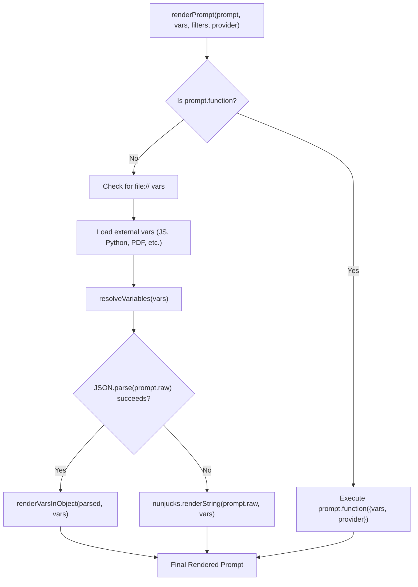
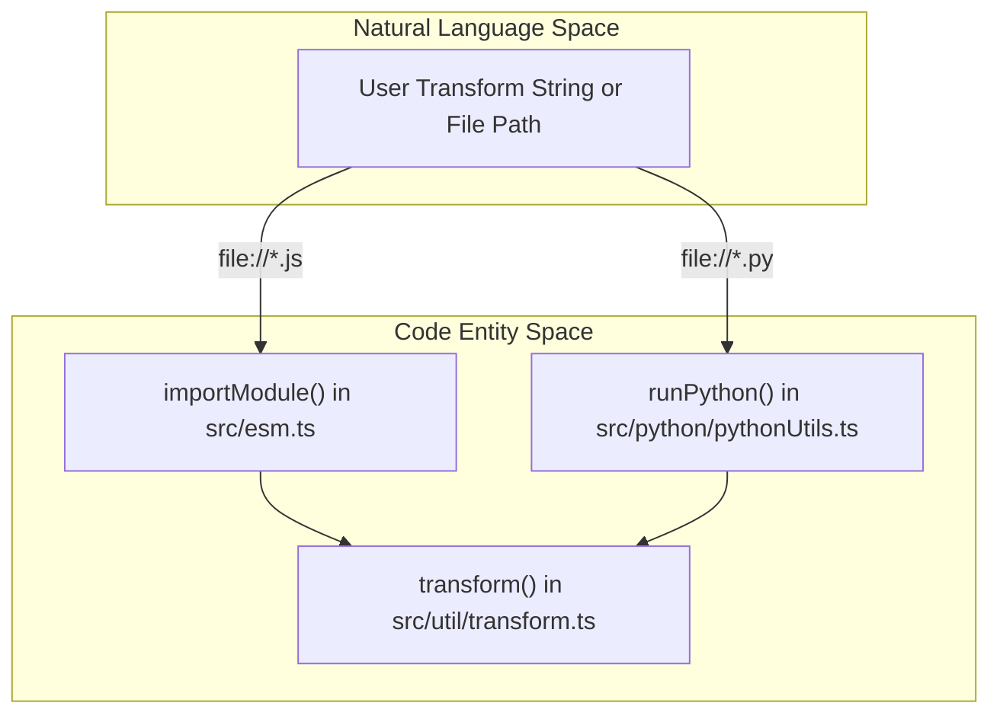

This page documents the utility functions and output generation mechanisms used across the promptfoo evaluation pipeline. It covers file handling, prompt template rendering, variable resolution, transform function execution, extension hook dispatch, and post-evaluation output writing.

---

## Module Organization

The `src/util/` directory is organized into specialized submodules. `src/util/index.ts` re-exports from each submodule as a backwards-compatibility barrel.

| Export Module | Re-exported Symbols | Source File |
|---|---|---|
| `comparison` | `deduplicateTestCases`, `varsMatch`, `resultIsForTestCase` | [src/util/index.ts:4-11]() |
| `env` | `setupEnv` | [src/util/index.ts:13]() |
| `file` | `maybeLoadFromExternalFileWithVars`, `readOutput`, `readFilters`, `parsePathOrGlob` | [src/util/index.ts:15-22]() |
| `output` | `writeOutput`, `writeMultipleOutputs`, `createOutputMetadata` | [src/util/index.ts:24-29]() |
| `render` | `renderVarsInObject`, `renderEnvOnlyInObject` | [src/util/index.ts:33]() |
| `runtime` | `printBorder`, `isRunningUnderNpx` | [src/util/index.ts:35]() |
| `provider` | `providerToIdentifier` | [src/util/index.ts:31]() |

Sources: [src/util/index.ts:1-35]()

---

## File Handling and Variable Resolution

### Variable Resolution
The `resolveVariables` function in `src/evaluatorHelpers.ts` handles cross-references between variables within a test case. It uses a regex `\{\{\s*(\w+)\s*\}\}` to find placeholders and performs up to 5 iterations to resolve nested dependencies (e.g., `var1` referencing `var2` which references `var3`). It skips resolution for specific keys provided in `skipResolveVars`.

Sources: [src/evaluatorHelpers.ts:54-93]()

### External File Loading
The `maybeLoadFromExternalFile` utility (referenced via `src/util/file.ts`) provides a unified interface for loading content from local files via the `file://` prefix.
- **Automatic Parsing**: Detects `.json`, `.yaml`, `.yml`, and `.csv` extensions to return parsed objects/arrays instead of raw strings. [site/docs/configuration/parameters.md:195-207]()
- **CSV Handling**: The `testCaseFromCsvRow` and `assertionFromString` functions in `src/csv.ts` convert flat CSV rows into structured `TestCase` objects. It handles special column prefixes like `__expected`, `__prefix`, `__suffix`, `__description`, and `__metadata:`. [src/csv.ts:127-208](), [test/csv.test.ts:31-65]()
- **Finite Number Parsing**: `parseFiniteNumber` is used for CSV fields to ensure `0` is preserved while blank cells are treated as `undefined`. [src/csv.ts:118-125]()

Sources: [src/csv.ts:118-208](), [site/docs/configuration/parameters.md:195-207](), [test/csv.test.ts:31-65]()

### Multimedia and PDF Extraction
Promptfoo supports extracting content from external files to populate variables:
- **PDF Extraction**: The `extractTextFromPDF` function uses the `pdf-parse` library to read and trim text from PDF files. [src/evaluatorHelpers.ts:35-52]()
- **Multimedia Metadata**: `collectFileMetadata` identifies `file://` references to images, videos, and audio. It identifies the format and type based on extensions like `.jpg`, `.mp4`, or `.wav`. [src/evaluatorHelpers.ts:121-152]()
- **MIME Detection**: `getMimeTypeFromExtension` maps common extensions (e.g., `webp`, `avif`, `heic`, `svg`) to MIME types, defaulting to `image/jpeg`. [src/evaluatorHelpers.ts:172-190]()

Sources: [src/evaluatorHelpers.ts:35-190]()

---

## Prompt Rendering

The `renderPrompt` function transforms a raw prompt template into a final string sent to the provider.

### Prompt Rendering Flow

Sources: [src/evaluatorHelpers.ts:54-93](), [src/util/index.ts:33](), [test/evaluatorHelpers.test.ts:177-195]()

**Key Rendering Behaviors:**
- **Auto-wrapping**: `autoWrapRawIfPartialNunjucks` detects unclosed Nunjucks tags (like `{%` or `{{`) and wraps the prompt in `` to prevent rendering errors. [src/evaluatorHelpers.ts:96-105]()
- **Variable Syntax**: Variables use Nunjucks templating, supporting filters (e.g., `{{message | upper}}`) and conditionals. [site/docs/configuration/parameters.md:211-222]()
- **External Integration**: Supports loading prompts directly from Portkey, Langfuse, or Helicone via URI schemes. [src/evaluatorHelpers.ts:7-9]()

Sources: [src/evaluatorHelpers.ts:7-9](), [src/evaluatorHelpers.ts:96-105](), [site/docs/configuration/parameters.md:211-222]()

---

## Transform Function Execution

The `transform` utility allows users to modify outputs or variables using JavaScript or Python.

### Implementation Details
- **JavaScript Transforms**: Loaded via `importModule`. Supports default exports, named exports (via `file.js:funcName`), or the module itself if it is a function. [src/util/index.ts:30]()
- **Python Transforms**: Executed via `runPython`. Defaults to a `get_transform` function name. [src/evaluatorHelpers.ts:12]()
- **Inline Transforms**: Handled within the `transform` utility to allow quick logic without separate files. [src/evaluatorHelpers.ts:30]()

### Transform Execution Logic

Sources: [src/evaluatorHelpers.ts:12-30](), [src/util/index.ts:30]()

---

## Extension Hooks

Extension hooks allow custom code to run at specific points in the evaluation lifecycle. These are registered in the `TestSuite` and dispatched via `runExtensionHook`.

| Hook Name | Context Type | Execution Point |
|---|---|---|
| `beforeAll` | `BeforeAllExtensionHookContext` | Before evaluation starts |
| `beforeEach` | `BeforeEachExtensionHookContext` | Before a specific test case |
| `afterEach` | `AfterEachExtensionHookContext` | After a specific test case |
| `afterAll` | `AfterAllExtensionHookContext` | After all tests complete |

Sources: [test/evaluatorHelpers.test.ts:6-13]()

---

## Output Generation

Promptfoo supports generating results in multiple formats. The `writeMultipleOutputs` function iterates through target paths and dispatches to specific writers.

### Persistence and Sanitization
Before results are written to the database or output files, they are sanitized to protect credentials and prevent serialization errors.
- **Circular References**: `sanitizeForDb` uses `safeJsonStringify` to handle circular structures (like Node.js `Timeout` objects) gracefully. [src/models/evalResult.ts:142-164]()
- **Secret Redaction**: `sanitizeProvider` redacts keys like `apiKey`, `token`, and `authorization` within provider configurations. It also redacts credentials from templated WebSocket URLs. [src/models/evalResult.ts:93-131](), [test/models/evalResult.test.ts:58-132]()
- **Sensitive Headers**: A specific set of HTTP headers (e.g., `authorization`, `cookie`, `set-cookie`) are redacted via `SENSITIVE_RESPONSE_HEADER_NAMES` to ensure they aren't persisted. [src/models/evalResult.ts:199-215]()

Sources: [src/models/evalResult.ts:93-215](), [test/models/evalResult.test.ts:58-132]()

### Supported Formats
- **JSON/YAML**: Full evaluation state, including configurations and results. [site/docs/configuration/parameters.md:144-147]()
- **CSV**: Tabular view of variables and outputs. `serializeObjectArrayAsCSV` handles the conversion of internal result objects to flat CSV rows. [test/csv.test.ts:4]()
- **HTML**: Interactive report generated using templates. [site/docs/configuration/parameters.md:141]()
- **Table Transformation**: `convertResultsToTable` transforms raw `EvaluateResult` objects into the `EvaluateTable` format. It handles deduping variables, formatting output text, and injecting redteam-specific metadata like `sessionId` or `redteamFinalPrompt` into the table rows. [src/util/convertEvalResultsToTable.ts:14-156]()

Sources: [src/util/convertEvalResultsToTable.ts:14-156](), [site/docs/configuration/parameters.md:141-147](), [test/csv.test.ts:4]()