This page provides an overview of the promptfoo web application: the React frontend, the Express/Socket.IO backend server, and the real-time communication layer. It covers the component hierarchy, the API route structure, Zustand state management, and the mechanism for live evaluation updates.

For deeper dives into specific areas, see:
- [Frontend Architecture](#6.1) — Vite, routing, Tanstack Query, component hierarchy
- [Results Viewer](#6.2) — `Eval`, `ResultsView`, `ResultsTable`, `EvalOutputCell`
- [State Management](#6.3) — `useTableStore`, `useResultsViewSettingsStore`
- [Filtering and Search](#6.4) — `FiltersForm`, filter modes, metadata filters
- [Red Team Setup UI](#6.5) — Multi-step wizard, `RedTeamSetupPage`
- [Backend Server](#6.6) — Express routes in detail, Zod validation, error handling
- [Real-time Updates](#6.7) — Socket.IO `init`/`update` events
- [Red Team Report UI](#6.8) — Risk category visualization and compliance mapping
- [Model Audit UI](#6.9) — Static security scanning interface

---

## Architecture Overview

The web interface is a single-page React application served by an Express HTTP server. The server also runs a Socket.IO instance for real-time evaluation progress updates.

**System architecture diagram**

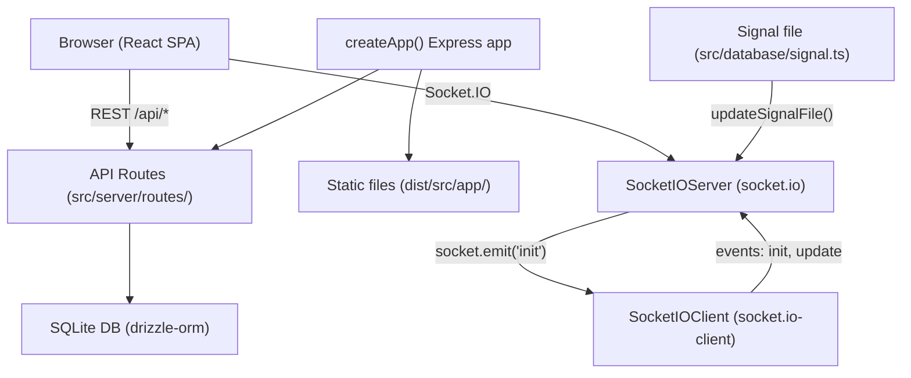

Sources: [src/app/src/pages/eval/components/Eval.tsx:13-13](), [src/app/src/pages/eval/components/Eval.tsx:35-36](), [src/models/eval.ts:52-55]()

---

## Backend Server

The backend is initialized via `startServer` which calls `createApp()`. The server handles data persistence for evaluations and provides the API for the frontend.

### API Route Groups

The server modularizes logic into specific routers to manage different entities:

| Router | Purpose | Key Data Entities |
|---|---|---|
| **Eval** | Result retrieval and pagination | `evalsTable`, `evalResultsTable` [src/models/eval.ts:7-8]() |
| **Redteam** | Test generation and reports | `PLUGIN_CATEGORIES`, `Severity` [src/app/src/pages/eval/components/store.ts:3-10]() |
| **User** | Identity management | `getAuthor`, `getUserEmail` [src/models/eval.ts:16-16]() |

Sources: [src/models/eval.ts:1-14](), [src/app/src/pages/eval/components/store.ts:1-12]()

---

## Real-Time Communication

The server uses a "signal file" mechanism to notify the frontend of evaluation progress. When an evaluation state changes, `updateSignalFile` or `notifyEvaluationChanged` is called.

**Real-time update flow diagram**

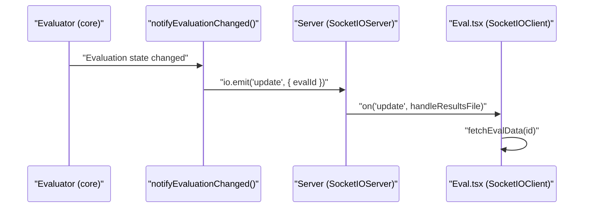

Sources: [src/models/eval.ts:51-55](), [src/app/src/pages/eval/components/Eval.tsx:171-180]()

---

## Frontend Structure

The React application uses `react-router-dom` for navigation and `Navigation.tsx` for the top-level menu. It is built around a centralized table view for results.

**Frontend component hierarchy diagram**

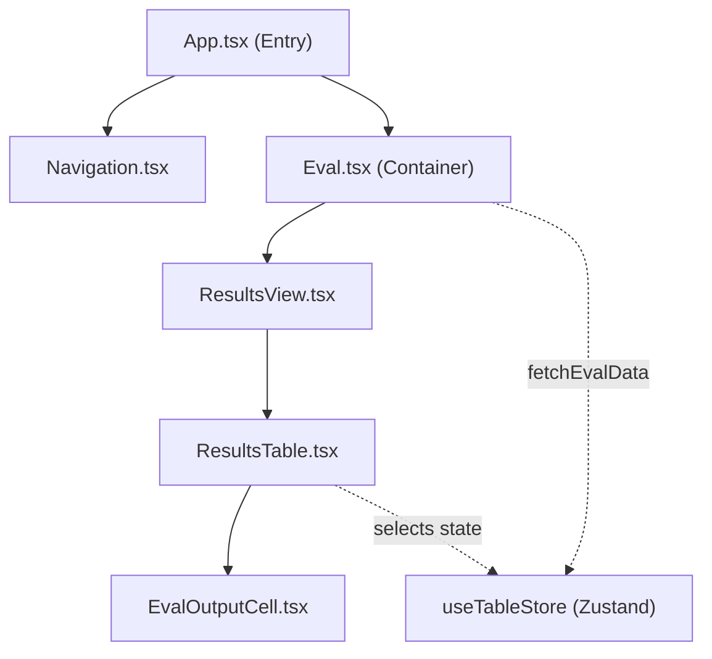

Sources: [src/app/src/pages/eval/components/Eval.tsx:61-77](), [src/app/src/pages/eval/components/ResultsView.tsx:41-45](), [src/app/src/pages/eval/components/ResultsTable.tsx:40-50]()

### State Management

Global state is managed primarily through Zustand stores to maintain UI consistency:

- **useTableStore**: Manages evaluation data, pagination (`pageIndex`, `pageSize`), and filtering (`ResultsFilter[]`) [src/app/src/pages/eval/components/store.ts:12-28]().
- **useResultsViewSettingsStore**: Tracks UI preferences like `renderMarkdown`, `inComparisonMode`, and column visibility [src/app/src/pages/eval/components/store.ts:13-16]().
- **Filter Management**: Handles complex logic for red team specific filters like `plugin`, `strategy`, and `severity` [src/app/src/pages/eval/components/store.ts:145-172]().

### Core UI Components

- **ResultsTable**: A high-performance table built with `@tanstack/react-table` that handles large evaluation datasets with virtualization and custom cell rendering [src/app/src/pages/eval/components/ResultsTable.tsx:39-44]().
- **EvalOutputCell**: Renders individual model outputs, supporting text, markdown, and media (images, audio, video) with support for human rating and feedback [src/app/src/pages/eval/components/EvalOutputCell.tsx:88-118]().
- **Navigation**: Provides access to "New" setups (Eval, Red Team, Model Audit) and "Results" views [src/app/src/components/Navigation.tsx:133-172]().
- **StorageRefAudioPlayer**: Handles asynchronous resolution of audio references (blobs/storage refs) into playable elements [src/app/src/pages/eval/components/ResultsTable.tsx:98-144]().

Sources: [src/app/src/pages/eval/components/ResultsTable.tsx:15-21](), [src/app/src/pages/eval/components/EvalOutputCell.tsx:1-32](), [src/app/src/components/Navigation.tsx:206-215]()

# Frontend Architecture


The promptfoo web application is a modern React-based single-page application (SPA) designed to provide a rich graphical interface for viewing evaluation results, configuring red team tests, and managing prompts and datasets. It is built using **Vite** for fast development and optimized production builds, and utilizes **Tanstack Query** for data synchronization and **Radix UI** for accessible component primitives.

## Technology Stack

The frontend architecture is built on a foundation of industry-standard libraries and tools:

| Category | Technology | Purpose |
| :--- | :--- | :--- |
| **Framework** | React 18+ | UI component architecture and state management. |
| **Build Tool** | Vite | Module bundling, HMR, and build optimization [src/app/vite.config.ts:7-14](). |
| **Data Fetching** | Tanstack Query (v5) | Server state management, caching, and synchronization [src/app/src/App.tsx:3-10](). |
| **Routing** | React Router (v6) | Declarative routing and navigation [src/app/src/App.tsx:4-12](). |
| **UI Components** | Radix UI / Shadcn UI | Accessible, unstyled primitives for complex UI elements [src/app/src/components/Navigation.tsx:3-11](). |
| **Styling** | Tailwind CSS v4 | Utility-first CSS framework using modern CSS variables [src/app/src/index.css:1-2](). |
| **Real-time** | Socket.IO Client | Bi-directional communication for live evaluation updates. |
| **State Management** | Zustand | Lightweight store for local UI state (e.g., table settings). |

**Sources:** [src/app/vite.config.ts:1-182](), [src/app/src/App.tsx:1-147](), [src/app/src/components/Navigation.tsx:1-21](), [src/app/src/index.css:1-237]()

## Routing and App Structure

The application's entry point is `App.tsx`, which configures global providers (e.g., `QueryClientProvider`, `TooltipProvider`, `ToastProvider`) and defines the routing hierarchy using `createBrowserRouter` [src/app/src/App.tsx:49-145]().

### Route Definition

The application uses a nested route structure. Most pages are wrapped in a `PageShell` component that provides consistent navigation and layout [src/app/src/App.tsx:55-55](). The `TelemetryTracker` component is used as a wrapper to record `webui_page_view` events on every route change via the `useTelemetry` hook [src/app/src/App.tsx:38-47]().

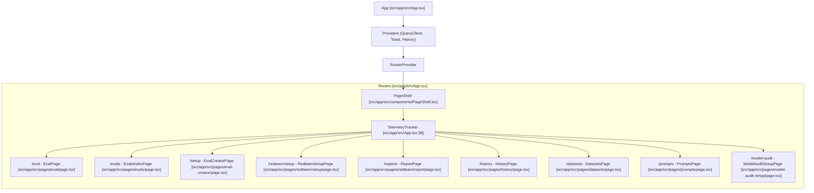

**Sources:** [src/app/src/App.tsx:38-129](), [src/app/src/App.tsx:133-145]()

## Component Hierarchy

The application follows a modular component structure, separating layout, common UI elements, and page-specific logic.

### PageShell and Navigation

The `PageShell` acts as the primary layout wrapper, containing the `Navigation` component and an `Outlet` for rendering the current route's content [src/app/src/App.tsx:55-57]().

The `Navigation` component provides the top-level app bar and dropdown menus for navigating between different functional areas:
*   **New**: Entry points for creating evaluations (`/setup`), red team setups (`/redteam/setup`), and model audits (`/model-audit/setup`) [src/app/src/components/Navigation.tsx:133-149]().
*   **View Results**: Links to the latest results, all evaluations, vulnerability reports, and the media library [src/app/src/components/Navigation.tsx:151-172]().
*   **Browse**: Access to prompts, datasets, and historical runs [src/app/src/components/Navigation.tsx:174-195]().

The navigation bar uses a `sticky` header with a specific z-index defined by `--z-appbar` (1200) to ensure it stays above page content but below modals [src/app/src/components/Navigation.tsx:206](), [src/app/src/index.css:221]().

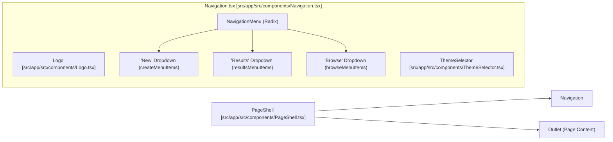

**Sources:** [src/app/src/components/Navigation.tsx:197-230](), [src/app/src/App.tsx:55-125](), [src/app/src/index.css:220-225]()

### Data Table Architecture

The application relies heavily on a shared `DataTable` component built on **Tanstack Table** [src/app/src/components/data-table/data-table.tsx:1-16](). It is used across Prompts [src/app/src/pages/prompts/Prompts.tsx:139](), Datasets [src/app/src/pages/datasets/Datasets.tsx:168](), and History pages.

| Feature | Implementation Detail |
| :--- | :--- |
| **Virtualization** | Supports `client-virtualized` and `server-virtualized` modes using `@tanstack/react-virtual` [src/app/src/components/data-table/data-table.tsx:17-37](). |
| **Filtering** | Uses `DataTableHeaderFilter` and `operatorFilterFn` for column-level control [src/app/src/components/data-table/data-table.tsx:19-20](). |
| **Column Sizing** | Implements manual resizing via `renderDataTableHeaderResizeHandle` [src/app/src/components/data-table/data-table.tsx:135-156](). |
| **Sticky Columns** | Allows pinning columns to the `left` or `right` edges [src/app/src/components/data-table/data-table.tsx:38-43](). |

**Sources:** [src/app/src/components/data-table/data-table.tsx:1-206](), [src/app/src/pages/prompts/Prompts.tsx:139-148](), [src/app/src/pages/datasets/Datasets.tsx:168-177]()

## Data Flow and State Management

Data flow in the frontend is primarily managed through Tanstack Query for server-side data and Zustand for local UI state.

### Server State (Tanstack Query)

The frontend interacts with the Express backend via REST API calls. Tanstack Query manages the lifecycle of these requests. For example, `ReportPage` checks for user authentication via `useUserStore` before rendering reports [src/app/src/pages/redteam/report/page.tsx:14-29]().

### Local State (Zustand)

Zustand stores are used for UI-specific state that needs to persist across component re-renders:
*   **useUserStore**: Manages user session state, including the user's email and login status [src/app/src/pages/redteam/report/page.tsx:14]().
*   **useTableStore**: Manages table-specific configurations like column visibility and filtering.

### Authentication Flow

The `LoginPage` handles user authentication. Upon successful login, it updates the global user state. The `ReportPage` uses this state to redirect unauthenticated users to `/login` [src/app/src/pages/redteam/report/page.tsx:26-29]().

**Sources:** [src/app/src/pages/redteam/report/page.tsx:11-46](), [src/app/src/App.tsx:131-141]()

## Build and Development

The frontend build process is managed by Vite, configured in `vite.config.ts`.

| Feature | Implementation |
| :--- | :--- |
| **Aliases** | `@app` maps to `./src`, `@promptfoo` maps to `../` [src/app/vite.config.ts:79-82](). |
| **Code Splitting** | Vendor groups are used to optimize chunking via `vendorCodeSplittingGroups` [src/app/vite.config.ts:96-102](). |
| **Environment** | Exposes `VITE_` prefixed variables like `VITE_PUBLIC_PROMPTFOO_REMOTE_API_BASE_URL` [src/app/vite.config.ts:65-68](). |
| **Testing** | Uses Vitest with `jsdom` and parallelizes via child process forks to prevent memory leaks [src/app/vite.config.ts:106-120](). |

**Sources:** [src/app/vite.config.ts:72-182]()

## Testing Infrastructure

Frontend components are tested using **Vitest** and **React Testing Library**.

*   **Component Tests**: `Navigation.test.tsx` verifies that all navigation links and dropdowns render correctly and respond to user events, including theme switching [src/app/src/components/Navigation.test.tsx:86-155]().
*   **DataTable Tests**: `data-table.test.tsx` ensures virtualization, filtering, and sorting work across different screen sizes [src/app/src/components/data-table/data-table.test.tsx:53-200]().
*   **Routing Tests**: `ReportPage.test.tsx` ensures that the report viewer reacts correctly to URL search parameters like `evalId` and handles authentication redirects [src/app/src/pages/redteam/report/page.test.tsx:67-104]().

**Sources:** [src/app/src/components/Navigation.test.tsx:72-206](), [src/app/src/pages/redteam/report/page.test.tsx:52-181](), [src/app/src/components/data-table/data-table.test.tsx:1-191]()

# Results Viewer


This page documents the evaluation results viewer in the promptfoo web application: the components responsible for loading, displaying, filtering, and interacting with evaluation output data. It covers the `Eval`, `ResultsView`, `ResultsTable`, and `EvalOutputCell` components, as well as the Zustand stores that back them.

For information about the Zustand stores themselves (state shape, actions, initialization), see [State Management](#6.3). For filtering and search behavior in detail, see [Filtering and Search](#6.4). For the backend API routes that supply data to these components, see [Backend Server](#6.6).

---

## Component Hierarchy

The results viewer is composed of several layers of React components, each with a clearly scoped responsibility.

**Component Hierarchy Diagram**

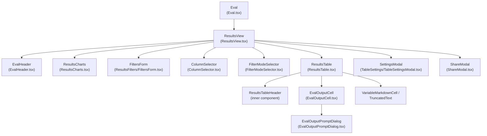

Sources: `[src/app/src/pages/eval/components/Eval.tsx:61-77]()`, `[src/app/src/pages/eval/components/ResultsView.tsx:40-45]()`, `[src/app/src/pages/eval/components/ResultsTable.tsx:47-56]()`, `[src/app/src/pages/eval/components/EvalOutputCell.tsx:36-51]()`

---

## Data Loading and State Flow

The `Eval` component is the entry point. It calls `fetchEvalData` from `useTableStore`, which fetches evaluation data from the Express backend and populates the store.

**Data Flow Diagram**

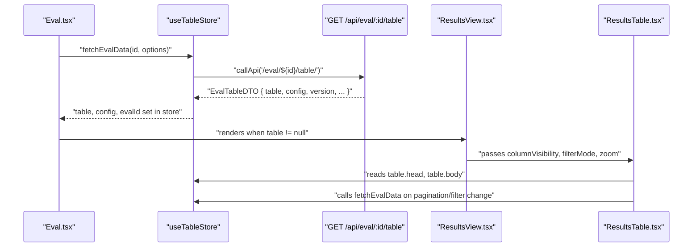

Sources: `[src/app/src/pages/eval/components/Eval.tsx:124-154]()`, `[src/app/src/pages/eval/components/store.ts:534-650]()`, `[src/app/src/pages/eval/components/ResultsTable.tsx:597-650]()`

### `Eval` Component

`Eval` ([src/app/src/pages/eval/components/Eval.tsx]()) is responsible for:

- Calling `fetchRecentFileEvals` (`GET /results`) on mount to populate the eval selector `[src/app/src/pages/eval/components/Eval.tsx:99-114]()`.
- Calling `loadEvalById` with the `fetchId` URL parameter to load a specific eval `[src/app/src/pages/eval/components/Eval.tsx:124-154]()`.
- Establishing a Socket.IO connection to receive real-time evaluation progress updates via the `init` and `update` events `[src/app/src/pages/eval/components/Eval.tsx:255-290]()`.
- Deserializing URL `filter` query parameters via `parseFiltersParam` and applying them to the store on mount `[src/app/src/pages/eval/components/Eval.tsx:38-48]()`.

When the table data is successfully loaded, it renders `ResultsView`. If no eval is found, it renders `EmptyState` `[src/app/src/pages/eval/components/Eval.tsx:300-350]()`.

### `fetchEvalData` in `useTableStore`

The `fetchEvalData` action ([src/app/src/pages/eval/components/store.ts:534-650]()) is the central data-loading function. It accepts an `id` and `FetchEvalOptions`:

| Option | Type | Purpose |
|---|---|---|
| `pageIndex` | `number` | Page offset for paginated results |
| `pageSize` | `number` | Number of rows per page |
| `filterMode` | `EvalResultsFilterMode` | `all`, `failures`, `errors`, `user-rated` |
| `searchText` | `string` | Full-text search query |
| `filters` | `ResultsFilter[]` | Structured metadata/metric/plugin/strategy filters |
| `skipSettingEvalId` | `boolean` | Avoids re-setting `evalId` during pagination |
| `skipLoadingState` | `boolean` | Suppresses loading spinner during background updates |

The function calls `callApi` to `GET /api/eval/${id}/table/` with the relevant query parameters, then updates the Zustand store with the returned `EvalTableDTO` `[src/app/src/pages/eval/components/store.ts:630-680]()`.

---

## ResultsView

`ResultsView` ([src/app/src/pages/eval/components/ResultsView.tsx]()) orchestrates the toolbar, filter chips, charts, and table. It does not directly fetch data; it reads from `useTableStore` and `useResultsViewSettingsStore`.

**Key responsibilities:**

- **Search**: Maintains `searchInputValue` and `debouncedSearchText` (passed to `ResultsTable`). Uses `useDebouncedCallback` for efficient searching `[src/app/src/pages/eval/components/ResultsView.tsx:340-355]()`.
- **Column management**: Computes `currentColumnState` from `columnStates` in `useResultsViewSettingsStore`, keyed by `currentEvalId` `[src/app/src/pages/eval/components/ResultsView.tsx:320-330]()`.
- **Filter mode**: Supports modes like `all`, `failures`, `errors`, `user-rated`, and `different`. The `different` mode highlights rows where outputs vary across prompts `[src/app/src/pages/eval/components/ResultsView.tsx:430-450]()`.
- **Charts**: `ResultsCharts` provides visualizations of scores across prompts and providers. Visibility is toggled based on viewport height `MIN_VIEWPORT_HEIGHT_FOR_CHARTS = 1100` `[src/app/src/pages/eval/components/ResultsView.tsx:61-186]()`.
- **Zoom**: Controls `resultsTableZoom`, applied to the `ResultsTable` for better visibility of large datasets `[src/app/src/pages/eval/components/ResultsView.tsx:490-510]()`.

Sources: `[src/app/src/pages/eval/components/ResultsView.tsx:63-600]()`

---

## ResultsTable

`ResultsTable` ([src/app/src/pages/eval/components/ResultsTable.tsx]()) is the core display component. It uses **TanStack Table v8** to manage column definitions, sizing, and visibility `[src/app/src/pages/eval/components/ResultsTable.tsx:33-44]()`.

### Column Construction

Columns are built dynamically in three groups:

- **Variable columns**: One column per entry in `head.vars`. Cells render using `VariableMarkdownCell` `[src/app/src/pages/eval/components/ResultsTable.tsx:718-750]()`.
- **Metadata columns**: Displays evaluation metadata keys. Column width is estimated based on content length percentiles `[src/app/src/pages/eval/components/ResultsTable.tsx:187-198]()`.
- **Prompt columns**: One column per prompt/provider combination. Each cell renders an `EvalOutputCell` `[src/app/src/pages/eval/components/ResultsTable.tsx:830-870]()`.

Column sizes are initialized using heuristics like `estimateMetadataColumnSize` or defaults like `PROMPT_COLUMN_SIZE_PX = 480` `[src/app/src/pages/eval/components/ResultsTable.tsx:146-199]()`.

Sources: `[src/app/src/pages/eval/components/ResultsTable.tsx:670-950]()`

### Custom Metrics and Totals

The table displays aggregated metrics in the header:
- **Token Usage**: Displays total tokens, provider tokens (or target tokens for redteam), and average tokens `[src/app/src/pages/eval/components/ResultsTable.tsx:22-26]()`.
- **Named Metrics**: Displays specific scores like cost and latency, formatted via `formatDuration` `[src/app/src/pages/eval/components/ResultsTable.tsx:19-20]()`.
- **Pass Rates**: Visual indicators of test success per prompt using `usePassRates` hook `[src/app/src/pages/eval/components/ResultsTable.tsx:72-78]()`.

---

## EvalOutputCell

`EvalOutputCell` ([src/app/src/pages/eval/components/EvalOutputCell.tsx]()) renders a single output cell.

### Output Rendering Logic

The component handles various media types and display modes:
- **Diffs**: If `showDiffs` is enabled, it renders JSON, sentence, or word diffs using the `diff` library `[src/app/src/pages/eval/components/EvalOutputCell.tsx:21-32]()`.
- **Media**: Detects image and video providers via `isImageProvider` and `isVideoProvider` to prevent incorrect text truncation `[src/app/src/pages/eval/components/EvalOutputCell.tsx:89-119]()`.
- **Markdown**: Renders output as markdown using `ReactMarkdown` with `REMARK_PLUGINS` `[src/app/src/pages/eval/components/EvalOutputCell.tsx:34-40]()`.
- **Audio**: Supports `StorageRefAudioPlayer` for base64 or storage-referenced audio data `[src/app/src/pages/eval/components/ResultsTable.tsx:98-143]()`.

### Cell Actions
The cell includes an action row with buttons for:
- Human pass/fail rating (`ThumbsUp`/`ThumbsDown`). For redteam, these are labeled "Mark as safe"/"Mark as vulnerable" `[src/app/src/pages/eval/components/EvalOutputCell.test.tsx:184-200]()`.
- Numeric scoring via `SetScoreDialog` `[src/app/src/pages/eval/components/EvalOutputCell.tsx:41-43]()`.
- Viewing detailed output/test details (`EvalOutputPromptDialog`) `[src/app/src/pages/eval/components/EvalOutputCell.tsx:37-49]()`.

Sources: `[src/app/src/pages/eval/components/EvalOutputCell.tsx:460-850]()`

---

## EvalOutputPromptDialog

`EvalOutputPromptDialog` ([src/app/src/pages/eval/components/EvalOutputPromptDialog.tsx]()) provides a detailed inspection view for a single evaluation result using a Radix UI `Sheet` `[src/app/src/pages/eval/components/EvalOutputPromptDialog.tsx:5-10]()`.

**Key features:**
- **Prompt & Output**: Displays the raw prompt, provider-specific prompt, and model output in a syntax-highlighted `CodeDisplay` `[src/app/src/pages/eval/components/EvalOutputPromptDialog.tsx:49-111]()`.
- **Tabs**: Organizes data into "Prompt & Output", "Metadata", "Evaluation", and "Traces" `[src/app/src/pages/eval/components/EvalOutputPromptDialog.tsx:11-18]()`.
- **Replay**: Allows editing the prompt and re-running the evaluation directly from the UI via `onReplay` `[src/app/src/pages/eval/components/EvalOutputPromptDialog.tsx:116-129]()`.
- **Tracing**: Fetches and displays OpenTelemetry traces associated with the evaluation via `fetchTraces` `[src/app/src/pages/eval/components/EvalOutputPromptDialog.tsx:184-198]()`.

Sources: `[src/app/src/pages/eval/components/EvalOutputPromptDialog.tsx:1-205]()`

---

## Comparison Mode

Comparison mode allows multiple evaluations to be displayed side by side.

When `inComparisonMode` is `true`:
- `comparisonEvalIds` in `useResultsViewSettingsStore` holds the additional eval IDs `[src/app/src/pages/eval/components/store.ts:81-82]()`.
- `fetchEvalData` triggers the backend to merge results from multiple evals into a single `EvaluateTable` `[src/app/src/pages/eval/components/store.ts:534-550]()`.
- Diff mode is available in `EvalOutputCell` to compare outputs against a baseline prompt column.

Sources: `[src/app/src/pages/eval/components/store.ts:13-29]()`, `[src/app/src/pages/eval/components/ResultsTable.tsx:30-32]()`

---

## Settings Persistence

`useResultsViewSettingsStore` is persisted to `localStorage` to maintain user preferences across sessions `[src/app/src/pages/eval/components/store.ts:12-13]()`.

| Field | Description |
|---|---|
| `maxTextLength` | Max chars before truncation in cells |
| `renderMarkdown` | Enable markdown rendering in cells |
| `prettifyJson` | Pretty-print JSON output |
| `showInferenceDetails` | Show token/latency/cost stats |
| `columnStates` | Per-eval column visibility state |

Sources: `[src/app/src/pages/eval/components/store.ts:13-28]()`

# State Management


This page documents the Zustand-based state management system used by the promptfoo web application's evaluation viewer. It covers the primary stores (`useTableStore` and `useResultsViewSettingsStore`), their state shapes, actions, and how components interact with them.

For documentation on the React components that consume this state, see [Results Viewer (6.2)](). For filtering and search UI behavior, see [Filtering and Search (6.4)](). For the red team configuration wizard's store (`useRedTeamConfig`), see [Red Team Setup UI (6.5)]().

---

## Store Architecture Overview

The eval viewer uses two Zustand stores, both defined in [src/app/src/pages/eval/components/store.ts]().

| Store | Middleware | Persistence | Responsibility |
|---|---|---|---|
| `useTableStore` | `subscribeWithSelector` | None (session-only) | Evaluation data, filters, fetch state |
| `useResultsViewSettingsStore` | `persist` | `localStorage` (`eval-settings`) | Display preferences, column visibility, comparison mode |

A third store, `useStore` from `src/app/src/stores/evalConfig.ts`, handles red team configuration and is imported as `useMainStore` in `ResultsView.tsx` [src/app/src/pages/eval/components/ResultsView.tsx:21-21]().

**Store-to-Component Dependency Diagram**

Title: Store-to-Component Dependency Diagram
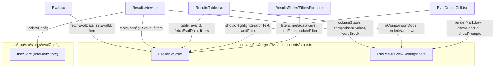
Sources: [src/app/src/pages/eval/components/store.ts:12-13](), [src/app/src/pages/eval/components/Eval.tsx:67-81](), [src/app/src/pages/eval/components/ResultsView.tsx:44-44](), [src/app/src/pages/eval/components/ResultsTable.tsx:54-54](), [src/app/src/pages/eval/components/EvalOutputCell.tsx:42-42]()

---

## `useTableStore`

### Purpose

`useTableStore` is the primary data store for the eval results page. It owns the evaluated data (`EvaluateTable`), the current eval's configuration, filter state, pagination, metadata keys for filters, and async fetch state.

It is created using Zustand's `subscribeWithSelector` middleware [src/app/src/pages/eval/components/store.ts:13-13](), which allows external code (notably `Eval.tsx`) to subscribe to specific state slices without causing React re-renders.

### State Shape

**`TableState` interface** [src/app/src/pages/eval/components/store.ts:268-401]()

| Field | Type | Description |
|---|---|---|
| `evalId` | `string \| null` | ID of the currently loaded evaluation |
| `author` | `string \| null` | Author of the eval |
| `table` | `EvaluateTable \| null` | Rendered table data (head + body rows) |
| `config` | `Partial<UnifiedConfig> \| null` | Full eval configuration |
| `version` | `number \| null` | Eval schema version (3 = old, 4 = normalized) |
| `filteredResultsCount` | `number` | Count of results matching current filters |
| `totalResultsCount` | `number` | Unfiltered total result count |
| `highlightedResultsCount` | `number` | Outputs with `!highlight` comment prefix |
| `userRatedResultsCount` | `number` | Outputs with a `human` assertion type rating |
| `filteredMetrics` | `PromptMetrics[] \| null` | Backend-calculated metrics for the filtered dataset |
| `stats` | `EvaluateStats \| null` | Eval-level statistics (e.g., `durationMs`) |
| `isFetching` | `boolean` | True while `fetchEvalData` is in-flight |
| `isStreaming` | `boolean` | True when a Socket.IO live update is in progress |
| `shouldHighlightSearchText` | `boolean` | Enables search highlight rendering in cells |
| `filters` | `FiltersState` | Nested filter state (see below) |
| `metadataKeys` | `string[]` | Available metadata keys for the metadata filter |
| `metadataValues` | `Record<string, string[]>` | Cached metadata values per key |
| `filterMode` | `EvalResultsFilterMode` | Active display mode (`all`, `failures`, `errors`, etc.) |

### Filter State

The `filters` field is a nested object within `useTableStore` [src/app/src/pages/eval/components/store.ts:355-381]():

```typescript
filters: {
  values:          Record<string, ResultsFilter>   // all defined filters
  appliedCount:    number                          // filters with a non-empty value
  options: {
    metric:        string[]                        // available metric names
    metadata:      string[]                        // available metadata keys
    plugin?:       string[]                        // redteam only
    strategy?:     string[]                        // redteam only
    severity?:     string[]                        // redteam only
    policy?:       string[]                        // redteam only
  }
  policyIdToNameMap?: Record<string, string>       // policy ID → display name
}
```

The `ResultsFilter` type [src/app/src/pages/eval/components/store.ts:248-266]():

| Field | Type | Description |
|---|---|---|
| `id` | `string` | UUID, assigned at creation |
| `type` | `ResultsFilterType` | `metric`, `metadata`, `plugin`, `strategy`, `severity`, `policy` |
| `operator` | `ResultsFilterOperator` | `equals`, `contains`, `exists`, `gt`, `lte`, etc. |
| `value` | `string` | Filter value |
| `field` | `string?` | For metadata/metric filters: the key name |
| `logicOperator` | `'AND' \| 'OR'` | How this filter combines with others |

### Actions

| Action | Signature | Effect |
|---|---|---|
| `setEvalId` | `(id: string) => void` | Sets `evalId`, clears `filteredMetrics` [src/app/src/pages/eval/components/store.ts:543-546]() |
| `setTable` | `(table: EvaluateTable \| null) => void` | Sets `table`, recomputes highlight/rated counts [src/app/src/pages/eval/components/store.ts:553-562]() |
| `fetchEvalData` | `(id, options?) => Promise<EvalTableDTO \| null>` | Fetches paginated eval data from the API [src/app/src/pages/eval/components/store.ts:654-700]() |
| `addFilter` | `(filter) => void` | Appends a new filter to `filters.values` [src/app/src/pages/eval/components/store.ts:586-591]() |
| `removeFilter` | `(id) => void` | Removes a filter by ID [src/app/src/pages/eval/components/store.ts:592-598]() |
| `updateFilter` | `(filter) => void` | Updates an existing filter by ID [src/app/src/pages/eval/components/store.ts:602-608]() |

### `fetchEvalData` Async Flow

`fetchEvalData` is the central async action. It is called from `Eval.tsx` (initial load), `ResultsTable.tsx` (pagination and filter changes), and indirectly from Socket.IO update handlers.

**`fetchEvalData` Sequence Diagram**

Title: fetchEvalData Sequence Diagram
```mermaid
sequenceDiagram
    participant "Caller (Eval.tsx / ResultsTable.tsx)" as Caller
    participant "useTableStore.fetchEvalData" as Store
    participant "API /api/results/:id/table" as API
    participant "buildRedteamFilterOptions" as FilterBuilder

    Caller->>Store: "fetchEvalData(id, options)"
    Store->>Store: "set isFetching = true (unless skipLoadingState)"
    Store->>API: "GET /api/results/:id/table?pageIndex=&pageSize=&filterMode=&filters="
    API-->>Store: "EvalTableDTO { table, config, version, filteredCount, totalCount, filteredMetrics, stats }"
    Store->>FilterBuilder: "buildRedteamFilterOptions(config, table)"
    FilterBuilder-->>Store: "{ plugin, strategy, severity, policy }"
    Store->>Store: "set table, config, version, counts, filters.options, stats"
    Store->>Store: "set isFetching = false"
    Store-->>Caller: "EvalTableDTO | null"
```
Sources: [src/app/src/pages/eval/components/store.ts:654-700](), [src/app/src/pages/eval/components/Eval.tsx:124-154](), [src/app/src/pages/eval/components/ResultsTable.tsx:635-649]() (implied by table state dependencies).

### Derived / Computed Values

Several computed values are re-derived when `setTable` is called [src/app/src/pages/eval/components/store.ts:30-53]():

| Helper | Triggers on | Returns |
|---|---|---|
| `computeHighlightCount(table)` | `setTable` | Count of outputs where `gradingResult.comment` starts with `!highlight` [src/app/src/pages/eval/components/store.ts:30-40]() |
| `computeUserRatedCount(table)` | `setTable` | Count of outputs with a component result of type `human` [src/app/src/pages/eval/components/store.ts:46-53]() |
| `computeAvailableMetrics(table)` | `fetchEvalData` | Sorted list of unique metric names from `prompt.metrics.namedScores` [src/app/src/pages/eval/components/store.ts:55-73]() |

Sources: [src/app/src/pages/eval/components/store.ts:30-73]()

---

## `useResultsViewSettingsStore`

### Purpose

`useResultsViewSettingsStore` stores user interface display preferences. Unlike `useTableStore`, its state is persisted to `localStorage` under the key `eval-settings` (version 2) using Zustand's `persist` middleware [src/app/src/pages/eval/components/store.ts:445-510]().

### State Shape

**`SettingsState` interface** [src/app/src/pages/eval/components/store.ts:403-443]()

| Field | Type | Default | Description |
|---|---|---|---|
| `maxTextLength` | `number` | `250` | Max characters before text truncation |
| `wordBreak` | `'break-word' \| 'break-all'` | `'break-word'` | CSS word-break style for cells |
| `renderMarkdown` | `boolean` | `true` | Render cell text as Markdown |
| `prettifyJson` | `boolean` | `false` | Pretty-print JSON in output cells |
| `showPrompts` | `boolean` | `true` | Show the prompt used in each cell |
| `showPassFail` | `boolean` | `true` | Show pass/fail badge in cells |
| `inComparisonMode` | `boolean` | `false` | True when comparing multiple evals |
| `comparisonEvalIds` | `string[]` | `[]` | IDs of evals being compared |
| `columnStates` | `Record<string, ColumnState>` | `{}` | Per-eval column selection and visibility |

### Column State and Schema Hashing

Column visibility is managed at two levels:

1. **Per-eval** (`columnStates` keyed by `evalId`): Controls visibility of `description` and `Prompt N` columns.
2. **Per-schema** (`hiddenVarNamesBySchema` keyed by a schema hash): Controls visibility of variable columns. The hash is computed from sorted variable names via `hashVarSchema(head.vars)` [src/app/src/pages/eval/components/utils.ts:16-16]().

Sources: [src/app/src/pages/eval/components/store.ts:403-443](), [src/app/src/pages/eval/components/ResultsView.tsx:46-46]() (hashVarSchema import).

---

## State Shape Summary Diagram

**State fields mapped to store and file location**

Title: State Shape Summary Diagram
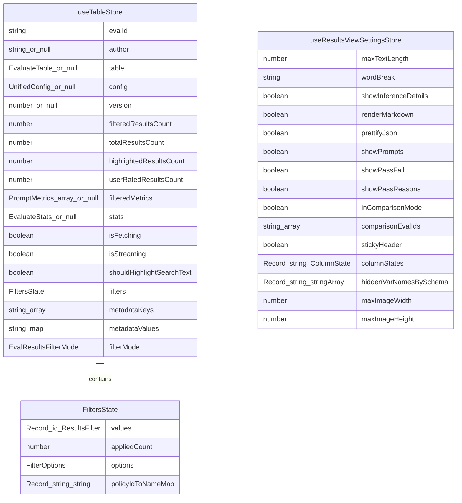
Sources: [src/app/src/pages/eval/components/store.ts:268-443]()

---

## Component Interaction Patterns

### Reading State

Components call the store hook directly:

```typescript
// In ResultsTable.tsx
const { evalId, table, setTable, config, fetchEvalData, filters } = useTableStore();
const { inComparisonMode, renderMarkdown } = useResultsViewSettingsStore();
```
Sources: [src/app/src/pages/eval/components/ResultsTable.tsx:54-54]()

### Writing State: Ratings Flow

When a user rates an output, `ResultsTable.tsx` handles the event and updates the store. A result is considered user-rated if it has a component result with `assertion.type === 'human'` [src/app/src/pages/eval/components/store.ts:44-45]().

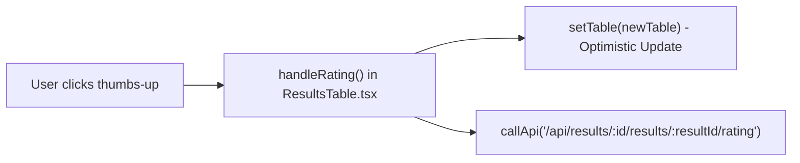
Sources: [src/app/src/pages/eval/components/ResultsTable.tsx:18-18](), [src/app/src/pages/eval/components/store.ts:46-53]()

### Writing State: Filter Updates

Filters are managed through atomic actions. `Eval.tsx` subscribes to the `filters` slice via `subscribeWithSelector` and serializes the active filters to the URL's `?filter=` query parameter [src/app/src/pages/eval/components/Eval.tsx:38-48]().

**Filter Lifecycle Diagram**

Title: Filter Lifecycle Diagram
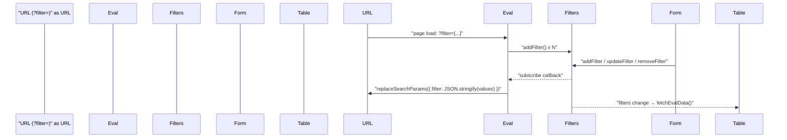
Sources: [src/app/src/pages/eval/components/Eval.tsx:38-48](), [src/app/src/pages/eval/components/store.ts:586-608]()

---

## Metadata Key and Value Fetching

`useTableStore` manages lazy-loaded metadata keys and values used by the filter form.

| State field | Purpose |
|---|---|
| `metadataKeys` | List of all metadata key names across results |
| `metadataValues` | Per-key cache of distinct metadata values |

`fetchMetadataKeys` calls `GET /api/results/:id/metadata-keys` [src/app/src/pages/eval/components/store.ts:702-736](). `fetchMetadataValues` calls `GET /api/results/:id/metadata-values?key=...` [src/app/src/pages/eval/components/store.ts:738-782](). Both abort any prior in-flight request for the same resource using an `AbortController`.

Sources: [src/app/src/pages/eval/components/store.ts:382-400](), [src/app/src/pages/eval/components/store.ts:702-782]()