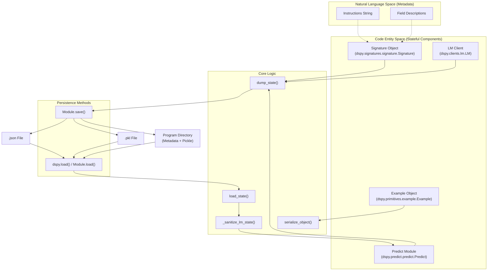

async def run():
    async for chunk in stream_predict(question="What is DSPy?"):
        if isinstance(chunk, dspy.streaming.StreamResponse):
            print(f"Token: {chunk.chunk}")
        elif isinstance(chunk, dspy.Prediction):
            print(f"Final: {chunk.answer}")
```

Sources: [dspy/streaming/streamify.py:126-132](), [docs/docs/tutorials/streaming/index.md:27-34](), [dspy/streaming/messages.py:12-17]()

# State Management & Serialization


This document covers DSPy's state management and serialization system, which enables saving and loading optimized programs, preserving demonstration examples, and deploying trained models. This system is essential for persisting the results of optimization workflows and sharing DSPy programs across environments.

## Overview

DSPy provides state management capabilities at three levels of granularity:

1.  **Module State** (`Predict`, `ChainOfThought`, etc.) - Includes demonstrations, traces, signature configuration, and LM settings [dspy/predict/predict.py:71-90]().
2.  **Signature State** - Instructions and field metadata (prefixes, descriptions) [dspy/signatures/signature.py:236-248]().
3.  **LM State** - Model configuration parameters [dspy/clients/lm.py:126-140]().

Each component implements `dump_state()` and `load_state()` methods that serialize to JSON-compatible dictionaries. The system supports both JSON and pickle formats for persistence to disk, as well as whole-program serialization using `cloudpickle` [dspy/primitives/base_module.py:168-181]().

## State Management Architecture

The following diagram illustrates the flow of data during serialization and the relationship between different stateful entities.

### State Persistence Flow

**Sources:** [dspy/predict/predict.py:71-116](), [dspy/primitives/base_module.py:156-181](), [dspy/utils/saving.py:27-61]()

## Module State Management

The `Predict` class (and its subclasses like `ChainOfThought`, `ReAct`) implement comprehensive state management. The base `Module` class also provides mechanisms for recursive state handling across nested sub-modules [dspy/primitives/base_module.py:156-167]().

### State Components

| Component | Type | Description |
|-----------|------|-------------|
| `demos` | `list[Example]` | Few-shot demonstration examples, typically populated by optimizers [dspy/predict/predict.py:75-87](). |
| `traces` | `list` | Execution traces captured during program runs [dspy/predict/predict.py:72](). |
| `train` | `list` | Training data used during optimization [dspy/predict/predict.py:72](). |
| `signature` | `dict` | Serialized signature state (instructions and field metadata) [dspy/predict/predict.py:88](). |
| `lm` | `dict` or `None` | Serialized LM configuration, if an LM has been bound to the module [dspy/predict/predict.py:89](). |

### Security and Unsafe LM State
When loading an LM state, DSPy protects against potentially malicious configurations by filtering "unsafe" keys unless explicitly allowed.

| Unsafe Key | Description |
|------------|-------------|
| `api_base` | The base URL for the API endpoint. |
| `base_url` | Alternative key for the API endpoint. |
| `model_list` | List of models available to the client. |

The `_sanitize_lm_state` function handles this filtering [dspy/predict/predict.py:25-40](). Users must pass `allow_unsafe_lm_state=True` to `load_state` or `load` to preserve these keys when working with trusted files [dspy/predict/predict.py:92-116]().

**Sources:** [dspy/predict/predict.py:22-40](), [dspy/predict/predict.py:92-116]()

### Implementation: Dump and Load
The `Predict.dump_state` method iterates through `traces`, `train`, and `demos`, applying `serialize_object` to ensure JSON compatibility [dspy/predict/predict.py:71-90]().

The `Predict.load_state` method reconstructs the signature and LM. Notably, it raises a `NotImplementedError` if it encounters the legacy `extended_signature` key from DSPy versions <= 2.5 [dspy/predict/predict.py:113-114]().

**Sources:** [dspy/predict/predict.py:71-116]()

## Program Persistence (Whole Program Saving)

Starting from DSPy 2.6.0, the framework supports saving the entire program architecture along with its state using `cloudpickle` [docs/docs/tutorials/saving/index.md:82-88]().

### Save and Load Mechanism
When `save(path, save_program=True)` is called on a `Module`, DSPy creates a directory containing:
1.  `program.pkl`: The serialized Python object via `cloudpickle` [dspy/utils/saving.py:60-61]().
2.  `metadata.json`: Dependency versions (Python, dspy, cloudpickle) to detect environment mismatches [dspy/utils/saving.py:15-24]().

### Serializing Imported Modules
If a program depends on custom modules not present in the standard environment, they can be registered for serialization by value using the `modules_to_serialize` parameter [dspy/primitives/base_module.py:168-181](). This uses `cloudpickle.register_pickle_by_value` internally to ensure dependencies are bundled [docs/docs/tutorials/saving/index.md:117-120]().

### Environment Validation
The `dspy.load` utility checks the current environment against the saved metadata. If versions of `python`, `dspy`, or `cloudpickle` differ, it issues a warning regarding potential performance downgrades or errors [dspy/utils/saving.py:49-58]().

**Sources:** [dspy/primitives/base_module.py:168-181](), [dspy/utils/saving.py:15-61](), [docs/docs/tutorials/saving/index.md:77-106]()

## Serialization Utilities

### Object Serialization
The `serialize_object` function recursively converts complex Python objects into JSON-compatible formats [dspy/predict/predict.py:219-236]().

| Input Type | Strategy |
|------------|----------|
| `pydantic.BaseModel` | `model_dump(mode="json")` [dspy/predict/predict.py:225-227]() |
| `list` / `tuple` | Recursive call on each element [dspy/predict/predict.py:228-231]() |
| `dict` | Recursive call on each value [dspy/predict/predict.py:232-233]() |

### Dependency Tracking
The system tracks the specific versions of the stack used during serialization to ensure reproducibility.

```python