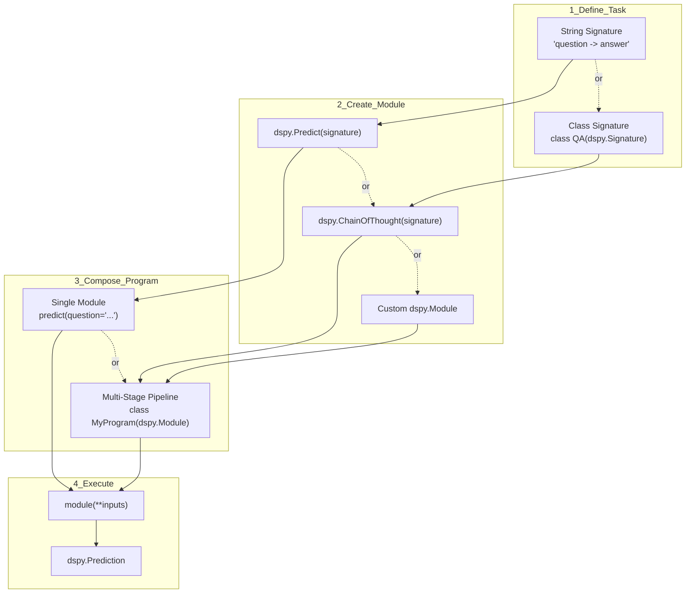

result = predict(question="What is the capital of France?")
print(result.answer)  # "Paris"
```

**Sources:** [dspy/predict/predict.py:43-64](), [dspy/dsp/utils/settings.py:12-15]()

## Core Building Blocks

DSPy programs are constructed from three primary abstractions that work together to define, execute, and optimize language model interactions.

### Program Building Blocks Diagram



**Sources:** [dspy/predict/predict.py:43-64](), [dspy/primitives/module.py:1-50](), [dspy/predict/chain_of_thought.py:12-35]()

### Signature: Task Specification

A `Signature` declares the input and output fields for a task. Signatures define what the language model should do, separating task specification from implementation details.

**String Notation (Simple):**
```python