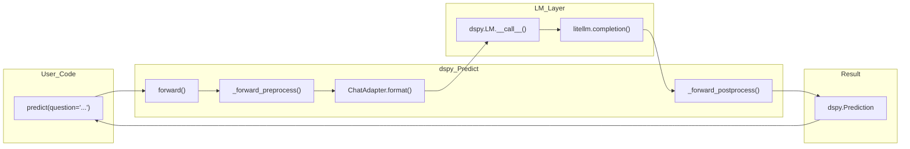

print(result.answer)  # "4"
```

Key characteristics of `dspy.Predict`:
- Only accepts **keyword arguments** matching signature input fields [dspy/predict/predict.py:126-128]()
- Returns a `dspy.Prediction` object [dspy/predict/predict.py:15]()
- Maintains state (demonstrations, traces) for optimization [dspy/predict/predict.py:65-69]()

**Sources:** [dspy/predict/predict.py:43-64](), [tests/predict/test_predict.py:71-77](), [dspy/predict/predict.py:126-128]()

### Common Predict Patterns

**Typed Outputs:**
```python
class QA(dspy.Signature):
    question: str = dspy.InputField()
    answer: str = dspy.OutputField()
    confidence: float = dspy.OutputField()

predict = dspy.Predict(QA)
result = predict(question="Is Paris in France?")
```

**Multiple Completions:**
```python
predict = dspy.Predict("question -> answer", n=3)
result = predict(question="What is AI?")
```

**Configuration Override:**
```python
predict = dspy.Predict("question -> answer", temperature=0.7)

# Override for single call
result = predict(
    question="Be creative!",
    config={"temperature": 1.0, "max_tokens": 200}
)
```

**Sources:** [tests/predict/test_predict.py:118-131](), [dspy/predict/predict.py:49-56](), [dspy/predict/predict.py:143]()

### Program Execution Flow



The execution flow involves:
1. **Preprocessing**: Resolves LM, merges configs, validates inputs [dspy/predict/predict.py:138-160]()
2. **Adapter formatting**: Converts signature + inputs to LM messages [dspy/predict/predict.py:189-192]()
3. **LM invocation**: Calls language model via the configured LM client [dspy/predict/predict.py:192]()
4. **Postprocessing**: Parses outputs into structured `Prediction` [dspy/predict/predict.py:194-200]()

For detailed lifecycle documentation, see [Predict Module](#3.1).

**Sources:** [dspy/predict/predict.py:138-200](), [dspy/adapters/chat_adapter.py:9]()

## Configuration

DSPy provides multiple configuration levels that cascade from global to call-time scope.

### Configuration Hierarchy

| Level | Method | Scope | Example |
|-------|--------|-------|---------|
| **Global** | `dspy.configure()` | All modules | `dspy.configure(lm=dspy.LM('openai/gpt-4o'))` |
| **Instance** | Constructor kwargs | Single module | `dspy.Predict("q -> a", temperature=0.9)` |
| **Call-time** | `config={}` parameter | Single call | `predict(q="...", config={"temperature": 0.5})` |

**Resolution order:** Call-time > Instance > Global [dspy/predict/predict.py:143-146]()

**Sources:** [dspy/predict/predict.py:143-146](), [dspy/dsp/utils/settings.py:12-15]()

## Program Composition

DSPy programs are built by composing multiple modules.

### Sequential Composition

One module's output feeds into another's input within a custom `dspy.Module`.

```python
class MultiStepRAG(dspy.Module):
    def __init__(self):
        super().__init__()
        self.retrieve = dspy.Retrieve(k=5)
        self.answer = dspy.Predict("passages, question -> answer")
    
    def forward(self, question):
        context = self.retrieve(question).passages
        return self.answer(passages=context, question=question)
```

**Sources:** [dspy/primitives/module.py:1-50]()

### Iterative Refinement

Programs can iteratively improve outputs through multiple passes. See [Module Composition & Refinement](#3.5) for built-in refinement modules.

## State Management and Persistence

DSPy modules maintain state that can be saved and reloaded.

### Saving and Loading Programs

```python