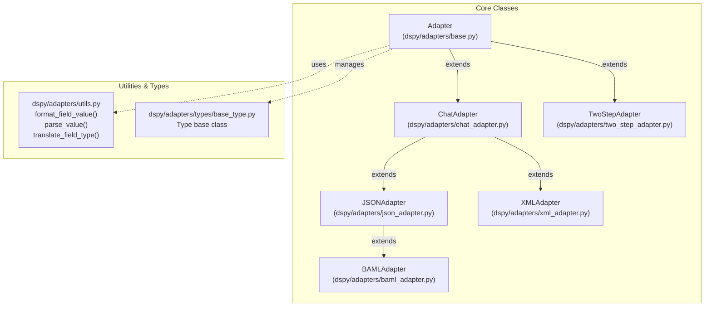
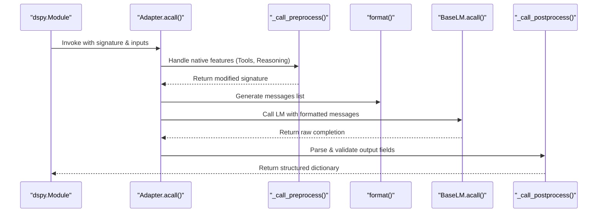

The Adapter System serves as the interface layer between DSPy's programming abstractions (signatures, modules) and Language Models. Adapters transform DSPy signatures and inputs into LM-specific prompt formats, then parse LM responses back into structured dictionaries matching the signature's output fields. This layer enables DSPy to work consistently across different LM providers and prompt formats while maintaining a uniform programming model.

## Architecture Overview

The adapter system follows a hierarchy with `Adapter` as the base class and specialized implementations for different prompt formats.

Title: Adapter Class Hierarchy and Data Flow

**Sources:** [dspy/adapters/base.py:21-36](), [dspy/adapters/chat_adapter.py:28-38](), [dspy/adapters/json_adapter.py:40-43](), [dspy/adapters/xml_adapter.py:12-16](), [dspy/adapters/two_step_adapter.py:21-40](), [dspy/adapters/baml_adapter.py:163-164]()

## Adapter Execution Flow

When a DSPy module (like `dspy.Predict`) makes an LM call, the adapter orchestrates the transformation pipeline.

Title: Signature to LM Message Transformation

**Sources:** [dspy/adapters/base.py:175-217](), [dspy/adapters/base.py:219-293](), [dspy/adapters/base.py:520-533]()

## Base Adapter Class

The `Adapter` class defines the core interface for all implementations. It manages the lifecycle of an LM request, including preprocessing for native features and postprocessing for output validation.

### Constructor Configuration
The `Adapter.__init__` [dspy/adapters/base.py:38-59]() accepts:
* `callbacks`: Hooks for logging or monitoring.
* `use_native_function_calling`: Enables `dspy.Tool` integration with provider APIs.
* `native_response_types`: Types like `Citations` or `Reasoning` that use built-in LM capabilities [dspy/adapters/base.py:57-58]().

### Native Feature Handling
* **Preprocessing**: `_call_preprocess` [dspy/adapters/base.py:66-108]() detects if a signature contains `dspy.Tool` or `dspy.Reasoning`. If the LM supports these natively (e.g., OpenAI function calling), it modifies `lm_kwargs` and strips these fields from the text prompt to avoid redundancy.
* **Postprocessing**: `_call_postprocess` [dspy/adapters/base.py:110-173]() re-assembles the final dictionary, extracting tool calls or reasoning blocks from specific LM response metadata (like `tool_calls` or `reasoning_content`) and placing them back into the expected signature fields.

**Sources:** [dspy/adapters/base.py:21-173]()

## Core Adapter Implementations

### ChatAdapter
The default adapter for most models. It uses text-based delimiters to delineate fields within chat messages.
* **Format**: Uses `[[ ## field_name ## ]]` headers [dspy/adapters/chat_adapter.py:20]().
* **Fallback**: Automatically retries with `JSONAdapter` if a non-context-window error occurs [dspy/adapters/chat_adapter.py:71-85]().
* **Structure**: Appends a `[[ ## completed ## ]]` marker to indicate the end of expected output [dspy/adapters/chat_adapter.py:136]().

### JSONAdapter
Extends `ChatAdapter` to enforce JSON structures, ideal for programmatic data extraction.
* **Structured Outputs**: If `lm.supports_response_schema` is true, it generates a strict Pydantic model from the signature via `_get_structured_outputs_response_format` to use OpenAI-style "Structured Output" mode [dspy/adapters/json_adapter.py:71-75]().
* **Parsing**: Uses `json_repair` to handle trailing commas or minor syntax errors in LM output [dspy/adapters/json_adapter.py:149]().

### XMLAdapter
Formats inputs and outputs within XML tags (e.g., `<answer>...</answer>`).
* **Regex Parsing**: Uses `re.compile(r"<(?P<name>\w+)>((?P<content>.*?))</\1>", re.DOTALL)` to extract field values [dspy/adapters/xml_adapter.py:15]().
* **Type Casting**: Raw XML string content is passed to `parse_value` to convert it to the signature's annotated type (int, bool, etc.) [dspy/adapters/xml_adapter.py:113]().

### TwoStepAdapter
A specialized adapter for reasoning models (like OpenAI o1/o3) that struggle with strict formatting.
1. **Step 1**: Sends a natural language prompt to the main LM to get a detailed response [dspy/adapters/two_step_adapter.py:50-75]().
2. **Step 2**: Uses a secondary `extraction_model` (typically a cheaper/faster model) to parse the first LM's output into the structured signature fields via `ChatAdapter` [dspy/adapters/two_step_adapter.py:77-105]().

### BAMLAdapter
Generates simplified, BAML-inspired schemas for complex Pydantic models to improve LM adherence.
* **Schema Generation**: Converts Pydantic models into a concise string representation via `_build_simplified_schema` with comments and "or null" syntax for optional fields [dspy/adapters/baml_adapter.py:89-160]().
* **Circular References**: Explicitly raises `ValueError` if recursive Pydantic models are detected [dspy/adapters/baml_adapter.py:103-104]().

**Sources:** [dspy/adapters/chat_adapter.py:28-110](), [dspy/adapters/json_adapter.py:40-103](), [dspy/adapters/xml_adapter.py:12-107](), [dspy/adapters/two_step_adapter.py:21-161](), [dspy/adapters/baml_adapter.py:89-166]()

## Data Formatting and Parsing Utilities

The system relies on `dspy/adapters/utils.py` to bridge the gap between Python objects and LM strings.

| Function | Role |
| :--- | :--- |
| `format_field_value` | Serializes Python types. Lists are converted to numbered strings; dicts to JSON [dspy/adapters/utils.py:45-75](). |
| `translate_field_type` | Generates "instructions" for the LM based on types (e.g., "must be one of: A; B" for Enums) [dspy/adapters/utils.py:93-118](). |
| `parse_value` | The inverse of formatting. It attempts `json_repair`, then Pydantic validation [dspy/adapters/utils.py:149-212](). |
| `serialize_for_json` | Uses Pydantic's `TypeAdapter` to dump objects into JSON-compatible primitives [dspy/adapters/utils.py:27-43](). |

**Sources:** [dspy/adapters/utils.py:27-212]()

## Custom Types and Multimodal Support

DSPy supports complex types (Image, Audio, Code) through the `dspy.Type` base class.

* **Identification**: Adapters use `CUSTOM_TYPE_START_IDENTIFIER` and `CUSTOM_TYPE_END_IDENTIFIER` to wrap multimodal data in the message stream [dspy/adapters/types/base_type.py:15-16]().
* **Splitting**: `split_message_content_for_custom_types` [dspy/adapters/types/base_type.py:135-195]() parses message strings back into blocks (e.g., text blocks and `image_url` blocks) compatible with multimodal LM APIs.
* **Reasoning Type**: The `Reasoning` type [dspy/adapters/types/reasoning.py:12-22]() delegates string methods (like `.strip()`) to its underlying content string via `__getattr__` [dspy/adapters/types/reasoning.py:149-163](), making it behave like a string while allowing the adapter to handle it as a native LM feature.

**Sources:** [dspy/adapters/types/base_type.py:15-195](), [dspy/adapters/types/reasoning.py:12-163]()