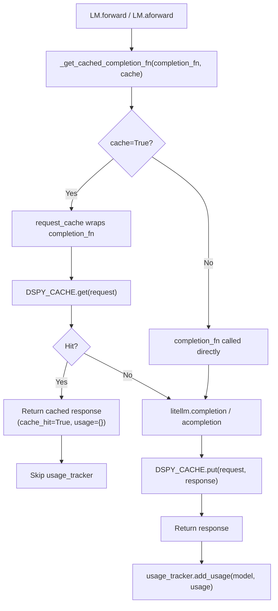
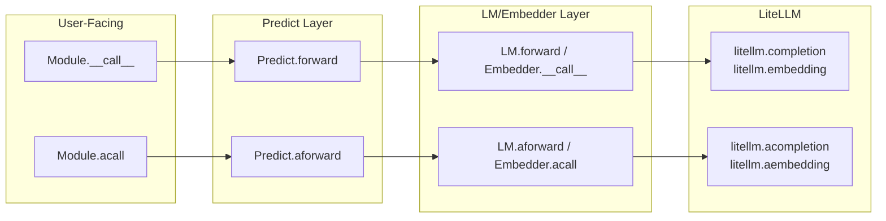
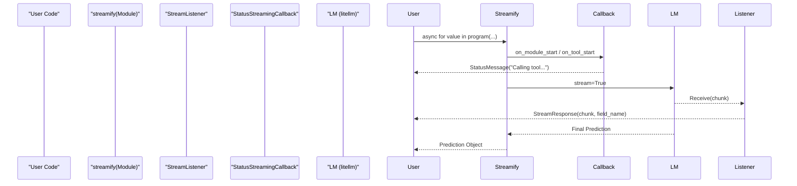

This page provides a unified overview of DSPy's advanced runtime capabilities: caching, asynchronous and parallel execution, streaming responses, program state serialization, output validation, and sandboxed code execution. These features are layered on top of the core `LM`, `Predict`, and `Module` abstractions and apply across most program patterns.

For foundational module construction, see [Building DSPy Programs](#3). For configuration of LM providers, see [Language Model Integration](#2.2). Each section below has a dedicated sub-page with full implementation details.

---

## Feature Areas at a Glance

| Feature | Primary Code Entities | Sub-Page |
|---|---|---|
| Caching | `request_cache`, `DSPY_CACHE`, `configure_cache`, `Cache` | [Caching & Performance Optimization](#5.1) |
| Async Execution | `LM.aforward`, `BaseLM.acall`, `asyncify`, `syncify` | [Parallel & Async Execution](#5.2) |
| Streaming Output | `streamify`, `StreamListener`, `StatusMessageProvider`, `StreamResponse` | [Streaming Output](#5.3) |
| State Management | `Predict.dump_state`, `Predict.load_state`, `Module.save`, `dspy.load` | [State Management & Serialization](#5.4) |
| Assertions & Validation | `dspy.Assert`, `dspy.Suggest`, `Retry` | [Assertions & Output Validation](#5.5) |
| Code Execution | `PythonInterpreter`, Deno/Pyodide, `JSON-RPC` | [Code Execution & Sandboxing](#5.6) |

---

## Caching & Performance Optimization

By default, every `LM` instance caches its responses. The cache is a two-tier system — memory first (LRU), then disk (Fanout) — implemented in `dspy/clients/cache.py` and exposed as `dspy.cache` (`DSPY_CACHE`).

### How Caching Fits Into the LM Call

**Diagram: LM Call with Cache Layers**


Sources: [dspy/clients/cache.py:40-46](), [dspy/clients/cache.py:115-147](), [dspy/clients/lm.py:133-169]()

### Cache Configuration

The cache is configured via `dspy.clients.configure_cache`. It supports `disk_cache_dir` (defaulting to `~/.dspy_cache`) and `disk_size_limit_bytes` (default 30GB).

```python
dspy.clients.configure_cache(
    enable_disk_cache=True,
    enable_memory_cache=True,
    disk_cache_dir=".dspy_cache",
)
```
Sources: [dspy/clients/__init__.py:16-17](), [dspy/clients/__init__.py:20-51](), [dspy/clients/cache.py:48-57]()

### Cache Key Computation

Cache keys are generated by hashing a JSON representation of the request. The `Cache.cache_key` method handles JSON-incompatible types by transforming Pydantic models and capturing source code for callables via `inspect.getsource`.

Sources: [dspy/clients/cache.py:24-37](), [dspy/clients/cache.py:104-113](), [tests/clients/test_cache.py:115-138]()

---

## Parallel & Async Execution

Every entry point in DSPy has a sync and an async variant. Async variants use Python `asyncio` and delegate to the corresponding `litellm.acompletion` / `litellm.aembedding` functions.

### Code Entity Map

**Diagram: Sync vs Async Execution Paths**


Sources: [dspy/clients/lm.py:133-207](), [dspy/clients/embedding.py:113-147](), [dspy/predict/predict.py:211-236]()

### `asyncify` and `syncify` Utilities

- `asyncify`: Converts a synchronous DSPy module method into an async-compatible coroutine. Used by `streamify` to wrap synchronous programs.
- `syncify`: Converts an async function into a blocking sync function. Used in `StatusStreamingCallback` to send messages to streams from synchronous contexts.

Sources: [dspy/utils/asyncify.py:1-10](), [dspy/streaming/streamify.py:161-163](), [dspy/streaming/messages.py:27-50]()

---

## Streaming Output

Streaming allows partial tokens and status updates to be emitted while the program is running. DSPy uses a `streamify` wrapper to turn any module into an async generator.

### Streaming Architecture

**Diagram: Streaming and Status Flow**


Sources: [dspy/streaming/streamify.py:27-60](), [dspy/streaming/streaming_listener.py:23-50](), [dspy/streaming/messages.py:98-129]()

### Key Streaming Components

| Component | Location | Role |
|---|---|---|
| `streamify` | `dspy/streaming/streamify.py` | Wraps a module to return an async generator of `StatusMessage`, `StreamResponse`, and `Prediction`. |
| `StreamListener` | `dspy/streaming/streaming_listener.py` | Listens to specific signature fields (e.g., "answer") and parses chunks using regex for Chat/XML/JSON adapters. |
| `StatusMessageProvider` | `dspy/streaming/messages.py` | Interface for customizing messages emitted during `on_tool_start`, `on_lm_start`, etc. |
| `Citations` | `dspy/adapters/types/citation.py` | A streamable type that can parse provider-specific citation deltas (e.g., Anthropic) into `StreamResponse`. |

Sources: [dspy/streaming/streamify.py:27-60](), [dspy/streaming/streaming_listener.py:23-50](), [dspy/adapters/types/citation.py:177-190]()

---

## State Management & Serialization

DSPy programs can be serialized to JSON and restored. The state captures signature fields, few-shot demos, and LM configuration.

### Security: Unsafe LM State Keys

`UNSAFE_LM_STATE_KEYS` (e.g., `api_base`, `base_url`) are stripped from deserialized state by default to prevent loading malicious redirects from untrusted files. Loading them requires `allow_unsafe_lm_state=True`.

Sources: [dspy/predict/predict.py:19-37](), [dspy/predict/predict.py:89-113]()

---

## Assertions & Code Execution

- **Assertions**: `dspy.Assert` and `dspy.Suggest` allow runtime validation. If an assertion fails, the `Retry` module can catch the error and prompt the LM again with feedback.
- **Code Execution**: The `PythonInterpreter` executes generated code. It supports sandboxing via a Deno-based Pyodide environment, communicating over JSON-RPC to isolate execution from the host system.

For details, see [Assertions & Output Validation](#5.5) and [Code Execution & Sandboxing](#5.6).

---

## Observability

### Usage and History

- **Usage Tracking**: Managed via `dspy.settings.usage_tracker`. Cache hits are explicitly excluded from usage counts via `_prepare_cached_response`.
- **History**: `BaseLM` maintains a `history` list. Global history is capped by `MAX_HISTORY_SIZE` (10,000).

Sources: [dspy/clients/cache.py:149-155](), [dspy/clients/base_lm.py:9-10](), [dspy/clients/base_lm.py:166-190]()