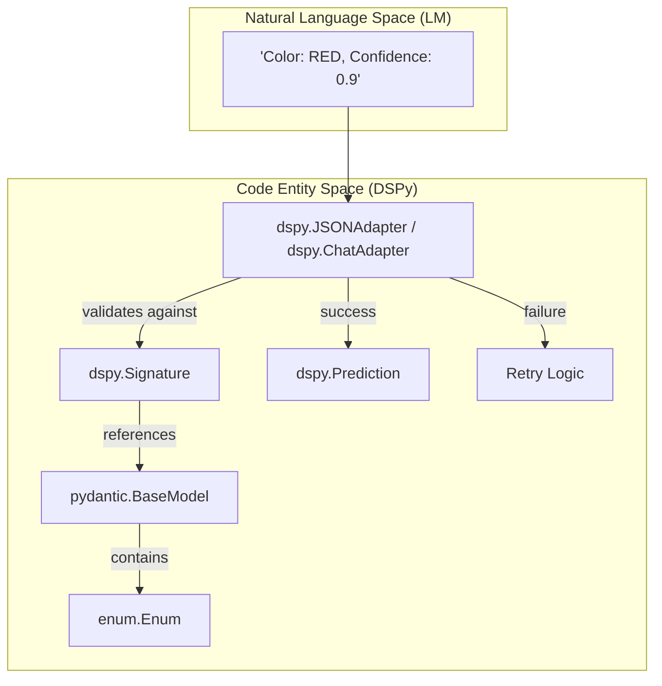
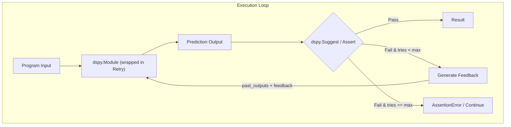
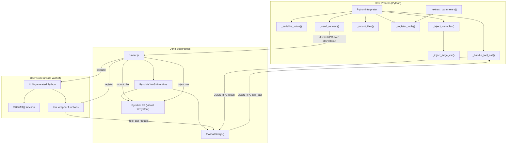
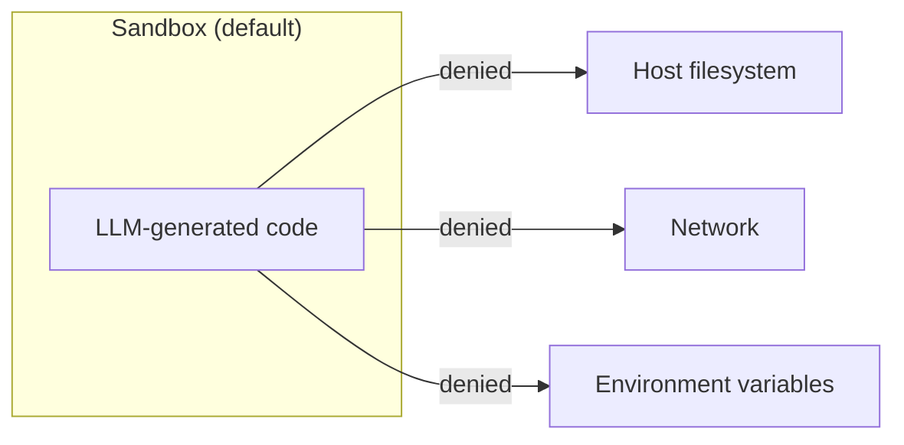
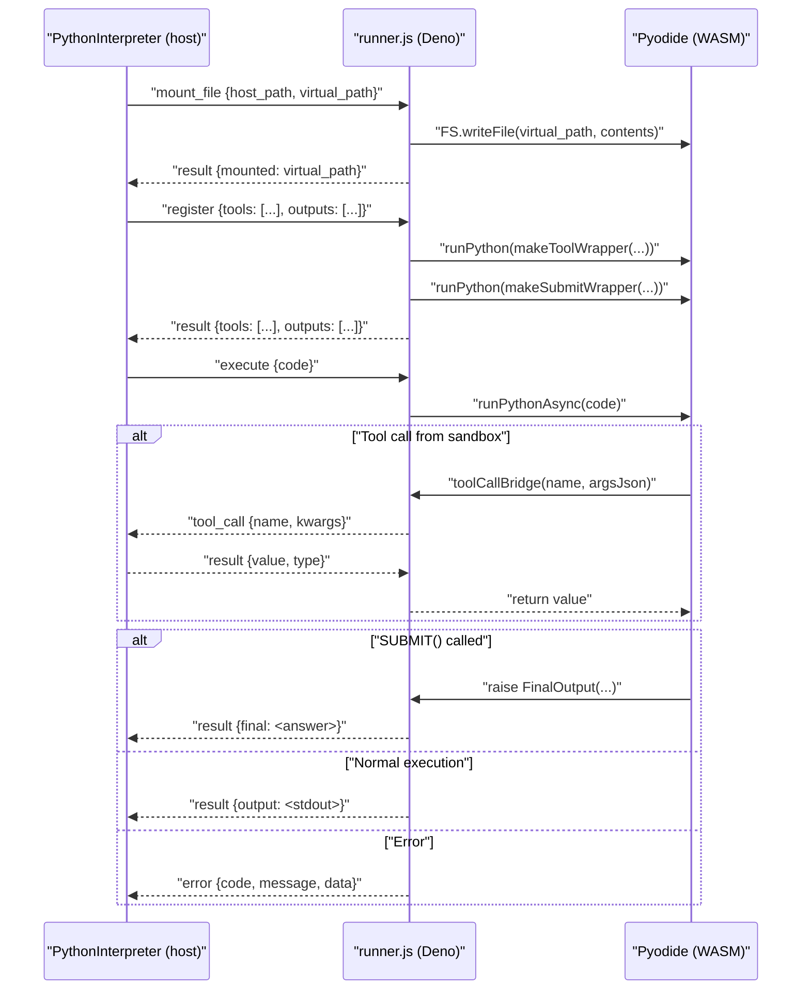
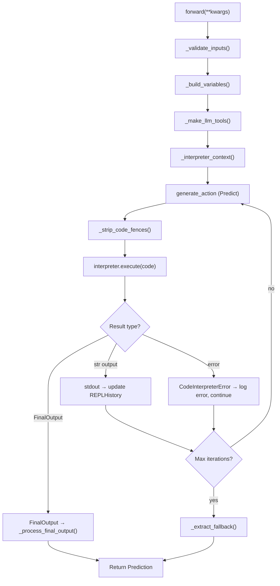
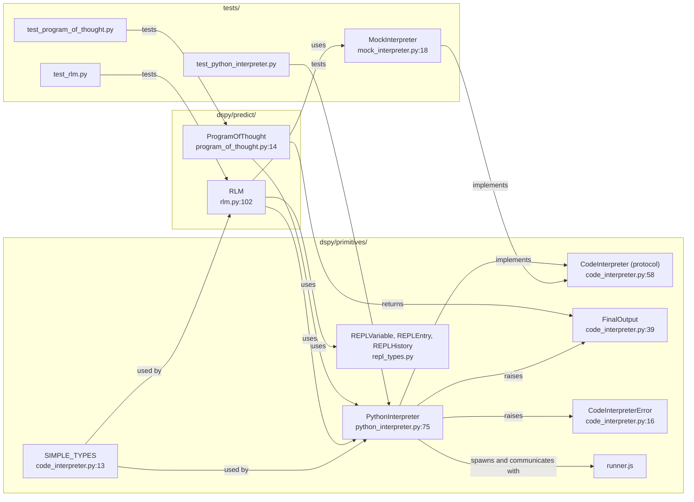

This page documents DSPy's mechanisms for validating LM outputs, enforcing constraints, and recovering from errors through retry logic. DSPy provides several layers of validation, from structural type-checking to semantic judging and agentic self-correction.

---

## Architecture Overview

Validation in DSPy occurs across three primary layers: the **Signature/Adapter** layer (structural), the **Module** layer (procedural/agentic), and the **Reliability/Judge** layer (semantic).

| Layer | Component | Role | Implementation |
|---|---|---|---|
| **Structural** | `Adapter` & `Pydantic` | Enforces JSON/Type schemas | [tests/reliability/test_pydantic_models.py:12-25]() |
| **Procedural** | `Retry` & `backtrack_handler` | Automated loops on failure | [tests/predict/test_retry.py:12-49]() |
| **Semantic** | `LLM Judge` | Validates correctness via another LM | [tests/reliability/utils.py:15-40]() |

---

## Structural Validation: Pydantic & Enums

DSPy uses Pydantic models and Python Enums within `Signatures` to enforce strict output formats. The `Adapter` (e.g., `ChatAdapter`, `JSONAdapter`) is responsible for parsing raw LM strings into these structured objects.

### Complex Type Enforcement
Signatures can define `OutputField` types using Pydantic classes, `Literal`, or `Enum`. If the LM output fails to parse into these types, the system can trigger a retry or raise a validation error.

**Diagram: Type-Level Validation Flow**


Sources: [tests/reliability/test_pydantic_models.py:49-62](), [tests/reliability/utils.py:146-152]()

---

## Procedural Validation: The Retry Mechanism

The `dspy.Retry` module is a wrapper designed to handle failures by feeding "past" incorrect outputs and feedback back into the LM prompt.

### Signature Augmentation
When a module is wrapped in `Retry`, DSPy dynamically generates a `new_signature`. This signature includes:
1.  All original input fields.
2.  `past_{field}` fields for each output field that failed validation.
3.  A `feedback` field containing the error message or "nudge" [tests/predict/test_retry.py:15-17]().

### Backtracking with `Suggest` and `Assert`
*   **`dspy.Suggest(condition, message)`**: A non-fatal constraint. If the condition is false, it triggers a backtrack (retry) up to `max_backtracks`. If it still fails, the program continues with a warning [tests/predict/test_retry.py:42-43]().
*   **`dspy.Assert(condition, message)`**: A fatal constraint. If the condition fails after all retries, it raises a `dspy.AssertionError`.

**Diagram: Retry Logic and Backtracking**


Sources: [tests/predict/test_retry.py:46-49](), [tests/predict/test_retry.py:21-26]()

---

## Semantic Validation: The LLM Judge

For complex tasks where code-based checks are insufficient (e.g., "Is this summary concise?"), DSPy utilizes an **LLM Judge** pattern.

### Judge Signature
A dedicated `JudgeSignature` is used to evaluate the input and output of a program against specific `grading_guidelines` [tests/reliability/utils.py:92-111]().

```python
class JudgeSignature(dspy.Signature):
    program_input: str = dspy.InputField()
    program_output: str = dspy.InputField()
    guidelines: str = dspy.InputField()
    judge_response: JudgeResponse = dspy.OutputField() # correct: bool, justification: str
```

### Reliability Testing Framework
The `assert_program_output_correct` utility automates this process by:
1.  Switching the DSPy context to a high-quality "judge" model (e.g., GPT-4o) [tests/reliability/utils.py:33-35]().
2.  Executing the `JudgeSignature` [tests/reliability/utils.py:113]().
3.  Asserting the `judge_response.correct` boolean [tests/reliability/utils.py:40]().

Sources: [tests/reliability/utils.py:15-41](), [tests/reliability/utils.py:87-113]()

---

## Multi-Chain Comparison

The `dspy.MultiChainComparison` module provides a specific validation pattern for consensus. It takes multiple candidate `completions` and a `question`, then produces a single refined `Prediction` by comparing the rationales and answers of the candidates [tests/predict/test_multi_chain_comparison.py:31-37]().

---

## Summary of Validation Patterns

| Pattern | Module/Utility | Best Use Case |
|---|---|---|
| **Schema Validation** | `pydantic.BaseModel` | Ensuring JSON structure and field types. |
| **Categorical Validation** | `Enum` / `Literal` | Forcing classification into specific labels. |
| **Self-Correction** | `dspy.Retry` + `dspy.Suggest` | Fixing hallucinations or formatting errors iteratively. |
| **Semantic Review** | `assert_program_output_correct` | High-level quality checks using a stronger model. |
| **Consensus** | `MultiChainComparison` | Reducing variance by comparing multiple LM attempts. |

Sources: [tests/reliability/test_pydantic_models.py:112-151](), [tests/predict/test_retry.py:12-26](), [tests/predict/test_multi_chain_comparison.py:29-41]()

# Code Execution & Sandboxing


This page documents DSPy's sandboxed Python code execution system: the `CodeInterpreter` protocol, the `PythonInterpreter` implementation (backed by Deno and Pyodide/WASM), the JSON-RPC communication protocol between host and sandbox, the security permission model, and the higher-level modules (`ProgramOfThought`, `RLM`) that use the sandbox.

For tool registration at the DSPy adapter level, see [Tool Integration & Function Calling](3.3). For the reasoning modules that drive code generation, see [Reasoning Strategies](3.2).

---

## Overview

DSPy provides sandboxed Python code execution for modules that need to run LLM-generated code safely. The key design decision is that user code runs inside a **WebAssembly (WASM) sandbox** via [Pyodide](https://pyodide.org/) hosted by the [Deno](https://deno.com/) runtime, not in the host Python process. This isolates generated code from the host filesystem, network, and environment by default.

**Architecture layers:**

| Layer | Component | Role |
|---|---|---|
| Protocol | `CodeInterpreter` (protocol) | Abstract interface for execution environments |
| Sandbox host | `PythonInterpreter` | Manages Deno subprocess, serializes variables |
| Sandbox runtime | `runner.js` | Deno-side: loads Pyodide, dispatches JSON-RPC |
| Communication | JSON-RPC 2.0 | stdin/stdout protocol between host and sandbox |
| Modules | `ProgramOfThought`, `RLM` | DSPy modules that drive code generation & execution |
| Testing | `MockInterpreter` | Scriptable responses, no Deno required |

Sources: [dspy/primitives/code_interpreter.py:1-10](), [dspy/primitives/python_interpreter.py:1-8](), [dspy/primitives/runner.js:1-6]()

---

## Core Abstractions

### `CodeInterpreter` Protocol

[dspy/primitives/code_interpreter.py:58-148]() defines `CodeInterpreter` as a `runtime_checkable` `Protocol`. Any class implementing the following interface can be used as a code execution backend:

| Method / Property | Signature | Description |
|---|---|---|
| `tools` | `dict[str, Callable[..., str]]` | Host-side functions callable from sandbox code |
| `start()` | `-> None` | Pre-warm the interpreter (idempotent, lazy if not called) |
| `execute(code, variables)` | `-> Any` | Run code, return result or `FinalOutput` |
| `shutdown()` | `-> None` | Release resources, end session |

State **persists across `execute()` calls** within a single session. Variables defined in one call are visible in the next.

### `FinalOutput`

[dspy/primitives/code_interpreter.py:39-55]() defines `FinalOutput`, a simple wrapper returned by `execute()` when the sandbox code calls `SUBMIT()`. It signals that the execution loop should terminate and propagate the contained value to the caller.

```python
FinalOutput(output={"answer": "42"})
```

### `CodeInterpreterError`

[dspy/primitives/code_interpreter.py:16-36]() defines `CodeInterpreterError(RuntimeError)`. It covers two failure modes:

- **Execution errors**: User code raised `NameError`, `TypeError`, tool call failure, etc.
- **Protocol errors**: Malformed JSON, sandbox process crash, invalid JSON-RPC structure.

`SyntaxError` is raised directly (not wrapped) for invalid Python syntax.

### `SIMPLE_TYPES`

[dspy/primitives/code_interpreter.py:13]() defines `SIMPLE_TYPES = (str, int, float, bool, list, dict, type(None))`. This constant is used both by `PythonInterpreter._extract_parameters()` and `RLM._get_output_fields_info()` to determine which types can be expressed in a typed function signature for `SUBMIT()`.

Sources: [dspy/primitives/code_interpreter.py:1-149]()

---

## `PythonInterpreter`

`PythonInterpreter` ([dspy/primitives/python_interpreter.py:75-596]()) is the production implementation. It launches a Deno subprocess that runs `runner.js`, communicates over stdin/stdout via JSON-RPC 2.0, and isolates user code in a Pyodide/WASM environment.

### Architecture Diagram

**`PythonInterpreter` component relationships**



Sources: [dspy/primitives/python_interpreter.py:100-597](), [dspy/primitives/runner.js:141-389]()

### Lifecycle

The interpreter follows a lazy initialization model:

1. **Construction** (`__init__`): Builds the `deno_command` argument list [dspy/primitives/python_interpreter.py:100-173](). No subprocess yet.
2. **First `execute()`**: Calls `_ensure_deno_process()` [dspy/primitives/python_interpreter.py:316-341](), which spawns the Deno subprocess and runs `_health_check()`.
3. **`_mount_files()`**: Copies host files into the Pyodide virtual filesystem (`/sandbox/<name>`) [dspy/primitives/python_interpreter.py:217-237]().
4. **`_register_tools()`**: Sends a `register` JSON-RPC request with tool signatures and output field definitions [dspy/primitives/python_interpreter.py:239-276]().
5. **`execute()` loop**: Sends `execute` request; handles `tool_call` requests (back-and-forth) until a `result` or `error` arrives [dspy/primitives/python_interpreter.py:484-596]().
6. **`shutdown()`**: Sends `shutdown` notification, waits for process to exit [dspy/primitives/python_interpreter.py:355-367]().

Use as a context manager:

```python
with PythonInterpreter() as interp:
    result = interp("print(1 + 2)")
# shutdown() called automatically
```

Sources: [dspy/primitives/python_interpreter.py:316-596]()

---

## Security Model

The security model is based on Deno's permission flags. All permissions default to **deny**; specific capabilities must be explicitly enabled.

**Default sandbox restrictions (no explicit grants):**



**Opt-in grants:**

| Grant | Constructor parameter | Deno flag |
|---|---|---|
| Read specific files/dirs | `enable_read_paths` | `--allow-read=<paths>` |
| Write specific files/dirs | `enable_write_paths` | `--allow-write=<paths>` |
| Specific env vars | `enable_env_vars` | `--allow-env=<vars>` |
| Specific network hosts | `enable_network_access` | `--allow-net=<hosts>` |

Deno's runner script (`runner.js`) and its cache directory are always allowed for reading so that Pyodide can load its WASM packages [dspy/primitives/python_interpreter.py:145-156]().

File access inside the sandbox uses **virtual paths**: `enable_read_paths=["/host/secret.txt"]` mounts to `/sandbox/secret.txt` inside the WASM environment [dspy/primitives/python_interpreter.py:228-231]().

Sources: [dspy/primitives/python_interpreter.py:140-173](), [dspy/primitives/python_interpreter.py:217-237]()

### Thread Safety

`PythonInterpreter` is **not thread-safe**. `_check_thread_ownership()` ([dspy/primitives/python_interpreter.py:181-190]()) records the first thread to call `execute()` and raises `RuntimeError` if a different thread attempts to use the same instance. Create one instance per thread.

---

## JSON-RPC 2.0 Communication Protocol

Host (`PythonInterpreter`) and sandbox (`runner.js`) communicate over the Deno subprocess's stdin/stdout using JSON-RPC 2.0 messages, one per line.

**Message flow diagram**



Sources: [dspy/primitives/python_interpreter.py:49-73](), [dspy/primitives/python_interpreter.py:369-395](), [dspy/primitives/runner.js:94-132](), [dspy/primitives/runner.js:327-385]()

### JSON-RPC Methods

| Method | Direction | Description |
|---|---|---|
| `mount_file` | host → sandbox | Copy a host file into the WASM virtual filesystem |
| `register` | host → sandbox | Install tool wrapper functions and typed `SUBMIT()` |
| `inject_var` | host → sandbox | Write large variable data as JSON to `/tmp/dspy_vars/` |
| `execute` | host → sandbox | Run user Python code, return result/error |
| `tool_call` | sandbox → host | Call a host-side tool function |
| `sync_file` | host → sandbox (notification) | Write WASM file back to host path |
| `shutdown` | host → sandbox (notification) | Terminate the Deno process |

Error codes follow JSON-RPC 2.0 conventions: protocol errors in `-32700`–`-32600` [dspy/primitives/runner.js:96-100](), application errors (`SyntaxError`, `NameError`, etc.) in `-32000`–`-32099` [dspy/primitives/python_interpreter.py:35-46]().

Sources: [dspy/primitives/python_interpreter.py:34-46](), [dspy/primitives/runner.js:95-114]()

---

## Variable Injection

When `execute(code, variables={...})` is called, the host serializes variables and prepends assignment statements to the code before sending it to the sandbox.

### Small Variables

[dspy/primitives/python_interpreter.py:444-478]() serializes small values to Python literal syntax (e.g., `x = [1, 2, 3]`). Supported types: `None`, `str`, `bool`, `int`, `float`, `list`, `tuple`, `dict`, `set`. Tuples and sets are converted to lists since JSON doesn't support them.

### Large Variables

Pyodide's FFI crashes at 128 MB. Strings serialized above `LARGE_VAR_THRESHOLD` (100 MB, [dspy/primitives/python_interpreter.py:28]()) are injected via the virtual filesystem instead:

1. Host sends `inject_var` JSON-RPC with the variable name and JSON-encoded value [dspy/primitives/python_interpreter.py:421-435]().
2. `runner.js` writes `/tmp/dspy_vars/<name>.json` in the WASM virtual filesystem [dspy/primitives/runner.js:246-253]().
3. Injected code reads the variable: `name = json.loads(open('/tmp/dspy_vars/name.json').read())` [dspy/primitives/python_interpreter.py:437-442]().

Sources: [dspy/primitives/python_interpreter.py:419-482]()

---

## `runner.js`: Deno-Side Runtime

[dspy/primitives/runner.js]() is the Deno script that runs inside the subprocess. Its responsibilities:

1. **Loads Pyodide** via `npm:pyodide/pyodide.js` [dspy/primitives/runner.js:3]().
2. **Installs the tool bridge**: `toolCallBridge()` ([dspy/primitives/runner.js:151-202]()) is exposed to the Python environment as `_js_tool_call` [dspy/primitives/runner.js:205]().
3. **Manages the main loop**: Reads JSON-RPC lines from stdin, dispatches to handlers [dspy/primitives/runner.js:222-389]().
4. **Executes user code**: For each `execute` request, runs `PYTHON_SETUP_CODE` then `runPythonAsync(code)` [dspy/primitives/runner.js:338-348]().

### `PYTHON_SETUP_CODE`

[dspy/primitives/runner.js:13-31]() is a Python snippet injected before every user code execution:

- Redirects `sys.stdout`/`sys.stderr` to `StringIO` buffers.
- Defines `last_exception_args()` helper to extract exception args across the JS/Python boundary.
- Defines a default single-argument `SUBMIT(output)` that raises `FinalOutput`.

### Tool Wrapper Generation

`makeToolWrapper(toolName, parameters)` ([dspy/primitives/runner.js:43-65]()) generates Python code for each registered tool. The generated function calls `_js_tool_call(name, argsJson)` and handles the response.

`makeSubmitWrapper(outputs)` ([dspy/primitives/runner.js:69-89]()) generates a typed `SUBMIT()` function when output fields are registered.

Sources: [dspy/primitives/runner.js:10-89](), [dspy/primitives/runner.js:141-220]()

---

## Using Interpreter in DSPy Modules

### `ProgramOfThought`

[dspy/predict/program_of_thought.py:14-180]() is a `Module` that:

1. Uses `code_generate` (a `ChainOfThought`) to ask the LLM to write Python code [dspy/predict/program_of_thought.py:159]().
2. Parses the code via `_parse_code()` [dspy/predict/program_of_thought.py:161]().
3. Executes it via `self.interpreter.execute(code)` [dspy/predict/program_of_thought.py:148]().
4. On failure, uses `code_regenerate` to ask the LLM to fix the error [dspy/predict/program_of_thought.py:172]().

The retry loop runs up to `max_iters` times (default: 3) [dspy/predict/program_of_thought.py:166]().

Sources: [dspy/predict/program_of_thought.py:14-180]()

### `RLM` (Recursive Language Model)

[dspy/predict/rlm.py:101-550]() is a module for iterative REPL-style reasoning over large inputs.

**`RLM` execution flow:**



Sources: [dspy/predict/rlm.py:125-550]()

### `RLM` Tool Integration

`RLM` creates two built-in tools per `forward()` call:

- `llm_query(prompt: str) -> str`: Calls the configured LM [dspy/predict/rlm.py:225-248]().
- `llm_query_batched(prompts: list[str]) -> list[str]`: Concurrent calls via `ThreadPoolExecutor` [dspy/predict/rlm.py:250-276]().

Sources: [dspy/predict/rlm.py:225-276](), [dspy/predict/rlm.py:377-412]()

---

## REPL Data Types (`repl_types.py`)

[dspy/primitives/repl_types.py]() defines structured types for the RLM execution history:

| Class | Description |
|---|---|
| `REPLVariable` | Metadata about a variable (name, type, preview, desc). [dspy/primitives/repl_types.py:26-100]() |
| `REPLEntry` | One REPL interaction: `reasoning`, `code`, `output`. [dspy/primitives/repl_types.py:102-126]() |
| `REPLHistory` | Immutable ordered list of `REPLEntry`. [dspy/primitives/repl_types.py:128-162]() |

Sources: [dspy/primitives/repl_types.py:1-162]()

---

## Component Map

**Code entities and their file locations**



Sources: [dspy/primitives/__init__.py:1-18](), [dspy/primitives/code_interpreter.py:1-149](), [dspy/primitives/python_interpreter.py:1-22]()