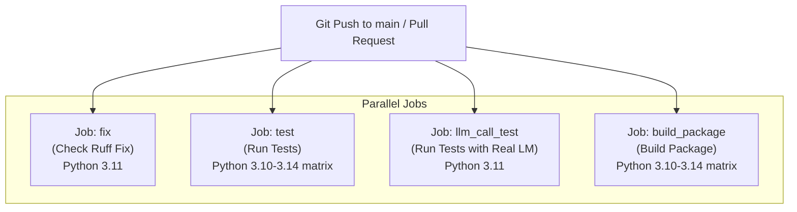
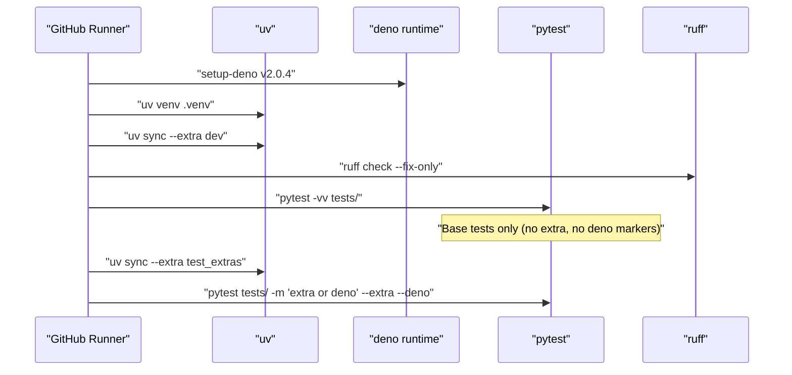

This page covers the project build configuration, dependency management, code quality tooling, and GitHub Actions CI/CD pipeline for DSPy. It explains how the package is assembled and validated on every push and pull request.

For the release process (TestPyPI validation, PyPI publishing, version management), see [Package Metadata & Release Process](#7.4). For the test suite structure and test markers, see [Testing Framework](#7.2).

---

## Build System

DSPy uses [setuptools](https://setuptools.pypa.io/) as its build backend, declared in `pyproject.toml`. The build backend and its minimum version are pinned explicitly.

[pyproject.toml:1-3]()

```toml
[build-system]
requires = ["setuptools>=77.0.1"]
build-backend = "setuptools.build_meta"
```

### Package Discovery

Setuptools is configured to scan the repository root for the `dspy` package and all of its sub-packages, while explicitly excluding the `tests` directory from the distribution.

[pyproject.toml:70-73]()

| Setting | Value |
|---|---|
| `packages.find.where` | `.` (repo root) |
| `packages.find.include` | `dspy`, `dspy.*` |
| `packages.find.exclude` | `tests`, `tests.*` |
| `package-data` | `dspy/primitives/*.js` |

The `dspy/primitives/*.js` entry ensures that the JavaScript runtime files used by the `PythonInterpreter` (Deno/Pyodide execution) are bundled into the wheel [pyproject.toml:75-76](). See [Code Execution & Sandboxing](#5.6) for details on how these files are used at runtime.

---

## Project Metadata & Python Version Support

[pyproject.toml:5-22]()

| Field | Value |
|---|---|
| `name` | `dspy` |
| `version` | `3.2.0` (managed by release automation) |
| `requires-python` | `>=3.10, <3.15` |
| `license` | `LICENSE` file |
| `author` | Omar Khattab |

Python versions 3.10 through 3.14 are supported [pyproject.toml:16](). The upper bound `<3.15` is enforced in the project metadata, and the CI matrix tests the full range [.github/workflows/run_tests.yml:52]().

---

## Dependency Groups

`pyproject.toml` declares three categories of dependencies.

### Core (Required) Dependencies

[pyproject.toml:23-42]()

| Package | Minimum Version | Role |
|---|---|---|
| `litellm` | `>=1.64.0` | LM provider abstraction |
| `openai` | `>=0.28.1` | OpenAI API client |
| `pydantic` | `>=2.0` | Data validation and signatures |
| `diskcache` | `>=5.6.0` | Disk-based LM response cache |
| `cachetools` | `>=5.5.0` | In-memory caching |
| `orjson` | `>=3.9.0` | Fast JSON serialization |
| `json-repair` | `>=0.54.2` | LM output repair |
| `tenacity` | `>=8.2.3` | Retry logic |
| `anyio` | latest | Async I/O compatibility |
| `asyncer` | `==0.0.8` | Async/sync bridge |
| `cloudpickle` | `>=3.1.2` | State serialization |
| `xxhash` | `>=3.5.0` | Cache key hashing |
| `numpy` | `>=1.26.0` | Numerical operations |
| `tqdm` | `>=4.66.1` | Progress bars |
| `requests` | `>=2.31.0` | HTTP client |
| `regex` | `>=2023.10.3` | Pattern matching |
| `gepa[dspy]` | `==0.1.1` | GEPA optimizer |
| `typeguard` | `4.4.3` | Runtime type checking |

### Optional Dependencies

[pyproject.toml:44-68]()

| Extra Name | Packages | Use Case |
|---|---|---|
| `anthropic` | `anthropic>=0.18.0,<1.0.0` | Anthropic native client |
| `weaviate` | `weaviate-client~=4.5.4` | Weaviate vector store |
| `mcp` | `mcp` (Python ≥ 3.10) | Model Context Protocol |
| `langchain` | `langchain_core` | LangChain integration |
| `optuna` | `optuna>=3.4.0` | Bayesian optimization (MIPROv2) |
| `dev` | pytest, ruff, pre-commit, pillow, build, litellm[proxy] | Development tooling |
| `test_extras` | mcp, datasets, pandas, optuna, langchain_core | Extended test coverage |

The `dev` extra has a platform/version conditional for `litellm`:
- On Windows or Python 3.14: plain `litellm>=1.64.0` [pyproject.toml:59]()
- Otherwise: `litellm[proxy]>=1.64.0` (the proxy feature requires `uvloop`, which does not yet support Python 3.14) [pyproject.toml:60]()

---

## Code Quality: Ruff

Ruff is used for both linting and formatting. Its configuration lives in `pyproject.toml`.

[pyproject.toml:120-188]()

**Diagram: Ruff Configuration Overview**

```mermaid
graph TD
    RuffTool["[tool.ruff]"]
    RuffTool --> Include["include: dspy/**/*.py, tests/**/*.py"]
    RuffTool --> Exclude["exclude: dspy/__metadata__.py, tests/reliability/*.py"]
    RuffTool --> LineLen["line-length: 120"]
    RuffTool --> Target["target-version: py310"]

    RuffLint["[tool.ruff.lint]"]
    RuffLint --> E["E - pycodestyle errors"]
    RuffLint --> W["W - pycodestyle warnings"]
    RuffLint --> F["F - pyflakes"]
    RuffLint --> I["I - isort"]
    RuffLint --> B["B - flake8-bugbear"]
    RuffLint --> UP["UP - pyupgrade"]
    RuffLint --> N["N - pep8-naming"]
    RuffLint --> RUF["RUF - ruff-specific"]
    RuffLint --> Q["Q - flake8-quotes"]

    PerFileIgnores["[tool.ruff.lint.per-file-ignores]"]
    PerFileIgnores --> Tests["tests/**/*.py: S101, TID252, ARG001"]
    PerFileIgnores --> Init["__init__.py: F401"]
    PerFileIgnores --> DspyInit["dspy/__init__.py: I001, E402, F405"]
```



Sources: [pyproject.toml:120-188]()

Key lint rule decisions:

| Rule ID | Action | Reason |
|---|---|---|
| `E501` | ignored | Line length enforced by formatter, not linter [pyproject.toml:150]() |
| `F403` | ignored | Wildcard imports used in `__init__.py` files [pyproject.toml:154]() |
| `B904` | ignored | Allows raising custom exceptions inside `except` blocks [pyproject.toml:153]() |
| `C901` | ignored | Complexity checking disabled [pyproject.toml:149]() |
| `S101` | ignored in tests | `assert` statements are valid in pytest [pyproject.toml:179]() |
| `TID252` | ignored in tests | Relative imports allowed in test files [pyproject.toml:180]() |

Ruff's isort configuration declares `dspy` as a first-party package [pyproject.toml:172](), and all relative imports are banned across the main `dspy/` source [pyproject.toml:175]().

---

## Dependency Management: uv

The CI pipeline uses [uv](https://github.com/astral-sh/uv) for dependency installation and virtual environment management, via the `astral-sh/setup-uv@v8.1.0` action [.github/workflows/run_tests.yml:22, 65, 99, 153]().

The standard installation commands used in CI:

| Command | Purpose |
|---|---|
| `uv venv .venv` | Create virtual environment [.github/workflows/run_tests.yml:30, 73, 107, 161]() |
| `uv sync --dev -p .venv --extra dev` | Install core + dev extras [.github/workflows/run_tests.yml:33, 77, 111, 164]() |
| `uv sync -p .venv --extra dev --extra test_extras` | Add test_extras for second test pass [.github/workflows/run_tests.yml:86]() |
| `uv run -p .venv pytest ...` | Run tests inside the managed venv [.github/workflows/run_tests.yml:84, 88, 133]() |
| `uv run -p .venv python -m build` | Build the wheel [.github/workflows/run_tests.yml:166]() |

Caching is enabled for both `pyproject.toml` and `uv.lock` to speed up repeated CI runs [.github/workflows/run_tests.yml:25-27]().

---

## CI/CD Pipeline

The pipeline is defined in `.github/workflows/run_tests.yml`. It runs on every push to `main` and on pull request events (`opened`, `synchronize`, `reopened`).

[.github/workflows/run_tests.yml:1-9]()

**Diagram: CI Job Dependency and Execution Flow**



Sources: [.github/workflows/run_tests.yml:1-171]()

---

### Job: `fix` — Ruff Lint Check

[.github/workflows/run_tests.yml:11-46]()

Runs on Python 3.11. The job:
1. Installs uv and syncs the `dev` extra [.github/workflows/run_tests.yml:33]()
2. Runs `ruff check --fix-only --diff --exit-non-zero-on-fix` [.github/workflows/run_tests.yml:36]()

If Ruff finds issues that can be auto-fixed, the job fails with instructions to run `pre-commit run --all-files` locally before pushing [.github/workflows/run_tests.yml:41]().

---

### Job: `test` — Unit and Integration Tests

[.github/workflows/run_tests.yml:48-89]()

Runs a matrix across Python versions 3.10, 3.11, 3.12, 3.13, and 3.14 [.github/workflows/run_tests.yml:52]().

1. **Installs Deno** — required for sandboxed code execution tests marked `deno` [.github/workflows/run_tests.yml:59]()
2. **Installs uv + dev extra** [.github/workflows/run_tests.yml:77]()
3. **Runs base tests**: `pytest -vv tests/` [.github/workflows/run_tests.yml:84]()
4. **Installs `test_extras`**: adds `mcp`, `datasets`, `pandas`, `optuna`, `langchain_core` [.github/workflows/run_tests.yml:86]()
5. **Runs extra and deno tests**: `pytest tests/ -m 'extra or deno' --extra --deno` [.github/workflows/run_tests.yml:88]()

**Diagram: test Job Steps and Commands**



Sources: [.github/workflows/run_tests.yml:48-89]()

---

### Job: `llm_call_test` — Real LM Integration Tests

[.github/workflows/run_tests.yml:91-140]()

Uses a local Ollama server (via Docker) to execute tests marked with `llm_call`, avoiding external API keys [.github/workflows/run_tests.yml:133]().

1. **Cache Ollama model data**: keyed by `ollama-llama3.2-3b-${{ runner.os }}-v1` [.github/workflows/run_tests.yml:118]()
2. **Start Ollama service**: Runs `ollama/ollama:latest` in Docker [.github/workflows/run_tests.yml:122-125]()
3. **Pull LLM**: Pulls `llama3.2:3b` if cache miss [.github/workflows/run_tests.yml:129]()
4. **Set LM environment variable**: `LM_FOR_TEST=ollama/llama3.2:3b` [.github/workflows/run_tests.yml:131]()
5. **Run tests**: `pytest -m llm_call --llm_call -vv --durations=5 tests/` [.github/workflows/run_tests.yml:133]()

---

### Job: `build_package` — Package Build Verification

[.github/workflows/run_tests.yml:142-171]()

Runs a matrix across Python 3.10–3.14.
1. Builds the package: `uv run -p .venv python -m build` [.github/workflows/run_tests.yml:166]()
2. Installs the built wheel: `uv pip install dist/*.whl -p .venv` [.github/workflows/run_tests.yml:168]()
3. Verifies import: `uv run -p .venv python -c "import dspy"` [.github/workflows/run_tests.yml:170]()

---

## pytest Configuration

[pyproject.toml:112-118]()

The `[tool.pytest.ini_options]` suppresses a recurring `DeprecationWarning` from `litellm`:

```toml
[tool.pytest.ini_options]
filterwarnings = [
    "ignore:.+class-based `config` is deprecated, use ConfigDict:DeprecationWarning",
]
```

Test markers like `llm_call`, `extra`, and `deno` are configured in `tests/conftest.py` [tests/conftest.py:8-53]().

---

## Coverage Configuration

[pyproject.toml:81-110]()

| Setting | Value |
|---|---|
| `branch` | `true` [pyproject.toml:82]() |
| Omitted paths | `__init__.py`, test files, `venv`, `setup.py` [pyproject.toml:83-95]() |

Excluded lines from reports include `pragma: no cover`, `def __repr__`, `raise AssertionError`, and logger calls [pyproject.toml:98-110]().

---

## Local Development Setup

To replicate the CI environment locally using [uv](https://github.com/astral-sh/uv):

```bash
# Fork and clone the repo
git clone {url-to-your-fork}
cd dspy

# Create virtual environment and sync dev dependencies
uv venv --python 3.10
uv sync --extra dev

# Install pre-commit hooks
pre-commit install

# Run unit tests
uv run pytest tests/predict
```

Sources: [CONTRIBUTING.md:93-128](), [pyproject.toml:50-61]()