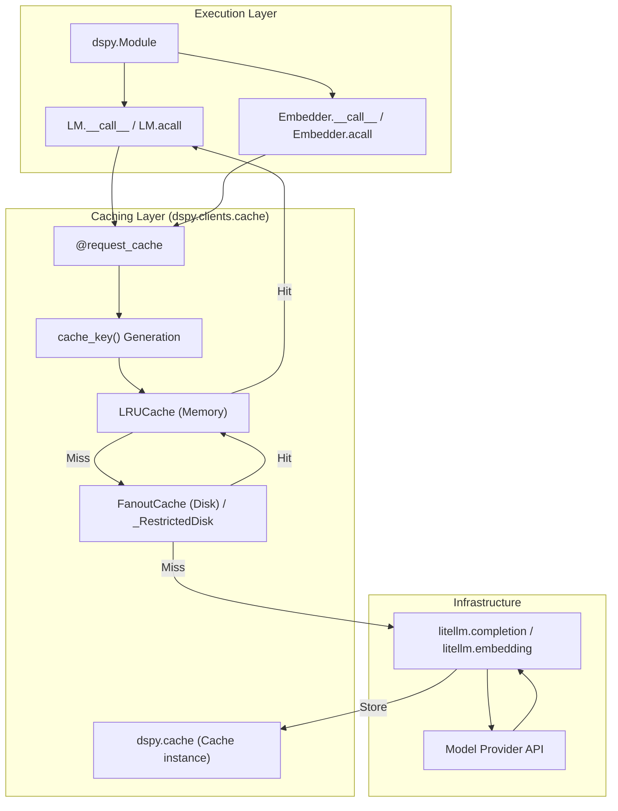
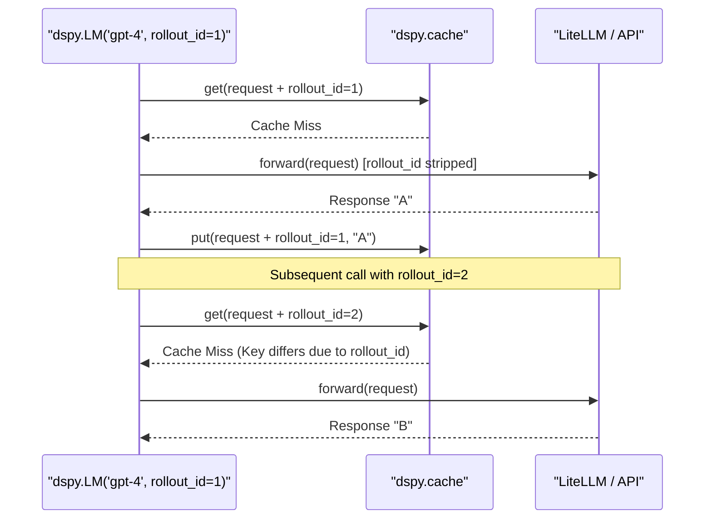

This page documents DSPy's sophisticated caching architecture, including the `request_cache` system, memory and disk-based persistence, cache key computation, and the `rollout_id` mechanism for experimental control. Caching is a core performance feature in DSPy that minimizes API costs and reduces latency by reusing previous language model and embedding responses.

---

## Caching Architecture Overview

DSPy implements a tiered caching strategy that sits between the high-level `dspy.Module` and the low-level LM providers. The system is designed to be transparent to the user while providing deep hooks for customization and performance tuning.

### The Two-Tier Cache System
The `Cache` class provides two levels of storage:
1.  **In-Memory Cache**: Implemented using `cachetools.LRUCache`. It offers O(1) access for frequently used data within a single process lifetime [dspy/clients/cache.py:43-46]().
2.  **On-Disk Cache**: Powered by `diskcache.FanoutCache`. This provides persistent storage across process restarts and can be shared across multiple runs [dspy/clients/cache.py:45-46]().

**Data Flow: Request to Cache Lookup**

Sources: [dspy/clients/cache.py:40-46](), [dspy/clients/lm.py:147-157](), [dspy/clients/embedding.py:131-137](), [docs/docs/tutorials/cache/index.md:7-13]()

---

## Cache Key Computation

The uniqueness of a cache entry is determined by its cache key. DSPy computes this key by hashing the request parameters, ensuring that identical semantic requests retrieve the same result.

### Computation Logic
The `Cache.cache_key` method performs the following steps:
1.  **Filtering**: Removes sensitive or transient arguments like `api_key`, `api_base`, and `base_url` to ensure the key only depends on model logic [dspy/clients/lm.py:148-153]().
2.  **Transformation**: The `_transform_value` function converts complex types (Pydantic models, callables, source code) into JSON-serializable strings [dspy/clients/cache.py:24-37]().
3.  **Hashing**: Uses `orjson` to dump parameters with `OPT_SORT_KEYS` enabled and computes a `sha256` hex digest [dspy/clients/cache.py:111-113]().

**Entity Mapping: Natural Language to Code Space**

| Concept | Code Entity | File Path |
| :--- | :--- | :--- |
| **Key Generator** | `Cache.cache_key()` | [dspy/clients/cache.py:104]() |
| **Ignored Args** | `ignored_args_for_cache_key` | [dspy/clients/lm.py:148]() |
| **Hashing Engine** | `sha256` / `orjson` | [dspy/clients/cache.py:7-11]() |
| **Type Transformer** | `_transform_value()` | [dspy/clients/cache.py:24]() |
| **Cache Decorator** | `@request_cache` | [dspy/clients/cache.py:192]() |

Sources: [dspy/clients/cache.py:24-113](), [dspy/clients/lm.py:147-157]()

---

## Cache Control with Rollout ID

The `rollout_id` is an optional integer parameter used to differentiate cache entries for otherwise identical requests. It is primarily used for experiments where the same prompt might need to generate different samples (e.g., during optimization or bootstrapping).

### Rollout ID Mechanics
- **Cache Isolation**: When a `rollout_id` is provided in `kwargs`, it is included in the dictionary passed to `cache_key`, effectively creating a unique namespace for that specific rollout [dspy/clients/lm.py:106-111]().
- **Stripping**: Before the request is sent to the provider via `litellm`, the `rollout_id` is stripped to prevent provider-side errors [dspy/clients/lm.py:71-72]().
- **Temperature Constraint**: `rollout_id` only affects caching when `temperature > 0`. If `temperature=0`, DSPy issues a warning because the model output is deterministic, making rollout-based isolation redundant [dspy/clients/lm.py:139-145]().

**Sequence: Rollout ID Cache Isolation**

Sources: [dspy/clients/lm.py:106-113](), [tests/clients/test_lm.py:134-180]()

---

## Security & Restricted Deserialization

By default, DSPy's on-disk cache uses Python's `pickle`. To mitigate security risks associated with arbitrary code execution during deserialization, DSPy provides a restricted mode.

### Restricted Pickle Mode
The `restrict_pickle` option in `configure_cache` swaps the standard disk implementation for `_RestrictedDisk` [dspy/clients/cache.py:88-93]().
- **Trusted Prefixes**: Automatically allows `litellm.types.*` and `openai.types.*` [dspy/clients/disk_serialization.py:23-26]().
- **NumPy Support**: Includes a hardcoded allowlist for `numpy.ndarray` reconstruction [dspy/clients/disk_serialization.py:28-36]().
- **User Allowlist**: Users can register custom types via the `safe_types` argument [dspy/clients/cache.py:67-68]().

Sources: [dspy/clients/disk_serialization.py:1-88](), [dspy/clients/cache.py:88-94]()

---

## Global Configuration & Management

DSPy provides global utilities to configure the behavior of the caching system.

### Configuration Function
The `configure_cache` function allows developers to toggle tiers and set limits:
- `enable_disk_cache`: (bool) Defaults to `True` [dspy/clients/__init__.py:21]().
- `enable_memory_cache`: (bool) Defaults to `True` [dspy/clients/__init__.py:22]().
- `disk_cache_dir`: Defaults to `~/.dspy_cache` or `DSPY_CACHEDIR` env var [dspy/clients/__init__.py:16]().
- `memory_max_entries`: Defaults to 1,000,000 [dspy/clients/__init__.py:25]().

### Cache Persistence & Reset
The `Cache` class supports programmatic management:
- **Reset**: `reset_memory_cache()` clears the LRU cache but preserves disk storage [dspy/clients/cache.py:186-188]().
- **Serialization**: `save_memory_cache(filepath)` and `load_memory_cache(filepath)` allow moving in-memory states between environments using `cloudpickle` [dspy/clients/cache.py:214-232]().

Sources: [dspy/clients/__init__.py:19-51](), [dspy/clients/cache.py:186-232]()

---

## Performance Metrics & Tracking

When a cache hit occurs, DSPy modifies the response metadata to assist in performance monitoring and cost accounting.

### Cache Hit Indicators
- **Execution Time**: Cached calls return significantly faster (e.g., < 1ms) [docs/docs/tutorials/cache/index.md:44-49]().
- **Usage Data**: On a cache hit, the `usage` field in the response is cleared (set to `{}`), and `cache_hit` is set to `True` [dspy/clients/cache.py:151-155]().
- **Cost Tracking**: Usage trackers like `track_usage()` will report zero tokens for cached calls [tests/clients/test_lm.py:95-98]().

### Provider-Side Caching
For high-performance applications, DSPy supports **Provider-Side Prompt Caching** (e.g., Anthropic, OpenAI) by passing `cache_control_injection_points` to the `LM` constructor [docs/docs/tutorials/cache/index.md:62-70]().

Sources: [dspy/clients/cache.py:149-155](), [docs/docs/tutorials/cache/index.md:15-50]()