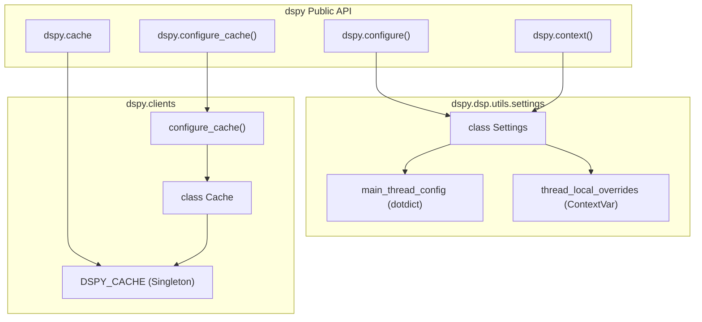
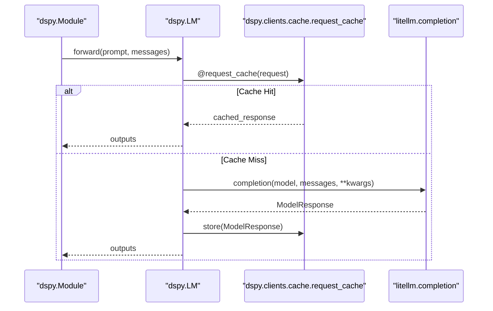

This page provides an overview of how DSPy is configured at runtime and how it integrates with external systems. It covers the settings system, model providers, retrieval backends, observability tools, and optional third-party framework integrations.

For detailed treatment of each topic, see the sub-pages: [Settings & Configuration Management](#6.1), [Model Providers & LiteLLM Integration](#6.2), [Vector Databases & Retrieval](#6.3), [Observability & Monitoring](#6.4), [External Framework Integration](#6.5), and [Model Context Protocol (MCP)](#6.6).

---

## Configuration & Integration Landscape

DSPy exposes its configuration surface primarily through the `Settings` singleton and global cache management functions. These are exposed in the top-level `dspy` namespace.

| Public Name | Underlying Binding | Purpose |
|---|---|---|
| `dspy.settings` | `dspy.dsp.utils.settings.Settings` | Singleton holding global configuration state |
| `dspy.configure` | `settings.configure` | Set global options (LM, RM, caching, etc.) |
| `dspy.context` | `settings.context` | Thread-safe temporary configuration override |
| `dspy.cache` | `DSPY_CACHE` | Access to the `Cache` object (disk/memory) |
| `dspy.configure_cache` | `clients.configure_cache` | Reconfigure the global cache instance |

[dspy/dsp/utils/settings.py:51-65](), [dspy/clients/__init__.py:19-25]()

Integrations are managed via core dependencies (like `litellm` and `diskcache`) and optional extras. The system is designed to be thread-safe, allowing concurrent execution with isolated contexts via `dspy.context`.

Sources: [dspy/dsp/utils/settings.py:51-116](), [dspy/clients/__init__.py:1-50]()

---

## Configuration Entry Points

**Diagram: Configuration Architecture and State Management**

Sources: [dspy/dsp/utils/settings.py:41-65](), [dspy/clients/__init__.py:37-50](), [dspy/clients/cache.py:18-24]()

---

## Global Settings Object

The `Settings` object is a thread-safe singleton defined in `dspy/dsp/utils/settings.py`. It uses `contextvars.ContextVar` to manage `thread_local_overrides`, ensuring that temporary changes made within a `dspy.context` block do not leak into other threads or async tasks.

| Setting Key | Default | Description |
|---|---|---|
| `lm` | `None` | Default language model (`dspy.LM`) |
| `adapter` | `None` | Default adapter for formatting (e.g., `ChatAdapter`) |
| `rm` | `None` | Default retrieval model |
| `async_max_workers` | `8` | Max concurrency for `asyncify` operations |
| `num_threads` | `8` | Max threads for `ParallelExecutor` |
| `track_usage` | `False` | Whether to track token usage globally |
| `max_errors` | `10` | Maximum errors before halting parallel operations |

`dspy.configure` can only be called by the thread that initially configured it to prevent race conditions in global state [dspy/dsp/utils/settings.py:117-128](). Other threads or async tasks must use `dspy.context` for local overrides [dspy/dsp/utils/settings.py:160-164]().

Sources: [dspy/dsp/utils/settings.py:15-38](), [dspy/dsp/utils/settings.py:51-116](), [dspy/dsp/utils/settings.py:165-182]()

---

## Model Routing & Caching

DSPy utilizes `litellm` as its primary model routing layer within the `LM` class [dspy/clients/lm.py:53-54](). It provides access to dozens of providers (OpenAI, Anthropic, Azure, etc.) through a unified interface. The `LM` class supports specific configurations for reasoning models like OpenAI's `o1` or `gpt-5` [dspy/clients/lm.py:88-105]().

Caching is handled by a two-level system integrated into the `LM.forward` pass via the `request_cache` decorator [dspy/clients/lm.py:149-153](). 
1.  **In-Memory**: Fast access for repeated calls in the same session.
2.  **On-Disk**: Persistent storage across runs.

The `rollout_id` parameter can be used to bypass existing cache entries for non-zero temperatures while still caching the new result [dspy/clients/lm.py:67-72]().

**Diagram: LM Request and Cache Flow**

Sources: [dspy/clients/lm.py:28-48](), [dspy/clients/lm.py:147-157](), [dspy/clients/base_lm.py:123-132](), [tests/clients/test_lm.py:70-100]()

---

## Parallelism and Async Integration

DSPy provides robust support for multi-threaded and asynchronous execution through `ParallelExecutor` and the `Parallel` module. These utilities ensure that `thread_local_overrides` are correctly propagated from parent threads/tasks to workers.

*   **`ParallelExecutor`**: Manages a `ThreadPoolExecutor` with error handling and `tqdm` progress tracking [dspy/utils/parallelizer.py:156-178](). It allows isolation of `dspy.settings` across tasks [dspy/utils/parallelizer.py:28-30]().
*   **`asyncify`**: Wraps synchronous DSPy programs to run in worker threads using `asyncer.asyncify`, inheriting the parent thread's configuration context [dspy/utils/asyncify.py:30-43]().
*   **`dspy.Parallel`**: A high-level utility for running lists of `(module, example)` pairs concurrently [dspy/predict/parallel.py:9-33]().

Sources: [dspy/utils/parallelizer.py:16-46](), [dspy/utils/asyncify.py:45-63](), [dspy/predict/parallel.py:77-108](), [tests/predict/test_parallel.py:5-40]()

---

## Embedding and Retrieval

The `Embedder` class provides a unified interface for computing embeddings, supporting both hosted models via `litellm` and custom local callables.

Retrieval integration is typically managed by setting the `rm` (retrieval model) in `dspy.settings`. Core support includes `ColBERTv2`, while other vector databases are integrated through the retrieval module system.

Sources: [dspy/dsp/utils/settings.py:18](), [dspy/clients/lm.py:14-19]()

---

## Sub-page Reference

| Sub-page | Topic |
|---|---|
| [Settings & Configuration Management](#6.1) | Deep dive into `settings`, `configure`, `context`, and all config keys. |
| [Model Providers & LiteLLM Integration](#6.2) | Provider-specific setup, `dspy.LM` configuration, and `litellm` features. |
| [Vector Databases & Retrieval](#6.3) | Retrieval Model (`RM`) interface, `Embedder` usage, and vector store support. |
| [Observability & Monitoring](#6.4) | Logging, tracing (`dspy.settings.trace`), and `track_usage` integration. |
| [External Framework Integration](#6.5) | Optional dependencies and integration with LangChain or Optuna. |
| [Model Context Protocol (MCP)](#6.6) | MCP tool server integration and async session handling. |