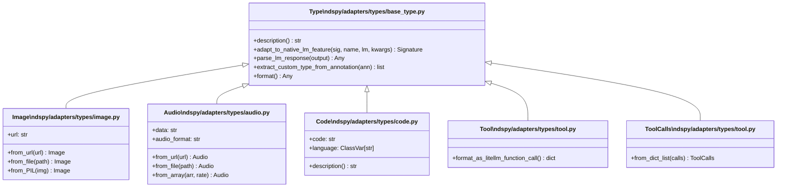
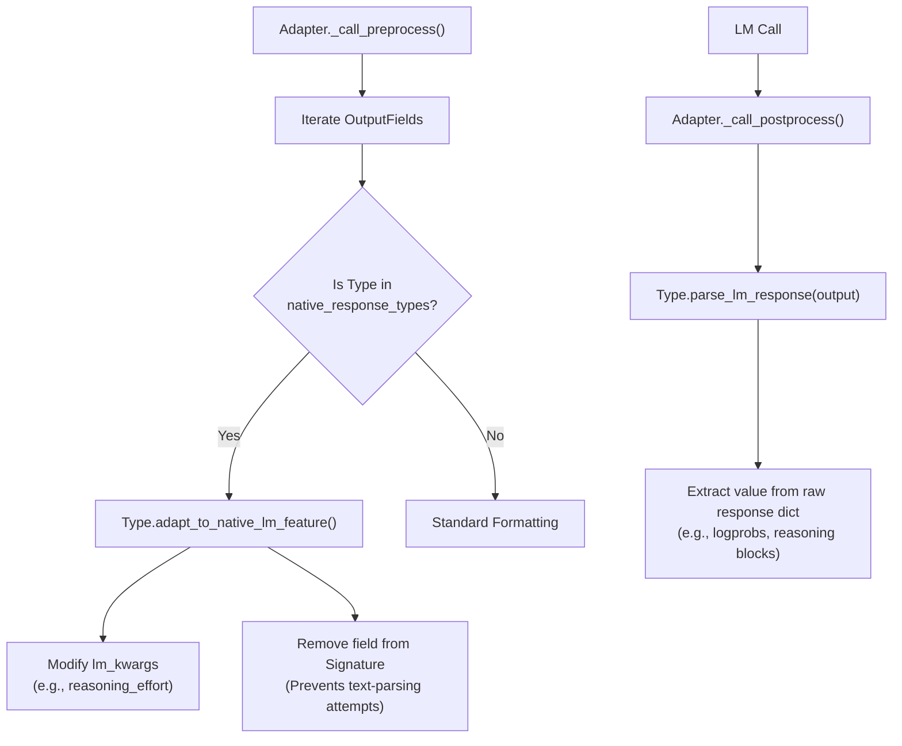
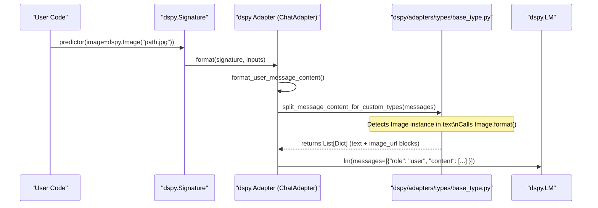

This page documents DSPy's custom type system, which allows signatures to carry structured, non-text data (images, audio, files, code) and semantic annotations (reasoning, tool calls) through the adapter pipeline. The type system determines how field values are serialized into LM messages and how LM responses are parsed back into typed Python objects.

For information about how the adapter pipeline formats and parses messages in general, see [Adapter System](#2.4). For details on how `Tool` and `ToolCalls` are used for agent-style function calling, see [Tool Integration & Function Calling](#3.3). For how `Reasoning` is used with chain-of-thought modules, see [Reasoning Strategies](#3.2). For `History` used in multi-turn conversations, see [History & Conversation Management](#3.6).

---

## The `Type` Extension System

All custom DSPy types descend from a single base class, `Type`, defined in `dspy/adapters/types/base_type.py`. Subclasses of `Type` can hook into the adapter lifecycle:

| Class Method | Purpose |
|---|---|
| `description()` | Returns a string that is injected into the system prompt to describe the type to the LM. |
| `adapt_to_native_lm_feature(signature, name, lm, lm_kwargs)` | Modifies the signature and LM kwargs before the call to activate native LM features (e.g., enabling reasoning APIs). |
| `parse_lm_response(output)` | Extracts the field value from the raw LM response dict when native features are in use. |
| `extract_custom_type_from_annotation(annotation)` | Class-level utility that recursively discovers `Type` subclasses within a field annotation (e.g., `list[Image]` → `[Image]`). |
| `format()` | Defines how the type instance is converted into a structured message content block (e.g., `image_url` or `input_audio`). |

The function `split_message_content_for_custom_types` (defined in `dspy/adapters/types/base_type.py`) is called during the adapter's message preparation. It scans every message's content for embedded custom type instances and transforms string content into a mixed list of `{"type": "text", ...}` and media-specific content blocks.

Sources: `dspy/adapters/types/base_type.py` [dspy/adapters/types/base_type.py:1-60](), `dspy/adapters/base.py` [dspy/adapters/base.py:295-301]()

---

## Built-in Custom Types

The following types are exported from `dspy/adapters/types/__init__.py` and re-exported at the top-level `dspy` namespace:

| Type | Module | Role |
|---|---|---|
| `Image` | `dspy/adapters/types/image.py` | Encodes an image by URL, file path, PIL object, or base64. |
| `Audio` | `dspy/adapters/types/audio.py` | Encodes audio by URL, file path, or numpy-like array. |
| `Code` | `dspy/adapters/types/code.py` | Tags a field as a code block; provides a rich type description and language tagging. |
| `Reasoning` | `dspy/adapters/types/reasoning.py` | Captures chain-of-thought reasoning; can use native LM reasoning APIs. |
| `History` | `dspy/adapters/types/history.py` | Represents conversation history; triggers multi-turn formatting in adapters. |
| `Tool` | `dspy/adapters/types/tool.py` | Wraps a Python callable as an LM-callable tool. |
| `ToolCalls` | `dspy/adapters/types/tool.py` | Captures structured tool invocations returned by the LM. |

**Type class hierarchy:**



Sources: `dspy/adapters/types/base_type.py` [dspy/adapters/types/base_type.py:1-60](), `dspy/adapters/types/image.py` [dspy/adapters/types/image.py:23-117](), `dspy/adapters/types/audio.py` [dspy/adapters/types/audio.py:25-117](), `dspy/adapters/types/code.py` [dspy/adapters/types/code.py:10-131]()

---

## Multimodal Types: Image and Audio

### Image

`dspy.Image` is a frozen Pydantic model used to pass image data. It supports automatic normalization of various inputs (URLs, local paths, bytes, PIL images) into base64 data URIs or plain URLs via the `encode_image` utility [dspy/adapters/types/image.py:128-177]().

**Usage in a signature:**
```python
class ImageSignature(dspy.Signature):
    image: dspy.Image = dspy.InputField()
    label: str = dspy.OutputField()
```

When `Image.format()` is called, it returns a standard message block:
`[{"type": "image_url", "image_url": {"url": image_url}}]` [dspy/adapters/types/image.py:74-79]().

Sources: `dspy/adapters/types/image.py` [dspy/adapters/types/image.py:23-71](), `tests/signatures/test_adapter_image.py` [tests/signatures/test_adapter_image.py:111-128]()

### Audio

`dspy.Audio` captures base64-encoded audio data and its format (e.g., `wav`, `mp3`). It provides helpers like `from_array` which uses the `soundfile` library to encode numpy arrays [dspy/adapters/types/audio.py:98-116]().

**Formatting for LMs:**
The `Audio.format()` method produces a block compatible with multimodal LMs:
`[{"type": "input_audio", "input_audio": {"data": data, "format": self.audio_format}}]` [dspy/adapters/types/audio.py:34-45]().

Sources: `dspy/adapters/types/audio.py` [dspy/adapters/types/audio.py:25-45](), `dspy/adapters/types/audio.py` [dspy/adapters/types/audio.py:125-159]()

---

## Semantic Types: Code

`dspy.Code` annotates a field that contains source code. Unlike multimodal types, `Code` is serialized as text but provides rich semantic guidance via its `description()` method [dspy/adapters/types/code.py:79-84]().

**Dynamic Language Support:**
You can specify the programming language using bracket syntax: `dspy.Code["python"]`. This uses `_code_class_getitem` to dynamically create a model with the specified `language` ClassVar [dspy/adapters/types/code.py:125-131]().

**Input Filtering:**
The `_filter_code` utility automatically extracts code from markdown blocks (triple backticks) when validating input for a `Code` field [dspy/adapters/types/code.py:105-121]().

Sources: `dspy/adapters/types/code.py` [dspy/adapters/types/code.py:10-131]()

---

## Native LM Feature Integration

The `Adapter` pipeline allows certain types to bypass standard text parsing in favor of native LM features. This is controlled by `native_response_types` in the `Adapter` constructor [dspy/adapters/base.py:41-60]().

**The Native Pipeline Flow:**



This mechanism is used by `dspy.Reasoning` to handle native chain-of-thought features in models like OpenAI's `o1` or `o3` [dspy/adapters/base.py:69-113]().

Sources: `dspy/adapters/base.py` [dspy/adapters/base.py:69-181]()

---

## Multimodal Data Flow: From Signature to LM

The diagram below illustrates how a `dspy.Image` entity in a signature is processed into the raw format expected by model providers.



Sources: `dspy/adapters/base.py` [dspy/adapters/base.py:183-225](), `dspy/adapters/types/base_type.py` [dspy/adapters/types/base_type.py:1-60](), `dspy/clients/lm.py` [dspy/clients/lm.py:479-554]()

---

## Optimization Support for Multimodal Types

DSPy optimizers like `GEPA` (Grounded Evolutionary Prompt Agent) support multimodal programs. The `MultiModalInstructionProposer` ensures that when reflecting on program performance, the reflection LM receives structured image/audio data rather than text placeholders [tests/teleprompt/test_gepa_instruction_proposer.py:115-132]().

**Key Integration Points:**
- **Example Data:** `dspy.Example` can store `Image` or `Audio` objects as inputs [tests/signatures/test_adapter_image.py:163-174]().
- **Serialization:** Custom types use `serialize_model()` to ensure they can be saved/loaded within compiled programs while preserving their structured data [dspy/adapters/types/code.py:73-77]().

Sources: `tests/teleprompt/test_gepa_instruction_proposer.py` [tests/teleprompt/test_gepa_instruction_proposer.py:75-132](), `tests/signatures/test_adapter_image.py` [tests/signatures/test_adapter_image.py:163-184]()