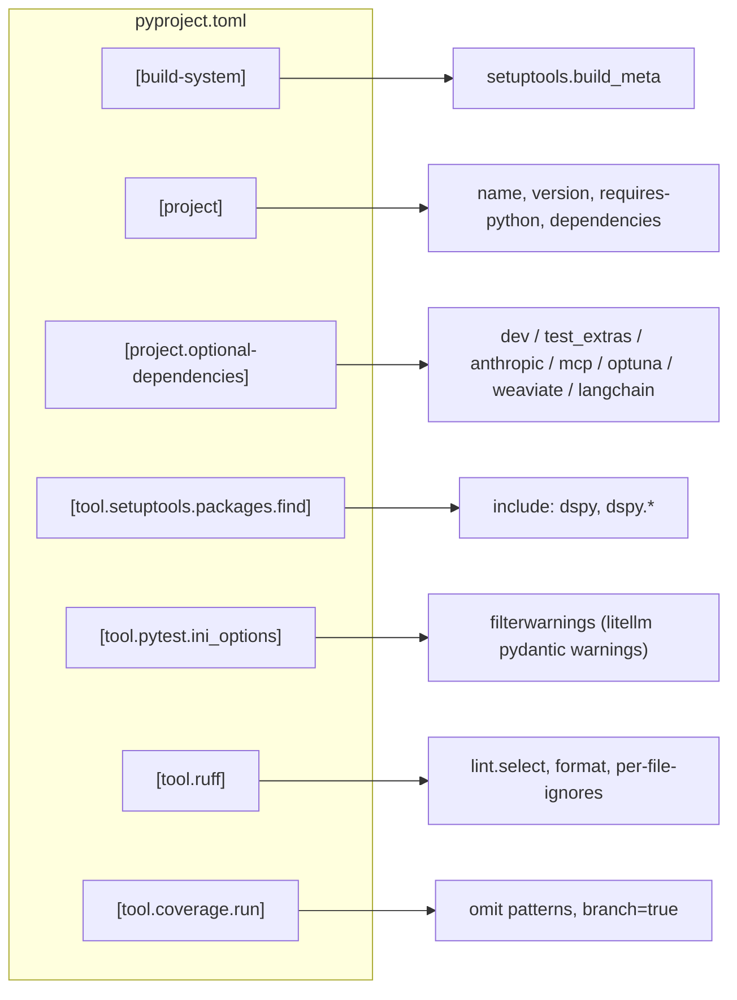
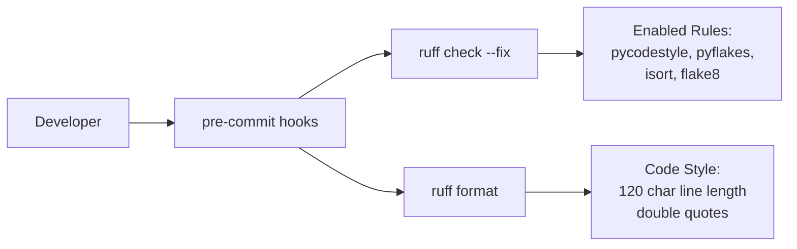
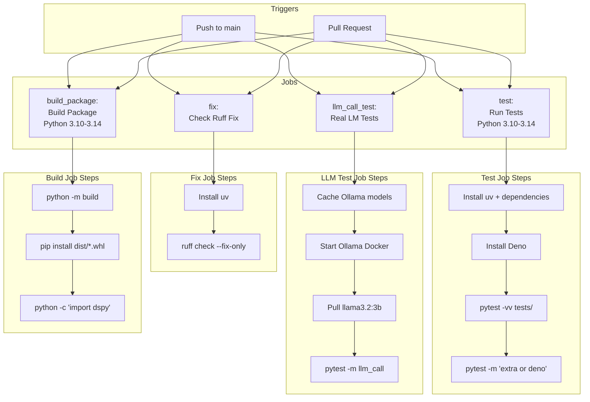

This document provides technical information for contributors to the DSPy project. It covers the build system, testing infrastructure, documentation generation, and release workflows. For tutorials on building and optimizing DSPy programs, see [Building DSPy Programs](#3) and [Program Optimization](#4).

## Development Environment Setup

DSPy uses `uv` as its package manager and build tool, along with `ruff` for code formatting and linting. The development environment is configured through [pyproject.toml:1-188]().

The following diagram maps each `pyproject.toml` section to its role in the development system:

**pyproject.toml Section Roles**


Sources: [pyproject.toml:1-188]()

### Package Manager: uv

The project recommends [uv](https://github.com/astral-sh/uv) for fast, reliable dependency management [CONTRIBUTING.md:105-109]().

**Key Configuration:**
- Minimum Python version: `>=3.10, <3.15` [pyproject.toml:16]()
- Build backend: `setuptools` [pyproject.toml:3]()
- Package discovery: Includes `dspy` and `dspy.*` subpackages [pyproject.toml:71-72]()

For details on dependency management and CI integration, see [Build System & CI/CD](#7.1).

### Code Quality Tools

**Ruff** is configured for linting and formatting [pyproject.toml:120-188](). DSPy follows the Google Python Style Guide [CONTRIBUTING.md:40]().



**Configuration Highlights:**
- Line length: 120 characters [pyproject.toml:128]()
- Target version: Python 3.10 [pyproject.toml:130]()
- Enabled rule sets: E, W, F, I, C, B, UP, N, RUF, Q [pyproject.toml:133-144]()
- Automatic fixes available for all rules [pyproject.toml:161]()

### Pre-commit Hooks

Pre-commit hooks enforce code quality before commits. Install them with:

```bash
pre-commit install
```
[CONTRIBUTING.md:45]()

The pre-commit configuration runs `ruff` and standard hooks like `check-yaml` and `check-added-large-files` [.pre-commit-config.yaml:1-25]().

Sources: [pyproject.toml:1-188](), [CONTRIBUTING.md:40-74](), [.pre-commit-config.yaml:1-25]()

## Continuous Integration Pipeline

The CI/CD pipeline runs on every push to `main` and on pull requests through GitHub Actions defined in [.github/workflows/run_tests.yml:1-171]().

### CI/CD Architecture



For a deep dive into the CI/CD stages and configuration, see [Build System & CI/CD](#7.1).

Sources: [.github/workflows/run_tests.yml:1-171]()

## Testing Framework

DSPy uses `pytest` with custom markers to manage different testing environments, such as local execution vs. remote LLM calls.

### Test Categories

- **Core Tests**: Standard unit tests run on every CI pass [.github/workflows/run_tests.yml:84]().
- **Extra Tests**: Tests requiring optional dependencies like `mcp` or `langchain_core`, triggered by the `extra` marker [tests/conftest.py:8]().
- **Deno Tests**: Tests requiring the Deno JavaScript runtime, used for sandboxed code execution in modules like `CodeAct` [tests/predict/test_code_act.py:8]().
- **LLM Call Tests**: Integration tests that communicate with real language models, typically using a local Ollama instance in CI [.github/workflows/run_tests.yml:120-133]().

For details on test structure and best practices, see [Testing Framework](#7.2).

Sources: [tests/conftest.py:8-54](), [.github/workflows/run_tests.yml:84-133](), [tests/predict/test_code_act.py:8]()

## Documentation System

The documentation is built using MkDocs and hosted at [dspy.ai](https://dspy.ai). 

- **MkDocs**: The primary engine for rendering Markdown to HTML.
- **mkdocstrings**: Used to pull documentation directly from Python source code.
- **mkdocs-jupyter**: Renders `.ipynb` tutorials directly in the docs.

Documentation updates are handled via [.github/workflows/docs-push.yml:1-47](). For details on contributing to documentation, see [Documentation System](#7.3).

Sources: [.github/workflows/docs-push.yml:1-47]()

## Package Metadata and Release Process

DSPy maintains versioning through a coordinated update of `pyproject.toml` and `dspy/__metadata__.py`.

### Release Workflow

1. **Tagging**: A release is triggered by pushing a semver-compliant git tag [.github/workflows/build_and_release.yml:3-6]().
2. **TestPyPI Validation**: The package is first built as `dspy-ai-test-isaac` and published to TestPyPI for verification [.github/workflows/build_and_release.yml:42-68]().
3. **PyPI Publication**: Upon successful validation, the workflow publishes the official `dspy` package and a compatibility alias `dspy-ai` [.github/workflows/build_and_release.yml:72-138]().

For the complete release checklist and version management details, see [Package Metadata & Release Process](#7.4).

Sources: [.github/workflows/build_and_release.yml:1-153](), [dspy/__metadata__.py:1-8](), [.github/.internal_dspyai/pyproject.toml:1-14]()

## Contributing Guidelines

### Finding an Issue
Contributors can look for issues labeled `good first issue` or `help wanted` on the GitHub repository [CONTRIBUTING.md:9-12]().

### AI-Generated Contributions
DSPy is pro-AI assisted coding but requires contributors to understand every line submitted [CONTRIBUTING.md:156-158]().
- Fully autonomous agent contributions are prohibited [CONTRIBUTING.md:159-160]().
- AI-assisted PRs must disclose the tool used and share prompts [CONTRIBUTING.md:167-168]().

### Pull Request Process
1. **Open an Issue**: Discuss major changes before implementation [CONTRIBUTING.md:23-26]().
2. **Fork & Setup**: Create a local dev environment using `uv` [CONTRIBUTING.md:105-122]().
3. **Lint & Format**: Ensure all pre-commit hooks pass [CONTRIBUTING.md:40-57]().
4. **Submit**: Open a PR to the `main` branch [CONTRIBUTING.md:75-78]().

Sources: [CONTRIBUTING.md:1-179]()