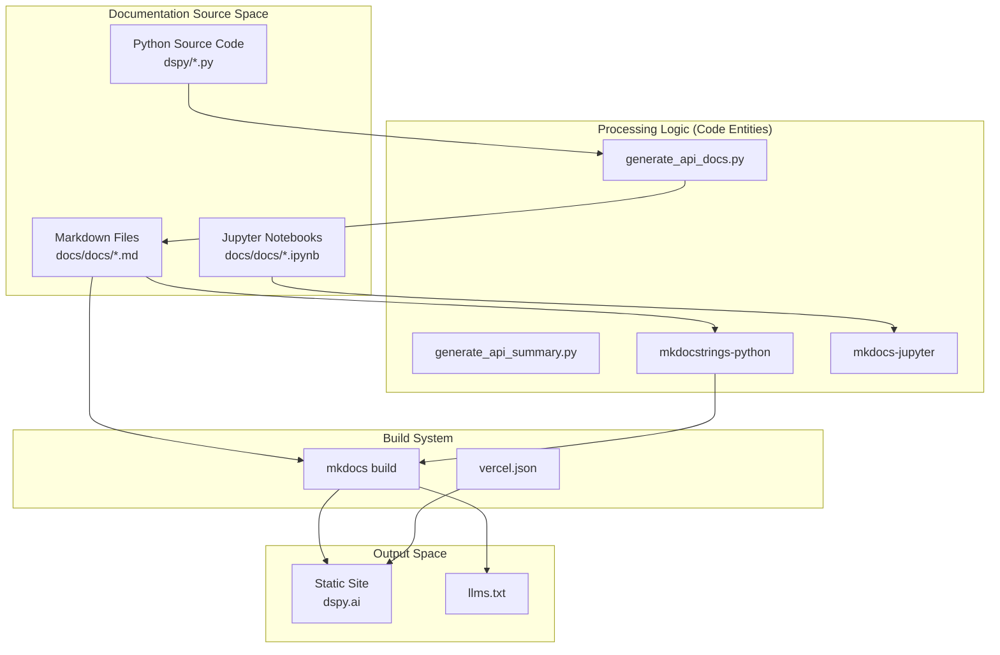
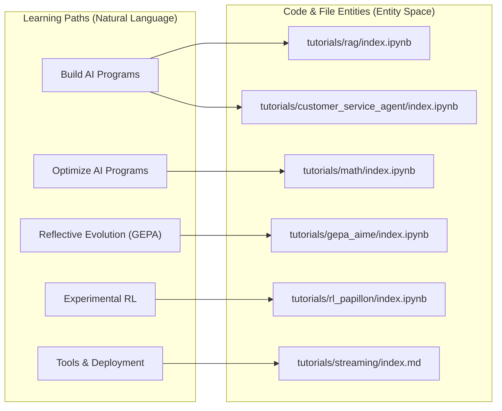

This page documents DSPy's MkDocs-based documentation infrastructure, including the site structure, tutorial organization by learning path, API reference generation via `mkdocstrings`, plugin configuration, and contribution guidelines.

## Overview

DSPy uses **MkDocs** with the **Material** theme to generate documentation hosted at [dspy.ai](https://dspy.ai/). The documentation system consists of:

- **Hand-written guides** in `docs/docs/` covering concepts, tutorials, and production patterns. [docs/mkdocs.yml:9]()
- **Auto-generated API reference** from source code docstrings using `mkdocstrings`. [docs/requirements.txt:6-7]()
- **Jupyter notebook tutorials** rendered with `mkdocs-jupyter`. [docs/requirements.txt:3]()
- **Navigation structure** defined in `docs/mkdocs.yml`. [docs/mkdocs.yml:11-168]()
- **Build scripts** for automating API documentation and indexing. [docs/README.md:32-36]()

**Sources:** [docs/mkdocs.yml:1-11](), [docs/requirements.txt:1-11](), [docs/README.md:13-37]()

## Documentation Architecture

The documentation system is configured via `docs/mkdocs.yml`, which defines site metadata, navigation structure, theme settings, and plugins.

### Data Flow Diagram

**Sources:** [docs/mkdocs.yml:1-10](), [docs/scripts/generate_api_docs.py:1-91](), [docs/scripts/generate_api_summary.py:1-111](), [docs/vercel.json:1-15]()

## API Reference Generation

The API reference is a hybrid system combining manual structure and automated extraction.

### Automated Documentation Scripts
The build process utilizes two primary scripts located in `docs/scripts/`:

1.  **`generate_api_docs.py`**: Iterates through the `API_MAPPING` dictionary to generate Markdown files for core classes and functions. [docs/scripts/generate_api_docs.py:9-91]()
    *   It uses `inspect.getmembers` to find public members from the `dspy` module. [docs/scripts/generate_api_docs.py:114-126]()
    *   It filters out private/dunder methods (except `__call__`) using `should_document_method`. [docs/scripts/generate_api_docs.py:97-106]()
    *   It generates `mkdocstrings` blocks (e.g., `::: dspy.Predict`) with specific options like `show_source: true` and `docstring_style: google`. [docs/scripts/generate_api_docs.py:139-165]()
2.  **`generate_api_summary.py`**: Dynamically updates the `nav` section of `mkdocs.yml` based on the generated files in `docs/api/`. [docs/scripts/generate_api_summary.py:98-108]()
    *   It parses `mkdocs.yml` to locate the `API Reference` section and replaces it with the newly discovered structure. [docs/scripts/generate_api_summary.py:61-95]()

### Code Entity to Documentation Mapping

| Category | Source Entities (dspy.*) | Target Documentation Path |
| :--- | :--- | :--- |
| **Models** | `LM`, `Embedder` | `api/models/` |
| **Modules** | `Predict`, `ChainOfThought`, `ReAct`, `ProgramOfThought` | `api/modules/` |
| **Optimizers** | `MIPROv2`, `BootstrapFewShot`, `GEPA`, `COPRO` | `api/optimizers/` |
| **Primitives** | `Example`, `History`, `Prediction`, `Tool` | `api/primitives/` |
| **Signatures** | `Signature`, `InputField`, `OutputField` | `api/signatures/` |

**Sources:** [docs/scripts/generate_api_docs.py:9-91](), [docs/scripts/generate_api_summary.py:3-14](), [docs/mkdocs.yml:91-168]()

## Tutorial Organization

Tutorials are categorized into functional learning paths within the `nav` structure and cross-referenced in index pages.

### Learning Path Mapping

### Key Tutorial Sections
*   **Build AI Programs**: Focuses on production-ready applications like RAG and Agents. [docs/docs/tutorials/index.md:3-5]()
*   **Optimize AI Programs**: Focuses on using DSPy optimizers to improve quality automatically. [docs/docs/tutorials/index.md:7-9]()
*   **DSPy Core Development**: Covers infrastructure features like streaming, caching, and deployment. [docs/docs/tutorials/index.md:11-12]()

**Sources:** [docs/mkdocs.yml:30-80](), [docs/docs/tutorials/index.md:1-13](), [docs/docs/tutorials/build_ai_program/index.md:1-50]()

## Contribution Workflow

To modify or add documentation, contributors must follow a specific local build process.

### Build Steps
1.  **Dependency Installation**: Install requirements from `docs/requirements.txt`. [docs/README.md:27-30]()
2.  **API Generation**: Run the Python scripts to synchronize source code changes with the documentation site.
    *   `python scripts/generate_api_docs.py` [docs/README.md:34]()
    *   `python scripts/generate_api_summary.py` [docs/README.md:35]()
3.  **Validation**: A test suite ensures all files referenced in `mkdocs.yml` actually exist in the file system. [tests/docs/test_mkdocs_links.py:4-38]()
4.  **Local Preview**: Use `mkdocs serve` to view changes. [docs/README.md:52]()

### Navigation and UI
*   **Custom Tabs**: The documentation uses a custom navigation bar override in `docs/overrides/partials/tabs.html` to separate "Community" and "FAQ" from the main content tabs. [docs/overrides/partials/tabs.html:34-47]()
*   **Vercel Configuration**: The site is configured for Vercel deployment with trailing slashes enabled and specific headers for Markdown files. [docs/vercel.json:1-15]()

### AI Consumption (LLMs.txt)
The system automatically generates an `/llms.txt` file for LLM consumption using the `mkdocs-llmstxt` plugin. This is configured in `mkdocs.yml` to provide context for AI assistants. [docs/README.md:77-79](), [docs/requirements.txt:8]()

**Sources:** [docs/README.md:18-56](), [docs/mkdocs.yml:1-11](), [tests/docs/test_mkdocs_links.py:1-39](), [docs/overrides/partials/tabs.html:22-58]()