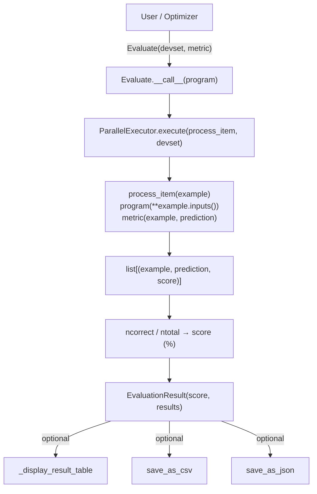
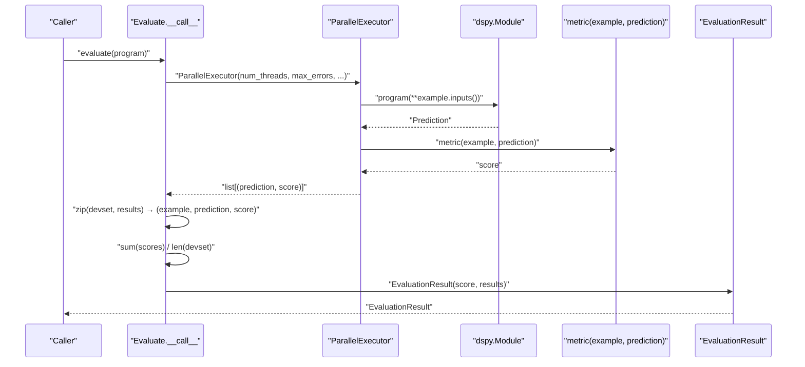
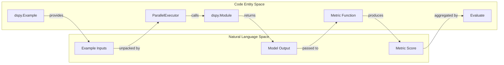
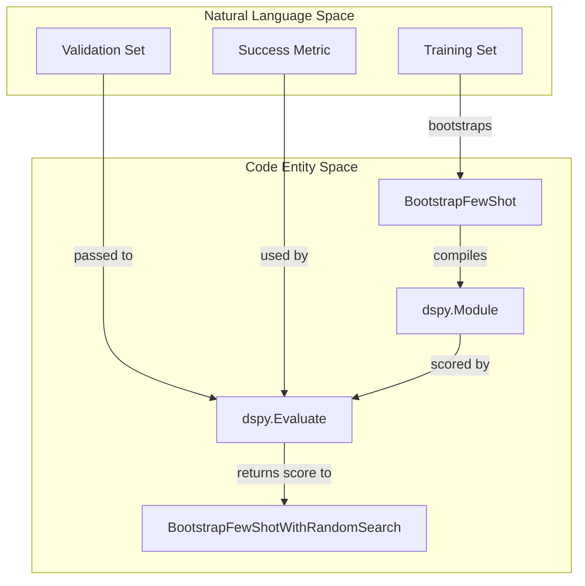

This page documents `dspy.Evaluate`, the `EvaluationResult` type, metric function conventions, parallel execution, and result handling. Evaluation in DSPy is used to assess program performance and to score candidate programs during optimization.

---

## Overview

The evaluation framework is implemented in [dspy/evaluate/evaluate.py](). The primary interface is the `Evaluate` class, which runs a `dspy.Module` against a dataset (`devset`) and aggregates metric scores into a summary result.

Sources: [dspy/evaluate/evaluate.py:64-128](), [dspy/evaluate/evaluate.py:162-226]()

---

## Core Classes

### `EvaluationResult`

`EvaluationResult` ([dspy/evaluate/evaluate.py:48-61]()) is a subclass of `dspy.Prediction` that stores the outcome of an evaluation run.

| Attribute | Type | Description |
|-----------|------|-------------|
| `score` | `float` | Overall performance score (e.g., `67.30`) |
| `results` | `list[tuple[Example, Example, Any]]` | List of `(example, prediction, score)` triples |

Sources: [dspy/evaluate/evaluate.py:48-61]()

### `Evaluate`

The `Evaluate` class ([dspy/evaluate/evaluate.py:64-111]()) provides the configuration and execution logic for running benchmarks.

**Constructor parameters:**

| Parameter | Type | Default | Description |
|-----------|------|---------|-------------|
| `devset` | `list[dspy.Example]` | required | The evaluation dataset |
| `metric` | `Callable \| None` | `None` | The scoring function |
| `num_threads` | `int \| None` | `None` | Threads for parallel evaluation |
| `display_progress` | `bool` | `False` | Show `tqdm` progress bar |
| `display_table` | `bool \| int` | `False` | Display results in a table (int limits rows) |
| `max_errors` | `int \| None` | `None` | Max errors before stopping (falls back to `dspy.settings.max_errors`) |
| `failure_score` | `float` | `0.0` | Default score if an exception occurs |
| `save_as_csv` | `str \| None` | `None` | Filename for CSV export |
| `save_as_json` | `str \| None` | `None` | Filename for JSON export |

Sources: [dspy/evaluate/evaluate.py:71-111]()

---

## Execution Flow

When an `Evaluate` instance is called, it triggers the following sequence:

1. **Setup**: Parameters are resolved, favoring `__call__` arguments over constructor defaults [dspy/evaluate/evaluate.py:149-155]().
2. **Parallelization**: `ParallelExecutor` manages the distribution of examples across threads [dspy/evaluate/evaluate.py:162-175]().
3. **Execution**: For each example, the program is executed with `example.inputs()` [dspy/evaluate/evaluate.py:171]().
4. **Scoring**: The `metric` function compares the `example` and `prediction` [dspy/evaluate/evaluate.py:173]().
5. **Aggregation**: Scores are averaged and rounded to 2 decimal places [dspy/evaluate/evaluate.py:221-224]().

Sources: [dspy/evaluate/evaluate.py:116-226]()

---

## Metric Functions

A metric is a callable that defines "good" vs "bad" outputs.

### Function Signature
Metrics must follow this signature:
`metric(example: dspy.Example, prediction: dspy.Prediction, trace=None) -> Any`

While `Evaluate` calls metrics with two arguments, optimizers like `BootstrapFewShot` provide a `trace` for intermediate step validation [dspy/teleprompt/bootstrap.py:159-160]().

### Standard Metrics
DSPy provides several built-in metrics in [dspy/evaluate/metrics.py]():
- `EM` (Exact Match): Normalizes text and checks for equality [dspy/evaluate/metrics.py:11-36]().
- `F1`: Token-level overlap [dspy/evaluate/metrics.py:39-60]().
- `HotPotF1`: F1 with special handling for "yes/no/noanswer" [dspy/evaluate/metrics.py:63-84]().

### Auto-Evaluation (LLM-as-a-Judge)
The framework supports metrics that are themselves DSPy programs:
- `SemanticF1`: Uses an LLM to compute precision/recall based on semantic meaning via `ChainOfThought` [dspy/evaluate/auto_evaluation.py:42-62]().
- `CompleteAndGrounded`: Scores responses based on completeness (against ground truth) and groundedness (against context) using specialized signatures like `AnswerCompleteness` and `AnswerGroundedness` [dspy/evaluate/auto_evaluation.py:102-123]().

Sources: [dspy/evaluate/metrics.py:1-213](), [dspy/evaluate/auto_evaluation.py:1-124]()

---

## Parallel Execution and Threading

The framework utilizes `ParallelExecutor` [dspy/utils/parallelizer.py:16-46]() to manage concurrent execution across examples.

### Data Flow and Code Entities
The following diagram maps the logical evaluation steps to the underlying code entities responsible for execution.

Sources: [dspy/evaluate/evaluate.py:162-175](), [dspy/utils/parallelizer.py:47-52](), [dspy/predict/parallel.py:89-108]()

### Concurrency Details
- **Context Propagation**: `ParallelExecutor` ensures that `dspy.settings` (like `lm` and `adapter`) are propagated from the parent thread to worker threads using `thread_local_overrides` [dspy/utils/parallelizer.py:123-130]().
- **Single-Threaded**: If `num_threads=1`, evaluation runs in the main thread [tests/evaluate/test_evaluate.py:59-83]().
- **Multi-Threaded**: Spawns worker threads to handle LM calls in parallel via `ThreadPoolExecutor` [dspy/utils/parallelizer.py:156]().
- **Error Handling**: The `max_errors` setting limits the number of failures before the `ParallelExecutor` sets a `cancel_jobs` event [dspy/utils/parallelizer.py:61-64]().

Sources: [dspy/utils/parallelizer.py:1-200](), [dspy/dsp/utils/settings.py:51-111]()

---

## Result Display and Persistence

### Table Display
If `display_table` is enabled, `Evaluate` constructs a `pandas.DataFrame`.
- Cells are truncated to 25 words to keep the table readable [dspy/evaluate/evaluate.py:330-335]().
- In Jupyter environments, it renders as a stylized HTML table using `IPython.display` [dspy/evaluate/evaluate.py:277-285]().

### File Export
Results can be persisted to disk:
- **CSV**: Uses `csv.DictWriter` to save flattened results [dspy/evaluate/evaluate.py:195-209]().
- **JSON**: Serializes the result list using `json.dump` [dspy/evaluate/evaluate.py:210-221]().

Sources: [dspy/evaluate/evaluate.py:184-221](), [dspy/evaluate/evaluate.py:241-263]()

---

## Integration with Optimizers

The evaluation framework is a core component of program optimization. Optimizers use `Evaluate` to rank candidate programs.

### Optimizer Data Flow
The following diagram illustrates how the `Evaluate` class bridges the gap between training examples and optimized program selection.

Sources: [dspy/teleprompt/random_search.py:112-148](), [dspy/teleprompt/bootstrap.py:84-94]()

### Optimization Workflow
1. **Looping**: `BootstrapFewShotWithRandomSearch` iterates through multiple seeds [dspy/teleprompt/random_search.py:67]().
2. **Compilation**: For each seed, a new program candidate is compiled [dspy/teleprompt/random_search.py:93]().
3. **Validation**: The candidate is passed to an `Evaluate` instance [dspy/teleprompt/random_search.py:113-122]().
4. **Ranking**: Candidates are sorted by their average score [dspy/teleprompt/random_search.py:144-146]().

Sources: [dspy/teleprompt/random_search.py:67-150]()