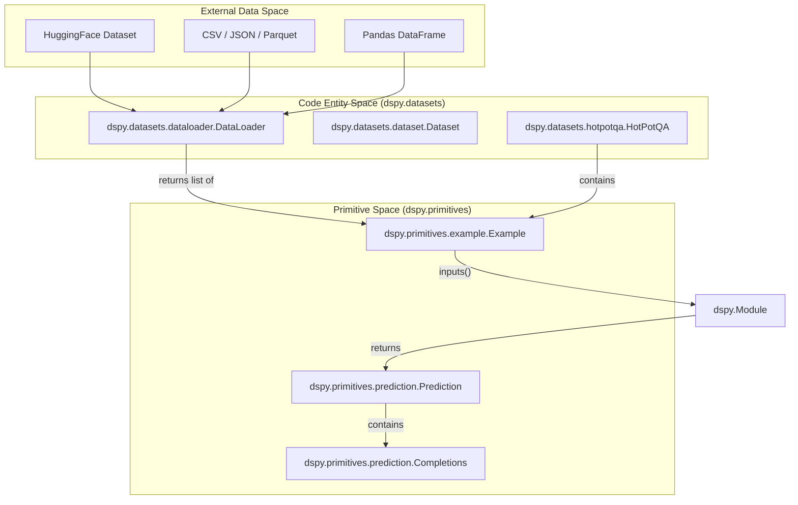
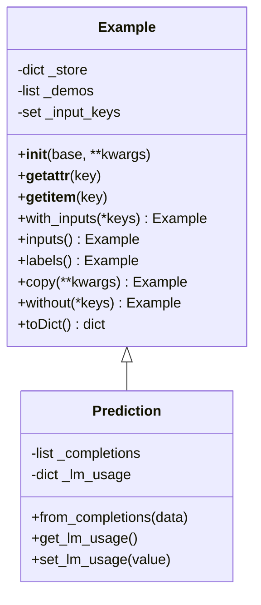

This page documents DSPy's core data primitives: `dspy.Example` for handling training/evaluation data, `dspy.Prediction` for representing module outputs, and the `DataLoader` system for ingesting external data. These classes form the foundation of DSPy's data handling model, providing flexible containers with dictionary-like access patterns, input/output separation, and serialization support.

## Overview

DSPy's data primitives serve distinct roles in the framework:

- **`Example`**: A flexible container for training and evaluation data with support for input/output field separation. [dspy/primitives/example.py:4-21]()
- **`Prediction`**: The output type returned by DSPy modules, inheriting from `Example` but optimized for model outputs and scores. [dspy/primitives/prediction.py:4-16]()
- **`Completions`**: A container for multiple candidate outputs from a language model. [dspy/primitives/prediction.py:119-122]()
- **`DataLoader`**: A utility for loading data from various formats (HuggingFace, CSV, JSON, Pandas) into `dspy.Example` objects. [dspy/datasets/dataloader.py:12-23]()

### Data Flow and Entity Mapping

The following diagram maps the flow from external data sources to DSPy internal entities.

**Data Source to DSPy Primitive Mapping**


**Sources:**
- [dspy/datasets/dataloader.py:12-23]()
- [dspy/primitives/example.py:4-21]()
- [dspy/primitives/prediction.py:4-16]()

---

## The Example Class

### Class Structure and Design

The `Example` class provides a dictionary-like container with attribute access patterns. It stores data in an internal `_store` dictionary while providing multiple access interfaces. [dspy/primitives/example.py:107-110]()

**Example and Prediction Class Relationship**


**Sources:**
- [dspy/primitives/example.py:4-121]()
- [dspy/primitives/prediction.py:4-33]()

### Initialization Patterns

`Example` supports three initialization patterns for flexibility: [dspy/primitives/example.py:91-105]()

| Pattern | Usage | Implementation Detail |
|---------|-------|---------|
| **Keyword arguments** | Direct field specification | `self._store.update(kwargs)` [dspy/primitives/example.py:120-120]() |
| **Dictionary base** | Initialize from dict | `self._store = base.copy()` [dspy/primitives/example.py:116-117]() |
| **Example base** | Copy another Example | `self._store = base._store.copy()` [dspy/primitives/example.py:112-113]() |

**Sources:**
- [dspy/primitives/example.py:91-120]()
- [tests/primitives/test_example.py:7-27]()

### Dictionary-Like Interface

`Example` implements the full dictionary protocol, supporting both item access (`example["key"]`) and attribute access (`example.key`). [dspy/primitives/example.py:122-143]()

- **Attribute access**: Uses `__getattr__` to look up in `_store`. [dspy/primitives/example.py:122-127]()
- **Item access**: Uses `__getitem__` for standard dict syntax. [dspy/primitives/example.py:135-136]()
- **Length**: `__len__` filters out internal `dspy_` prefixed fields. [dspy/primitives/example.py:147-148]()
- **Equality**: Based on the equality of the underlying `_store`. [dspy/primitives/example.py:158-159]()

**Sources:**
- [dspy/primitives/example.py:122-162]()
- [tests/primitives/test_example.py:29-97]()

---

## Input/Output Separation

A core concept in DSPy is marking which fields are "inputs" to a module versus "labels" (outputs) for evaluation or optimization.

### The with_inputs() Method

The `with_inputs()` method marks specific fields as inputs, returning a new `Example` instance with `_input_keys` set. [dspy/primitives/example.py:205-209]()

```python