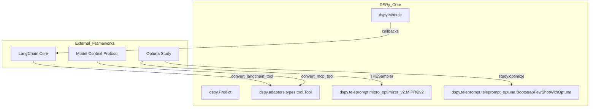
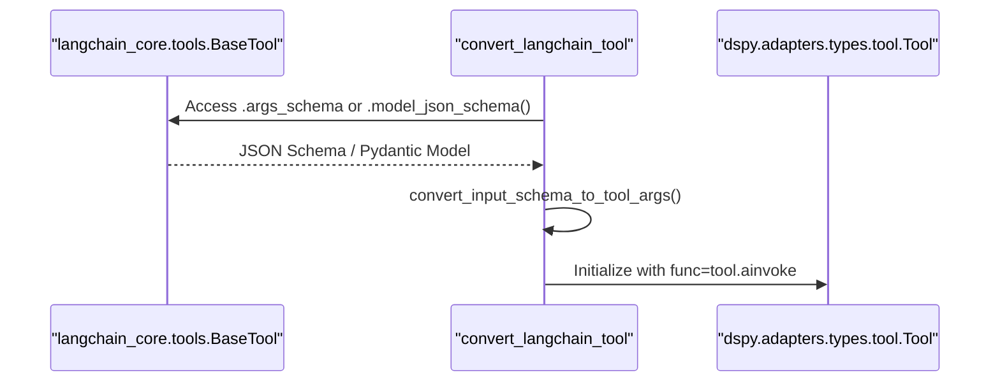
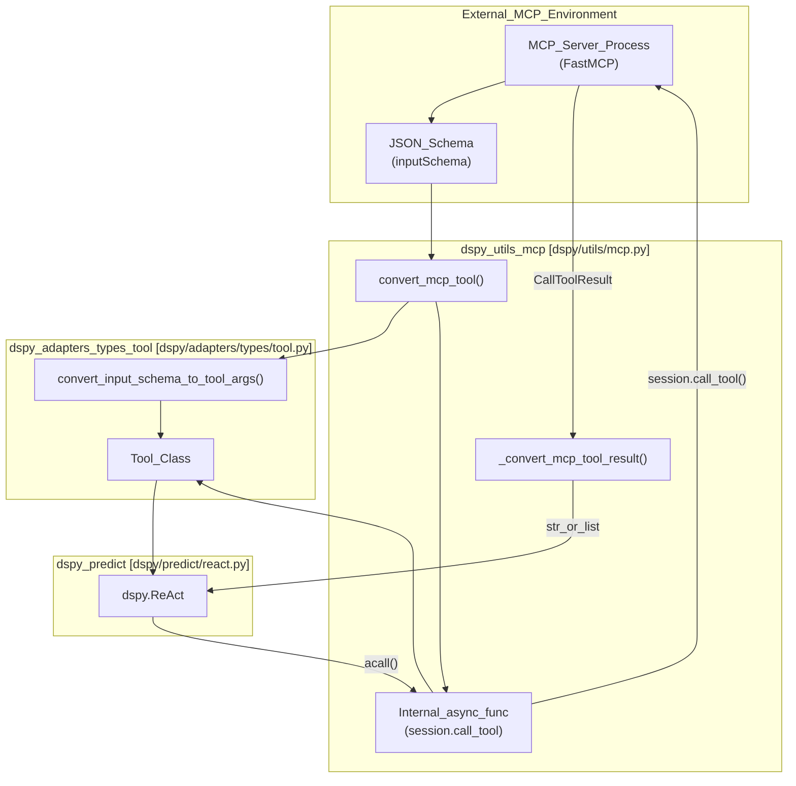
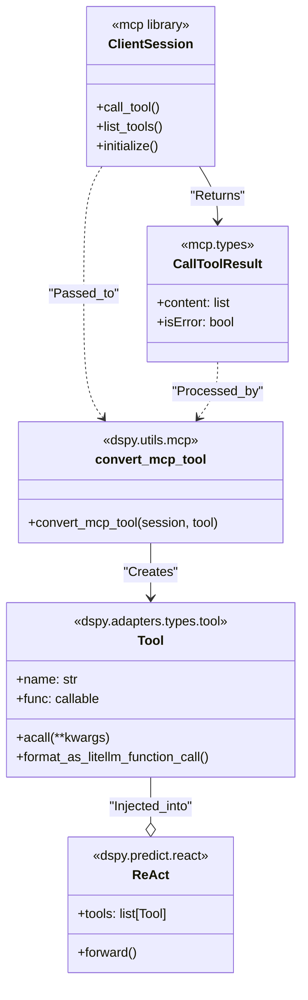

## Purpose and Scope

This document explains how DSPy integrates with external LLM frameworks including LangChain, Optuna, and the Model Context Protocol (MCP). DSPy is designed to **complement** rather than replace these frameworks, offering specialized optimization capabilities and tool conversion utilities. This page covers the technical implementation of these integrations via optional dependencies and specific utility classes.

For information about integrating with vector databases (ColBERT, Pinecone), see [Vector Databases & Retrieval (6.3)](). For observability integrations, see [Observability & Monitoring (6.4)]().

## Integration Philosophy

DSPy treats external frameworks as providers of either **Infrastructure** (retrievers, tools) or **Optimization Engines** (Bayesian search). The integration architecture relies on "Adapters" and "Converters" that map external schemas to internal DSPy primitives like `dspy.Signature` and `dspy.Tool`.


**Bridging External Entities to DSPy Core**

Sources: [dspy/utils/langchain_tool.py:10-47](), [dspy/utils/mcp.py:30-47](), [dspy/teleprompt/teleprompt_optuna.py:20-90](), [dspy/adapters/types/tool.py:20-43]()

## Package Dependencies

DSPy uses optional dependencies to keep the core installation lightweight. These are defined in the project's dependency management configuration.

| Framework | Optional Dependency | Role |
| :--- | :--- | :--- |
| **LangChain** | `langchain` | Tool conversion and integration with LangChain's ecosystem |
| **Optuna** | `optuna` | Bayesian optimization for prompt and demo search |
| **MCP** | `mcp` | Standardized tool and resource access via Model Context Protocol |

To install with specific support:
```bash
pip install "dspy[langchain,optuna,mcp]"
```

Sources: [dspy/teleprompt/teleprompt_optuna.py:7-17](), [dspy/utils/mcp.py:1-7]()

## LangChain Integration

DSPy integrates with LangChain primarily through tool conversion, allowing LangChain's extensive ecosystem of tools to be used directly within DSPy modules like `dspy.ReAct` [dspy/predict/react.py:1-10]() or `dspy.CodeAct` [dspy/predict/code_act.py:14-19]().

### Tool Conversion Implementation
The `convert_langchain_tool` function [dspy/utils/langchain_tool.py:10-47]() transforms a `langchain_core.tools.BaseTool` into a `dspy.adapters.types.tool.Tool`.

1.  **Schema Extraction**: It accesses `tool.args_schema` to extract Pydantic model fields.
2.  **Type Mapping**: It maps LangChain's argument schemas to Python types (e.g., `int`, `str`) for DSPy's signature system.
3.  **Async Execution**: It wraps the tool's `ainvoke` method into a DSPy-compatible async function.


**Data Flow: LangChain Tool to DSPy Tool**

Sources: [dspy/utils/langchain_tool.py:10-47](), [dspy/adapters/types/tool.py:20-43]()

## Model Context Protocol (MCP) Integration

DSPy supports the Model Context Protocol to interface with standardized MCP servers. This is handled by `convert_mcp_tool` [dspy/utils/mcp.py:30-47]().

### Technical Workflow
- **Session Management**: The converter requires an active `mcp.ClientSession` [dspy/utils/mcp.py:30-34]().
- **Dynamic Argument Parsing**: It uses `convert_input_schema_to_tool_args` [dspy/adapters/types/tool.py:8-15]() to parse the MCP `inputSchema` into DSPy-readable arguments and descriptions [dspy/utils/mcp.py:40]().
- **Result Handling**: The `_convert_mcp_tool_result` helper handles `TextContent` vs. non-text contents and raises `RuntimeError` if the MCP server returns an error flag [dspy/utils/mcp.py:9-27]().

Sources: [dspy/utils/mcp.py:9-47](), [tests/utils/test_mcp.py:14-99]()

## Optuna Integration

Optuna is used as a backend for sophisticated hyperparameter optimization within DSPy teleprompters.

### BootstrapFewShotWithOptuna
The `BootstrapFewShotWithOptuna` class [dspy/teleprompt/teleprompt_optuna.py:20-90]() extends `Teleprompter` to search for the best combination of bootstrapped demonstrations.

1.  **Trial Definition**: The `objective` function [dspy/teleprompt/teleprompt_optuna.py:48-66]() uses `trial.suggest_int` to select which bootstrapped demo to use for each predictor.
2.  **Study Execution**: It creates an Optuna study with `direction="maximize"` and runs `study.optimize` [dspy/teleprompt/teleprompt_optuna.py:84-85]().
3.  **Program Selection**: After trials complete, it retrieves the `best_program` stored in Optuna's `user_attrs` [dspy/teleprompt/teleprompt_optuna.py:86]().

### MIPROv2
`MIPROv2` [dspy/teleprompt/mipro_optimizer_v2.py:10]() (Multi-objective Instruction and Prompt Optimizer) uses Optuna to navigate the search space of instruction proposals and example sets. It typically uses the Tree-structured Parzen Estimator (TPE) sampler provided by Optuna to balance exploration and exploitation.

Sources: [dspy/teleprompt/teleprompt_optuna.py:20-90](), [dspy/teleprompt/__init__.py:10-30]()

## Integration Summary Table

| Feature | Code Entity | Dependency | Purpose |
| :--- | :--- | :--- | :--- |
| **Tool Conversion** | `convert_langchain_tool` | `langchain_core` | Use LangChain tools in `dspy.ReAct` / `dspy.CodeAct` |
| **MCP Support** | `convert_mcp_tool` | `mcp` | Standardized tool/resource access via MCP servers |
| **Bayesian Search** | `BootstrapFewShotWithOptuna` | `optuna` | Bayesian search for optimal demo combinations |
| **Instruction Search** | `MIPROv2` | `optuna` | High-dimensional search for prompt instructions |
| **Native Tool Calling** | `Tool.format_as_litellm_function_call` | `litellm` | Exporting DSPy tools to OpenAI/LiteLLM schemas |

Sources: [dspy/utils/langchain_tool.py:10](), [dspy/utils/mcp.py:30](), [dspy/teleprompt/teleprompt_optuna.py:20](), [dspy/adapters/types/tool.py:151-163]()

# Model Context Protocol (MCP)


This page documents DSPy's integration with the Model Context Protocol (MCP), covering how MCP servers are connected, how their tools are converted to DSPy-compatible `Tool` objects via `convert_mcp_tool`, and how those tools are used within DSPy modules.

## Overview

The **Model Context Protocol** (MCP) is an open protocol that standardizes how applications expose tools, resources, and prompts to language models. DSPy supports MCP by bridging this protocol with its own `Tool` primitive, allowing tools defined on any MCP server to be used inside DSPy modules as if they were locally defined Python functions.

### Key Capabilities
- **Standardized Tooling**: Connect to any MCP-compatible server (local or remote) to share tools across different technical stacks [docs/docs/tutorials/mcp/index.md:3-11]().
- **One-line Conversion**: Transform MCP tool definitions into `dspy.Tool` objects using `convert_mcp_tool` [dspy/utils/mcp.py:30-47]().
- **Async Session Handling**: Supports full asynchronous execution for high-performance tool calling via `acall` [tests/utils/test_mcp.py:37-46]().
- **Complex Schema Support**: Handles nested Pydantic models and complex JSON schemas during conversion [tests/utils/test_mcp.py:57-89]().

Sources: [docs/docs/tutorials/mcp/index.md:3-11](), [dspy/utils/mcp.py:30-47](), [tests/utils/test_mcp.py:37-89]()

---

## Technical Architecture

The MCP integration sits within the utility layer of DSPy, acting as a factory for the `dspy.Tool` primitive. It relies on the official `mcp` Python SDK for session management and transport.

### Data Flow: MCP to DSPy
The conversion process involves mapping JSON Schema definitions from the MCP server to DSPy's internal argument tracking system.

**Diagram: MCP Tool Transformation & Execution**


Sources: [dspy/utils/mcp.py:9-47](), [dspy/adapters/types/tool.py:20-73](), [dspy/utils/mcp.py:40]()

---

## Implementation Details

### Tool Conversion (`convert_mcp_tool`)
The primary entry point for integration is `convert_mcp_tool`. It takes an active `mcp.ClientSession` and an `mcp.types.Tool` definition to produce a `dspy.Tool` [dspy/utils/mcp.py:30-39]().

1. **Schema Mapping**: It uses `convert_input_schema_to_tool_args` to parse the MCP `inputSchema` into DSPy-compatible `args`, `arg_types`, and `arg_desc` [dspy/utils/mcp.py:40]().
2. **Async Wrapper**: It creates a closure `func(*args, **kwargs)` that encapsulates the `session.call_tool` logic [dspy/utils/mcp.py:43-45]().
3. **Result Parsing**: The internal `_convert_mcp_tool_result` handles the `mcp.types.CallToolResult` object, extracting `TextContent` or returning raw content if multiple types exist [dspy/utils/mcp.py:9-27]().

### Integration with `dspy.Tool`
The converted MCP tool inherits all capabilities of the standard `dspy.Tool` class, including:
- **Argument Validation**: Automatic validation of inputs against the inferred JSON schema [dspy/adapters/types/tool.py:119-134]().
- **LiteLLM Compatibility**: Capability to be formatted as a LiteLLM-style function call for native model integration [dspy/adapters/types/tool.py:151-163]().

Sources: [dspy/utils/mcp.py:9-47](), [dspy/adapters/types/tool.py:119-163]()

---

## Integration with Code Entities

The following diagram maps the relationship between MCP-specific utilities and the core DSPy module system.

**Diagram: MCP Code Entity Relationship**


Sources: [dspy/utils/mcp.py:9-47](), [tests/utils/test_mcp.py:14-47](), [dspy/adapters/types/tool.py:151-152]()

---

## Usage Patterns

### 1. Initialization and Conversion
To use MCP tools, you must initialize an MCP session and then convert the tools using the `convert_mcp_tool` utility.

```python
from mcp import ClientSession, StdioServerParameters
from mcp.client.stdio import stdio_client
from dspy.utils.mcp import convert_mcp_tool

async def setup_mcp_tools():
    # Define server parameters (e.g., local python script)
    server_params = StdioServerParameters(
        command="python",
        args=["mcp_server.py"]
    )
    
    async with stdio_client(server_params) as (read, write):
        async with ClientSession(read, write) as session:
            await session.initialize()
            response = await session.list_tools()
            
            # Convert MCP tools to DSPy tools
            dspy_tools = [convert_mcp_tool(session, t) for t in response.tools]
            return dspy_tools
```
Sources: [tests/utils/test_mcp.py:17-28](), [dspy/utils/mcp.py:30-47]()

### 2. Error Handling
The integration includes built-in error checking. If an MCP tool returns an error (`isError=True`), DSPy raises a `RuntimeError` containing the tool's output content [dspy/utils/mcp.py:24-25]().

### 3. Native Model Tooling
Tools converted from MCP can be used with modules like `dspy.ReAct` or `dspy.CodeAct`. When used with `CodeAct`, the tool's source or wrapper is typically registered within the `PythonInterpreter` for execution [dspy/predict/code_act.py:91-93]().

---

## Comparison with Other Tool Integrations

DSPy provides similar conversion utilities for other ecosystems, ensuring a consistent interface across different tool sources.

| Feature | MCP (`convert_mcp_tool`) | LangChain (`convert_langchain_tool`) |
|---------|-------------------------|--------------------------------------|
| **Source Entity** | `mcp.ClientSession` | `langchain.tools.BaseTool` |
| **Schema Source** | `tool.inputSchema` | `tool.args_schema` |
| **Execution Logic** | `session.call_tool` | `tool.ainvoke` |
| **Module Path** | `dspy/utils/mcp.py` | `dspy/utils/langchain_tool.py` |

Sources: [dspy/utils/mcp.py:30-47](), [dspy/utils/langchain_tool.py:10-47]()