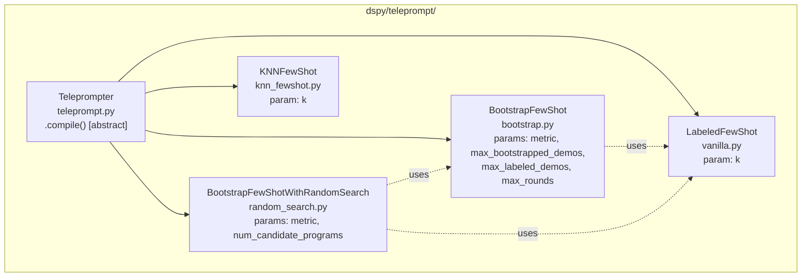
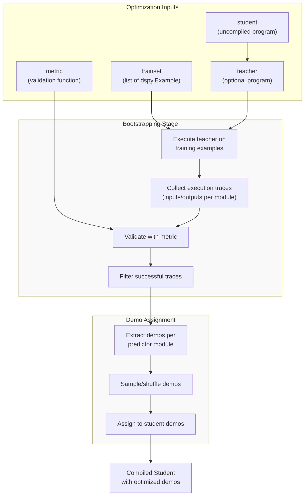
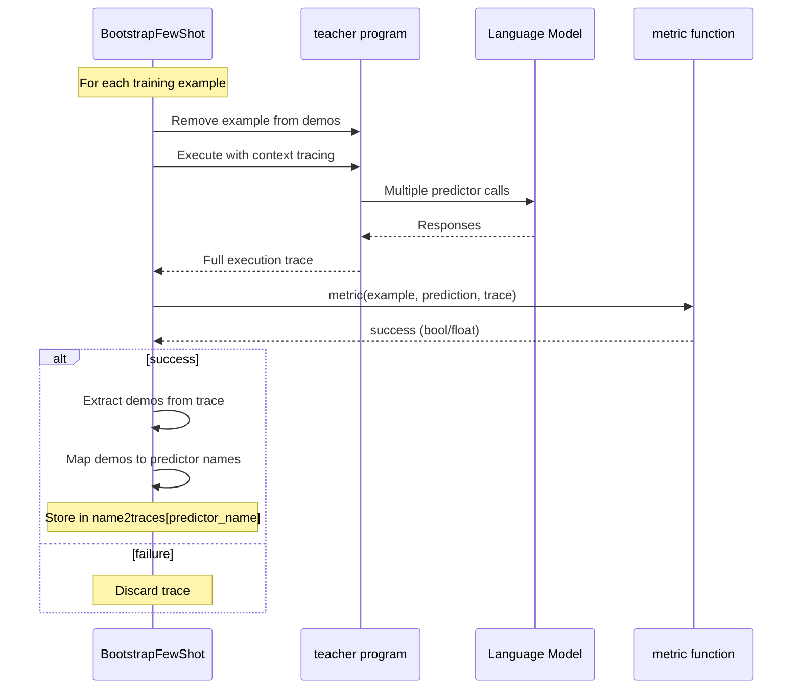
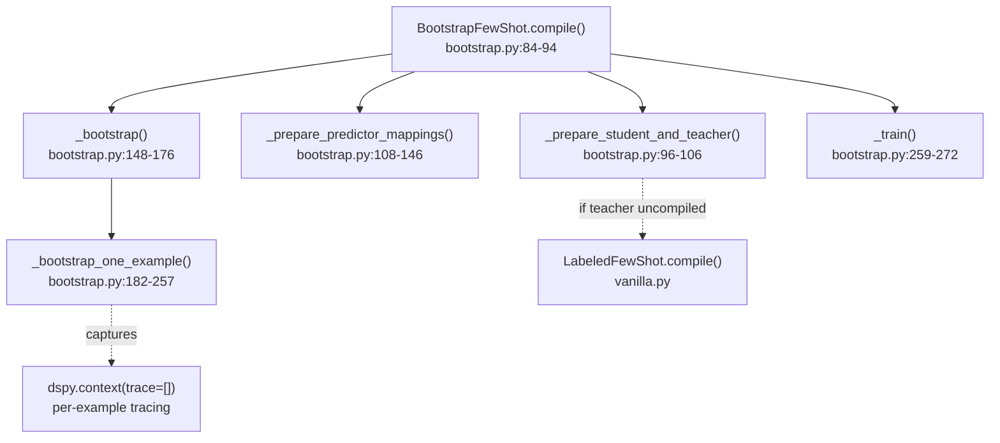
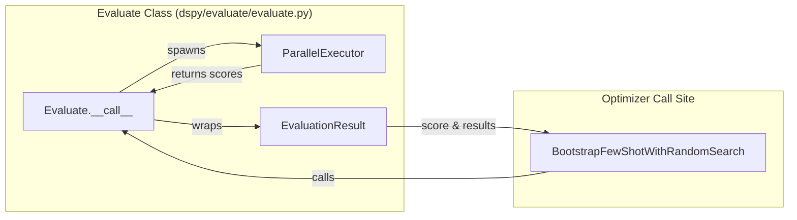
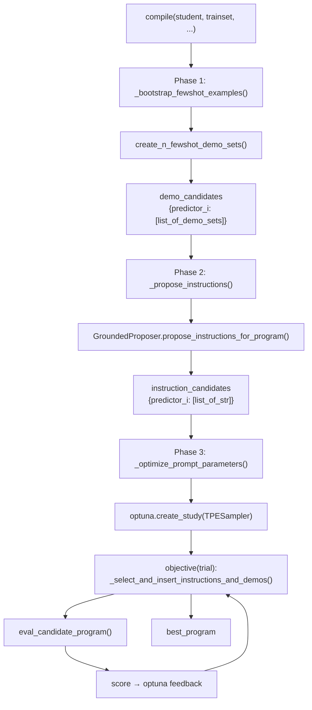
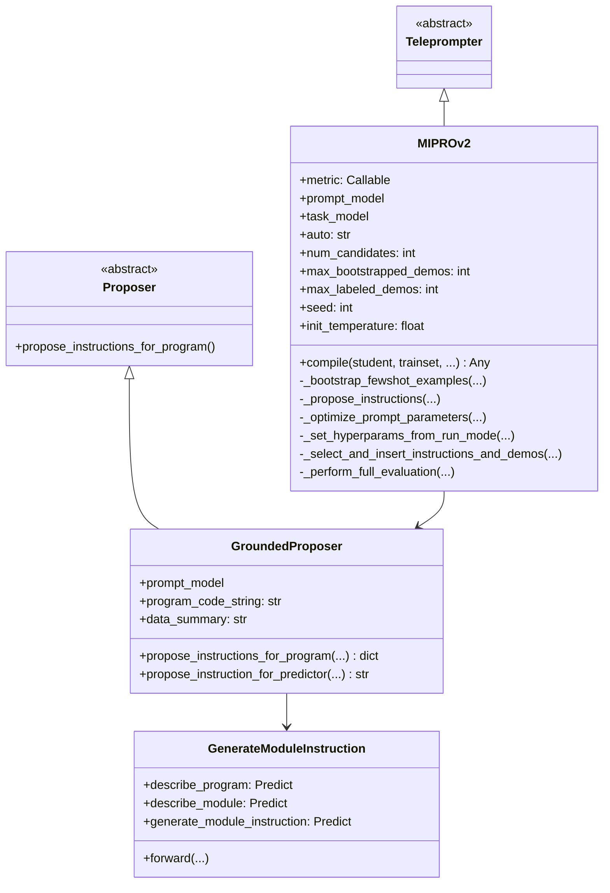
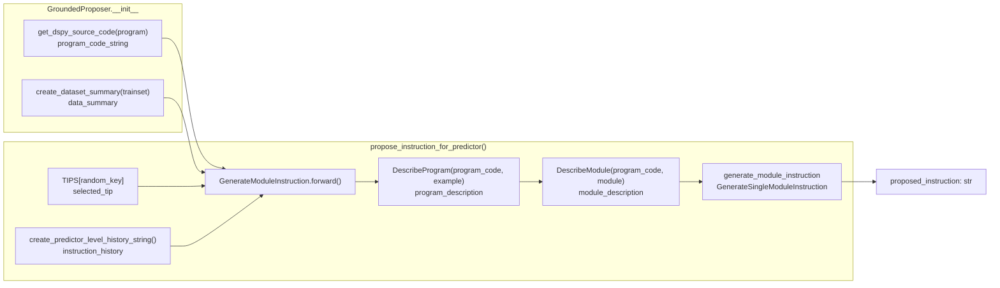
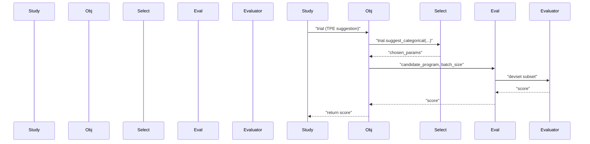
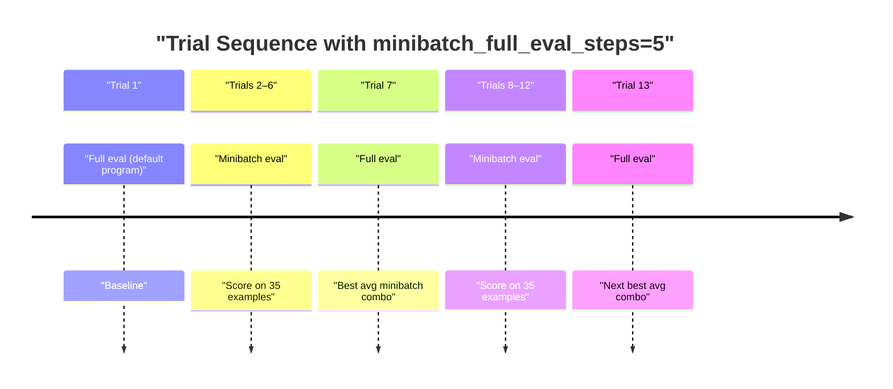

## Purpose and Scope

This page documents DSPy optimizers that improve program performance by automatically generating or selecting **few-shot demonstrations** (examples) to include in prompts. These optimizers focus on enhancing the in-context learning capabilities of language models by providing high-quality examples that illustrate the desired input-output behavior.

For instruction optimization (tuning the natural-language instructions in prompts), see page 4.4 (MIPROv2: Instruction & Parameter Optimization). For weight-based optimization through fine-tuning, see page 4.6 (Fine-tuning & Weight Optimization). For the general optimization framework and evaluation, see page 4.1 (Optimization Overview) and page 4.2 (Evaluation Framework).

Sources: `[dspy/teleprompt/bootstrap.py:36-72]()`, `[dspy/teleprompt/random_search.py:27-56]()`

---

## Overview of Few-Shot Optimization

Few-shot optimizers in DSPy extend module signatures by automatically generating and including optimized demonstrations within prompts sent to the language model. Rather than manually crafting examples or using random samples from training data, these optimizers intelligently select or generate demonstrations that maximize the program's performance on a given metric.

The key distinction among few-shot optimizers is their **demo generation strategy**:

| Optimizer | Demo Source | Selection Strategy | Use Case |
|-----------|-------------|-------------------|----------|
| `LabeledFewShot` | Labeled training data | Random sampling | Simple baseline with labeled data |
| `BootstrapFewShot` | Generated via teacher execution | Metric-based filtering | Self-improving with partial data |
| `BootstrapFewShotWithRandomSearch` | Multiple bootstrap runs | Random search over candidates | Finding optimal demo combinations |
| `KNNFewShot` | Training data via similarity | K-nearest neighbors | Task-adaptive demo selection |

All few-shot optimizers produce a compiled program where each `dspy.Predict` module (or subclass) has its `demos` attribute populated with demonstration examples.

---

**Class Hierarchy: Few-Shot Optimizer Implementations**



Sources: `[dspy/teleprompt/bootstrap.py:1-10]()`, `[dspy/teleprompt/random_search.py:1-9]()`, `[dspy/teleprompt/knn_fewshot.py:11-22]()`

---

## The Bootstrapping Process

### Conceptual Overview

**Bootstrapping** is the core mechanism used by `BootstrapFewShot` and related optimizers. It involves using a "teacher" program (which may be the same program being optimized) to generate complete input-output traces that serve as demonstrations for the "student" program.



**Diagram: Bootstrapping Pipeline Overview**

The process consists of three phases:
1. **Execution**: Run the teacher program on training examples to generate candidate demonstrations.
2. **Validation**: Filter demonstrations using the provided metric function.
3. **Assignment**: Distribute validated demonstrations to corresponding modules in the student program.

Sources: `[dspy/teleprompt/bootstrap.py:148-272]()`

### Detailed Bootstrapping Mechanism

The `_bootstrap_one_example()` method in `BootstrapFewShot` implements the per-example bootstrapping logic:



**Diagram: Single Example Bootstrapping Sequence**

Key implementation details:

1. **Temperature Bypass**: For multiple rounds (`round_idx > 0`), the LM is copied with `temperature=1.0` and a fresh `rollout_id` to bypass caches and generate diverse traces `[dspy/teleprompt/bootstrap.py:188-190]()`.

2. **Demo Exclusion**: The current example is temporarily removed from the teacher's demos to prevent leakage during self-bootstrapping `[dspy/teleprompt/bootstrap.py:194-195]()`.

3. **Trace Collection**: DSPy's context tracing (`dspy.context(trace=[])`) captures each predictor's inputs and outputs during the teacher's forward pass `[dspy/teleprompt/bootstrap.py:185-186]()`.

4. **Metric Validation**: Traces are only kept if they satisfy the metric. If `metric_threshold` is provided, numeric scores are compared; otherwise, the metric's boolean result is used `[dspy/teleprompt/bootstrap.py:202-209]()`.

5. **Multi-Step Handling**: When a single example generates multiple traces for the same predictor (e.g., in multi-hop pipelines), the optimizer randomly samples either from the intermediate traces or the final trace with 50/50 probability `[dspy/teleprompt/bootstrap.py:247-251]()`.

Sources: `[dspy/teleprompt/bootstrap.py:179-254]()`

---

## Individual Optimizers

### LabeledFewShot

**Class**: `dspy.teleprompt.LabeledFewShot`

The simplest few-shot optimizer that constructs demonstrations directly from labeled training data without any bootstrapping. It randomly samples `k` complete examples from the `trainset` and assigns them as demos to each predictor.

**Parameters**:
- `k` (int): Number of demonstrations to sample for each predictor.

Sources: `[dspy/teleprompt/vanilla.py]()`, `[dspy/teleprompt/bootstrap.py:10]()`

---

### BootstrapFewShot

**Class**: `dspy.teleprompt.BootstrapFewShot`

The core bootstrapping optimizer that generates demonstrations by executing a teacher program on training examples and validating the results with a metric function.

**BootstrapFewShot: Internal Method Structure**



Sources: `[dspy/teleprompt/bootstrap.py:84-272]()`

**Key Parameters**:
- `metric` (Callable): Function that evaluates `(example, prediction, trace)` `[dspy/teleprompt/bootstrap.py:54-56]()`.
- `metric_threshold` (float, optional): Minimum metric score for accepting a trace `[dspy/teleprompt/bootstrap.py:57-59]()`.
- `max_bootstrapped_demos` (int): Maximum bootstrapped demonstrations per predictor (default: 4) `[dspy/teleprompt/bootstrap.py:61-62]()`.
- `max_labeled_demos` (int): Maximum labeled demonstrations per predictor (default: 16) `[dspy/teleprompt/bootstrap.py:63-64]()`.
- `max_rounds` (int): Number of bootstrap attempts per example (default: 1) `[dspy/teleprompt/bootstrap.py:65-69]()`.

**Teacher Preparation**:
- If `teacher` is None, a `deepcopy()` of the student is used as teacher `[dspy/teleprompt/bootstrap.py:100]()`.
- If the teacher is uncompiled, it's first compiled with `LabeledFewShot` using `max_labeled_demos` `[dspy/teleprompt/bootstrap.py:104-106]()`.

---

### BootstrapFewShotWithRandomSearch

**Class**: `dspy.teleprompt.BootstrapFewShotWithRandomSearch` (also known as **BootstrapRS**)

Extends `BootstrapFewShot` by performing random search over multiple candidate programs with different demo configurations, then selecting the best performer on a validation set.

**Candidate Generation Strategy**:
The optimizer generates `num_candidate_programs + 3` candidates with special seeds `[dspy/teleprompt/random_search.py:67-111]()`:
1. **Seed -3**: Zero-shot baseline.
2. **Seed -2**: `LabeledFewShot` only.
3. **Seed -1**: Standard `BootstrapFewShot` with unshuffled trainset.
4. **Seeds 0+**: Multiple `BootstrapFewShot` runs with shuffled trainsets and randomized demo counts.

**Evaluation and Selection**:
Each candidate is evaluated on `valset` (or `trainset` if `valset` is not provided) using `dspy.Evaluate` `[dspy/teleprompt/random_search.py:59-123]()`. The best program is returned, and all evaluated candidates are attached to the `candidate_programs` attribute sorted by score `[dspy/teleprompt/random_search.py:142-146]()`.

Sources: `[dspy/teleprompt/random_search.py:27-151]()`

---

### KNNFewShot

**Class**: `dspy.teleprompt.KNNFewShot`

Uses k-Nearest Neighbors (KNN) algorithm to dynamically select demonstrations at inference time based on similarity to the current input.

**Mechanism**:
1. At initialization, it creates a `KNN` retriever instance with the training set and an `Embedder` `[dspy/teleprompt/knn_fewshot.py:52]()`.
2. The `KNN` class computes embeddings for all training examples by concatenating input keys `[dspy/predict/knn.py:42-46]()`.
3. During the forward pass of the compiled program, it retrieves the `k` most similar examples for the specific input `[dspy/teleprompt/knn_fewshot.py:59]()`.
4. It then dynamically compiles a temporary `BootstrapFewShot` program using those specific neighbors as the training set for that specific call `[dspy/teleprompt/knn_fewshot.py:60-66]()`.

Sources: `[dspy/teleprompt/knn_fewshot.py:11-70]()`, `[dspy/predict/knn.py:7-52]()`

---

## Interaction with Evaluation Framework

Few-shot optimizers rely on `dspy.Evaluate` for validation and selection. The evaluation framework provides parallel execution and metric aggregation.



**Implementation Details**:
- `Evaluate` supports `num_threads` for parallel processing `[dspy/evaluate/evaluate.py:90]()`.
- `EvaluationResult` contains the final `score` and a list of `(example, prediction, score)` tuples `[dspy/evaluate/evaluate.py:48-62]()`.
- The `metric` function is expected to return a boolean or float representing the quality of a prediction `[dspy/evaluate/evaluate.py:75]()`.

Sources: `[dspy/evaluate/evaluate.py:48-155]()`, `[dspy/teleprompt/random_search.py:113-124]()`

---

## Error Handling during Optimization

The bootstrapping process tracks errors with thread-safe counting to ensure robustness during long optimization runs:

- **Error Lock**: A `threading.Lock` is used to increment the error count across multiple threads `[dspy/teleprompt/bootstrap.py:81-82]()`.
- **Threshold**: If `error_count` exceeds `max_errors`, the optimizer terminates and raises the exception `[dspy/teleprompt/bootstrap.py:210-218]()`.
- **Defaulting**: If not explicitly provided, `max_errors` inherits from global `dspy.settings.max_errors` `[dspy/teleprompt/bootstrap.py:71]()`.

Sources: `[dspy/teleprompt/bootstrap.py:36-82]()`, `[dspy/teleprompt/bootstrap.py:210-218]()`

# MIPROv2: Instruction & Parameter Optimization


MIPROv2 (Multi-prompt Instruction PRoposal Optimizer, version 2) is DSPy's primary optimizer for jointly tuning both the instruction text and few-shot demonstration sets of every predictor in a program. This page covers the implementation details of `MIPROv2` in `dspy/teleprompt/mipro_optimizer_v2.py`, the `GroundedProposer` in `dspy/propose/grounded_proposer.py`, and the shared utilities in `dspy/teleprompt/utils.py`.

For background on how MIPROv2 fits into the broader optimization ecosystem (BootstrapFewShot, GEPA, BootstrapFinetune), see [Optimization Overview](#4.1). For evaluation infrastructure used internally by MIPROv2, see [Evaluation Framework](#4.2). For pure few-shot optimizers without instruction search, see [Few-Shot Optimizers](#4.3).

---

## How MIPROv2 Works

MIPROv2 optimizes a DSPy program by running three sequential phases:

1. **Bootstrap** — Generate multiple candidate few-shot demonstration sets from the training data.
2. **Propose** — Use a `GroundedProposer` (itself an LM-powered module) to generate candidate instruction strings for each predictor.
3. **Search** — Use Bayesian optimization (via Optuna's TPE sampler) to find the best combination of instructions and demo sets across all predictors.

The key insight is that instructions and demos are treated as discrete categorical parameters in a joint search space. Optuna's Tree-structured Parzen Estimator (TPE) efficiently narrows down the best combinations.

**Optimization Phases Diagram**



Sources: [dspy/teleprompt/mipro_optimizer_v2.py:110-276](), [dspy/teleprompt/mipro_optimizer_v2.py:403-454](), [dspy/teleprompt/mipro_optimizer_v2.py:456-507](), [dspy/teleprompt/mipro_optimizer_v2.py:509-694]()

---

## Class Overview

**MIPROv2 Class Hierarchy and Key Components**



Sources: [dspy/teleprompt/mipro_optimizer_v2.py:61-109](), [dspy/propose/grounded_proposer.py:114-246](), [dspy/propose/propose_base.py:1-13]()

---

## Constructor Parameters

`MIPROv2.__init__` accepts the following parameters:

| Parameter | Type | Default | Description |
|---|---|---|---|
| `metric` | `Callable` | required | Scoring function `(example, prediction, trace) -> float` |
| `prompt_model` | LM or `None` | `dspy.settings.lm` | LM used to generate instructions |
| `task_model` | LM or `None` | `dspy.settings.lm` | LM used to evaluate programs |
| `auto` | `"light"`, `"medium"`, `"heavy"`, or `None` | `"light"` | Auto-configure hyperparameters |
| `num_candidates` | `int` or `None` | `None` | Candidate count when `auto=None` |
| `max_bootstrapped_demos` | `int` | `4` | Max bootstrapped demos per predictor |
| `max_labeled_demos` | `int` | `4` | Max labeled demos per predictor |
| `seed` | `int` | `9` | Random seed for reproducibility |
| `init_temperature` | `float` | `1.0` | Temperature used when generating instructions |
| `metric_threshold` | `float` or `None` | `None` | Minimum metric score for bootstrap acceptance |
| `track_stats` | `bool` | `True` | Attach trial logs and scores to the returned program |
| `log_dir` | `str` or `None` | `None` | Directory for saving intermediate programs |
| `verbose` | `bool` | `False` | Print candidate programs during search |

When `auto` is set, `num_candidates` and `num_trials` (in `compile`) must not be set—they are derived automatically. When `auto=None`, both must be provided explicitly.

Sources: [dspy/teleprompt/mipro_optimizer_v2.py:62-109](), [dspy/teleprompt/mipro_optimizer_v2.py:154-169]()

---

## Auto-Run Modes

MIPROv2 provides three preset modes that adjust the search budget. These are defined in `AUTO_RUN_SETTINGS`:

| Mode | `n` (candidates) | `val_size` | Use case |
|---|---|---|---|
| `"light"` | 6 | 100 | Fast iteration, small datasets |
| `"medium"` | 12 | 300 | Balanced cost/quality |
| `"heavy"` | 18 | 1000 | Maximum quality, larger datasets |

When `auto` is enabled, `num_instruct_candidates` is set to `n/2` when `max_bootstrapped_demos > 0` (to allocate more budget to demo search), and to `n` in zero-shot mode. `num_trials` is computed as:

```
num_trials = max(2 * num_vars * log2(N), 1.5 * N)
```

where `num_vars` is the number of predictors multiplied by 2 (instructions + demos).

Minibatch evaluation is automatically enabled when `val_size > MIN_MINIBATCH_SIZE` (50).

Sources: [dspy/teleprompt/mipro_optimizer_v2.py:47-51](), [dspy/teleprompt/mipro_optimizer_v2.py:291-319](), [dspy/teleprompt/mipro_optimizer_v2.py:282-289]()

---

## `compile()` Method

The entry point for optimization. Its signature:

```python
def compile(self, student, *, trainset, teacher=None, valset=None, num_trials=None,
            max_bootstrapped_demos=None, max_labeled_demos=None, seed=None,
            minibatch=True, minibatch_size=35, minibatch_full_eval_steps=5,
            program_aware_proposer=True, data_aware_proposer=True,
            view_data_batch_size=10, tip_aware_proposer=True,
            fewshot_aware_proposer=True, provide_traceback=None) -> Any
```

Key behaviors:
- If `valset` is not provided, 80% of `trainset` becomes the validation set automatically.
- All three phases run under `dspy.context(lm=self.task_model)` except instruction proposal, which uses `self.prompt_model`.
- Returns a deep copy of the best-scoring program with optional `trial_logs`, `score`, and `candidate_programs` attributes attached.

Sources: [dspy/teleprompt/mipro_optimizer_v2.py:110-276](), [dspy/teleprompt/mipro_optimizer_v2.py:321-336]()

---

## Phase 1: Bootstrapping Few-Shot Examples

`_bootstrap_fewshot_examples` delegates to `create_n_fewshot_demo_sets` from `dspy/teleprompt/utils.py`. This function generates `num_fewshot_candidates` distinct demo sets per predictor.

**How demo sets are constructed:**

Each of the `N` candidate sets is produced by a different strategy, indexed by `seed`:

| Seed | Strategy |
|---|---|
| `-3` | Zero-shot (empty demos) |
| `-2` | Labeled-only via `LabeledFewShot` |
| `-1` | Unshuffled bootstrapped via `BootstrapFewShot` |
| `≥ 0` | Shuffled trainset with random `max_bootstrapped_demos` size |

The resulting `demo_candidates` is a dict:

```python
{
  predictor_index: [
    [demo_set_1_examples],
    [demo_set_2_examples],
    ...
  ]
}
```

In zero-shot mode (`max_bootstrapped_demos=0` and `max_labeled_demos=0`), bootstrapping still runs to collect traces for the instruction proposer, but `demo_candidates` is set to `None` before the search phase.

Sources: [dspy/teleprompt/mipro_optimizer_v2.py:403-454](), [dspy/teleprompt/utils.py:328-418]()

---

## Phase 2: Instruction Proposal via GroundedProposer

`_propose_instructions` instantiates a `GroundedProposer` and calls `propose_instructions_for_program`. The result is a dict mapping predictor index to a list of candidate instruction strings.

Slot 0 of each predictor's instruction list is always set to the original signature's instruction (the baseline), ensuring the search can always fall back to the unmodified program.

### GroundedProposer Internals

`GroundedProposer` supports four optional context signals, each controlled by a flag in `compile`:

| Flag | Behavior |
|---|---|
| `program_aware_proposer` | Extracts source code via `get_dspy_source_code()`, generates a program description using `DescribeProgram` and `DescribeModule` |
| `data_aware_proposer` | Generates a dataset summary via `create_dataset_summary()` using `DatasetDescriptor` |
| `tip_aware_proposer` | Randomly selects a tip from `TIPS` dict for each proposal |
| `fewshot_aware_proposer` | Includes bootstrapped examples as context during proposal |

**GroundedProposer Data Flow**



Sources: [dspy/propose/grounded_proposer.py:249-417](), [dspy/propose/grounded_proposer.py:64-110](), [dspy/propose/dataset_summary_generator.py:48-99](), [dspy/propose/utils.py:146-183]()

### Instruction Generation Signature

The core instruction generation uses `GenerateSingleModuleInstruction`, a dynamically constructed `dspy.Signature` class. Its input fields vary based on which context signals are active:

| Input Field | Active When |
|---|---|
| `dataset_description` | `use_dataset_summary=True` |
| `program_code`, `program_description`, `module`, `module_description` | `program_aware=True` |
| `task_demos` | `use_task_demos=True` |
| `previous_instructions` | `use_instruct_history=True` |
| `tip` | `use_tip=True` |
| `basic_instruction` | always |

Output is always `proposed_instruction`.

Each instruction is generated with a fresh `rollout_id` on the prompt model to bypass caching, using `self.prompt_model.copy(rollout_id=..., temperature=self.init_temperature)`.

Sources: [dspy/propose/grounded_proposer.py:64-110](), [dspy/propose/grounded_proposer.py:391-417]()

---

## Phase 3: Bayesian Optimization via Optuna

`_optimize_prompt_parameters` uses Optuna to search the joint space of instruction candidates and demo set candidates.

### Parameter Space

For a program with `P` predictors and `N_i` instruction candidates and `M_i` demo set candidates per predictor, the search space is:

| Parameter Name | Type | Choices |
|---|---|---|
| `{i}_predictor_instruction` | `CategoricalDistribution` | `range(N_i)` |
| `{i}_predictor_demos` | `CategoricalDistribution` | `range(M_i)` |

The default (unmodified) program is added to the Optuna study as an initial trial to give the sampler a warm start.

### Objective Function

Each trial:
1. Calls `_select_and_insert_instructions_and_demos()` — asks Optuna to suggest indices, then applies the chosen instruction and demo set to each predictor via `set_signature` and `predictor.demos`.
2. Evaluates the assembled program via `eval_candidate_program()`.
3. Returns the score back to Optuna.



Sources: [dspy/teleprompt/mipro_optimizer_v2.py:509-694](), [dspy/teleprompt/mipro_optimizer_v2.py:754-785](), [dspy/teleprompt/utils.py:47-64]()

---

## Minibatch Evaluation Strategy

When `minibatch=True`, each trial evaluates on a random subset of the validation set (`minibatch_size`, default 35 examples) rather than the full set. Full evaluations are performed periodically to convert minibatch scores into reliable full scores.

**Minibatch Scheduling:**

- Full evaluations happen every `minibatch_full_eval_steps` minibatch trials (default: every 5 trials).
- At each full-eval step, `get_program_with_highest_avg_score` selects the parameter combination with the highest *average* minibatch score that hasn't been fully evaluated yet.
- The full-eval result is added back into the Optuna study as a new trial, allowing TPE to learn from it.
- The best `best_program` is only updated when a full evaluation surpasses the current `best_score`.

**Trial Scheduling Diagram**



Sources: [dspy/teleprompt/mipro_optimizer_v2.py:531-694](), [dspy/teleprompt/mipro_optimizer_v2.py:802-868](), [dspy/teleprompt/utils.py:118-143]()

---

## Result and Tracking

When `track_stats=True` (default), the returned program has these additional attributes:

| Attribute | Content |
|---|---|
| `trial_logs` | Dict keyed by trial number; each entry records scores, program paths, parameter choices |
| `score` | Final best score |
| `candidate_programs` | Programs evaluated on the full validation set, sorted descending by score |
| `mb_candidate_programs` | Programs evaluated only on minibatches, sorted descending by score |
| `prompt_model_total_calls` | Count of prompt model invocations |
| `total_calls` | Total LM invocations |

Intermediate programs can be saved to disk during search by setting `log_dir` on the `MIPROv2` constructor. Each trial saves via `save_candidate_program()` in `dspy/teleprompt/utils.py`.

Sources: [dspy/teleprompt/mipro_optimizer_v2.py:676-694](), [dspy/teleprompt/utils.py:213-232]()

---

## LM Call Cost Estimation

`_estimate_lm_calls` provides a rough count of expected LM calls before optimization runs. This is surfaced in logging when `auto` mode is active.

**Prompt model calls (approximate):**
- 10 data summarizer calls (via `create_dataset_summary`)
- `num_instruct_candidates × num_predictors` instruction generation calls
- `num_predictors + 1` program-aware proposer calls

**Task model calls (non-minibatch):**
- `len(valset) × num_trials`

**Task model calls (minibatch):**
- `minibatch_size × num_trials + len(valset) × (num_trials / minibatch_full_eval_steps + 1)`

Sources: [dspy/teleprompt/mipro_optimizer_v2.py:355-401](), [dspy/propose/dataset_summary_generator.py:62-67]()

---

## Dependencies

MIPROv2 has one optional dependency that must be installed separately:

```bash
pip install dspy[optuna]
```

Optuna is imported lazily via `_import_optuna()` at the start of `_optimize_prompt_parameters`. If it is not installed, a clear `ImportError` with install instructions is raised at runtime.

The `TPESampler` is configured with `multivariate=True`, which allows the sampler to model correlations between instruction and demo choices across predictors.

Sources: [dspy/teleprompt/mipro_optimizer_v2.py:29-39](), [dspy/teleprompt/mipro_optimizer_v2.py:660-674]()

---

## Minimal Usage Example

```python
import dspy
from dspy.teleprompt import MIPROv2

lm = dspy.LM("openai/gpt-4o-mini")
dspy.configure(lm=lm)

# Define program
program = dspy.ChainOfThought("question -> answer")

# Define metric
def metric(example, prediction, trace=None):
    return example.answer.lower() in prediction.answer.lower()

# Optimize
optimizer = MIPROv2(metric=metric, auto="medium")
optimized = optimizer.compile(program, trainset=trainset, valset=valset)

# Inspect results
print(optimized.score)
print(optimized.candidate_programs[0])

# Save
optimized.save("optimized_program.json")
```

The `auto="medium"` setting uses 12 candidates, a validation set of up to 300 examples, and automatically computes `num_trials`. For full manual control, set `auto=None` and pass both `num_candidates` (to `MIPROv2(...)`) and `num_trials` (to `compile(...)`).

Sources: [dspy/teleprompt/mipro_optimizer_v2.py:61-276](), [docs/docs/api/optimizers/MIPROv2.md:23-53]()