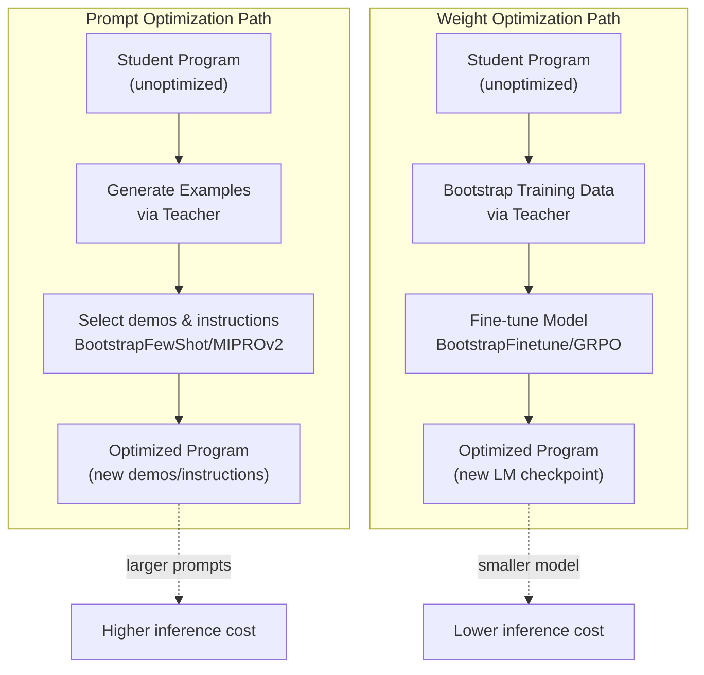
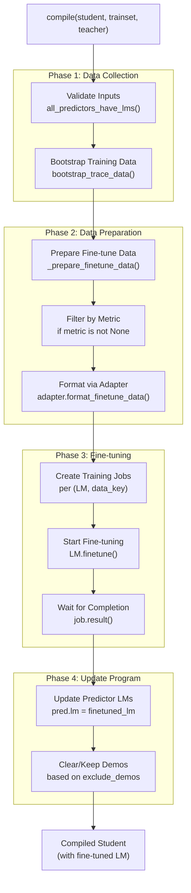
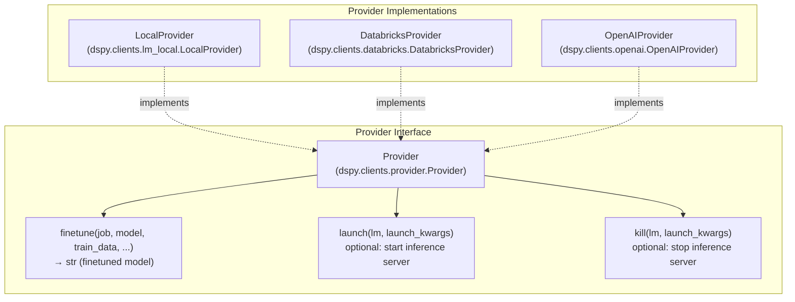
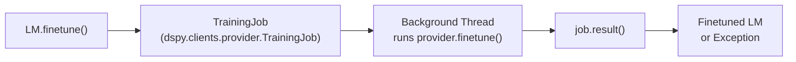
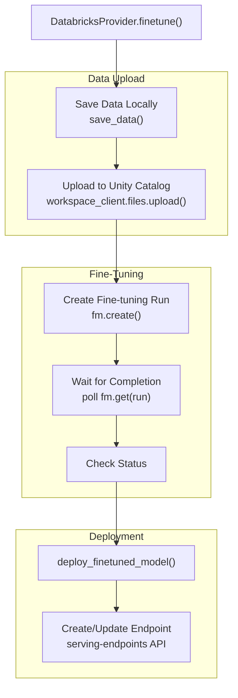
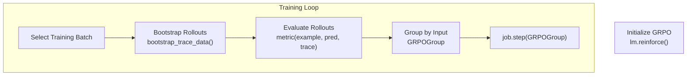

This page documents DSPy's weight optimization capabilities, which distill program knowledge into model weights through supervised fine-tuning and reinforcement learning. Weight optimization complements prompt optimization (see [Few-Shot Optimizers](#4.3) and [MIPROv2: Instruction & Parameter Optimization](#4.4)) by creating specialized model checkpoints rather than updating in-context demonstrations or instructions.

For general optimization concepts and the `Teleprompter` base class, see [Optimization Overview](#4.1). For evaluation infrastructure used during optimization, see [Evaluation Framework](#4.2).

---

## Weight Optimization vs Prompt Optimization

DSPy provides two optimization strategies:

**Prompt Optimization** (covered in sections [Few-Shot Optimizers](#4.3), [MIPROv2: Instruction & Parameter Optimization](#4.4), [GEPA & SIMBA: Reflective and Stochastic Optimization](#4.5)):
- Modifies `Predict.demos` and `Predict.signature.instructions`.
- No model retraining required.
- Fast iteration cycles.
- Works with any LM provider.
- Results in larger prompts (token cost).

**Weight Optimization** (this page):
- Updates model parameters through fine-tuning or RL.
- Requires training infrastructure.
- Slower iteration cycles.
- Provider-dependent (must support `finetunable=True`).
- Results in specialized model checkpoints.
- Can distill larger models into smaller ones.



**Diagram: Prompt vs Weight Optimization Paths**

Sources: [dspy/teleprompt/bootstrap_finetune.py:36-134](), [dspy/teleprompt/bootstrap_trace.py:1-20](), [docs/docs/learn/optimization/optimizers.md:24-33]()

---

## BootstrapFinetune: Supervised Fine-Tuning

`BootstrapFinetune` is the primary teleprompter for supervised weight optimization. It generates training data by executing a teacher program, then fine-tunes the student's LM on successful traces.

### Basic Usage

```python
import dspy

# Configure student with a finetunable LM
student = MyModule()
student.set_lm(dspy.LM("openai/local:Qwen/Qwen2.5-1.5B-Instruct"))

# Define metric for filtering training data
def metric(example, pred, trace=None):
    return example.answer == pred.answer

# Create optimizer
optimizer = dspy.BootstrapFinetune(
    metric=metric,
    multitask=True,  # Train all predictors with same data
    train_kwargs={
        "num_train_epochs": 3,
        "per_device_train_batch_size": 4,
    },
)

# Compile (starts fine-tuning)
compiled_student = optimizer.compile(
    student=student,
    trainset=trainset,
    teacher=teacher,  # Optional; uses student if None
)
```

**Sources:** [dspy/teleprompt/bootstrap_finetune.py:36-134]()

### Compilation Pipeline



**Diagram: BootstrapFinetune Compilation Pipeline**

**Sources:** [dspy/teleprompt/bootstrap_finetune.py:60-134]()

### Key Parameters

| Parameter | Type | Default | Description |
|-----------|------|---------|-------------|
| `metric` | `Callable` | `None` | Filters training data; only examples where `metric(example, pred, trace)` is truthy are used. |
| `multitask` | `bool` | `True` | If `True`, all predictors train on the same data; if `False`, each predictor gets separate data. |
| `train_kwargs` | `dict` | `None` | Passed to `LM.finetune()`; can be per-LM dict. |
| `adapter` | `Adapter` | `None` | Formats training data; defaults to `ChatAdapter`. |
| `exclude_demos` | `bool` | `False` | If `True`, clears `Predict.demos` after fine-tuning. |
| `num_threads` | `int` | `None` | Parallel threads for data collection. |

**Sources:** [dspy/teleprompt/bootstrap_finetune.py:36-59]()

---

## BetterTogether: Meta-Optimization

`BetterTogether` is a meta-optimizer that combines prompt optimization and weight optimization in configurable sequences [dspy/teleprompt/bettertogether.py:32-39](). It is based on the insight that prompt optimization can discover reasoning strategies while weight optimization specializes the model to execute them [dspy/teleprompt/bettertogether.py:41-43]().

### Common Strategies
- **`"p -> w"`**: Optimize prompts first, then fine-tune.
- **`"p -> w -> p"`**: Optimize prompts, fine-tune, then refine prompts on the new model weights.
- **`"mipro -> gepa -> mipro"`**: Chaining different prompt optimizers before weight updates.

**Sources:** [dspy/teleprompt/bettertogether.py:138-140](), [docs/docs/api/optimizers/BetterTogether.md:136-140]()

---

## Provider Abstraction for Training

DSPy delegates fine-tuning to `Provider` implementations, enabling support for various training backends.

### Provider Base Class



**Diagram: Provider Abstraction Architecture**

The `Provider` class [dspy/clients/provider.py:180-202]() defines the interface for training, including `finetunable` and `reinforceable` flags.

**Sources:** [dspy/clients/provider.py:180-202]()

### Training Job Lifecycle

Fine-tuning is managed through `TrainingJob` objects [dspy/clients/provider.py:12-39](), which extend `concurrent.futures.Future`.



**Diagram: TrainingJob Lifecycle**

**Sources:** [dspy/clients/provider.py:12-36](), [dspy/teleprompt/bootstrap_finetune.py:136-166]()

---

## LocalProvider: Local Fine-Tuning

`LocalProvider` [dspy/clients/lm_local.py:22-27]() enables fine-tuning on local GPUs using SGLang for serving and TRL/Transformers for training.

### Launch and Kill

`LocalProvider` manages SGLang server lifecycle via `launch` [dspy/clients/lm_local.py:29-130]() and `kill` [dspy/clients/lm_local.py:131-143]().

**Sources:** [dspy/clients/lm_local.py:29-143]()

### Fine-Tuning Implementation

Fine-tuning uses TRL's `SFTTrainer` inside `train_sft_locally` [dspy/clients/lm_local.py:200-204](). It supports LoRA via `use_peft` in `train_kwargs`.

**Sources:** [dspy/clients/lm_local.py:145-323]()

---

## DatabricksProvider: Managed Fine-Tuning

`DatabricksProvider` [dspy/clients/databricks.py:41-43]() enables fine-tuning on Databricks Foundation Model Training infrastructure with automatic deployment to Model Serving.

### Fine-Tuning and Deployment Pipeline



**Diagram: Databricks Fine-Tuning and Deployment**

**Sources:** [dspy/clients/databricks.py:50-243]()

---

## GRPO: Online Reinforcement Learning

`GRPO` (Group Relative Policy Optimization) enables online reinforcement learning over DSPy programs. It samples multiple completions per input and uses group-relative rewards [dspy/teleprompt/grpo.py:26-46]().

### Concept

GRPO samples `num_rollouts_per_grpo_step` per input, computes rewards, and updates the policy via an RL backend (e.g., Arbor).

### Basic Usage

```python
from arbor import ArborGRPO, ArborProvider
import arbor

arbor_server_info = arbor.init()
local_lm = dspy.LM(
    model=f"openai/arbor:{local_lm_name}",
    provider=ArborProvider(),
    api_base=arbor_server_info["base_url"],
)
dspy.configure(lm=local_lm)

optimizer = ArborGRPO(
    metric=reward_fn,
    num_dspy_examples_per_grpo_step=1,
    num_rollouts_per_grpo_step=1,
    num_train_steps=100,
)
```

**Sources:** [docs/docs/tutorials/rl_multihop/index.ipynb:28-48](), [dspy/teleprompt/grpo.py:26-78]()

### GRPO Training Loop



**Diagram: GRPO Training Loop**

**Sources:** [dspy/teleprompt/grpo.py:237-475](), [dspy/clients/provider.py:81-179]()

---

## Summary

DSPy's weight optimization framework provides:
1. **`BootstrapFinetune`**: Supervised fine-tuning on teacher traces [dspy/teleprompt/bootstrap_finetune.py:36-134]().
2. **`BetterTogether`**: Meta-optimization combining prompts and weights [dspy/teleprompt/bettertogether.py:32-39]().
3. **`GRPO`**: Online reinforcement learning for reward-based optimization [dspy/teleprompt/grpo.py:26-46]().
4. **Provider System**: Backend-agnostic training for Local, Databricks, and OpenAI providers [dspy/clients/provider.py:180-202]().

**Sources:** [dspy/teleprompt/bootstrap_finetune.py](), [dspy/teleprompt/grpo.py](), [dspy/clients/provider.py](), [dspy/clients/lm_local.py](), [dspy/clients/databricks.py]()