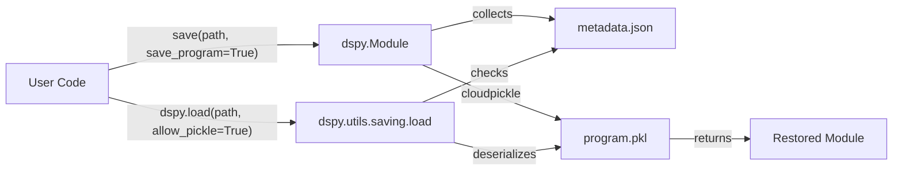

def get_dependency_versions():
    import dspy
    cloudpickle_version = ".".join(cloudpickle.__version__.split(".")[:2])
    return {
        "python": f"{sys.version_info.major}.{sys.version_info.minor}",
        "dspy": dspy.__version__,
        "cloudpickle": cloudpickle_version,
    }
```

**Sources:** [dspy/predict/predict.py:219-236](), [dspy/utils/saving.py:15-24]()

## Security Considerations

Serialization involves significant security risks, particularly when using Pickle or CloudPickle.

1.  **Arbitrary Code Execution**: Loading `.pkl` files can execute arbitrary code. DSPy requires an explicit `allow_pickle=True` flag in `dspy.load` and `Module.load` to prevent accidental loading of untrusted data [dspy/utils/saving.py:39-40](), [tests/utils/test_saving.py:136-144]().
2.  **LM Configuration**: Sensitive LM keys like `api_base` and `base_url` are sanitized by default to prevent redirection of LM calls to malicious endpoints [dspy/predict/predict.py:22-40]().

### Component Interaction Diagram

**Sources:** [dspy/utils/saving.py:27-61](), [dspy/primitives/base_module.py:168-181]()

## Comparison of Persistence Methods

| Feature | State-Only (JSON) | State-Only (Pickle) | Whole Program (CloudPickle) |
| :--- | :--- | :--- | :--- |
| **File Extension** | `.json` | `.pkl` | Directory |
| **Architecture** | Must recreate manually | Must recreate manually | Automatically restored |
| **Readability** | High (Text) | Low (Binary) | Low (Binary) |
| **Security** | Safe | Dangerous (`allow_pickle`) | Dangerous (`allow_pickle`) |
| **Use Case** | Production deployment | Complex local state | Research sharing / Export |

**Sources:** [docs/docs/tutorials/saving/index.md:8-106](), [dspy/primitives/base_module.py:168-181]()