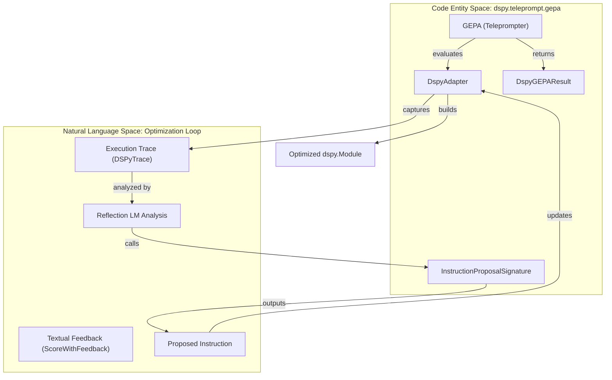
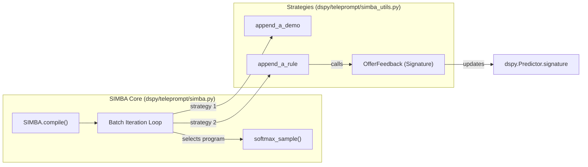

## Purpose and Scope

This page documents two advanced optimization strategies in DSPy: **GEPA** (Genetic Evolution of Prompts through Adaptation) and **SIMBA** (Stochastic Introspective Mini-Batch Ascent). While both aim to improve program performance through automated prompt refinement, they employ fundamentally different philosophies: GEPA uses a **reflective, tree-based evolution** driven by textual feedback, while SIMBA uses a **stochastic, mini-batch ascent** approach that alternates between adding successful demonstrations and introspective rule generation.

Sources: [dspy/teleprompt/gepa/gepa.py:155-165](), [dspy/teleprompt/simba.py:18-26]()

## GEPA: Reflective Prompt Evolution

GEPA is an evolutionary optimizer that uses reflection to evolve text components of complex systems. It captures full execution traces of a DSPy module, identifies predictor-specific segments, and reflects on their behavior to propose new instructions.

### System Architecture & Data Flow

GEPA's optimization loop is managed by the `GEPA` class [dspy/teleprompt/gepa/gepa.py:155](), which coordinates with a `DspyAdapter` [dspy/teleprompt/gepa/gepa_utils.py:77]() to interface between the DSPy module and the underlying GEPA evolutionary engine.

Sources: [dspy/teleprompt/gepa/gepa.py:155-165](), [dspy/teleprompt/gepa/gepa_utils.py:77-134](), [dspy/teleprompt/gepa/gepa.py:60-80]()

### Key Classes and Functions

*   **`GEPA` Class**: The main entry point. It accepts a `metric` (which should return `ScoreWithFeedback`), and optional `reflection_lm` [dspy/teleprompt/gepa/gepa.py:155-200]().
*   **`DspyAdapter`**: Manages the program lifecycle. It implements `build_program` [dspy/teleprompt/gepa/gepa_utils.py:136]() to apply new instructions to predictors and `evaluate` [dspy/teleprompt/gepa/gepa_utils.py:145]() to capture traces using `bootstrap_trace_data`.
*   **`ScoreWithFeedback`**: A specialized `Prediction` type that includes both a numeric `score` and a string `feedback` [dspy/teleprompt/gepa/gepa_utils.py:46-48]().
*   **`InstructionProposalSignature`**: An internal signature used by the reflection LM to generate `new_instruction` based on `current_instruction_doc` and `dataset_with_feedback` [dspy/teleprompt/gepa/gepa_utils.py:126-132]().

Sources: [dspy/teleprompt/gepa/gepa.py:155-200](), [dspy/teleprompt/gepa/gepa_utils.py:46-132]()

## SIMBA: Stochastic Introspective Mini-Batch Ascent

SIMBA optimizes DSPy programs by analyzing performance across mini-batches. It identifies "challenging" examples (high variability) and applies two strategies: appending successful demonstrations or generating self-reflective rules.

### Optimization Strategy

SIMBA maintains a pool of candidate programs and iteratively improves them over `max_steps` [dspy/teleprompt/simba.py:34](). In each step, it samples a mini-batch of size `bsize` [dspy/teleprompt/simba.py:32]() and selects the best/worst trajectories to generate improvements.

Sources: [dspy/teleprompt/simba.py:85-184](), [dspy/teleprompt/simba_utils.py:73-168]()

### Key Components

*   **`append_a_demo`**: Identifies a "good" trajectory from the batch and adds the execution steps as `dspy.Example` objects to the predictor's `demos` list [dspy/teleprompt/simba_utils.py:73-101]().
*   **`append_a_rule`**: Compares a "good" trajectory against a "bad" one. It uses the `OfferFeedback` signature to generate advice, which is then appended to the predictor's signature instructions [dspy/teleprompt/simba_utils.py:106-168]().
*   **`OfferFeedback`**: A signature that analyzes `better_program_trajectory` and `worse_program_trajectory` to prescribe concrete advice for specific modules [dspy/teleprompt/simba_utils.py:170-182]().

Sources: [dspy/teleprompt/simba_utils.py:73-182]()

## Comparative Metrics and Iterative Refinement

Both optimizers rely on iterative refinement, but they handle the "feedback" loop differently.

| Feature | GEPA | SIMBA |
| :--- | :--- | :--- |
| **Primary Mechanism** | Tree-based Genetic Evolution | Mini-batch Stochastic Ascent |
| **Refinement Type** | Instruction mutation via reflection | Demos + Rule-based instructions |
| **Metric Input** | `ScoreWithFeedback` (Direct) | Scalar `metric` (Implicit contrast) |
| **Trace Usage** | Full trace reflection [dspy/teleprompt/gepa/gepa.py:161-163]() | Trajectory contrast (Good vs Bad) [dspy/teleprompt/simba_utils.py:130-150]() |
| **Parallelism** | Supported via `num_threads` [dspy/teleprompt/gepa/gepa_utils.py:96]() | Supported via `dspy.Parallel` [dspy/teleprompt/simba.py:168]() |

### Refinement Modules
DSPy also provides lower-level modules for iterative refinement:
*   **`dspy.Refine`**: Runs a module $N$ times. If the `threshold` isn't met, it uses `OfferFeedback` to provide a `hint_` to the next attempt [dspy/predict/refine.py:41-130]().
*   **`dspy.BestOfN`**: Executes a module $N$ times with different `rollout_id` values and selects the prediction with the highest reward [dspy/predict/best_of_n.py:7-59]().

Sources: [dspy/predict/refine.py:41-130](), [dspy/predict/best_of_n.py:7-59](), [dspy/teleprompt/gepa/gepa.py:161-163](), [dspy/teleprompt/simba_utils.py:130-150]()

## Implementation Details: Trace Capture

Both GEPA and SIMBA rely on capturing execution traces to understand internal module behavior. This is typically achieved via `bootstrap_trace_data` [dspy/teleprompt/bootstrap_trace.py:30](), which collects `dspy.settings.trace`.

The trace data structure includes:
1.  **`example`**: The input data.
2.  **`prediction`**: The final output.
3.  **`trace`**: A list of tuples `(Predictor, Inputs, Prediction)` representing each step [dspy/teleprompt/gepa/gepa_utils.py:28-68]().

Sources: [dspy/teleprompt/bootstrap_trace.py:30](), [dspy/teleprompt/gepa/gepa_utils.py:28-68]()