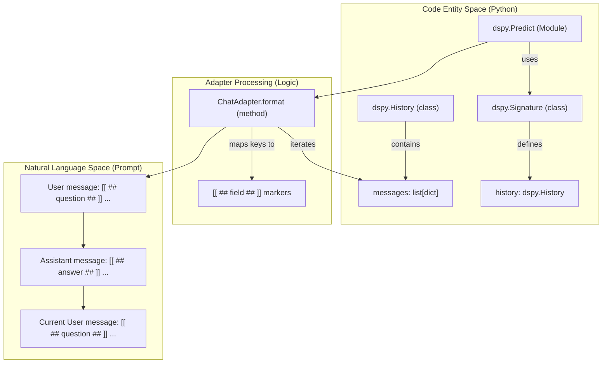
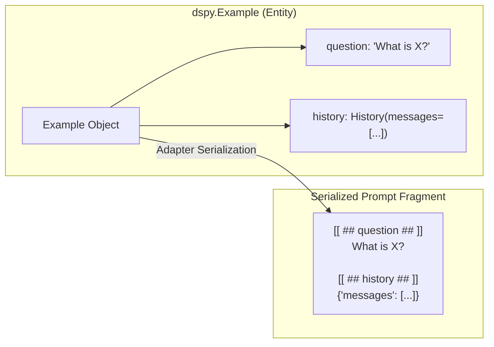
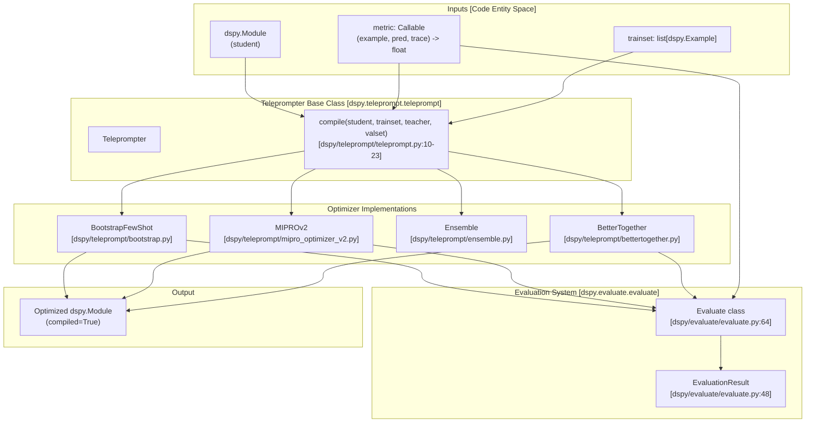
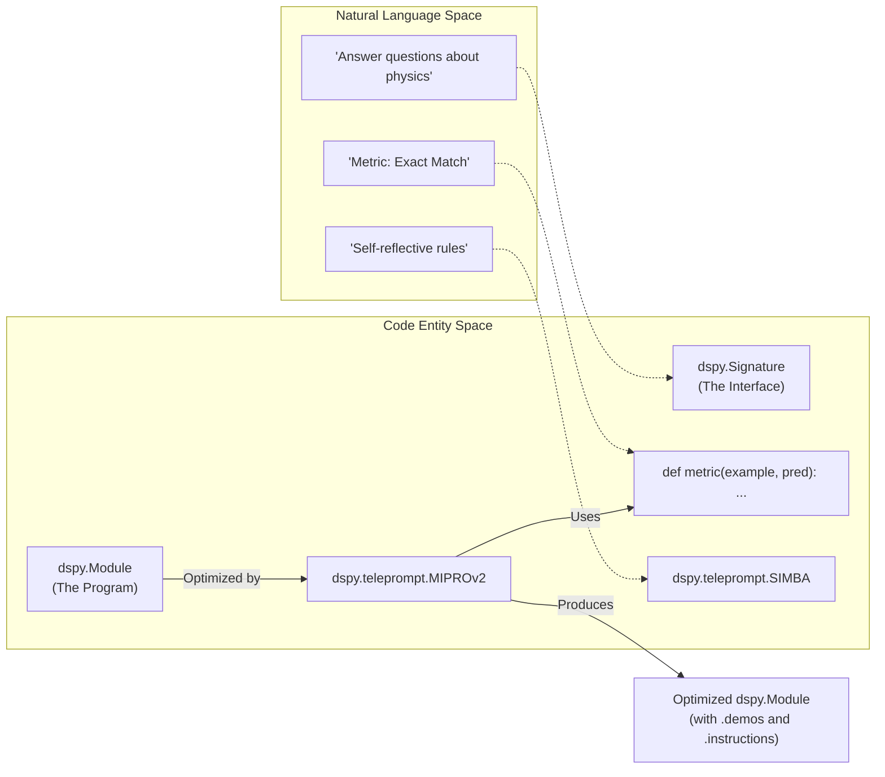
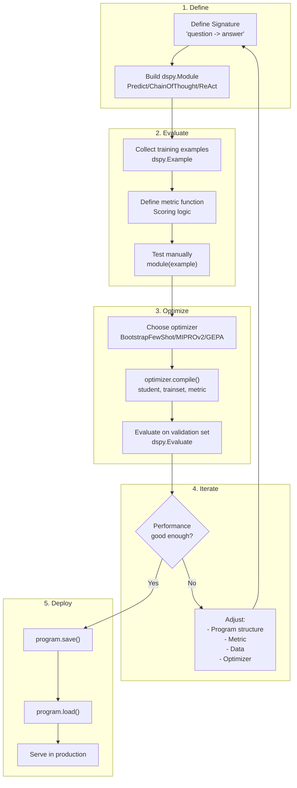
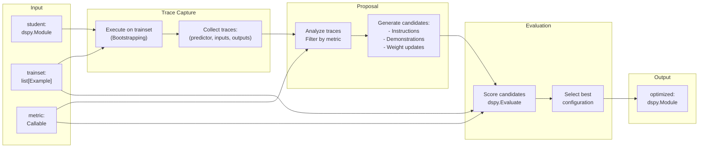
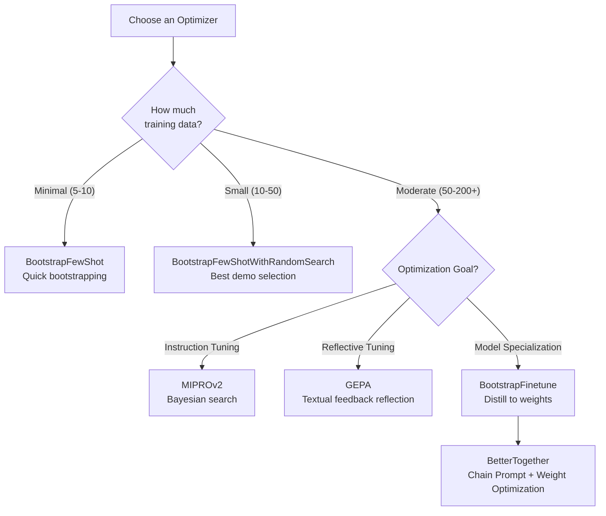

This page documents DSPy's conversation history management capabilities through the `dspy.History` primitive. It covers how to maintain conversational context across multiple turns in DSPy programs, how history is formatted into multi-turn messages for language models, and how history integrates with signatures, modules, and adapters.

## Overview

DSPy does not provide automatic conversation history management within `dspy.Module`. Instead, it provides the `dspy.History` primitive as a tool that developers can use to explicitly manage conversational context. This design gives developers full control over when and how conversation history is maintained, allowing for flexible patterns in multi-turn interactions such as chatbots, iterative agents, and dialogue systems.

The `dspy.History` class serves as a structured container for conversation turns and integrates with DSPy's signature system and adapter layer. When used as an input field in a signature, the adapter layer handles the transformation of this structured data into the format required by the underlying Language Model (LM).

Sources: [docs/docs/tutorials/conversation_history/index.md:1-4]()

## The History Class

### Structure and Implementation

The `dspy.History` class is defined as a Pydantic model to ensure data validation and consistent structure. It is located in the adapter type system.

| Attribute | Type | Description |
|-----------|------|-------------|
| `messages` | `list[dict[str, Any]]` | List of conversation turns, where each entry is a dictionary with keys corresponding to signature fields |

The class is configured with `frozen=True` and `extra="forbid"` to maintain strict schema adherence during the conversation lifecycle.

Sources: [dspy/adapters/types/history.py:6-69]()

### History as a Signature Field

To use history in a DSPy program, it must be declared as an `InputField` within a `dspy.Signature`. The type hint `dspy.History` signals to the system how to process this field.

```python
class QA(dspy.Signature):
    question: str = dspy.InputField()
    history: dspy.History = dspy.InputField()
    answer: str = dspy.OutputField()
```

Sources: [dspy/adapters/types/history.py:13-17](), [docs/docs/tutorials/conversation_history/index.md:17-20]()

## Usage Patterns

### Multi-Turn Workflow

The standard pattern for managing history involves initializing a `History` object and manually appending results after each module execution.

1.  **Initialization**: Create an empty history instance: `history = dspy.History(messages=[])`.
2.  **Execution**: Pass the history object to a module (e.g., `dspy.Predict`).
3.  **Update**: Append the previous turn's inputs and the module's outputs to the `messages` list.

Sources: [docs/docs/tutorials/conversation_history/index.md:22-31](), [dspy/adapters/types/history.py:49-58]()

### Code Entity Space to Natural Language Space

The following diagram illustrates how the code-level `dspy.History` entity is transformed by the `Adapter` system into the natural language prompt structure sent to an LM.

**History Transformation Flow**

Sources: [dspy/adapters/types/history.py:6-61](), [docs/docs/tutorials/conversation_history/index.md:55-114]()

## History in Demonstrations (Few-Shot)

### JSON Serialization in Examples

When `dspy.History` is used within `dspy.Example` objects (demonstrations), DSPy does not expand the history into multiple chat turns. Instead, it serializes the history into a JSON string within a single turn. This ensures that few-shot examples remain self-contained units compatible with standard message formats.

**Demonstration Formatting**

Sources: [docs/docs/tutorials/conversation_history/index.md:115-120](), [docs/docs/tutorials/conversation_history/index.md:183-184]()

## Integration with Retrieval (KNN)

Conversation history can be used in conjunction with retrieval-based optimizers like `KNNFewShot`. While `KNNFewShot` typically operates on simple input strings, the underlying `KNN` retriever can vectorize complex inputs.

The `KNN` class vectorizes training examples by joining input keys using a `" | "` separator. If `history` is an input key, its string representation (JSON) will be included in the vector embedding calculation, allowing the system to retrieve similar past conversations based on historical context.

Sources: [dspy/predict/knn.py:42-46](), [dspy/teleprompt/knn_fewshot.py:11-52]()

## Debugging and Inspection

To verify how history is being managed and formatted, developers use `dspy.inspect_history()`. This function reveals the underlying multi-turn structure created by the adapter, showing exactly how the `messages` list was expanded into `User message` and `Assistant message` blocks in the prompt.

Sources: [docs/docs/tutorials/conversation_history/index.md:33-34](), [docs/docs/tutorials/conversation_history/index.md:55-114]()

### Key Implementation Files

| Component | File Path | Description |
|-----------|-----------|-------------|
| `History` Class | [dspy/adapters/types/history.py:6-69]() | Definition of the Pydantic-based history container. |
| `KNN` Retriever | [dspy/predict/knn.py:7-52]() | Logic for retrieving similar examples, potentially including history. |
| `KNNFewShot` | [dspy/teleprompt/knn_fewshot.py:11-70]() | Optimizer that uses KNN to find demonstrations. |
| Tutorial | [docs/docs/tutorials/conversation_history/index.md:1-220]() | Comprehensive guide on manual history management. |

Sources: [dspy/adapters/types/history.py:1-69](), [dspy/predict/knn.py:1-53](), [dspy/teleprompt/knn_fewshot.py:1-70]()

# Program Optimization


## Purpose and Scope

This page provides a high-level technical guide to DSPy's optimization system, referred to in the codebase as the **Teleprompter** system. A DSPy optimizer is an algorithm that tunes the parameters of a DSPy program—specifically the natural language prompts and/or the LM weights—to maximize a specified metric [docs/docs/learn/optimization/optimizers.md:8-9]().

The system follows a "compile-then-run" philosophy where a declarative program is passed through an optimizer to produce an executable, high-performing artifact. Optimizers typically require three inputs: the program, a metric function, and a few training inputs [docs/docs/learn/optimization/optimizers.md:11-17]().

For detailed information on specific subsystems, see the child pages:
- **[Optimization Overview](#4.1)** — Philosophy, the compile-then-run model, and the data allocation strategy (e.g., the 20/80 train/val split for prompt optimizers) [docs/docs/learn/optimization/overview.md:8-10]().
- **[Evaluation Framework](#4.2)** — `dspy.Evaluate` and metric definitions [dspy/evaluate/evaluate.py:64]().
- **[Few-Shot Optimizers](#4.3)** — `BootstrapFewShot`, `LabeledFewShot`, and `KNNFewShot` [docs/docs/learn/optimization/optimizers.md:40-52]().
- **[MIPROv2: Instruction & Parameter Optimization](#4.4)** — Bayesian optimization of instructions and demonstrations [docs/docs/learn/optimization/optimizers.md:59-60]().
- **[GEPA & SIMBA: Reflective and Stochastic Optimization](#4.5)** — Evolution and self-reflective improvement rules [docs/docs/learn/optimization/optimizers.md:61-64]().
- **[Fine-tuning & Weight Optimization](#4.6)** — `BootstrapFinetune`, `GRPO`, and the `BetterTogether` meta-optimizer [docs/docs/learn/optimization/optimizers.md:69-70](), [dspy/teleprompt/bettertogether.py:32-40]().

## Optimization System Architecture

DSPy's optimization system transforms unoptimized programs into high-performing systems by automatically generating demonstrations, instructions, and weight updates. The system operates on three required inputs: a `dspy.Module` program, a metric function, and training examples stored as `dspy.Example` objects.

**System Architecture: Optimization Pipeline**



Sources: [dspy/teleprompt/teleprompt.py:6-23](), [docs/docs/learn/optimization/optimizers.md:8-21](), [dspy/teleprompt/bettertogether.py:32-59]()

## Core Components

### Teleprompter Base Class
The `Teleprompter` class at [dspy/teleprompt/teleprompt.py:6-33]() is the abstract base class. It defines the `compile` method signature which all optimizers must implement. Most optimizers take a `student` program and an optional `teacher` program [dspy/teleprompt/teleprompt.py:10-23]().

### Evaluation Framework (`dspy.Evaluate`)
The `Evaluate` class [dspy/evaluate/evaluate.py:64-111]() is the primary engine for measuring program performance. It handles parallel execution and returns `EvaluationResult` objects containing aggregate scores and individual trace data [dspy/evaluate/evaluate.py:48-62]().

### Metric Functions
Metrics are the "loss functions" of DSPy. A metric is a `Callable` that accepts an `Example`, a `Prediction`, and an optional `trace` [docs/docs/learn/optimization/optimizers.md:15](). Metrics return a numeric score where higher is better. During optimization, the `trace` is used to determine if a specific execution path was successful enough to be used as a few-shot demonstration [docs/docs/learn/optimization/optimizers.md:30-31]().

## Optimizer Categories

### Few-Shot Optimizers
These optimizers extend signatures by automatically generating and including optimized examples (demos) within the prompt [docs/docs/learn/optimization/optimizers.md:40-43]().
- **`LabeledFewShot`**: Constructs demos from provided labeled data points [dspy/teleprompt/vanilla.py:6-25]().
- **`BootstrapFewShot`**: Uses a teacher module to generate complete demonstrations for every stage of a program [docs/docs/learn/optimization/optimizers.md:46-47]().
- **`KNNFewShot`**: Uses k-Nearest Neighbors to find the most relevant training examples for a given input [docs/docs/learn/optimization/optimizers.md:50-51]().

### Instruction & Parameter Optimizers
- **`MIPROv2`**: Jointly optimizes instructions and few-shot examples using Bayesian Optimization to search the space of potential prompts [docs/docs/learn/optimization/optimizers.md:59-60]().
- **`COPRO`**: Generates and refines instructions using coordinate ascent (hill-climbing) [docs/docs/learn/optimization/optimizers.md:57-58]().

### Weight Optimization & Meta-Optimizers
- **`BootstrapFinetune`**: Distills prompt-based programs into weight updates for the underlying LLM [docs/docs/learn/optimization/optimizers.md:69-70]().
- **`BetterTogether`**: A meta-optimizer that chains prompt and weight optimization in configurable sequences (e.g., `"p -> w"`) to leverage their complementary strengths [dspy/teleprompt/bettertogether.py:32-59](), [docs/docs/api/optimizers/BetterTogether.md:42-51]().

### Program Transformations
- **`Ensemble`**: Combines multiple programs into one, typically using a `reduce_fn` like `dspy.majority` to aggregate outputs [dspy/teleprompt/ensemble.py:10-40]().

## Optimization Workflow

**Natural Language to Code Entity Mapping**



Sources: [dspy/teleprompt/teleprompt.py:10-23](), [docs/docs/learn/optimization/optimizers.md:24-33](), [dspy/teleprompt/bettertogether.py:140-155]()

1.  **Define Program**: Create a `dspy.Module` with defined `Signatures`.
2.  **Define Metric**: Create a function to evaluate output quality [docs/docs/learn/optimization/optimizers.md:15]().
3.  **Select Optimizer**: Choose a `Teleprompter` based on whether you need few-shot demos, instruction optimization, or fine-tuning [docs/docs/learn/optimization/optimizers.md:36-70]().
4.  **Compile**: Call `optimizer.compile(student, trainset=...)` [dspy/teleprompt/teleprompt.py:10]().
5.  **Iterate**: Use the results to refine the program structure or the metric [docs/docs/learn/optimization/overview.md:10-12]().

# Optimization Overview


DSPy **optimizers** (formerly called **teleprompters**) automatically improve your programs by tuning prompts, few-shot demonstrations, or model weights. Instead of manually engineering prompts, you define a metric and provide training examples, and the optimizer searches for better configurations.

This page introduces the optimization philosophy, workflow, and provides guidance on choosing the right optimizer for your task. For implementation details, see [Evaluation Framework](page://4.2), [Few-Shot Optimizers](page://4.3), [MIPROv2](page://4.4), [GEPA](page://4.5), and [Fine-tuning & Weight Optimization](page://4.6).

## Why Optimize?

Traditional prompt engineering is brittle and doesn't scale:
- **Manual prompt tuning** requires extensive trial-and-error for each model and task.
- **Prompts break** when you change models, add pipeline stages, or modify requirements.
- **Few-shot examples** need careful curation and don't automatically adapt to your data.

DSPy optimization addresses these problems by:
1. **Separating interface from implementation**: You define what modules should do (signatures), not how to prompt them.
2. **Learning from data**: Optimizers discover effective prompts and demonstrations from your training examples [docs/docs/learn/optimization/optimizers.md:24-26]().
3. **Adapting to changes**: Re-compile when you change models or task requirements.

**Result**: Programs that are more reliable, maintainable, and portable across models.

**Sources:** [docs/docs/learn/optimization/overview.md:1-12](), [docs/docs/learn/optimization/optimizers.md:24-26]()

## The Three Inputs

Every optimizer takes three core inputs as defined in the `Teleprompter.compile` interface [dspy/teleprompt/teleprompt.py:10-23]():

| Input | Description | Typical Size |
|-------|-------------|--------------|
| **Student Program** | The `dspy.Module` to optimize | Single program |
| **Training Set** | `list[dspy.Example]` with inputs marked via `.with_inputs()` | 10-500+ examples |
| **Metric Function** | `Callable` that scores outputs (higher = better) | Single function |

If you have a lot of data, DSPy can leverage it, but substantial value can often be gained from as few as 30 examples [docs/docs/learn/optimization/overview.md:8-9]().

**Sources:** [docs/docs/learn/optimization/optimizers.md:11-20](), [dspy/teleprompt/teleprompt.py:10-23](), [docs/docs/learn/optimization/overview.md:8-9]()

## The Development Workflow

Optimization is part of an iterative development cycle. The recommended workflow follows these phases:



**Title:** DSPy Development Workflow with Optimization

**Key Phases:**
1. **Define**: Create your program using signatures and modules.
2. **Evaluate**: Collect examples and define a metric. For prompt optimizers, a reverse split (20% train, 80% validation) is often recommended to avoid overfitting [docs/docs/learn/optimization/overview.md:8-9]().
3. **Optimize**: Run an optimizer to improve prompts, demos, or weights [docs/docs/learn/optimization/optimizers.md:24-26]().
4. **Iterate**: Refine your program, metric, or data based on results [docs/docs/learn/optimization/overview.md:10-12]().

**Sources:** [docs/docs/learn/optimization/overview.md:1-12](), [docs/docs/learn/optimization/optimizers.md:11-20]()

## How Optimizers Work

All optimizers follow a similar internal workflow, though they differ in how they generate improvements:



**Title:** Internal Optimization Workflow

**Implementation Phases:**
1. **Bootstrapping**: The optimizer runs the program many times across different inputs to collect traces of input/output behavior for every module [docs/docs/learn/optimization/optimizers.md:30-31]().
2. **Grounded Proposal**: For instruction optimizers like `MIPROv2`, the system previews code, data, and traces to draft potential instructions for every prompt [docs/docs/learn/optimization/optimizers.md:30-31]().
3. **Discrete Search**: Candidates are evaluated on mini-batches of the training set. Scores update a surrogate model (e.g., in Bayesian Optimization) to improve future proposals [docs/docs/learn/optimization/optimizers.md:30-31]().

**Sources:** [docs/docs/learn/optimization/optimizers.md:30-31](), [dspy/teleprompt/teleprompt.py:10-23]()

## Optimizer Categories

DSPy provides four categories of optimizers, each targeting different aspects of program optimization:

### 1. Few-Shot Learning Optimizers
These extend signatures by automatically generating and including optimized examples within the prompt [docs/docs/learn/optimization/optimizers.md:40-42]().

| Optimizer | Strategy | Best For |
|-----------|----------|----------|
| `LabeledFewShot` | Constructs demos from provided labeled data [dspy/teleprompt/vanilla.py:6-25]() | Pre-labeled data available |
| `BootstrapFewShot` | Uses a teacher module to generate demonstrations validated by a metric [docs/docs/learn/optimization/optimizers.md:46-47]() | Basic optimization with small data |
| `BootstrapFewShotWithRandomSearch` | Applies `BootstrapFewShot` multiple times with random search over demo sets [dspy/teleprompt/random_search.py:18-20]() | Searching for the best subset of demos |
| `KNNFewShot` | Uses k-Nearest Neighbors to find similar training examples for a given input [docs/docs/learn/optimization/optimizers.md:50-51]() | Dynamic demo selection |

### 2. Instruction & Parameter Optimizers
These produce optimal instructions and can also optimize few-shot demonstrations [docs/docs/learn/optimization/optimizers.md:53-55]().

| Optimizer | Strategy | Best For |
|-----------|----------|----------|
| `COPRO` | Coordinate ascent (hill-climbing) to refine instructions [docs/docs/learn/optimization/optimizers.md:57-58]() | Iterative prompt improvement |
| `MIPROv2` | Bayesian Optimization over instructions and demonstrations [docs/docs/learn/optimization/optimizers.md:59-60]() | Data-aware and demo-aware instruction tuning |
| `SIMBA` | Stochastic mini-batch sampling to identify challenging examples and introspect failures [docs/docs/learn/optimization/optimizers.md:61-62]() | Self-reflective improvement rules |
| `GEPA` | Reflective analysis of trajectories to identify gaps and propose prompts [docs/docs/learn/optimization/optimizers.md:63-64]() | Rapid improvement via domain feedback |

### 3. Fine-tuning Optimizers
These tune the underlying LLM weights [docs/docs/learn/optimization/optimizers.md:65-67]().

| Optimizer | Strategy | Best For |
|-----------|----------|----------|
| `BootstrapFinetune` | Distills a prompt-based program into weight updates for each step [docs/docs/learn/optimization/optimizers.md:69-70]() | Moving from prompting to fine-tuned specialized models |

### 4. Meta-Optimizers
These allow composing or ensembling multiple optimization strategies.

| Optimizer | Strategy | Best For |
|-----------|----------|----------|
| `BetterTogether` | Combines prompt and weight optimization in configurable sequences (e.g., `p -> w`) [dspy/teleprompt/bettertogether.py:32-59]() | Compounding gains from prompts and weights |
| `Ensemble` | Combines multiple programs (e.g., top-5 candidates) into one program [docs/docs/learn/optimization/optimizers.md:32-33]() | Scaling inference-time compute |

**Sources:** [docs/docs/learn/optimization/optimizers.md:26-75](), [dspy/teleprompt/bettertogether.py:32-59](), [dspy/teleprompt/ensemble.py:10-41]()

## Choosing an Optimizer

The right optimizer depends on your data size and optimization goals:



**Title:** Optimizer Selection Guide

### BetterTogether: Chaining Optimizers
`BetterTogether` allows executing optimizers in a configurable sequence using a strategy string like `"p -> w -> p"`. This is particularly powerful for combining prompt optimization (which discovers reasoning strategies) with weight optimization (which specializes the model) [dspy/teleprompt/bettertogether.py:32-49]().

- **Strategy Execution**: At each step, the optimizer shuffles the trainset, runs the current optimizer, and evaluates the result on a validation set [docs/docs/api/optimizers/BetterTogether.md:59-63]().
- **Model Lifecycle**: It automatically manages `launch_lms` and `kill_lms` for local providers when model names change after fine-tuning [dspy/teleprompt/bettertogether.py:133-138]().

**Sources:** [dspy/teleprompt/bettertogether.py:32-140](), [docs/docs/api/optimizers/BetterTogether.md:22-108](), [docs/docs/learn/optimization/optimizers.md:28-33]()