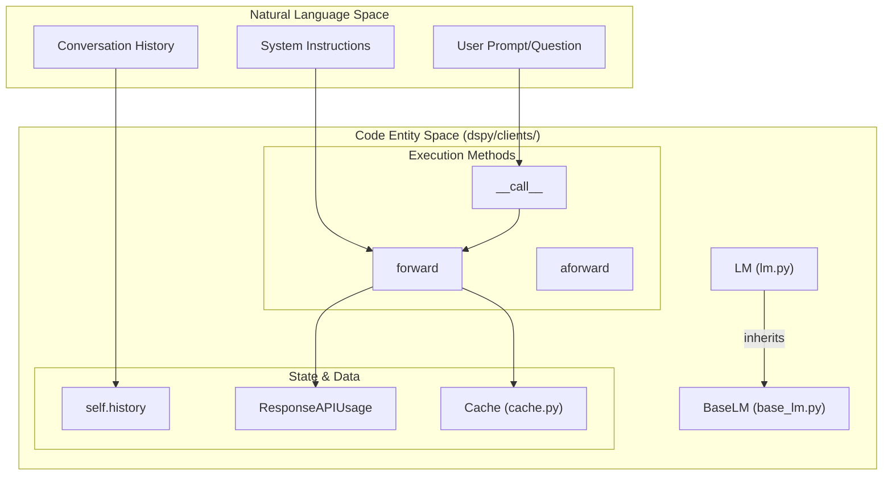
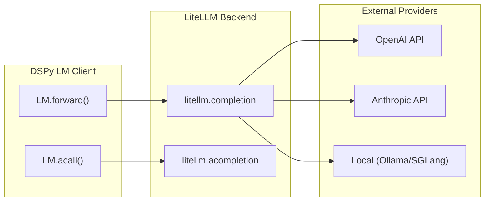

This document describes DSPy's language model (LM) integration layer, which provides a unified interface for interacting with 40+ LM providers through LiteLLM. This layer handles prompt formatting, response parsing, caching, retry logic, and history tracking.

**Scope**: This page covers the `dspy.LM` client, `BaseLM` interface, LiteLLM backend integration, caching system, and provider abstraction. For information about how signatures and modules use the LM client, see [Core Architecture (2.0)](#).

## LM Client Architecture

The language model integration is built around two primary classes: `BaseLM` and `LM`.

### BaseLM Interface

`BaseLM` is the base class that defines the interface for all language model interactions. It implements the core lifecycle of a request:

- **History tracking**: Maintains a local `self.history` list of interactions [dspy/clients/base_lm.py:68]().
- **Callback support**: Uses the `@with_callbacks` decorator on `__call__` and `acall` to allow observability hooks [dspy/clients/base_lm.py:122-143]().
- **Response processing**: Implements `_process_lm_response` to extract text, reasoning, and usage data from standardized provider responses [dspy/clients/base_lm.py:90-120]().
- **Abstract Forwarding**: Defines `forward` and `aforward` which subclasses must implement to perform the actual network request [dspy/clients/base_lm.py:145-191]().

**Sources**: [dspy/clients/base_lm.py:13-191]()

### LM Class (The LiteLLM Implementation)

`LM` is the primary class users interact with. It extends `BaseLM` and leverages LiteLLM for multi-provider support. Key responsibilities include:

- **Provider Specialization**: Handles specific logic for OpenAI reasoning models (o1, o3, gpt-5) which require `temperature=1.0` and specific token parameters [dspy/clients/lm.py:88-111]().
- **Retry Logic**: Configures `num_retries` for transient failures using exponential backoff [dspy/clients/lm.py:41, 80]().
- **Caching Integration**: Wraps the completion function with `request_cache` to prevent redundant API calls [dspy/clients/lm.py:147-157]().

**Sources**: [dspy/clients/lm.py:28-114]()

### LM Client Entity Mapping

The following diagram bridges the high-level concepts to the specific classes and methods in the codebase.

**Diagram: LM Integration Entity Bridge**
**Sources**: [dspy/clients/base_lm.py:13-150](), [dspy/clients/lm.py:28-169]()

## Provider Support via LiteLLM

DSPy delegates the heavy lifting of provider-specific API formatting to **LiteLLM**. This allows a single `dspy.LM` instance to support OpenAI, Anthropic, Gemini, Vertex AI, Databricks, and local models (Ollama/SGLang).

### Model Selection Hierarchy

When a request is made, DSPy follows a hierarchy to determine how to execute the call:

1.  **Model Type Dispatch**: The `model_type` attribute (set during `__init__`) determines if the call uses chat, text, or the newer "responses" API [dspy/clients/lm.py:36, 151-156]().
2.  **Provider Inference**: If not explicitly provided, the system extracts the provider from the model string (e.g., "openai" from "openai/gpt-4o") [dspy/clients/lm.py:116-120]().
3.  **Parameter Mapping**: DSPy maps standard parameters like `temperature` and `max_tokens` to provider-specific keys [dspy/clients/lm.py:105-109]().

### LiteLLM Execution Flow

**Diagram: Provider Execution Flow**
**Sources**: [dspy/clients/lm.py:159-194](), [dspy/clients/lm.py:209-245]()

## Caching System

DSPy implements a two-tier caching system to reduce latency and costs. It is enabled by default in the `LM` constructor [dspy/clients/lm.py:39]().

### Cache Tiers
1.  **In-Memory Cache**: Implemented with `cachetools.LRUCache` for fast access [dspy/clients/cache.py:44, 78]().
2.  **On-Disk Cache**: Implemented with `diskcache.FanoutCache` for persistent storage, defaulting to `~/.dspy_cache` [dspy/clients/cache.py:45, 82-94](), [dspy/clients/__init__.py:16]().

### Cache Key Logic
The cache key is a SHA-256 hash of the request dictionary. Certain arguments like `api_key`, `api_base`, and `base_url` are ignored to ensure that changing credentials doesn't invalidate the cache [dspy/clients/cache.py:104-113](), [dspy/clients/lm.py:148]().

### Restricted Deserialization
For security, DSPy provides a `restrict_pickle` mode. When enabled, only trusted types (like LiteLLM/OpenAI response models and NumPy reconstruction helpers) are allowed to be loaded from the disk cache [dspy/clients/disk_serialization.py:6-11](), [dspy/clients/cache.py:88-93]().

**Sources**: [dspy/clients/cache.py:40-147](), [dspy/clients/__init__.py:20-51](), [dspy/clients/disk_serialization.py:1-89]()

## Three-Tier LM Selection Hierarchy

DSPy allows for granular control over which LM is used during execution. The system resolves the LM to use in the following order of priority:

| Tier | Mechanism | Scope |
| :--- | :--- | :--- |
| **1. Local Context** | `with dspy.context(lm=my_lm):` | Block-level override for specific modules or operations. |
| **2. Module-Specific** | `module.set_lm(my_lm)` | Overrides the LM for a specific module instance. |
| **3. Global Default** | `dspy.configure(lm=my_lm)` | The fallback LM used by all modules if no specific LM is set [dspy/dsp/utils/settings.py:19](). |

**Sources**: [dspy/dsp/utils/settings.py:19](), [dspy/clients/base_lm.py:5-7]()

## Key Implementation Details

### Response Processing
The `BaseLM` class processes raw provider responses into a list of strings or dictionaries. If `model_type` is "responses", it uses `_process_response`; otherwise, it uses `_process_completion` [dspy/clients/base_lm.py:93-96]().

### History and Inspection
The `BaseLM` class tracks history and provides `inspect_history` to print the last `n` interactions, showing the formatted prompt and the model's response [dspy/clients/base_lm.py:7, 68, 118]().

### Async Support
All LM interactions support `asyncio`. The `acall` method in `BaseLM` awaits `aforward`, allowing for high-concurrency evaluations and parallel module execution [dspy/clients/base_lm.py:135-143](), [dspy/clients/lm.py:209-245]().

**Sources**: [dspy/clients/base_lm.py:90-143](), [dspy/clients/lm.py:159-245]()