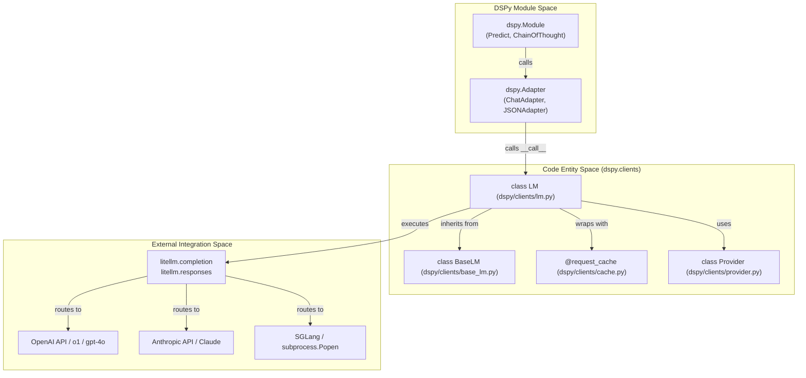
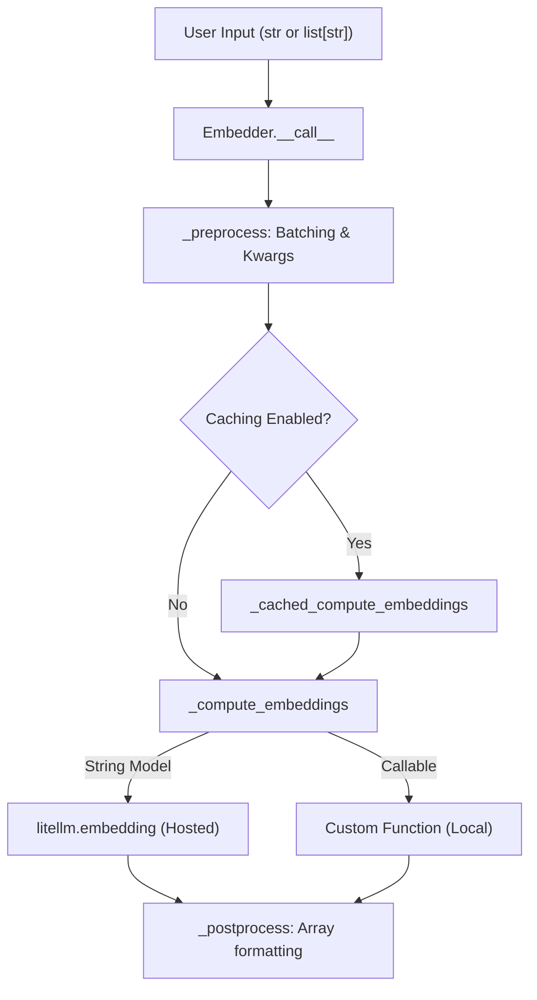
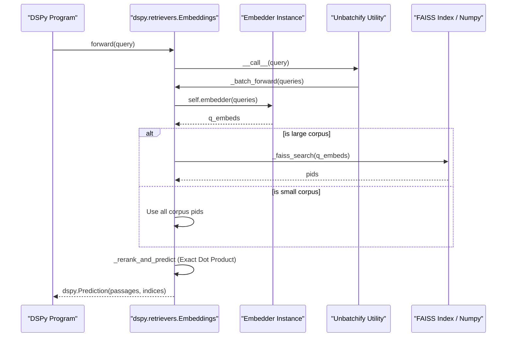
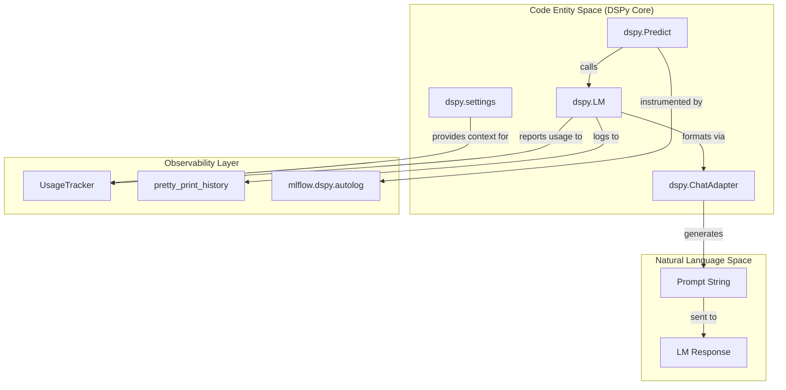

This document describes how DSPy integrates with language model providers through the LiteLLM abstraction layer. It covers the `dspy.LM` client, supported providers (OpenAI, Anthropic, Databricks, local models via SGLang), and provider-specific features like fine-tuning and reasoning models.

---

## Purpose and Architecture

DSPy uses [LiteLLM](https://github.com/BerriAI/litellm) as its primary abstraction layer for language model providers. This design allows DSPy to support 100+ LM providers through a single unified interface while providing consistent caching, retry logic, and history tracking across all providers.

The `dspy.LM` class [dspy/clients/lm.py:28-114]() serves as the primary interface between DSPy modules and language models, handling:
- Provider abstraction via LiteLLM.
- Request formatting and response parsing.
- Caching (memory and disk) [dspy/clients/lm.py:147-157]().
- Retry logic with exponential backoff [dspy/clients/lm.py:41-42]().
- History tracking [dspy/clients/base_lm.py:90-120]().
- Provider-specific features (function calling, reasoning modes, fine-tuning).

### System-to-Code Mapping: LM Execution Flow

The following diagram bridges the natural language concepts of "Request Processing" to the specific code entities in the `dspy` client layer.



**Sources:** [dspy/clients/lm.py:28-114](), [dspy/clients/base_lm.py:13-61](), [dspy/clients/provider.py:180-210](), [dspy/clients/lm_local.py:71-76]()

---

## The dspy.LM Class

### Basic Construction

The `dspy.LM` class is initialized with a model string, typically in the format `"provider/model_name"`. It automatically infers the provider if not explicitly passed [dspy/clients/lm.py:77]().

```python
import dspy

# OpenAI GPT-4o
lm = dspy.LM(model="openai/gpt-4o", temperature=0.7, max_tokens=1000)

# Local SGLang (using LocalProvider logic)
lm = dspy.LM("openai/meta-llama/Llama-3-8B-Instruct")
```

**Sources:** [dspy/clients/lm.py:33-48](), [dspy/clients/lm.py:74-84]()

### Model Types and API Formats

DSPy supports three `model_type` values corresponding to different execution paths [dspy/clients/lm.py:36]():

1.  **Chat API** (`model_type="chat"`): Default for most modern models. Uses `litellm.completion()`.
2.  **Text Completion API** (`model_type="text"`): For legacy models.
3.  **Responses API** (`model_type="responses"`): Specialized for reasoning models (o1, o3, gpt-5).

**Sources:** [dspy/clients/lm.py:36](), [dspy/clients/base_lm.py:93-96](), [dspy/clients/lm.py:75]()

---

## Provider Support and Specialization

### Major Provider Integration Patterns

| Provider | Model Prefix | Auth / Config |
|----------|--------------|---------------|
| **OpenAI** | `openai/` | `OPENAI_API_KEY` env var |
| **Databricks** | `databricks/` | `DATABRICKS_TOKEN` and `DATABRICKS_HOST` |
| **Local (SGLang)** | `local:` or `huggingface/` | Handled by `LocalProvider.launch` [dspy/clients/lm_local.py:47-52]() |

**Sources:** [dspy/clients/lm.py:116-121](), [dspy/clients/openai.py:49-55](), [dspy/clients/lm_local.py:47-52](), [dspy/clients/databricks.py:54-55]()

### OpenAI Reasoning Models (o1, o3, gpt-5)

DSPy includes specialized handling for OpenAI's reasoning family [dspy/clients/lm.py:90-108](). It uses a regex pattern to detect these models and enforces strict parameter constraints:
- `temperature` must be `1.0` or `None`.
- `max_tokens` must be `>= 16000` or `None`.
- It maps `max_tokens` to `max_completion_tokens` internally [dspy/clients/lm.py:105]().

**Sources:** [dspy/clients/lm.py:88-109](), [tests/clients/test_lm.py:291-305]()

### Local Models via SGLang
The `LocalProvider` supports launching local inference servers using `sglang` [dspy/clients/lm_local.py:29-36]().
- **Launch**: Uses `subprocess.Popen` to start `sglang.launch_server` on a free port [dspy/clients/lm_local.py:56-68]().
- **Lifecycle**: Provides `launch()` and `kill()` methods to manage the server process [dspy/clients/lm_local.py:29, 131]().
- **Logs**: Streams and buffers server logs, accessible via `lm.get_logs()` [dspy/clients/lm_local.py:117-126]().

**Sources:** [dspy/clients/lm_local.py:22-143](), [tests/clients/test_lm_local.py:11-34]()

---

## Fine-tuning and Training Jobs

DSPy provides a `Provider` abstraction for models that support fine-tuning (e.g., OpenAI, Databricks, or Local).

### Code Entity Space: Provider and Training Architecture

```mermaid
graph TD
    subgraph "Training Infrastructure (dspy.clients.provider)"
        Provider["class Provider"]
        TrainingJob["class TrainingJob<br/>(Future-based)"]
        ReinforceJob["class ReinforceJob"]
    end
    
    subgraph "Implementation (dspy.clients.openai)"
        OAIProvider["class OpenAIProvider"]
        OAITrainingJob["class TrainingJobOpenAI"]
    end
    
    subgraph "DSPy Optimizers"
        BSF["class BootstrapFinetune<br/>(teleprompt/bootstrap_finetune.py)"]
    end
    
    BSF -- "calls lm.finetune" --> Provider
    Provider <|-- OAIProvider
    TrainingJob <|-- OAITrainingJob
    
    OAIProvider -- "interacts with" --> OAIApi["openai.fine_tuning.jobs"]
```

**Sources:** [dspy/clients/provider.py:12-180](), [dspy/clients/openai.py:11-100](), [dspy/teleprompt/bootstrap_finetune.py:36-134]()

### Fine-tuning Workflow
The `BootstrapFinetune` optimizer uses the `Provider.finetune` method to distill prompt-based programs into model weights [dspy/teleprompt/bootstrap_finetune.py:103-117]().
1.  **Bootstrap**: Generate trace data using a teacher model [dspy/teleprompt/bootstrap_finetune.py:75-76]().
2.  **Format**: Convert traces into `TrainDataFormat.CHAT` or `COMPLETION` [dspy/clients/utils_finetune.py:23-26]().
3.  **Submit**: Call the provider's `finetune` method. For OpenAI, this uploads data via `openai.files.create` and starts a job via `openai.fine_tuning.jobs.create` [dspy/clients/openai.py:167-183]().

**Sources:** [dspy/teleprompt/bootstrap_finetune.py:60-134](), [dspy/clients/openai.py:63-100](), [dspy/clients/utils_finetune.py:58-61]()

---

## Caching and Performance

DSPy implements a caching system via the `request_cache` decorator [dspy/clients/lm.py:150-154]().

### Cache Control: rollout_id
To bypass the cache for optimization (e.g., in `MIPROv2` or `BootstrapFewShot`), users can provide a `rollout_id` [dspy/clients/lm.py:67-72](). 
- If `temperature > 0`, changing the `rollout_id` generates a new cache entry even for identical prompts [tests/clients/test_lm.py:134-179]().
- If `temperature == 0`, `rollout_id` has no effect, and DSPy issues a warning [dspy/clients/lm.py:139-145]().

**Sources:** [dspy/clients/lm.py:139-157](), [tests/clients/test_lm.py:134-180]()

---

## History and Usage Tracking

The `BaseLM` class manages request history and usage data [dspy/clients/base_lm.py:90-120]().
- **Entry Structure**: Includes prompt, messages, kwargs, response, usage, and cost [dspy/clients/base_lm.py:103-116]().
- **Usage Tracking**: Token usage is captured in the `usage` field [dspy/clients/base_lm.py:109]().
- **Cost Tracking**: Costs are extracted from `response._hidden_params` when provided by the provider [dspy/clients/base_lm.py:110]().

**Sources:** [dspy/clients/base_lm.py:90-120](), [tests/clients/test_lm.py:87-98]()

# Vector Databases & Retrieval


This page documents DSPy's retrieval architecture, focusing on the `Embedder` class, the `ColBERTv2` client, and the `dspy.retrievers` system. It covers how DSPy bridges the gap between natural language queries and vector-based search through hosted and local embedding models.

---

## Role of Retrieval in DSPy

Retrieval components in DSPy serve as data sources that programs query to fetch relevant context. The core abstraction involves taking a string query, converting it to a vector representation (via an `Embedder`), and searching a corpus (via a retriever like `Embeddings`).

DSPy does not treat retrieval as a special construct—retrievers are ordinary Python callables or `dspy.Module` subclasses that can be embedded in any `forward` method. 

Sources: [dspy/retrievers/embeddings.py:10-16](), [dspy/retrievers/retrieve.py:1-10]()

---

## The Embedder Class

The `Embedder` class provides a unified interface for computing text embeddings. It supports both hosted models (via `litellm`) and local functions (e.g., `sentence-transformers`).

### Key Features
- **Batching**: Automatically splits large input lists into smaller chunks based on `batch_size`.
- **Caching**: Integrates with the DSPy global cache to avoid redundant API calls.
- **Async Support**: Provides `acall` for asynchronous embedding generation.

### Implementation Flow


Sources: [docs/docs/api/models/Embedder.md:1-18](), [dspy/retrievers/embeddings.py:30-35]()

---

## ColBERTv2 Integrations

DSPy provides specialized support for **ColBERTv2**, a multi-vector ranking model. It supports both remote (HTTP) and local (indexed) execution.

### Remote Client (`ColBERTv2`)
The `ColBERTv2` class acts as a client for a hosted server. It supports both `GET` and `POST` requests and includes automatic caching via the `@request_cache` decorator [dspy/dsp/colbertv2.py:11-37](). It defaults to `http://0.0.0.0` [dspy/dsp/colbertv2.py:16-17]().

### Local Retriever (`ColBERTv2RetrieverLocal`)
For local use, this class manages the index lifecycle:
1. **Build**: Uses `colbert.Indexer` to create a searchable representation of a passage collection [dspy/dsp/colbertv2.py:130-144]().
2. **Search**: Uses `colbert.Searcher` to perform retrieval, supporting GPU acceleration and PID filtering [dspy/dsp/colbertv2.py:165-186]().

### Local Reranker (`ColBERTv2RerankerLocal`)
DSPy also includes a local reranker that uses a ColBERT checkpoint to score pairs of queries and passages [dspy/dsp/colbertv2.py:189-200]().

Sources: [dspy/dsp/colbertv2.py:11-37](), [dspy/dsp/colbertv2.py:93-128](), [dspy/dsp/colbertv2.py:165-186](), [dspy/dsp/colbertv2.py:189-200]()

---

## Vector Store & Embedding Retrieval

The `dspy.retrievers.Embeddings` class implements a standard vector search workflow. It handles small corpora with brute-force search and transitions to **FAISS** for larger datasets.

### Search Strategy Selection
- **Brute Force**: Used if `len(corpus) < brute_force_threshold` (default 20,000) [dspy/retrievers/embeddings.py:25-38]().
- **FAISS Index**: For larger corpora, it builds an `IndexIVFPQ` (Inverted File with Product Quantization) to enable fast approximate search [dspy/retrievers/embeddings.py:67-88]().

### Unbatching and Efficiency
To handle high-throughput scenarios, the `Embeddings` class utilizes the `Unbatchify` utility [dspy/retrievers/embeddings.py:39](). This allows single-query calls to be transparently batched together for more efficient GPU/API utilization [dspy/utils/unbatchify.py:8-32]().

### Data Flow: Query to Prediction


Sources: [dspy/retrievers/embeddings.py:38-65](), [dspy/retrievers/embeddings.py:93-105](), [dspy/utils/unbatchify.py:33-49]()

---

## Persistence and Serialization

The `Embeddings` class supports saving and loading indices to avoid recomputing embeddings for static corpora.

- **`save(path)`**: Writes a `config.json` (metadata), `corpus_embeddings.npy` (raw vectors), and `faiss_index.bin` (if applicable) to the specified directory [dspy/retrievers/embeddings.py:111-145]().
- **`load(path, embedder)`**: Restores the state from disk. It requires the original `embedder` to be passed back in to handle future queries [dspy/retrievers/embeddings.py:147-194]().
- **`from_saved(path, embedder)`**: A convenience class method to instantiate a retriever directly from a saved directory [dspy/retrievers/embeddings.py:204-207]().

Sources: [dspy/retrievers/embeddings.py:111-207](), [tests/retrievers/test_embeddings.py:78-112]()

---

## Summary of Retrieval Components

| Code Entity | File Path | Role | Key Dependencies |
|:---|:---|:---|:---|
| `Embedder` | `dspy/clients/embedding.py` | Vectorizes text | `litellm`, `numpy` |
| `ColBERTv2` | `dspy/dsp/colbertv2.py` | Remote ColBERT client | `requests` |
| `ColBERTv2RetrieverLocal` | `dspy/dsp/colbertv2.py` | Local ColBERT search | `colbert-ai`, `torch` |
| `Embeddings` | `dspy/retrievers/embeddings.py` | Vector DB abstraction | `faiss-cpu`, `numpy` |
| `EmbeddingsWithScores` | `dspy/retrievers/embeddings.py` | Vector DB with similarity scores | `faiss-cpu`, `numpy` |
| `Retrieve` | `dspy/retrievers/retrieve.py` | Standard retrieval module | None |

Sources: [dspy/dsp/colbertv2.py:11](), [dspy/dsp/colbertv2.py:93](), [dspy/retrievers/embeddings.py:10](), [dspy/retrievers/embeddings.py:209](), [dspy/retrievers/retrieve.py:2]()

# Observability & Monitoring


## Purpose and Scope

This document covers DSPy's integration with observability and monitoring platforms for tracking optimization runs, monitoring production predictions, and debugging failures. DSPy supports multiple third-party observability providers that enable real-time visibility into program execution, trace analysis, and performance metrics. Additionally, this page details DSPy's built-in mechanisms for history tracking, usage tracking, and logging configuration.

For information about caching and performance optimization, see [Caching & Performance Optimization](5.1). For deployment infrastructure, see [External Framework Integration](6.5). For the evaluation framework itself, see [Evaluation Framework](4.2).

Sources: [docs/docs/tutorials/observability/index.md:1-7](), [dspy/utils/usage_tracker.py:1-10]()

---

## Supported Observability Platforms

DSPy integrates with several observability platforms, each providing complementary capabilities for tracking LM program execution and optimization:

| **Platform** | **Primary Focus** | **Key Capabilities** |
|---|---|---|
| **MLflow** | End-to-end LLMOps | Automatic tracing via `autolog`, trace visualization, experiment tracking |
| **Weights & Biases Weave** | Experiment tracking | Trace visualization, prompt comparisons, optimization tracking |
| **Arize Phoenix** | Production monitoring | Real-time trace analysis, performance monitoring, failure detection |
| **LangWatch** | DSPy-specific visualization | Visualizer for optimization runs, prompt evolution tracking |
| **Langtrace** | Distributed tracing | End-to-end trace collection, latency analysis, cost tracking |
| **Langfuse** | Production analytics | Usage analytics, prompt versioning, cost monitoring |
| **OpenLIT** | OpenTelemetry standards | Standards-based observability, custom instrumentation |

These platforms provide visibility into critical phases:
1. **Development**: Debugging intermediate steps in `dspy.Predict` or `dspy.ReAct` modules.
2. **Optimization**: Tracking optimizer trials (e.g., MIPROv2) and evaluation scores.
3. **Production**: Monitoring deployed programs for latency and token usage.

Sources: [docs/docs/tutorials/observability/index.md:89-95]()

---

## Architecture Overview

The following diagram associates DSPy code entities with the observability data flow:

### Data Flow: Execution to Trace

Sources: [dspy/utils/usage_tracker.py:12-23](), [dspy/utils/inspect_history.py:25-35](), [docs/docs/tutorials/observability/index.md:105-110]()

---

## Built-in Observability Features

DSPy provides several built-in features for basic observability and debugging without external integrations.

### History Tracking (`dspy.inspect_history`)

The `dspy.inspect_history()` utility allows you to view the history of LLM invocations. It is a wrapper around `pretty_print_history` defined in `dspy/utils/inspect_history.py`. [dspy/utils/inspect_history.py:25-35]()

The utility prints:
- **Timestamps**: When the call occurred. [dspy/utils/inspect_history.py:42]()
- **Message Roles**: System, User, and Assistant messages. [dspy/utils/inspect_history.py:46-47]()
- **Multimodal Content**: Handles `image_url`, `input_audio`, and `file` types by displaying metadata (e.g., base64 length, filename). [dspy/utils/inspect_history.py:55-77]()
- **Tool Calls**: Displays the function name and arguments for tool-enabled models. [dspy/utils/inspect_history.py:85-88]()

Sources: [dspy/utils/inspect_history.py:1-98](), [docs/docs/tutorials/observability/index.md:48-55]()

### Usage Tracking (`UsageTracker`)

The `UsageTracker` class [dspy/utils/usage_tracker.py:12-65]() monitors token usage across different models. It is designed to work with the `track_usage` context manager. [dspy/utils/usage_tracker.py:68-74]()

#### Key Implementation Details:
- **Aggregation**: It uses `defaultdict(list)` to map LM names to usage dictionaries. [dspy/utils/usage_tracker.py:23]()
- **Merging**: The `_merge_usage_entries` method recursively sums numerical values in nested dictionaries (e.g., `prompt_tokens_details`). [dspy/utils/usage_tracker.py:35-50]()
- **Flattening**: It handles Pydantic models (common in LiteLLM responses) by calling `model_dump()` to ensure data is serializable. [dspy/utils/usage_tracker.py:25-33]()

#### Usage Example:
```python
from dspy.utils.usage_tracker import track_usage

with track_usage() as tracker:
    # Program execution logic
    response = my_dspy_module(input="...")
    
total_usage = tracker.get_total_tokens()