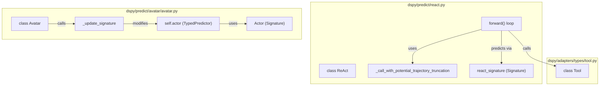
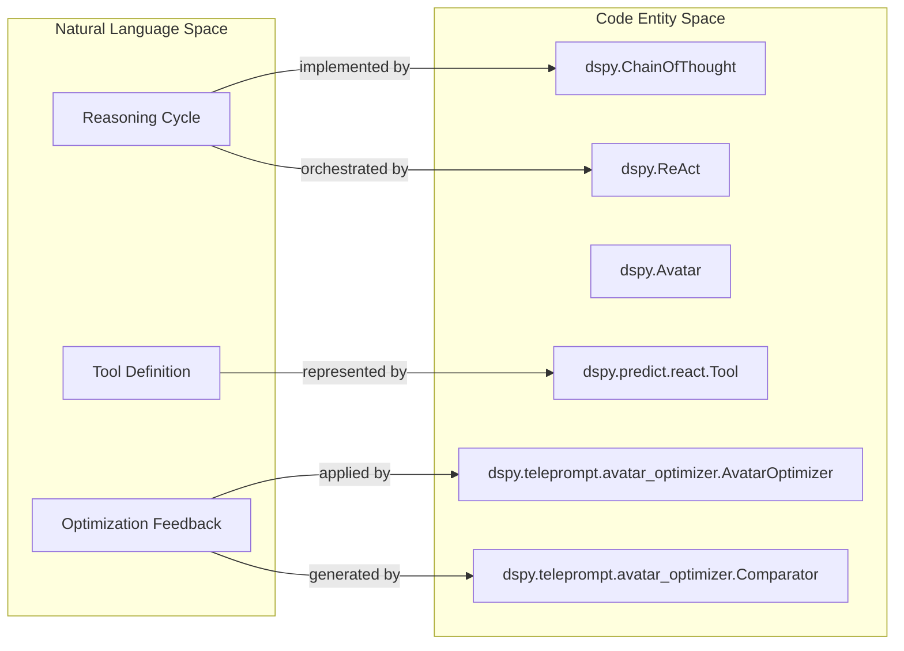

## Purpose and Scope

This page documents DSPy's module composition patterns for building complex programs from simpler components. It covers the `Parallel`, `BestOfN`, and `Refine` modules that enable concurrent execution, output selection, and iterative refinement. It also details the `ReAct` and `Avatar` agentic modules, which compose reasoning and tool-use cycles, and the `Retry` mechanism for error handling.

For basic prediction modules like `Predict`, see [3.1 Predict Module](). For reasoning strategies like `ChainOfThought`, see [3.2 Reasoning Strategies](). For tool integration, see [3.3 Tool Integration & Function Calling]().

---

## Composition Architecture

DSPy modules follow a composable architecture where modules can wrap, coordinate, or chain other modules. This design enables both simple and complex composition patterns.

### Module Wrapping and Coordination

DSPy provides two distinct approaches to combining modules:

| Pattern | Description | Examples | Use Case |
|---------|-------------|----------|----------|
| **Wrapping** | One module internally uses another to extend its behavior. | `ChainOfThought` wraps `Predict` [dspy/predict/chain_of_thought.py:3-33]() | Adding reasoning or structure to a single step. |
| **Coordination** | A module manages the execution flow of multiple sub-modules. | `ReAct`, `Parallel`, `BestOfN`, `Avatar` | Multi-step reasoning, tool use, or concurrent exploration. |

**Sources:** [dspy/predict/chain_of_thought.py:3-33](), [dspy/predict/react.py:16-89](), [dspy/predict/avatar/avatar.py:22-54]()

---

## Parallel Execution

The `Parallel` module enables concurrent execution of modules. It is exposed in the `dspy.predict` namespace [dspy/predict/__init__.py:7](). While basic sequential execution is the default, `Parallel` allows for batching or exploring multiple paths simultaneously.

**Sources:** [dspy/predict/parallel.py:1-75](), [dspy/predict/__init__.py:7-28]()

---

## Agentic Composition: ReAct and Avatar

Agentic modules compose reasoning steps with external tool execution in a loop.

### ReAct (Reasoning and Acting)
`ReAct` implements an iterative loop where the model selects a tool, receives an observation, and updates its trajectory. It is generalized to work over any signature [dspy/predict/react.py:16-23](). It uses two internal modules:
- `self.react`: A `dspy.Predict` module using a specialized `react_signature` to decide the next action, thought, and tool arguments [dspy/predict/react.py:87]().
- `self.extract`: A `dspy.ChainOfThought` module for final output extraction from the accumulated trajectory [dspy/predict/react.py:88]().

The loop runs for a maximum of `max_iters` (default 20) [dspy/predict/react.py:17-42](). It handles tool execution errors by appending the exception to the trajectory [dspy/predict/react.py:111-112]().

### Avatar
`Avatar` is a dynamic agentic module that uses `TypedPredictor` and signature modification to handle multi-turn tool use. Unlike `ReAct` which uses a fixed trajectory field, `Avatar` updates its signature at each step to include specific `action_{idx}` and `result_{idx}` fields [dspy/predict/avatar/avatar.py:68-100]().

### Code Entity Space: Agentic Flow

**Diagram: ReAct and Avatar Implementation Entities**

**Sources:** [dspy/predict/react.py:16-118](), [dspy/predict/avatar/avatar.py:22-107](), [dspy/predict/avatar/avatar.py:125-153](), [dspy/predict/avatar/signatures.py:5-24]()

---

## Error Handling: The Retry Mechanism

The `Retry` module provides a way to handle validation failures by passing errors back to the model for correction. It is designed to wrap an existing module and modify its signature to accept feedback.

1. **Signature Expansion**: It creates a `new_signature` by adding `past_[field]` input fields for every output field in the original signature, plus a `feedback` field [dspy/predict/retry.py:16-32]().
2. **Backtracking Integration**: In the `__call__` method, it checks `dspy.settings.backtrack_to` to determine if it should trigger the retry logic using `past_outputs` and feedback instructions [dspy/predict/retry.py:52-74]().

**Sources:** [dspy/predict/retry.py:8-50](), [dspy/predict/retry.py:52-74]()

---

## Optimization of Composed Modules

Composed programs can be optimized using specialized teleprompters. `AvatarOptimizer` is a prime example, designed to improve the performance of `Avatar` agents.

### Avatar Optimization Logic
1. **Evaluation**: Runs the agent on a training set and scores results using a provided `metric` [dspy/teleprompt/avatar_optimizer.py:101-120]().
2. **Comparison**: Uses a `Comparator` signature to contrast patterns in successful (`pos_input_with_metrics`) vs. failed (`neg_input_with_metrics`) inputs [dspy/teleprompt/avatar_optimizer.py:22-49]().
3. **Refinement**: Incorporates feedback into a `FeedbackBasedInstruction` signature to generate a `new_instruction` for the agent [dspy/teleprompt/avatar_optimizer.py:52-73]().

### Natural Language to Code Entity Mapping

**Diagram: Mapping Agentic Concepts to DSPy Classes**

**Sources:** [dspy/teleprompt/avatar_optimizer.py:22-100](), [dspy/predict/react.py:10-16](), [dspy/predict/avatar/avatar.py:22-38]()

---

## Summary of Composition Modules

| Module | Implementation Class | Core Logic | File Reference |
|--------|----------------------|------------|----------------|
| **Parallel** | `dspy.Parallel` | Concurrent execution of multiple module calls | [dspy/predict/parallel.py:9]() |
| **ReAct** | `dspy.ReAct` | Iterative Thought/Action/Observation loop with trajectory | [dspy/predict/react.py:16]() |
| **Avatar** | `dspy.Avatar` | Dynamic signature modification for multi-turn agents | [dspy/predict/avatar/avatar.py:22]() |
| **BestOfN** | `dspy.BestOfN` | Generates multiple candidates and selects the best | [dspy/predict/best_of_n.py:1]() |
| **Refine** | `dspy.Refine` | Iteratively improves an initial output | [dspy/predict/refine.py:11]() |
| **MultiChain**| `dspy.MultiChainComparison` | Compares multiple reasoning attempts to find the best rationale | [dspy/predict/multi_chain_comparison.py:7]() |

**Sources:** [dspy/predict/__init__.py:1-28](), [dspy/predict/react.py:16](), [dspy/predict/avatar/avatar.py:22](), [dspy/predict/multi_chain_comparison.py:7-33]()