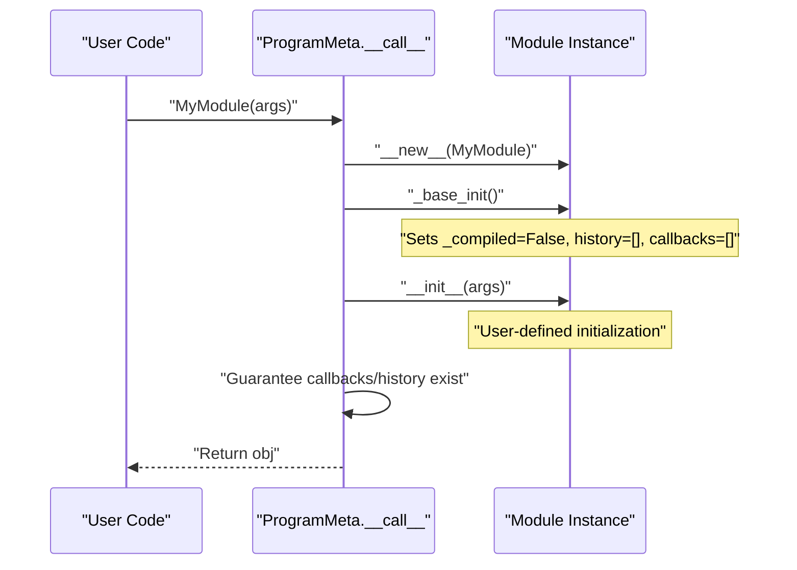
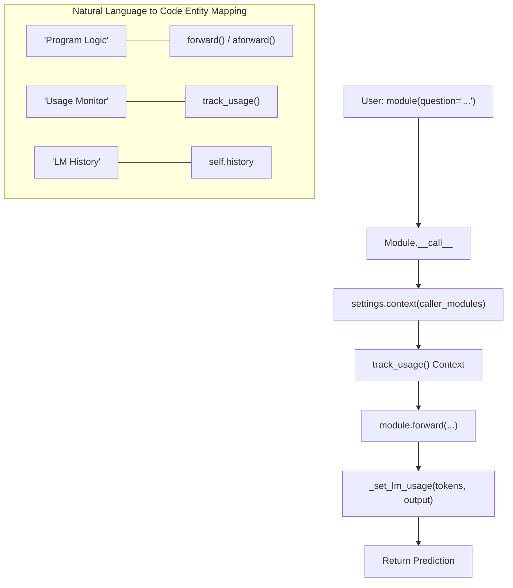
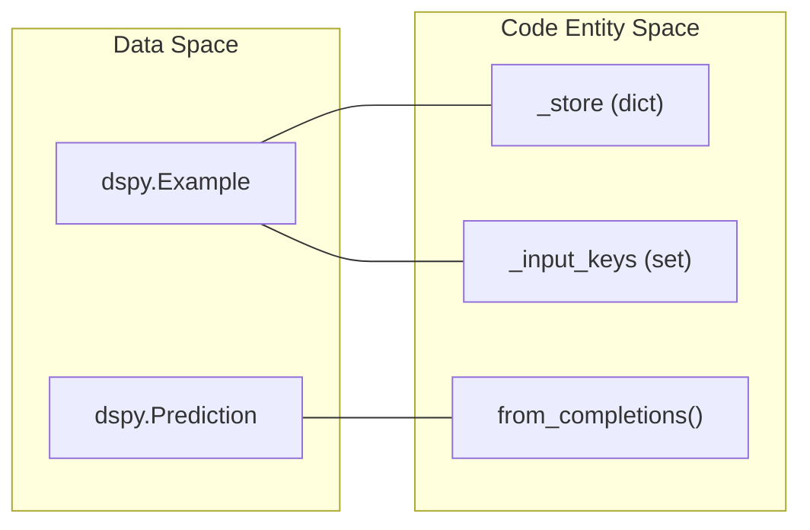

## Purpose and Scope

This document describes DSPy's module system, which provides the foundational abstractions for building composable, optimizable programs. The module system implements a **define-by-run** paradigm where programs are constructed by composing reusable modules that can be systematically optimized.

This page covers the `dspy.Module` base class, the initialization lifecycle managed by `ProgramMeta`, the execution flow (forward/aforward), and patterns for module composition and state serialization.

---

## Core Abstractions

### Module Base Class

The `dspy.Module` class is the fundamental building block of DSPy programs. All components that perform computation—whether simple predictors or complex multi-stage pipelines—inherit from `Module`. It inherits from `BaseModule` to provide parameter traversal and state management utilities. [dspy/primitives/module.py:40-41]().

**Key Responsibilities:**
- **Define-by-run**: Define the computation graph through standard Python code in `__init__` and `forward`. [dspy/primitives/module.py:47-48]().
- **Execution**: Provide `forward()` and `aforward()` methods for synchronous and asynchronous logic. [dspy/primitives/module.py:93-130]().
- **Introspection**: Enable discovery of sub-components via `named_predictors()` and `named_sub_modules()`. [dspy/primitives/module.py:131-158](), [dspy/primitives/base_module.py:69-75]().
- **Composition**: Support nesting of modules (e.g., a RAG module containing a `Predict` module). [tests/primitives/test_module.py:53-57]().

**Core Methods:**

| Method | Purpose | Source |
|--------|---------|--------|
| `forward(*args, **kwargs)` | Defines the synchronous program logic. | [dspy/primitives/module.py:47-48]() |
| `aforward(*args, **kwargs)` | Defines the asynchronous program logic. | [dspy/primitives/module.py:123]() |
| `__call__(*args, **kwargs)` | Entry point; handles usage tracking and context. | [dspy/primitives/module.py:94-110]() |
| `acall(*args, **kwargs)` | Async entry point; handles usage tracking and context. | [dspy/primitives/module.py:113-129]() |
| `named_predictors()` | Returns all `dspy.Predict` instances in the module tree. | [dspy/primitives/module.py:131-158]() |
| `save(path, ...)` | Saves state or the whole program (via cloudpickle). | [dspy/primitives/base_module.py:168-181]() |

Sources: [dspy/primitives/module.py:40-158](), [dspy/primitives/base_module.py:19-106](), [tests/primitives/test_module.py:8-16]()

### Lifecycle & ProgramMeta

DSPy uses a metaclass, `ProgramMeta`, to ensure that every `dspy.Module` instance is properly initialized, even if a user forgets to call `super().__init__()`. [dspy/primitives/module.py:18-19]().


**Diagram: Module Initialization Lifecycle**

`ProgramMeta` intercepts the class call to invoke `_base_init` before the user's `__init__`. [dspy/primitives/module.py:21-29](). This ensures critical attributes like `history` (for LM call tracking) and `callbacks` (for instrumentation) are always present. [dspy/primitives/module.py:31-37]().

Sources: [dspy/primitives/module.py:18-39]()

---

## Execution Flow

The `__call__` method wraps the user's `forward` implementation. It manages the execution context, including tracking which modules are currently active in the stack (`caller_modules`) and recording token usage. [dspy/primitives/module.py:94-110]().


**Diagram: Module Execution and Context Management**

If `settings.track_usage` is enabled, the module wraps the `forward` call in a `track_usage` context manager to aggregate token counts from all underlying LM calls. [dspy/primitives/module.py:102-108]().

Sources: [dspy/primitives/module.py:94-129](), [dspy/primitives/base_module.py:23-67]()

---

## Module Composition and Introspection

Modules are designed to be nested. A top-level program typically contains several sub-modules, which may in turn contain `dspy.Predict` instances (the "parameters" of the program). [tests/primitives/test_module.py:53-57]().

### Parameter Traversal

The `named_parameters()` method (and its wrapper `named_predictors()`) performs a recursive search through the module's `__dict__`. [dspy/primitives/base_module.py:23-67]().

- It traverses lists, tuples, and dictionaries to find nested modules. [dspy/primitives/base_module.py:59-65]().
- It avoids infinite recursion by maintaining a `visited` set of object IDs. [dspy/primitives/base_module.py:31-37]().
- **Frozen Modules**: If a sub-module has `_compiled=True`, the traversal stops at that module, effectively "freezing" its internal parameters from further optimization. [dspy/primitives/base_module.py:42-44]().

### Example Composition (Sequential)

```python
class HopModule(dspy.Module):
    def __init__(self):
        super().__init__()
        self.predict1 = dspy.Predict("question -> query")
        self.predict2 = dspy.Predict("query -> answer")

    def forward(self, question):
        query = self.predict1(question=question).query
        return self.predict2(query=query)
```
[tests/primitives/test_module.py:8-16]().

In this example, `named_predictors()` would return both `predict1` and `predict2`. If `HopModule` were nested inside another module, they would be identified by paths like `hop.predict1`. [tests/primitives/test_module.py:53-64]().

Sources: [dspy/primitives/base_module.py:23-106](), [tests/primitives/test_module.py:8-64]()

---

## State Management and Serialization

DSPy modules support two primary modes of serialization: **State-only** (JSON/Pickle) and **Whole Program** (Cloudpickle). [docs/docs/tutorials/saving/index.md:3-7]().

### Serialization Modes

| Mode | Implementation | Content | Security |
|------|----------------|---------|----------|
| **State-only (JSON)** | `dump_state()` | Parameters (demos, signatures, instructions) | Safe |
| **State-only (Pickle)** | `save(..., allow_pickle=True)` | Parameters (handles non-serializable types) | **Unsafe** [docs/docs/tutorials/saving/index.md:41-42]() |
| **Whole Program** | `cloudpickle` | Architecture (code) + State (parameters) | **Unsafe** [docs/docs/tutorials/saving/index.md:79-80]() |

Sources: [docs/docs/tutorials/saving/index.md:8-106](), [dspy/primitives/base_module.py:168-181]()

### Deep Copying

The `deepcopy()` implementation in `BaseModule` is specialized. It attempts a standard `copy.deepcopy(self)`, but if it encounters non-copyable objects (like thread locks), it falls back to creating a new instance via `__new__` and copying attributes individually. [dspy/primitives/base_module.py:110-145](). This is critical for modules that hold system resources. [tests/primitives/test_base_module.py:26-40]().

### Whole Program Saving (dspy >= 2.6.0)

Using `save(path, save_program=True)` stores the entire module structure using `cloudpickle`. [dspy/primitives/base_module.py:174-176]().
- It saves a `metadata.json` containing dependency versions (Python, DSPy, cloudpickle). [dspy/utils/saving.py:15-24]().
- Upon loading via `dspy.load(path)`, it validates these versions and issues warnings if a mismatch is detected. [dspy/utils/saving.py:46-58]().
- Users can register additional modules to be serialized by value using `modules_to_serialize`. [dspy/primitives/base_module.py:177-181]().

Sources: [dspy/primitives/base_module.py:110-181](), [dspy/utils/saving.py:27-62](), [docs/docs/tutorials/saving/index.md:77-120]()

---

## Data Primitives: Example and Prediction

Modules interact with two primary data containers: `dspy.Example` and `dspy.Prediction`.

- **Example**: A flexible dict-like container used for training data. It supports tagging fields as inputs via `with_inputs()`. [dspy/primitives/example.py:4-19]().
- **Prediction**: The return type of module execution. It inherits from `Example` and is often created from LM completions. [dspy/primitives/prediction.py:4-16]().


**Diagram: Data Primitives and Code Entities**

Sources: [dspy/primitives/example.py:4-109](), [dspy/primitives/prediction.py:4-39](), [dspy/predict/aggregation.py:54]()