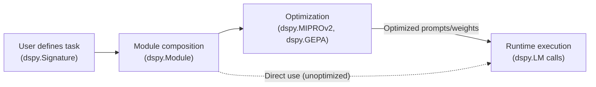
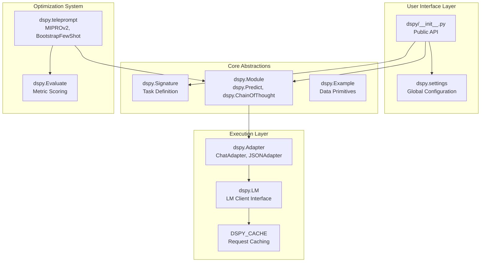
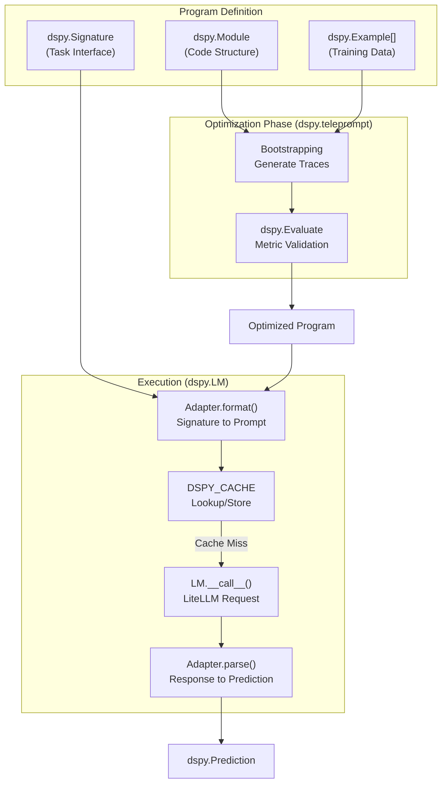
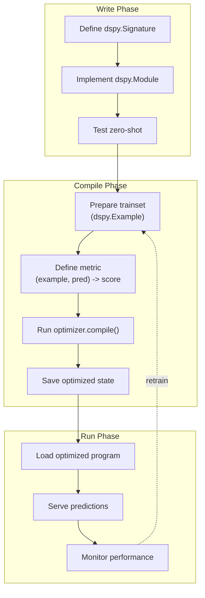
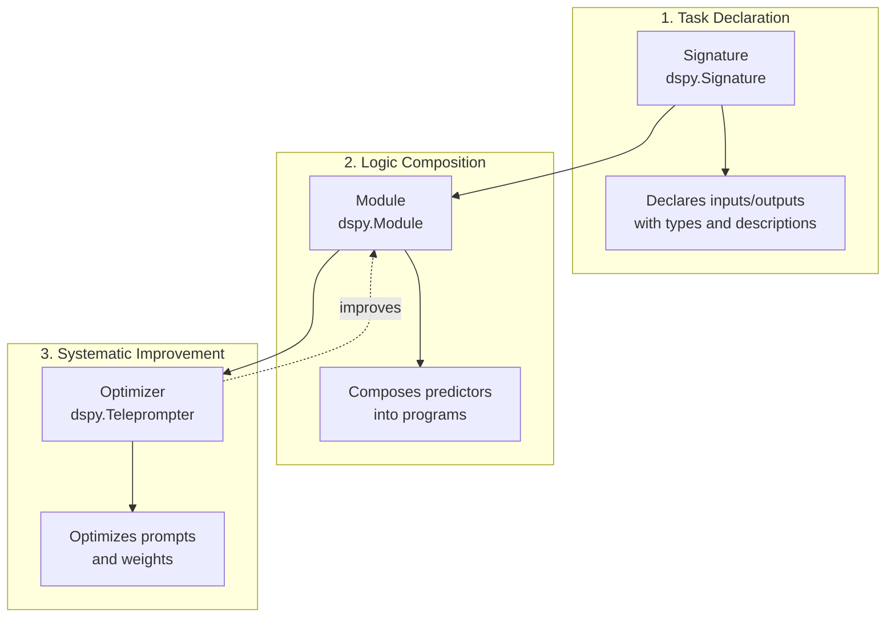
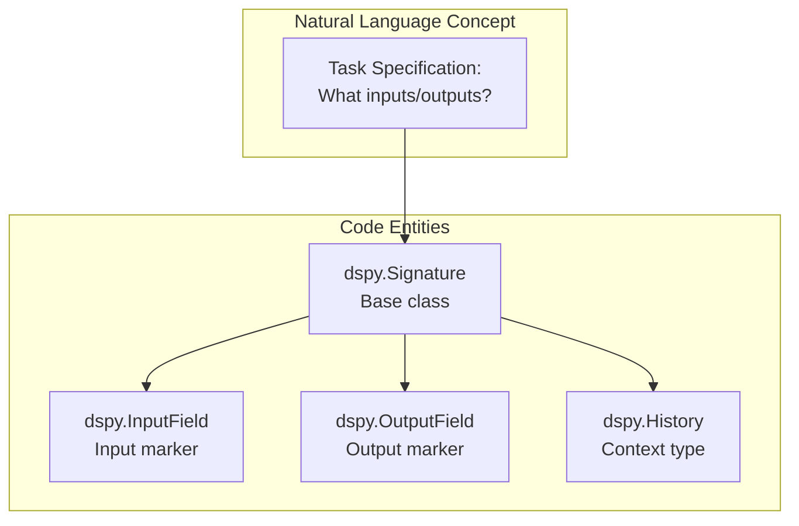
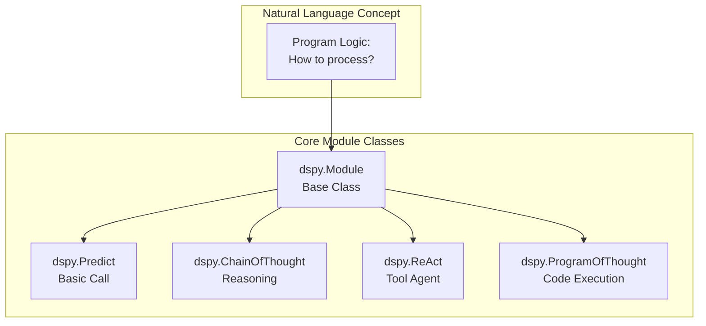
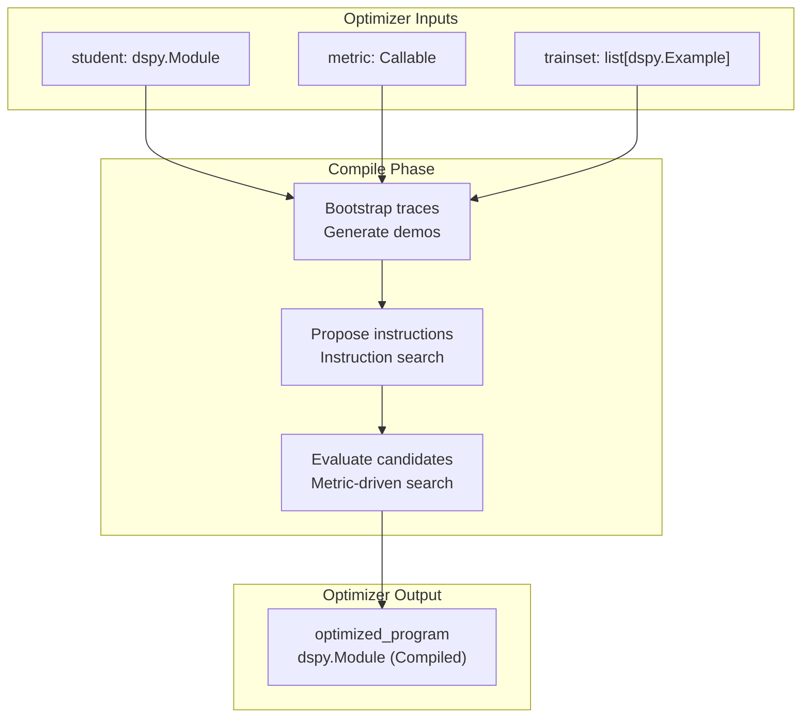

## Purpose and Scope

This page provides a high-level introduction to DSPy, a framework for programming—rather than prompting—language models. It covers the core philosophy, architectural layers, and high-level capabilities of the system. For detailed information on specific topics, see:

- Core concepts and programming model: [Introduction & Core Concepts](#1.1)
- Practical examples and patterns: [Use Cases & Applications](#1.2)
- Getting started guide: [Installation & Quick Start](#1.3)
- Deep dive into architecture: [Core Architecture](#2)
- Building programs: [Building DSPy Programs](#3)
- Optimization details: [Program Optimization](#4)

**Sources:** [README.md:1-89](), [docs/docs/index.md:1-140]()

---

## What is DSPy?

DSPy (Declarative Self-improving Python) is a framework that enables **programming language models through compositional code** rather than manual prompt engineering [README.md:16-18](). The core philosophy distinguishes it from traditional prompting approaches:

| Traditional Prompting | DSPy Programming |
|----------------------|-----------------|
| Hand-crafted string templates | Declarative `Signature` definitions |
| Brittle, model-specific prompts | Portable, model-agnostic modules |
| Manual few-shot example curation | Automatic example synthesis via optimizers |
| Trial-and-error iteration | Metric-driven compilation |

The framework is named for its declarative nature—users specify *what* the LM should do (via signatures) rather than *how* to prompt it [docs/docs/index.md:135-141](). The "self-improving" aspect refers to DSPy's **optimizers** (formerly called "teleprompters"), which automatically tune prompts and weights to maximize user-defined metrics [README.md:16-18]().

Title: DSPy Compile-Then-Run Philosophy


**Sources:** [README.md:7-18](), [docs/docs/index.md:11-18](), [dspy/teleprompt/__init__.py]()

---

## System Architecture

DSPy is organized into layers responsible for distinct concerns, from high-level user APIs to low-level LM interaction.

Title: Architectural Layers of DSPy


### Layer Descriptions

| Layer | Primary Components | Responsibility |
|-------|-------------------|----------------|
| **User Interface** | `dspy/__init__.py`, `dspy.settings` | Public API aggregation and global configuration management [dspy/__init__.py:1-35](), [dspy/__init__.py:25-29](). |
| **Core Abstractions** | `Signature`, `Module`, `Example` | Programming model: task definitions and modular composition [dspy/signatures/__init__.py](), [dspy/primitives/__init__.py](). |
| **Execution** | `Adapter`, `LM`, `DSPY_CACHE` | LM interaction, prompt formatting via adapters, and automatic request caching [dspy/adapters/__init__.py:1-23](), [dspy/__init__.py:20-32](). |
| **Optimization** | `Evaluate`, `teleprompt` | Automatic prompt and weight tuning based on metrics [dspy/evaluate/__init__.py](), [dspy/teleprompt/__init__.py](). |

**Sources:** [dspy/__init__.py:1-35](), [dspy/adapters/__init__.py:1-23](), [dspy/primitives/__init__.py]()

---

## Core Programming Model

DSPy programs are built from three fundamental abstractions:

### Signatures: Task Specification
A `Signature` defines the input/output schema for a task. It decouples the *intent* of the task from the *implementation* of the prompt [docs/docs/index.md:135-141]().

### Modules: Composable Components
`dspy.Module` is the base class for all DSPy programs [dspy/__init__.py:2](). The framework provides built-in modules for different reasoning strategies:
- `dspy.Predict`: Basic signature-to-output mapping [dspy/__init__.py:1]().
- `dspy.ChainOfThought`: Adds a "reasoning" step before the final output [dspy/adapters/types/reasoning.py]().
- `dspy.ReAct`: Implements agentic loops with tool use [dspy/adapters/types/tool.py]().

### Optimizers: Automatic Improvement
Optimizers (formerly Teleprompters) tune the parameters of a DSPy program (prompts or weights) to maximize a metric [dspy/teleprompt/__init__.py]().
- **Prompt Optimizers**: `MIPROv2`, `GEPA`, `BootstrapFewShot` [dspy/__init__.py:5]().
- **Weight Optimizers**: `BootstrapFinetune`.
- **Meta-Optimizers**: `BetterTogether` sequences prompt and weight optimization.

**Sources:** [docs/docs/index.md:135-141](), [dspy/__init__.py:1-16](), [dspy/adapters/types/__init__.py:1-10]()

---

## Data Flow Through the System

The following diagram illustrates how data flows from user code through the compilation (optimization) phase to runtime execution.

Title: Data Flow from Definition to Execution


**Sources:** [dspy/adapters/base.py](), [dspy/clients/__init__.py](), [dspy/evaluate/__init__.py]()

---

## High-Level Capabilities

| Capability | Description |
|------------|-------------|
| **Multi-Model Support** | Unified interface for OpenAI, Anthropic, Gemini, and local models (Ollama/SGLang) via LiteLLM [docs/docs/index.md:29-123](). |
| **Reasoning Strategies** | Native support for Chain-of-Thought, Program-of-Thought, and ReAct agents [dspy/adapters/types/reasoning.py](). |
| **Automatic Optimization** | Systematic tuning of instructions and few-shot demonstrations without manual prompt editing [dspy/teleprompt/__init__.py](). |
| **Typed Interaction** | Support for complex types including `Image`, `Audio`, `History`, and `ToolCalls` [dspy/adapters/__init__.py:5-9](). |
| **Async Support** | Native asynchronous execution support via `asyncify` and `aforward` for high-throughput environments [dspy/__init__.py:12-13](), [docs/docs/production/index.md:35-42](). |

**Sources:** [docs/docs/index.md:23-124](), [dspy/adapters/__init__.py:1-23](), [dspy/__init__.py:1-16]()

---

## Getting Started

To begin using DSPy, proceed to:

1. **[Installation & Quick Start](#1.3)** — Set up the library via `pip install dspy` and configure your first LM [README.md:27-32]().
2. **[Introduction & Core Concepts](#1.1)** — Learn about Signatures, Modules, and the declarative programming model.
3. **[Use Cases & Applications](#1.2)** — Explore patterns for RAG, Agents, and classification.
4. **[Program Optimization](#4)** — Understand how to use `MIPROv2`, `GEPA`, and other optimizers to improve your programs.

**Sources:** [README.md:27-38](), [docs/docs/index.md:23-27]()

# Introduction & Core Concepts


This page introduces DSPy's core philosophy and fundamental abstractions. It explains the framework's declarative programming paradigm for language models and presents the three key concepts—Signatures, Modules, and Optimizers—that enable systematic development of AI systems.

---

## Core Philosophy: Programming, Not Prompting

DSPy reframes language model interaction from **brittle prompt engineering** to **systematic program development**. Instead of manually crafting and tweaking prompts, developers write compositional Python code that declares what the system should accomplish. DSPy then automatically generates and optimizes the prompts and model weights needed to achieve high-quality outputs [README.md:16-18]().

### The Compile-Then-Run Model

DSPy introduces a **compilation paradigm** for LM programs, analogous to traditional programming languages:

1.  **Write declarative code:** Define program structure using `dspy.Signature` [docs/docs/learn/programming/signatures.md:18-20]() and `dspy.Module` [docs/docs/learn/programming/modules.md:7-13]().
2.  **Compile with optimizer:** Use algorithms like `dspy.MIPROv2`, `dspy.BootstrapFewShot`, or `dspy.GEPA` to improve the program [docs/docs/learn/index.md:13-14]().
3.  **Deploy optimized artifact:** Run the compiled program in production without re-optimization [docs/docs/tutorials/core_development/index.md:23-25]().

This separates the expensive **pre-inference time compute** (optimization) from efficient **inference time compute** (prediction) [docs/docs/learn/index.md:7-15]().

**Compile-Then-Run Workflow Diagram**



**Sources:** [docs/docs/learn/index.md:7-15](), [docs/docs/tutorials/core_development/index.md:15-16]()

---

## The Three Core Abstractions

DSPy's architecture centers on three complementary abstractions that separate concerns and enable systematic development.



**Sources:** [README.md:16-18](), [docs/mkdocs.yml:15-29](), [docs/docs/learn/programming/overview.md:16-19]()

---

## Abstraction 1: Signatures

A **Signature** is a declarative specification of a task's input and output structure. It defines what fields the LM receives and what it should produce, along with optional descriptions and constraints [docs/docs/learn/programming/overview.md:16-19]().

### Defining Signatures

Signatures can be created in two ways:

**String notation** for simple cases [docs/docs/learn/programming/modules.md:26-26]():
```python
# Format: "input1, input2 -> output1, output2"
signature = dspy.Predict("sentence -> sentiment: bool")
```

**Class notation** for structured definitions [docs/docs/learn/programming/modules.md:142-148]():
```python
class Classify(dspy.Signature):
    """Classify sentiment of a given sentence."""
    
    sentence: str = dspy.InputField()
    sentiment: Literal['positive', 'negative', 'neutral'] = dspy.OutputField()
    confidence: float = dspy.OutputField()
```

### Key Components

| Component | Purpose |
| :--- | :--- |
| `dspy.InputField` | Declares input parameters [docs/docs/learn/programming/modules.md:145-145]() |
| `dspy.OutputField` | Declares expected outputs [docs/docs/learn/programming/modules.md:146-146]() |
| Field Type Hints | Enforce output structure (e.g., `float`, `list[str]`) [docs/docs/learn/programming/modules.md:103-103]() |
| Signature docstring | Overall task instruction to the LM [docs/docs/learn/programming/modules.md:143-143]() |

### Type System

Signatures support rich typing including basic types, collections, and custom DSPy types like `dspy.History` for conversation management [docs/docs/tutorials/conversation_history/index.md:17-20]().

**Signature System Architecture**



**Sources:** [docs/docs/learn/programming/modules.md:140-148](), [docs/docs/tutorials/conversation_history/index.md:7-23]()

---

## Abstraction 2: Modules

A **Module** is a building block for programs that use LMs. Each built-in module abstracts a specific prompting technique (like Chain of Thought) and is generalized to handle any signature [docs/docs/learn/programming/modules.md:7-13]().

### Core Module Types [docs/docs/learn/programming/modules.md:80-90]()

| Module Type | Purpose |
| :--- | :--- |
| `dspy.Predict` | Basic predictor; stores instructions and demonstrations. |
| `dspy.ChainOfThought` | Teaches the LM to think step-by-step before committing to a response. |
| `dspy.ProgramOfThought` | Teaches the LM to output code whose execution dictates the response. |
| `dspy.ReAct` | An agent that can use tools to implement the signature. |
| `dspy.RLM` | Recursive Language Model for exploring large contexts via a sandboxed REPL. |

**Module Hierarchy**



**Sources:** [docs/docs/learn/programming/modules.md:7-15](), [docs/docs/learn/programming/modules.md:80-90]()

---

## Abstraction 3: Optimizers

An **Optimizer** tunes the parameters of a DSPy program—specifically the prompts and/or the LM weights—to maximize a metric [docs/docs/learn/index.md:13-14]().

### Core Optimization Categories [docs/mkdocs.yml:126-141]()

*   **Few-Shot Optimizers:** `BootstrapFewShot` and `BootstrapFewShotWithRandomSearch` automatically synthesize and select the best demonstrations for your prompt.
*   **Instruction Optimizers:** `MIPROv2` and `COPRO` search for the most effective natural language instructions to describe the task.
*   **Reflective Evolution:** `GEPA` uses reflective prompt evolution to iteratively refine program performance [docs/docs/tutorials/index.md:37-42]().
*   **Weight Optimization:** `BootstrapFinetune` distills the logic of a prompt-based program into a fine-tuned model [docs/docs/tutorials/optimize_ai_program/index.md:12-13]().

**Optimizer Compilation Process**



**Sources:** [docs/docs/learn/index.md:7-15](), [docs/mkdocs.yml:28-29](), [docs/docs/tutorials/index.md:7-13]()

---

## Execution & Configuration

DSPy uses global settings and specific model instances to manage program execution.

*   **LM Configuration:** Models are initialized via `dspy.LM` and configured globally using `dspy.configure(lm=...)` [docs/docs/tutorials/conversation_history/index.md:15-15]().
*   **Caching:** DSPy includes a caching system to improve performance and reduce API costs during iterative development [docs/docs/tutorials/core_development/index.md:18-19]().
*   **History Management:** While modules don't track state automatically, the `dspy.History` utility allows managing multi-turn conversation context within signatures [docs/docs/tutorials/conversation_history/index.md:3-8]().

**Sources:** [docs/docs/tutorials/conversation_history/index.md:3-33](), [docs/docs/tutorials/core_development/index.md:18-19]()