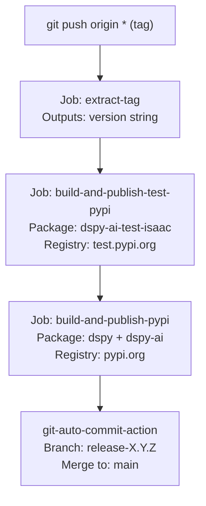
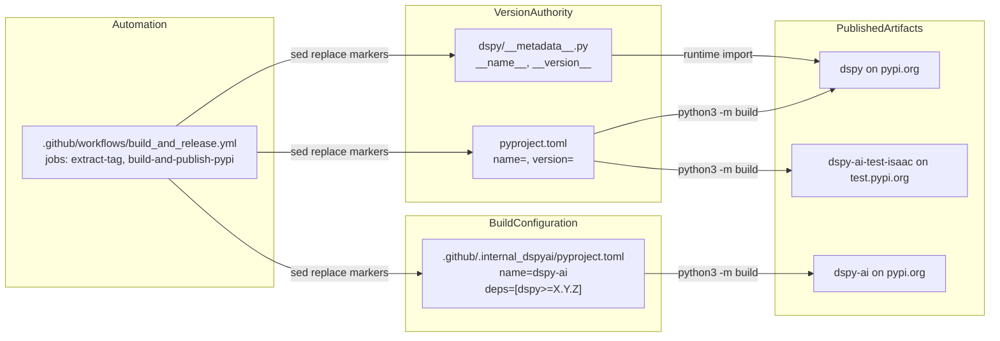
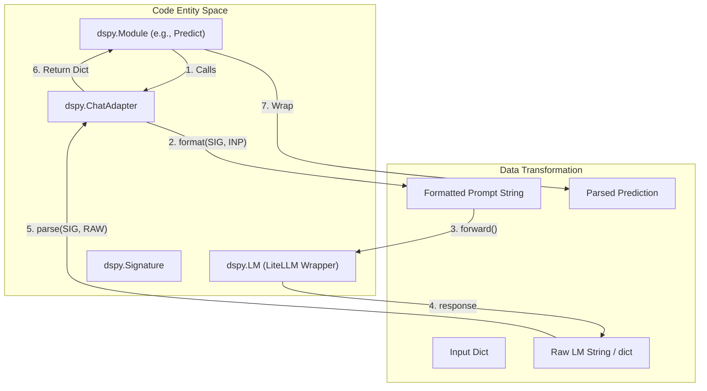
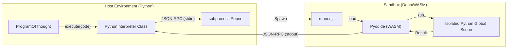

This page covers DSPy's package metadata structure, version management, and the automated release pipeline that publishes to PyPI. It focuses on the artifact-production side of the development workflow — how a git tag becomes a published package.

For information about the broader CI/CD pipeline (linting, unit tests, integration tests), see [Build System & CI/CD](7.1). For the test suite itself, see [Testing Framework](7.2).

---

## Package Metadata

DSPy stores canonical package metadata in two locations that are kept in sync during the release process:

| Field | `dspy/__metadata__.py` | `pyproject.toml` |
|---|---|---|
| Package name | `__name__` | `name=` |
| Version | `__version__` | `version=` |
| Description | `__description__` | `description` |
| Homepage URL | `__url__` | `homepage` |
| Author | `__author__` | `authors[0].name` |
| Author email | `__author_email__` | `authors[0].email` |

**`dspy/__metadata__.py`** [dspy/__metadata__.py:1-8]() is the authoritative runtime source. It is imported by `dspy/__init__.py` and exposes these fields directly on the `dspy` module, allowing code like `dspy.__version__` to work.

**`pyproject.toml`** [pyproject.toml:5-22]() contains the same values for the build system. The two files are only guaranteed to match after a release workflow run; during development they may be updated independently.

### Metadata Validation

A dedicated test validates that the runtime metadata is correct and well-formed. This test is located at `tests/metadata/test_metadata.py`. This test is explicitly invoked as a pre-publish validation step in the release workflow [.github/workflows/build_and_release.yml:62]().

Sources: [dspy/__metadata__.py:1-8](), [pyproject.toml:5-22](), [.github/workflows/build_and_release.yml:62]()

---

## Published Packages

DSPy publishes under three distinct package names:

| Package Name | Registry | Purpose |
|---|---|---|
| `dspy` | PyPI | Main installable package [pyproject.toml:9]() |
| `dspy-ai` | PyPI | Thin compatibility shim; depends on `dspy>=X.Y.Z` [.github/.internal_dspyai/pyproject.toml:3-14]() |
| `dspy-ai-test-isaac` | TestPyPI | Pre-release validation; not for production use [.github/workflows/build_and_release.yml:41]() |

The `dspy-ai` package exists for users who originally installed DSPy via `pip install dspy-ai`. It is defined in a separate `pyproject.toml` at [.github/.internal_dspyai/pyproject.toml:1-23]() and has a single runtime dependency: `dspy>=<current_version>` [.github/.internal_dspyai/pyproject.toml:14]().

Sources: [pyproject.toml:9](), [.github/workflows/build_and_release.yml:41](), [.github/.internal_dspyai/pyproject.toml:3-14]()

---

## Version & Name Marker System

Both `pyproject.toml` and `dspy/__metadata__.py` use specially formatted comment markers that allow the release workflow to substitute the package name and version with `sed` commands without parsing the files as TOML or Python:

**Marker comments in `pyproject.toml`** [pyproject.toml:8-11]():
```toml
#replace_package_name_marker
name="dspy"
#replace_package_version_marker
version="3.2.0"
```

**Marker comments in `dspy/__metadata__.py`** [dspy/__metadata__.py:1-4]():
```python
#replace_package_name_marker
__name__="dspy"
#replace_package_version_marker
__version__="3.2.0"
```

The workflow uses `sed -i '/#replace_package_version_marker/{n;s/.../...}/` to replace the line immediately following each marker [.github/workflows/build_and_release.yml:47](). The `pyproject.toml` documentation comment [pyproject.toml:6-7]() explicitly warns: *"Do not add spaces around the '=' sign for any of the fields preceded by a marker comment as it affects the publish workflow."*

**Diagram: Marker-based substitution flow**

```mermaid
flowchart LR
  subgraph "SourceFiles"
    PM["pyproject.toml\n#replace_package_name_marker\nname=\"dspy\"\n#replace_package_version_marker\nversion=\"3.2.0\""]
    MD["dspy/__metadata__.py\n#replace_package_name_marker\n__name__=\"dspy\"\n#replace_package_version_marker\n__version__=\"3.2.0\""]
  end

  subgraph "WorkflowSedCommands"
    SED1["sed: replace name field"]
    SED2["sed: replace version field"]
  end

  subgraph "BuildTargets"
    T1["dspy-ai-test-isaac (TestPyPI)"]
    T2["dspy (PyPI)"]
    T3["dspy-ai (PyPI)"]
  end

  PM --> SED1
  PM --> SED2
  MD --> SED2
  SED1 --> T1
  SED1 --> T2
  SED1 --> T3
  SED2 --> T1
  SED2 --> T2
  SED2 --> T3
```

Sources: [pyproject.toml:6-11](), [dspy/__metadata__.py:1-4](), [.github/workflows/build_and_release.yml:47-49]()

---

## Release Workflow

The release is fully automated via `.github/workflows/build_and_release.yml`. It is triggered by pushing any git tag to the repository [.github/workflows/build_and_release.yml:3-6]().

### Jobs Overview

**Diagram: Release workflow job sequence**



Sources: [.github/workflows/build_and_release.yml:1-153]()

---

### Job: `extract-tag`

[.github/workflows/build_and_release.yml:8-16]()

Extracts the version string from `$GITHUB_REF` using:
```bash
run: echo "tag=$(echo $GITHUB_REF | cut -d / -f 3)" >> "$GITHUB_OUTPUT"
```

The extracted version is passed as `needs.extract-tag.outputs.version` to subsequent jobs [.github/workflows/build_and_release.yml:19]().

---

### Job: `build-and-publish-test-pypi`

[.github/workflows/build_and_release.yml:18-69]()

This job handles TestPyPI publication and pre-publish validation:

1. **Version calculation** — runs `.github/workflows/build_utils/test_version.py` to determine the correct version for TestPyPI [.github/workflows/build_and_release.yml:43]().
2. **Substitution** — replaces `name=` with `dspy-ai-test-isaac` and updates `version=` in `pyproject.toml` [.github/workflows/build_and_release.yml:47-49]().
3. **Build** — runs `python3 -m build` to produce the distribution [.github/workflows/build_and_release.yml:51]().
4. **Validation** — uses `twine check --strict` [.github/workflows/build_and_release.yml:53]() and runs tests from `tests/metadata/test_metadata.py` and `tests/predict` in a fresh virtual environment [.github/workflows/build_and_release.yml:56-62]().
5. **Publish** — uses `pypa/gh-action-pypi-publish` with OIDC trusted publishing [.github/workflows/build_and_release.yml:65-68]().

---

### Job: `build-and-publish-pypi`

[.github/workflows/build_and_release.yml:72-153]()

This job runs only on the `stanfordnlp` organization repository [.github/workflows/build_and_release.yml:75]().

**Publishing `dspy`:**
1. Substitutes the release tag version into `pyproject.toml` [.github/workflows/build_and_release.yml:95]() and `dspy/__metadata__.py` [.github/workflows/build_and_release.yml:97]().
2. Updates `name="dspy"` in both metadata files [.github/workflows/build_and_release.yml:100-102]().
3. Builds the wheel and runs local validation tests [.github/workflows/build_and_release.yml:104-116]().
4. Publishes to PyPI [.github/workflows/build_and_release.yml:118-121]().

**Publishing `dspy-ai`:**
1. Updates `name="dspy-ai"` and the version in `.github/.internal_dspyai/pyproject.toml` [.github/workflows/build_and_release.yml:124-126]().
2. Updates the `dspy>=<version>` dependency pin [.github/workflows/build_and_release.yml:129]().
3. Builds from the `.github/.internal_dspyai/` directory and publishes [.github/workflows/build_and_release.yml:131-138]().

Sources: [.github/workflows/build_and_release.yml:72-138]()

---

## `pyproject.toml` Configuration

The main `pyproject.toml` configures the build system, dependencies, and tooling.

### Build System
[pyproject.toml:1-3]()
```toml
[build-system]
requires = ["setuptools>=77.0.1"]
build-backend = "setuptools.build_meta"
```

### Core Dependencies
[pyproject.toml:23-42]()
Key dependencies include:
- `litellm>=1.64.0` [pyproject.toml:30]()
- `pydantic>=2.0` [pyproject.toml:29]()
- `gepa[dspy]==0.1.1` [pyproject.toml:40]()
- `asyncer==0.0.8` [pyproject.toml:35]()

### Optional Dependency Groups
[pyproject.toml:44-68]()
- `mcp`: `mcp; python_version >= '3.10'` [pyproject.toml:47]()
- `dev`: Includes `pytest`, `ruff`, `pre-commit`, and `build` [pyproject.toml:50-61]().
- `test_extras`: Includes `datasets`, `pandas`, and `optuna` [pyproject.toml:62-68]().

Sources: [pyproject.toml:1-68]()

---

## Code Entity Map

**Diagram: Files and their roles in the release pipeline**



Sources: [dspy/__metadata__.py:1-8](), [pyproject.toml:1-22](), [.github/workflows/build_and_release.yml:1-153](), [.github/.internal_dspyai/pyproject.toml:1-23]()

# Glossary


This glossary defines the core technical terms, implementation patterns, and domain-specific jargon used within the DSPy codebase. It is intended to help onboarding engineers navigate the transition from "natural language prompting" to "declarative AI programming."

## Core Concepts & Data Primitives

### Signature
A declarative specification of the input/output behavior for an LM call. Unlike a prompt, a signature defines *what* the task is, not *how* to prompt for it.
*   **Implementation**: Defined as a class inheriting from `dspy.Signature` `[dspy/signatures/signature.py:1-7]()`. It uses `InputField` and `OutputField` to define the schema `[dspy/signatures/field.py:1-10]()`.
*   **Key Logic**: The `SignatureMeta` metaclass handles the parsing of short-hand string signatures (e.g., `"question -> answer"`) into class representations via `make_signature` `[dspy/signatures/signature.py:41-51]()`.
*   **Code Pointers**: `dspy/signatures/signature.py`, `dspy/signatures/field.py`.

### Module
A functional unit that processes inputs into outputs based on a `Signature`. Modules are the building blocks of DSPy programs and can contain internal state (like prompts or learned weights).
*   **Implementation**: Inherits from `dspy.Module`.
*   **Code Pointers**: `dspy/predict/predict.py` (for the base `Predict` module).

### Example
The fundamental data unit in DSPy, used for training, evaluation, and few-shot demonstrations.
*   **Implementation**: `dspy.Example`. It distinguishes between `inputs` and `labels`.
*   **Code Pointers**: `dspy/primitives/example.py`.

**Sources**: `[dspy/signatures/signature.py:1-51]()`, `[dspy/signatures/field.py:1-10]()`, `[dspy/predict/predict.py:1-20]()`.

---

## The Adapter System

The **Adapter** acts as the translation layer between the high-level DSPy `Module` and the raw `BaseLM`. It is responsible for formatting the `Signature` into a prompt and parsing the LM's string response back into structured data.

### ChatAdapter
The default adapter for most modern chat-based LMs. It structures interactions using section headers like `[[ ## field_name ## ]]` to delineate input and output fields `[dspy/adapters/chat_adapter.py:28-38]()`.
*   **Implementation**: `dspy.ChatAdapter`.
*   **Code Pointers**: `dspy/adapters/chat_adapter.py`.

### JSONAdapter
An adapter that enforces JSON formatting, leveraging "Structured Outputs" or "JSON Mode" from providers like OpenAI. It automatically falls back to standard JSON mode if structured output schemas fail `[dspy/adapters/json_adapter.py:70-79]()`.
*   **Implementation**: `dspy.JSONAdapter`. It uses `json_repair` to handle malformed LM outputs `[dspy/adapters/json_adapter.py:149-164]()`.
*   **Code Pointers**: `dspy/adapters/json_adapter.py`.

### Adapter Flow Diagram
This diagram illustrates how a DSPy Module uses an Adapter to communicate with an LM.

**Bridge: Module to LM via Adapter**

**Sources**: `[dspy/adapters/base.py:21-36]()`, `[dspy/adapters/chat_adapter.py:28-38]()`, `[dspy/adapters/json_adapter.py:40-43]()`, `[dspy/clients/lm.py:159-170]()`.

---

## Optimization (Teleprompters)

**Teleprompters** (now more commonly called **Optimizers**) are algorithms that take a DSPy program and a `trainset` to produce an optimized version of the program by updating instructions or demonstrations.

### Bootstrapping
The process of using a "Teacher" model to generate synthetic "traces" (intermediate steps) for a program. If the trace leads to a correct output (based on a `metric`), it is saved as a demonstration for the "Student" model `[dspy/teleprompt/bootstrap.py:47-52]()`.
*   **Code Pointers**: `dspy/teleprompt/bootstrap.py`.
*   **Key Function**: `BootstrapFewShot._bootstrap()` `[dspy/teleprompt/bootstrap.py:148-160]()`.

### MIPROv2 (Multi-stage Instruction Proposal and Response Optimization)
A sophisticated optimizer that proposes multiple instruction candidates and few-shot sets, then uses Bayesian Optimization (via `optuna`) to find the best combination `[dspy/teleprompt/mipro_optimizer_v2.py:61-80]()`.
*   **Implementation**: `dspy.MIPROv2`.
*   **Components**: Uses `GroundedProposer` to generate instructions based on data and code `[dspy/teleprompt/mipro_optimizer_v2.py:10-11]()`.
*   **Code Pointers**: `dspy/teleprompt/mipro_optimizer_v2.py`.

### GEPA (Reflective Prompt Evolution)
An evolutionary optimizer that uses "reflection" to improve instructions. It captures full execution traces and identifies specific points of failure to propose better prompts.
*   **Implementation**: `dspy.GEPA`.
*   **Code Pointers**: `dspy/teleprompt/gepa/gepa.py`.

---

## Execution & Sandboxing

### PythonInterpreter
A secure execution environment for running Python code generated by LMs (e.g., in `ProgramOfThought`).
*   **Implementation**: `dspy.PythonInterpreter`.
*   **Technology**: Uses **Deno** and **Pyodide** (WASM) to sandbox the code, preventing access to the host filesystem or network unless explicitly allowed `[dspy/primitives/python_interpreter.py:75-85]()`.
*   **Communication**: Communicates with the WASM worker via **JSON-RPC 2.0** `[dspy/primitives/python_interpreter.py:31-46]()`.
*   **Code Pointers**: `dspy/primitives/python_interpreter.py`, `dspy/primitives/runner.js`.

**Bridge: Code Execution Architecture**

**Sources**: `[dspy/primitives/python_interpreter.py:75-100]()`, `[dspy/primitives/python_interpreter.py:142-174]()`, `[dspy/predict/program_of_thought.py:1-20]()`.

---

## Evaluation Framework

### Evaluate
A utility class for running a DSPy program over a dataset and computing a score.
*   **Implementation**: `dspy.Evaluate`.
*   **Features**: Supports multi-threading via `ParallelExecutor` and generates detailed `EvaluationResult` objects containing the score and individual (example, prediction, score) tuples `[dspy/evaluate/evaluate.py:48-61]()`.
*   **Code Pointers**: `dspy/evaluate/evaluate.py`.

### Metric
A user-defined function that takes `(gold_example, prediction)` and returns a `float`, `bool`, or a `Prediction` object containing feedback.
*   **Code Pointers**: Referenced in `dspy/evaluate/evaluate.py:75-76]()` and `dspy/teleprompt/mipro_optimizer_v2.py:89-90]()`.

---

## Technical Abbreviations & Jargon

| Term | Definition | Code Pointer |
| :--- | :--- | :--- |
| **LM** | Language Model. The base interface for calling LLMs via LiteLLM. | `[dspy/clients/lm.py:28-31]()` |
| **RM** | Retrieval Model. Used in RAG pipelines. | `dspy/retrieve/retrieve.py` |
| **COT** | Chain of Thought. A reasoning strategy. | `dspy/predict/chain_of_thought.py` |
| **RLM** | Recursive Language Model. A pattern for self-correcting code execution. | `dspy/predict/rlm.py` |
| **GRPO** | Group Relative Policy Optimization. Used in weight optimization. | `dspy/teleprompt/bettertogether.py` |
| **Trace** | A recording of the inputs and outputs of every module call during a program's execution. | `[dspy/teleprompt/utils.py:1-20]()` |
| **Bootstrapping** | Generating intermediate labels/demonstrations using a teacher model. | `[dspy/teleprompt/bootstrap.py:47-52]()` |
| **rollout_id** | An integer used to differentiate cache entries for identical requests, forcing a bypass of the cache when temperature > 0. | `[dspy/clients/lm.py:67-72]()` |

**Sources**: `[dspy/evaluate/evaluate.py:48-61]()`, `[dspy/teleprompt/mipro_optimizer_v2.py:61-80]()`, `[dspy/adapters/base.py:21-36]()`, `[dspy/primitives/python_interpreter.py:75-98]()`, `[dspy/clients/lm.py:28-72]()`.