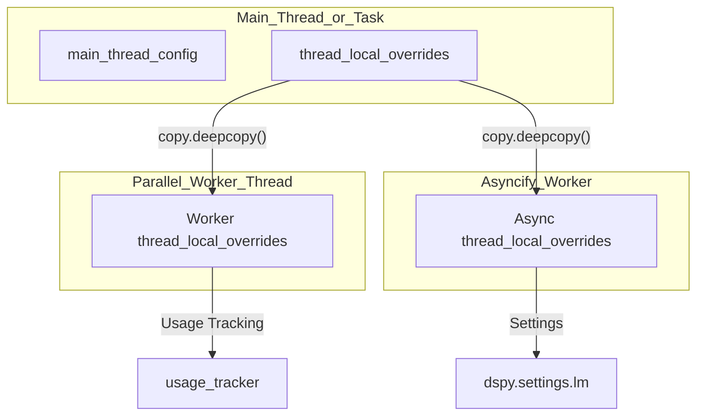
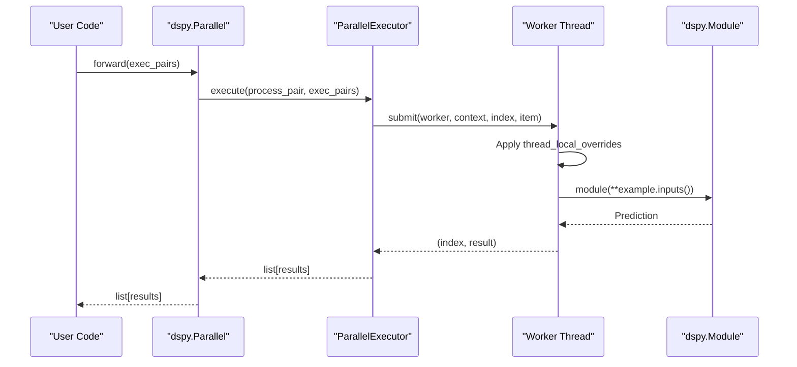

This page covers DSPy's asynchronous and parallel execution capabilities: the `aforward`/`acall` method pair on modules and adapters, the `asyncify` utility wrapper, and the `Parallel` module for multi-threaded execution. For caching behavior that affects performance in both sync and async paths, see [Caching & Performance Optimization](5.1). For streaming LM responses, see [Streaming Output](5.3).

---

## Overview

DSPy provides two primary execution paths: a synchronous path and an asynchronous path. Both paths share the same prompt-formatting and response-parsing logic; they differ in how they manage concurrency and I/O. The async path is built on `asyncio` and is supported natively by the `LM` and `Adapter` classes. For high-throughput synchronous workflows, the `Parallel` module provides a thread-pool based executor that maintains strict context isolation.

The main code entities involved are:

| Class / Function | File | Role |
|---|---|---|
| `Settings` | [dspy/dsp/utils/settings.py:51]() | Manages thread-local and async-task-local configuration |
| `Parallel` | [dspy/predict/parallel.py:9]() | High-level module for parallel (module, example) execution |
| `ParallelExecutor` | [dspy/utils/parallelizer.py:16]() | Internal engine for thread-based isolation and execution |
| `asyncify` | [dspy/utils/asyncify.py:30]() | Wraps a DSPy program for execution in a worker thread |
| `Tool.acall` | [dspy/adapters/types/tool.py:165]() | Async execution of tools/functions |

---

## Configuration & Context Isolation

DSPy uses `contextvars.ContextVar` to manage settings like the current language model (`lm`) or adapter across different execution contexts [dspy/dsp/utils/settings.py:48](). 

### Settings Management
The `Settings` class is a singleton that ensures thread-safe global configuration [dspy/dsp/utils/settings.py:53-72](). 
- `dspy.configure()`: Sets global state in `main_thread_config` [dspy/dsp/utils/settings.py:82](). It can only be called by the "owner" thread/task that initialized it [dspy/dsp/utils/settings.py:117-163]().
- `dspy.context()`: Creates temporary overrides. These overrides are stored in `thread_local_overrides` and propagate to child threads or async tasks created via DSPy primitives like `Parallel` or `asyncify` [dspy/dsp/utils/settings.py:57-64]().

### Context Propagation
When spawning new threads or tasks, DSPy explicitly copies the current context to ensure consistency:
- **Parallel Threads**: `ParallelExecutor` captures `parent_overrides` and sets them in the worker thread [dspy/utils/parallelizer.py:115-130](). It specifically performs a `copy.deepcopy()` on the `usage_tracker` so each thread tracks its own usage [dspy/utils/parallelizer.py:129]().
- **Async Tasks**: `asyncify` captures `parent_overrides` and restores them within the `asyncer.asyncify` worker [dspy/utils/asyncify.py:45-59]().

**Diagram: Context Propagation across Execution Boundaries**

Sources: [dspy/dsp/utils/settings.py:48-65](), [dspy/utils/parallelizer.py:115-130](), [dspy/utils/asyncify.py:45-59]()

---

## Parallel Execution with `dspy.Parallel`

The `dspy.Parallel` module is a utility for multi-threaded execution of `(module, example)` pairs [dspy/predict/parallel.py:9-20](). It is commonly used for batch processing or evaluation.

### Implementation Details
- **Execution Engine**: It uses `ParallelExecutor`, which wraps a `concurrent.futures.ThreadPoolExecutor` [dspy/predict/parallel.py:80-87]().
- **Data Flow**: The `forward` method accepts a list of execution pairs. It unpacks `dspy.Example` objects using `.inputs()` before passing them to the module [dspy/predict/parallel.py:77-108]().
- **Error Handling**: It tracks `error_count` and can halt execution if `max_errors` is reached [dspy/predict/parallel.py:63-75](). It can optionally return failed examples and their exceptions [dspy/predict/parallel.py:114-124]().
- **Straggler Handling**: It includes logic for `timeout` (default 120s) and `straggler_limit` (default 3) to prevent slow calls from blocking the entire batch [dspy/predict/parallel.py:18-19]().

**Diagram: Parallel Execution Data Flow**

Sources: [dspy/predict/parallel.py:9-124](), [dspy/utils/parallelizer.py:105-136]()

---

## Async Module Execution

DSPy supports native async execution through the `aforward` and `acall` methods.

### Async Tool Calling
The `Tool` class supports both sync and async functions.
- **Sync-to-Async Conversion**: If `allow_tool_async_sync_conversion` is enabled in `dspy.settings`, sync tools can be called in async contexts and vice-versa [dspy/dsp/utils/settings.py:34]().
- **ReAct Integration**: When using `dspy.ReAct`, calling `acall()` on the module automatically executes all registered tools asynchronously using their respective `acall()` methods [docs/docs/tutorials/async/index.md:129-131]().

### `asyncify` Utility
The `asyncify` function wraps a standard `dspy.Module` to make it awaitable [dspy/utils/asyncify.py:30-43]().
- **Limiter**: It uses `anyio.CapacityLimiter` to control the number of concurrent worker threads, governed by `dspy.settings.async_max_workers` (default 8) [dspy/utils/asyncify.py:12-27](), [dspy/dsp/utils/settings.py:22]().
- **Context Propagation**: It ensures that the `thread_local_overrides` from the calling async task are captured at call-time and restored within the worker thread where the program runs [dspy/utils/asyncify.py:45-63]().

---

## Summary of Execution Primitives

| Primitive | Mechanism | Primary File | Key Configuration |
|---|---|---|---|
| `dspy.Parallel` | `ThreadPoolExecutor` | [dspy/predict/parallel.py]() | `num_threads`, `max_errors` |
| `asyncify` | Worker Threads + `asyncio` | [dspy/utils/asyncify.py]() | `async_max_workers` |
| `Module.acall` | Native `asyncio` | [dspy/primitives/module.py]() | N/A |
| `ParallelExecutor` | Thread Management | [dspy/utils/parallelizer.py]() | `timeout`, `straggler_limit` |

Sources: [dspy/predict/parallel.py:9-20](), [dspy/utils/asyncify.py:30-65](), [dspy/utils/parallelizer.py:16-39](), [dspy/dsp/utils/settings.py:15-38]()