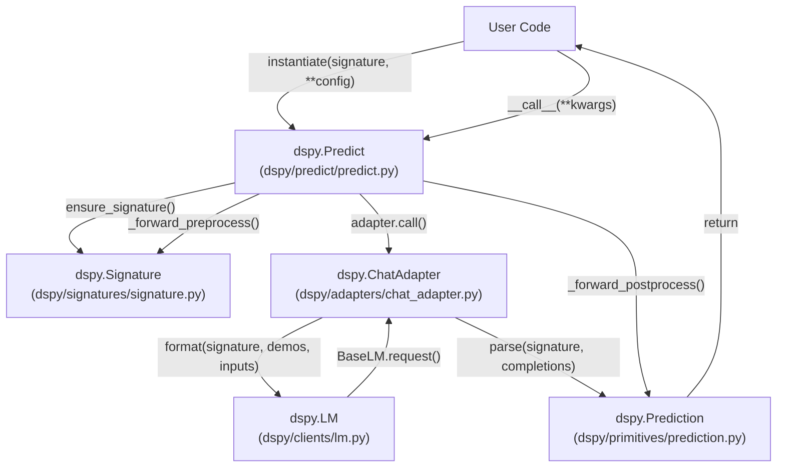
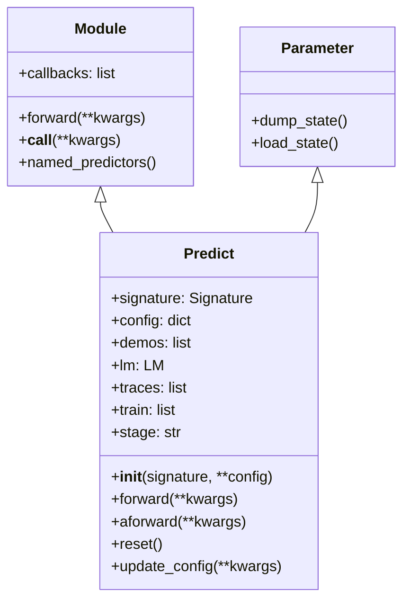
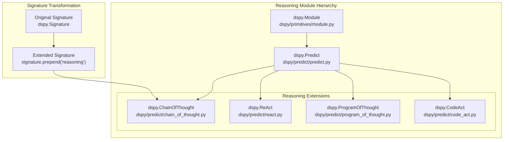
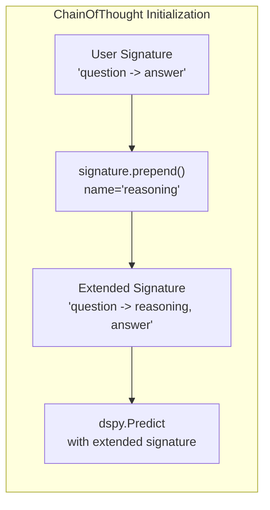
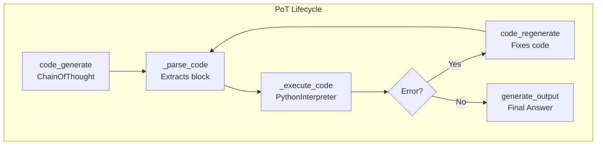
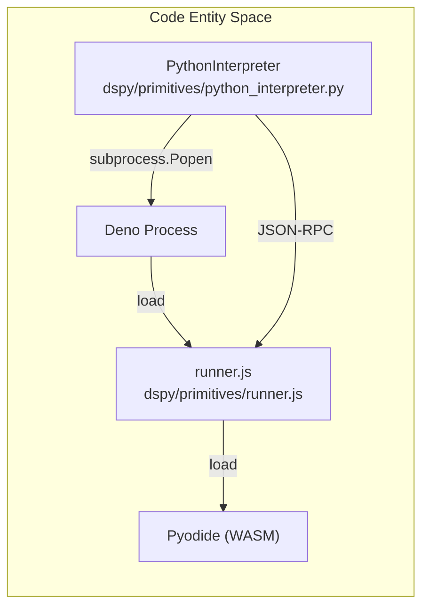
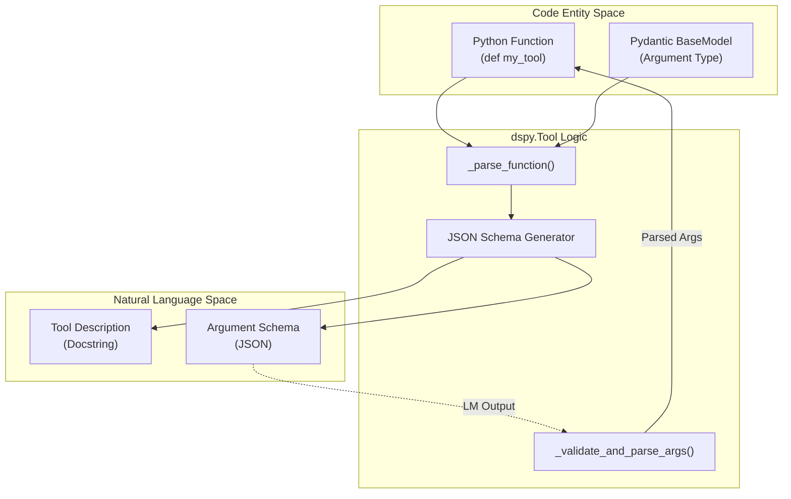
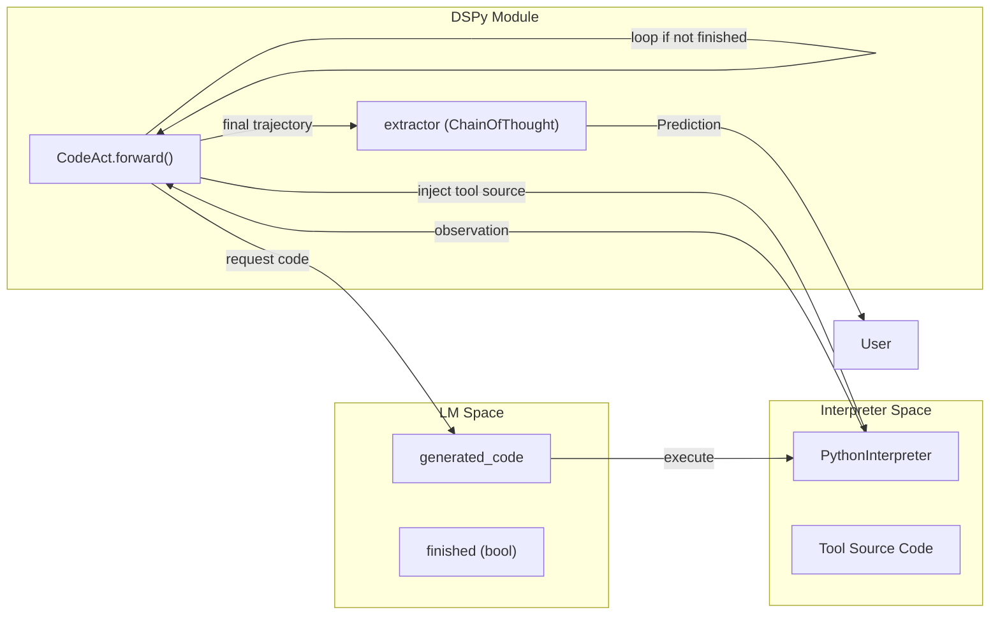

## Purpose and Scope

This document covers the `dspy.Predict` module, the foundational building block for making language model calls in DSPy. It explains how to initialize `Predict` instances, configure their behavior, execute forward passes, and manage state (demonstrations, traces, and serialization).

For information about:
- The base `Module` class that `Predict` inherits from, see [Module System & Base Classes](#2.5)
- Signature definitions that `Predict` uses, see [Signatures & Task Definition](#2.3)
- Advanced reasoning modules built on top of `Predict` (ChainOfThought, ReAct), see [Reasoning Strategies](#3.2)
- The adapter system that formats prompts, see [Adapter System](#2.4)

---

## Overview

`dspy.Predict` is the core module for mapping inputs to outputs using a language model. It takes a `Signature` (defining input/output fields) and produces structured `Prediction` objects by calling an LM through an adapter.

**Key characteristics:**
- Inherits from both `dspy.Module` and `dspy.Parameter` (making it optimizable) [[dspy/predict/predict.py:43]()]
- Manages demonstrations (few-shot examples) for in-context learning [[dspy/predict/predict.py:69]()]
- Supports both synchronous (`forward`) and asynchronous (`aforward`) execution [[dspy/predict/predict.py:126-136]()]
- Handles configuration at multiple levels (initialization, call-time, global settings) [[dspy/predict/predict.py:58-62]()]
- Maintains execution traces for debugging and optimization [[dspy/predict/predict.py:67]()]

### System Flow: Natural Language to Code Entities

The following diagram bridges the conceptual task (Natural Language Space) to the specific code entities in the `dspy` package.

**Data Flow from Signature to Prediction**


**Sources:** [dspy/predict/predict.py:43-213](), [dspy/signatures/signature.py:1-20](), [dspy/primitives/prediction.py:1-15]()

---

## Class Structure and Inheritance

The `Predict` class has a dual inheritance structure that serves distinct purposes:

**Predict Inheritance and Core Methods**


| Inherited From | Purpose |
|----------------|---------|
| `dspy.Module` | Provides execution interface (`forward`, `__call__`, `acall`) and module composition capabilities [[dspy/primitives/module.py:1-10]()] |
| `dspy.Parameter` | Marks this as an optimizable component; enables state serialization for saving/loading trained programs [[dspy/predict/parameter.py:1-5]()] |

**Sources:** [dspy/predict/predict.py:43](), [dspy/primitives/module.py:1-10](), [dspy/predict/parameter.py:1-5]()

---

## Initialization

### Constructor Signature

```python
def __init__(self, signature: str | type[Signature], callbacks: list[BaseCallback] | None = None, **config)
```
[[dspy/predict/predict.py:58]()]

### Parameters

| Parameter | Type | Description |
|-----------|------|-------------|
| `signature` | `str` or `type[Signature]` | Input/output specification. Can be string shorthand `"input1 -> output"` or a `Signature` class [[dspy/predict/predict.py:61]()] |
| `callbacks` | `list[BaseCallback]` | Optional callbacks for instrumentation and monitoring [[dspy/predict/predict.py:59]()] |
| `**config` | `dict` | Default LM configuration (e.g., `temperature`, `n`). These can be overridden per call [[dspy/predict/predict.py:62]()] |

### Initialization Process

1. **Signature normalization:** Converts string or class to `Signature` instance via `ensure_signature()` [[dspy/predict/predict.py:61]()]
2. **Stage assignment:** Generates unique 16-character hex identifier for tracking this predictor instance [[dspy/predict/predict.py:60]()]
3. **Config storage:** Stores default configuration that applies to all calls unless overridden [[dspy/predict/predict.py:62]()]
4. **State reset:** Initializes `lm`, `traces`, `train`, and `demos` to empty/None via `self.reset()` [[dspy/predict/predict.py:63-69]()]

**Sources:** [dspy/predict/predict.py:58-70]()

---

## Execution Flow

### Forward Method Entry Points

`Predict` provides three execution interfaces:

| Method | Async? | Description |
|--------|--------|-------------|
| `__call__(**kwargs)` | No | Synchronous execution via `Module.__call__` → `forward` [[dspy/predict/predict.py:126-130]()] |
| `forward(**kwargs)` | No | Core synchronous implementation [[dspy/predict/predict.py:188-200]()] |
| `acall(**kwargs)` | Yes | Asynchronous execution via `Module.acall` → `aforward` [[dspy/predict/predict.py:132-136]()] |

**Positional arguments are explicitly disallowed** to ensure clarity with signature fields [[dspy/predict/predict.py:127-128]()] [[dspy/predict/predict.py:133-134]()].

### Preprocessing Stage

The `_forward_preprocess` method performs critical setup:

1.  **Argument Extraction:** Pulls `signature`, `demos`, `config`, and `lm` from keyword arguments [[dspy/predict/predict.py:141-146]()].
2.  **LM Validation:** Ensures an LM is configured via `dspy.configure` or passed as an argument. It rejects strings or non-`BaseLM` types [[dspy/predict/predict.py:148-162]()].
3.  **Temperature Adjustment:** If `n > 1` (multiple generations) and temperature is low/unset, it defaults to `0.7` to ensure variety [[dspy/predict/predict.py:165-169]()].
4.  **Input Handling:** Validates that required input fields from the signature are present in `kwargs` [[dspy/predict/predict.py:119-124]()].

**Sources:** [dspy/predict/predict.py:138-169]()

### Postprocessing Stage

The `_forward_postprocess` method handles:

1.  **Prediction creation:** Converts raw completions into a structured `Prediction` object using `Prediction.from_completions()` [[dspy/predict/predict.py:173]()].
2.  **Trace recording:** If tracing is enabled in `dspy.settings.trace`, the call (module, inputs, and prediction) is recorded for optimization or debugging [[dspy/predict/predict.py:175-177]()].

**Sources:** [dspy/predict/predict.py:171-178]()

---

## Configuration Management

Configuration follows a strict hierarchy where call-time settings override instance settings, which override global settings.

| Priority | Level | Method |
|----------|-------|--------|
| 1 (High) | Call-time | `predict(..., config={"temperature": 0.5})` [[dspy/predict/predict.py:143]()] |
| 2 | Instance | `predict = dspy.Predict(..., temperature=0.7)` [[dspy/predict/predict.py:62]()] |
| 3 (Low) | Global | `dspy.configure(lm=...)` [[dspy/predict/predict.py:146]()] |

**Sources:** [dspy/predict/predict.py:58-62](), [dspy/predict/predict.py:141-146]()

---

## State Management

### Serialization: dump_state and load_state

`Predict` supports full state serialization, which is essential for saving optimized programs.

-   **`dump_state(json_mode=True)`**: Returns a dictionary containing `traces`, `train`, `demos`, the `signature` state, and the `lm` configuration [[dspy/predict/predict.py:71-90]()]. It uses `serialize_object` to handle complex types like Pydantic models within demonstrations [[dspy/predict/predict.py:81]()] [[dspy/predict/predict.py:225-241]()].
-   **`load_state(state)`**: Restores the predictor from a dictionary. It handles signature reconstruction and LM instantiation [[dspy/predict/predict.py:92-116]()]. It includes a safety check `_sanitize_lm_state` to prevent loading unsafe keys like `api_base`, `base_url`, and `model_list` from untrusted files unless explicitly allowed [[dspy/predict/predict.py:25-40]()] [[dspy/predict/predict.py:110]()].

**Sources:** [dspy/predict/predict.py:71-116](), [dspy/predict/predict.py:25-40](), [dspy/predict/predict.py:225-241]()

### Demonstrations (Few-Shot)

The `demos` list is the primary mechanism for few-shot learning. Optimizers (teleprompters) populate this list with `dspy.Example` objects that match the module's signature [[dspy/predict/predict.py:69]()] [[dspy/predict/predict.py:75-87]()]. During serialization, `Predict` ensures these examples are properly formatted for JSON storage [[dspy/predict/predict.py:76-86]()].

---

## Advanced Features

### Asynchronous Execution

The `aforward` method enables concurrent LM calls. It uses `adapter.acall` to handle the underlying asynchronous request to the LM provider [[dspy/predict/predict.py:202-213]()].

### Streaming Support

`Predict` checks `settings.send_stream` and `settings.stream_listeners` to determine if output should be streamed [[dspy/predict/predict.py:180-186]()]. If enabled, it executes within a context that tracks the `caller_predict` instance to allow downstream listeners to associate chunks with specific predictor stages [[dspy/predict/predict.py:194]()] [[dspy/predict/predict.py:206]()].

**Sources:** [dspy/predict/predict.py:180-213]()

---

## Summary of Key Functions

| Function/Method | File:Lines | Role |
|-----------------|------------|------|
| `__init__` | [dspy/predict/predict.py:58-63]() | Initializes signature, hex stage, and config. |
| `_forward_preprocess` | [dspy/predict/predict.py:138-169]() | Merges configs, validates LM, and prepares inputs. |
| `_forward_postprocess` | [dspy/predict/predict.py:171-178]() | Wraps output in `Prediction` and records traces. |
| `dump_state` | [dspy/predict/predict.py:71-90]() | Serializes module state including demos and LM config. |
| `load_state` | [dspy/predict/predict.py:92-116]() | Restores state with safety checks for LM parameters. |
| `serialize_object` | [dspy/predict/predict.py:225-241]() | Utility to recursively serialize complex objects (Pydantic models, enums) for JSON. |

**Sources:** [dspy/predict/predict.py:1-241]()

# Reasoning Strategies


## Purpose and Scope

This document describes reasoning modules in DSPy that extend basic prediction with intermediate reasoning steps. These modules enhance the language model's ability to solve complex tasks by explicitly structuring how the model thinks through problems.

For basic prediction without reasoning, see [Predict Module](3.1). For tool integration with reasoning, see [Tool Integration & Function Calling](3.3). For code execution internals, see [Code Execution & Sandboxing](5.6).

## Overview

DSPy provides several reasoning modules that augment basic prediction with structured intermediate steps. All reasoning modules extend the base prediction mechanism by modifying the [Signature](2.3) to include additional output fields that capture reasoning traces.

The primary reasoning strategies available in DSPy are:

| Module | Strategy | Use Case |
|--------|----------|----------|
| `dspy.ChainOfThought` | Step-by-step reasoning before answering | General reasoning tasks requiring explanation |
| `dspy.ReAct` | Reasoning interleaved with tool actions | Agent tasks requiring external information and tool use |
| `dspy.ProgramOfThought` | Program generation for computation | Mathematical or algorithmic problems requiring precision |
| `dspy.CodeAct` | Actions expressed as code blocks | Agents that use a REPL or code execution environment |

Sources: [dspy/predict/__init__.py:1-28](), [dspy/predict/chain_of_thought.py:12-28](), [dspy/predict/react.py:16-39](), [dspy/predict/program_of_thought.py:14-28]()

## Module Architecture



**Signature Extension Pattern**: Reasoning modules work by prepending or appending intermediate output fields to the user's signature. The language model is then prompted to generate these fields in sequence, creating a reasoning trace before producing the final output.

Sources: [dspy/predict/chain_of_thought.py:12-41](), [dspy/predict/react.py:73-85](), [dspy/predict/program_of_thought.py:65-95]()

## ChainOfThought

`dspy.ChainOfThought` is the most common reasoning module. It adds a `reasoning` field to the signature, prompting the model to think step-by-step.

### Implementation

The implementation transforms the user's signature by prepending a `reasoning` output field:



| Component | Implementation |
|-----------|----------------|
| Signature Extension | [dspy/predict/chain_of_thought.py:34]() uses `signature.prepend()` to add the field |
| Field Name | Defaults to `reasoning` with description `${reasoning}` [dspy/predict/chain_of_thought.py:31-34]() |
| Forward Method | [dspy/predict/chain_of_thought.py:37-38]() delegates directly to `self.predict` |
| Async Support | [dspy/predict/chain_of_thought.py:40-41]() provides `aforward()` calling `acall()` |

Sources: [dspy/predict/chain_of_thought.py:12-41]()

## ReAct (Reasoning + Acting)

`dspy.ReAct` implements an agentic loop where the model interleaves reasoning with tool calls. It generalizes the ReAct paradigm to work over any DSPy signature [dspy/predict/react.py:19-23]().

### The Agent Loop

ReAct constructs a specialized signature that includes a `trajectory` (input) and three output fields: `next_thought`, `next_tool_name`, and `next_tool_args` [dspy/predict/react.py:73-79]().

1.  **Initialization**: Tools are wrapped in `dspy.Tool` objects [dspy/predict/react.py:44-45]().
2.  **Trajectory Management**: The module maintains a `trajectory` dictionary of thoughts, tool names, arguments, and observations [dspy/predict/react.py:96-113]().
3.  **Truncation**: If the context window is exceeded, ReAct attempts to truncate the trajectory and retry [dspy/predict/react.py:145-155]().
4.  **Extraction**: Once the "finish" tool is called or `max_iters` is reached, a final `ChainOfThought` pass extracts the output fields defined in the original signature [dspy/predict/react.py:117-118]().

### Implementation Details

| Function/Class | Role |
|----------------|------|
| `ReAct.__init__` | Constructs the agent signature and toolset [dspy/predict/react.py:17-89]() |
| `forward` | The main loop managing iterations and tool execution [dspy/predict/react.py:95-119]() |
| `_format_trajectory` | Uses `ChatAdapter` to format history into the prompt [dspy/predict/react.py:90-93]() |
| `finish` Tool | A built-in tool that signals task completion [dspy/predict/react.py:62-67]() |

Sources: [dspy/predict/react.py:16-119]()

## ProgramOfThought (PoT)

`dspy.ProgramOfThought` generates and executes Python code to solve tasks. It is designed for problems where symbolic logic or computation is more reliable than direct neural generation.

### Execution Flow



1.  **Generation**: Uses `ChainOfThought` to generate Python code [dspy/predict/program_of_thought.py:44-49]().
2.  **Execution**: Code is run using `PythonInterpreter`, which utilizes a Deno-based WASM sandbox for security [dspy/predict/program_of_thought.py:63](), [dspy/primitives/python_interpreter.py:75-98]().
3.  **Submission**: The generated code must call `SUBMIT()` to return results [dspy/predict/program_of_thought.py:111]().
4.  **Self-Correction**: If execution fails, PoT uses a `code_regenerate` module that takes the previous code and error message as inputs to produce a fix [dspy/predict/program_of_thought.py:50-55](), [dspy/predict/program_of_thought.py:166-173]().

Sources: [dspy/predict/program_of_thought.py:14-173](), [dspy/primitives/python_interpreter.py:75-98]()

## PythonInterpreter and Sandbox

The `PythonInterpreter` provides a secure environment for executing code generated by reasoning modules like `ProgramOfThought`.



- **Sandbox Security**: Code runs in an isolated Pyodide environment with no access to host filesystem or network unless explicitly enabled via `enable_read_paths` or `enable_network_access` [dspy/primitives/python_interpreter.py:129-132]().
- **Communication**: Uses JSON-RPC 2.0 for messaging between the Python host and the Deno runner [dspy/primitives/python_interpreter.py:49-72](), [dspy/primitives/runner.js:95-132]().
- **Tool Bridge**: Allows Python code inside the sandbox to call host-side tools via `toolCallBridge` [dspy/primitives/runner.js:151-202]().

Sources: [dspy/primitives/python_interpreter.py:75-173](), [dspy/primitives/runner.js:13-205]()

## Native Reasoning Support

Modern LMs (e.g., OpenAI o1, DeepSeek R1) have native reasoning capabilities. DSPy handles this via the `Reasoning` type and the `Adapter` system.

### Reasoning Type and Adapters

The `Reasoning` type is a specialized `dspy.Type` that can be adapted to native LM features. When a model supports native reasoning, the `Adapter` can intercept the reasoning field and map it to the model's internal reasoning tokens rather than generating it as standard text [dspy/adapters/types/base_type.py:80-102]().

Sources: [dspy/adapters/types/base_type.py:19-102](), [dspy/predict/react.py:16-143](), [dspy/predict/chain_of_thought.py:12-41](), [dspy/predict/program_of_thought.py:14-173](), [dspy/primitives/python_interpreter.py:75-180]()

# Tool Integration & Function Calling


## Purpose and Scope

This document explains how to integrate external tools and enable function calling in DSPy programs. It covers the `dspy.Tool` and `dspy.ToolCalls` types, the orchestration of tools via the `dspy.ReAct` and `dspy.CodeAct` modules, and the underlying adapter system that maps Python functions to language model (LM) function-calling schemas.

---

## Overview of Tool Integration

DSPy treats tools as first-class citizens through a type-based system. Any Python callable can be transformed into a tool that a language model can reason about and invoke.

**Core Components:**
- **`dspy.Tool`**: A wrapper class that inspects Python functions to extract metadata (name, docstring, arguments, and type hints) for the LM [dspy/adapters/types/tool.py:20-34]().
- **`dspy.ToolCalls`**: A container for one or more tool invocations generated by an LM [dspy/adapters/types/tool.py:8]().
- **`dspy.ReAct`**: A module implementing the "Reasoning and Acting" paradigm, interleaving thought, tool selection, and observation [dspy/predict/react.py:16-23]().
- **`dspy.CodeAct`**: An advanced agentic module that generates and executes Python code to interact with tools [dspy/predict/code_act.py:14-17]().

### Tool Registration Workflow

When a function is passed to a tool-using module, DSPy performs the following "Natural Language Space" to "Code Entity Space" mapping:

1. **Introspection**: `dspy.Tool` uses `inspect.signature` and `get_type_hints` to build a JSON schema of the function [dspy/adapters/types/tool.py:81-94]().
2. **Signature Augmentation**: Modules like `ReAct` dynamically append tool metadata to the instructions of their internal `dspy.Predict` signatures [dspy/predict/react.py:73-79]().
3. **Execution**: When the LM selects a tool, the module invokes the underlying Python function, handles errors, and appends the result to the "trajectory" [dspy/predict/react.py:109-113]().

Sources: [dspy/adapters/types/tool.py:20-118](), [dspy/predict/react.py:16-89]()

---

## The `dspy.Tool` Type System

The `dspy.Tool` class is the primary bridge between standard Python code and LM-accessible functions.

### Metadata Extraction
`dspy.Tool` automatically extracts:
- **Name**: From the function's `__name__` [dspy/adapters/types/tool.py:82]().
- **Description**: From the function's docstring (`__doc__`) [dspy/adapters/types/tool.py:83]().
- **Parameters**: A JSON schema generated from type hints and default values [dspy/adapters/types/tool.py:96-112]().

### Complex Type Support
DSPy supports complex nested types in tool arguments using Pydantic. If an argument is a `BaseModel`, `dspy.Tool` resolves its JSON schema and handles validation/parsing during invocation [dspy/adapters/types/tool.py:101-105]().

**Diagram: Tool Introspection and Validation**


Sources: [dspy/adapters/types/tool.py:75-118](), [dspy/adapters/types/tool.py:119-146]()

---

## ReAct: Reasoning and Acting

The `dspy.ReAct` module generalizes the ReAct paradigm to work over any `dspy.Signature`. It manages an iterative loop where the LM maintains a `trajectory` of thoughts and tool observations.

### ReAct Architecture
`ReAct` creates two internal predictors:
1. **`self.react`**: A `dspy.Predict` module with a signature modified to include `trajectory`, `next_thought`, `next_tool_name`, and `next_tool_args` [dspy/predict/react.py:73-79]().
2. **`self.extract`**: A `dspy.ChainOfThought` module used at the end of the loop to extract the final fields defined in the original signature [dspy/predict/react.py:88]().

### Execution Loop
The `forward` pass iterates up to `max_iters` [dspy/predict/react.py:97-98]():
1. Call `self.react` to get the next action.
2. Execute the selected tool (or the special `finish` tool) [dspy/predict/react.py:110-115]().
3. Update the `trajectory` with the `thought`, `tool_name`, `tool_args`, and `observation`.
4. If `finish` is called or `max_iters` reached, call `self.extract` to produce the final output [dspy/predict/react.py:117-118]().

Sources: [dspy/predict/react.py:40-89](), [dspy/predict/react.py:95-119]()

---

## CodeAct: Code-Based Tool Usage

`dspy.CodeAct` is a hybrid module that inherits from `ReAct` and `ProgramOfThought`. Instead of outputting structured tool names/args, it generates Python code blocks that call the provided tools [dspy/predict/code_act.py:14-17]().

### Key Features
- **Python Sandbox**: Uses `PythonInterpreter` to execute generated code safely [dspy/predict/code_act.py:69]().
- **Source Injection**: Before execution, the source code of the tool functions is injected into the interpreter's global scope [dspy/predict/code_act.py:92-93]().
- **Iteration**: The LM can write code that performs complex logic, loops, or multiple tool calls in a single turn [dspy/predict/code_act.py:78-80]().

**Diagram: CodeAct Data Flow**


Sources: [dspy/predict/code_act.py:19-88](), [dspy/predict/code_act.py:90-119]()

---

## Native Function Calling Support

While `ReAct` often uses text-based parsing of tool calls, DSPy's `Adapter` system supports **Native Function Calling** for models that provide it (e.g., GPT-4, Claude 3).

### Adapter Behavior
- **`ChatAdapter`**: By default, uses text-based parsing (`use_native_function_calling=False`) [docs/docs/learn/programming/tools.md:184]().
- **`JSONAdapter`**: Enables native function calling by default (`use_native_function_calling=True`) [docs/docs/learn/programming/tools.md:185]().

When enabled, the adapter translates `dspy.Tool` objects into the specific API format (like OpenAI's `tools` parameter) and parses the response directly into `dspy.ToolCalls` [dspy/adapters/types/tool.py:151-163]().

### External Tool Conversions
DSPy provides utilities to integrate tools from other ecosystems:
- **Model Context Protocol (MCP)**: `convert_mcp_tool` transforms an MCP tool into a `dspy.Tool` [dspy/utils/mcp.py:30-47]().
- **LangChain**: `convert_langchain_tool` adapts LangChain's `BaseTool` into the DSPy system [dspy/utils/langchain_tool.py:10-47]().

### Async Tool Support
DSPy supports asynchronous tools. An `async def` function passed to `dspy.Tool` can be executed via `tool.acall()` [dspy/adapters/types/tool.py:1-3](). 
- **ReAct Async**: Calling `aforward()` on a `ReAct` instance automatically uses `acall()` for all underlying tool executions [dspy/predict/react.py:120-135]().

Sources: [docs/docs/learn/programming/tools.md:170-202](), [dspy/predict/react.py:120-143](), [dspy/utils/mcp.py:30-47](), [dspy/utils/langchain_tool.py:10-47]()

---

## Practical Examples

### Basic ReAct Usage
```python
def search_wikipedia(query: str) -> str:
    """Search Wikipedia for a query."""
    return f"Results for {query}: ..."

react = dspy.ReAct("question -> answer", tools=[search_wikipedia])
result = react(question="Who is the CEO of Nvidia?")
```
[dspy/predict/react.py:33-38]()

### CodeAct Usage
```python
def factorial(n: int) -> int:
    if n == 1: return 1
    return n * factorial(n-1)

act = dspy.CodeAct("n -> result", tools=[factorial])