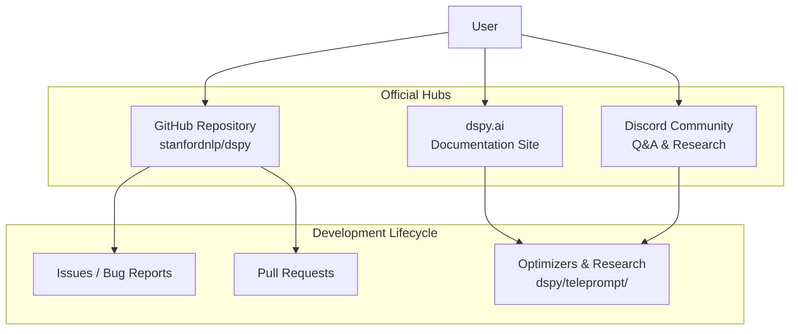
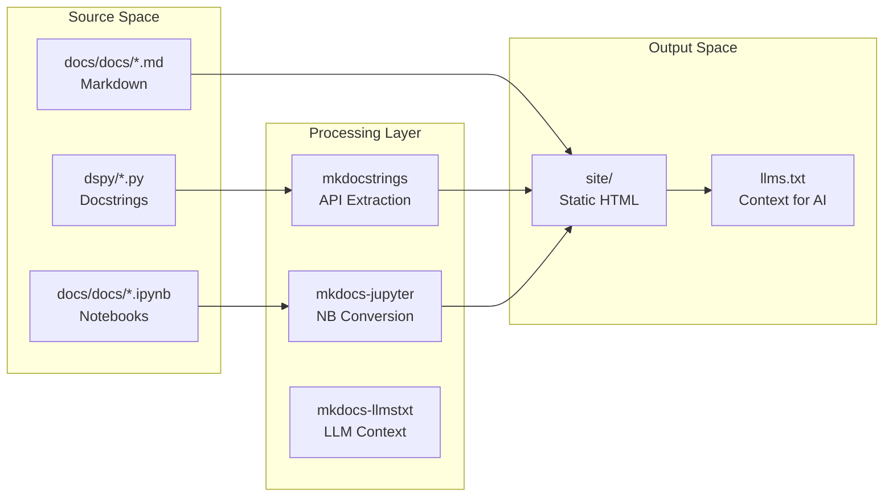
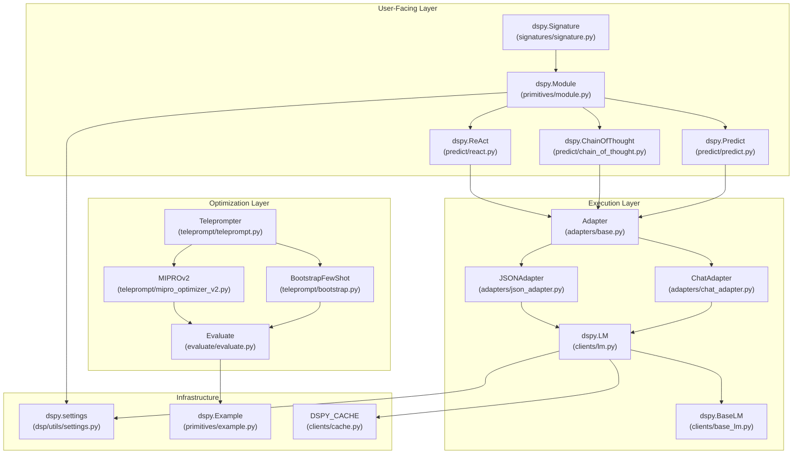
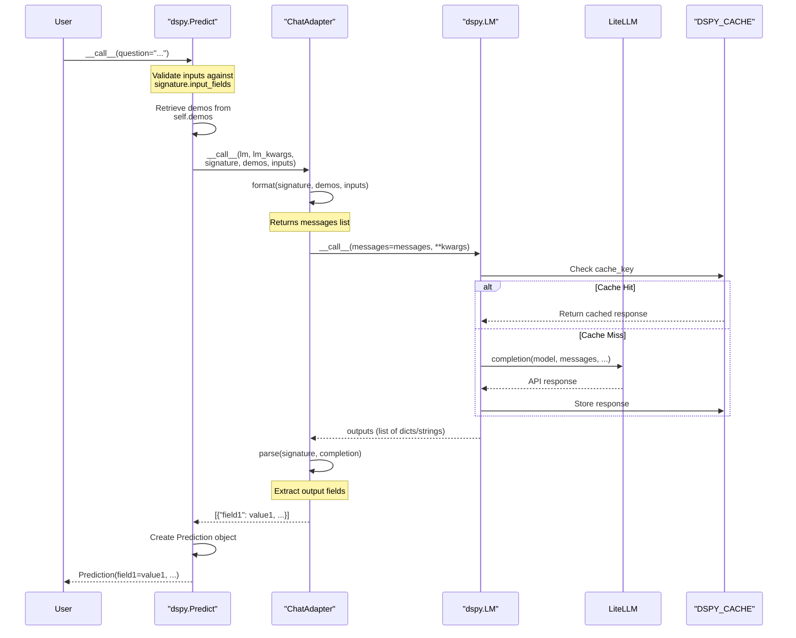
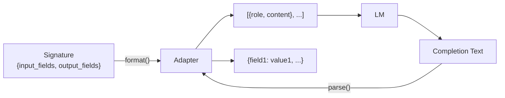
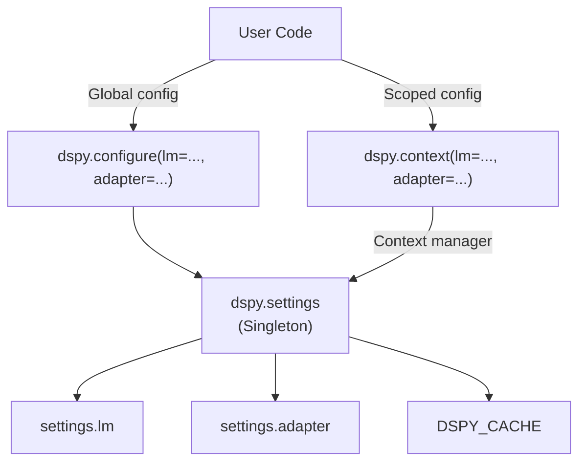
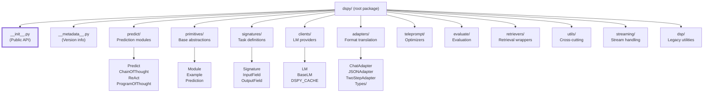
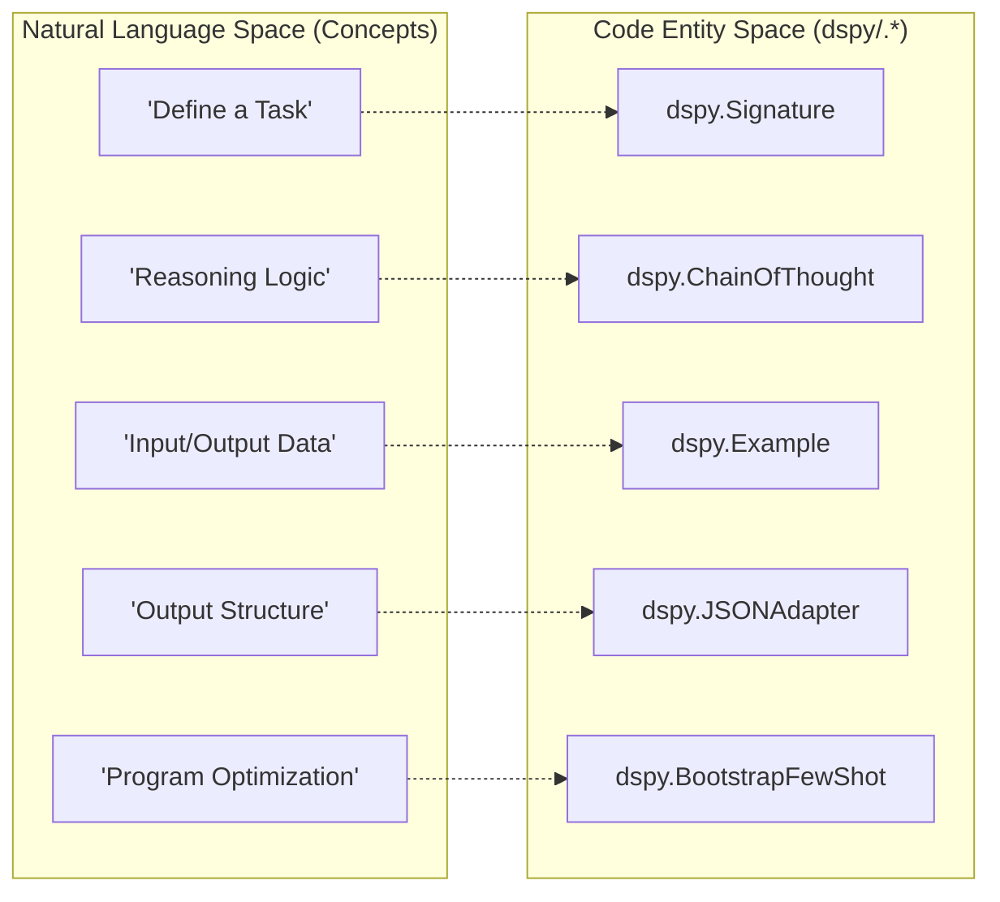
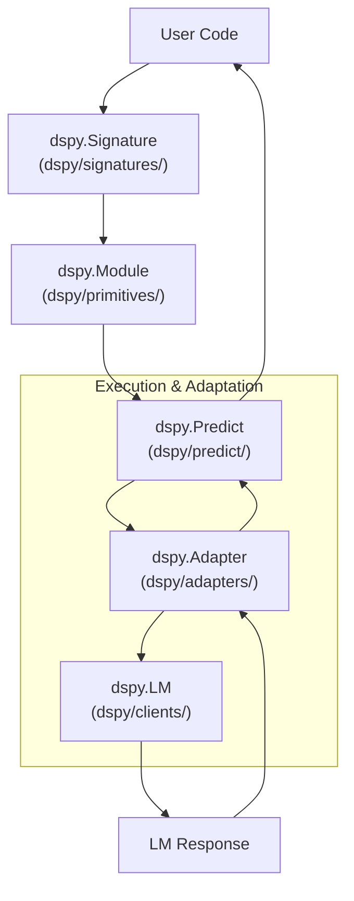

response = lm("Say this is a test!", rollout_id=1, temperature=1.0)
print(response)
```
**Sources:** [docs/docs/learn/programming/language_models.md:152-155](), [docs/docs/cheatsheet.md:11-20]()

# Community & Resources


This page provides links to DSPy's official community channels, details the documentation system architecture, and catalogues the extensive ecosystem of production use cases, research, and community-maintained tools.

## Official Channels

DSPy maintains several primary hubs for development, support, and documentation.

| Channel | Purpose | Location |
|---------|---------|----------|
| **GitHub Repository** | Source code, issues, and PRs | [stanfordnlp/dspy](https://github.com/stanfordnlp/dspy) |
| **Discord Server** | Real-time support and research discussion | [Join Discord](https://discord.gg/XCGy2WDCQB) |
| **Documentation Site** | Official guides and API reference | [dspy.ai](https://dspy.ai) |

**Community Interaction Flow**



Sources: [docs/README.md:1-1]()

## Documentation System Architecture

The DSPy documentation is built using `MkDocs` with the `Material` theme, leveraging a suite of plugins to handle notebooks and API auto-generation.

### Build Configuration & Dependencies
The documentation system relies on several key libraries defined in the requirements:
- **mkdocs-material**: The core UI theme [docs/requirements.txt:2]().
- **mkdocstrings-python**: Automatically extracts documentation from Python source code [docs/requirements.txt:7]().
- **mkdocs-jupyter**: Renders `.ipynb` files directly as documentation pages [docs/requirements.txt:3]().
- **mkdocs-llmstxt**: Generates an `/llms.txt` file specifically for consumption by Large Language Models [docs/requirements.txt:8](), [docs/README.md:77-79]().

### Local Development Workflow
Contributors can build the documentation locally using the following sequence:
1. Install dependencies: `pip install -r docs/requirements.txt` [docs/README.md:29]().
2. Generate API docs: `python scripts/generate_api_docs.py` [docs/README.md:34]().
3. Serve locally: `mkdocs serve` [docs/README.md:52]().

**Documentation Data Flow**



Sources: [docs/requirements.txt:1-11](), [docs/README.md:23-53]()

## Ecosystem & Learning Resources

DSPy has a rapidly growing ecosystem of research papers, production implementations, and community-maintained language ports.

### Production Implementations
DSPy is utilized in production by organizations such as **Shopify**, **Databricks**, **Dropbox**, **AWS**, and **JetBlue** [docs/docs/community/use-cases.md:3-14]().
- **Shopify**: Uses DSPy + `GEPA` for structured metadata extraction, achieving a ~550x cost reduction [docs/docs/community/use-cases.md:20-25]().
- **Dropbox**: Optimized the "Dash" relevance judge for retrieval ranking [docs/docs/community/use-cases.md:28-31]().
- **AWS**: Migrates prompts between models (e.g., to Amazon Nova) while maintaining performance [docs/docs/community/use-cases.md:44]().

### Research & Open Source
The framework is deeply rooted in academic research, with several papers originating from the Stanford NLP group:
- **STORM**: Writing Wikipedia-like articles from scratch [docs/docs/community/built-with-dspy.md:9]().
- **MIPRO**: Multi-objective Instruction and Prompt Optimization [docs/docs/community/built-with-dspy.md:39]().
- **IReRa**: Infer-Retrieve-Rank for extreme classification [docs/docs/community/built-with-dspy.md:13]().

### Community Language Ports
The DSPy programming paradigm has been ported to multiple languages by the community:
- **Rust**: `DSRs` (Ground-up rewrite) [docs/docs/community/built-with-dspy.md:68]().
- **TypeScript**: `dspy.ts` and `ax` [docs/docs/community/built-with-dspy.md:69-70]().
- **Go**: `dspy-go` [docs/docs/community/built-with-dspy.md:64]().
- **C#/.NET**: `DSpyNet` [docs/docs/community/built-with-dspy.md:65]().

Sources: [docs/docs/community/use-cases.md:1-71](), [docs/docs/community/built-with-dspy.md:1-85]()

## FAQ & Troubleshooting

### DSPy vs. Other Frameworks
The documentation distinguishes DSPy from other libraries based on its "compile-then-run" philosophy:
- **vs. Prompt Wrappers**: Unlike basic templating, DSPy abstracts the prompt and optimizes it based on the specific LM and data [docs/docs/faqs.md:14]().
- **vs. LangChain/LlamaIndex**: While those provide pre-built application modules, DSPy provides general-purpose modules that *learn* to prompt or finetune based on your specific pipeline [docs/docs/faqs.md:16]().
- **vs. Guidance/Outlines**: Those focus on low-level structured control of a single call; DSPy optimizes the entire program logic [docs/docs/faqs.md:18]().

### Optimization Costs
Compiling a DSPy program (e.g., using `BootstrapFewShotWithRandomSearch`) incurs additional LM calls. For reference, a program optimized over 7 candidate programs on `gpt-3.5-turbo` cost approximately $3 USD and took 6 minutes [docs/docs/faqs.md:41]().

Sources: [docs/docs/faqs.md:10-43]()

# Core Architecture


This document provides a technical overview of DSPy's architecture, explaining how the framework's major subsystems—Signatures, Modules, Language Model Clients, Adapters, and Optimizers—fit together to enable declarative programming over foundation models.

**Scope**: This page covers the architectural patterns and component interactions that form DSPy's core. For implementation details of specific subsystems, see:
- Package organization and API surface: [Package Structure & Public API](#2.1)
- Language model integration mechanics: [Language Model Integration](#2.2)
- Signature system internals: [Signatures & Task Definition](#2.3)
- Adapter implementation details: [Adapter System](#2.4)
- Module composition patterns: [Module System & Base Classes](#2.5)
- Data primitives and example handling: [Example & Data Primitives](#2.6)

## Three-Layer Architecture

DSPy is organized into three distinct layers that separate concerns between task definition, execution, and optimization:



**Sources**: [dspy/__init__.py:1-33](), [dspy/primitives/module.py:40-67](), [dspy/adapters/__init__.py:1-23]()

### User-Facing Layer

The top layer exposes declarative abstractions for defining tasks and composing programs:

| Class | Purpose | File Location |
|-------|---------|---------------|
| `Signature` | Declarative task specification with typed input/output fields | `dspy/signatures/signature.py` |
| `Module` | Base class for composable components with state management | `dspy/primitives/module.py` |
| `Predict` | Basic prediction module executing a single signature | `dspy/predict/predict.py` |
| `ChainOfThought` | Reasoning module that extends signatures with rationale fields | `dspy/predict/chain_of_thought.py` |
| `ReAct` | Agentic module for tool-using workflows | `dspy/predict/react.py` |

Users interact primarily with these abstractions, writing Python code that declares **what** to compute rather than **how** to prompt models.

**Sources**: [dspy/__init__.py:1-5](), [dspy/primitives/module.py:40-67]()

### Execution Layer

The middle layer handles the mechanics of language model communication:

| Class | Purpose | File Location |
|-------|---------|---------------|
| `BaseLM` | Abstract base class defining LM interface contract | `dspy/clients/base_lm.py` |
| `LM` | Concrete implementation using LiteLLM for 100+ providers | `dspy/clients/lm.py` |
| `Adapter` | Abstract base for formatting signatures into LM requests | `dspy/adapters/base.py` |
| `ChatAdapter` | Default adapter using field delimiter patterns | `dspy/adapters/chat_adapter.py` |
| `JSONAdapter` | Structured output adapter leveraging native JSON modes | `dspy/adapters/json_adapter.py` |

This layer translates high-level `Signature` objects into provider-specific API calls and parses responses back into structured Python dictionaries.

**Sources**: [dspy/__init__.py:8-9](), [dspy/adapters/__init__.py:1-23]()

### Optimization Layer

The bottom layer provides algorithms for improving program performance:

| Class | Purpose | File Location |
|-------|---------|---------------|
| `Teleprompter` | Base class for optimization algorithms | `dspy/teleprompt/teleprompt.py` |
| `BootstrapFewShot` | Generates demonstrations from teacher program traces | `dspy/teleprompt/bootstrap.py` |
| `MIPROv2` | Bayesian optimization over instructions and demonstrations | `dspy/teleprompt/mipro_optimizer_v2.py` |
| `Evaluate` | Evaluation harness for measuring program quality | `dspy/evaluate/evaluate.py` |

Optimizers operate on `Module` instances, systematically searching for improved prompts, demonstrations, or model weights.

**Sources**: [dspy/__init__.py:5-7](), [dspy/evaluate/__init__.py:1-10]()

## Request Lifecycle

The following diagram traces a prediction request through DSPy's architecture, from user code to LM response:



**Key execution steps**:

1. **Input Validation**: The `Module` validates inputs against `signature.input_fields`.
2. **Demonstration Retrieval**: The module retrieves few-shot examples from `self.demos`, which may be populated manually or by optimization algorithms.
3. **Format Phase**: The `Adapter.format()` method (called within `Adapter.__call__`) constructs a list of messages including system instructions and user/assistant pairs for demonstrations.
4. **LM Call**: The `LM` forward method checks the two-tier cache via `DSPY_CACHE` and delegates to provider completion on cache miss.
5. **Parse Phase**: The `Adapter.parse()` method extracts output fields from the completion text.
6. **Result Assembly**: The module wraps parsed outputs in a `Prediction` object.

**Sources**: [dspy/primitives/module.py:94-110](), [dspy/primitives/base_module.py:159-167](), [dspy/__init__.py:20-33]()

## Key Abstractions

### Signature: Declarative Task Specification

A `Signature` defines the structure of a task without specifying how to solve it. It acts as the "contract" between the module and the LM.

**Implementation**: Signatures are defined using natural language docstrings and typed fields. The system separates fields into `input_fields` and `output_fields`.

**Sources**: [dspy/__init__.py:4](), [dspy/adapters/types/base_type.py:1-5]()

### Module: Composable Components

`Module` is the base class for all DSPy programs, analogous to `torch.nn.Module`. Modules manage state, track submodules for optimization, and define the `forward` pass logic. It uses a metaclass `ProgramMeta` to ensure proper initialization of history and callbacks.

**Sources**: [dspy/primitives/module.py:18-49](), [dspy/primitives/base_module.py:19-21]()

### Adapter: Format Translation

Adapters bridge the gap between `Signature` objects and language model APIs.



**Concrete implementations**:
- **ChatAdapter**: Uses delimiter patterns for field delineation.
- **JSONAdapter**: Leverages native structured output modes.
- **XMLAdapter**: Uses XML tags for field delineation.
- **TwoStepAdapter**: Separates reasoning from extraction.

**Sources**: [dspy/adapters/__init__.py:1-23](), [dspy/adapters/types/__init__.py:1-10]()

### LM: Language Model Client

The `LM` class provides a unified interface to numerous providers.

**Key responsibilities**:
1. **Caching**: Two-tier cache system via `DSPY_CACHE`.
2. **History tracking**: Maintains a record of LM interactions in `module.history`.
3. **Usage Tracking**: Monitors token consumption via `track_usage`.

**Sources**: [dspy/__init__.py:20-33](), [dspy/primitives/module.py:77-84](), [dspy/utils/usage_tracker.py:1-16]()

## Configuration System

DSPy uses a singleton `settings` object for global configuration, accessible via `dspy.settings`, `dspy.configure`, and `dspy.context`.



**Sources**: [dspy/__init__.py:18-33](), [dspy/primitives/module.py:95-101]()

## Summary

DSPy's architecture achieves separation of concerns through three layers:

1. **User-Facing Layer**: Declarative task definitions (`Signature`) composed into programs (`Module`).
2. **Execution Layer**: Format translation (`Adapter`) and language model communication (`LM`).
3. **Optimization Layer**: Systematic improvement of programs via prompt and weight tuning (`Teleprompter`).

This design allows users to focus on **what** their program should compute while delegating prompt engineering to optimization algorithms.

**Sources**: [dspy/primitives/module.py:40-49](), [dspy/utils/saving.py:15-24]()

# Package Structure & Public API


## Purpose and Scope

This document describes the structural organization of the `dspy` package, including its directory layout, module hierarchy, and the public API surface exposed through `dspy/__init__.py`. It explains how the package aggregates functionality from multiple submodules into a unified interface, the data types supported, and the singleton-based configuration system.

For information about specific subsystems (Signatures, Modules, LM Clients, Adapters), see their dedicated pages under [Core Architecture](#2).

---

## Package Directory Structure

The `dspy` package follows a modular architecture with clear separation of concerns across functional domains:



**Sources:** [dspy/__init__.py:1-21](), [dspy/adapters/__init__.py:1-23]()

---

## Public API Aggregation

The `dspy/__init__.py` file serves as the primary entry point for the public API, importing and re-exporting symbols from submodules to provide a flat, user-friendly namespace.

### Natural Language Space to Code Entity Space Mapping

This diagram associates high-level system concepts with the specific code entities exposed in the public API.



**Sources:** [dspy/__init__.py:1-9](), [dspy/adapters/__init__.py:1-6]()

### Wildcard and Explicit Imports

The `__init__.py` uses wildcard imports for major subsystems, allowing them to control their public surface via `__all__`.

[dspy/__init__.py:1-5]()
```python
from dspy.predict import *
from dspy.primitives import *
from dspy.retrievers import *
from dspy.signatures import *
from dspy.teleprompt import *
```

Core infrastructure, utilities, and the adapter system are imported explicitly to ensure type safety and visibility:

[dspy/__init__.py:7-16]()
```python
from dspy.evaluate import Evaluate
from dspy.clients import *
from dspy.adapters import Adapter, ChatAdapter, JSONAdapter, XMLAdapter, TwoStepAdapter, Image, Audio, File, History, Type, Tool, ToolCalls, Code, Reasoning
from dspy.utils.exceptions import ContextWindowExceededError
from dspy.utils.logging_utils import configure_dspy_loggers, disable_logging, enable_logging
from dspy.utils.asyncify import asyncify
from dspy.utils.syncify import syncify
from dspy.utils.saving import load
from dspy.streaming.streamify import streamify
from dspy.utils.usage_tracker import track_usage
```

**Sources:** [dspy/__init__.py:1-16]()

### Utility Functions and Singletons

The module exposes global settings and creates convenient aliases for optimization and caching:

[dspy/__init__.py:18-33]()

| Category | Symbols | Purpose |
|----------|---------|---------|
| **Settings** | `configure`, `context`, `load_settings` | Manage global state via `dspy.dsp.utils.settings` |
| **Async/Sync** | `asyncify`, `syncify` | Utilities for execution mode conversion |
| **Optimization** | `BootstrapRS` | Alias for `BootstrapFewShotWithRandomSearch` |
| **Caching** | `cache` | Alias for `DSPY_CACHE` from `dspy.clients` |
| **Observability**| `track_usage`, `enable_logging` | Monitor token usage and framework logs |
| **Persistence** | `load` | Utility to load saved modules/states |

**Sources:** [dspy/__init__.py:12-33](), [dspy/dsp/utils/settings.py:1-20]()

---

## Module Categorization

The package organizes functionality into distinct layers that facilitate the flow from task definition to LM execution.

### Data and Logic Flow Diagram



**Sources:** [dspy/__init__.py:1-12](), [dspy/adapters/base.py:1-20]()

### Core Subsystems

- **`dspy.predict`**: Contains functional modules like `Predict`, `ChainOfThought`, and `ReAct` [dspy/__init__.py:1]().
- **`dspy.primitives`**: Defines foundational classes like `Module`, `Example`, and `Prediction` [dspy/__init__.py:2]().
- **`dspy.adapters`**: Manages the translation between DSPy's structured signatures and the raw strings/JSON expected by LMs. It includes specialized types:
    - `dspy.Reasoning`: A type for handling reasoning content, including native provider support [dspy/adapters/types/reasoning.py:1-10]().
    - `dspy.TwoStepAdapter`: A multi-stage adapter that uses a primary model for content and a secondary model for structure [dspy/adapters/two_step_adapter.py:1-10]().
    - `dspy.Type`: The base class for custom types like `Image`, `Audio`, and `Tool` [dspy/adapters/types/base_type.py:1-10]().
- **`dspy.utils`**: Provides cross-cutting concerns like `BaseCallback` for lifecycle hooks [dspy/utils/callback.py:15-63]() and `DummyLM` for unit testing [dspy/utils/dummies.py:13-67]().

**Sources:** [dspy/__init__.py:1-12](), [dspy/adapters/types/__init__.py:1-10](), [dspy/utils/callback.py:15-63](), [dspy/utils/dummies.py:13-67]()

---

## Testing and Experimental Utilities

DSPy includes internal utilities to support development and testing:

### Mocking and Simulation
For testing environments where live LM calls are not desired, `dspy.utils` provides:
- `DummyLM`: A mock language model that can return predefined responses or follow example inputs [dspy/utils/dummies.py:13-67]().
- `dummy_rm`: A mock retrieval model that uses a simple n-gram based `DummyVectorizer` to score passages [dspy/utils/dummies.py:157-176]().

### Lifecycle Hooks (Callbacks)
The `BaseCallback` class allows users to hook into the execution of modules, LMs, and adapters. Handlers include `on_module_start`, `on_lm_end`, and `on_adapter_format_start` [dspy/utils/callback.py:65-191](). These can be set globally via `dspy.configure(callbacks=[...])` or locally in component constructors [dspy/utils/callback.py:25-62]().

### Experimental Annotations
New features are marked using the `@experimental` decorator, which automatically appends a warning to the docstring and tracks the version of introduction [dspy/utils/annotation.py:16-36]().

**Sources:** [dspy/utils/dummies.py:13-176](), [dspy/utils/callback.py:15-191](), [dspy/utils/annotation.py:16-67]()

---

## Package Metadata and Initialization

The package performs automatic initialization upon import:
1. Configures default loggers using `configure_dspy_loggers(__name__)` [dspy/__init__.py:23]().
2. Exposes metadata like `__version__`, `__author__`, and `__url__` from `dspy.__metadata__` [dspy/__init__.py:21]().
3. Maps singleton settings from `dspy.dsp.utils.settings` to the top-level `dspy` namespace for easy access (e.g., `dspy.configure`, `dspy.context`) [dspy/__init__.py:25-28]().

**Sources:** [dspy/__init__.py:21-28]()