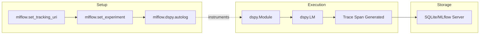

```
Sources: [dspy/utils/usage_tracker.py:57-74](), [tests/utils/test_usage_tracker.py:140-156]()

---

## MLflow Integration

MLflow serves as the primary recommended external observability tool. It provides automatic instrumentation for DSPy modules and language model calls.

### Configuration Flow

Sources: [docs/docs/tutorials/observability/index.md:119-126]()

### Trace Inspection
MLflow generates a **trace** for each prediction. Each trace contains multiple **spans**:
- **Module Spans**: The input/output of a `dspy.Predict` or `dspy.ChainOfThought` call.
- **Tool Spans**: Inputs and outputs for functions passed to `dspy.ReAct`. [docs/docs/tutorials/observability/index.md:149-150]()
- **LM Spans**: The raw prompt sent to the provider and the completion received.

This allows developers to diagnose why a program failed, such as a retriever returning outdated information in a ReAct loop. [docs/docs/tutorials/observability/index.md:146-150]()

Sources: [docs/docs/tutorials/observability/index.md:89-150]()

---

## Logging Configuration

Tracing and logging behavior is controlled via `dspy.settings`.

- **`dspy.settings.trace`**: A list that captures internal execution steps when active.
- **`dspy.settings.usage_tracker`**: Holds the active `UsageTracker` instance. [dspy/utils/usage_tracker.py:73]()
- **Context Management**: Use `dspy.settings.context(trace=...)` to enable or disable tracing for specific code blocks without changing global state.

### Multi-turn History and Files
For modules handling complex types like `dspy.File`, the observability layer (via `inspect_history`) specifically formats these objects to avoid flooding the console with base64 data, instead showing metadata like `data_length`. [dspy/utils/inspect_history.py:71-77]()

Sources: [dspy/utils/usage_tracker.py:73](), [dspy/utils/inspect_history.py:76-77](), [dspy/adapters/types/file.py:59-69]()