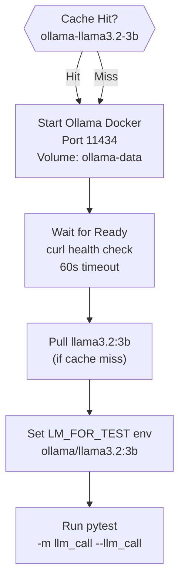

uv run pytest tests/reliability/ --reliability
```

**Sources:** [CONTRIBUTING.md:105-132](), [.github/workflows/run_tests.yml:87-88]()

---

## CI/CD Pipeline

The CI/CD pipeline, defined in `.github/workflows/run_tests.yml`, runs tests across Python 3.10 through 3.14 [.github/workflows/run_tests.yml:52]().

### LLM Call Test Job Infrastructure
The pipeline uses Docker to run **Ollama** as a local LM provider for integration tests.



**Sources:** [.github/workflows/run_tests.yml:90-140](), [tests/conftest.py:55-61]()

---

## Testing Best Practices

### Mocking with DummyLM
For unit tests that do not require real LM logic, use `dspy.utils.DummyLM` to provide deterministic responses and avoid network overhead.

### Reliability Testing
When adding new features, add a test case in `tests/reliability/` and use `assert_program_output_correct` to ensure the module handles various edge cases (e.g., trailing periods in classification, complex Pydantic schemas) [tests/reliability/test_pydantic_models.py:56-62]().

### Cleanup
Ensure all tests are isolated by relying on the `clear_settings` fixture, which resets the global `dspy.settings` state [tests/conftest.py:11-21]().

**Sources:** [tests/predict/test_code_act.py:20-30](), [tests/reliability/utils.py:15-41](), [tests/conftest.py:11-21]()