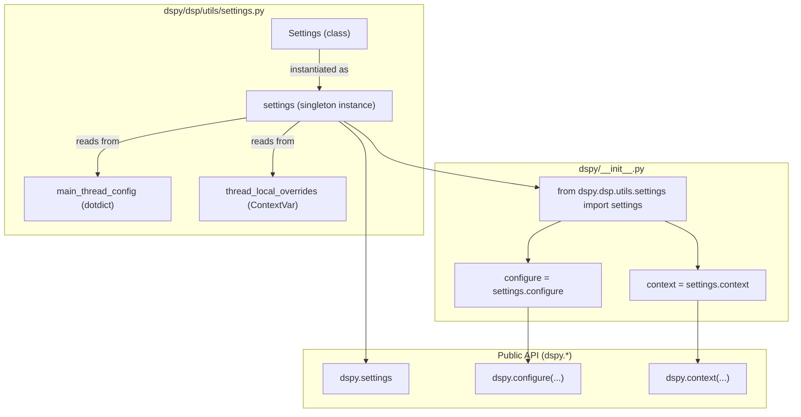
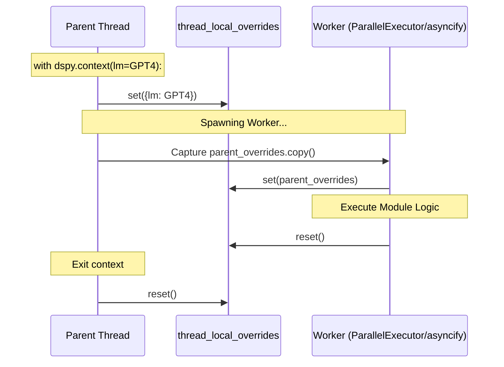
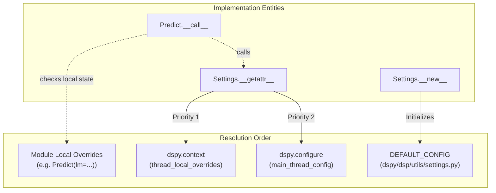

This page documents `dspy.settings`, the global configuration singleton, and the methods used to read and write configuration (`dspy.configure`, `dspy.context`). It covers the available configuration keys, their effects on program behavior, and the thread-safe context management mechanism including async task propagation.

For documentation on configuring specific language model providers, see [Model Providers & LiteLLM Integration](6.2). For tracing and observability settings, see [Observability & Monitoring](6.4).

---

## Settings Architecture

The DSPy settings system centers on a single module-level singleton, `settings`, instantiated from the `Settings` class in `dspy/dsp/utils/settings.py`. This singleton is imported into the public namespace and several aliases are created at module load time.

**Diagram: Settings Singleton and Public API Aliases**



Sources: [dspy/dsp/utils/settings.py:51-72](), [dspy/dsp/utils/settings.py:15-38]()

---

## The `settings` Singleton

`dspy.settings` is the live configuration object. Accessing `dspy.settings.<key>` returns the current effective value, resolving first from thread-local overrides and falling back to global defaults.

The `Settings` class utilizes `contextvars.ContextVar` via `thread_local_overrides` to ensure that context-scoped overrides are isolated per-thread and per-async task [dspy/dsp/utils/settings.py:48-49]().

### Configuration Resolution Logic
When a setting is accessed via `__getattr__`, the following priority is applied:
1. **Thread-Local/Async-Local Overrides**: Values set within a `dspy.context` block [dspy/dsp/utils/settings.py:79-81]().
2. **Main Thread Config**: Global values set via `dspy.configure` [dspy/dsp/utils/settings.py:82-83]().
3. **AttributeError**: If the key does not exist in either [dspy/dsp/utils/settings.py:85]().

---

## Configuration Methods

### `dspy.configure(**kwargs)`
Sets global configuration keys. This method enforces **Owner Thread** restrictions: only the thread (or async task) that first calls `configure` is permitted to call it again [dspy/dsp/utils/settings.py:117-127](). This prevents race conditions in concurrent environments where global state might be accidentally mutated by worker threads.

In async environments, `configure` can only be called from the same async task that called it first, unless running in an IPython environment [dspy/dsp/utils/settings.py:142-163]().

```python
import dspy
# Initial configuration sets the 'owner'
dspy.configure(lm=dspy.LM("openai/gpt-4o"), num_threads=10)
```

### `dspy.context(**kwargs)`
A context manager for temporary, thread-local overrides. It captures the current state, merges the new `kwargs`, and restores the previous state upon exit [dspy/dsp/utils/settings.py:204-219](). Unlike `configure`, `context` can be called from any thread or async task [dspy/dsp/utils/settings.py:64-65]().

```python
with dspy.context(lm=dspy.LM("openai/gpt-4o-mini")):
    # Overrides are active here
    result = module(input="...") 
```

---

## Context Propagation in Parallelism

DSPy provides specialized utilities to ensure that `dspy.context` settings propagate correctly from a parent thread/task to spawned workers.

**Diagram: Context Propagation Flow**



### Parallel Propagation
The `ParallelExecutor` (used by `dspy.Parallel`) captures `thread_local_overrides.get().copy()` in the parent thread and applies them to the worker thread before execution [dspy/utils/parallelizer.py:122-131](). If `usage_tracker` is present, it is deep-copied so each thread tracks its own usage [dspy/utils/parallelizer.py:127-129]().

### Async Propagation
The `asyncify` utility similarly captures the parent's context at call-time and applies it within the worker thread where the synchronous program is executed [dspy/utils/asyncify.py:45-60](). It uses a `CapacityLimiter` based on `dspy.settings.async_max_workers` to control concurrency [dspy/utils/asyncify.py:12-27]().

Sources: [dspy/utils/parallelizer.py:159-172](), [dspy/utils/asyncify.py:30-43](), [dspy/predict/parallel.py:89-111]()

---

## Available Configuration Keys

| Key | Default | Description |
|-----|---------|-------------|
| `lm` | `None` | Default `dspy.LM` instance for all modules [dspy/dsp/utils/settings.py:16]() |
| `adapter` | `None` | Default `Adapter` (defaults to `ChatAdapter` if None) [dspy/dsp/utils/settings.py:17]() |
| `num_threads` | `8` | Thread count for `dspy.Parallel` [dspy/dsp/utils/settings.py:31]() |
| `async_max_workers` | `8` | Max workers for `asyncify` and async LMs [dspy/dsp/utils/settings.py:22]() |
| `max_errors` | `10` | Error threshold before halting parallel operations [dspy/dsp/utils/settings.py:32]() |
| `track_usage` | `False` | Enables token usage tracking via `usage_tracker` [dspy/dsp/utils/settings.py:25]() |
| `max_history_size` | `10000` | Maximum number of history entries to maintain [dspy/dsp/utils/settings.py:35]() |
| `provide_traceback` | `False` | Includes Python tracebacks in error logs [dspy/dsp/utils/settings.py:30]() |
| `warn_on_type_mismatch`| `True` | Logs warnings for Signature type mismatches [dspy/dsp/utils/settings.py:37]() |
| `allow_tool_async_sync_conversion` | `False` | Allows async tools to be converted to sync [dspy/dsp/utils/settings.py:34]() |

---

## Configuration Resolution Hierarchy

**Diagram: Code Entity Space Resolution**



Sources: [dspy/dsp/utils/settings.py:15-38](), [dspy/dsp/utils/settings.py:78-85]()

---

## Typical Usage Patterns

### Global Initialization
```python
import dspy
lm = dspy.LM("openai/gpt-4o")
dspy.configure(lm=lm, track_usage=True)
```

### Thread-Safe Batch Processing
Using `dspy.Parallel` ensures that settings (like a specific LM or trace) are isolated per-thread if needed, or inherited correctly from the parent. `Parallel` also supports straggler timeouts and error thresholds [dspy/predict/parallel.py:10-20]().
```python
def my_metric(example, prediction):
    # This runs in a worker thread but sees the parent's 'lm'
    return example.answer == prediction.answer

with dspy.context(lm=eval_lm):
    evaluator = dspy.Evaluate(devset=devset, metric=my_metric)
    evaluator(program)
```

### Async Task Isolation
When using `asyncio.gather`, `dspy.context` prevents settings from "leaking" between concurrent tasks.
```python
async def run_task(question, model_name):
    with dspy.context(lm=dspy.LM(model_name)):
        return await predictor.acall(question=question)

# Each task uses its own LM independently
results = await asyncio.gather(
    run_task("Q1", "openai/gpt-4o"),
    run_task("Q2", "anthropic/claude-3-opus")
)
```

Sources: [tests/utils/test_settings.py:100-116](), [dspy/predict/parallel.py:41-58](), [dspy/utils/parallelizer.py:38-43]()