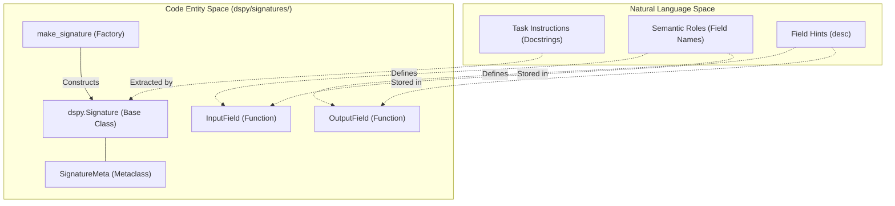
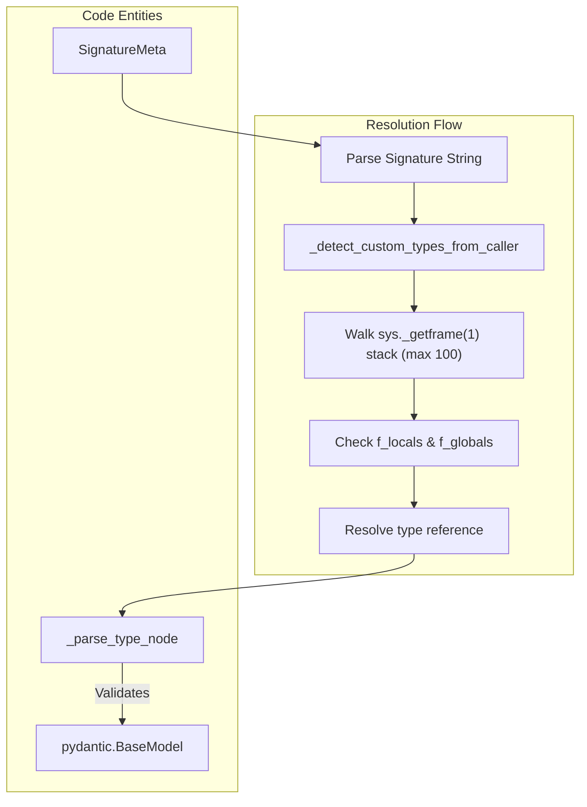

## Purpose and Scope

This document explains DSPy's **Signature** system, which provides a declarative way to define the input/output schema for language model tasks. Signatures specify what fields a task expects as inputs and what fields it should produce as outputs, along with instructions and metadata. They serve as the interface between user code and DSPy modules.

For information about how Signatures are executed through modules, see [Module System & Base Classes](2.5). For information about how Signatures are formatted into prompts, see [Adapter System](2.4). For information about how to use Signatures in programs, see [Predict Module](3.1).

---

## Overview

A **Signature** defines a task's input/output behavior using typed fields and natural language instructions. DSPy uses Signatures to automatically generate prompts, parse outputs, and validate types without manual prompt engineering [docs/docs/learn/programming/signatures.md:7-15]().

### Natural Language to Code Entity Mapping

The following diagram bridges the gap between high-level task descriptions and the specific code entities in `dspy/signatures/`.

**Signature Architecture Map**

**Sources:** [dspy/signatures/signature.py:1-16](), [dspy/signatures/field.py:79-86]()

---

## Creating Signatures

DSPy supports three ways to create Signatures: string-based, class-based, and dictionary-based.

### String-Based Signatures

The simplest way to create a Signature is with a string in the format `"input1, input2 -> output1, output2"` [dspy/signatures/signature.py:8-9](). String-based signatures are parsed using Python's AST module to extract field names and types [dspy/signatures/signature.py:519-603]().

```python
# Basic signature
sig = dspy.Signature("question -> answer")

# With type annotations
sig = dspy.Signature("question: str, context: list[str] -> answer: str")

# With instructions
sig = dspy.Signature("question -> answer", "Answer the question concisely")
```

The `SignatureMeta.__call__` method [dspy/signatures/signature.py:42-51]() intercepts Signature instantiation and routes it to `make_signature`.

**Sources:** [dspy/signatures/signature.py:41-51](), [dspy/signatures/signature.py:519-603](), [tests/signatures/test_signature.py:53-58]()

### Class-Based Signatures

For more control, subclass `Signature` and define fields as class attributes. The class docstring becomes the task instructions [dspy/signatures/signature.py:213-219]().

```python
class QASignature(dspy.Signature):
    """Answer questions with short factoid answers."""
    
    question: str = dspy.InputField()
    context: list[str] = dspy.InputField(desc="background information")
    answer: str = dspy.OutputField(desc="often between 1 and 5 words")
```

**Sources:** [dspy/signatures/signature.py:138-201](), [tests/signatures/test_signature.py:14-28]()

### Dictionary-Based Signatures

Signatures can also be created from dictionaries mapping field names to `InputField` or `OutputField` objects [tests/signatures/test_signature.py:106-112](). This is handled by the `make_signature` function [dspy/signatures/signature.py:565-602]().

**Sources:** [dspy/signatures/signature.py:565-602](), [tests/signatures/test_signature.py:106-112]()

---

## Field Definitions

Every field in a Signature must be declared with either `InputField()` or `OutputField()`. These are wrappers around `pydantic.Field` [dspy/signatures/field.py:79-86]().

### Metadata and Constraints

Each field has metadata stored in `json_schema_extra` via the `move_kwargs` utility [dspy/signatures/field.py:39-60]().

| Attribute | Description | Code Pointer |
|-----------|-------------|--------------|
| `prefix` | Label displayed before the field in prompts (Deprecated, use instructions/desc). | [dspy/signatures/field.py:12-16]() |
| `desc` | Description of the field's purpose. | [dspy/signatures/field.py:52-54]() |
| `format` | Optional function to transform field values (Deprecated). | [dspy/signatures/field.py:17-20]() |
| `constraints` | Pydantic constraints (gt, le, min_length) translated to text. | [dspy/signatures/field.py:62-70]() |

**Sources:** [dspy/signatures/field.py:10-70](), [tests/signatures/test_signature.py:44-51]()

### Type Annotations and Custom Types

Signatures support rich type annotations. If no type is specified, fields default to `str` [dspy/signatures/signature.py:168](), and the field is marked with `IS_TYPE_UNDEFINED` [dspy/signatures/signature.py:169]().

For custom types in string signatures, `SignatureMeta._detect_custom_types_from_caller` [dspy/signatures/signature.py:54-136]() attempts to resolve types from the caller's stack frames by walking up to 100 frames [dspy/signatures/signature.py:97-100]().

**Type Resolution Logic**

**Sources:** [dspy/signatures/signature.py:54-136](), [dspy/signatures/signature.py:634-767](), [tests/signatures/test_custom_types.py:9-24]()

---

## Signature Modification

Signatures are immutable. Modification methods return a new Signature class [tests/signatures/test_signature.py:65-70]().

| Method | Role | Implementation |
|--------|------|----------------|
| `with_instructions()` | Updates the task description. | [dspy/signatures/signature.py:268-294]() |
| `with_updated_fields()` | Modifies existing field metadata. | [dspy/signatures/signature.py:297-320]() |
| `prepend()` | Adds an InputField at the beginning. | [dspy/signatures/signature.py:323-347]() |
| `append()` | Adds a field at the end. | [dspy/signatures/signature.py:350-374]() |
| `insert()` | Adds a field at a specific index. | [dspy/signatures/signature.py:412-468]() |
| `delete()` | Removes a specific field. | [dspy/signatures/signature.py:377-409]() |

**Sources:** [dspy/signatures/signature.py:268-468](), [tests/signatures/test_signature.py:65-82]()

---

## Implementation Details

### SignatureMeta Metaclass
The `SignatureMeta` metaclass [dspy/signatures/signature.py:41-259]() is responsible for:
1. **Field Ordering**: Ensuring `input_fields` and `output_fields` maintain the order defined in code [dspy/signatures/signature.py:139-172]().
2. **Prefix Inference**: Automatically converting field names (e.g., `question_text`) into human-readable prefixes (e.g., `Question Text:`) via `infer_prefix` [dspy/signatures/signature.py:770-814]().
3. **Instruction Generation**: Providing default instructions if a docstring is missing, e.g., "Given the fields `inputs`, produce the fields `outputs`." [dspy/signatures/signature.py:35-38]().

### State Management
Signatures support `dump_state()` and `load_state()` for serialization [dspy/signatures/signature.py:485-506](). This allows saving optimized instructions and field descriptions generated during the optimization process.

**Sources:** [dspy/signatures/signature.py:41-259](), [dspy/signatures/signature.py:485-506](), [dspy/signatures/signature.py:770-814]()