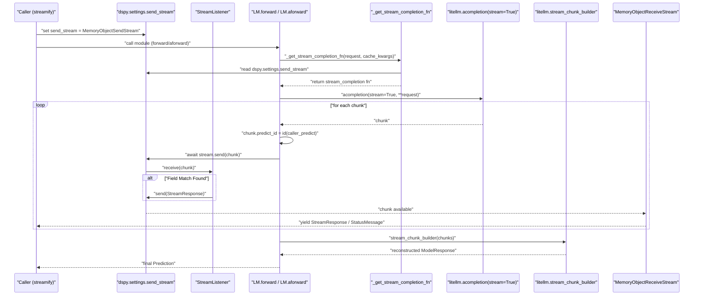
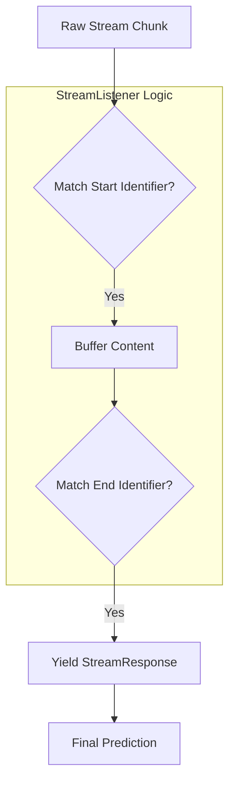

This page documents how DSPy enables streaming of LM responses token-by-token as they are generated, covering the internal machinery in the LM client, the `streamify` utility, and the `StreamListener` system for structured output streaming. Streaming in DSPy supports both **Output Token Streaming** (yielding partial field values) and **Intermediate Status Streaming** (providing updates on program execution state).

---

## Overview

By default, DSPy collects the complete LM response before handing it to the adapter for parsing. Streaming mode changes this: the LM response is forwarded chunk-by-chunk through an in-process channel as it arrives. DSPy supports two levels of streaming:

1.  **Low-level LM Streaming**: Forwarding raw chunks from the model provider (via LiteLLM).
2.  **High-level Module Streaming**: Using `streamify` and `StreamListener` to yield structured `StreamResponse` objects for specific signature fields and `StatusMessage` objects for execution progress.

Streaming is activated by wrapping a program with `dspy.streamify`, which configures `dspy.settings.send_stream` and attaches necessary callbacks [dspy/streaming/streamify.py:164-170]().

---

## Internal Architecture

**Diagram: Streaming Data Flow Through Code Entities**



Sources: [dspy/clients/lm.py:305-350](), [dspy/streaming/streamify.py:169-173](), [dspy/streaming/streaming_listener.py:115-151]()

---

## Key Components

### `streamify`
Defined at [dspy/streaming/streamify.py:27-34]().

`streamify` wraps a DSPy module to enable incremental outputs. It sets up an `anyio` memory channel and configures `dspy.settings` with the `send_stream` and `StatusStreamingCallback` [dspy/streaming/streamify.py:164-170](). It can wrap both sync and async programs, utilizing `asyncify` for sync modules [dspy/streaming/streamify.py:161-162]().

**Arguments:**
* `program`: The `dspy.Module` to wrap.
* `status_message_provider`: Optional custom provider for execution updates [dspy/streaming/streamify.py:29]().
* `stream_listeners`: List of `StreamListener` instances to target specific fields [dspy/streaming/streamify.py:30]().
* `include_final_prediction_in_output_stream`: If `True`, yields the final `Prediction` object at the end of the stream [dspy/streaming/streamify.py:48-51]().

### `StreamListener`
Defined at [dspy/streaming/streaming_listener.py:23-32]().

A listener captures streaming output for a specific field in a signature. It uses regex-based identifiers tailored to the active adapter (`ChatAdapter`, `JSONAdapter`, or `XMLAdapter`) to detect when a field starts and ends in the raw token stream [dspy/streaming/streaming_listener.py:56-78]().

| Adapter | Start Identifier | End Identifier Pattern |
|---|---|---|
| `ChatAdapter` | `[[ ## field_name ## ]]` | `\[\[ ## (\w+) ## \]\]` |
| `JSONAdapter` | `"field_name":` | `\w*\"(,\|\s*})` |
| `XMLAdapter` | `<field_name>` | `</field_name>` |

Sources: [dspy/streaming/streaming_listener.py:57-77]()

### `StatusStreamingCallback`
Defined at [dspy/streaming/messages.py:98-100]().

This callback hooks into the DSPy lifecycle (`on_module_start`, `on_tool_start`, `on_lm_start`, etc.) to send `StatusMessage` objects to the stream. It uses a `StatusMessageProvider` to generate the text for these messages [dspy/streaming/messages.py:102-185]().

### `_get_stream_completion_fn`
Defined at [dspy/clients/lm.py:305-350]().

This function determines if streaming is active by checking `dspy.settings.send_stream`. If active, it returns an internal `stream_completion` function that handles the LiteLLM stream and reconstructs the final response using `litellm.stream_chunk_builder` [dspy/clients/lm.py:338]().

---

## Structured Output Streaming

DSPy supports streaming custom types that implement the `is_streamable` interface. For example, the `Citations` type can parse stream chunks directly if the model provider (like Anthropic) supports native citation streaming [dspy/adapters/types/citation.py:177-191]().

**Diagram: Structured Field Extraction**



Sources: [dspy/streaming/streaming_listener.py:115-160](), [dspy/adapters/types/citation.py:182-200]()

---

## Settings and Configuration

Streaming relies on global settings to propagate the stream channel across nested module calls.

| Setting | Type | Purpose |
|---|---|---|
| `dspy.settings.send_stream` | `MemoryObjectSendStream` | The channel where chunks and messages are published [dspy/streaming/streamify.py:170](). |
| `dspy.settings.callbacks` | `list` | Includes `StatusStreamingCallback` to track execution [dspy/streaming/streamify.py:165-167](). |
| `dspy.settings.stream_listeners` | `list` | Registered listeners for the current context [dspy/streaming/streamify.py:170](). |

### Caching Behavior
If a result is found in the cache, the individual token stream is bypassed. The system immediately yields the final `dspy.Prediction` to the stream, as there are no incremental chunks to provide [tests/streaming/test_streaming.py:42-47]().

---

## Usage Example

```python
import dspy
from dspy.streaming import StreamListener