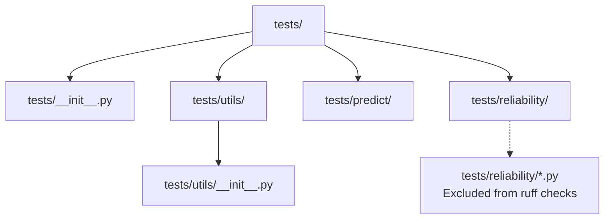
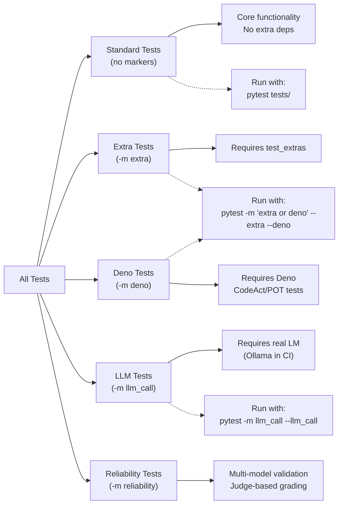
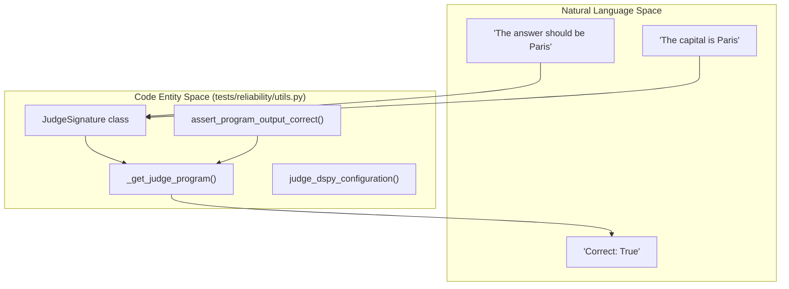

## Purpose and Scope

This document describes DSPy's testing infrastructure, including test organization, pytest configuration, test execution strategies, and the CI/CD pipeline. It covers how tests are categorized, how to run them locally, and the unique infrastructure for testing against real language models. For information about the build system and release process, see [Build System & CI/CD](#7.1). For documentation practices, see [Documentation System](#7.3).

**Sources:** [.github/workflows/run_tests.yml:1-171](), [pyproject.toml:1-188]()

---

## Test Organization

DSPy tests are organized in the `tests/` directory and use `pytest` as the testing framework. Tests are categorized using pytest markers to enable selective execution of different test suites.

### Test Directory Structure



**Sources:** [tests/conftest.py:8-10](), [CONTRIBUTING.md:124-128](), [.github/workflows/run_tests.yml:84-88](), [.pre-commit-config.yaml:12-12]()

---

## Pytest Configuration

DSPy's pytest configuration is defined in `pyproject.toml` and customized via `tests/conftest.py`. The framework manages environment-specific flags and global settings cleanup to ensure test isolation.

### Configuration and Hooks

| Hook / Setting | File | Purpose |
|---------|-------|---------|
| `clear_settings` | `tests/conftest.py:11-21` | Autouse fixture that resets `dspy.settings` to `DEFAULT_CONFIG` after every test to prevent cross-test contamination. |
| `pytest_addoption` | `tests/conftest.py:29-36` | Adds CLI flags for specialized test suites: `--reliability`, `--extra`, `--llm_call`, and `--deno`. |
| `pytest_collection_modifyitems` | `tests/conftest.py:44-53` | Automatically skips tests marked with specific flags unless the corresponding CLI option is provided. |
| `anyio_backend` | `tests/conftest.py:23-25` | Sets the default async backend to `asyncio` for async tests. |
| `lm_for_test` | `tests/conftest.py:55-61` | Fixture that retrieves the model string from the `LM_FOR_TEST` environment variable. |

**Sources:** [tests/conftest.py:1-61](), [pyproject.toml:111-117]()

---

## Test Dependencies

DSPy separates test dependencies into development and optional test extras, managed through `pyproject.toml`.

### Core Testing Dependencies
The `dev` extra includes essential tools for linting and unit testing:
- `pytest`: Core framework.
- `ruff`: Linting and formatting [CONTRIBUTING.md:40-41]().
- `pre-commit`: Hook management [CONTRIBUTING.md:42-45]().

### Extended Testing Dependencies
The `test_extras` group provides dependencies for specialized tests, such as those requiring external datasets or integration with other frameworks.

**Sources:** [.github/workflows/run_tests.yml:85-86](), [CONTRIBUTING.md:118-120]()

---

## Test Categories and Markers

DSPy uses pytest markers to categorize tests into different execution groups.



### Specialized Markers
- **`extra`**: Tests requiring `test_extras` [tests/conftest.py:8]().
- **`deno`**: Tests requiring the Deno runtime, specifically for `CodeAct` [tests/predict/test_code_act.py:8]().
- **`llm_call`**: Integration tests performing actual network requests [tests/conftest.py:8]().
- **`reliability`**: Tests for model consistency using Pydantic models and Enums [tests/reliability/test_pydantic_models.py:10]().

**Sources:** [tests/conftest.py:8-10](), [.github/workflows/run_tests.yml:87-88](), [tests/predict/test_code_act.py:8-10]()

---

## Reliability and Judge Infrastructure

DSPy includes a sophisticated reliability testing framework that uses LLMs to judge the output of other LLMs.

### Natural Language to Code Entity Mapping: Reliability



### Key Reliability Components
- **`assert_program_output_correct`**: Uses an LLM judge to validate program outputs against natural language guidelines [tests/reliability/utils.py:15-41]().
- **`JudgeSignature`**: A `dspy.Signature` that takes `program_input`, `program_output`, and `guidelines` to produce a `JudgeResponse` containing a boolean `correct` and a string `justification` [tests/reliability/utils.py:92-111]().
- **`known_failing_models`**: A decorator to allow specific tests to fail for certain models without breaking the suite [tests/reliability/utils.py:43-62]().
- **`reliability_conf.yaml`**: Configuration file defining model parameters and adapters for reliability testing [tests/reliability/utils.py:75-77]().

**Sources:** [tests/reliability/utils.py:12-153](), [tests/reliability/conftest.py:28-68]()

---

## Running Tests Locally

### Basic Test Execution
Developers are encouraged to use `uv` for environment management.

```bash
# Set up environment
uv venv --python 3.10
uv sync --extra dev

# Run standard unit tests
uv run pytest tests/predict
```

### Running Specialized Tests
Specialized tests require explicit flags to enable the markers.

```bash