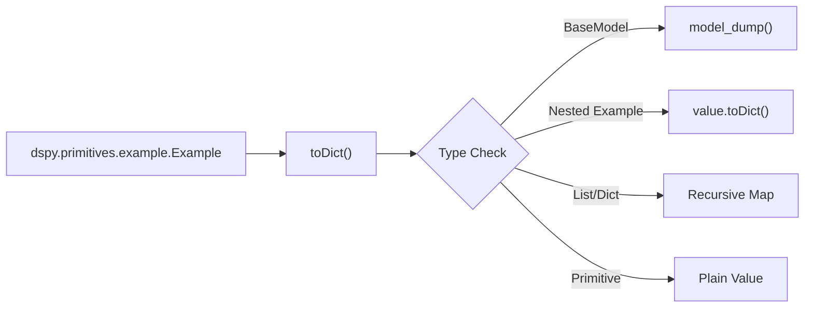

example = dspy.Example(question="What is 2+2?", answer="4").with_inputs("question")
```

### Input and Label Extraction

Once inputs are defined, `inputs()` and `labels()` allow subsetting the data: [dspy/primitives/example.py:211-226]()

- **`inputs()`**: Returns a new `Example` containing only fields present in `_input_keys`. [dspy/primitives/example.py:211-218]()
- **`labels()`**: Returns a new `Example` containing all fields *not* in `_input_keys`. [dspy/primitives/example.py:220-226]()

**Sources:**
- [dspy/primitives/example.py:205-226]()
- [tests/primitives/test_example.py:100-111]()

---

## Prediction & Completions

The `Prediction` class extends `Example` to represent module outputs. It adds support for multi-candidate outputs and usage tracking. [dspy/primitives/prediction.py:4-16]()

### Multi-Completion Handling

Modules often generate multiple candidate responses. These are managed via the `Completions` class. [dspy/primitives/prediction.py:119-122]()

- **`from_completions`**: Factory method to create a `Prediction` from a list of dicts. The first completion is used to populate the main `_store`. [dspy/primitives/prediction.py:34-39]()
- **Score Arithmetic**: If a `Prediction` has a `score` field, it supports comparison (`<`, `>`, `==`) and arithmetic (`+`, `/`) directly on the score value. [dspy/primitives/prediction.py:53-112]()

### Majority Voting

The `majority()` function in `dspy.predict.aggregation` can process a `Prediction` (or its `Completions`) to find the most frequent output value for a specific field. [dspy/predict/aggregation.py:9-14]()

**Sources:**
- [dspy/primitives/prediction.py:4-174]()
- [dspy/predict/aggregation.py:9-55]()
- [tests/predict/test_aggregation.py:6-44]()

---

## Data Loading (DataLoader)

The `DataLoader` class simplifies the conversion of external datasets into `dspy.Example` lists. [dspy/datasets/dataloader.py:12-14]()

### Supported Formats

| Method | Source | Implementation |
|--------|--------|----------------|
| `from_huggingface` | HuggingFace Hub | Uses `datasets.load_dataset` [dspy/datasets/dataloader.py:16-32]() |
| `from_csv` | Local CSV file | Loads as HF dataset "csv" [dspy/datasets/dataloader.py:63-71]() |
| `from_json` | Local JSON file | Loads as HF dataset "json" [dspy/datasets/dataloader.py:91-99]() |
| `from_pandas` | DataFrame object | Iterates via `df.iterrows()` [dspy/datasets/dataloader.py:78-89]() |
| `from_rm` | Retrieval Module | Calls `rm.get_objects` [dspy/datasets/dataloader.py:121-128]() |

### Splitting and Sampling

`DataLoader` and the base `Dataset` class provide utilities for preparing data: [dspy/datasets/dataloader.py:138-190]()

- **`sample`**: Randomly samples `n` examples from a list. [dspy/datasets/dataloader.py:138-150]()
- **`train_test_split`**: Splits a dataset into training and testing sets based on size or proportion. [dspy/datasets/dataloader.py:152-190]()
- **`_shuffle_and_sample`**: Internal method in `Dataset` that assigns unique `dspy_uuid` and `dspy_split` metadata to examples. [dspy/datasets/dataset.py:79-103]()

**Sources:**
- [dspy/datasets/dataloader.py:12-190]()
- [dspy/datasets/dataset.py:12-103]()

---

## Serialization

The `toDict()` method provides deep serialization of `Example` objects, ensuring they are JSON-compatible for logging or persistence. [dspy/primitives/example.py:240-258]()

**Serialization Logic Flow**


This serialization is critical for handling complex types like `dspy.History` (which is a `pydantic.BaseModel`) or nested `Example` objects within a single data record. [tests/primitives/test_example.py:128-157]()

**Sources:**
- [dspy/primitives/example.py:240-258]()
- [tests/primitives/test_example.py:123-157]()