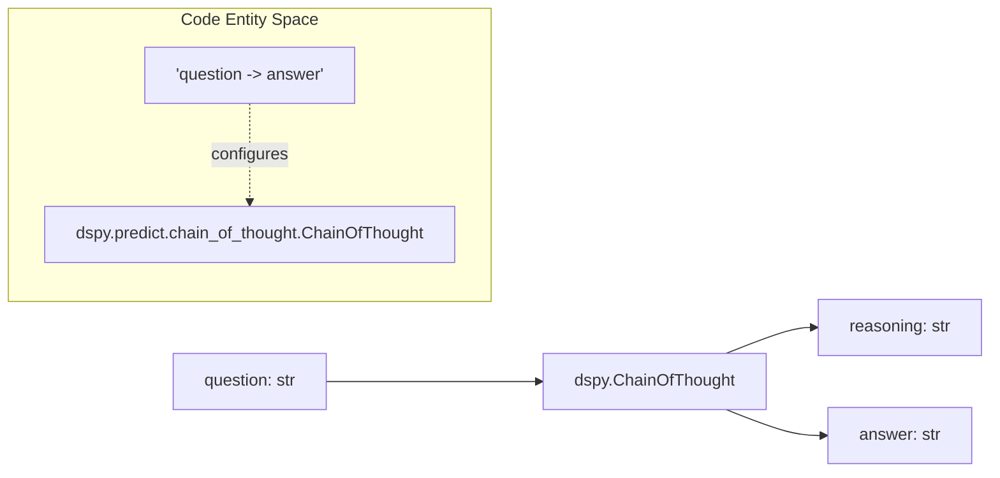
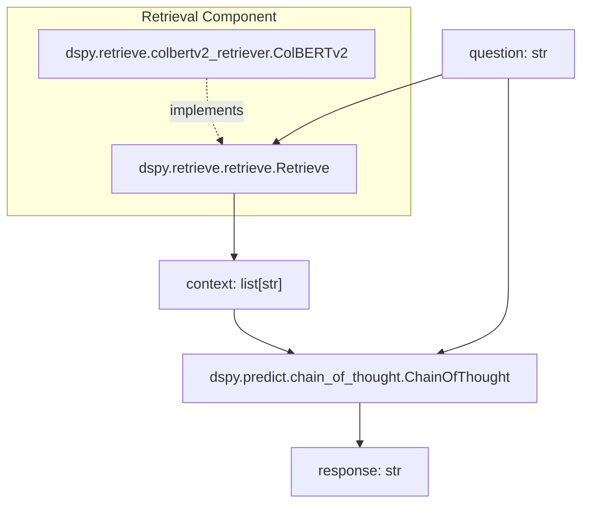
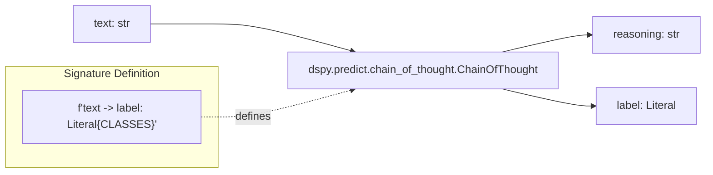
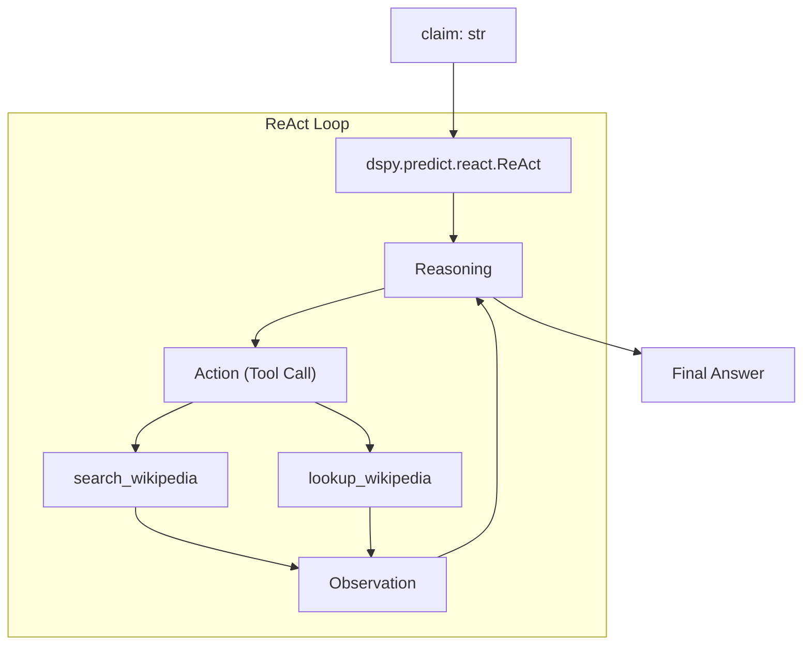
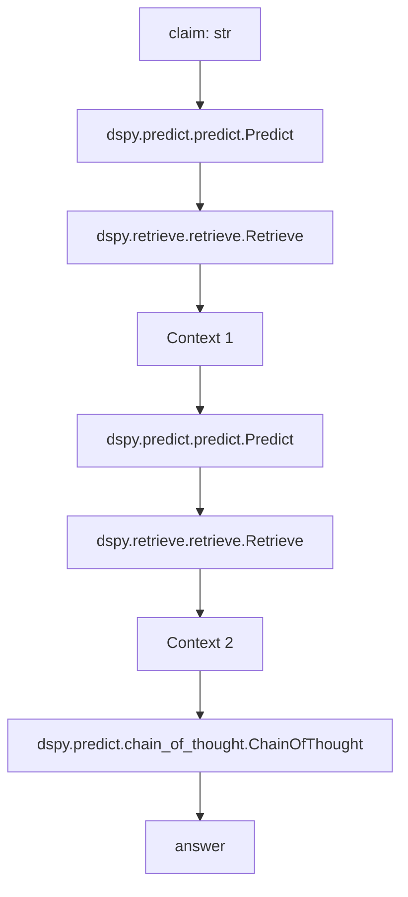
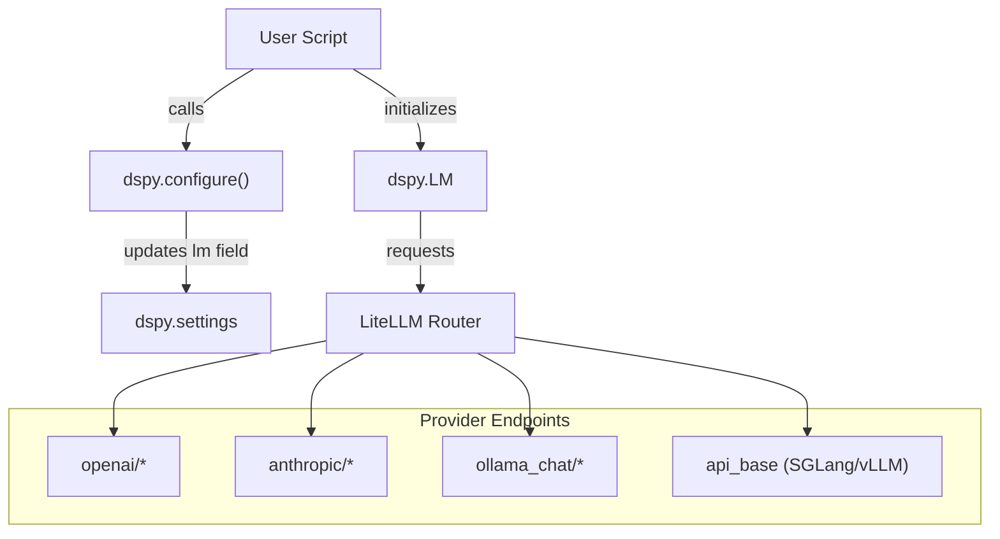
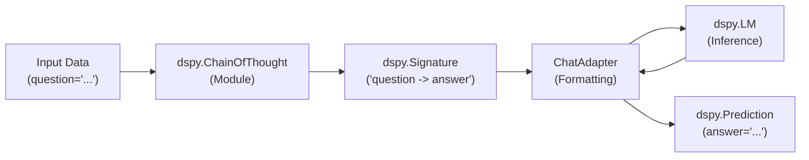

This page showcases common use cases and application patterns in DSPy, demonstrating how the framework's core abstractions (Signatures, Modules, and Optimizers) apply to real-world AI tasks. Each use case includes architectural patterns, relevant modules, and code references from the documentation.

---

## Overview of DSPy Applications

DSPy supports a wide range of AI applications through its modular, composable architecture. The framework is in production at companies like **Shopify, Databricks, Dropbox, and AWS** [docs/docs/community/use-cases.md:1-14](). It excels at tasks that benefit from systematic prompt optimization and structured workflows, particularly:

- **Multi-step reasoning** (e.g., Multi-hop search).
- **Tool-augmented workflows** (e.g., ReAct agents).
- **Structured metadata extraction** (e.g., Shopify's 550x cost reduction via GEPA) [docs/docs/community/use-cases.md:20-25]().
- **Domain-specific reasoning** (e.g., Math, Law, Medical reports) [docs/docs/community/use-cases.md:56-57]().

**Sources:** [docs/docs/community/use-cases.md:1-71](), [docs/docs/tutorials/rag/index.ipynb:7-11]()

---

## Mathematical Reasoning

### Overview
Mathematical reasoning involves solving quantitative problems through step-by-step logic. DSPy's `ChainOfThought` module is the standard for these tasks, as it forces the LM to produce a `reasoning` trace before the final `answer` [docs/docs/tutorials/math/index.ipynb:159-161]().

### Architecture Pattern

**Diagram: Mathematical Reasoning Flow**

### Example Implementation
The documentation demonstrates solving algebra questions from the MATH benchmark [docs/docs/tutorials/math/index.ipynb:101-131]().

```python
module = dspy.ChainOfThought("question -> answer")
response = module(question="If x + y = 10 and x - y = 2, what is x?")
```
For higher precision, `ProgramOfThought` can be used to generate Python code that is executed via a `PythonInterpreter` to avoid calculation errors.

**Sources:** [docs/docs/tutorials/math/index.ipynb:1-162](), [docs/docs/tutorials/deployment/index.md:11-12]()

---

## Retrieval-Augmented Generation (RAG)

### Overview
RAG systems enhance LM responses by retrieving relevant context from external knowledge bases. DSPy provides native integration for retrievers like `ColBERTv2` and `BM25S` [docs/docs/tutorials/rag/index.ipynb:165-180](), [docs/docs/tutorials/multihop_search/index.ipynb:153-162]().

### Architecture Pattern

**Diagram: RAG System Architecture**

### Implementation
A basic RAG module typically includes a retrieval step followed by a generation step using a signature like `context, question -> response` [docs/docs/tutorials/rag/index.ipynb:205-220]().

```python
import dspy
lm = dspy.LM('openai/gpt-4o-mini')
dspy.configure(lm=lm)
retriever = dspy.ColBERTv2(url='http://20.102.90.50:2017/wiki17_abstracts')
```

**Sources:** [docs/docs/tutorials/rag/index.ipynb:1-220](), [docs/docs/tutorials/multihop_search/index.ipynb:153-162]()

---

## Classification & Fine-tuning

### Overview
Classification involves assigning categorical labels. DSPy's typed signature system allows using `Literal` to restrict outputs to specific classes [docs/docs/tutorials/classification_finetuning/index.ipynb:194-197]().

### Architecture Pattern

**Diagram: Classification Module Structure**

### Production Scaling
For high-throughput tasks, DSPy supports bootstrapping fine-tuning (e.g., using `BootstrapFinetune`) to distill reasoning from a large model (GPT-4o) into a tiny local model like `Llama-3.2-1B` [docs/docs/tutorials/classification_finetuning/index.ipynb:7-13]().

**Sources:** [docs/docs/tutorials/classification_finetuning/index.ipynb:1-198](), [docs/docs/community/use-cases.md:42-43]()

---

## Agent Systems (ReAct)

### Overview
Agents use tools and reasoning loops to solve complex tasks. DSPy's `dspy.ReAct` module implements this by consuming a signature and a list of tool functions [docs/docs/tutorials/agents/index.ipynb:192-205]().

### Architecture Pattern

**Diagram: ReAct Agent Architecture**

### Tool Integration
Tools are defined as standard Python functions with docstrings, which DSPy uses to describe the tool to the LM [docs/docs/tutorials/agents/index.ipynb:177-183]().

```python
def search_wikipedia(query: str) -> list[str]:
    """Returns top-5 results from Wikipedia."""
    return dspy.ColBERTv2(url='...')(query, k=5)

agent = dspy.ReAct("question -> answer", tools=[search_wikipedia])
```

**Sources:** [docs/docs/tutorials/agents/index.ipynb:1-205](), [docs/docs/tutorials/games/index.ipynb:176-180]()

---

## Information & Entity Extraction

### Overview
Extraction tasks involve structuring unstructured text into specific fields. DSPy signatures can define multiple output fields like `extracted_people` or `action_items` [docs/docs/tutorials/entity_extraction/index.ipynb:143-146](), [docs/docs/tutorials/real_world_examples/index.md:12-16]().

### Implementation Example
In the CoNLL-2003 tutorial, a signature is used to extract person names from tokens [docs/docs/tutorials/entity_extraction/index.ipynb:7-13]():

```python
class EntityExtraction(dspy.Signature):
    """Extract entities referring to people from tokenized text."""
    tokens: list[str] = dspy.InputField()
    extracted_people: list[str] = dspy.OutputField()

module = dspy.Predict(EntityExtraction)
```

**Sources:** [docs/docs/tutorials/entity_extraction/index.ipynb:1-156](), [docs/docs/tutorials/llms_txt_generation/index.md:27-57]()

---

## Multi-Hop Reasoning

### Overview
Multi-hop reasoning requires sequential steps where the output of one step informs the next (e.g., generating a search query based on initial findings) [docs/docs/tutorials/multihop_search/index.ipynb:7-11]().

### Architecture Pattern

**Diagram: Multi-Hop Retrieval Flow**

**Sources:** [docs/docs/tutorials/multihop_search/index.ipynb:1-230](), [docs/docs/tutorials/agents/index.ipynb:84-107]()

# Installation & Quick Start


This page guides you through installing DSPy, configuring a language model, and writing your first DSPy program. DSPy (Declarative Self-improving Python) shifts the focus from manual prompt engineering to programming with structured natural-language modules.

## Prerequisites

DSPy requires:
- **Python 3.10 or higher** (up to 3.14). [pyproject.toml:16-16]()
- An API key for a language model provider (OpenAI, Anthropic, etc.) or a local LM server like Ollama or SGLang. [docs/docs/learn/programming/language_models.md:17-124]()

---

## Installation

### Basic Installation

Install the latest version of DSPy from PyPI:

```bash
pip install -U dspy
```

This installs core dependencies including `litellm` for provider abstraction, `pydantic` for schema validation, and `diskcache` for automatic request caching. [pyproject.toml:23-41]()

### Optional Dependencies

DSPy uses optional extras for specific integrations:

| Feature | Installation Command | Purpose |
|---------|---------------------|---------|
| Anthropic | `pip install dspy[anthropic]` | Native Anthropic client support. [pyproject.toml:45-45]() |
| Weaviate | `pip install dspy[weaviate]` | Integration with Weaviate vector database. [pyproject.toml:46-46]() |
| MCP | `pip install dspy[mcp]` | Model Context Protocol for tool use. [pyproject.toml:47-47]() |
| Optuna | `pip install dspy[optuna]` | Required for Bayesian optimization in `MIPROv2`. [pyproject.toml:49-49]() |
| Dev Tools | `pip install dspy[dev]` | Includes `pytest`, `ruff`, and `pre-commit`. [pyproject.toml:50-61]() |

**Sources:** [pyproject.toml:44-68]()

---

## Configuration

### Configuration Architecture

DSPy uses a global settings object to manage the default language model (LM) and adapter.



**Configuration Flow from Code to Provider**
**Sources:** [docs/docs/learn/programming/language_models.md:7-13](), [pyproject.toml:30-30]()

### Setting Up Your Language Model

The `dspy.LM` class is the primary interface for language models. Once initialized, it should be passed to `dspy.configure`. [docs/docs/learn/programming/language_models.md:9-13]()

#### Cloud Providers (OpenAI, Anthropic, Gemini)
```python
import dspy

# OpenAI
lm = dspy.LM("openai/gpt-4o-mini", api_key="YOUR_KEY")
# Anthropic
# lm = dspy.LM("anthropic/claude-3-5-sonnet-latest", api_key="YOUR_KEY")

dspy.configure(lm=lm)
```
**Sources:** [docs/docs/learn/programming/language_models.md:17-43]()

#### Local Models (Ollama)
First, install Ollama and run `ollama run llama3.2`. Then connect via DSPy:
```python
import dspy
lm = dspy.LM('ollama_chat/llama3.2', api_base='http://localhost:11434', api_key='')
dspy.configure(lm=lm)
```
**Sources:** [docs/docs/learn/programming/language_models.md:110-124]()

---

## Quick Start: Your First Program

### Execution Flow: Natural Language to Code

DSPy translates declarative **Signatures** into optimized prompts using **Modules**.



**Data Flow through DSPy Primitives**
**Sources:** [docs/docs/learn/programming/language_models.md:161-168](), [docs/docs/cheatsheet.md:32-40]()

### Example: Basic QA with Chain of Thought

```python
import dspy