# stanfordnlp/dspy — DeepWiki Notes

Source: https://deepwiki.com/stanfordnlp/dspy


# dspy Documentation Index

This file contains links to all extracted documents.
Please refer to the files below for detailed information.

- [Introduction](dspy/Introduction.md)
- [Overview](dspy/Overview.md)
- [Use Cases  Applications](dspy/Use_Cases__Applications.md)
- [1. Setup](dspy/1._Setup.md)
- [2. Define Module with inline Signature](dspy/2._Define_Module_with_inline_Signature.md)
- [question - answer defines the input and output fields](dspy/question_-_answer_defines_the_input_and_output_fields.md)
- [3. Execute](dspy/3._Execute.md)
- [1. Define data](dspy/1._Define_data.md)
- [2. Define program](dspy/2._Define_program.md)
- [3. Optimize Labeled Few-Shot](dspy/3._Optimize_Labeled_Few-Shot.md)
- [4. SaveLoad](dspy/4._SaveLoad.md)
- [Test 1 Direct Call Uses automatic caching](dspy/Test_1_Direct_Call_Uses_automatic_caching.md)
- [Test 2 Forcing fresh output via rollout id](dspy/Test_2_Forcing_fresh_output_via_rollout_id.md)
- [Provide a unique rollout id to bypass existing cache](dspy/Provide_a_unique_rollout_id_to_bypass_existing_cache.md)
- [Language Model Integration](dspy/Language_Model_Integration.md)
- [Signatures  Task Definition](dspy/Signatures__Task_Definition.md)
- [Adapter System](dspy/Adapter_System.md)
- [Module System  Base Classes](dspy/Module_System__Base_Classes.md)
- [Example  Data Primitives](dspy/Example__Data_Primitives.md)
- [Usage example](dspy/Usage_example.md)
- [Building DSPy Programs](dspy/Building_DSPy_Programs.md)
- [1. Configure the language model](dspy/1._Configure_the_language_model.md)
- [2. Define a signature input - output](dspy/2._Define_a_signature_input_-_output.md)
- [3. Create a module that uses this signature](dspy/3._Create_a_module_that_uses_this_signature.md)
- [4. Execute the module](dspy/4._Execute_the_module.md)
- [Single input single output](dspy/Single_input_single_output.md)
- [Multiple inputsoutputs](dspy/Multiple_inputsoutputs.md)
- [Create a predictor](dspy/Create_a_predictor.md)
- [Execute with keyword arguments](dspy/Execute_with_keyword_arguments.md)
- [Access output fields](dspy/Access_output_fields.md)
- [Save state](dspy/Save_state.md)
- [Load state](dspy/Load_state.md)
- [Predict Module](dspy/Predict_Module.md)
- [CodeAct will generate printfactorial5](dspy/CodeAct_will_generate_printfactorial5.md)
- [Custom Types  Multimodal Support](dspy/Custom_Types__Multimodal_Support.md)
- [Module Composition  Refinement](dspy/Module_Composition__Refinement.md)
- [History  Conversation Management](dspy/History__Conversation_Management.md)
- [Evaluation Framework](dspy/Evaluation_Framework.md)
- [Few-Shot Optimizers](dspy/Few-Shot_Optimizers.md)
- [GEPA  SIMBA Reflective and Stochastic Optimization](dspy/GEPA__SIMBA_Reflective_and_Stochastic_Optimization.md)
- [Fine-tuning  Weight Optimization](dspy/Fine-tuning__Weight_Optimization.md)
- [Advanced Features](dspy/Advanced_Features.md)
- [Caching  Performance Optimization](dspy/Caching__Performance_Optimization.md)
- [Parallel  Async Execution](dspy/Parallel__Async_Execution.md)
- [Streaming Output](dspy/Streaming_Output.md)
- [1. Define Signature and Module](dspy/1._Define_Signature_and_Module.md)
- [2. Setup Listener for specific field](dspy/2._Setup_Listener_for_specific_field.md)
- [3. Wrap with streamify](dspy/3._Wrap_with_streamify.md)
- [4. Consume stream](dspy/4._Consume_stream.md)
- [From dspyutilssaving.py15-24](dspy/From_dspyutilssaving.py15-24.md)
- [Assertions  Output Validation](dspy/Assertions__Output_Validation.md)
- [Configuration  Integration](dspy/Configuration__Integration.md)
- [Settings  Configuration Management](dspy/Settings__Configuration_Management.md)
- [Model Providers  LiteLLM Integration](dspy/Model_Providers__LiteLLM_Integration.md)
- [Result openaigpt-4o prompt tokens 150 completion tokens 50 ...](dspy/Result_openaigpt-4o_prompt_tokens_150_completion_tokens_50_....md)
- [External Framework Integration](dspy/External_Framework_Integration.md)
- [Development  Contributing](dspy/Development__Contributing.md)
- [Build System  CICD](dspy/Build_System__CICD.md)
- [Testing Framework](dspy/Testing_Framework.md)
- [Run Deno-based tests](dspy/Run_Deno-based_tests.md)
- [Run Reliability tests](dspy/Run_Reliability_tests.md)
- [Documentation System](dspy/Documentation_System.md)
- [Package Metadata  Release Process](dspy/Package_Metadata__Release_Process.md)

dspy.configure(lm=dspy.LM('openai/gpt-4o-mini'))
predict = dspy.Predict("question -> answer")
trainset = [dspy.Example(question="1+1", answer="2").with_inputs("question")]
dspy.configure(lm=dspy.LM("openai/gpt-4o-mini"))

signature = "question -> answer"
program = dspy.Predict("question -> answer")
listeners = [StreamListener(signature_field_name="answer")]
predict = dspy.Predict(signature)
response = qa(question="How many floors are in the castle David Gregory inherited?")

print(f"Reasoning: {response.reasoning}")
print(f"Answer: {response.answer}")
```
**Sources:** [docs/docs/learn/programming/language_models.md:161-168](), [docs/docs/cheatsheet.md:32-40]()

### Example: Typed Signature

You can define complex signatures using Python classes for better structure and validation.

```python
class BasicQA(dspy.Signature):
    """Answer questions with short factoid answers."""

    question: str = dspy.InputField()
    answer: str = dspy.OutputField(desc="often between 1 and 5 words")

generate_answer = dspy.ChainOfThought(BasicQA)
pred = generate_answer(question="What is the color of the sky?")
print(pred.answer)
```
**Sources:** [docs/docs/cheatsheet.md:25-30](), [docs/docs/cheatsheet.md:32-40]()

---

## Advanced Quick Start: Optimization

A unique feature of DSPy is the ability to **compile** programs. Optimizers tune your prompts or weights based on a metric. [dspy/teleprompt/simba.py:16-26]()

### Simple Optimization Flow
```python
from dspy.teleprompt import LabeledFewShot
optimizer = LabeledFewShot(k=1)
compiled_program = optimizer.compile(student=program, trainset=trainset)
stream_predict = dspy.streamify(predict, stream_listeners=listeners)
async def run():
    async for chunk in stream_predict(question="What is DSPy?"):
        if isinstance(chunk, dspy.streaming.StreamResponse):
            print(f"Token: {chunk.chunk}")
        elif isinstance(chunk, dspy.Prediction):
            print(f"Final: {chunk.answer}")
```

Sources: [dspy/streaming/streamify.py:126-132](), [docs/docs/tutorials/streaming/index.md:27-34](), [dspy/streaming/messages.py:12-17]()

# State Management & Serialization


This document covers DSPy's state management and serialization system, which enables saving and loading optimized programs, preserving demonstration examples, and deploying trained models. This system is essential for persisting the results of optimization workflows and sharing DSPy programs across environments.

## Overview

DSPy provides state management capabilities at three levels of granularity:

1.  **Module State** (`Predict`, `ChainOfThought`, etc.) - Includes demonstrations, traces, signature configuration, and LM settings [dspy/predict/predict.py:71-90]().
2.  **Signature State** - Instructions and field metadata (prefixes, descriptions) [dspy/signatures/signature.py:236-248]().
3.  **LM State** - Model configuration parameters [dspy/clients/lm.py:126-140]().

Each component implements `dump_state()` and `load_state()` methods that serialize to JSON-compatible dictionaries. The system supports both JSON and pickle formats for persistence to disk, as well as whole-program serialization using `cloudpickle` [dspy/primitives/base_module.py:168-181]().

## State Management Architecture

The following diagram illustrates the flow of data during serialization and the relationship between different stateful entities.

### State Persistence Flow
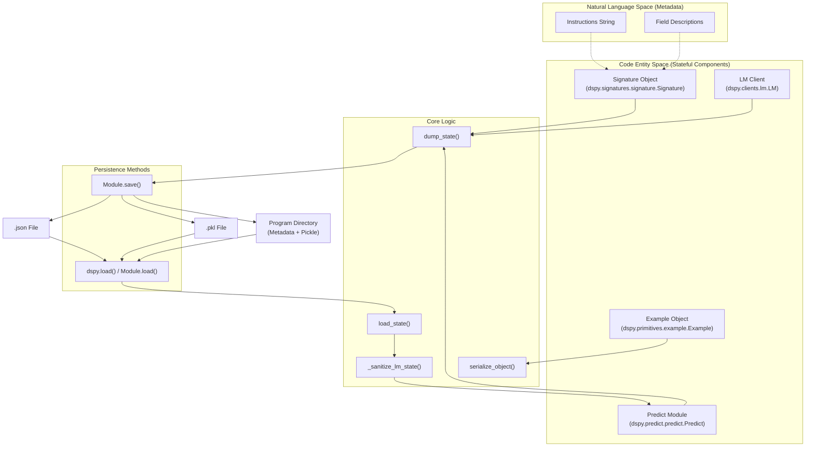
**Sources:** [dspy/predict/predict.py:71-116](), [dspy/primitives/base_module.py:156-181](), [dspy/utils/saving.py:27-61]()

## Module State Management

The `Predict` class (and its subclasses like `ChainOfThought`, `ReAct`) implement comprehensive state management. The base `Module` class also provides mechanisms for recursive state handling across nested sub-modules [dspy/primitives/base_module.py:156-167]().

### State Components

| Component | Type | Description |
|-----------|------|-------------|
| `demos` | `list[Example]` | Few-shot demonstration examples, typically populated by optimizers [dspy/predict/predict.py:75-87](). |
| `traces` | `list` | Execution traces captured during program runs [dspy/predict/predict.py:72](). |
| `train` | `list` | Training data used during optimization [dspy/predict/predict.py:72](). |
| `signature` | `dict` | Serialized signature state (instructions and field metadata) [dspy/predict/predict.py:88](). |
| `lm` | `dict` or `None` | Serialized LM configuration, if an LM has been bound to the module [dspy/predict/predict.py:89](). |

### Security and Unsafe LM State
When loading an LM state, DSPy protects against potentially malicious configurations by filtering "unsafe" keys unless explicitly allowed.

| Unsafe Key | Description |
|------------|-------------|
| `api_base` | The base URL for the API endpoint. |
| `base_url` | Alternative key for the API endpoint. |
| `model_list` | List of models available to the client. |

The `_sanitize_lm_state` function handles this filtering [dspy/predict/predict.py:25-40](). Users must pass `allow_unsafe_lm_state=True` to `load_state` or `load` to preserve these keys when working with trusted files [dspy/predict/predict.py:92-116]().

**Sources:** [dspy/predict/predict.py:22-40](), [dspy/predict/predict.py:92-116]()

### Implementation: Dump and Load
The `Predict.dump_state` method iterates through `traces`, `train`, and `demos`, applying `serialize_object` to ensure JSON compatibility [dspy/predict/predict.py:71-90]().

The `Predict.load_state` method reconstructs the signature and LM. Notably, it raises a `NotImplementedError` if it encounters the legacy `extended_signature` key from DSPy versions <= 2.5 [dspy/predict/predict.py:113-114]().

**Sources:** [dspy/predict/predict.py:71-116]()

## Program Persistence (Whole Program Saving)

Starting from DSPy 2.6.0, the framework supports saving the entire program architecture along with its state using `cloudpickle` [docs/docs/tutorials/saving/index.md:82-88]().

### Save and Load Mechanism
When `save(path, save_program=True)` is called on a `Module`, DSPy creates a directory containing:
1.  `program.pkl`: The serialized Python object via `cloudpickle` [dspy/utils/saving.py:60-61]().
2.  `metadata.json`: Dependency versions (Python, dspy, cloudpickle) to detect environment mismatches [dspy/utils/saving.py:15-24]().

### Serializing Imported Modules
If a program depends on custom modules not present in the standard environment, they can be registered for serialization by value using the `modules_to_serialize` parameter [dspy/primitives/base_module.py:168-181](). This uses `cloudpickle.register_pickle_by_value` internally to ensure dependencies are bundled [docs/docs/tutorials/saving/index.md:117-120]().

### Environment Validation
The `dspy.load` utility checks the current environment against the saved metadata. If versions of `python`, `dspy`, or `cloudpickle` differ, it issues a warning regarding potential performance downgrades or errors [dspy/utils/saving.py:49-58]().

**Sources:** [dspy/primitives/base_module.py:168-181](), [dspy/utils/saving.py:15-61](), [docs/docs/tutorials/saving/index.md:77-106]()

## Serialization Utilities

### Object Serialization
The `serialize_object` function recursively converts complex Python objects into JSON-compatible formats [dspy/predict/predict.py:219-236]().

| Input Type | Strategy |
|------------|----------|
| `pydantic.BaseModel` | `model_dump(mode="json")` [dspy/predict/predict.py:225-227]() |
| `list` / `tuple` | Recursive call on each element [dspy/predict/predict.py:228-231]() |
| `dict` | Recursive call on each value [dspy/predict/predict.py:232-233]() |

### Dependency Tracking
The system tracks the specific versions of the stack used during serialization to ensure reproducibility.

```python
result = predict(question="What is the capital of France?")
print(result.answer)  # "Paris"
```

**Sources:** [dspy/predict/predict.py:43-64](), [dspy/dsp/utils/settings.py:12-15]()

## Core Building Blocks

DSPy programs are constructed from three primary abstractions that work together to define, execute, and optimize language model interactions.

### Program Building Blocks Diagram

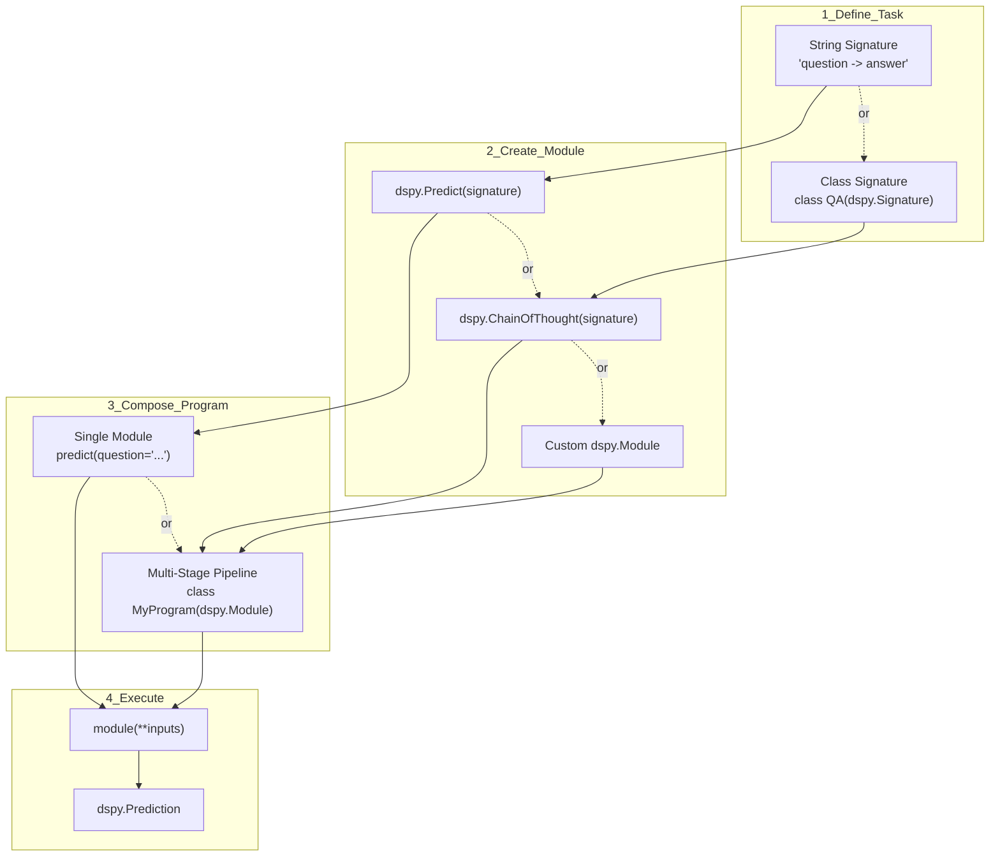

**Sources:** [dspy/predict/predict.py:43-64](), [dspy/primitives/module.py:1-50](), [dspy/predict/chain_of_thought.py:12-35]()

### Signature: Task Specification

A `Signature` declares the input and output fields for a task. Signatures define what the language model should do, separating task specification from implementation details.

**String Notation (Simple):**
```python
compiled_program.save("math_bot.json")
```
**Sources:** [docs/docs/cheatsheet.md:178-182](), [docs/docs/cheatsheet.md:214-224]()

### Optimization Strategies (SIMBA)
Optimizers like `SIMBA` (Stochastic Introspective Mini-Batch Ascent) use an LLM to analyze its own performance and generate improvement rules or select demonstrations. [dspy/teleprompt/simba.py:18-24]()

```python
from dspy.teleprompt import SIMBA

# SIMBA identifies challenging examples and creates self-reflective rules
optimizer = SIMBA(metric=your_metric, max_steps=8, max_demos=4)
compiled_program = optimizer.compile(student=program, trainset=trainset)
```
**Sources:** [dspy/teleprompt/simba.py:28-42](), [dspy/teleprompt/simba.py:85-91]()

---

## Testing Your Installation

To verify that DSPy is correctly communicating with your LM and utilizing the cache:

```python
import dspy
lm = dspy.LM("openai/gpt-4o-mini")
dspy.configure(lm=lm)
print(result.answer)  # "4"
```

Key characteristics of `dspy.Predict`:
- Only accepts **keyword arguments** matching signature input fields [dspy/predict/predict.py:126-128]()
- Returns a `dspy.Prediction` object [dspy/predict/predict.py:15]()
- Maintains state (demonstrations, traces) for optimization [dspy/predict/predict.py:65-69]()

**Sources:** [dspy/predict/predict.py:43-64](), [tests/predict/test_predict.py:71-77](), [dspy/predict/predict.py:126-128]()

### Common Predict Patterns

**Typed Outputs:**
```python
class QA(dspy.Signature):
    question: str = dspy.InputField()
    answer: str = dspy.OutputField()
    confidence: float = dspy.OutputField()

predict = dspy.Predict(QA)
result = predict(question="Is Paris in France?")
```

**Multiple Completions:**
```python
predict = dspy.Predict("question -> answer", n=3)
result = predict(question="What is AI?")
```

**Configuration Override:**
```python
predict = dspy.Predict("question -> answer", temperature=0.7)

# Override for single call
result = predict(
    question="Be creative!",
    config={"temperature": 1.0, "max_tokens": 200}
)
```

**Sources:** [tests/predict/test_predict.py:118-131](), [dspy/predict/predict.py:49-56](), [dspy/predict/predict.py:143]()

### Program Execution Flow

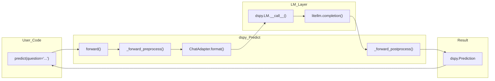

The execution flow involves:
1. **Preprocessing**: Resolves LM, merges configs, validates inputs [dspy/predict/predict.py:138-160]()
2. **Adapter formatting**: Converts signature + inputs to LM messages [dspy/predict/predict.py:189-192]()
3. **LM invocation**: Calls language model via the configured LM client [dspy/predict/predict.py:192]()
4. **Postprocessing**: Parses outputs into structured `Prediction` [dspy/predict/predict.py:194-200]()

For detailed lifecycle documentation, see [Predict Module](#3.1).

**Sources:** [dspy/predict/predict.py:138-200](), [dspy/adapters/chat_adapter.py:9]()

## Configuration

DSPy provides multiple configuration levels that cascade from global to call-time scope.

### Configuration Hierarchy

| Level | Method | Scope | Example |
|-------|--------|-------|---------|
| **Global** | `dspy.configure()` | All modules | `dspy.configure(lm=dspy.LM('openai/gpt-4o'))` |
| **Instance** | Constructor kwargs | Single module | `dspy.Predict("q -> a", temperature=0.9)` |
| **Call-time** | `config={}` parameter | Single call | `predict(q="...", config={"temperature": 0.5})` |

**Resolution order:** Call-time > Instance > Global [dspy/predict/predict.py:143-146]()

**Sources:** [dspy/predict/predict.py:143-146](), [dspy/dsp/utils/settings.py:12-15]()

## Program Composition

DSPy programs are built by composing multiple modules.

### Sequential Composition

One module's output feeds into another's input within a custom `dspy.Module`.

```python
class MultiStepRAG(dspy.Module):
    def __init__(self):
        super().__init__()
        self.retrieve = dspy.Retrieve(k=5)
        self.answer = dspy.Predict("passages, question -> answer")
    
    def forward(self, question):
        context = self.retrieve(question).passages
        return self.answer(passages=context, question=question)
```

**Sources:** [dspy/primitives/module.py:1-50]()

### Iterative Refinement

Programs can iteratively improve outputs through multiple passes. See [Module Composition & Refinement](#3.5) for built-in refinement modules.

## State Management and Persistence

DSPy modules maintain state that can be saved and reloaded.

### Saving and Loading Programs

```python
The Adapter System serves as the interface layer between DSPy's programming abstractions (signatures, modules) and Language Models. Adapters transform DSPy signatures and inputs into LM-specific prompt formats, then parse LM responses back into structured dictionaries matching the signature's output fields. This layer enables DSPy to work consistently across different LM providers and prompt formats while maintaining a uniform programming model.

## Architecture Overview

The adapter system follows a hierarchy with `Adapter` as the base class and specialized implementations for different prompt formats.

Title: Adapter Class Hierarchy and Data Flow
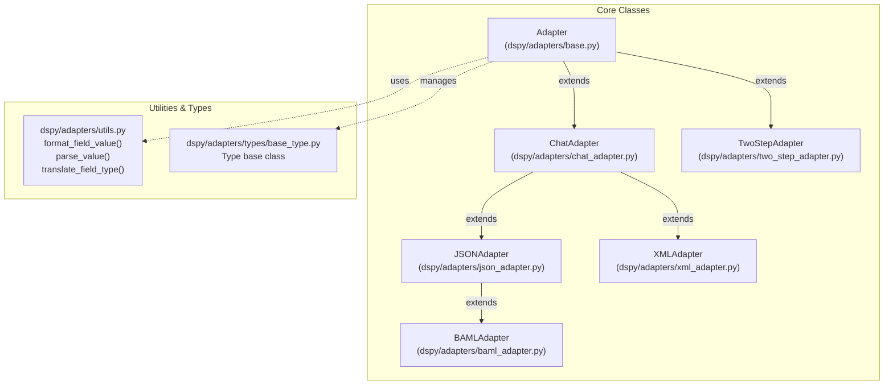
**Sources:** [dspy/adapters/base.py:21-36](), [dspy/adapters/chat_adapter.py:28-38](), [dspy/adapters/json_adapter.py:40-43](), [dspy/adapters/xml_adapter.py:12-16](), [dspy/adapters/two_step_adapter.py:21-40](), [dspy/adapters/baml_adapter.py:163-164]()

## Adapter Execution Flow

When a DSPy module (like `dspy.Predict`) makes an LM call, the adapter orchestrates the transformation pipeline.

Title: Signature to LM Message Transformation
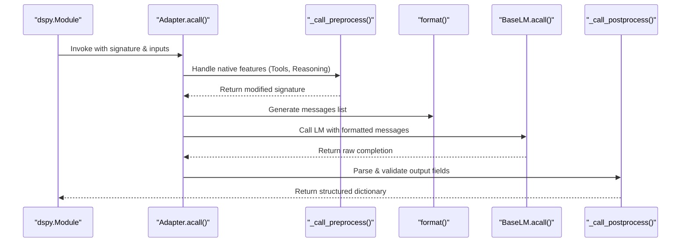
**Sources:** [dspy/adapters/base.py:175-217](), [dspy/adapters/base.py:219-293](), [dspy/adapters/base.py:520-533]()

## Base Adapter Class

The `Adapter` class defines the core interface for all implementations. It manages the lifecycle of an LM request, including preprocessing for native features and postprocessing for output validation.

### Constructor Configuration
The `Adapter.__init__` [dspy/adapters/base.py:38-59]() accepts:
* `callbacks`: Hooks for logging or monitoring.
* `use_native_function_calling`: Enables `dspy.Tool` integration with provider APIs.
* `native_response_types`: Types like `Citations` or `Reasoning` that use built-in LM capabilities [dspy/adapters/base.py:57-58]().

### Native Feature Handling
* **Preprocessing**: `_call_preprocess` [dspy/adapters/base.py:66-108]() detects if a signature contains `dspy.Tool` or `dspy.Reasoning`. If the LM supports these natively (e.g., OpenAI function calling), it modifies `lm_kwargs` and strips these fields from the text prompt to avoid redundancy.
* **Postprocessing**: `_call_postprocess` [dspy/adapters/base.py:110-173]() re-assembles the final dictionary, extracting tool calls or reasoning blocks from specific LM response metadata (like `tool_calls` or `reasoning_content`) and placing them back into the expected signature fields.

**Sources:** [dspy/adapters/base.py:21-173]()

## Core Adapter Implementations

### ChatAdapter
The default adapter for most models. It uses text-based delimiters to delineate fields within chat messages.
* **Format**: Uses `[[ ## field_name ## ]]` headers [dspy/adapters/chat_adapter.py:20]().
* **Fallback**: Automatically retries with `JSONAdapter` if a non-context-window error occurs [dspy/adapters/chat_adapter.py:71-85]().
* **Structure**: Appends a `[[ ## completed ## ]]` marker to indicate the end of expected output [dspy/adapters/chat_adapter.py:136]().

### JSONAdapter
Extends `ChatAdapter` to enforce JSON structures, ideal for programmatic data extraction.
* **Structured Outputs**: If `lm.supports_response_schema` is true, it generates a strict Pydantic model from the signature via `_get_structured_outputs_response_format` to use OpenAI-style "Structured Output" mode [dspy/adapters/json_adapter.py:71-75]().
* **Parsing**: Uses `json_repair` to handle trailing commas or minor syntax errors in LM output [dspy/adapters/json_adapter.py:149]().

### XMLAdapter
Formats inputs and outputs within XML tags (e.g., `<answer>...</answer>`).
* **Regex Parsing**: Uses `re.compile(r"<(?P<name>\w+)>((?P<content>.*?))</\1>", re.DOTALL)` to extract field values [dspy/adapters/xml_adapter.py:15]().
* **Type Casting**: Raw XML string content is passed to `parse_value` to convert it to the signature's annotated type (int, bool, etc.) [dspy/adapters/xml_adapter.py:113]().

### TwoStepAdapter
A specialized adapter for reasoning models (like OpenAI o1/o3) that struggle with strict formatting.
1. **Step 1**: Sends a natural language prompt to the main LM to get a detailed response [dspy/adapters/two_step_adapter.py:50-75]().
2. **Step 2**: Uses a secondary `extraction_model` (typically a cheaper/faster model) to parse the first LM's output into the structured signature fields via `ChatAdapter` [dspy/adapters/two_step_adapter.py:77-105]().

### BAMLAdapter
Generates simplified, BAML-inspired schemas for complex Pydantic models to improve LM adherence.
* **Schema Generation**: Converts Pydantic models into a concise string representation via `_build_simplified_schema` with comments and "or null" syntax for optional fields [dspy/adapters/baml_adapter.py:89-160]().
* **Circular References**: Explicitly raises `ValueError` if recursive Pydantic models are detected [dspy/adapters/baml_adapter.py:103-104]().

**Sources:** [dspy/adapters/chat_adapter.py:28-110](), [dspy/adapters/json_adapter.py:40-103](), [dspy/adapters/xml_adapter.py:12-107](), [dspy/adapters/two_step_adapter.py:21-161](), [dspy/adapters/baml_adapter.py:89-166]()

## Data Formatting and Parsing Utilities

The system relies on `dspy/adapters/utils.py` to bridge the gap between Python objects and LM strings.

| Function | Role |
| :--- | :--- |
| `format_field_value` | Serializes Python types. Lists are converted to numbered strings; dicts to JSON [dspy/adapters/utils.py:45-75](). |
| `translate_field_type` | Generates "instructions" for the LM based on types (e.g., "must be one of: A; B" for Enums) [dspy/adapters/utils.py:93-118](). |
| `parse_value` | The inverse of formatting. It attempts `json_repair`, then Pydantic validation [dspy/adapters/utils.py:149-212](). |
| `serialize_for_json` | Uses Pydantic's `TypeAdapter` to dump objects into JSON-compatible primitives [dspy/adapters/utils.py:27-43](). |

**Sources:** [dspy/adapters/utils.py:27-212]()

## Custom Types and Multimodal Support

DSPy supports complex types (Image, Audio, Code) through the `dspy.Type` base class.

* **Identification**: Adapters use `CUSTOM_TYPE_START_IDENTIFIER` and `CUSTOM_TYPE_END_IDENTIFIER` to wrap multimodal data in the message stream [dspy/adapters/types/base_type.py:15-16]().
* **Splitting**: `split_message_content_for_custom_types` [dspy/adapters/types/base_type.py:135-195]() parses message strings back into blocks (e.g., text blocks and `image_url` blocks) compatible with multimodal LM APIs.
* **Reasoning Type**: The `Reasoning` type [dspy/adapters/types/reasoning.py:12-22]() delegates string methods (like `.strip()`) to its underlying content string via `__getattr__` [dspy/adapters/types/reasoning.py:149-163](), making it behave like a string while allowing the adapter to handle it as a native LM feature.

**Sources:** [dspy/adapters/types/base_type.py:15-195](), [dspy/adapters/types/reasoning.py:12-163]()
This page provides a unified overview of DSPy's advanced runtime capabilities: caching, asynchronous and parallel execution, streaming responses, program state serialization, output validation, and sandboxed code execution. These features are layered on top of the core `LM`, `Predict`, and `Module` abstractions and apply across most program patterns.

For foundational module construction, see [Building DSPy Programs](#3). For configuration of LM providers, see [Language Model Integration](#2.2). Each section below has a dedicated sub-page with full implementation details.

---

## Feature Areas at a Glance

| Feature | Primary Code Entities | Sub-Page |
|---|---|---|
| Caching | `request_cache`, `DSPY_CACHE`, `configure_cache`, `Cache` | [Caching & Performance Optimization](#5.1) |
| Async Execution | `LM.aforward`, `BaseLM.acall`, `asyncify`, `syncify` | [Parallel & Async Execution](#5.2) |
| Streaming Output | `streamify`, `StreamListener`, `StatusMessageProvider`, `StreamResponse` | [Streaming Output](#5.3) |
| State Management | `Predict.dump_state`, `Predict.load_state`, `Module.save`, `dspy.load` | [State Management & Serialization](#5.4) |
| Assertions & Validation | `dspy.Assert`, `dspy.Suggest`, `Retry` | [Assertions & Output Validation](#5.5) |
| Code Execution | `PythonInterpreter`, Deno/Pyodide, `JSON-RPC` | [Code Execution & Sandboxing](#5.6) |

---

## Caching & Performance Optimization

By default, every `LM` instance caches its responses. The cache is a two-tier system — memory first (LRU), then disk (Fanout) — implemented in `dspy/clients/cache.py` and exposed as `dspy.cache` (`DSPY_CACHE`).

### How Caching Fits Into the LM Call

**Diagram: LM Call with Cache Layers**

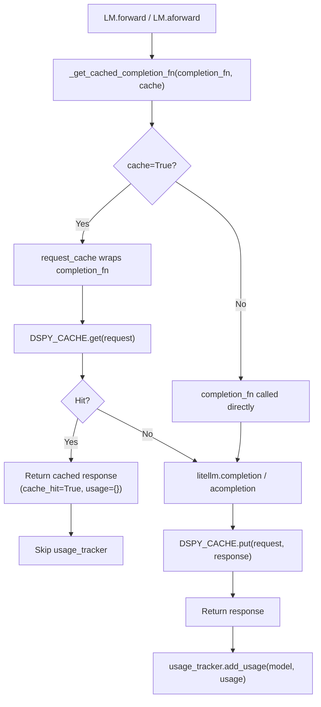
Sources: [dspy/clients/cache.py:40-46](), [dspy/clients/cache.py:115-147](), [dspy/clients/lm.py:133-169]()

### Cache Configuration

The cache is configured via `dspy.clients.configure_cache`. It supports `disk_cache_dir` (defaulting to `~/.dspy_cache`) and `disk_size_limit_bytes` (default 30GB).

```python
dspy.clients.configure_cache(
    enable_disk_cache=True,
    enable_memory_cache=True,
    disk_cache_dir=".dspy_cache",
)
```
Sources: [dspy/clients/__init__.py:16-17](), [dspy/clients/__init__.py:20-51](), [dspy/clients/cache.py:48-57]()

### Cache Key Computation

Cache keys are generated by hashing a JSON representation of the request. The `Cache.cache_key` method handles JSON-incompatible types by transforming Pydantic models and capturing source code for callables via `inspect.getsource`.

Sources: [dspy/clients/cache.py:24-37](), [dspy/clients/cache.py:104-113](), [tests/clients/test_cache.py:115-138]()

---

## Parallel & Async Execution

Every entry point in DSPy has a sync and an async variant. Async variants use Python `asyncio` and delegate to the corresponding `litellm.acompletion` / `litellm.aembedding` functions.

### Code Entity Map

**Diagram: Sync vs Async Execution Paths**

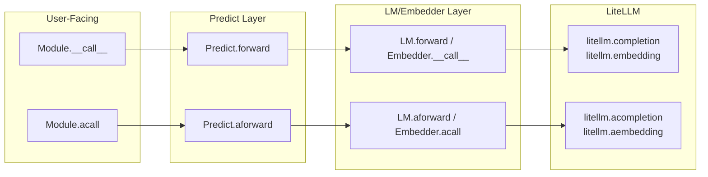
Sources: [dspy/clients/lm.py:133-207](), [dspy/clients/embedding.py:113-147](), [dspy/predict/predict.py:211-236]()

### `asyncify` and `syncify` Utilities

- `asyncify`: Converts a synchronous DSPy module method into an async-compatible coroutine. Used by `streamify` to wrap synchronous programs.
- `syncify`: Converts an async function into a blocking sync function. Used in `StatusStreamingCallback` to send messages to streams from synchronous contexts.

Sources: [dspy/utils/asyncify.py:1-10](), [dspy/streaming/streamify.py:161-163](), [dspy/streaming/messages.py:27-50]()

---

## Streaming Output

Streaming allows partial tokens and status updates to be emitted while the program is running. DSPy uses a `streamify` wrapper to turn any module into an async generator.

### Streaming Architecture

**Diagram: Streaming and Status Flow**

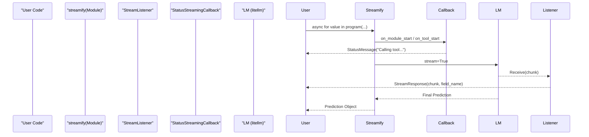
Sources: [dspy/streaming/streamify.py:27-60](), [dspy/streaming/streaming_listener.py:23-50](), [dspy/streaming/messages.py:98-129]()

### Key Streaming Components

| Component | Location | Role |
|---|---|---|
| `streamify` | `dspy/streaming/streamify.py` | Wraps a module to return an async generator of `StatusMessage`, `StreamResponse`, and `Prediction`. |
| `StreamListener` | `dspy/streaming/streaming_listener.py` | Listens to specific signature fields (e.g., "answer") and parses chunks using regex for Chat/XML/JSON adapters. |
| `StatusMessageProvider` | `dspy/streaming/messages.py` | Interface for customizing messages emitted during `on_tool_start`, `on_lm_start`, etc. |
| `Citations` | `dspy/adapters/types/citation.py` | A streamable type that can parse provider-specific citation deltas (e.g., Anthropic) into `StreamResponse`. |

Sources: [dspy/streaming/streamify.py:27-60](), [dspy/streaming/streaming_listener.py:23-50](), [dspy/adapters/types/citation.py:177-190]()

---

## State Management & Serialization

DSPy programs can be serialized to JSON and restored. The state captures signature fields, few-shot demos, and LM configuration.

### Security: Unsafe LM State Keys

`UNSAFE_LM_STATE_KEYS` (e.g., `api_base`, `base_url`) are stripped from deserialized state by default to prevent loading malicious redirects from untrusted files. Loading them requires `allow_unsafe_lm_state=True`.

Sources: [dspy/predict/predict.py:19-37](), [dspy/predict/predict.py:89-113]()

---

## Assertions & Code Execution

- **Assertions**: `dspy.Assert` and `dspy.Suggest` allow runtime validation. If an assertion fails, the `Retry` module can catch the error and prompt the LM again with feedback.
- **Code Execution**: The `PythonInterpreter` executes generated code. It supports sandboxing via a Deno-based Pyodide environment, communicating over JSON-RPC to isolate execution from the host system.

For details, see [Assertions & Output Validation](#5.5) and [Code Execution & Sandboxing](#5.6).

---

## Observability

### Usage and History

- **Usage Tracking**: Managed via `dspy.settings.usage_tracker`. Cache hits are explicitly excluded from usage counts via `_prepare_cached_response`.
- **History**: `BaseLM` maintains a `history` list. Global history is capped by `MAX_HISTORY_SIZE` (10,000).

Sources: [dspy/clients/cache.py:149-155](), [dspy/clients/base_lm.py:9-10](), [dspy/clients/base_lm.py:166-190]()
This page documents DSPy's mechanisms for validating LM outputs, enforcing constraints, and recovering from errors through retry logic. DSPy provides several layers of validation, from structural type-checking to semantic judging and agentic self-correction.

---

## Architecture Overview

Validation in DSPy occurs across three primary layers: the **Signature/Adapter** layer (structural), the **Module** layer (procedural/agentic), and the **Reliability/Judge** layer (semantic).

| Layer | Component | Role | Implementation |
|---|---|---|---|
| **Structural** | `Adapter` & `Pydantic` | Enforces JSON/Type schemas | [tests/reliability/test_pydantic_models.py:12-25]() |
| **Procedural** | `Retry` & `backtrack_handler` | Automated loops on failure | [tests/predict/test_retry.py:12-49]() |
| **Semantic** | `LLM Judge` | Validates correctness via another LM | [tests/reliability/utils.py:15-40]() |

---

## Structural Validation: Pydantic & Enums

DSPy uses Pydantic models and Python Enums within `Signatures` to enforce strict output formats. The `Adapter` (e.g., `ChatAdapter`, `JSONAdapter`) is responsible for parsing raw LM strings into these structured objects.

### Complex Type Enforcement
Signatures can define `OutputField` types using Pydantic classes, `Literal`, or `Enum`. If the LM output fails to parse into these types, the system can trigger a retry or raise a validation error.

**Diagram: Type-Level Validation Flow**

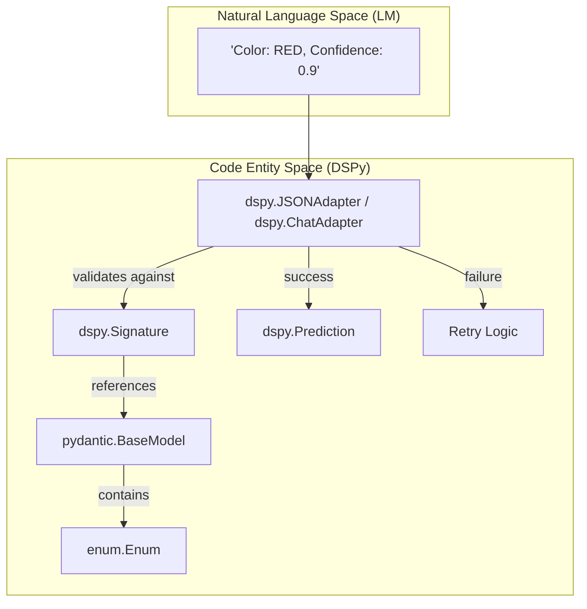
Sources: [tests/reliability/test_pydantic_models.py:49-62](), [tests/reliability/utils.py:146-152]()

---

## Procedural Validation: The Retry Mechanism

The `dspy.Retry` module is a wrapper designed to handle failures by feeding "past" incorrect outputs and feedback back into the LM prompt.

### Signature Augmentation
When a module is wrapped in `Retry`, DSPy dynamically generates a `new_signature`. This signature includes:
1.  All original input fields.
2.  `past_{field}` fields for each output field that failed validation.
3.  A `feedback` field containing the error message or "nudge" [tests/predict/test_retry.py:15-17]().

### Backtracking with `Suggest` and `Assert`
*   **`dspy.Suggest(condition, message)`**: A non-fatal constraint. If the condition is false, it triggers a backtrack (retry) up to `max_backtracks`. If it still fails, the program continues with a warning [tests/predict/test_retry.py:42-43]().
*   **`dspy.Assert(condition, message)`**: A fatal constraint. If the condition fails after all retries, it raises a `dspy.AssertionError`.

**Diagram: Retry Logic and Backtracking**

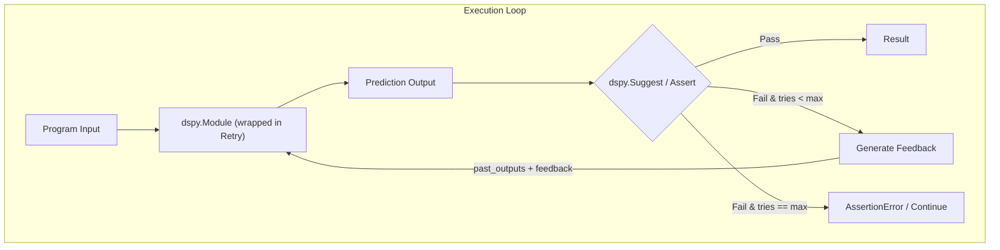
Sources: [tests/predict/test_retry.py:46-49](), [tests/predict/test_retry.py:21-26]()

---

## Semantic Validation: The LLM Judge

For complex tasks where code-based checks are insufficient (e.g., "Is this summary concise?"), DSPy utilizes an **LLM Judge** pattern.

### Judge Signature
A dedicated `JudgeSignature` is used to evaluate the input and output of a program against specific `grading_guidelines` [tests/reliability/utils.py:92-111]().

```python
class JudgeSignature(dspy.Signature):
    program_input: str = dspy.InputField()
    program_output: str = dspy.InputField()
    guidelines: str = dspy.InputField()
    judge_response: JudgeResponse = dspy.OutputField() # correct: bool, justification: str
```

### Reliability Testing Framework
The `assert_program_output_correct` utility automates this process by:
1.  Switching the DSPy context to a high-quality "judge" model (e.g., GPT-4o) [tests/reliability/utils.py:33-35]().
2.  Executing the `JudgeSignature` [tests/reliability/utils.py:113]().
3.  Asserting the `judge_response.correct` boolean [tests/reliability/utils.py:40]().

Sources: [tests/reliability/utils.py:15-41](), [tests/reliability/utils.py:87-113]()

---

## Multi-Chain Comparison

The `dspy.MultiChainComparison` module provides a specific validation pattern for consensus. It takes multiple candidate `completions` and a `question`, then produces a single refined `Prediction` by comparing the rationales and answers of the candidates [tests/predict/test_multi_chain_comparison.py:31-37]().

---

## Summary of Validation Patterns

| Pattern | Module/Utility | Best Use Case |
|---|---|---|
| **Schema Validation** | `pydantic.BaseModel` | Ensuring JSON structure and field types. |
| **Categorical Validation** | `Enum` / `Literal` | Forcing classification into specific labels. |
| **Self-Correction** | `dspy.Retry` + `dspy.Suggest` | Fixing hallucinations or formatting errors iteratively. |
| **Semantic Review** | `assert_program_output_correct` | High-level quality checks using a stronger model. |
| **Consensus** | `MultiChainComparison` | Reducing variance by comparing multiple LM attempts. |

Sources: [tests/reliability/test_pydantic_models.py:112-151](), [tests/predict/test_retry.py:12-26](), [tests/predict/test_multi_chain_comparison.py:29-41]()

# Code Execution & Sandboxing


This page documents DSPy's sandboxed Python code execution system: the `CodeInterpreter` protocol, the `PythonInterpreter` implementation (backed by Deno and Pyodide/WASM), the JSON-RPC communication protocol between host and sandbox, the security permission model, and the higher-level modules (`ProgramOfThought`, `RLM`) that use the sandbox.

For tool registration at the DSPy adapter level, see [Tool Integration & Function Calling](3.3). For the reasoning modules that drive code generation, see [Reasoning Strategies](3.2).

---

## Overview

DSPy provides sandboxed Python code execution for modules that need to run LLM-generated code safely. The key design decision is that user code runs inside a **WebAssembly (WASM) sandbox** via [Pyodide](https://pyodide.org/) hosted by the [Deno](https://deno.com/) runtime, not in the host Python process. This isolates generated code from the host filesystem, network, and environment by default.

**Architecture layers:**

| Layer | Component | Role |
|---|---|---|
| Protocol | `CodeInterpreter` (protocol) | Abstract interface for execution environments |
| Sandbox host | `PythonInterpreter` | Manages Deno subprocess, serializes variables |
| Sandbox runtime | `runner.js` | Deno-side: loads Pyodide, dispatches JSON-RPC |
| Communication | JSON-RPC 2.0 | stdin/stdout protocol between host and sandbox |
| Modules | `ProgramOfThought`, `RLM` | DSPy modules that drive code generation & execution |
| Testing | `MockInterpreter` | Scriptable responses, no Deno required |

Sources: [dspy/primitives/code_interpreter.py:1-10](), [dspy/primitives/python_interpreter.py:1-8](), [dspy/primitives/runner.js:1-6]()

---

## Core Abstractions

### `CodeInterpreter` Protocol

[dspy/primitives/code_interpreter.py:58-148]() defines `CodeInterpreter` as a `runtime_checkable` `Protocol`. Any class implementing the following interface can be used as a code execution backend:

| Method / Property | Signature | Description |
|---|---|---|
| `tools` | `dict[str, Callable[..., str]]` | Host-side functions callable from sandbox code |
| `start()` | `-> None` | Pre-warm the interpreter (idempotent, lazy if not called) |
| `execute(code, variables)` | `-> Any` | Run code, return result or `FinalOutput` |
| `shutdown()` | `-> None` | Release resources, end session |

State **persists across `execute()` calls** within a single session. Variables defined in one call are visible in the next.

### `FinalOutput`

[dspy/primitives/code_interpreter.py:39-55]() defines `FinalOutput`, a simple wrapper returned by `execute()` when the sandbox code calls `SUBMIT()`. It signals that the execution loop should terminate and propagate the contained value to the caller.

```python
FinalOutput(output={"answer": "42"})
```

### `CodeInterpreterError`

[dspy/primitives/code_interpreter.py:16-36]() defines `CodeInterpreterError(RuntimeError)`. It covers two failure modes:

- **Execution errors**: User code raised `NameError`, `TypeError`, tool call failure, etc.
- **Protocol errors**: Malformed JSON, sandbox process crash, invalid JSON-RPC structure.

`SyntaxError` is raised directly (not wrapped) for invalid Python syntax.

### `SIMPLE_TYPES`

[dspy/primitives/code_interpreter.py:13]() defines `SIMPLE_TYPES = (str, int, float, bool, list, dict, type(None))`. This constant is used both by `PythonInterpreter._extract_parameters()` and `RLM._get_output_fields_info()` to determine which types can be expressed in a typed function signature for `SUBMIT()`.

Sources: [dspy/primitives/code_interpreter.py:1-149]()

---

## `PythonInterpreter`

`PythonInterpreter` ([dspy/primitives/python_interpreter.py:75-596]()) is the production implementation. It launches a Deno subprocess that runs `runner.js`, communicates over stdin/stdout via JSON-RPC 2.0, and isolates user code in a Pyodide/WASM environment.

### Architecture Diagram

**`PythonInterpreter` component relationships**

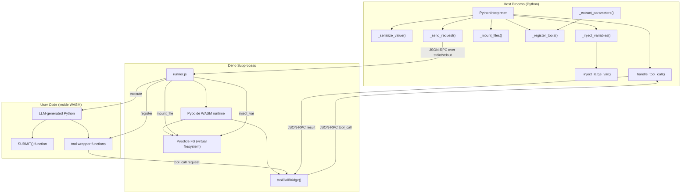

Sources: [dspy/primitives/python_interpreter.py:100-597](), [dspy/primitives/runner.js:141-389]()

### Lifecycle

The interpreter follows a lazy initialization model:

1. **Construction** (`__init__`): Builds the `deno_command` argument list [dspy/primitives/python_interpreter.py:100-173](). No subprocess yet.
2. **First `execute()`**: Calls `_ensure_deno_process()` [dspy/primitives/python_interpreter.py:316-341](), which spawns the Deno subprocess and runs `_health_check()`.
3. **`_mount_files()`**: Copies host files into the Pyodide virtual filesystem (`/sandbox/<name>`) [dspy/primitives/python_interpreter.py:217-237]().
4. **`_register_tools()`**: Sends a `register` JSON-RPC request with tool signatures and output field definitions [dspy/primitives/python_interpreter.py:239-276]().
5. **`execute()` loop**: Sends `execute` request; handles `tool_call` requests (back-and-forth) until a `result` or `error` arrives [dspy/primitives/python_interpreter.py:484-596]().
6. **`shutdown()`**: Sends `shutdown` notification, waits for process to exit [dspy/primitives/python_interpreter.py:355-367]().

Use as a context manager:

```python
with PythonInterpreter() as interp:
    result = interp("print(1 + 2)")
# shutdown() called automatically
```

Sources: [dspy/primitives/python_interpreter.py:316-596]()

---

## Security Model

The security model is based on Deno's permission flags. All permissions default to **deny**; specific capabilities must be explicitly enabled.

**Default sandbox restrictions (no explicit grants):**

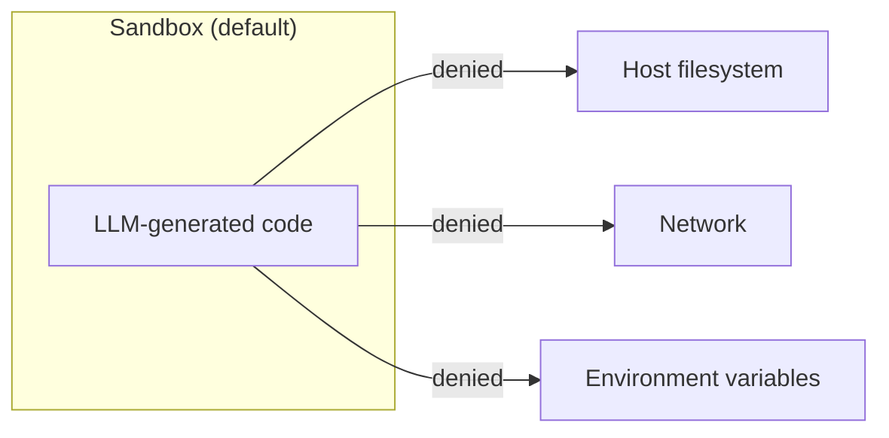

**Opt-in grants:**

| Grant | Constructor parameter | Deno flag |
|---|---|---|
| Read specific files/dirs | `enable_read_paths` | `--allow-read=<paths>` |
| Write specific files/dirs | `enable_write_paths` | `--allow-write=<paths>` |
| Specific env vars | `enable_env_vars` | `--allow-env=<vars>` |
| Specific network hosts | `enable_network_access` | `--allow-net=<hosts>` |

Deno's runner script (`runner.js`) and its cache directory are always allowed for reading so that Pyodide can load its WASM packages [dspy/primitives/python_interpreter.py:145-156]().

File access inside the sandbox uses **virtual paths**: `enable_read_paths=["/host/secret.txt"]` mounts to `/sandbox/secret.txt` inside the WASM environment [dspy/primitives/python_interpreter.py:228-231]().

Sources: [dspy/primitives/python_interpreter.py:140-173](), [dspy/primitives/python_interpreter.py:217-237]()

### Thread Safety

`PythonInterpreter` is **not thread-safe**. `_check_thread_ownership()` ([dspy/primitives/python_interpreter.py:181-190]()) records the first thread to call `execute()` and raises `RuntimeError` if a different thread attempts to use the same instance. Create one instance per thread.

---

## JSON-RPC 2.0 Communication Protocol

Host (`PythonInterpreter`) and sandbox (`runner.js`) communicate over the Deno subprocess's stdin/stdout using JSON-RPC 2.0 messages, one per line.

**Message flow diagram**

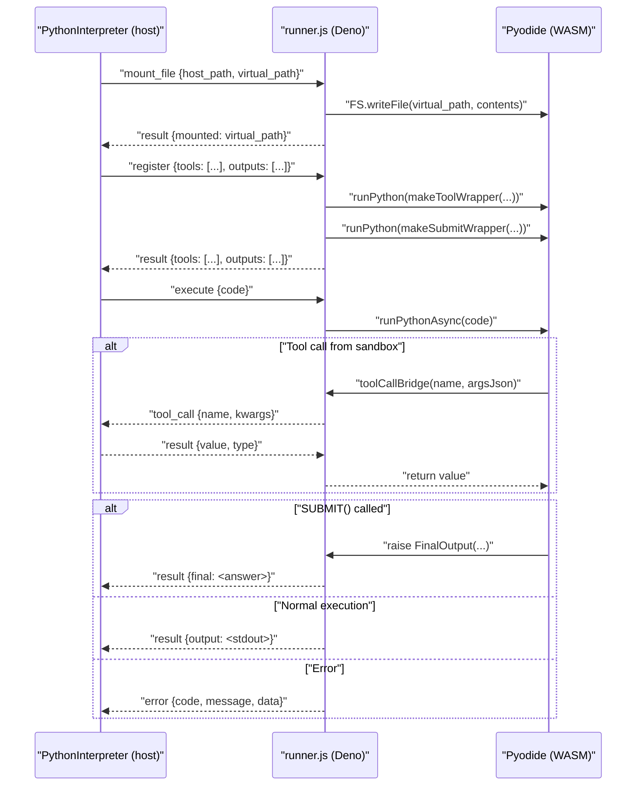

Sources: [dspy/primitives/python_interpreter.py:49-73](), [dspy/primitives/python_interpreter.py:369-395](), [dspy/primitives/runner.js:94-132](), [dspy/primitives/runner.js:327-385]()

### JSON-RPC Methods

| Method | Direction | Description |
|---|---|---|
| `mount_file` | host → sandbox | Copy a host file into the WASM virtual filesystem |
| `register` | host → sandbox | Install tool wrapper functions and typed `SUBMIT()` |
| `inject_var` | host → sandbox | Write large variable data as JSON to `/tmp/dspy_vars/` |
| `execute` | host → sandbox | Run user Python code, return result/error |
| `tool_call` | sandbox → host | Call a host-side tool function |
| `sync_file` | host → sandbox (notification) | Write WASM file back to host path |
| `shutdown` | host → sandbox (notification) | Terminate the Deno process |

Error codes follow JSON-RPC 2.0 conventions: protocol errors in `-32700`–`-32600` [dspy/primitives/runner.js:96-100](), application errors (`SyntaxError`, `NameError`, etc.) in `-32000`–`-32099` [dspy/primitives/python_interpreter.py:35-46]().

Sources: [dspy/primitives/python_interpreter.py:34-46](), [dspy/primitives/runner.js:95-114]()

---

## Variable Injection

When `execute(code, variables={...})` is called, the host serializes variables and prepends assignment statements to the code before sending it to the sandbox.

### Small Variables

[dspy/primitives/python_interpreter.py:444-478]() serializes small values to Python literal syntax (e.g., `x = [1, 2, 3]`). Supported types: `None`, `str`, `bool`, `int`, `float`, `list`, `tuple`, `dict`, `set`. Tuples and sets are converted to lists since JSON doesn't support them.

### Large Variables

Pyodide's FFI crashes at 128 MB. Strings serialized above `LARGE_VAR_THRESHOLD` (100 MB, [dspy/primitives/python_interpreter.py:28]()) are injected via the virtual filesystem instead:

1. Host sends `inject_var` JSON-RPC with the variable name and JSON-encoded value [dspy/primitives/python_interpreter.py:421-435]().
2. `runner.js` writes `/tmp/dspy_vars/<name>.json` in the WASM virtual filesystem [dspy/primitives/runner.js:246-253]().
3. Injected code reads the variable: `name = json.loads(open('/tmp/dspy_vars/name.json').read())` [dspy/primitives/python_interpreter.py:437-442]().

Sources: [dspy/primitives/python_interpreter.py:419-482]()

---

## `runner.js`: Deno-Side Runtime

[dspy/primitives/runner.js]() is the Deno script that runs inside the subprocess. Its responsibilities:

1. **Loads Pyodide** via `npm:pyodide/pyodide.js` [dspy/primitives/runner.js:3]().
2. **Installs the tool bridge**: `toolCallBridge()` ([dspy/primitives/runner.js:151-202]()) is exposed to the Python environment as `_js_tool_call` [dspy/primitives/runner.js:205]().
3. **Manages the main loop**: Reads JSON-RPC lines from stdin, dispatches to handlers [dspy/primitives/runner.js:222-389]().
4. **Executes user code**: For each `execute` request, runs `PYTHON_SETUP_CODE` then `runPythonAsync(code)` [dspy/primitives/runner.js:338-348]().

### `PYTHON_SETUP_CODE`

[dspy/primitives/runner.js:13-31]() is a Python snippet injected before every user code execution:

- Redirects `sys.stdout`/`sys.stderr` to `StringIO` buffers.
- Defines `last_exception_args()` helper to extract exception args across the JS/Python boundary.
- Defines a default single-argument `SUBMIT(output)` that raises `FinalOutput`.

### Tool Wrapper Generation

`makeToolWrapper(toolName, parameters)` ([dspy/primitives/runner.js:43-65]()) generates Python code for each registered tool. The generated function calls `_js_tool_call(name, argsJson)` and handles the response.

`makeSubmitWrapper(outputs)` ([dspy/primitives/runner.js:69-89]()) generates a typed `SUBMIT()` function when output fields are registered.

Sources: [dspy/primitives/runner.js:10-89](), [dspy/primitives/runner.js:141-220]()

---

## Using Interpreter in DSPy Modules

### `ProgramOfThought`

[dspy/predict/program_of_thought.py:14-180]() is a `Module` that:

1. Uses `code_generate` (a `ChainOfThought`) to ask the LLM to write Python code [dspy/predict/program_of_thought.py:159]().
2. Parses the code via `_parse_code()` [dspy/predict/program_of_thought.py:161]().
3. Executes it via `self.interpreter.execute(code)` [dspy/predict/program_of_thought.py:148]().
4. On failure, uses `code_regenerate` to ask the LLM to fix the error [dspy/predict/program_of_thought.py:172]().

The retry loop runs up to `max_iters` times (default: 3) [dspy/predict/program_of_thought.py:166]().

Sources: [dspy/predict/program_of_thought.py:14-180]()

### `RLM` (Recursive Language Model)

[dspy/predict/rlm.py:101-550]() is a module for iterative REPL-style reasoning over large inputs.

**`RLM` execution flow:**

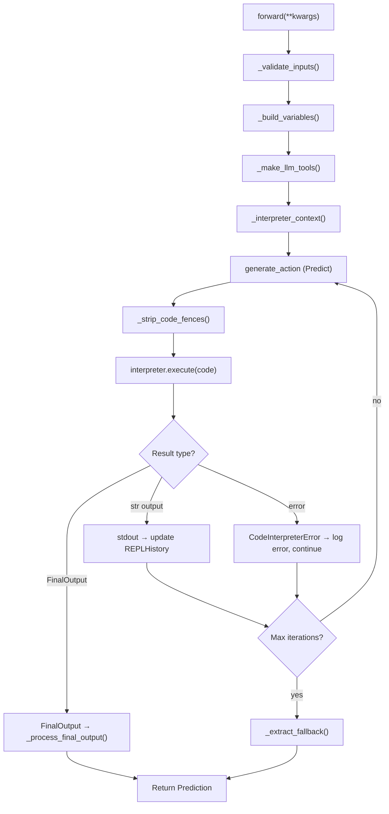

Sources: [dspy/predict/rlm.py:125-550]()

### `RLM` Tool Integration

`RLM` creates two built-in tools per `forward()` call:

- `llm_query(prompt: str) -> str`: Calls the configured LM [dspy/predict/rlm.py:225-248]().
- `llm_query_batched(prompts: list[str]) -> list[str]`: Concurrent calls via `ThreadPoolExecutor` [dspy/predict/rlm.py:250-276]().

Sources: [dspy/predict/rlm.py:225-276](), [dspy/predict/rlm.py:377-412]()

---

## REPL Data Types (`repl_types.py`)

[dspy/primitives/repl_types.py]() defines structured types for the RLM execution history:

| Class | Description |
|---|---|
| `REPLVariable` | Metadata about a variable (name, type, preview, desc). [dspy/primitives/repl_types.py:26-100]() |
| `REPLEntry` | One REPL interaction: `reasoning`, `code`, `output`. [dspy/primitives/repl_types.py:102-126]() |
| `REPLHistory` | Immutable ordered list of `REPLEntry`. [dspy/primitives/repl_types.py:128-162]() |

Sources: [dspy/primitives/repl_types.py:1-162]()

---

## Component Map

**Code entities and their file locations**

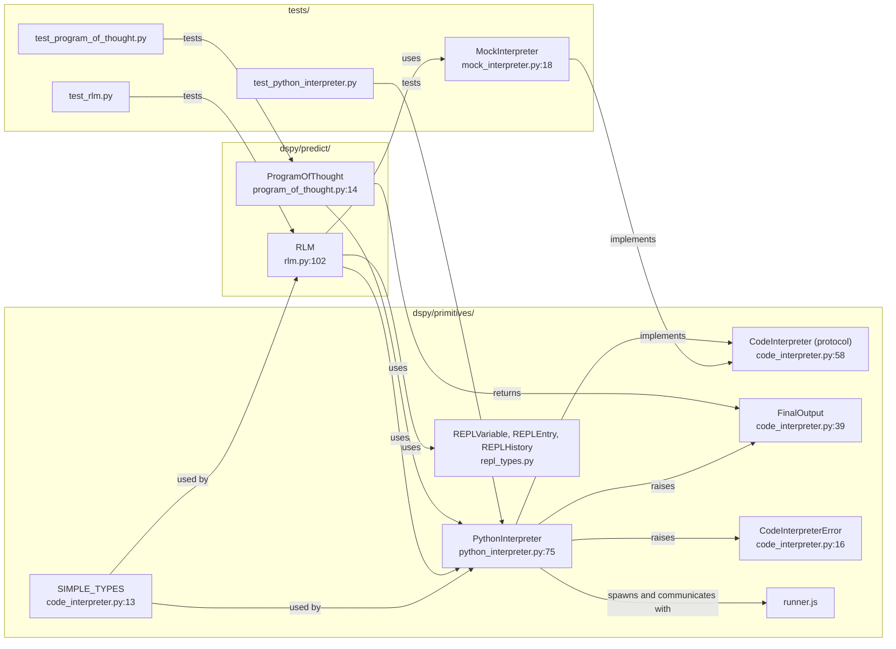

Sources: [dspy/primitives/__init__.py:1-18](), [dspy/primitives/code_interpreter.py:1-149](), [dspy/primitives/python_interpreter.py:1-22]()
This page covers the project build configuration, dependency management, code quality tooling, and GitHub Actions CI/CD pipeline for DSPy. It explains how the package is assembled and validated on every push and pull request.

For the release process (TestPyPI validation, PyPI publishing, version management), see [Package Metadata & Release Process](#7.4). For the test suite structure and test markers, see [Testing Framework](#7.2).

---

## Build System

DSPy uses [setuptools](https://setuptools.pypa.io/) as its build backend, declared in `pyproject.toml`. The build backend and its minimum version are pinned explicitly.

[pyproject.toml:1-3]()

```toml
[build-system]
requires = ["setuptools>=77.0.1"]
build-backend = "setuptools.build_meta"
```

### Package Discovery

Setuptools is configured to scan the repository root for the `dspy` package and all of its sub-packages, while explicitly excluding the `tests` directory from the distribution.

[pyproject.toml:70-73]()

| Setting | Value |
|---|---|
| `packages.find.where` | `.` (repo root) |
| `packages.find.include` | `dspy`, `dspy.*` |
| `packages.find.exclude` | `tests`, `tests.*` |
| `package-data` | `dspy/primitives/*.js` |

The `dspy/primitives/*.js` entry ensures that the JavaScript runtime files used by the `PythonInterpreter` (Deno/Pyodide execution) are bundled into the wheel [pyproject.toml:75-76](). See [Code Execution & Sandboxing](#5.6) for details on how these files are used at runtime.

---

## Project Metadata & Python Version Support

[pyproject.toml:5-22]()

| Field | Value |
|---|---|
| `name` | `dspy` |
| `version` | `3.2.0` (managed by release automation) |
| `requires-python` | `>=3.10, <3.15` |
| `license` | `LICENSE` file |
| `author` | Omar Khattab |

Python versions 3.10 through 3.14 are supported [pyproject.toml:16](). The upper bound `<3.15` is enforced in the project metadata, and the CI matrix tests the full range [.github/workflows/run_tests.yml:52]().

---

## Dependency Groups

`pyproject.toml` declares three categories of dependencies.

### Core (Required) Dependencies

[pyproject.toml:23-42]()

| Package | Minimum Version | Role |
|---|---|---|
| `litellm` | `>=1.64.0` | LM provider abstraction |
| `openai` | `>=0.28.1` | OpenAI API client |
| `pydantic` | `>=2.0` | Data validation and signatures |
| `diskcache` | `>=5.6.0` | Disk-based LM response cache |
| `cachetools` | `>=5.5.0` | In-memory caching |
| `orjson` | `>=3.9.0` | Fast JSON serialization |
| `json-repair` | `>=0.54.2` | LM output repair |
| `tenacity` | `>=8.2.3` | Retry logic |
| `anyio` | latest | Async I/O compatibility |
| `asyncer` | `==0.0.8` | Async/sync bridge |
| `cloudpickle` | `>=3.1.2` | State serialization |
| `xxhash` | `>=3.5.0` | Cache key hashing |
| `numpy` | `>=1.26.0` | Numerical operations |
| `tqdm` | `>=4.66.1` | Progress bars |
| `requests` | `>=2.31.0` | HTTP client |
| `regex` | `>=2023.10.3` | Pattern matching |
| `gepa[dspy]` | `==0.1.1` | GEPA optimizer |
| `typeguard` | `4.4.3` | Runtime type checking |

### Optional Dependencies

[pyproject.toml:44-68]()

| Extra Name | Packages | Use Case |
|---|---|---|
| `anthropic` | `anthropic>=0.18.0,<1.0.0` | Anthropic native client |
| `weaviate` | `weaviate-client~=4.5.4` | Weaviate vector store |
| `mcp` | `mcp` (Python ≥ 3.10) | Model Context Protocol |
| `langchain` | `langchain_core` | LangChain integration |
| `optuna` | `optuna>=3.4.0` | Bayesian optimization (MIPROv2) |
| `dev` | pytest, ruff, pre-commit, pillow, build, litellm[proxy] | Development tooling |
| `test_extras` | mcp, datasets, pandas, optuna, langchain_core | Extended test coverage |

The `dev` extra has a platform/version conditional for `litellm`:
- On Windows or Python 3.14: plain `litellm>=1.64.0` [pyproject.toml:59]()
- Otherwise: `litellm[proxy]>=1.64.0` (the proxy feature requires `uvloop`, which does not yet support Python 3.14) [pyproject.toml:60]()

---

## Code Quality: Ruff

Ruff is used for both linting and formatting. Its configuration lives in `pyproject.toml`.

[pyproject.toml:120-188]()

**Diagram: Ruff Configuration Overview**

```mermaid
graph TD
    RuffTool["[tool.ruff]"]
    RuffTool --> Include["include: dspy/**/*.py, tests/**/*.py"]
    RuffTool --> Exclude["exclude: dspy/__metadata__.py, tests/reliability/*.py"]
    RuffTool --> LineLen["line-length: 120"]
    RuffTool --> Target["target-version: py310"]

    RuffLint["[tool.ruff.lint]"]
    RuffLint --> E["E - pycodestyle errors"]
    RuffLint --> W["W - pycodestyle warnings"]
    RuffLint --> F["F - pyflakes"]
    RuffLint --> I["I - isort"]
    RuffLint --> B["B - flake8-bugbear"]
    RuffLint --> UP["UP - pyupgrade"]
    RuffLint --> N["N - pep8-naming"]
    RuffLint --> RUF["RUF - ruff-specific"]
    RuffLint --> Q["Q - flake8-quotes"]

    PerFileIgnores["[tool.ruff.lint.per-file-ignores]"]
    PerFileIgnores --> Tests["tests/**/*.py: S101, TID252, ARG001"]
    PerFileIgnores --> Init["__init__.py: F401"]
    PerFileIgnores --> DspyInit["dspy/__init__.py: I001, E402, F405"]
```

Sources: [pyproject.toml:120-188]()

Key lint rule decisions:

| Rule ID | Action | Reason |
|---|---|---|
| `E501` | ignored | Line length enforced by formatter, not linter [pyproject.toml:150]() |
| `F403` | ignored | Wildcard imports used in `__init__.py` files [pyproject.toml:154]() |
| `B904` | ignored | Allows raising custom exceptions inside `except` blocks [pyproject.toml:153]() |
| `C901` | ignored | Complexity checking disabled [pyproject.toml:149]() |
| `S101` | ignored in tests | `assert` statements are valid in pytest [pyproject.toml:179]() |
| `TID252` | ignored in tests | Relative imports allowed in test files [pyproject.toml:180]() |

Ruff's isort configuration declares `dspy` as a first-party package [pyproject.toml:172](), and all relative imports are banned across the main `dspy/` source [pyproject.toml:175]().

---

## Dependency Management: uv

The CI pipeline uses [uv](https://github.com/astral-sh/uv) for dependency installation and virtual environment management, via the `astral-sh/setup-uv@v8.1.0` action [.github/workflows/run_tests.yml:22, 65, 99, 153]().

The standard installation commands used in CI:

| Command | Purpose |
|---|---|
| `uv venv .venv` | Create virtual environment [.github/workflows/run_tests.yml:30, 73, 107, 161]() |
| `uv sync --dev -p .venv --extra dev` | Install core + dev extras [.github/workflows/run_tests.yml:33, 77, 111, 164]() |
| `uv sync -p .venv --extra dev --extra test_extras` | Add test_extras for second test pass [.github/workflows/run_tests.yml:86]() |
| `uv run -p .venv pytest ...` | Run tests inside the managed venv [.github/workflows/run_tests.yml:84, 88, 133]() |
| `uv run -p .venv python -m build` | Build the wheel [.github/workflows/run_tests.yml:166]() |

Caching is enabled for both `pyproject.toml` and `uv.lock` to speed up repeated CI runs [.github/workflows/run_tests.yml:25-27]().

---

## CI/CD Pipeline

The pipeline is defined in `.github/workflows/run_tests.yml`. It runs on every push to `main` and on pull request events (`opened`, `synchronize`, `reopened`).

[.github/workflows/run_tests.yml:1-9]()

**Diagram: CI Job Dependency and Execution Flow**

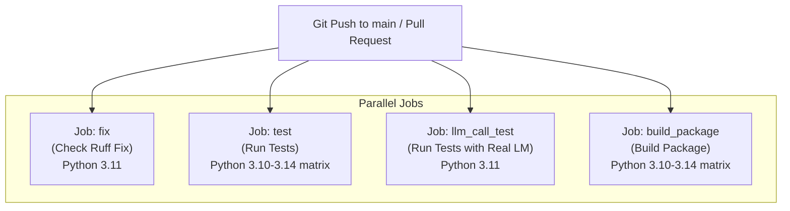

Sources: [.github/workflows/run_tests.yml:1-171]()

---

### Job: `fix` — Ruff Lint Check

[.github/workflows/run_tests.yml:11-46]()

Runs on Python 3.11. The job:
1. Installs uv and syncs the `dev` extra [.github/workflows/run_tests.yml:33]()
2. Runs `ruff check --fix-only --diff --exit-non-zero-on-fix` [.github/workflows/run_tests.yml:36]()

If Ruff finds issues that can be auto-fixed, the job fails with instructions to run `pre-commit run --all-files` locally before pushing [.github/workflows/run_tests.yml:41]().

---

### Job: `test` — Unit and Integration Tests

[.github/workflows/run_tests.yml:48-89]()

Runs a matrix across Python versions 3.10, 3.11, 3.12, 3.13, and 3.14 [.github/workflows/run_tests.yml:52]().

1. **Installs Deno** — required for sandboxed code execution tests marked `deno` [.github/workflows/run_tests.yml:59]()
2. **Installs uv + dev extra** [.github/workflows/run_tests.yml:77]()
3. **Runs base tests**: `pytest -vv tests/` [.github/workflows/run_tests.yml:84]()
4. **Installs `test_extras`**: adds `mcp`, `datasets`, `pandas`, `optuna`, `langchain_core` [.github/workflows/run_tests.yml:86]()
5. **Runs extra and deno tests**: `pytest tests/ -m 'extra or deno' --extra --deno` [.github/workflows/run_tests.yml:88]()

**Diagram: test Job Steps and Commands**

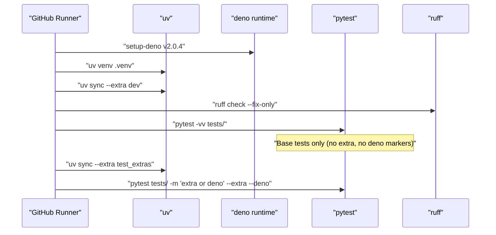

Sources: [.github/workflows/run_tests.yml:48-89]()

---

### Job: `llm_call_test` — Real LM Integration Tests

[.github/workflows/run_tests.yml:91-140]()

Uses a local Ollama server (via Docker) to execute tests marked with `llm_call`, avoiding external API keys [.github/workflows/run_tests.yml:133]().

1. **Cache Ollama model data**: keyed by `ollama-llama3.2-3b-${{ runner.os }}-v1` [.github/workflows/run_tests.yml:118]()
2. **Start Ollama service**: Runs `ollama/ollama:latest` in Docker [.github/workflows/run_tests.yml:122-125]()
3. **Pull LLM**: Pulls `llama3.2:3b` if cache miss [.github/workflows/run_tests.yml:129]()
4. **Set LM environment variable**: `LM_FOR_TEST=ollama/llama3.2:3b` [.github/workflows/run_tests.yml:131]()
5. **Run tests**: `pytest -m llm_call --llm_call -vv --durations=5 tests/` [.github/workflows/run_tests.yml:133]()

---

### Job: `build_package` — Package Build Verification

[.github/workflows/run_tests.yml:142-171]()

Runs a matrix across Python 3.10–3.14.
1. Builds the package: `uv run -p .venv python -m build` [.github/workflows/run_tests.yml:166]()
2. Installs the built wheel: `uv pip install dist/*.whl -p .venv` [.github/workflows/run_tests.yml:168]()
3. Verifies import: `uv run -p .venv python -c "import dspy"` [.github/workflows/run_tests.yml:170]()

---

## pytest Configuration

[pyproject.toml:112-118]()

The `[tool.pytest.ini_options]` suppresses a recurring `DeprecationWarning` from `litellm`:

```toml
[tool.pytest.ini_options]
filterwarnings = [
    "ignore:.+class-based `config` is deprecated, use ConfigDict:DeprecationWarning",
]
```

Test markers like `llm_call`, `extra`, and `deno` are configured in `tests/conftest.py` [tests/conftest.py:8-53]().

---

## Coverage Configuration

[pyproject.toml:81-110]()

| Setting | Value |
|---|---|
| `branch` | `true` [pyproject.toml:82]() |
| Omitted paths | `__init__.py`, test files, `venv`, `setup.py` [pyproject.toml:83-95]() |

Excluded lines from reports include `pragma: no cover`, `def __repr__`, `raise AssertionError`, and logger calls [pyproject.toml:98-110]().

---

## Local Development Setup

To replicate the CI environment locally using [uv](https://github.com/astral-sh/uv):

```bash
# Fork and clone the repo
git clone {url-to-your-fork}
cd dspy

# Create virtual environment and sync dev dependencies
uv venv --python 3.10
uv sync --extra dev

# Install pre-commit hooks
pre-commit install

# Run unit tests
uv run pytest tests/predict
```

Sources: [CONTRIBUTING.md:93-128](), [pyproject.toml:50-61]()
DSPy programs are built by composing reusable modules that define how language models should process inputs to produce outputs. This page demonstrates how to construct programs from basic predictors to complex multi-stage pipelines.

**Key concepts covered:**
- Using `dspy.Predict` and signatures to define tasks
- Composing modules with `dspy.Module` for multi-step logic
- Common program patterns (sequential, conditional, iterative)
- Configuration and state management
- Integration with specialized modules

For detailed documentation on specific features, see the subpages: [Predict Module](#3.1), [Reasoning Strategies](#3.2), [Tool Integration & Function Calling](#3.3), [Custom Types & Multimodal Support](#3.4), [Module Composition & Refinement](#3.5), and [History & Conversation Management](#3.6).

## Getting Started: Basic Program Structure

A minimal DSPy program consists of three elements:

1. **Signature**: Defines input/output fields [dspy/signatures/signature.py:1-20]()
2. **Module**: Wraps the signature with execution logic (`dspy.Predict` or custom `dspy.Module`) [dspy/predict/predict.py:43-56]()
3. **LM Configuration**: Specifies which language model to use via `dspy.configure` [dspy/dsp/utils/settings.py:12-15]()

```python
import dspy
This page documents DSPy's sophisticated caching architecture, including the `request_cache` system, memory and disk-based persistence, cache key computation, and the `rollout_id` mechanism for experimental control. Caching is a core performance feature in DSPy that minimizes API costs and reduces latency by reusing previous language model and embedding responses.

---

## Caching Architecture Overview

DSPy implements a tiered caching strategy that sits between the high-level `dspy.Module` and the low-level LM providers. The system is designed to be transparent to the user while providing deep hooks for customization and performance tuning.

### The Two-Tier Cache System
The `Cache` class provides two levels of storage:
1.  **In-Memory Cache**: Implemented using `cachetools.LRUCache`. It offers O(1) access for frequently used data within a single process lifetime [dspy/clients/cache.py:43-46]().
2.  **On-Disk Cache**: Powered by `diskcache.FanoutCache`. This provides persistent storage across process restarts and can be shared across multiple runs [dspy/clients/cache.py:45-46]().

**Data Flow: Request to Cache Lookup**

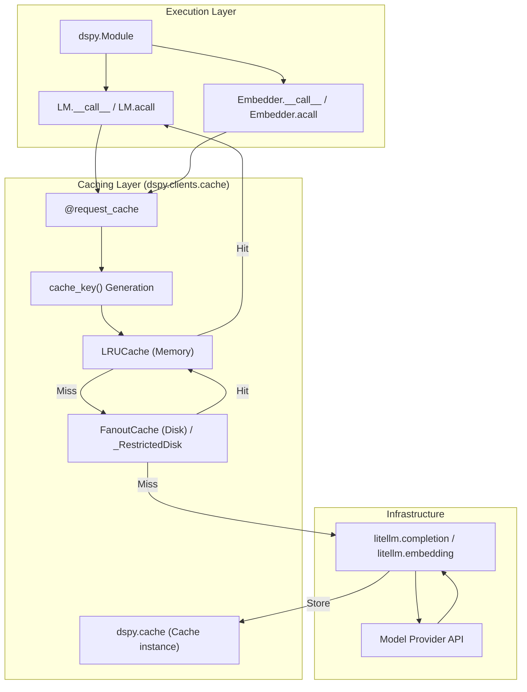
Sources: [dspy/clients/cache.py:40-46](), [dspy/clients/lm.py:147-157](), [dspy/clients/embedding.py:131-137](), [docs/docs/tutorials/cache/index.md:7-13]()

---

## Cache Key Computation

The uniqueness of a cache entry is determined by its cache key. DSPy computes this key by hashing the request parameters, ensuring that identical semantic requests retrieve the same result.

### Computation Logic
The `Cache.cache_key` method performs the following steps:
1.  **Filtering**: Removes sensitive or transient arguments like `api_key`, `api_base`, and `base_url` to ensure the key only depends on model logic [dspy/clients/lm.py:148-153]().
2.  **Transformation**: The `_transform_value` function converts complex types (Pydantic models, callables, source code) into JSON-serializable strings [dspy/clients/cache.py:24-37]().
3.  **Hashing**: Uses `orjson` to dump parameters with `OPT_SORT_KEYS` enabled and computes a `sha256` hex digest [dspy/clients/cache.py:111-113]().

**Entity Mapping: Natural Language to Code Space**

| Concept | Code Entity | File Path |
| :--- | :--- | :--- |
| **Key Generator** | `Cache.cache_key()` | [dspy/clients/cache.py:104]() |
| **Ignored Args** | `ignored_args_for_cache_key` | [dspy/clients/lm.py:148]() |
| **Hashing Engine** | `sha256` / `orjson` | [dspy/clients/cache.py:7-11]() |
| **Type Transformer** | `_transform_value()` | [dspy/clients/cache.py:24]() |
| **Cache Decorator** | `@request_cache` | [dspy/clients/cache.py:192]() |

Sources: [dspy/clients/cache.py:24-113](), [dspy/clients/lm.py:147-157]()

---

## Cache Control with Rollout ID

The `rollout_id` is an optional integer parameter used to differentiate cache entries for otherwise identical requests. It is primarily used for experiments where the same prompt might need to generate different samples (e.g., during optimization or bootstrapping).

### Rollout ID Mechanics
- **Cache Isolation**: When a `rollout_id` is provided in `kwargs`, it is included in the dictionary passed to `cache_key`, effectively creating a unique namespace for that specific rollout [dspy/clients/lm.py:106-111]().
- **Stripping**: Before the request is sent to the provider via `litellm`, the `rollout_id` is stripped to prevent provider-side errors [dspy/clients/lm.py:71-72]().
- **Temperature Constraint**: `rollout_id` only affects caching when `temperature > 0`. If `temperature=0`, DSPy issues a warning because the model output is deterministic, making rollout-based isolation redundant [dspy/clients/lm.py:139-145]().

**Sequence: Rollout ID Cache Isolation**

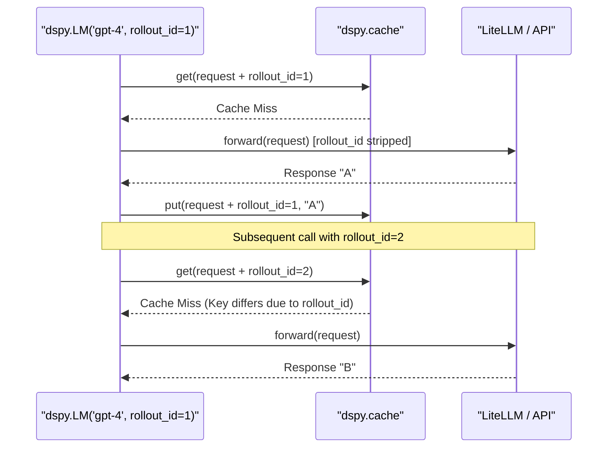
Sources: [dspy/clients/lm.py:106-113](), [tests/clients/test_lm.py:134-180]()

---

## Security & Restricted Deserialization

By default, DSPy's on-disk cache uses Python's `pickle`. To mitigate security risks associated with arbitrary code execution during deserialization, DSPy provides a restricted mode.

### Restricted Pickle Mode
The `restrict_pickle` option in `configure_cache` swaps the standard disk implementation for `_RestrictedDisk` [dspy/clients/cache.py:88-93]().
- **Trusted Prefixes**: Automatically allows `litellm.types.*` and `openai.types.*` [dspy/clients/disk_serialization.py:23-26]().
- **NumPy Support**: Includes a hardcoded allowlist for `numpy.ndarray` reconstruction [dspy/clients/disk_serialization.py:28-36]().
- **User Allowlist**: Users can register custom types via the `safe_types` argument [dspy/clients/cache.py:67-68]().

Sources: [dspy/clients/disk_serialization.py:1-88](), [dspy/clients/cache.py:88-94]()

---

## Global Configuration & Management

DSPy provides global utilities to configure the behavior of the caching system.

### Configuration Function
The `configure_cache` function allows developers to toggle tiers and set limits:
- `enable_disk_cache`: (bool) Defaults to `True` [dspy/clients/__init__.py:21]().
- `enable_memory_cache`: (bool) Defaults to `True` [dspy/clients/__init__.py:22]().
- `disk_cache_dir`: Defaults to `~/.dspy_cache` or `DSPY_CACHEDIR` env var [dspy/clients/__init__.py:16]().
- `memory_max_entries`: Defaults to 1,000,000 [dspy/clients/__init__.py:25]().

### Cache Persistence & Reset
The `Cache` class supports programmatic management:
- **Reset**: `reset_memory_cache()` clears the LRU cache but preserves disk storage [dspy/clients/cache.py:186-188]().
- **Serialization**: `save_memory_cache(filepath)` and `load_memory_cache(filepath)` allow moving in-memory states between environments using `cloudpickle` [dspy/clients/cache.py:214-232]().

Sources: [dspy/clients/__init__.py:19-51](), [dspy/clients/cache.py:186-232]()

---

## Performance Metrics & Tracking

When a cache hit occurs, DSPy modifies the response metadata to assist in performance monitoring and cost accounting.

### Cache Hit Indicators
- **Execution Time**: Cached calls return significantly faster (e.g., < 1ms) [docs/docs/tutorials/cache/index.md:44-49]().
- **Usage Data**: On a cache hit, the `usage` field in the response is cleared (set to `{}`), and `cache_hit` is set to `True` [dspy/clients/cache.py:151-155]().
- **Cost Tracking**: Usage trackers like `track_usage()` will report zero tokens for cached calls [tests/clients/test_lm.py:95-98]().

### Provider-Side Caching
For high-performance applications, DSPy supports **Provider-Side Prompt Caching** (e.g., Anthropic, OpenAI) by passing `cache_control_injection_points` to the `LM` constructor [docs/docs/tutorials/cache/index.md:62-70]().

Sources: [dspy/clients/cache.py:149-155](), [docs/docs/tutorials/cache/index.md:15-50]()
res = act(n=5) 
```
[dspy/predict/code_act.py:31-37]()

### Manual Tool Handling
For granular control, tools can be defined as `InputField` types in a signature:
```python
class ManualToolSig(dspy.Signature):
    question: str = dspy.InputField()
    tools: list[dspy.Tool] = dspy.InputField()
    outputs: dspy.ToolCalls = dspy.OutputField()
```
[docs/docs/learn/programming/tools.md:77-81]()

Sources: [dspy/predict/react.py:30-38](), [dspy/predict/code_act.py:28-38](), [docs/docs/learn/programming/tools.md:74-118]()
This page provides an overview of how DSPy is configured at runtime and how it integrates with external systems. It covers the settings system, model providers, retrieval backends, observability tools, and optional third-party framework integrations.

For detailed treatment of each topic, see the sub-pages: [Settings & Configuration Management](#6.1), [Model Providers & LiteLLM Integration](#6.2), [Vector Databases & Retrieval](#6.3), [Observability & Monitoring](#6.4), [External Framework Integration](#6.5), and [Model Context Protocol (MCP)](#6.6).

---

## Configuration & Integration Landscape

DSPy exposes its configuration surface primarily through the `Settings` singleton and global cache management functions. These are exposed in the top-level `dspy` namespace.

| Public Name | Underlying Binding | Purpose |
|---|---|---|
| `dspy.settings` | `dspy.dsp.utils.settings.Settings` | Singleton holding global configuration state |
| `dspy.configure` | `settings.configure` | Set global options (LM, RM, caching, etc.) |
| `dspy.context` | `settings.context` | Thread-safe temporary configuration override |
| `dspy.cache` | `DSPY_CACHE` | Access to the `Cache` object (disk/memory) |
| `dspy.configure_cache` | `clients.configure_cache` | Reconfigure the global cache instance |

[dspy/dsp/utils/settings.py:51-65](), [dspy/clients/__init__.py:19-25]()

Integrations are managed via core dependencies (like `litellm` and `diskcache`) and optional extras. The system is designed to be thread-safe, allowing concurrent execution with isolated contexts via `dspy.context`.

Sources: [dspy/dsp/utils/settings.py:51-116](), [dspy/clients/__init__.py:1-50]()

---

## Configuration Entry Points

**Diagram: Configuration Architecture and State Management**

```mermaid
graph TD
    subgraph "dspy Public API"
        configure["dspy.configure()"]
        context["dspy.context()"]
        cache_api["dspy.cache"]
        conf_cache["dspy.configure_cache()"]
    end

    subgraph "dspy.dsp.utils.settings"
        SettingsClass["class Settings"]
        main_thread_config["main_thread_config (dotdict)"]
        thread_local_overrides["thread_local_overrides (ContextVar)"]
    end

    subgraph "dspy.clients"
        CacheClass["class Cache"]
        DSPY_CACHE["DSPY_CACHE (Singleton)"]
        configure_cache_fn["configure_cache()"]
    end

    configure --> SettingsClass
    context --> SettingsClass
    SettingsClass --> main_thread_config
    SettingsClass --> thread_local_overrides
    
    cache_api --> DSPY_CACHE
    conf_cache --> configure_cache_fn
    configure_cache_fn --> CacheClass
    CacheClass --> DSPY_CACHE
```

Sources: [dspy/dsp/utils/settings.py:41-65](), [dspy/clients/__init__.py:37-50](), [dspy/clients/cache.py:18-24]()

---

## Global Settings Object

The `Settings` object is a thread-safe singleton defined in `dspy/dsp/utils/settings.py`. It uses `contextvars.ContextVar` to manage `thread_local_overrides`, ensuring that temporary changes made within a `dspy.context` block do not leak into other threads or async tasks.

| Setting Key | Default | Description |
|---|---|---|
| `lm` | `None` | Default language model (`dspy.LM`) |
| `adapter` | `None` | Default adapter for formatting (e.g., `ChatAdapter`) |
| `rm` | `None` | Default retrieval model |
| `async_max_workers` | `8` | Max concurrency for `asyncify` operations |
| `num_threads` | `8` | Max threads for `ParallelExecutor` |
| `track_usage` | `False` | Whether to track token usage globally |
| `max_errors` | `10` | Maximum errors before halting parallel operations |

`dspy.configure` can only be called by the thread that initially configured it to prevent race conditions in global state [dspy/dsp/utils/settings.py:117-128](). Other threads or async tasks must use `dspy.context` for local overrides [dspy/dsp/utils/settings.py:160-164]().

Sources: [dspy/dsp/utils/settings.py:15-38](), [dspy/dsp/utils/settings.py:51-116](), [dspy/dsp/utils/settings.py:165-182]()

---

## Model Routing & Caching

DSPy utilizes `litellm` as its primary model routing layer within the `LM` class [dspy/clients/lm.py:53-54](). It provides access to dozens of providers (OpenAI, Anthropic, Azure, etc.) through a unified interface. The `LM` class supports specific configurations for reasoning models like OpenAI's `o1` or `gpt-5` [dspy/clients/lm.py:88-105]().

Caching is handled by a two-level system integrated into the `LM.forward` pass via the `request_cache` decorator [dspy/clients/lm.py:149-153](). 
1.  **In-Memory**: Fast access for repeated calls in the same session.
2.  **On-Disk**: Persistent storage across runs.

The `rollout_id` parameter can be used to bypass existing cache entries for non-zero temperatures while still caching the new result [dspy/clients/lm.py:67-72]().

**Diagram: LM Request and Cache Flow**

```mermaid
sequenceDiagram
    participant Module as "dspy.Module"
    participant LM as "dspy.LM"
    participant Cache as "dspy.clients.cache.request_cache"
    participant LiteLLM as "litellm.completion"

    Module->>LM: forward(prompt, messages)
    LM->>Cache: @request_cache(request)
    alt Cache Hit
        Cache-->>LM: cached_response
        LM-->>Module: outputs
    else Cache Miss
        LM->>LiteLLM: completion(model, messages, **kwargs)
        LiteLLM-->>LM: ModelResponse
        LM->>Cache: store(ModelResponse)
        LM-->>Module: outputs
    end
```

Sources: [dspy/clients/lm.py:28-48](), [dspy/clients/lm.py:147-157](), [dspy/clients/base_lm.py:123-132](), [tests/clients/test_lm.py:70-100]()

---

## Parallelism and Async Integration

DSPy provides robust support for multi-threaded and asynchronous execution through `ParallelExecutor` and the `Parallel` module. These utilities ensure that `thread_local_overrides` are correctly propagated from parent threads/tasks to workers.

*   **`ParallelExecutor`**: Manages a `ThreadPoolExecutor` with error handling and `tqdm` progress tracking [dspy/utils/parallelizer.py:156-178](). It allows isolation of `dspy.settings` across tasks [dspy/utils/parallelizer.py:28-30]().
*   **`asyncify`**: Wraps synchronous DSPy programs to run in worker threads using `asyncer.asyncify`, inheriting the parent thread's configuration context [dspy/utils/asyncify.py:30-43]().
*   **`dspy.Parallel`**: A high-level utility for running lists of `(module, example)` pairs concurrently [dspy/predict/parallel.py:9-33]().

Sources: [dspy/utils/parallelizer.py:16-46](), [dspy/utils/asyncify.py:45-63](), [dspy/predict/parallel.py:77-108](), [tests/predict/test_parallel.py:5-40]()

---

## Embedding and Retrieval

The `Embedder` class provides a unified interface for computing embeddings, supporting both hosted models via `litellm` and custom local callables.

Retrieval integration is typically managed by setting the `rm` (retrieval model) in `dspy.settings`. Core support includes `ColBERTv2`, while other vector databases are integrated through the retrieval module system.

Sources: [dspy/dsp/utils/settings.py:18](), [dspy/clients/lm.py:14-19]()

---

## Sub-page Reference

| Sub-page | Topic |
|---|---|
| [Settings & Configuration Management](#6.1) | Deep dive into `settings`, `configure`, `context`, and all config keys. |
| [Model Providers & LiteLLM Integration](#6.2) | Provider-specific setup, `dspy.LM` configuration, and `litellm` features. |
| [Vector Databases & Retrieval](#6.3) | Retrieval Model (`RM`) interface, `Embedder` usage, and vector store support. |
| [Observability & Monitoring](#6.4) | Logging, tracing (`dspy.settings.trace`), and `track_usage` integration. |
| [External Framework Integration](#6.5) | Optional dependencies and integration with LangChain or Optuna. |
| [Model Context Protocol (MCP)](#6.6) | MCP tool server integration and async session handling. |
predict = dspy.Predict("question -> answer")
This page documents DSPy's custom type system, which allows signatures to carry structured, non-text data (images, audio, files, code) and semantic annotations (reasoning, tool calls) through the adapter pipeline. The type system determines how field values are serialized into LM messages and how LM responses are parsed back into typed Python objects.

For information about how the adapter pipeline formats and parses messages in general, see [Adapter System](#2.4). For details on how `Tool` and `ToolCalls` are used for agent-style function calling, see [Tool Integration & Function Calling](#3.3). For how `Reasoning` is used with chain-of-thought modules, see [Reasoning Strategies](#3.2). For `History` used in multi-turn conversations, see [History & Conversation Management](#3.6).

---

## The `Type` Extension System

All custom DSPy types descend from a single base class, `Type`, defined in `dspy/adapters/types/base_type.py`. Subclasses of `Type` can hook into the adapter lifecycle:

| Class Method | Purpose |
|---|---|
| `description()` | Returns a string that is injected into the system prompt to describe the type to the LM. |
| `adapt_to_native_lm_feature(signature, name, lm, lm_kwargs)` | Modifies the signature and LM kwargs before the call to activate native LM features (e.g., enabling reasoning APIs). |
| `parse_lm_response(output)` | Extracts the field value from the raw LM response dict when native features are in use. |
| `extract_custom_type_from_annotation(annotation)` | Class-level utility that recursively discovers `Type` subclasses within a field annotation (e.g., `list[Image]` → `[Image]`). |
| `format()` | Defines how the type instance is converted into a structured message content block (e.g., `image_url` or `input_audio`). |

The function `split_message_content_for_custom_types` (defined in `dspy/adapters/types/base_type.py`) is called during the adapter's message preparation. It scans every message's content for embedded custom type instances and transforms string content into a mixed list of `{"type": "text", ...}` and media-specific content blocks.

Sources: `dspy/adapters/types/base_type.py` [dspy/adapters/types/base_type.py:1-60](), `dspy/adapters/base.py` [dspy/adapters/base.py:295-301]()

---

## Built-in Custom Types

The following types are exported from `dspy/adapters/types/__init__.py` and re-exported at the top-level `dspy` namespace:

| Type | Module | Role |
|---|---|---|
| `Image` | `dspy/adapters/types/image.py` | Encodes an image by URL, file path, PIL object, or base64. |
| `Audio` | `dspy/adapters/types/audio.py` | Encodes audio by URL, file path, or numpy-like array. |
| `Code` | `dspy/adapters/types/code.py` | Tags a field as a code block; provides a rich type description and language tagging. |
| `Reasoning` | `dspy/adapters/types/reasoning.py` | Captures chain-of-thought reasoning; can use native LM reasoning APIs. |
| `History` | `dspy/adapters/types/history.py` | Represents conversation history; triggers multi-turn formatting in adapters. |
| `Tool` | `dspy/adapters/types/tool.py` | Wraps a Python callable as an LM-callable tool. |
| `ToolCalls` | `dspy/adapters/types/tool.py` | Captures structured tool invocations returned by the LM. |

**Type class hierarchy:**

```mermaid
classDiagram
    class Type["Type\ndspy/adapters/types/base_type.py"] {
        +description() str
        +adapt_to_native_lm_feature(sig, name, lm, kwargs) Signature
        +parse_lm_response(output) Any
        +extract_custom_type_from_annotation(ann) list
        +format() Any
    }

    class Image["Image\ndspy/adapters/types/image.py"] {
        +url: str
        +from_url(url) Image
        +from_file(path) Image
        +from_PIL(img) Image
    }

    class Audio["Audio\ndspy/adapters/types/audio.py"] {
        +data: str
        +audio_format: str
        +from_url(url) Audio
        +from_file(path) Audio
        +from_array(arr, rate) Audio
    }

    class Code["Code\ndspy/adapters/types/code.py"] {
        +code: str
        +language: ClassVar[str]
        +description() str
    }

    class Tool["Tool\ndspy/adapters/types/tool.py"] {
        +format_as_litellm_function_call() dict
    }

    class ToolCalls["ToolCalls\ndspy/adapters/types/tool.py"] {
        +from_dict_list(calls) ToolCalls
    }

    Type <|-- Image
    Type <|-- Audio
    Type <|-- Code
    Type <|-- Tool
    Type <|-- ToolCalls
```

Sources: `dspy/adapters/types/base_type.py` [dspy/adapters/types/base_type.py:1-60](), `dspy/adapters/types/image.py` [dspy/adapters/types/image.py:23-117](), `dspy/adapters/types/audio.py` [dspy/adapters/types/audio.py:25-117](), `dspy/adapters/types/code.py` [dspy/adapters/types/code.py:10-131]()

---

## Multimodal Types: Image and Audio

### Image

`dspy.Image` is a frozen Pydantic model used to pass image data. It supports automatic normalization of various inputs (URLs, local paths, bytes, PIL images) into base64 data URIs or plain URLs via the `encode_image` utility [dspy/adapters/types/image.py:128-177]().

**Usage in a signature:**
```python
class ImageSignature(dspy.Signature):
    image: dspy.Image = dspy.InputField()
    label: str = dspy.OutputField()
```

When `Image.format()` is called, it returns a standard message block:
`[{"type": "image_url", "image_url": {"url": image_url}}]` [dspy/adapters/types/image.py:74-79]().

Sources: `dspy/adapters/types/image.py` [dspy/adapters/types/image.py:23-71](), `tests/signatures/test_adapter_image.py` [tests/signatures/test_adapter_image.py:111-128]()

### Audio

`dspy.Audio` captures base64-encoded audio data and its format (e.g., `wav`, `mp3`). It provides helpers like `from_array` which uses the `soundfile` library to encode numpy arrays [dspy/adapters/types/audio.py:98-116]().

**Formatting for LMs:**
The `Audio.format()` method produces a block compatible with multimodal LMs:
`[{"type": "input_audio", "input_audio": {"data": data, "format": self.audio_format}}]` [dspy/adapters/types/audio.py:34-45]().

Sources: `dspy/adapters/types/audio.py` [dspy/adapters/types/audio.py:25-45](), `dspy/adapters/types/audio.py` [dspy/adapters/types/audio.py:125-159]()

---

## Semantic Types: Code

`dspy.Code` annotates a field that contains source code. Unlike multimodal types, `Code` is serialized as text but provides rich semantic guidance via its `description()` method [dspy/adapters/types/code.py:79-84]().

**Dynamic Language Support:**
You can specify the programming language using bracket syntax: `dspy.Code["python"]`. This uses `_code_class_getitem` to dynamically create a model with the specified `language` ClassVar [dspy/adapters/types/code.py:125-131]().

**Input Filtering:**
The `_filter_code` utility automatically extracts code from markdown blocks (triple backticks) when validating input for a `Code` field [dspy/adapters/types/code.py:105-121]().

Sources: `dspy/adapters/types/code.py` [dspy/adapters/types/code.py:10-131]()

---

## Native LM Feature Integration

The `Adapter` pipeline allows certain types to bypass standard text parsing in favor of native LM features. This is controlled by `native_response_types` in the `Adapter` constructor [dspy/adapters/base.py:41-60]().

**The Native Pipeline Flow:**

```mermaid
flowchart TD
    A["Adapter._call_preprocess()"] --> B["Iterate OutputFields"]
    B --> C{"Is Type in\nnative_response_types?"}
    C -- "Yes" --> D["Type.adapt_to_native_lm_feature()"]
    D --> D1["Modify lm_kwargs\n(e.g., reasoning_effort)"]
    D --> D2["Remove field from Signature\n(Prevents text-parsing attempts)"]
    C -- "No" --> E["Standard Formatting"]
    
    F["LM Call"] --> G["Adapter._call_postprocess()"]
    G --> H["Type.parse_lm_response(output)"]
    H --> I["Extract value from raw response dict\n(e.g., logprobs, reasoning blocks)"]
```

This mechanism is used by `dspy.Reasoning` to handle native chain-of-thought features in models like OpenAI's `o1` or `o3` [dspy/adapters/base.py:69-113]().

Sources: `dspy/adapters/base.py` [dspy/adapters/base.py:69-181]()

---

## Multimodal Data Flow: From Signature to LM

The diagram below illustrates how a `dspy.Image` entity in a signature is processed into the raw format expected by model providers.

```mermaid
sequenceDiagram
    participant User as "User Code"
    participant Sig as "dspy.Signature"
    participant Adp as "dspy.Adapter (ChatAdapter)"
    participant Base as "dspy/adapters/types/base_type.py"
    participant LM as "dspy.LM"

    User->>Sig: predictor(image=dspy.Image("path.jpg"))
    Sig->>Adp: format(signature, inputs)
    Adp->>Adp: format_user_message_content()
    Adp->>Base: split_message_content_for_custom_types(messages)
    Note over Base: Detects Image instance in text\nCalls Image.format()
    Base-->>Adp: returns List[Dict] (text + image_url blocks)
    Adp->>LM: lm(messages=[{"role": "user", "content": [...] }])
```

Sources: `dspy/adapters/base.py` [dspy/adapters/base.py:183-225](), `dspy/adapters/types/base_type.py` [dspy/adapters/types/base_type.py:1-60](), `dspy/clients/lm.py` [dspy/clients/lm.py:479-554]()

---

## Optimization Support for Multimodal Types

DSPy optimizers like `GEPA` (Grounded Evolutionary Prompt Agent) support multimodal programs. The `MultiModalInstructionProposer` ensures that when reflecting on program performance, the reflection LM receives structured image/audio data rather than text placeholders [tests/teleprompt/test_gepa_instruction_proposer.py:115-132]().

**Key Integration Points:**
- **Example Data:** `dspy.Example` can store `Image` or `Audio` objects as inputs [tests/signatures/test_adapter_image.py:163-174]().
- **Serialization:** Custom types use `serialize_model()` to ensure they can be saved/loaded within compiled programs while preserving their structured data [dspy/adapters/types/code.py:73-77]().

Sources: `tests/teleprompt/test_gepa_instruction_proposer.py` [tests/teleprompt/test_gepa_instruction_proposer.py:75-132](), `tests/signatures/test_adapter_image.py` [tests/signatures/test_adapter_image.py:163-184]()
This document provides technical information for contributors to the DSPy project. It covers the build system, testing infrastructure, documentation generation, and release workflows. For tutorials on building and optimizing DSPy programs, see [Building DSPy Programs](#3) and [Program Optimization](#4).

## Development Environment Setup

DSPy uses `uv` as its package manager and build tool, along with `ruff` for code formatting and linting. The development environment is configured through [pyproject.toml:1-188]().

The following diagram maps each `pyproject.toml` section to its role in the development system:

**pyproject.toml Section Roles**
```mermaid
graph LR
    subgraph "pyproject.toml"
        BS["[build-system]"]
        P["[project]"]
        OD["[project.optional-dependencies]"]
        PF["[tool.setuptools.packages.find]"]
        PT["[tool.pytest.ini_options]"]
        R["[tool.ruff]"]
        CV["[tool.coverage.run]"]
    end
    BS --> BLD["setuptools.build_meta"]
    P --> PKG["name, version, requires-python, dependencies"]
    OD --> EXT["dev / test_extras / anthropic / mcp / optuna / weaviate / langchain"]
    PF --> DISC["include: dspy, dspy.*"]
    PT --> PCT["filterwarnings (litellm pydantic warnings)"]
    R --> LINT["lint.select, format, per-file-ignores"]
    CV --> COV["omit patterns, branch=true"]
```

Sources: [pyproject.toml:1-188]()

### Package Manager: uv

The project recommends [uv](https://github.com/astral-sh/uv) for fast, reliable dependency management [CONTRIBUTING.md:105-109]().

**Key Configuration:**
- Minimum Python version: `>=3.10, <3.15` [pyproject.toml:16]()
- Build backend: `setuptools` [pyproject.toml:3]()
- Package discovery: Includes `dspy` and `dspy.*` subpackages [pyproject.toml:71-72]()

For details on dependency management and CI integration, see [Build System & CI/CD](#7.1).

### Code Quality Tools

**Ruff** is configured for linting and formatting [pyproject.toml:120-188](). DSPy follows the Google Python Style Guide [CONTRIBUTING.md:40]().

```mermaid
graph LR
    Developer["Developer"] --> PreCommit["pre-commit hooks"]
    PreCommit --> RuffCheck["ruff check --fix"]
    PreCommit --> RuffFormat["ruff format"]
    RuffCheck --> Rules["Enabled Rules:<br/>pycodestyle, pyflakes,<br/>isort, flake8"]
    RuffFormat --> Style["Code Style:<br/>120 char line length<br/>double quotes"]
```

**Configuration Highlights:**
- Line length: 120 characters [pyproject.toml:128]()
- Target version: Python 3.10 [pyproject.toml:130]()
- Enabled rule sets: E, W, F, I, C, B, UP, N, RUF, Q [pyproject.toml:133-144]()
- Automatic fixes available for all rules [pyproject.toml:161]()

### Pre-commit Hooks

Pre-commit hooks enforce code quality before commits. Install them with:

```bash
pre-commit install
```
[CONTRIBUTING.md:45]()

The pre-commit configuration runs `ruff` and standard hooks like `check-yaml` and `check-added-large-files` [.pre-commit-config.yaml:1-25]().

Sources: [pyproject.toml:1-188](), [CONTRIBUTING.md:40-74](), [.pre-commit-config.yaml:1-25]()

## Continuous Integration Pipeline

The CI/CD pipeline runs on every push to `main` and on pull requests through GitHub Actions defined in [.github/workflows/run_tests.yml:1-171]().

### CI/CD Architecture

```mermaid
graph TB
    subgraph "Triggers"
        Push["Push to main"]
        PR["Pull Request"]
    end
    
    subgraph "Jobs"
        Fix["fix:<br/>Check Ruff Fix"]
        Test["test:<br/>Run Tests<br/>Python 3.10-3.14"]
        LLMTest["llm_call_test:<br/>Real LM Tests"]
        Build["build_package:<br/>Build Package<br/>Python 3.10-3.14"]
    end
    
    subgraph "Fix Job Steps"
        UVInstall1["Install uv"]
        RuffCheckStep["ruff check --fix-only"]
    end
    
    subgraph "Test Job Steps"
        UVInstall2["Install uv + dependencies"]
        DenoInstall["Install Deno"]
        Pytest["pytest -vv tests/"]
        ExtraTests["pytest -m 'extra or deno'"]
    end
    
    subgraph "LLM Test Job Steps"
        OllamaCache["Cache Ollama models"]
        OllamaStart["Start Ollama Docker"]
        PullModel["Pull llama3.2:3b"]
        LLMPytest["pytest -m llm_call"]
    end
    
    subgraph "Build Job Steps"
        BuildWheel["python -m build"]
        InstallWheel["pip install dist/*.whl"]
        TestImport["python -c 'import dspy'"]
    end
    
    Push --> Fix
    Push --> Test
    Push --> LLMTest
    Push --> Build
    PR --> Fix
    PR --> Test
    PR --> LLMTest
    PR --> Build
    
    Fix --> UVInstall1 --> RuffCheckStep
    Test --> UVInstall2 --> DenoInstall --> Pytest --> ExtraTests
    LLMTest --> OllamaCache --> OllamaStart --> PullModel --> LLMPytest
    Build --> BuildWheel --> InstallWheel --> TestImport
```

For a deep dive into the CI/CD stages and configuration, see [Build System & CI/CD](#7.1).

Sources: [.github/workflows/run_tests.yml:1-171]()

## Testing Framework

DSPy uses `pytest` with custom markers to manage different testing environments, such as local execution vs. remote LLM calls.

### Test Categories

- **Core Tests**: Standard unit tests run on every CI pass [.github/workflows/run_tests.yml:84]().
- **Extra Tests**: Tests requiring optional dependencies like `mcp` or `langchain_core`, triggered by the `extra` marker [tests/conftest.py:8]().
- **Deno Tests**: Tests requiring the Deno JavaScript runtime, used for sandboxed code execution in modules like `CodeAct` [tests/predict/test_code_act.py:8]().
- **LLM Call Tests**: Integration tests that communicate with real language models, typically using a local Ollama instance in CI [.github/workflows/run_tests.yml:120-133]().

For details on test structure and best practices, see [Testing Framework](#7.2).

Sources: [tests/conftest.py:8-54](), [.github/workflows/run_tests.yml:84-133](), [tests/predict/test_code_act.py:8]()

## Documentation System

The documentation is built using MkDocs and hosted at [dspy.ai](https://dspy.ai). 

- **MkDocs**: The primary engine for rendering Markdown to HTML.
- **mkdocstrings**: Used to pull documentation directly from Python source code.
- **mkdocs-jupyter**: Renders `.ipynb` tutorials directly in the docs.

Documentation updates are handled via [.github/workflows/docs-push.yml:1-47](). For details on contributing to documentation, see [Documentation System](#7.3).

Sources: [.github/workflows/docs-push.yml:1-47]()

## Package Metadata and Release Process

DSPy maintains versioning through a coordinated update of `pyproject.toml` and `dspy/__metadata__.py`.

### Release Workflow

1. **Tagging**: A release is triggered by pushing a semver-compliant git tag [.github/workflows/build_and_release.yml:3-6]().
2. **TestPyPI Validation**: The package is first built as `dspy-ai-test-isaac` and published to TestPyPI for verification [.github/workflows/build_and_release.yml:42-68]().
3. **PyPI Publication**: Upon successful validation, the workflow publishes the official `dspy` package and a compatibility alias `dspy-ai` [.github/workflows/build_and_release.yml:72-138]().

For the complete release checklist and version management details, see [Package Metadata & Release Process](#7.4).

Sources: [.github/workflows/build_and_release.yml:1-153](), [dspy/__metadata__.py:1-8](), [.github/.internal_dspyai/pyproject.toml:1-14]()

## Contributing Guidelines

### Finding an Issue
Contributors can look for issues labeled `good first issue` or `help wanted` on the GitHub repository [CONTRIBUTING.md:9-12]().

### AI-Generated Contributions
DSPy is pro-AI assisted coding but requires contributors to understand every line submitted [CONTRIBUTING.md:156-158]().
- Fully autonomous agent contributions are prohibited [CONTRIBUTING.md:159-160]().
- AI-assisted PRs must disclose the tool used and share prompts [CONTRIBUTING.md:167-168]().

### Pull Request Process
1. **Open an Issue**: Discuss major changes before implementation [CONTRIBUTING.md:23-26]().
2. **Fork & Setup**: Create a local dev environment using `uv` [CONTRIBUTING.md:105-122]().
3. **Lint & Format**: Ensure all pre-commit hooks pass [CONTRIBUTING.md:40-57]().
4. **Submit**: Open a PR to the `main` branch [CONTRIBUTING.md:75-78]().

Sources: [CONTRIBUTING.md:1-179]()
This page documents DSPy's MkDocs-based documentation infrastructure, including the site structure, tutorial organization by learning path, API reference generation via `mkdocstrings`, plugin configuration, and contribution guidelines.

## Overview

DSPy uses **MkDocs** with the **Material** theme to generate documentation hosted at [dspy.ai](https://dspy.ai/). The documentation system consists of:

- **Hand-written guides** in `docs/docs/` covering concepts, tutorials, and production patterns. [docs/mkdocs.yml:9]()
- **Auto-generated API reference** from source code docstrings using `mkdocstrings`. [docs/requirements.txt:6-7]()
- **Jupyter notebook tutorials** rendered with `mkdocs-jupyter`. [docs/requirements.txt:3]()
- **Navigation structure** defined in `docs/mkdocs.yml`. [docs/mkdocs.yml:11-168]()
- **Build scripts** for automating API documentation and indexing. [docs/README.md:32-36]()

**Sources:** [docs/mkdocs.yml:1-11](), [docs/requirements.txt:1-11](), [docs/README.md:13-37]()

## Documentation Architecture

The documentation system is configured via `docs/mkdocs.yml`, which defines site metadata, navigation structure, theme settings, and plugins.

### Data Flow Diagram
```mermaid
graph TB
    subgraph "Documentation Source Space"
        MD["Markdown Files<br/>docs/docs/*.md"]
        NB["Jupyter Notebooks<br/>docs/docs/*.ipynb"]
        SRC["Python Source Code<br/>dspy/*.py"]
    end
    
    subgraph "Processing Logic (Code Entities)"
        GenAPI["generate_api_docs.py"]
        GenSum["generate_api_summary.py"]
        MkDocstrings["mkdocstrings-python"]
        MkJupyter["mkdocs-jupyter"]
    end
    
    subgraph "Build System"
        MkDocs["mkdocs build"]
        Vercel["vercel.json"]
    end
    
    subgraph "Output Space"
        Site["Static Site<br/>dspy.ai"]
        LLMs["llms.txt"]
    end
    
    MD --> MkDocs
    NB --> MkJupyter
    SRC --> GenAPI
    GenAPI --> MD
    MD --> MkDocstrings
    MkDocstrings --> MkDocs
    MkDocs --> Site
    MkDocs --> LLMs
    Vercel --> Site
```

**Sources:** [docs/mkdocs.yml:1-10](), [docs/scripts/generate_api_docs.py:1-91](), [docs/scripts/generate_api_summary.py:1-111](), [docs/vercel.json:1-15]()

## API Reference Generation

The API reference is a hybrid system combining manual structure and automated extraction.

### Automated Documentation Scripts
The build process utilizes two primary scripts located in `docs/scripts/`:

1.  **`generate_api_docs.py`**: Iterates through the `API_MAPPING` dictionary to generate Markdown files for core classes and functions. [docs/scripts/generate_api_docs.py:9-91]()
    *   It uses `inspect.getmembers` to find public members from the `dspy` module. [docs/scripts/generate_api_docs.py:114-126]()
    *   It filters out private/dunder methods (except `__call__`) using `should_document_method`. [docs/scripts/generate_api_docs.py:97-106]()
    *   It generates `mkdocstrings` blocks (e.g., `::: dspy.Predict`) with specific options like `show_source: true` and `docstring_style: google`. [docs/scripts/generate_api_docs.py:139-165]()
2.  **`generate_api_summary.py`**: Dynamically updates the `nav` section of `mkdocs.yml` based on the generated files in `docs/api/`. [docs/scripts/generate_api_summary.py:98-108]()
    *   It parses `mkdocs.yml` to locate the `API Reference` section and replaces it with the newly discovered structure. [docs/scripts/generate_api_summary.py:61-95]()

### Code Entity to Documentation Mapping

| Category | Source Entities (dspy.*) | Target Documentation Path |
| :--- | :--- | :--- |
| **Models** | `LM`, `Embedder` | `api/models/` |
| **Modules** | `Predict`, `ChainOfThought`, `ReAct`, `ProgramOfThought` | `api/modules/` |
| **Optimizers** | `MIPROv2`, `BootstrapFewShot`, `GEPA`, `COPRO` | `api/optimizers/` |
| **Primitives** | `Example`, `History`, `Prediction`, `Tool` | `api/primitives/` |
| **Signatures** | `Signature`, `InputField`, `OutputField` | `api/signatures/` |

**Sources:** [docs/scripts/generate_api_docs.py:9-91](), [docs/scripts/generate_api_summary.py:3-14](), [docs/mkdocs.yml:91-168]()

## Tutorial Organization

Tutorials are categorized into functional learning paths within the `nav` structure and cross-referenced in index pages.

### Learning Path Mapping
```mermaid
graph LR
    subgraph "Learning Paths (Natural Language)"
        Build["Build AI Programs"]
        Optimize["Optimize AI Programs"]
        Reflect["Reflective Evolution (GEPA)"]
        ExpRL["Experimental RL"]
        CoreDev["Tools & Deployment"]
    end

    subgraph "Code & File Entities (Entity Space)"
        RAG["tutorials/rag/index.ipynb"]
        Agent["tutorials/customer_service_agent/index.ipynb"]
        Math["tutorials/math/index.ipynb"]
        GEPA_AIME["tutorials/gepa_aime/index.ipynb"]
        RL_PAPILLON["tutorials/rl_papillon/index.ipynb"]
        Streaming["tutorials/streaming/index.md"]
    end

    Build --> RAG
    Build --> Agent
    Optimize --> Math
    Reflect --> GEPA_AIME
    ExpRL --> RL_PAPILLON
    CoreDev --> Streaming
```

### Key Tutorial Sections
*   **Build AI Programs**: Focuses on production-ready applications like RAG and Agents. [docs/docs/tutorials/index.md:3-5]()
*   **Optimize AI Programs**: Focuses on using DSPy optimizers to improve quality automatically. [docs/docs/tutorials/index.md:7-9]()
*   **DSPy Core Development**: Covers infrastructure features like streaming, caching, and deployment. [docs/docs/tutorials/index.md:11-12]()

**Sources:** [docs/mkdocs.yml:30-80](), [docs/docs/tutorials/index.md:1-13](), [docs/docs/tutorials/build_ai_program/index.md:1-50]()

## Contribution Workflow

To modify or add documentation, contributors must follow a specific local build process.

### Build Steps
1.  **Dependency Installation**: Install requirements from `docs/requirements.txt`. [docs/README.md:27-30]()
2.  **API Generation**: Run the Python scripts to synchronize source code changes with the documentation site.
    *   `python scripts/generate_api_docs.py` [docs/README.md:34]()
    *   `python scripts/generate_api_summary.py` [docs/README.md:35]()
3.  **Validation**: A test suite ensures all files referenced in `mkdocs.yml` actually exist in the file system. [tests/docs/test_mkdocs_links.py:4-38]()
4.  **Local Preview**: Use `mkdocs serve` to view changes. [docs/README.md:52]()

### Navigation and UI
*   **Custom Tabs**: The documentation uses a custom navigation bar override in `docs/overrides/partials/tabs.html` to separate "Community" and "FAQ" from the main content tabs. [docs/overrides/partials/tabs.html:34-47]()
*   **Vercel Configuration**: The site is configured for Vercel deployment with trailing slashes enabled and specific headers for Markdown files. [docs/vercel.json:1-15]()

### AI Consumption (LLMs.txt)
The system automatically generates an `/llms.txt` file for LLM consumption using the `mkdocs-llmstxt` plugin. This is configured in `mkdocs.yml` to provide context for AI assistants. [docs/README.md:77-79](), [docs/requirements.txt:8]()

**Sources:** [docs/README.md:18-56](), [docs/mkdocs.yml:1-11](), [tests/docs/test_mkdocs_links.py:1-39](), [docs/overrides/partials/tabs.html:22-58]()
This page documents `dspy.Evaluate`, the `EvaluationResult` type, metric function conventions, parallel execution, and result handling. Evaluation in DSPy is used to assess program performance and to score candidate programs during optimization.

---

## Overview

The evaluation framework is implemented in [dspy/evaluate/evaluate.py](). The primary interface is the `Evaluate` class, which runs a `dspy.Module` against a dataset (`devset`) and aggregates metric scores into a summary result.

```mermaid
flowchart TD
    User["User / Optimizer"] -->|"Evaluate(devset, metric)"| EV["Evaluate.__call__(program)"]
    EV --> PE["ParallelExecutor.execute(process_item, devset)"]
    PE --> PI["process_item(example)\nprogram(**example.inputs())\nmetric(example, prediction)"]
    PI --> RES["list[(example, prediction, score)]"]
    RES --> AGG["ncorrect / ntotal → score (%)"]
    AGG --> ER["EvaluationResult(score, results)"]
    ER -->|"optional"| TBL["_display_result_table"]
    ER -->|"optional"| CSV["save_as_csv"]
    ER -->|"optional"| JSON["save_as_json"]
```

Sources: [dspy/evaluate/evaluate.py:64-128](), [dspy/evaluate/evaluate.py:162-226]()

---

## Core Classes

### `EvaluationResult`

`EvaluationResult` ([dspy/evaluate/evaluate.py:48-61]()) is a subclass of `dspy.Prediction` that stores the outcome of an evaluation run.

| Attribute | Type | Description |
|-----------|------|-------------|
| `score` | `float` | Overall performance score (e.g., `67.30`) |
| `results` | `list[tuple[Example, Example, Any]]` | List of `(example, prediction, score)` triples |

Sources: [dspy/evaluate/evaluate.py:48-61]()

### `Evaluate`

The `Evaluate` class ([dspy/evaluate/evaluate.py:64-111]()) provides the configuration and execution logic for running benchmarks.

**Constructor parameters:**

| Parameter | Type | Default | Description |
|-----------|------|---------|-------------|
| `devset` | `list[dspy.Example]` | required | The evaluation dataset |
| `metric` | `Callable \| None` | `None` | The scoring function |
| `num_threads` | `int \| None` | `None` | Threads for parallel evaluation |
| `display_progress` | `bool` | `False` | Show `tqdm` progress bar |
| `display_table` | `bool \| int` | `False` | Display results in a table (int limits rows) |
| `max_errors` | `int \| None` | `None` | Max errors before stopping (falls back to `dspy.settings.max_errors`) |
| `failure_score` | `float` | `0.0` | Default score if an exception occurs |
| `save_as_csv` | `str \| None` | `None` | Filename for CSV export |
| `save_as_json` | `str \| None` | `None` | Filename for JSON export |

Sources: [dspy/evaluate/evaluate.py:71-111]()

---

## Execution Flow

When an `Evaluate` instance is called, it triggers the following sequence:

```mermaid
sequenceDiagram
    participant Caller as "Caller"
    participant EV as "Evaluate.__call__"
    participant PE as "ParallelExecutor"
    participant Prog as "dspy.Module"
    participant Metric as "metric(example, prediction)"
    participant ER as "EvaluationResult"

    Caller->>EV: "evaluate(program)"
    EV->>PE: "ParallelExecutor(num_threads, max_errors, ...)"
    PE->>Prog: "program(**example.inputs())"
    Prog-->>PE: "Prediction"
    PE->>Metric: "metric(example, prediction)"
    Metric-->>PE: "score"
    PE-->>EV: "list[(prediction, score)]"
    EV->>EV: "zip(devset, results) → (example, prediction, score)"
    EV->>EV: "sum(scores) / len(devset)"
    EV->>ER: "EvaluationResult(score, results)"
    ER-->>Caller: "EvaluationResult"
```

1. **Setup**: Parameters are resolved, favoring `__call__` arguments over constructor defaults [dspy/evaluate/evaluate.py:149-155]().
2. **Parallelization**: `ParallelExecutor` manages the distribution of examples across threads [dspy/evaluate/evaluate.py:162-175]().
3. **Execution**: For each example, the program is executed with `example.inputs()` [dspy/evaluate/evaluate.py:171]().
4. **Scoring**: The `metric` function compares the `example` and `prediction` [dspy/evaluate/evaluate.py:173]().
5. **Aggregation**: Scores are averaged and rounded to 2 decimal places [dspy/evaluate/evaluate.py:221-224]().

Sources: [dspy/evaluate/evaluate.py:116-226]()

---

## Metric Functions

A metric is a callable that defines "good" vs "bad" outputs.

### Function Signature
Metrics must follow this signature:
`metric(example: dspy.Example, prediction: dspy.Prediction, trace=None) -> Any`

While `Evaluate` calls metrics with two arguments, optimizers like `BootstrapFewShot` provide a `trace` for intermediate step validation [dspy/teleprompt/bootstrap.py:159-160]().

### Standard Metrics
DSPy provides several built-in metrics in [dspy/evaluate/metrics.py]():
- `EM` (Exact Match): Normalizes text and checks for equality [dspy/evaluate/metrics.py:11-36]().
- `F1`: Token-level overlap [dspy/evaluate/metrics.py:39-60]().
- `HotPotF1`: F1 with special handling for "yes/no/noanswer" [dspy/evaluate/metrics.py:63-84]().

### Auto-Evaluation (LLM-as-a-Judge)
The framework supports metrics that are themselves DSPy programs:
- `SemanticF1`: Uses an LLM to compute precision/recall based on semantic meaning via `ChainOfThought` [dspy/evaluate/auto_evaluation.py:42-62]().
- `CompleteAndGrounded`: Scores responses based on completeness (against ground truth) and groundedness (against context) using specialized signatures like `AnswerCompleteness` and `AnswerGroundedness` [dspy/evaluate/auto_evaluation.py:102-123]().

Sources: [dspy/evaluate/metrics.py:1-213](), [dspy/evaluate/auto_evaluation.py:1-124]()

---

## Parallel Execution and Threading

The framework utilizes `ParallelExecutor` [dspy/utils/parallelizer.py:16-46]() to manage concurrent execution across examples.

### Data Flow and Code Entities
The following diagram maps the logical evaluation steps to the underlying code entities responsible for execution.

```mermaid
graph LR
    subgraph "Natural Language Space"
        Input["Example Inputs"]
        Pred["Model Output"]
        Score["Metric Score"]
    end

    subgraph "Code Entity Space"
        EX["dspy.Example"]
        MD["dspy.Module"]
        MT["Metric Function"]
        PE["ParallelExecutor"]
        EV["Evaluate"]
    end

    EX -- "provides" --> Input
    Input -- "unpacked by" --> PE
    PE -- "calls" --> MD
    MD -- "returns" --> Pred
    Pred -- "passed to" --> MT
    MT -- "produces" --> Score
    Score -- "aggregated by" --> EV
```
Sources: [dspy/evaluate/evaluate.py:162-175](), [dspy/utils/parallelizer.py:47-52](), [dspy/predict/parallel.py:89-108]()

### Concurrency Details
- **Context Propagation**: `ParallelExecutor` ensures that `dspy.settings` (like `lm` and `adapter`) are propagated from the parent thread to worker threads using `thread_local_overrides` [dspy/utils/parallelizer.py:123-130]().
- **Single-Threaded**: If `num_threads=1`, evaluation runs in the main thread [tests/evaluate/test_evaluate.py:59-83]().
- **Multi-Threaded**: Spawns worker threads to handle LM calls in parallel via `ThreadPoolExecutor` [dspy/utils/parallelizer.py:156]().
- **Error Handling**: The `max_errors` setting limits the number of failures before the `ParallelExecutor` sets a `cancel_jobs` event [dspy/utils/parallelizer.py:61-64]().

Sources: [dspy/utils/parallelizer.py:1-200](), [dspy/dsp/utils/settings.py:51-111]()

---

## Result Display and Persistence

### Table Display
If `display_table` is enabled, `Evaluate` constructs a `pandas.DataFrame`.
- Cells are truncated to 25 words to keep the table readable [dspy/evaluate/evaluate.py:330-335]().
- In Jupyter environments, it renders as a stylized HTML table using `IPython.display` [dspy/evaluate/evaluate.py:277-285]().

### File Export
Results can be persisted to disk:
- **CSV**: Uses `csv.DictWriter` to save flattened results [dspy/evaluate/evaluate.py:195-209]().
- **JSON**: Serializes the result list using `json.dump` [dspy/evaluate/evaluate.py:210-221]().

Sources: [dspy/evaluate/evaluate.py:184-221](), [dspy/evaluate/evaluate.py:241-263]()

---

## Integration with Optimizers

The evaluation framework is a core component of program optimization. Optimizers use `Evaluate` to rank candidate programs.

### Optimizer Data Flow
The following diagram illustrates how the `Evaluate` class bridges the gap between training examples and optimized program selection.

```mermaid
graph TD
    subgraph "Natural Language Space"
        Train["Training Set"]
        Val["Validation Set"]
        Metric["Success Metric"]
    end

    subgraph "Code Entity Space"
        BS["BootstrapFewShot"]
        RS["BootstrapFewShotWithRandomSearch"]
        EV_CODE["dspy.Evaluate"]
        PROG["dspy.Module"]
    end

    Train -- "bootstraps" --> BS
    BS -- "compiles" --> PROG
    Val -- "passed to" --> EV_CODE
    Metric -- "used by" --> EV_CODE
    PROG -- "scored by" --> EV_CODE
    EV_CODE -- "returns score to" --> RS
```
Sources: [dspy/teleprompt/random_search.py:112-148](), [dspy/teleprompt/bootstrap.py:84-94]()

### Optimization Workflow
1. **Looping**: `BootstrapFewShotWithRandomSearch` iterates through multiple seeds [dspy/teleprompt/random_search.py:67]().
2. **Compilation**: For each seed, a new program candidate is compiled [dspy/teleprompt/random_search.py:93]().
3. **Validation**: The candidate is passed to an `Evaluate` instance [dspy/teleprompt/random_search.py:113-122]().
4. **Ranking**: Candidates are sorted by their average score [dspy/teleprompt/random_search.py:144-146]().

Sources: [dspy/teleprompt/random_search.py:67-150]()
This page documents DSPy's core data primitives: `dspy.Example` for handling training/evaluation data, `dspy.Prediction` for representing module outputs, and the `DataLoader` system for ingesting external data. These classes form the foundation of DSPy's data handling model, providing flexible containers with dictionary-like access patterns, input/output separation, and serialization support.

## Overview

DSPy's data primitives serve distinct roles in the framework:

- **`Example`**: A flexible container for training and evaluation data with support for input/output field separation. [dspy/primitives/example.py:4-21]()
- **`Prediction`**: The output type returned by DSPy modules, inheriting from `Example` but optimized for model outputs and scores. [dspy/primitives/prediction.py:4-16]()
- **`Completions`**: A container for multiple candidate outputs from a language model. [dspy/primitives/prediction.py:119-122]()
- **`DataLoader`**: A utility for loading data from various formats (HuggingFace, CSV, JSON, Pandas) into `dspy.Example` objects. [dspy/datasets/dataloader.py:12-23]()

### Data Flow and Entity Mapping

The following diagram maps the flow from external data sources to DSPy internal entities.

**Data Source to DSPy Primitive Mapping**
```mermaid
graph TD
    subgraph "External Data Space"
        HF["HuggingFace Dataset"]
        CSV["CSV / JSON / Parquet"]
        DF["Pandas DataFrame"]
    end
    
    subgraph "Code Entity Space (dspy.datasets)"
        DL["dspy.datasets.dataloader.DataLoader"]
        DS["dspy.datasets.dataset.Dataset"]
        HP["dspy.datasets.hotpotqa.HotPotQA"]
    end
    
    subgraph "Primitive Space (dspy.primitives)"
        EX["dspy.primitives.example.Example"]
        PRED["dspy.primitives.prediction.Prediction"]
        COMP["dspy.primitives.prediction.Completions"]
    end

    HF --> DL
    CSV --> DL
    DF --> DL
    DL -- "returns list of" --> EX
    HP -- "contains" --> EX
    
    EX -- "inputs()" --> Module["dspy.Module"]
    Module -- "returns" --> PRED
    PRED -- "contains" --> COMP
```

**Sources:**
- [dspy/datasets/dataloader.py:12-23]()
- [dspy/primitives/example.py:4-21]()
- [dspy/primitives/prediction.py:4-16]()

---

## The Example Class

### Class Structure and Design

The `Example` class provides a dictionary-like container with attribute access patterns. It stores data in an internal `_store` dictionary while providing multiple access interfaces. [dspy/primitives/example.py:107-110]()

**Example and Prediction Class Relationship**
```mermaid
classDiagram
    class Example {
        -dict _store
        -list _demos
        -set _input_keys
        +__init__(base, **kwargs)
        +__getattr__(key)
        +__getitem__(key)
        +with_inputs(*keys) Example
        +inputs() Example
        +labels() Example
        +copy(**kwargs) Example
        +without(*keys) Example
        +toDict() dict
    }
    
    class Prediction {
        -list _completions
        -dict _lm_usage
        +from_completions(data)
        +get_lm_usage()
        +set_lm_usage(value)
    }
    
    Example <|-- Prediction
```

**Sources:**
- [dspy/primitives/example.py:4-121]()
- [dspy/primitives/prediction.py:4-33]()

### Initialization Patterns

`Example` supports three initialization patterns for flexibility: [dspy/primitives/example.py:91-105]()

| Pattern | Usage | Implementation Detail |
|---------|-------|---------|
| **Keyword arguments** | Direct field specification | `self._store.update(kwargs)` [dspy/primitives/example.py:120-120]() |
| **Dictionary base** | Initialize from dict | `self._store = base.copy()` [dspy/primitives/example.py:116-117]() |
| **Example base** | Copy another Example | `self._store = base._store.copy()` [dspy/primitives/example.py:112-113]() |

**Sources:**
- [dspy/primitives/example.py:91-120]()
- [tests/primitives/test_example.py:7-27]()

### Dictionary-Like Interface

`Example` implements the full dictionary protocol, supporting both item access (`example["key"]`) and attribute access (`example.key`). [dspy/primitives/example.py:122-143]()

- **Attribute access**: Uses `__getattr__` to look up in `_store`. [dspy/primitives/example.py:122-127]()
- **Item access**: Uses `__getitem__` for standard dict syntax. [dspy/primitives/example.py:135-136]()
- **Length**: `__len__` filters out internal `dspy_` prefixed fields. [dspy/primitives/example.py:147-148]()
- **Equality**: Based on the equality of the underlying `_store`. [dspy/primitives/example.py:158-159]()

**Sources:**
- [dspy/primitives/example.py:122-162]()
- [tests/primitives/test_example.py:29-97]()

---

## Input/Output Separation

A core concept in DSPy is marking which fields are "inputs" to a module versus "labels" (outputs) for evaluation or optimization.

### The with_inputs() Method

The `with_inputs()` method marks specific fields as inputs, returning a new `Example` instance with `_input_keys` set. [dspy/primitives/example.py:205-209]()

```python
result = predict(question="What is 2+2?")
## Purpose and Scope

This document explains how DSPy integrates with external LLM frameworks including LangChain, Optuna, and the Model Context Protocol (MCP). DSPy is designed to **complement** rather than replace these frameworks, offering specialized optimization capabilities and tool conversion utilities. This page covers the technical implementation of these integrations via optional dependencies and specific utility classes.

For information about integrating with vector databases (ColBERT, Pinecone), see [Vector Databases & Retrieval (6.3)](). For observability integrations, see [Observability & Monitoring (6.4)]().

## Integration Philosophy

DSPy treats external frameworks as providers of either **Infrastructure** (retrievers, tools) or **Optimization Engines** (Bayesian search). The integration architecture relies on "Adapters" and "Converters" that map external schemas to internal DSPy primitives like `dspy.Signature` and `dspy.Tool`.

```mermaid
graph TD
    subgraph "DSPy_Core"
        Module["dspy.Module"]
        Predict["dspy.Predict"]
        Tool["dspy.adapters.types.tool.Tool"]
        Optimizer["dspy.teleprompt.mipro_optimizer_v2.MIPROv2"]
        BSOptuna["dspy.teleprompt.teleprompt_optuna.BootstrapFewShotWithOptuna"]
    end

    subgraph "External_Frameworks"
        LC["LangChain Core"]
        MCP["Model Context Protocol"]
        Optuna["Optuna Study"]
    end

    LC -- "convert_langchain_tool" --> Tool
    MCP -- "convert_mcp_tool" --> Tool
    Optuna -- "TPESampler" --> Optimizer
    Optuna -- "study.optimize" --> BSOptuna
    Module -- "callbacks" --> LC
```
**Bridging External Entities to DSPy Core**

Sources: [dspy/utils/langchain_tool.py:10-47](), [dspy/utils/mcp.py:30-47](), [dspy/teleprompt/teleprompt_optuna.py:20-90](), [dspy/adapters/types/tool.py:20-43]()

## Package Dependencies

DSPy uses optional dependencies to keep the core installation lightweight. These are defined in the project's dependency management configuration.

| Framework | Optional Dependency | Role |
| :--- | :--- | :--- |
| **LangChain** | `langchain` | Tool conversion and integration with LangChain's ecosystem |
| **Optuna** | `optuna` | Bayesian optimization for prompt and demo search |
| **MCP** | `mcp` | Standardized tool and resource access via Model Context Protocol |

To install with specific support:
```bash
pip install "dspy[langchain,optuna,mcp]"
```

Sources: [dspy/teleprompt/teleprompt_optuna.py:7-17](), [dspy/utils/mcp.py:1-7]()

## LangChain Integration

DSPy integrates with LangChain primarily through tool conversion, allowing LangChain's extensive ecosystem of tools to be used directly within DSPy modules like `dspy.ReAct` [dspy/predict/react.py:1-10]() or `dspy.CodeAct` [dspy/predict/code_act.py:14-19]().

### Tool Conversion Implementation
The `convert_langchain_tool` function [dspy/utils/langchain_tool.py:10-47]() transforms a `langchain_core.tools.BaseTool` into a `dspy.adapters.types.tool.Tool`.

1.  **Schema Extraction**: It accesses `tool.args_schema` to extract Pydantic model fields.
2.  **Type Mapping**: It maps LangChain's argument schemas to Python types (e.g., `int`, `str`) for DSPy's signature system.
3.  **Async Execution**: It wraps the tool's `ainvoke` method into a DSPy-compatible async function.

```mermaid
sequenceDiagram
    participant LC as "langchain_core.tools.BaseTool"
    participant Conv as "convert_langchain_tool"
    participant DS as "dspy.adapters.types.tool.Tool"
    
    Conv->>LC: Access .args_schema or .model_json_schema()
    LC-->>Conv: JSON Schema / Pydantic Model
    Conv->>Conv: convert_input_schema_to_tool_args()
    Conv->>DS: Initialize with func=tool.ainvoke
```
**Data Flow: LangChain Tool to DSPy Tool**

Sources: [dspy/utils/langchain_tool.py:10-47](), [dspy/adapters/types/tool.py:20-43]()

## Model Context Protocol (MCP) Integration

DSPy supports the Model Context Protocol to interface with standardized MCP servers. This is handled by `convert_mcp_tool` [dspy/utils/mcp.py:30-47]().

### Technical Workflow
- **Session Management**: The converter requires an active `mcp.ClientSession` [dspy/utils/mcp.py:30-34]().
- **Dynamic Argument Parsing**: It uses `convert_input_schema_to_tool_args` [dspy/adapters/types/tool.py:8-15]() to parse the MCP `inputSchema` into DSPy-readable arguments and descriptions [dspy/utils/mcp.py:40]().
- **Result Handling**: The `_convert_mcp_tool_result` helper handles `TextContent` vs. non-text contents and raises `RuntimeError` if the MCP server returns an error flag [dspy/utils/mcp.py:9-27]().

Sources: [dspy/utils/mcp.py:9-47](), [tests/utils/test_mcp.py:14-99]()

## Optuna Integration

Optuna is used as a backend for sophisticated hyperparameter optimization within DSPy teleprompters.

### BootstrapFewShotWithOptuna
The `BootstrapFewShotWithOptuna` class [dspy/teleprompt/teleprompt_optuna.py:20-90]() extends `Teleprompter` to search for the best combination of bootstrapped demonstrations.

1.  **Trial Definition**: The `objective` function [dspy/teleprompt/teleprompt_optuna.py:48-66]() uses `trial.suggest_int` to select which bootstrapped demo to use for each predictor.
2.  **Study Execution**: It creates an Optuna study with `direction="maximize"` and runs `study.optimize` [dspy/teleprompt/teleprompt_optuna.py:84-85]().
3.  **Program Selection**: After trials complete, it retrieves the `best_program` stored in Optuna's `user_attrs` [dspy/teleprompt/teleprompt_optuna.py:86]().

### MIPROv2
`MIPROv2` [dspy/teleprompt/mipro_optimizer_v2.py:10]() (Multi-objective Instruction and Prompt Optimizer) uses Optuna to navigate the search space of instruction proposals and example sets. It typically uses the Tree-structured Parzen Estimator (TPE) sampler provided by Optuna to balance exploration and exploitation.

Sources: [dspy/teleprompt/teleprompt_optuna.py:20-90](), [dspy/teleprompt/__init__.py:10-30]()

## Integration Summary Table

| Feature | Code Entity | Dependency | Purpose |
| :--- | :--- | :--- | :--- |
| **Tool Conversion** | `convert_langchain_tool` | `langchain_core` | Use LangChain tools in `dspy.ReAct` / `dspy.CodeAct` |
| **MCP Support** | `convert_mcp_tool` | `mcp` | Standardized tool/resource access via MCP servers |
| **Bayesian Search** | `BootstrapFewShotWithOptuna` | `optuna` | Bayesian search for optimal demo combinations |
| **Instruction Search** | `MIPROv2` | `optuna` | High-dimensional search for prompt instructions |
| **Native Tool Calling** | `Tool.format_as_litellm_function_call` | `litellm` | Exporting DSPy tools to OpenAI/LiteLLM schemas |

Sources: [dspy/utils/langchain_tool.py:10](), [dspy/utils/mcp.py:30](), [dspy/teleprompt/teleprompt_optuna.py:20](), [dspy/adapters/types/tool.py:151-163]()

# Model Context Protocol (MCP)


This page documents DSPy's integration with the Model Context Protocol (MCP), covering how MCP servers are connected, how their tools are converted to DSPy-compatible `Tool` objects via `convert_mcp_tool`, and how those tools are used within DSPy modules.

## Overview

The **Model Context Protocol** (MCP) is an open protocol that standardizes how applications expose tools, resources, and prompts to language models. DSPy supports MCP by bridging this protocol with its own `Tool` primitive, allowing tools defined on any MCP server to be used inside DSPy modules as if they were locally defined Python functions.

### Key Capabilities
- **Standardized Tooling**: Connect to any MCP-compatible server (local or remote) to share tools across different technical stacks [docs/docs/tutorials/mcp/index.md:3-11]().
- **One-line Conversion**: Transform MCP tool definitions into `dspy.Tool` objects using `convert_mcp_tool` [dspy/utils/mcp.py:30-47]().
- **Async Session Handling**: Supports full asynchronous execution for high-performance tool calling via `acall` [tests/utils/test_mcp.py:37-46]().
- **Complex Schema Support**: Handles nested Pydantic models and complex JSON schemas during conversion [tests/utils/test_mcp.py:57-89]().

Sources: [docs/docs/tutorials/mcp/index.md:3-11](), [dspy/utils/mcp.py:30-47](), [tests/utils/test_mcp.py:37-89]()

---

## Technical Architecture

The MCP integration sits within the utility layer of DSPy, acting as a factory for the `dspy.Tool` primitive. It relies on the official `mcp` Python SDK for session management and transport.

### Data Flow: MCP to DSPy
The conversion process involves mapping JSON Schema definitions from the MCP server to DSPy's internal argument tracking system.

**Diagram: MCP Tool Transformation & Execution**

```mermaid
graph TD
    subgraph "External_MCP_Environment"
        MCPSrv["MCP_Server_Process\n(FastMCP)"]
        JSONSchema["JSON_Schema\n(inputSchema)"]
    end

    subgraph "dspy_utils_mcp [dspy/utils/mcp.py]"
        ConvFn["convert_mcp_tool()"]
        ResultFn["_convert_mcp_tool_result()"]
        AsyncWrap["Internal_async_func\n(session.call_tool)"]
    end

    subgraph "dspy_adapters_types_tool [dspy/adapters/types/tool.py]"
        ToolObj["Tool_Class"]
        SchemaUtil["convert_input_schema_to_tool_args()"]
    end

    subgraph "dspy_predict [dspy/predict/react.py]"
        ReAct["dspy.ReAct"]
    end

    MCPSrv --> JSONSchema
    JSONSchema --> ConvFn
    ConvFn --> SchemaUtil
    SchemaUtil --> ToolObj
    ConvFn --> AsyncWrap
    AsyncWrap --> ToolObj
    ToolObj --> ReAct
    ReAct -- "acall()" --> AsyncWrap
    AsyncWrap -- "session.call_tool()" --> MCPSrv
    MCPSrv -- "CallToolResult" --> ResultFn
    ResultFn -- "str_or_list" --> ReAct
```
Sources: [dspy/utils/mcp.py:9-47](), [dspy/adapters/types/tool.py:20-73](), [dspy/utils/mcp.py:40]()

---

## Implementation Details

### Tool Conversion (`convert_mcp_tool`)
The primary entry point for integration is `convert_mcp_tool`. It takes an active `mcp.ClientSession` and an `mcp.types.Tool` definition to produce a `dspy.Tool` [dspy/utils/mcp.py:30-39]().

1. **Schema Mapping**: It uses `convert_input_schema_to_tool_args` to parse the MCP `inputSchema` into DSPy-compatible `args`, `arg_types`, and `arg_desc` [dspy/utils/mcp.py:40]().
2. **Async Wrapper**: It creates a closure `func(*args, **kwargs)` that encapsulates the `session.call_tool` logic [dspy/utils/mcp.py:43-45]().
3. **Result Parsing**: The internal `_convert_mcp_tool_result` handles the `mcp.types.CallToolResult` object, extracting `TextContent` or returning raw content if multiple types exist [dspy/utils/mcp.py:9-27]().

### Integration with `dspy.Tool`
The converted MCP tool inherits all capabilities of the standard `dspy.Tool` class, including:
- **Argument Validation**: Automatic validation of inputs against the inferred JSON schema [dspy/adapters/types/tool.py:119-134]().
- **LiteLLM Compatibility**: Capability to be formatted as a LiteLLM-style function call for native model integration [dspy/adapters/types/tool.py:151-163]().

Sources: [dspy/utils/mcp.py:9-47](), [dspy/adapters/types/tool.py:119-163]()

---

## Integration with Code Entities

The following diagram maps the relationship between MCP-specific utilities and the core DSPy module system.

**Diagram: MCP Code Entity Relationship**

```mermaid
classDiagram
    class ClientSession {
        <<mcp library>>
        +call_tool()
        +list_tools()
        +initialize()
    }

    class convert_mcp_tool {
        <<dspy.utils.mcp>>
        +convert_mcp_tool(session, tool)
    }

    class Tool {
        <<dspy.adapters.types.tool>>
        +name: str
        +func: callable
        +acall(**kwargs)
        +format_as_litellm_function_call()
    }

    class ReAct {
        <<dspy.predict.react>>
        +tools: list[Tool]
        +forward()
    }

    class CallToolResult {
        <<mcp.types>>
        +content: list
        +isError: bool
    }

    ClientSession ..> convert_mcp_tool : "Passed_to"
    convert_mcp_tool --> Tool : "Creates"
    Tool --o ReAct : "Injected_into"
    ClientSession --> CallToolResult : "Returns"
    CallToolResult ..> convert_mcp_tool : "Processed_by"
```
Sources: [dspy/utils/mcp.py:9-47](), [tests/utils/test_mcp.py:14-47](), [dspy/adapters/types/tool.py:151-152]()

---

## Usage Patterns

### 1. Initialization and Conversion
To use MCP tools, you must initialize an MCP session and then convert the tools using the `convert_mcp_tool` utility.

```python
from mcp import ClientSession, StdioServerParameters
from mcp.client.stdio import stdio_client
from dspy.utils.mcp import convert_mcp_tool

async def setup_mcp_tools():
    # Define server parameters (e.g., local python script)
    server_params = StdioServerParameters(
        command="python",
        args=["mcp_server.py"]
    )
    
    async with stdio_client(server_params) as (read, write):
        async with ClientSession(read, write) as session:
            await session.initialize()
            response = await session.list_tools()
            
            # Convert MCP tools to DSPy tools
            dspy_tools = [convert_mcp_tool(session, t) for t in response.tools]
            return dspy_tools
```
Sources: [tests/utils/test_mcp.py:17-28](), [dspy/utils/mcp.py:30-47]()

### 2. Error Handling
The integration includes built-in error checking. If an MCP tool returns an error (`isError=True`), DSPy raises a `RuntimeError` containing the tool's output content [dspy/utils/mcp.py:24-25]().

### 3. Native Model Tooling
Tools converted from MCP can be used with modules like `dspy.ReAct` or `dspy.CodeAct`. When used with `CodeAct`, the tool's source or wrapper is typically registered within the `PythonInterpreter` for execution [dspy/predict/code_act.py:91-93]().

---

## Comparison with Other Tool Integrations

DSPy provides similar conversion utilities for other ecosystems, ensuring a consistent interface across different tool sources.

| Feature | MCP (`convert_mcp_tool`) | LangChain (`convert_langchain_tool`) |
|---------|-------------------------|--------------------------------------|
| **Source Entity** | `mcp.ClientSession` | `langchain.tools.BaseTool` |
| **Schema Source** | `tool.inputSchema` | `tool.args_schema` |
| **Execution Logic** | `session.call_tool` | `tool.ainvoke` |
| **Module Path** | `dspy/utils/mcp.py` | `dspy/utils/langchain_tool.py` |

Sources: [dspy/utils/mcp.py:30-47](), [dspy/utils/langchain_tool.py:10-47]()
## Purpose and Scope

This page documents DSPy optimizers that improve program performance by automatically generating or selecting **few-shot demonstrations** (examples) to include in prompts. These optimizers focus on enhancing the in-context learning capabilities of language models by providing high-quality examples that illustrate the desired input-output behavior.

For instruction optimization (tuning the natural-language instructions in prompts), see page 4.4 (MIPROv2: Instruction & Parameter Optimization). For weight-based optimization through fine-tuning, see page 4.6 (Fine-tuning & Weight Optimization). For the general optimization framework and evaluation, see page 4.1 (Optimization Overview) and page 4.2 (Evaluation Framework).

Sources: `[dspy/teleprompt/bootstrap.py:36-72]()`, `[dspy/teleprompt/random_search.py:27-56]()`

---

## Overview of Few-Shot Optimization

Few-shot optimizers in DSPy extend module signatures by automatically generating and including optimized demonstrations within prompts sent to the language model. Rather than manually crafting examples or using random samples from training data, these optimizers intelligently select or generate demonstrations that maximize the program's performance on a given metric.

The key distinction among few-shot optimizers is their **demo generation strategy**:

| Optimizer | Demo Source | Selection Strategy | Use Case |
|-----------|-------------|-------------------|----------|
| `LabeledFewShot` | Labeled training data | Random sampling | Simple baseline with labeled data |
| `BootstrapFewShot` | Generated via teacher execution | Metric-based filtering | Self-improving with partial data |
| `BootstrapFewShotWithRandomSearch` | Multiple bootstrap runs | Random search over candidates | Finding optimal demo combinations |
| `KNNFewShot` | Training data via similarity | K-nearest neighbors | Task-adaptive demo selection |

All few-shot optimizers produce a compiled program where each `dspy.Predict` module (or subclass) has its `demos` attribute populated with demonstration examples.

---

**Class Hierarchy: Few-Shot Optimizer Implementations**

```mermaid
graph TB
    subgraph "dspy/teleprompt/"
        TP["Teleprompter<br/>teleprompt.py<br/>.compile() [abstract]"]
        LFS["LabeledFewShot<br/>vanilla.py<br/>param: k"]
        BFS["BootstrapFewShot<br/>bootstrap.py<br/>params: metric, max_bootstrapped_demos,<br/>max_labeled_demos, max_rounds"]
        BFSRS["BootstrapFewShotWithRandomSearch<br/>random_search.py<br/>params: metric, num_candidate_programs"]
        KNN["KNNFewShot<br/>knn_fewshot.py<br/>param: k"]
    end

    TP --> LFS
    TP --> BFS
    TP --> BFSRS
    TP --> KNN
    BFS -.uses.-> LFS
    BFSRS -.uses.-> BFS
    BFSRS -.uses.-> LFS
```

Sources: `[dspy/teleprompt/bootstrap.py:1-10]()`, `[dspy/teleprompt/random_search.py:1-9]()`, `[dspy/teleprompt/knn_fewshot.py:11-22]()`

---

## The Bootstrapping Process

### Conceptual Overview

**Bootstrapping** is the core mechanism used by `BootstrapFewShot` and related optimizers. It involves using a "teacher" program (which may be the same program being optimized) to generate complete input-output traces that serve as demonstrations for the "student" program.

```mermaid
graph TB
    subgraph Input["Optimization Inputs"]
        Trainset["trainset<br/>(list of dspy.Example)"]
        Metric["metric<br/>(validation function)"]
        Student["student<br/>(uncompiled program)"]
        Teacher["teacher<br/>(optional program)"]
    end
    
    subgraph Bootstrap["Bootstrapping Stage"]
        Execute["Execute teacher on<br/>training examples"]
        Trace["Collect execution traces<br/>(inputs/outputs per module)"]
        Validate["Validate with metric"]
        Filter["Filter successful traces"]
    end
    
    subgraph Compilation["Demo Assignment"]
        Extract["Extract demos per<br/>predictor module"]
        Sample["Sample/shuffle demos"]
        Assign["Assign to student.demos"]
    end
    
    Trainset --> Execute
    Student --> Teacher
    Teacher --> Execute
    Metric --> Validate
    
    Execute --> Trace
    Trace --> Validate
    Validate --> Filter
    Filter --> Extract
    Extract --> Sample
    Sample --> Assign
    
    Assign --> Compiled["Compiled Student<br/>with optimized demos"]
    
    style Bootstrap fill:#f9f9f9
    style Compilation fill:#f9f9f9
```

**Diagram: Bootstrapping Pipeline Overview**

The process consists of three phases:
1. **Execution**: Run the teacher program on training examples to generate candidate demonstrations.
2. **Validation**: Filter demonstrations using the provided metric function.
3. **Assignment**: Distribute validated demonstrations to corresponding modules in the student program.

Sources: `[dspy/teleprompt/bootstrap.py:148-272]()`

### Detailed Bootstrapping Mechanism

The `_bootstrap_one_example()` method in `BootstrapFewShot` implements the per-example bootstrapping logic:

```mermaid
sequenceDiagram
    participant BS as BootstrapFewShot
    participant Teacher as teacher program
    participant LM as Language Model
    participant Metric as metric function
    
    Note over BS: For each training example
    
    BS->>Teacher: Remove example from demos
    BS->>Teacher: Execute with context tracing
    Teacher->>LM: Multiple predictor calls
    LM-->>Teacher: Responses
    Teacher-->>BS: Full execution trace
    
    BS->>Metric: metric(example, prediction, trace)
    Metric-->>BS: success (bool/float)
    
    alt success
        BS->>BS: Extract demos from trace
        BS->>BS: Map demos to predictor names
        Note over BS: Store in name2traces[predictor_name]
    else failure
        Note over BS: Discard trace
    end
```

**Diagram: Single Example Bootstrapping Sequence**

Key implementation details:

1. **Temperature Bypass**: For multiple rounds (`round_idx > 0`), the LM is copied with `temperature=1.0` and a fresh `rollout_id` to bypass caches and generate diverse traces `[dspy/teleprompt/bootstrap.py:188-190]()`.

2. **Demo Exclusion**: The current example is temporarily removed from the teacher's demos to prevent leakage during self-bootstrapping `[dspy/teleprompt/bootstrap.py:194-195]()`.

3. **Trace Collection**: DSPy's context tracing (`dspy.context(trace=[])`) captures each predictor's inputs and outputs during the teacher's forward pass `[dspy/teleprompt/bootstrap.py:185-186]()`.

4. **Metric Validation**: Traces are only kept if they satisfy the metric. If `metric_threshold` is provided, numeric scores are compared; otherwise, the metric's boolean result is used `[dspy/teleprompt/bootstrap.py:202-209]()`.

5. **Multi-Step Handling**: When a single example generates multiple traces for the same predictor (e.g., in multi-hop pipelines), the optimizer randomly samples either from the intermediate traces or the final trace with 50/50 probability `[dspy/teleprompt/bootstrap.py:247-251]()`.

Sources: `[dspy/teleprompt/bootstrap.py:179-254]()`

---

## Individual Optimizers

### LabeledFewShot

**Class**: `dspy.teleprompt.LabeledFewShot`

The simplest few-shot optimizer that constructs demonstrations directly from labeled training data without any bootstrapping. It randomly samples `k` complete examples from the `trainset` and assigns them as demos to each predictor.

**Parameters**:
- `k` (int): Number of demonstrations to sample for each predictor.

Sources: `[dspy/teleprompt/vanilla.py]()`, `[dspy/teleprompt/bootstrap.py:10]()`

---

### BootstrapFewShot

**Class**: `dspy.teleprompt.BootstrapFewShot`

The core bootstrapping optimizer that generates demonstrations by executing a teacher program on training examples and validating the results with a metric function.

**BootstrapFewShot: Internal Method Structure**

```mermaid
graph TD
    C["BootstrapFewShot.compile()<br/>bootstrap.py:84-94"]
    PST["_prepare_student_and_teacher()<br/>bootstrap.py:96-106"]
    PPM["_prepare_predictor_mappings()<br/>bootstrap.py:108-146"]
    B["_bootstrap()<br/>bootstrap.py:148-176"]
    BOE["_bootstrap_one_example()<br/>bootstrap.py:182-257"]
    T["_train()<br/>bootstrap.py:259-272"]
    LFS["LabeledFewShot.compile()<br/>vanilla.py"]
    CTX["dspy.context(trace=[])<br/>per-example tracing"]

    C --> PST
    C --> PPM
    C --> B
    C --> T
    B --> BOE
    PST -.if teacher uncompiled.-> LFS
    BOE -.captures.-> CTX
```

Sources: `[dspy/teleprompt/bootstrap.py:84-272]()`

**Key Parameters**:
- `metric` (Callable): Function that evaluates `(example, prediction, trace)` `[dspy/teleprompt/bootstrap.py:54-56]()`.
- `metric_threshold` (float, optional): Minimum metric score for accepting a trace `[dspy/teleprompt/bootstrap.py:57-59]()`.
- `max_bootstrapped_demos` (int): Maximum bootstrapped demonstrations per predictor (default: 4) `[dspy/teleprompt/bootstrap.py:61-62]()`.
- `max_labeled_demos` (int): Maximum labeled demonstrations per predictor (default: 16) `[dspy/teleprompt/bootstrap.py:63-64]()`.
- `max_rounds` (int): Number of bootstrap attempts per example (default: 1) `[dspy/teleprompt/bootstrap.py:65-69]()`.

**Teacher Preparation**:
- If `teacher` is None, a `deepcopy()` of the student is used as teacher `[dspy/teleprompt/bootstrap.py:100]()`.
- If the teacher is uncompiled, it's first compiled with `LabeledFewShot` using `max_labeled_demos` `[dspy/teleprompt/bootstrap.py:104-106]()`.

---

### BootstrapFewShotWithRandomSearch

**Class**: `dspy.teleprompt.BootstrapFewShotWithRandomSearch` (also known as **BootstrapRS**)

Extends `BootstrapFewShot` by performing random search over multiple candidate programs with different demo configurations, then selecting the best performer on a validation set.

**Candidate Generation Strategy**:
The optimizer generates `num_candidate_programs + 3` candidates with special seeds `[dspy/teleprompt/random_search.py:67-111]()`:
1. **Seed -3**: Zero-shot baseline.
2. **Seed -2**: `LabeledFewShot` only.
3. **Seed -1**: Standard `BootstrapFewShot` with unshuffled trainset.
4. **Seeds 0+**: Multiple `BootstrapFewShot` runs with shuffled trainsets and randomized demo counts.

**Evaluation and Selection**:
Each candidate is evaluated on `valset` (or `trainset` if `valset` is not provided) using `dspy.Evaluate` `[dspy/teleprompt/random_search.py:59-123]()`. The best program is returned, and all evaluated candidates are attached to the `candidate_programs` attribute sorted by score `[dspy/teleprompt/random_search.py:142-146]()`.

Sources: `[dspy/teleprompt/random_search.py:27-151]()`

---

### KNNFewShot

**Class**: `dspy.teleprompt.KNNFewShot`

Uses k-Nearest Neighbors (KNN) algorithm to dynamically select demonstrations at inference time based on similarity to the current input.

**Mechanism**:
1. At initialization, it creates a `KNN` retriever instance with the training set and an `Embedder` `[dspy/teleprompt/knn_fewshot.py:52]()`.
2. The `KNN` class computes embeddings for all training examples by concatenating input keys `[dspy/predict/knn.py:42-46]()`.
3. During the forward pass of the compiled program, it retrieves the `k` most similar examples for the specific input `[dspy/teleprompt/knn_fewshot.py:59]()`.
4. It then dynamically compiles a temporary `BootstrapFewShot` program using those specific neighbors as the training set for that specific call `[dspy/teleprompt/knn_fewshot.py:60-66]()`.

Sources: `[dspy/teleprompt/knn_fewshot.py:11-70]()`, `[dspy/predict/knn.py:7-52]()`

---

## Interaction with Evaluation Framework

Few-shot optimizers rely on `dspy.Evaluate` for validation and selection. The evaluation framework provides parallel execution and metric aggregation.

```mermaid
graph LR
    subgraph "Evaluate Class (dspy/evaluate/evaluate.py)"
        EV["Evaluate.__call__"]
        PE["ParallelExecutor"]
        ER["EvaluationResult"]
    end

    subgraph "Optimizer Call Site"
        RS["BootstrapFewShotWithRandomSearch"]
    end

    RS -- "calls" --> EV
    EV -- "spawns" --> PE
    PE -- "returns scores" --> EV
    EV -- "wraps" --> ER
    ER -- "score & results" --> RS
```

**Implementation Details**:
- `Evaluate` supports `num_threads` for parallel processing `[dspy/evaluate/evaluate.py:90]()`.
- `EvaluationResult` contains the final `score` and a list of `(example, prediction, score)` tuples `[dspy/evaluate/evaluate.py:48-62]()`.
- The `metric` function is expected to return a boolean or float representing the quality of a prediction `[dspy/evaluate/evaluate.py:75]()`.

Sources: `[dspy/evaluate/evaluate.py:48-155]()`, `[dspy/teleprompt/random_search.py:113-124]()`

---

## Error Handling during Optimization

The bootstrapping process tracks errors with thread-safe counting to ensure robustness during long optimization runs:

- **Error Lock**: A `threading.Lock` is used to increment the error count across multiple threads `[dspy/teleprompt/bootstrap.py:81-82]()`.
- **Threshold**: If `error_count` exceeds `max_errors`, the optimizer terminates and raises the exception `[dspy/teleprompt/bootstrap.py:210-218]()`.
- **Defaulting**: If not explicitly provided, `max_errors` inherits from global `dspy.settings.max_errors` `[dspy/teleprompt/bootstrap.py:71]()`.

Sources: `[dspy/teleprompt/bootstrap.py:36-82]()`, `[dspy/teleprompt/bootstrap.py:210-218]()`

# MIPROv2: Instruction & Parameter Optimization


MIPROv2 (Multi-prompt Instruction PRoposal Optimizer, version 2) is DSPy's primary optimizer for jointly tuning both the instruction text and few-shot demonstration sets of every predictor in a program. This page covers the implementation details of `MIPROv2` in `dspy/teleprompt/mipro_optimizer_v2.py`, the `GroundedProposer` in `dspy/propose/grounded_proposer.py`, and the shared utilities in `dspy/teleprompt/utils.py`.

For background on how MIPROv2 fits into the broader optimization ecosystem (BootstrapFewShot, GEPA, BootstrapFinetune), see [Optimization Overview](#4.1). For evaluation infrastructure used internally by MIPROv2, see [Evaluation Framework](#4.2). For pure few-shot optimizers without instruction search, see [Few-Shot Optimizers](#4.3).

---

## How MIPROv2 Works

MIPROv2 optimizes a DSPy program by running three sequential phases:

1. **Bootstrap** — Generate multiple candidate few-shot demonstration sets from the training data.
2. **Propose** — Use a `GroundedProposer` (itself an LM-powered module) to generate candidate instruction strings for each predictor.
3. **Search** — Use Bayesian optimization (via Optuna's TPE sampler) to find the best combination of instructions and demo sets across all predictors.

The key insight is that instructions and demos are treated as discrete categorical parameters in a joint search space. Optuna's Tree-structured Parzen Estimator (TPE) efficiently narrows down the best combinations.

**Optimization Phases Diagram**

```mermaid
flowchart TD
    A["compile(student, trainset, ...)"] --> B["Phase 1: _bootstrap_fewshot_examples()"]
    B --> C["create_n_fewshot_demo_sets()"]
    C --> D["demo_candidates\n{predictor_i: [list_of_demo_sets]}"]
    D --> E["Phase 2: _propose_instructions()"]
    E --> F["GroundedProposer.propose_instructions_for_program()"]
    F --> G["instruction_candidates\n{predictor_i: [list_of_str]}"]
    G --> H["Phase 3: _optimize_prompt_parameters()"]
    H --> I["optuna.create_study(TPESampler)"]
    I --> J["objective(trial):\n_select_and_insert_instructions_and_demos()"]
    J --> K["eval_candidate_program()"]
    K --> L["score → optuna feedback"]
    L --> J
    J --> M["best_program"]
```

Sources: [dspy/teleprompt/mipro_optimizer_v2.py:110-276](), [dspy/teleprompt/mipro_optimizer_v2.py:403-454](), [dspy/teleprompt/mipro_optimizer_v2.py:456-507](), [dspy/teleprompt/mipro_optimizer_v2.py:509-694]()

---

## Class Overview

**MIPROv2 Class Hierarchy and Key Components**

```mermaid
classDiagram
    class Teleprompter {
        <<abstract>>
    }
    class MIPROv2 {
        +metric: Callable
        +prompt_model
        +task_model
        +auto: str
        +num_candidates: int
        +max_bootstrapped_demos: int
        +max_labeled_demos: int
        +seed: int
        +init_temperature: float
        +compile(student, trainset, ...) Any
        -_bootstrap_fewshot_examples(...)
        -_propose_instructions(...)
        -_optimize_prompt_parameters(...)
        -_set_hyperparams_from_run_mode(...)
        -_select_and_insert_instructions_and_demos(...)
        -_perform_full_evaluation(...)
    }
    class GroundedProposer {
        +prompt_model
        +program_code_string: str
        +data_summary: str
        +propose_instructions_for_program(...) dict
        +propose_instruction_for_predictor(...) str
    }
    class GenerateModuleInstruction {
        +describe_program: Predict
        +describe_module: Predict
        +generate_module_instruction: Predict
        +forward(...)
    }
    class Proposer {
        <<abstract>>
        +propose_instructions_for_program()
    }
    Teleprompter <|-- MIPROv2
    Proposer <|-- GroundedProposer
    GroundedProposer --> GenerateModuleInstruction
    MIPROv2 --> GroundedProposer
```

Sources: [dspy/teleprompt/mipro_optimizer_v2.py:61-109](), [dspy/propose/grounded_proposer.py:114-246](), [dspy/propose/propose_base.py:1-13]()

---

## Constructor Parameters

`MIPROv2.__init__` accepts the following parameters:

| Parameter | Type | Default | Description |
|---|---|---|---|
| `metric` | `Callable` | required | Scoring function `(example, prediction, trace) -> float` |
| `prompt_model` | LM or `None` | `dspy.settings.lm` | LM used to generate instructions |
| `task_model` | LM or `None` | `dspy.settings.lm` | LM used to evaluate programs |
| `auto` | `"light"`, `"medium"`, `"heavy"`, or `None` | `"light"` | Auto-configure hyperparameters |
| `num_candidates` | `int` or `None` | `None` | Candidate count when `auto=None` |
| `max_bootstrapped_demos` | `int` | `4` | Max bootstrapped demos per predictor |
| `max_labeled_demos` | `int` | `4` | Max labeled demos per predictor |
| `seed` | `int` | `9` | Random seed for reproducibility |
| `init_temperature` | `float` | `1.0` | Temperature used when generating instructions |
| `metric_threshold` | `float` or `None` | `None` | Minimum metric score for bootstrap acceptance |
| `track_stats` | `bool` | `True` | Attach trial logs and scores to the returned program |
| `log_dir` | `str` or `None` | `None` | Directory for saving intermediate programs |
| `verbose` | `bool` | `False` | Print candidate programs during search |

When `auto` is set, `num_candidates` and `num_trials` (in `compile`) must not be set—they are derived automatically. When `auto=None`, both must be provided explicitly.

Sources: [dspy/teleprompt/mipro_optimizer_v2.py:62-109](), [dspy/teleprompt/mipro_optimizer_v2.py:154-169]()

---

## Auto-Run Modes

MIPROv2 provides three preset modes that adjust the search budget. These are defined in `AUTO_RUN_SETTINGS`:

| Mode | `n` (candidates) | `val_size` | Use case |
|---|---|---|---|
| `"light"` | 6 | 100 | Fast iteration, small datasets |
| `"medium"` | 12 | 300 | Balanced cost/quality |
| `"heavy"` | 18 | 1000 | Maximum quality, larger datasets |

When `auto` is enabled, `num_instruct_candidates` is set to `n/2` when `max_bootstrapped_demos > 0` (to allocate more budget to demo search), and to `n` in zero-shot mode. `num_trials` is computed as:

```
num_trials = max(2 * num_vars * log2(N), 1.5 * N)
```

where `num_vars` is the number of predictors multiplied by 2 (instructions + demos).

Minibatch evaluation is automatically enabled when `val_size > MIN_MINIBATCH_SIZE` (50).

Sources: [dspy/teleprompt/mipro_optimizer_v2.py:47-51](), [dspy/teleprompt/mipro_optimizer_v2.py:291-319](), [dspy/teleprompt/mipro_optimizer_v2.py:282-289]()

---

## `compile()` Method

The entry point for optimization. Its signature:

```python
def compile(self, student, *, trainset, teacher=None, valset=None, num_trials=None,
            max_bootstrapped_demos=None, max_labeled_demos=None, seed=None,
            minibatch=True, minibatch_size=35, minibatch_full_eval_steps=5,
            program_aware_proposer=True, data_aware_proposer=True,
            view_data_batch_size=10, tip_aware_proposer=True,
            fewshot_aware_proposer=True, provide_traceback=None) -> Any
```

Key behaviors:
- If `valset` is not provided, 80% of `trainset` becomes the validation set automatically.
- All three phases run under `dspy.context(lm=self.task_model)` except instruction proposal, which uses `self.prompt_model`.
- Returns a deep copy of the best-scoring program with optional `trial_logs`, `score`, and `candidate_programs` attributes attached.

Sources: [dspy/teleprompt/mipro_optimizer_v2.py:110-276](), [dspy/teleprompt/mipro_optimizer_v2.py:321-336]()

---

## Phase 1: Bootstrapping Few-Shot Examples

`_bootstrap_fewshot_examples` delegates to `create_n_fewshot_demo_sets` from `dspy/teleprompt/utils.py`. This function generates `num_fewshot_candidates` distinct demo sets per predictor.

**How demo sets are constructed:**

Each of the `N` candidate sets is produced by a different strategy, indexed by `seed`:

| Seed | Strategy |
|---|---|
| `-3` | Zero-shot (empty demos) |
| `-2` | Labeled-only via `LabeledFewShot` |
| `-1` | Unshuffled bootstrapped via `BootstrapFewShot` |
| `≥ 0` | Shuffled trainset with random `max_bootstrapped_demos` size |

The resulting `demo_candidates` is a dict:

```python
{
  predictor_index: [
    [demo_set_1_examples],
    [demo_set_2_examples],
    ...
  ]
}
```

In zero-shot mode (`max_bootstrapped_demos=0` and `max_labeled_demos=0`), bootstrapping still runs to collect traces for the instruction proposer, but `demo_candidates` is set to `None` before the search phase.

Sources: [dspy/teleprompt/mipro_optimizer_v2.py:403-454](), [dspy/teleprompt/utils.py:328-418]()

---

## Phase 2: Instruction Proposal via GroundedProposer

`_propose_instructions` instantiates a `GroundedProposer` and calls `propose_instructions_for_program`. The result is a dict mapping predictor index to a list of candidate instruction strings.

Slot 0 of each predictor's instruction list is always set to the original signature's instruction (the baseline), ensuring the search can always fall back to the unmodified program.

### GroundedProposer Internals

`GroundedProposer` supports four optional context signals, each controlled by a flag in `compile`:

| Flag | Behavior |
|---|---|
| `program_aware_proposer` | Extracts source code via `get_dspy_source_code()`, generates a program description using `DescribeProgram` and `DescribeModule` |
| `data_aware_proposer` | Generates a dataset summary via `create_dataset_summary()` using `DatasetDescriptor` |
| `tip_aware_proposer` | Randomly selects a tip from `TIPS` dict for each proposal |
| `fewshot_aware_proposer` | Includes bootstrapped examples as context during proposal |

**GroundedProposer Data Flow**

```mermaid
flowchart LR
    subgraph "GroundedProposer.__init__"
        PA["get_dspy_source_code(program)\nprogram_code_string"]
        DA["create_dataset_summary(trainset)\ndata_summary"]
    end
    subgraph "propose_instruction_for_predictor()"
        TIP["TIPS[random_key]\nselected_tip"]
        HIST["create_predictor_level_history_string()\ninstruction_history"]
        GMI["GenerateModuleInstruction.forward()"]
        DP["DescribeProgram(program_code, example)\nprogram_description"]
        DM["DescribeModule(program_code, module)\nmodule_description"]
        GSI["generate_module_instruction\nGenerateSingleModuleInstruction"]
    end
    PA --> GMI
    DA --> GMI
    TIP --> GMI
    HIST --> GMI
    GMI --> DP
    DP --> DM
    DM --> GSI
    GSI --> OUT["proposed_instruction: str"]
```

Sources: [dspy/propose/grounded_proposer.py:249-417](), [dspy/propose/grounded_proposer.py:64-110](), [dspy/propose/dataset_summary_generator.py:48-99](), [dspy/propose/utils.py:146-183]()

### Instruction Generation Signature

The core instruction generation uses `GenerateSingleModuleInstruction`, a dynamically constructed `dspy.Signature` class. Its input fields vary based on which context signals are active:

| Input Field | Active When |
|---|---|
| `dataset_description` | `use_dataset_summary=True` |
| `program_code`, `program_description`, `module`, `module_description` | `program_aware=True` |
| `task_demos` | `use_task_demos=True` |
| `previous_instructions` | `use_instruct_history=True` |
| `tip` | `use_tip=True` |
| `basic_instruction` | always |

Output is always `proposed_instruction`.

Each instruction is generated with a fresh `rollout_id` on the prompt model to bypass caching, using `self.prompt_model.copy(rollout_id=..., temperature=self.init_temperature)`.

Sources: [dspy/propose/grounded_proposer.py:64-110](), [dspy/propose/grounded_proposer.py:391-417]()

---

## Phase 3: Bayesian Optimization via Optuna

`_optimize_prompt_parameters` uses Optuna to search the joint space of instruction candidates and demo set candidates.

### Parameter Space

For a program with `P` predictors and `N_i` instruction candidates and `M_i` demo set candidates per predictor, the search space is:

| Parameter Name | Type | Choices |
|---|---|---|
| `{i}_predictor_instruction` | `CategoricalDistribution` | `range(N_i)` |
| `{i}_predictor_demos` | `CategoricalDistribution` | `range(M_i)` |

The default (unmodified) program is added to the Optuna study as an initial trial to give the sampler a warm start.

### Objective Function

Each trial:
1. Calls `_select_and_insert_instructions_and_demos()` — asks Optuna to suggest indices, then applies the chosen instruction and demo set to each predictor via `set_signature` and `predictor.demos`.
2. Evaluates the assembled program via `eval_candidate_program()`.
3. Returns the score back to Optuna.

```mermaid
sequenceDiagram
    participant "study.optimize()" as Study
    participant "objective(trial)" as Obj
    participant "_select_and_insert_instructions_and_demos()" as Select
    participant "eval_candidate_program()" as Eval
    participant "Evaluate" as Evaluator

    Study->>Obj: "trial (TPE suggestion)"
    Obj->>Select: "trial.suggest_categorical(...)"
    Select-->>Obj: "chosen_params"
    Obj->>Eval: "candidate_program, batch_size"
    Eval->>Evaluator: "devset subset"
    Evaluator-->>Eval: "score"
    Eval-->>Obj: "score"
    Obj-->>Study: "return score"
```

Sources: [dspy/teleprompt/mipro_optimizer_v2.py:509-694](), [dspy/teleprompt/mipro_optimizer_v2.py:754-785](), [dspy/teleprompt/utils.py:47-64]()

---

## Minibatch Evaluation Strategy

When `minibatch=True`, each trial evaluates on a random subset of the validation set (`minibatch_size`, default 35 examples) rather than the full set. Full evaluations are performed periodically to convert minibatch scores into reliable full scores.

**Minibatch Scheduling:**

- Full evaluations happen every `minibatch_full_eval_steps` minibatch trials (default: every 5 trials).
- At each full-eval step, `get_program_with_highest_avg_score` selects the parameter combination with the highest *average* minibatch score that hasn't been fully evaluated yet.
- The full-eval result is added back into the Optuna study as a new trial, allowing TPE to learn from it.
- The best `best_program` is only updated when a full evaluation surpasses the current `best_score`.

**Trial Scheduling Diagram**

```mermaid
timeline
    title "Trial Sequence with minibatch_full_eval_steps=5"
    section "Trial 1"
        "Full eval (default program)" : "Baseline"
    section "Trials 2–6"
        "Minibatch eval" : "Score on 35 examples"
    section "Trial 7"
        "Full eval" : "Best avg minibatch combo"
    section "Trials 8–12"
        "Minibatch eval" : "Score on 35 examples"
    section "Trial 13"
        "Full eval" : "Next best avg combo"
```

Sources: [dspy/teleprompt/mipro_optimizer_v2.py:531-694](), [dspy/teleprompt/mipro_optimizer_v2.py:802-868](), [dspy/teleprompt/utils.py:118-143]()

---

## Result and Tracking

When `track_stats=True` (default), the returned program has these additional attributes:

| Attribute | Content |
|---|---|
| `trial_logs` | Dict keyed by trial number; each entry records scores, program paths, parameter choices |
| `score` | Final best score |
| `candidate_programs` | Programs evaluated on the full validation set, sorted descending by score |
| `mb_candidate_programs` | Programs evaluated only on minibatches, sorted descending by score |
| `prompt_model_total_calls` | Count of prompt model invocations |
| `total_calls` | Total LM invocations |

Intermediate programs can be saved to disk during search by setting `log_dir` on the `MIPROv2` constructor. Each trial saves via `save_candidate_program()` in `dspy/teleprompt/utils.py`.

Sources: [dspy/teleprompt/mipro_optimizer_v2.py:676-694](), [dspy/teleprompt/utils.py:213-232]()

---

## LM Call Cost Estimation

`_estimate_lm_calls` provides a rough count of expected LM calls before optimization runs. This is surfaced in logging when `auto` mode is active.

**Prompt model calls (approximate):**
- 10 data summarizer calls (via `create_dataset_summary`)
- `num_instruct_candidates × num_predictors` instruction generation calls
- `num_predictors + 1` program-aware proposer calls

**Task model calls (non-minibatch):**
- `len(valset) × num_trials`

**Task model calls (minibatch):**
- `minibatch_size × num_trials + len(valset) × (num_trials / minibatch_full_eval_steps + 1)`

Sources: [dspy/teleprompt/mipro_optimizer_v2.py:355-401](), [dspy/propose/dataset_summary_generator.py:62-67]()

---

## Dependencies

MIPROv2 has one optional dependency that must be installed separately:

```bash
pip install dspy[optuna]
```

Optuna is imported lazily via `_import_optuna()` at the start of `_optimize_prompt_parameters`. If it is not installed, a clear `ImportError` with install instructions is raised at runtime.

The `TPESampler` is configured with `multivariate=True`, which allows the sampler to model correlations between instruction and demo choices across predictors.

Sources: [dspy/teleprompt/mipro_optimizer_v2.py:29-39](), [dspy/teleprompt/mipro_optimizer_v2.py:660-674]()

---

## Minimal Usage Example

```python
import dspy
from dspy.teleprompt import MIPROv2

lm = dspy.LM("openai/gpt-4o-mini")
dspy.configure(lm=lm)

# Define program
program = dspy.ChainOfThought("question -> answer")

# Define metric
def metric(example, prediction, trace=None):
    return example.answer.lower() in prediction.answer.lower()

# Optimize
optimizer = MIPROv2(metric=metric, auto="medium")
optimized = optimizer.compile(program, trainset=trainset, valset=valset)

# Inspect results
print(optimized.score)
print(optimized.candidate_programs[0])

# Save
optimized.save("optimized_program.json")
```

The `auto="medium"` setting uses 12 candidates, a validation set of up to 300 examples, and automatically computes `num_trials`. For full manual control, set `auto=None` and pass both `num_candidates` (to `MIPROv2(...)`) and `num_trials` (to `compile(...)`).

Sources: [dspy/teleprompt/mipro_optimizer_v2.py:61-276](), [docs/docs/api/optimizers/MIPROv2.md:23-53]()
This page documents DSPy's weight optimization capabilities, which distill program knowledge into model weights through supervised fine-tuning and reinforcement learning. Weight optimization complements prompt optimization (see [Few-Shot Optimizers](#4.3) and [MIPROv2: Instruction & Parameter Optimization](#4.4)) by creating specialized model checkpoints rather than updating in-context demonstrations or instructions.

For general optimization concepts and the `Teleprompter` base class, see [Optimization Overview](#4.1). For evaluation infrastructure used during optimization, see [Evaluation Framework](#4.2).

---

## Weight Optimization vs Prompt Optimization

DSPy provides two optimization strategies:

**Prompt Optimization** (covered in sections [Few-Shot Optimizers](#4.3), [MIPROv2: Instruction & Parameter Optimization](#4.4), [GEPA & SIMBA: Reflective and Stochastic Optimization](#4.5)):
- Modifies `Predict.demos` and `Predict.signature.instructions`.
- No model retraining required.
- Fast iteration cycles.
- Works with any LM provider.
- Results in larger prompts (token cost).

**Weight Optimization** (this page):
- Updates model parameters through fine-tuning or RL.
- Requires training infrastructure.
- Slower iteration cycles.
- Provider-dependent (must support `finetunable=True`).
- Results in specialized model checkpoints.
- Can distill larger models into smaller ones.

```mermaid
graph TB
    subgraph "Prompt Optimization Path"
        P1["Student Program<br/>(unoptimized)"]
        P2["Generate Examples<br/>via Teacher"]
        P3["Select demos & instructions<br/>BootstrapFewShot/MIPROv2"]
        P4["Optimized Program<br/>(new demos/instructions)"]
        P1 --> P2
        P2 --> P3
        P3 --> P4
    end
    
    subgraph "Weight Optimization Path"
        W1["Student Program<br/>(unoptimized)"]
        W2["Bootstrap Training Data<br/>via Teacher"]
        W3["Fine-tune Model<br/>BootstrapFinetune/GRPO"]
        W4["Optimized Program<br/>(new LM checkpoint)"]
        W1 --> W2
        W2 --> W3
        W3 --> W4
    end
    
    P4 -.larger prompts.-> Cost1["Higher inference cost"]
    W4 -.smaller model.-> Cost2["Lower inference cost"]
```

**Diagram: Prompt vs Weight Optimization Paths**

Sources: [dspy/teleprompt/bootstrap_finetune.py:36-134](), [dspy/teleprompt/bootstrap_trace.py:1-20](), [docs/docs/learn/optimization/optimizers.md:24-33]()

---

## BootstrapFinetune: Supervised Fine-Tuning

`BootstrapFinetune` is the primary teleprompter for supervised weight optimization. It generates training data by executing a teacher program, then fine-tunes the student's LM on successful traces.

### Basic Usage

```python
import dspy

# Configure student with a finetunable LM
student = MyModule()
student.set_lm(dspy.LM("openai/local:Qwen/Qwen2.5-1.5B-Instruct"))

# Define metric for filtering training data
def metric(example, pred, trace=None):
    return example.answer == pred.answer

# Create optimizer
optimizer = dspy.BootstrapFinetune(
    metric=metric,
    multitask=True,  # Train all predictors with same data
    train_kwargs={
        "num_train_epochs": 3,
        "per_device_train_batch_size": 4,
    },
)

# Compile (starts fine-tuning)
compiled_student = optimizer.compile(
    student=student,
    trainset=trainset,
    teacher=teacher,  # Optional; uses student if None
)
```

**Sources:** [dspy/teleprompt/bootstrap_finetune.py:36-134]()

### Compilation Pipeline

```mermaid
graph TB
    Input["compile(student, trainset, teacher)"]
    
    subgraph "Phase 1: Data Collection"
        Val1["Validate Inputs<br/>all_predictors_have_lms()"]
        Boot["Bootstrap Training Data<br/>bootstrap_trace_data()"]
        Val1 --> Boot
    end
    
    subgraph "Phase 2: Data Preparation"
        Prep["Prepare Fine-tune Data<br/>_prepare_finetune_data()"]
        Filter["Filter by Metric<br/>if metric is not None"]
        Format["Format via Adapter<br/>adapter.format_finetune_data()"]
        Prep --> Filter
        Filter --> Format
    end
    
    subgraph "Phase 3: Fine-tuning"
        Jobs["Create Training Jobs<br/>per (LM, data_key)"]
        FT["Start Fine-tuning<br/>LM.finetune()"]
        Wait["Wait for Completion<br/>job.result()"]
        Jobs --> FT
        FT --> Wait
    end
    
    subgraph "Phase 4: Update Program"
        Update["Update Predictor LMs<br/>pred.lm = finetuned_lm"]
        Demos["Clear/Keep Demos<br/>based on exclude_demos"]
        Update --> Demos
    end
    
    Input --> Val1
    Boot --> Prep
    Format --> Jobs
    Wait --> Update
    Demos --> Output["Compiled Student<br/>(with fine-tuned LM)"]
```

**Diagram: BootstrapFinetune Compilation Pipeline**

**Sources:** [dspy/teleprompt/bootstrap_finetune.py:60-134]()

### Key Parameters

| Parameter | Type | Default | Description |
|-----------|------|---------|-------------|
| `metric` | `Callable` | `None` | Filters training data; only examples where `metric(example, pred, trace)` is truthy are used. |
| `multitask` | `bool` | `True` | If `True`, all predictors train on the same data; if `False`, each predictor gets separate data. |
| `train_kwargs` | `dict` | `None` | Passed to `LM.finetune()`; can be per-LM dict. |
| `adapter` | `Adapter` | `None` | Formats training data; defaults to `ChatAdapter`. |
| `exclude_demos` | `bool` | `False` | If `True`, clears `Predict.demos` after fine-tuning. |
| `num_threads` | `int` | `None` | Parallel threads for data collection. |

**Sources:** [dspy/teleprompt/bootstrap_finetune.py:36-59]()

---

## BetterTogether: Meta-Optimization

`BetterTogether` is a meta-optimizer that combines prompt optimization and weight optimization in configurable sequences [dspy/teleprompt/bettertogether.py:32-39](). It is based on the insight that prompt optimization can discover reasoning strategies while weight optimization specializes the model to execute them [dspy/teleprompt/bettertogether.py:41-43]().

### Common Strategies
- **`"p -> w"`**: Optimize prompts first, then fine-tune.
- **`"p -> w -> p"`**: Optimize prompts, fine-tune, then refine prompts on the new model weights.
- **`"mipro -> gepa -> mipro"`**: Chaining different prompt optimizers before weight updates.

**Sources:** [dspy/teleprompt/bettertogether.py:138-140](), [docs/docs/api/optimizers/BetterTogether.md:136-140]()

---

## Provider Abstraction for Training

DSPy delegates fine-tuning to `Provider` implementations, enabling support for various training backends.

### Provider Base Class

```mermaid
graph TB
    subgraph "Provider Interface"
        Provider["Provider<br/>(dspy.clients.provider.Provider)"]
        FT["finetune(job, model, train_data, ...)<br/>→ str (finetuned model)"]
        Launch["launch(lm, launch_kwargs)<br/>optional: start inference server"]
        Kill["kill(lm, launch_kwargs)<br/>optional: stop inference server"]
        
        Provider --> FT
        Provider --> Launch
        Provider --> Kill
    end
    
    subgraph "Provider Implementations"
        Local["LocalProvider<br/>(dspy.clients.lm_local.LocalProvider)"]
        Databricks["DatabricksProvider<br/>(dspy.clients.databricks.DatabricksProvider)"]
        OpenAI["OpenAIProvider<br/>(dspy.clients.openai.OpenAIProvider)"]
        
        Local -.implements.-> Provider
        Databricks -.implements.-> Provider
        OpenAI -.implements.-> Provider
    end
```

**Diagram: Provider Abstraction Architecture**

The `Provider` class [dspy/clients/provider.py:180-202]() defines the interface for training, including `finetunable` and `reinforceable` flags.

**Sources:** [dspy/clients/provider.py:180-202]()

### Training Job Lifecycle

Fine-tuning is managed through `TrainingJob` objects [dspy/clients/provider.py:12-39](), which extend `concurrent.futures.Future`.

```mermaid
graph LR
    Create["LM.finetune()"]
    Job["TrainingJob<br/>(dspy.clients.provider.TrainingJob)"]
    Thread["Background Thread<br/>runs provider.finetune()"]
    Wait["job.result()"]
    Complete["Finetuned LM<br/>or Exception"]
    
    Create --> Job
    Job --> Thread
    Thread --> Wait
    Wait --> Complete
```

**Diagram: TrainingJob Lifecycle**

**Sources:** [dspy/clients/provider.py:12-36](), [dspy/teleprompt/bootstrap_finetune.py:136-166]()

---

## LocalProvider: Local Fine-Tuning

`LocalProvider` [dspy/clients/lm_local.py:22-27]() enables fine-tuning on local GPUs using SGLang for serving and TRL/Transformers for training.

### Launch and Kill

`LocalProvider` manages SGLang server lifecycle via `launch` [dspy/clients/lm_local.py:29-130]() and `kill` [dspy/clients/lm_local.py:131-143]().

**Sources:** [dspy/clients/lm_local.py:29-143]()

### Fine-Tuning Implementation

Fine-tuning uses TRL's `SFTTrainer` inside `train_sft_locally` [dspy/clients/lm_local.py:200-204](). It supports LoRA via `use_peft` in `train_kwargs`.

**Sources:** [dspy/clients/lm_local.py:145-323]()

---

## DatabricksProvider: Managed Fine-Tuning

`DatabricksProvider` [dspy/clients/databricks.py:41-43]() enables fine-tuning on Databricks Foundation Model Training infrastructure with automatic deployment to Model Serving.

### Fine-Tuning and Deployment Pipeline

```mermaid
graph TB
    Start["DatabricksProvider.finetune()"]
    
    subgraph "Data Upload"
        Save["Save Data Locally<br/>save_data()"]
        Upload["Upload to Unity Catalog<br/>workspace_client.files.upload()"]
        Save --> Upload
    end
    
    subgraph "Fine-Tuning"
        Create["Create Fine-tuning Run<br/>fm.create()"]
        Wait["Wait for Completion<br/>poll fm.get(run)"]
        Create --> Wait
        Wait --> Check["Check Status"]
    end
    
    subgraph "Deployment"
        Deploy["deploy_finetuned_model()"]
        Endpoint["Create/Update Endpoint<br/>serving-endpoints API"]
        Deploy --> Endpoint
    end
    
    Start --> Save
    Upload --> Create
    Check --> Deploy
```

**Diagram: Databricks Fine-Tuning and Deployment**

**Sources:** [dspy/clients/databricks.py:50-243]()

---

## GRPO: Online Reinforcement Learning

`GRPO` (Group Relative Policy Optimization) enables online reinforcement learning over DSPy programs. It samples multiple completions per input and uses group-relative rewards [dspy/teleprompt/grpo.py:26-46]().

### Concept

GRPO samples `num_rollouts_per_grpo_step` per input, computes rewards, and updates the policy via an RL backend (e.g., Arbor).

### Basic Usage

```python
from arbor import ArborGRPO, ArborProvider
import arbor

arbor_server_info = arbor.init()
local_lm = dspy.LM(
    model=f"openai/arbor:{local_lm_name}",
    provider=ArborProvider(),
    api_base=arbor_server_info["base_url"],
)
dspy.configure(lm=local_lm)

optimizer = ArborGRPO(
    metric=reward_fn,
    num_dspy_examples_per_grpo_step=1,
    num_rollouts_per_grpo_step=1,
    num_train_steps=100,
)
```

**Sources:** [docs/docs/tutorials/rl_multihop/index.ipynb:28-48](), [dspy/teleprompt/grpo.py:26-78]()

### GRPO Training Loop

```mermaid
graph TB
    Init["Initialize GRPO<br/>lm.reinforce()"]
    
    subgraph "Training Loop"
        Sample["Select Training Batch"]
        Boot["Bootstrap Rollouts<br/>bootstrap_trace_data()"]
        Eval["Evaluate Rollouts<br/>metric(example, pred, trace)"]
        Group["Group by Input<br/>GRPOGroup"]
        Step["job.step(GRPOGroup)"]
        
        Sample --> Boot
        Boot --> Eval
        Eval --> Group
        Group --> Step
    end
```

**Diagram: GRPO Training Loop**

**Sources:** [dspy/teleprompt/grpo.py:237-475](), [dspy/clients/provider.py:81-179]()

---

## Summary

DSPy's weight optimization framework provides:
1. **`BootstrapFinetune`**: Supervised fine-tuning on teacher traces [dspy/teleprompt/bootstrap_finetune.py:36-134]().
2. **`BetterTogether`**: Meta-optimization combining prompts and weights [dspy/teleprompt/bettertogether.py:32-39]().
3. **`GRPO`**: Online reinforcement learning for reward-based optimization [dspy/teleprompt/grpo.py:26-46]().
4. **Provider System**: Backend-agnostic training for Local, Databricks, and OpenAI providers [dspy/clients/provider.py:180-202]().

**Sources:** [dspy/teleprompt/bootstrap_finetune.py](), [dspy/teleprompt/grpo.py](), [dspy/clients/provider.py](), [dspy/clients/lm_local.py](), [dspy/clients/databricks.py]()
def get_dependency_versions():
    import dspy
    cloudpickle_version = ".".join(cloudpickle.__version__.split(".")[:2])
    return {
        "python": f"{sys.version_info.major}.{sys.version_info.minor}",
        "dspy": dspy.__version__,
        "cloudpickle": cloudpickle_version,
    }
```

**Sources:** [dspy/predict/predict.py:219-236](), [dspy/utils/saving.py:15-24]()

## Security Considerations

Serialization involves significant security risks, particularly when using Pickle or CloudPickle.

1.  **Arbitrary Code Execution**: Loading `.pkl` files can execute arbitrary code. DSPy requires an explicit `allow_pickle=True` flag in `dspy.load` and `Module.load` to prevent accidental loading of untrusted data [dspy/utils/saving.py:39-40](), [tests/utils/test_saving.py:136-144]().
2.  **LM Configuration**: Sensitive LM keys like `api_base` and `base_url` are sanitized by default to prevent redirection of LM calls to malicious endpoints [dspy/predict/predict.py:22-40]().

### Component Interaction Diagram
```mermaid
graph LR
    User["User Code"] -- "save(path, save_program=True)" --> Module["dspy.Module"]
    Module -- "collects" --> Meta["metadata.json"]
    Module -- "cloudpickle" --> Program["program.pkl"]
    
    User -- "dspy.load(path, allow_pickle=True)" --> Loader["dspy.utils.saving.load"]
    Loader -- "checks" --> Meta
    Loader -- "deserializes" --> Program
    Program -- "returns" --> NewModule["Restored Module"]
```
**Sources:** [dspy/utils/saving.py:27-61](), [dspy/primitives/base_module.py:168-181]()

## Comparison of Persistence Methods

| Feature | State-Only (JSON) | State-Only (Pickle) | Whole Program (CloudPickle) |
| :--- | :--- | :--- | :--- |
| **File Extension** | `.json` | `.pkl` | Directory |
| **Architecture** | Must recreate manually | Must recreate manually | Automatically restored |
| **Readability** | High (Text) | Low (Binary) | Low (Binary) |
| **Security** | Safe | Dangerous (`allow_pickle`) | Dangerous (`allow_pickle`) |
| **Use Case** | Production deployment | Complex local state | Research sharing / Export |

**Sources:** [docs/docs/tutorials/saving/index.md:8-106](), [dspy/primitives/base_module.py:168-181]()
## Purpose and Scope

This page documents two advanced optimization strategies in DSPy: **GEPA** (Genetic Evolution of Prompts through Adaptation) and **SIMBA** (Stochastic Introspective Mini-Batch Ascent). While both aim to improve program performance through automated prompt refinement, they employ fundamentally different philosophies: GEPA uses a **reflective, tree-based evolution** driven by textual feedback, while SIMBA uses a **stochastic, mini-batch ascent** approach that alternates between adding successful demonstrations and introspective rule generation.

Sources: [dspy/teleprompt/gepa/gepa.py:155-165](), [dspy/teleprompt/simba.py:18-26]()

## GEPA: Reflective Prompt Evolution

GEPA is an evolutionary optimizer that uses reflection to evolve text components of complex systems. It captures full execution traces of a DSPy module, identifies predictor-specific segments, and reflects on their behavior to propose new instructions.

### System Architecture & Data Flow

GEPA's optimization loop is managed by the `GEPA` class [dspy/teleprompt/gepa/gepa.py:155](), which coordinates with a `DspyAdapter` [dspy/teleprompt/gepa/gepa_utils.py:77]() to interface between the DSPy module and the underlying GEPA evolutionary engine.

```mermaid
graph TD
    subgraph "Code Entity Space: dspy.teleprompt.gepa"
        GEPA_Class["GEPA (Teleprompter)"]
        Adapter["DspyAdapter"]
        Result["DspyGEPAResult"]
        Proposal["InstructionProposalSignature"]
    end

    subgraph "Natural Language Space: Optimization Loop"
        Trace["Execution Trace (DSPyTrace)"]
        Feedback["Textual Feedback (ScoreWithFeedback)"]
        Reflect["Reflection LM Analysis"]
        NewInst["Proposed Instruction"]
    end

    GEPA_Class -->|evaluates| Adapter
    Adapter -->|captures| Trace
    Trace -->|analyzed by| Reflect
    Reflect -->|calls| Proposal
    Proposal -->|outputs| NewInst
    NewInst -->|updates| Adapter
    Adapter -->|builds| NewProg["Optimized dspy.Module"]
    GEPA_Class -->|returns| Result
```
Sources: [dspy/teleprompt/gepa/gepa.py:155-165](), [dspy/teleprompt/gepa/gepa_utils.py:77-134](), [dspy/teleprompt/gepa/gepa.py:60-80]()

### Key Classes and Functions

*   **`GEPA` Class**: The main entry point. It accepts a `metric` (which should return `ScoreWithFeedback`), and optional `reflection_lm` [dspy/teleprompt/gepa/gepa.py:155-200]().
*   **`DspyAdapter`**: Manages the program lifecycle. It implements `build_program` [dspy/teleprompt/gepa/gepa_utils.py:136]() to apply new instructions to predictors and `evaluate` [dspy/teleprompt/gepa/gepa_utils.py:145]() to capture traces using `bootstrap_trace_data`.
*   **`ScoreWithFeedback`**: A specialized `Prediction` type that includes both a numeric `score` and a string `feedback` [dspy/teleprompt/gepa/gepa_utils.py:46-48]().
*   **`InstructionProposalSignature`**: An internal signature used by the reflection LM to generate `new_instruction` based on `current_instruction_doc` and `dataset_with_feedback` [dspy/teleprompt/gepa/gepa_utils.py:126-132]().

Sources: [dspy/teleprompt/gepa/gepa.py:155-200](), [dspy/teleprompt/gepa/gepa_utils.py:46-132]()

## SIMBA: Stochastic Introspective Mini-Batch Ascent

SIMBA optimizes DSPy programs by analyzing performance across mini-batches. It identifies "challenging" examples (high variability) and applies two strategies: appending successful demonstrations or generating self-reflective rules.

### Optimization Strategy

SIMBA maintains a pool of candidate programs and iteratively improves them over `max_steps` [dspy/teleprompt/simba.py:34](). In each step, it samples a mini-batch of size `bsize` [dspy/teleprompt/simba.py:32]() and selects the best/worst trajectories to generate improvements.

```mermaid
graph LR
    subgraph "SIMBA Core (dspy/teleprompt/simba.py)"
        SIMBA_Compile["SIMBA.compile()"]
        BatchLoop["Batch Iteration Loop"]
        Softmax["softmax_sample()"]
    end

    subgraph "Strategies (dspy/teleprompt/simba_utils.py)"
        DemoStrat["append_a_demo"]
        RuleStrat["append_a_rule"]
        Feedback["OfferFeedback (Signature)"]
    end

    SIMBA_Compile --> BatchLoop
    BatchLoop -->|selects program| Softmax
    BatchLoop -->|strategy 1| DemoStrat
    BatchLoop -->|strategy 2| RuleStrat
    RuleStrat -->|calls| Feedback
    Feedback -->|updates| Predictor["dspy.Predictor.signature"]
```
Sources: [dspy/teleprompt/simba.py:85-184](), [dspy/teleprompt/simba_utils.py:73-168]()

### Key Components

*   **`append_a_demo`**: Identifies a "good" trajectory from the batch and adds the execution steps as `dspy.Example` objects to the predictor's `demos` list [dspy/teleprompt/simba_utils.py:73-101]().
*   **`append_a_rule`**: Compares a "good" trajectory against a "bad" one. It uses the `OfferFeedback` signature to generate advice, which is then appended to the predictor's signature instructions [dspy/teleprompt/simba_utils.py:106-168]().
*   **`OfferFeedback`**: A signature that analyzes `better_program_trajectory` and `worse_program_trajectory` to prescribe concrete advice for specific modules [dspy/teleprompt/simba_utils.py:170-182]().

Sources: [dspy/teleprompt/simba_utils.py:73-182]()

## Comparative Metrics and Iterative Refinement

Both optimizers rely on iterative refinement, but they handle the "feedback" loop differently.

| Feature | GEPA | SIMBA |
| :--- | :--- | :--- |
| **Primary Mechanism** | Tree-based Genetic Evolution | Mini-batch Stochastic Ascent |
| **Refinement Type** | Instruction mutation via reflection | Demos + Rule-based instructions |
| **Metric Input** | `ScoreWithFeedback` (Direct) | Scalar `metric` (Implicit contrast) |
| **Trace Usage** | Full trace reflection [dspy/teleprompt/gepa/gepa.py:161-163]() | Trajectory contrast (Good vs Bad) [dspy/teleprompt/simba_utils.py:130-150]() |
| **Parallelism** | Supported via `num_threads` [dspy/teleprompt/gepa/gepa_utils.py:96]() | Supported via `dspy.Parallel` [dspy/teleprompt/simba.py:168]() |

### Refinement Modules
DSPy also provides lower-level modules for iterative refinement:
*   **`dspy.Refine`**: Runs a module $N$ times. If the `threshold` isn't met, it uses `OfferFeedback` to provide a `hint_` to the next attempt [dspy/predict/refine.py:41-130]().
*   **`dspy.BestOfN`**: Executes a module $N$ times with different `rollout_id` values and selects the prediction with the highest reward [dspy/predict/best_of_n.py:7-59]().

Sources: [dspy/predict/refine.py:41-130](), [dspy/predict/best_of_n.py:7-59](), [dspy/teleprompt/gepa/gepa.py:161-163](), [dspy/teleprompt/simba_utils.py:130-150]()

## Implementation Details: Trace Capture

Both GEPA and SIMBA rely on capturing execution traces to understand internal module behavior. This is typically achieved via `bootstrap_trace_data` [dspy/teleprompt/bootstrap_trace.py:30](), which collects `dspy.settings.trace`.

The trace data structure includes:
1.  **`example`**: The input data.
2.  **`prediction`**: The final output.
3.  **`trace`**: A list of tuples `(Predictor, Inputs, Prediction)` representing each step [dspy/teleprompt/gepa/gepa_utils.py:28-68]().

Sources: [dspy/teleprompt/bootstrap_trace.py:30](), [dspy/teleprompt/gepa/gepa_utils.py:28-68]()
This page documents DSPy's conversation history management capabilities through the `dspy.History` primitive. It covers how to maintain conversational context across multiple turns in DSPy programs, how history is formatted into multi-turn messages for language models, and how history integrates with signatures, modules, and adapters.

## Overview

DSPy does not provide automatic conversation history management within `dspy.Module`. Instead, it provides the `dspy.History` primitive as a tool that developers can use to explicitly manage conversational context. This design gives developers full control over when and how conversation history is maintained, allowing for flexible patterns in multi-turn interactions such as chatbots, iterative agents, and dialogue systems.

The `dspy.History` class serves as a structured container for conversation turns and integrates with DSPy's signature system and adapter layer. When used as an input field in a signature, the adapter layer handles the transformation of this structured data into the format required by the underlying Language Model (LM).

Sources: [docs/docs/tutorials/conversation_history/index.md:1-4]()

## The History Class

### Structure and Implementation

The `dspy.History` class is defined as a Pydantic model to ensure data validation and consistent structure. It is located in the adapter type system.

| Attribute | Type | Description |
|-----------|------|-------------|
| `messages` | `list[dict[str, Any]]` | List of conversation turns, where each entry is a dictionary with keys corresponding to signature fields |

The class is configured with `frozen=True` and `extra="forbid"` to maintain strict schema adherence during the conversation lifecycle.

Sources: [dspy/adapters/types/history.py:6-69]()

### History as a Signature Field

To use history in a DSPy program, it must be declared as an `InputField` within a `dspy.Signature`. The type hint `dspy.History` signals to the system how to process this field.

```python
class QA(dspy.Signature):
    question: str = dspy.InputField()
    history: dspy.History = dspy.InputField()
    answer: str = dspy.OutputField()
```

Sources: [dspy/adapters/types/history.py:13-17](), [docs/docs/tutorials/conversation_history/index.md:17-20]()

## Usage Patterns

### Multi-Turn Workflow

The standard pattern for managing history involves initializing a `History` object and manually appending results after each module execution.

1.  **Initialization**: Create an empty history instance: `history = dspy.History(messages=[])`.
2.  **Execution**: Pass the history object to a module (e.g., `dspy.Predict`).
3.  **Update**: Append the previous turn's inputs and the module's outputs to the `messages` list.

Sources: [docs/docs/tutorials/conversation_history/index.md:22-31](), [dspy/adapters/types/history.py:49-58]()

### Code Entity Space to Natural Language Space

The following diagram illustrates how the code-level `dspy.History` entity is transformed by the `Adapter` system into the natural language prompt structure sent to an LM.

**History Transformation Flow**
```mermaid
graph TD
    subgraph "Code Entity Space (Python)"
        A["dspy.History (class)"] -->|contains| B["messages: list[dict]"]
        C["dspy.Signature (class)"] -->|defines| D["history: dspy.History"]
        E["dspy.Predict (Module)"] -->|uses| C
    end

    subgraph "Adapter Processing (Logic)"
        F["ChatAdapter.format (method)"] -->|iterates| B
        F -->|maps keys to| G["[[ ## field ## ]] markers"]
    end

    subgraph "Natural Language Space (Prompt)"
        H["User message: [[ ## question ## ]] ..."]
        I["Assistant message: [[ ## answer ## ]] ..."]
        J["Current User message: [[ ## question ## ]] ..."]
    end

    E --> F
    F --> H
    H --> I
    I --> J
```
Sources: [dspy/adapters/types/history.py:6-61](), [docs/docs/tutorials/conversation_history/index.md:55-114]()

## History in Demonstrations (Few-Shot)

### JSON Serialization in Examples

When `dspy.History` is used within `dspy.Example` objects (demonstrations), DSPy does not expand the history into multiple chat turns. Instead, it serializes the history into a JSON string within a single turn. This ensures that few-shot examples remain self-contained units compatible with standard message formats.

**Demonstration Formatting**
```mermaid
graph LR
    subgraph "dspy.Example (Entity)"
        Ex["Example Object"]
        Ex --> Q["question: 'What is X?'"]
        Ex --> H["history: History(messages=[...])"]
    end

    subgraph "Serialized Prompt Fragment"
        P["[[ ## question ## ]]\nWhat is X?\n\n[[ ## history ## ]]\n{'messages': [...]}"]
    end

    Ex -->|Adapter Serialization| P
```
Sources: [docs/docs/tutorials/conversation_history/index.md:115-120](), [docs/docs/tutorials/conversation_history/index.md:183-184]()

## Integration with Retrieval (KNN)

Conversation history can be used in conjunction with retrieval-based optimizers like `KNNFewShot`. While `KNNFewShot` typically operates on simple input strings, the underlying `KNN` retriever can vectorize complex inputs.

The `KNN` class vectorizes training examples by joining input keys using a `" | "` separator. If `history` is an input key, its string representation (JSON) will be included in the vector embedding calculation, allowing the system to retrieve similar past conversations based on historical context.

Sources: [dspy/predict/knn.py:42-46](), [dspy/teleprompt/knn_fewshot.py:11-52]()

## Debugging and Inspection

To verify how history is being managed and formatted, developers use `dspy.inspect_history()`. This function reveals the underlying multi-turn structure created by the adapter, showing exactly how the `messages` list was expanded into `User message` and `Assistant message` blocks in the prompt.

Sources: [docs/docs/tutorials/conversation_history/index.md:33-34](), [docs/docs/tutorials/conversation_history/index.md:55-114]()

### Key Implementation Files

| Component | File Path | Description |
|-----------|-----------|-------------|
| `History` Class | [dspy/adapters/types/history.py:6-69]() | Definition of the Pydantic-based history container. |
| `KNN` Retriever | [dspy/predict/knn.py:7-52]() | Logic for retrieving similar examples, potentially including history. |
| `KNNFewShot` | [dspy/teleprompt/knn_fewshot.py:11-70]() | Optimizer that uses KNN to find demonstrations. |
| Tutorial | [docs/docs/tutorials/conversation_history/index.md:1-220]() | Comprehensive guide on manual history management. |

Sources: [dspy/adapters/types/history.py:1-69](), [dspy/predict/knn.py:1-53](), [dspy/teleprompt/knn_fewshot.py:1-70]()

# Program Optimization


## Purpose and Scope

This page provides a high-level technical guide to DSPy's optimization system, referred to in the codebase as the **Teleprompter** system. A DSPy optimizer is an algorithm that tunes the parameters of a DSPy program—specifically the natural language prompts and/or the LM weights—to maximize a specified metric [docs/docs/learn/optimization/optimizers.md:8-9]().

The system follows a "compile-then-run" philosophy where a declarative program is passed through an optimizer to produce an executable, high-performing artifact. Optimizers typically require three inputs: the program, a metric function, and a few training inputs [docs/docs/learn/optimization/optimizers.md:11-17]().

For detailed information on specific subsystems, see the child pages:
- **[Optimization Overview](#4.1)** — Philosophy, the compile-then-run model, and the data allocation strategy (e.g., the 20/80 train/val split for prompt optimizers) [docs/docs/learn/optimization/overview.md:8-10]().
- **[Evaluation Framework](#4.2)** — `dspy.Evaluate` and metric definitions [dspy/evaluate/evaluate.py:64]().
- **[Few-Shot Optimizers](#4.3)** — `BootstrapFewShot`, `LabeledFewShot`, and `KNNFewShot` [docs/docs/learn/optimization/optimizers.md:40-52]().
- **[MIPROv2: Instruction & Parameter Optimization](#4.4)** — Bayesian optimization of instructions and demonstrations [docs/docs/learn/optimization/optimizers.md:59-60]().
- **[GEPA & SIMBA: Reflective and Stochastic Optimization](#4.5)** — Evolution and self-reflective improvement rules [docs/docs/learn/optimization/optimizers.md:61-64]().
- **[Fine-tuning & Weight Optimization](#4.6)** — `BootstrapFinetune`, `GRPO`, and the `BetterTogether` meta-optimizer [docs/docs/learn/optimization/optimizers.md:69-70](), [dspy/teleprompt/bettertogether.py:32-40]().

## Optimization System Architecture

DSPy's optimization system transforms unoptimized programs into high-performing systems by automatically generating demonstrations, instructions, and weight updates. The system operates on three required inputs: a `dspy.Module` program, a metric function, and training examples stored as `dspy.Example` objects.

**System Architecture: Optimization Pipeline**

```mermaid
graph TB
    subgraph "Inputs [Code Entity Space]"
        Program["dspy.Module<br/>(student)"]
        Metric["metric: Callable<br/>(example, pred, trace) -> float"]
        Trainset["trainset: list[dspy.Example]"]
    end
    
    subgraph "Teleprompter Base Class [dspy.teleprompt.teleprompt]"
        TP["Teleprompter"]
        CompileMethod["compile(student, trainset, teacher, valset)<br/>[dspy/teleprompt/teleprompt.py:10-23]"]
    end
    
    subgraph "Optimizer Implementations"
        BootstrapFS["BootstrapFewShot<br/>[dspy/teleprompt/bootstrap.py]"]
        MIPRO["MIPROv2<br/>[dspy/teleprompt/mipro_optimizer_v2.py]"]
        Ensemble["Ensemble<br/>[dspy/teleprompt/ensemble.py]"]
        BT["BetterTogether<br/>[dspy/teleprompt/bettertogether.py]"]
    end
    
    subgraph "Evaluation System [dspy.evaluate.evaluate]"
        Evaluate["Evaluate class<br/>[dspy/evaluate/evaluate.py:64]"]
        EvalResult["EvaluationResult<br/>[dspy/evaluate/evaluate.py:48]"]
    end
    
    subgraph "Output"
        OptProgram["Optimized dspy.Module<br/>(compiled=True)"]
    end
    
    Program --> CompileMethod
    Metric --> CompileMethod
    Trainset --> CompileMethod
    
    CompileMethod --> BootstrapFS
    CompileMethod --> MIPRO
    CompileMethod --> Ensemble
    CompileMethod --> BT
    
    BootstrapFS --> Evaluate
    MIPRO --> Evaluate
    BT --> Evaluate
    
    Evaluate --> EvalResult
    Metric --> Evaluate
    
    BootstrapFS --> OptProgram
    MIPRO --> OptProgram
    BT --> OptProgram
```

Sources: [dspy/teleprompt/teleprompt.py:6-23](), [docs/docs/learn/optimization/optimizers.md:8-21](), [dspy/teleprompt/bettertogether.py:32-59]()

## Core Components

### Teleprompter Base Class
The `Teleprompter` class at [dspy/teleprompt/teleprompt.py:6-33]() is the abstract base class. It defines the `compile` method signature which all optimizers must implement. Most optimizers take a `student` program and an optional `teacher` program [dspy/teleprompt/teleprompt.py:10-23]().

### Evaluation Framework (`dspy.Evaluate`)
The `Evaluate` class [dspy/evaluate/evaluate.py:64-111]() is the primary engine for measuring program performance. It handles parallel execution and returns `EvaluationResult` objects containing aggregate scores and individual trace data [dspy/evaluate/evaluate.py:48-62]().

### Metric Functions
Metrics are the "loss functions" of DSPy. A metric is a `Callable` that accepts an `Example`, a `Prediction`, and an optional `trace` [docs/docs/learn/optimization/optimizers.md:15](). Metrics return a numeric score where higher is better. During optimization, the `trace` is used to determine if a specific execution path was successful enough to be used as a few-shot demonstration [docs/docs/learn/optimization/optimizers.md:30-31]().

## Optimizer Categories

### Few-Shot Optimizers
These optimizers extend signatures by automatically generating and including optimized examples (demos) within the prompt [docs/docs/learn/optimization/optimizers.md:40-43]().
- **`LabeledFewShot`**: Constructs demos from provided labeled data points [dspy/teleprompt/vanilla.py:6-25]().
- **`BootstrapFewShot`**: Uses a teacher module to generate complete demonstrations for every stage of a program [docs/docs/learn/optimization/optimizers.md:46-47]().
- **`KNNFewShot`**: Uses k-Nearest Neighbors to find the most relevant training examples for a given input [docs/docs/learn/optimization/optimizers.md:50-51]().

### Instruction & Parameter Optimizers
- **`MIPROv2`**: Jointly optimizes instructions and few-shot examples using Bayesian Optimization to search the space of potential prompts [docs/docs/learn/optimization/optimizers.md:59-60]().
- **`COPRO`**: Generates and refines instructions using coordinate ascent (hill-climbing) [docs/docs/learn/optimization/optimizers.md:57-58]().

### Weight Optimization & Meta-Optimizers
- **`BootstrapFinetune`**: Distills prompt-based programs into weight updates for the underlying LLM [docs/docs/learn/optimization/optimizers.md:69-70]().
- **`BetterTogether`**: A meta-optimizer that chains prompt and weight optimization in configurable sequences (e.g., `"p -> w"`) to leverage their complementary strengths [dspy/teleprompt/bettertogether.py:32-59](), [docs/docs/api/optimizers/BetterTogether.md:42-51]().

### Program Transformations
- **`Ensemble`**: Combines multiple programs into one, typically using a `reduce_fn` like `dspy.majority` to aggregate outputs [dspy/teleprompt/ensemble.py:10-40]().

## Optimization Workflow

**Natural Language to Code Entity Mapping**

```mermaid
graph LR
    subgraph "Natural Language Space"
        Task["'Answer questions about physics'"]
        Success["'Metric: Exact Match'"]
        Refinement["'Self-reflective rules'"]
    end

    subgraph "Code Entity Space"
        Module["dspy.Module<br/>(The Program)"]
        Sig["dspy.Signature<br/>(The Interface)"]
        MetricFunc["def metric(example, pred): ..."]
        Optimizer["dspy.teleprompt.MIPROv2"]
        SIMBA["dspy.teleprompt.SIMBA"]
    end

    Task -.-> Sig
    Success -.-> MetricFunc
    Refinement -.-> SIMBA
    Module -- "Optimized by" --> Optimizer
    Optimizer -- "Uses" --> MetricFunc
    Optimizer -- "Produces" --> OptimizedModule["Optimized dspy.Module<br/>(with .demos and .instructions)"]
```

Sources: [dspy/teleprompt/teleprompt.py:10-23](), [docs/docs/learn/optimization/optimizers.md:24-33](), [dspy/teleprompt/bettertogether.py:140-155]()

1.  **Define Program**: Create a `dspy.Module` with defined `Signatures`.
2.  **Define Metric**: Create a function to evaluate output quality [docs/docs/learn/optimization/optimizers.md:15]().
3.  **Select Optimizer**: Choose a `Teleprompter` based on whether you need few-shot demos, instruction optimization, or fine-tuning [docs/docs/learn/optimization/optimizers.md:36-70]().
4.  **Compile**: Call `optimizer.compile(student, trainset=...)` [dspy/teleprompt/teleprompt.py:10]().
5.  **Iterate**: Use the results to refine the program structure or the metric [docs/docs/learn/optimization/overview.md:10-12]().

# Optimization Overview


DSPy **optimizers** (formerly called **teleprompters**) automatically improve your programs by tuning prompts, few-shot demonstrations, or model weights. Instead of manually engineering prompts, you define a metric and provide training examples, and the optimizer searches for better configurations.

This page introduces the optimization philosophy, workflow, and provides guidance on choosing the right optimizer for your task. For implementation details, see [Evaluation Framework](page://4.2), [Few-Shot Optimizers](page://4.3), [MIPROv2](page://4.4), [GEPA](page://4.5), and [Fine-tuning & Weight Optimization](page://4.6).

## Why Optimize?

Traditional prompt engineering is brittle and doesn't scale:
- **Manual prompt tuning** requires extensive trial-and-error for each model and task.
- **Prompts break** when you change models, add pipeline stages, or modify requirements.
- **Few-shot examples** need careful curation and don't automatically adapt to your data.

DSPy optimization addresses these problems by:
1. **Separating interface from implementation**: You define what modules should do (signatures), not how to prompt them.
2. **Learning from data**: Optimizers discover effective prompts and demonstrations from your training examples [docs/docs/learn/optimization/optimizers.md:24-26]().
3. **Adapting to changes**: Re-compile when you change models or task requirements.

**Result**: Programs that are more reliable, maintainable, and portable across models.

**Sources:** [docs/docs/learn/optimization/overview.md:1-12](), [docs/docs/learn/optimization/optimizers.md:24-26]()

## The Three Inputs

Every optimizer takes three core inputs as defined in the `Teleprompter.compile` interface [dspy/teleprompt/teleprompt.py:10-23]():

| Input | Description | Typical Size |
|-------|-------------|--------------|
| **Student Program** | The `dspy.Module` to optimize | Single program |
| **Training Set** | `list[dspy.Example]` with inputs marked via `.with_inputs()` | 10-500+ examples |
| **Metric Function** | `Callable` that scores outputs (higher = better) | Single function |

If you have a lot of data, DSPy can leverage it, but substantial value can often be gained from as few as 30 examples [docs/docs/learn/optimization/overview.md:8-9]().

**Sources:** [docs/docs/learn/optimization/optimizers.md:11-20](), [dspy/teleprompt/teleprompt.py:10-23](), [docs/docs/learn/optimization/overview.md:8-9]()

## The Development Workflow

Optimization is part of an iterative development cycle. The recommended workflow follows these phases:

```mermaid
flowchart TB
    subgraph "1. Define"
        define_sig["Define Signature<br/>'question -> answer'"]
        build_mod["Build dspy.Module<br/>Predict/ChainOfThought/ReAct"]
    end
    
    subgraph "2. Evaluate"
        collect["Collect training examples<br/>dspy.Example"]
        define_metric["Define metric function<br/>Scoring logic"]
        test_manual["Test manually<br/>module(example)"]
    end
    
    subgraph "3. Optimize"
        choose_opt["Choose optimizer<br/>BootstrapFewShot/MIPROv2/GEPA"]
        compile["optimizer.compile()<br/>student, trainset, metric"]
        evaluate["Evaluate on validation set<br/>dspy.Evaluate"]
    end
    
    subgraph "4. Iterate"
        satisfactory{"Performance<br/>good enough?"}
        adjust["Adjust:<br/>- Program structure<br/>- Metric<br/>- Data<br/>- Optimizer"]
    end
    
    subgraph "5. Deploy"
        save["program.save()"]
        load["program.load()"]
        serve["Serve in production"]
    end
    
    define_sig --> build_mod
    build_mod --> collect
    collect --> define_metric
    define_metric --> test_manual
    test_manual --> choose_opt
    choose_opt --> compile
    compile --> evaluate
    evaluate --> satisfactory
    satisfactory -->|No| adjust
    adjust --> define_sig
    satisfactory -->|Yes| save
    save --> load
    load --> serve
```

**Title:** DSPy Development Workflow with Optimization

**Key Phases:**
1. **Define**: Create your program using signatures and modules.
2. **Evaluate**: Collect examples and define a metric. For prompt optimizers, a reverse split (20% train, 80% validation) is often recommended to avoid overfitting [docs/docs/learn/optimization/overview.md:8-9]().
3. **Optimize**: Run an optimizer to improve prompts, demos, or weights [docs/docs/learn/optimization/optimizers.md:24-26]().
4. **Iterate**: Refine your program, metric, or data based on results [docs/docs/learn/optimization/overview.md:10-12]().

**Sources:** [docs/docs/learn/optimization/overview.md:1-12](), [docs/docs/learn/optimization/optimizers.md:11-20]()

## How Optimizers Work

All optimizers follow a similar internal workflow, though they differ in how they generate improvements:

```mermaid
flowchart LR
    subgraph "Input"
        student["student:<br/>dspy.Module"]
        trainset["trainset:<br/>list[Example]"]
        metric_fn["metric:<br/>Callable"]
    end
    
    subgraph "Trace Capture"
        execute["Execute on trainset<br/>(Bootstrapping)"]
        traces["Collect traces:<br/>(predictor, inputs, outputs)"]
    end
    
    subgraph "Proposal"
        analyze["Analyze traces<br/>Filter by metric"]
        generate["Generate candidates:<br/>- Instructions<br/>- Demonstrations<br/>- Weight updates"]
    end
    
    subgraph "Evaluation"
        score["Score candidates<br/>dspy.Evaluate"]
        select["Select best<br/>configuration"]
    end
    
    subgraph "Output"
        optimized["optimized:<br/>dspy.Module"]
    end
    
    student --> execute
    trainset --> execute
    execute --> traces
    traces --> analyze
    metric_fn --> analyze
    analyze --> generate
    generate --> score
    metric_fn --> score
    trainset --> score
    score --> select
    select --> optimized
```

**Title:** Internal Optimization Workflow

**Implementation Phases:**
1. **Bootstrapping**: The optimizer runs the program many times across different inputs to collect traces of input/output behavior for every module [docs/docs/learn/optimization/optimizers.md:30-31]().
2. **Grounded Proposal**: For instruction optimizers like `MIPROv2`, the system previews code, data, and traces to draft potential instructions for every prompt [docs/docs/learn/optimization/optimizers.md:30-31]().
3. **Discrete Search**: Candidates are evaluated on mini-batches of the training set. Scores update a surrogate model (e.g., in Bayesian Optimization) to improve future proposals [docs/docs/learn/optimization/optimizers.md:30-31]().

**Sources:** [docs/docs/learn/optimization/optimizers.md:30-31](), [dspy/teleprompt/teleprompt.py:10-23]()

## Optimizer Categories

DSPy provides four categories of optimizers, each targeting different aspects of program optimization:

### 1. Few-Shot Learning Optimizers
These extend signatures by automatically generating and including optimized examples within the prompt [docs/docs/learn/optimization/optimizers.md:40-42]().

| Optimizer | Strategy | Best For |
|-----------|----------|----------|
| `LabeledFewShot` | Constructs demos from provided labeled data [dspy/teleprompt/vanilla.py:6-25]() | Pre-labeled data available |
| `BootstrapFewShot` | Uses a teacher module to generate demonstrations validated by a metric [docs/docs/learn/optimization/optimizers.md:46-47]() | Basic optimization with small data |
| `BootstrapFewShotWithRandomSearch` | Applies `BootstrapFewShot` multiple times with random search over demo sets [dspy/teleprompt/random_search.py:18-20]() | Searching for the best subset of demos |
| `KNNFewShot` | Uses k-Nearest Neighbors to find similar training examples for a given input [docs/docs/learn/optimization/optimizers.md:50-51]() | Dynamic demo selection |

### 2. Instruction & Parameter Optimizers
These produce optimal instructions and can also optimize few-shot demonstrations [docs/docs/learn/optimization/optimizers.md:53-55]().

| Optimizer | Strategy | Best For |
|-----------|----------|----------|
| `COPRO` | Coordinate ascent (hill-climbing) to refine instructions [docs/docs/learn/optimization/optimizers.md:57-58]() | Iterative prompt improvement |
| `MIPROv2` | Bayesian Optimization over instructions and demonstrations [docs/docs/learn/optimization/optimizers.md:59-60]() | Data-aware and demo-aware instruction tuning |
| `SIMBA` | Stochastic mini-batch sampling to identify challenging examples and introspect failures [docs/docs/learn/optimization/optimizers.md:61-62]() | Self-reflective improvement rules |
| `GEPA` | Reflective analysis of trajectories to identify gaps and propose prompts [docs/docs/learn/optimization/optimizers.md:63-64]() | Rapid improvement via domain feedback |

### 3. Fine-tuning Optimizers
These tune the underlying LLM weights [docs/docs/learn/optimization/optimizers.md:65-67]().

| Optimizer | Strategy | Best For |
|-----------|----------|----------|
| `BootstrapFinetune` | Distills a prompt-based program into weight updates for each step [docs/docs/learn/optimization/optimizers.md:69-70]() | Moving from prompting to fine-tuned specialized models |

### 4. Meta-Optimizers
These allow composing or ensembling multiple optimization strategies.

| Optimizer | Strategy | Best For |
|-----------|----------|----------|
| `BetterTogether` | Combines prompt and weight optimization in configurable sequences (e.g., `p -> w`) [dspy/teleprompt/bettertogether.py:32-59]() | Compounding gains from prompts and weights |
| `Ensemble` | Combines multiple programs (e.g., top-5 candidates) into one program [docs/docs/learn/optimization/optimizers.md:32-33]() | Scaling inference-time compute |

**Sources:** [docs/docs/learn/optimization/optimizers.md:26-75](), [dspy/teleprompt/bettertogether.py:32-59](), [dspy/teleprompt/ensemble.py:10-41]()

## Choosing an Optimizer

The right optimizer depends on your data size and optimization goals:

```mermaid
flowchart TD
    Start["Choose an Optimizer"] --> DataSize{"How much<br/>training data?"}
    
    DataSize -->|"Minimal (5-10)"| BFS["BootstrapFewShot<br/>Quick bootstrapping"]
    DataSize -->|"Small (10-50)"| Search["BootstrapFewShotWithRandomSearch<br/>Best demo selection"]
    DataSize -->|"Moderate (50-200+)"| Advanced{"Optimization Goal?"}
    
    Advanced -->|"Instruction Tuning"| MIPRO["MIPROv2<br/>Bayesian search"]
    Advanced -->|"Reflective Tuning"| GEPA["GEPA<br/>Textual feedback reflection"]
    Advanced -->|"Model Specialization"| Finetune["BootstrapFinetune<br/>Distill to weights"]
    
    Finetune --> BT["BetterTogether<br/>Chain Prompt + Weight Optimization"]
```

**Title:** Optimizer Selection Guide

### BetterTogether: Chaining Optimizers
`BetterTogether` allows executing optimizers in a configurable sequence using a strategy string like `"p -> w -> p"`. This is particularly powerful for combining prompt optimization (which discovers reasoning strategies) with weight optimization (which specializes the model) [dspy/teleprompt/bettertogether.py:32-49]().

- **Strategy Execution**: At each step, the optimizer shuffles the trainset, runs the current optimizer, and evaluates the result on a validation set [docs/docs/api/optimizers/BetterTogether.md:59-63]().
- **Model Lifecycle**: It automatically manages `launch_lms` and `kill_lms` for local providers when model names change after fine-tuning [dspy/teleprompt/bettertogether.py:133-138]().

**Sources:** [dspy/teleprompt/bettertogether.py:32-140](), [docs/docs/api/optimizers/BetterTogether.md:22-108](), [docs/docs/learn/optimization/optimizers.md:28-33]()
---
extraction_url: https://deepwiki.com/stanfordnlp/dspy
---
This document describes DSPy's language model (LM) integration layer, which provides a unified interface for interacting with 40+ LM providers through LiteLLM. This layer handles prompt formatting, response parsing, caching, retry logic, and history tracking.

**Scope**: This page covers the `dspy.LM` client, `BaseLM` interface, LiteLLM backend integration, caching system, and provider abstraction. For information about how signatures and modules use the LM client, see [Core Architecture (2.0)](#).

## LM Client Architecture

The language model integration is built around two primary classes: `BaseLM` and `LM`.

### BaseLM Interface

`BaseLM` is the base class that defines the interface for all language model interactions. It implements the core lifecycle of a request:

- **History tracking**: Maintains a local `self.history` list of interactions [dspy/clients/base_lm.py:68]().
- **Callback support**: Uses the `@with_callbacks` decorator on `__call__` and `acall` to allow observability hooks [dspy/clients/base_lm.py:122-143]().
- **Response processing**: Implements `_process_lm_response` to extract text, reasoning, and usage data from standardized provider responses [dspy/clients/base_lm.py:90-120]().
- **Abstract Forwarding**: Defines `forward` and `aforward` which subclasses must implement to perform the actual network request [dspy/clients/base_lm.py:145-191]().

**Sources**: [dspy/clients/base_lm.py:13-191]()

### LM Class (The LiteLLM Implementation)

`LM` is the primary class users interact with. It extends `BaseLM` and leverages LiteLLM for multi-provider support. Key responsibilities include:

- **Provider Specialization**: Handles specific logic for OpenAI reasoning models (o1, o3, gpt-5) which require `temperature=1.0` and specific token parameters [dspy/clients/lm.py:88-111]().
- **Retry Logic**: Configures `num_retries` for transient failures using exponential backoff [dspy/clients/lm.py:41, 80]().
- **Caching Integration**: Wraps the completion function with `request_cache` to prevent redundant API calls [dspy/clients/lm.py:147-157]().

**Sources**: [dspy/clients/lm.py:28-114]()

### LM Client Entity Mapping

The following diagram bridges the high-level concepts to the specific classes and methods in the codebase.

```mermaid
graph TD
    subgraph "Natural Language Space"
        UserPrompt["User Prompt/Question"]
        SystemInstr["System Instructions"]
        History["Conversation History"]
    end

    subgraph "Code Entity Space (dspy/clients/)"
        BaseLM["BaseLM (base_lm.py)"]
        LM["LM (lm.py)"]
        
        subgraph "Execution Methods"
            Call["__call__"]
            Forward["forward"]
            AForward["aforward"]
        end
        
        subgraph "State & Data"
            HistList["self.history"]
            Usage["ResponseAPIUsage"]
            CacheObj["Cache (cache.py)"]
        end
    end

    UserPrompt --> Call
    SystemInstr --> Forward
    History --> HistList
    Call --> Forward
    Forward --> CacheObj
    Forward --> Usage
    LM -- "inherits" --> BaseLM
```

**Diagram: LM Integration Entity Bridge**
**Sources**: [dspy/clients/base_lm.py:13-150](), [dspy/clients/lm.py:28-169]()

## Provider Support via LiteLLM

DSPy delegates the heavy lifting of provider-specific API formatting to **LiteLLM**. This allows a single `dspy.LM` instance to support OpenAI, Anthropic, Gemini, Vertex AI, Databricks, and local models (Ollama/SGLang).

### Model Selection Hierarchy

When a request is made, DSPy follows a hierarchy to determine how to execute the call:

1.  **Model Type Dispatch**: The `model_type` attribute (set during `__init__`) determines if the call uses chat, text, or the newer "responses" API [dspy/clients/lm.py:36, 151-156]().
2.  **Provider Inference**: If not explicitly provided, the system extracts the provider from the model string (e.g., "openai" from "openai/gpt-4o") [dspy/clients/lm.py:116-120]().
3.  **Parameter Mapping**: DSPy maps standard parameters like `temperature` and `max_tokens` to provider-specific keys [dspy/clients/lm.py:105-109]().

### LiteLLM Execution Flow

```mermaid
graph LR
    subgraph "DSPy LM Client"
        LM_Forward["LM.forward()"]
        LM_ACall["LM.acall()"]
    end

    subgraph "LiteLLM Backend"
        L_Comp["litellm.completion"]
        L_AComp["litellm.acompletion"]
    end

    subgraph "External Providers"
        OpenAI["OpenAI API"]
        Anthropic["Anthropic API"]
        Local["Local (Ollama/SGLang)"]
    end

    LM_Forward --> L_Comp
    LM_ACall --> L_AComp
    L_Comp --> OpenAI
    L_Comp --> Anthropic
    L_Comp --> Local
```

**Diagram: Provider Execution Flow**
**Sources**: [dspy/clients/lm.py:159-194](), [dspy/clients/lm.py:209-245]()

## Caching System

DSPy implements a two-tier caching system to reduce latency and costs. It is enabled by default in the `LM` constructor [dspy/clients/lm.py:39]().

### Cache Tiers
1.  **In-Memory Cache**: Implemented with `cachetools.LRUCache` for fast access [dspy/clients/cache.py:44, 78]().
2.  **On-Disk Cache**: Implemented with `diskcache.FanoutCache` for persistent storage, defaulting to `~/.dspy_cache` [dspy/clients/cache.py:45, 82-94](), [dspy/clients/__init__.py:16]().

### Cache Key Logic
The cache key is a SHA-256 hash of the request dictionary. Certain arguments like `api_key`, `api_base`, and `base_url` are ignored to ensure that changing credentials doesn't invalidate the cache [dspy/clients/cache.py:104-113](), [dspy/clients/lm.py:148]().

### Restricted Deserialization
For security, DSPy provides a `restrict_pickle` mode. When enabled, only trusted types (like LiteLLM/OpenAI response models and NumPy reconstruction helpers) are allowed to be loaded from the disk cache [dspy/clients/disk_serialization.py:6-11](), [dspy/clients/cache.py:88-93]().

**Sources**: [dspy/clients/cache.py:40-147](), [dspy/clients/__init__.py:20-51](), [dspy/clients/disk_serialization.py:1-89]()

## Three-Tier LM Selection Hierarchy

DSPy allows for granular control over which LM is used during execution. The system resolves the LM to use in the following order of priority:

| Tier | Mechanism | Scope |
| :--- | :--- | :--- |
| **1. Local Context** | `with dspy.context(lm=my_lm):` | Block-level override for specific modules or operations. |
| **2. Module-Specific** | `module.set_lm(my_lm)` | Overrides the LM for a specific module instance. |
| **3. Global Default** | `dspy.configure(lm=my_lm)` | The fallback LM used by all modules if no specific LM is set [dspy/dsp/utils/settings.py:19](). |

**Sources**: [dspy/dsp/utils/settings.py:19](), [dspy/clients/base_lm.py:5-7]()

## Key Implementation Details

### Response Processing
The `BaseLM` class processes raw provider responses into a list of strings or dictionaries. If `model_type` is "responses", it uses `_process_response`; otherwise, it uses `_process_completion` [dspy/clients/base_lm.py:93-96]().

### History and Inspection
The `BaseLM` class tracks history and provides `inspect_history` to print the last `n` interactions, showing the formatted prompt and the model's response [dspy/clients/base_lm.py:7, 68, 118]().

### Async Support
All LM interactions support `asyncio`. The `acall` method in `BaseLM` awaits `aforward`, allowing for high-concurrency evaluations and parallel module execution [dspy/clients/base_lm.py:135-143](), [dspy/clients/lm.py:209-245]().

**Sources**: [dspy/clients/base_lm.py:90-143](), [dspy/clients/lm.py:159-245]()
predict.load_state(state)
```

**Security note:** By default, `load_state()` blocks potentially unsafe LM configuration keys (`api_base`, `base_url`, `model_list`) defined in `UNSAFE_LM_STATE_KEYS` to prevent loading from untrusted files. Use `allow_unsafe_lm_state=True` only for trusted sources [dspy/predict/predict.py:22-40]().

**Sources:** [dspy/predict/predict.py:71-116](), [tests/predict/test_predict.py:43-68]()

### Demonstrations and Few-Shot Learning

Modules store few-shot examples in the `demos` attribute, which are automatically included in prompts by adapters [dspy/predict/predict.py:69]().

```python
predict.demos = [
    dspy.Example(question="What is 2+2?", answer="4").with_inputs("question"),
]
```

**Sources:** [dspy/predict/predict.py:69](), [tests/predict/test_predict.py:87-115]()

## Specialized Modules

Beyond basic `Predict`, DSPy provides specialized modules for common patterns.

### Reasoning Modules
For step-by-step reasoning, see [Reasoning Strategies](#3.2):
- `ChainOfThought`: Adds a `reasoning` field for intermediate steps [dspy/predict/chain_of_thought.py:12-35]()
- `ProgramOfThought`: Generates and executes code to produce answers.
- `ReAct`: Agent-based reasoning with tools.

### Tool Integration
For external tool use, see [Tool Integration & Function Calling](#3.3).

### Custom Types
For specialized data formats (Images, Audio, etc.), see [Custom Types & Multimodal Support](#3.4).

### Conversation History
For maintaining context across turns, see [History & Conversation Management](#3.6).

### Composition Modules
For module orchestration, see [Module Composition & Refinement](#3.5).

## Next Steps

For deeper understanding of specific topics:

- **[Predict Module](#3.1)**: Detailed API reference for `Predict` class
- **[Reasoning Strategies](#3.2)**: Chain-of-thought, ReAct, and other reasoning patterns
- **[Tool Integration & Function Calling](#3.3)**: Function calling and external tool use
- **[Custom Types & Multimodal Support](#3.4)**: Multimodal and specialized data types
- **[Module Composition & Refinement](#3.5)**: Advanced composition patterns and refinement
- **[History & Conversation Management](#3.6)**: Conversation state and context management
- **[Program Optimization](#4)**: Using optimizers to improve program performance
This document describes how DSPy integrates with language model providers through the LiteLLM abstraction layer. It covers the `dspy.LM` client, supported providers (OpenAI, Anthropic, Databricks, local models via SGLang), and provider-specific features like fine-tuning and reasoning models.

---

## Purpose and Architecture

DSPy uses [LiteLLM](https://github.com/BerriAI/litellm) as its primary abstraction layer for language model providers. This design allows DSPy to support 100+ LM providers through a single unified interface while providing consistent caching, retry logic, and history tracking across all providers.

The `dspy.LM` class [dspy/clients/lm.py:28-114]() serves as the primary interface between DSPy modules and language models, handling:
- Provider abstraction via LiteLLM.
- Request formatting and response parsing.
- Caching (memory and disk) [dspy/clients/lm.py:147-157]().
- Retry logic with exponential backoff [dspy/clients/lm.py:41-42]().
- History tracking [dspy/clients/base_lm.py:90-120]().
- Provider-specific features (function calling, reasoning modes, fine-tuning).

### System-to-Code Mapping: LM Execution Flow

The following diagram bridges the natural language concepts of "Request Processing" to the specific code entities in the `dspy` client layer.

```mermaid
graph TB
    subgraph "DSPy Module Space"
        Module["dspy.Module<br/>(Predict, ChainOfThought)"]
        Adapter["dspy.Adapter<br/>(ChatAdapter, JSONAdapter)"]
    end
    
    subgraph "Code Entity Space (dspy.clients)"
        LM["class LM (dspy/clients/lm.py)"]
        BaseLM["class BaseLM (dspy/clients/base_lm.py)"]
        Cache["@request_cache (dspy/clients/cache.py)"]
        Provider["class Provider (dspy/clients/provider.py)"]
    end
    
    subgraph "External Integration Space"
        LiteLLM["litellm.completion<br/>litellm.responses"]
        OpenAIAPI["OpenAI API / o1 / gpt-4o"]
        AnthropicAPI["Anthropic API / Claude"]
        LocalServer["SGLang / subprocess.Popen"]
    end
    
    Module -- "calls" --> Adapter
    Adapter -- "calls __call__" --> LM
    LM -- "inherits from" --> BaseLM
    LM -- "wraps with" --> Cache
    LM -- "uses" --> Provider
    
    LM -- "executes" --> LiteLLM
    LiteLLM -- "routes to" --> OpenAIAPI
    LiteLLM -- "routes to" --> AnthropicAPI
    LiteLLM -- "routes to" --> LocalServer
```

**Sources:** [dspy/clients/lm.py:28-114](), [dspy/clients/base_lm.py:13-61](), [dspy/clients/provider.py:180-210](), [dspy/clients/lm_local.py:71-76]()

---

## The dspy.LM Class

### Basic Construction

The `dspy.LM` class is initialized with a model string, typically in the format `"provider/model_name"`. It automatically infers the provider if not explicitly passed [dspy/clients/lm.py:77]().

```python
import dspy

# OpenAI GPT-4o
lm = dspy.LM(model="openai/gpt-4o", temperature=0.7, max_tokens=1000)

# Local SGLang (using LocalProvider logic)
lm = dspy.LM("openai/meta-llama/Llama-3-8B-Instruct")
```

**Sources:** [dspy/clients/lm.py:33-48](), [dspy/clients/lm.py:74-84]()

### Model Types and API Formats

DSPy supports three `model_type` values corresponding to different execution paths [dspy/clients/lm.py:36]():

1.  **Chat API** (`model_type="chat"`): Default for most modern models. Uses `litellm.completion()`.
2.  **Text Completion API** (`model_type="text"`): For legacy models.
3.  **Responses API** (`model_type="responses"`): Specialized for reasoning models (o1, o3, gpt-5).

**Sources:** [dspy/clients/lm.py:36](), [dspy/clients/base_lm.py:93-96](), [dspy/clients/lm.py:75]()

---

## Provider Support and Specialization

### Major Provider Integration Patterns

| Provider | Model Prefix | Auth / Config |
|----------|--------------|---------------|
| **OpenAI** | `openai/` | `OPENAI_API_KEY` env var |
| **Databricks** | `databricks/` | `DATABRICKS_TOKEN` and `DATABRICKS_HOST` |
| **Local (SGLang)** | `local:` or `huggingface/` | Handled by `LocalProvider.launch` [dspy/clients/lm_local.py:47-52]() |

**Sources:** [dspy/clients/lm.py:116-121](), [dspy/clients/openai.py:49-55](), [dspy/clients/lm_local.py:47-52](), [dspy/clients/databricks.py:54-55]()

### OpenAI Reasoning Models (o1, o3, gpt-5)

DSPy includes specialized handling for OpenAI's reasoning family [dspy/clients/lm.py:90-108](). It uses a regex pattern to detect these models and enforces strict parameter constraints:
- `temperature` must be `1.0` or `None`.
- `max_tokens` must be `>= 16000` or `None`.
- It maps `max_tokens` to `max_completion_tokens` internally [dspy/clients/lm.py:105]().

**Sources:** [dspy/clients/lm.py:88-109](), [tests/clients/test_lm.py:291-305]()

### Local Models via SGLang
The `LocalProvider` supports launching local inference servers using `sglang` [dspy/clients/lm_local.py:29-36]().
- **Launch**: Uses `subprocess.Popen` to start `sglang.launch_server` on a free port [dspy/clients/lm_local.py:56-68]().
- **Lifecycle**: Provides `launch()` and `kill()` methods to manage the server process [dspy/clients/lm_local.py:29, 131]().
- **Logs**: Streams and buffers server logs, accessible via `lm.get_logs()` [dspy/clients/lm_local.py:117-126]().

**Sources:** [dspy/clients/lm_local.py:22-143](), [tests/clients/test_lm_local.py:11-34]()

---

## Fine-tuning and Training Jobs

DSPy provides a `Provider` abstraction for models that support fine-tuning (e.g., OpenAI, Databricks, or Local).

### Code Entity Space: Provider and Training Architecture

```mermaid
graph TD
    subgraph "Training Infrastructure (dspy.clients.provider)"
        Provider["class Provider"]
        TrainingJob["class TrainingJob<br/>(Future-based)"]
        ReinforceJob["class ReinforceJob"]
    end
    
    subgraph "Implementation (dspy.clients.openai)"
        OAIProvider["class OpenAIProvider"]
        OAITrainingJob["class TrainingJobOpenAI"]
    end
    
    subgraph "DSPy Optimizers"
        BSF["class BootstrapFinetune<br/>(teleprompt/bootstrap_finetune.py)"]
    end
    
    BSF -- "calls lm.finetune" --> Provider
    Provider <|-- OAIProvider
    TrainingJob <|-- OAITrainingJob
    
    OAIProvider -- "interacts with" --> OAIApi["openai.fine_tuning.jobs"]
```

**Sources:** [dspy/clients/provider.py:12-180](), [dspy/clients/openai.py:11-100](), [dspy/teleprompt/bootstrap_finetune.py:36-134]()

### Fine-tuning Workflow
The `BootstrapFinetune` optimizer uses the `Provider.finetune` method to distill prompt-based programs into model weights [dspy/teleprompt/bootstrap_finetune.py:103-117]().
1.  **Bootstrap**: Generate trace data using a teacher model [dspy/teleprompt/bootstrap_finetune.py:75-76]().
2.  **Format**: Convert traces into `TrainDataFormat.CHAT` or `COMPLETION` [dspy/clients/utils_finetune.py:23-26]().
3.  **Submit**: Call the provider's `finetune` method. For OpenAI, this uploads data via `openai.files.create` and starts a job via `openai.fine_tuning.jobs.create` [dspy/clients/openai.py:167-183]().

**Sources:** [dspy/teleprompt/bootstrap_finetune.py:60-134](), [dspy/clients/openai.py:63-100](), [dspy/clients/utils_finetune.py:58-61]()

---

## Caching and Performance

DSPy implements a caching system via the `request_cache` decorator [dspy/clients/lm.py:150-154]().

### Cache Control: rollout_id
To bypass the cache for optimization (e.g., in `MIPROv2` or `BootstrapFewShot`), users can provide a `rollout_id` [dspy/clients/lm.py:67-72](). 
- If `temperature > 0`, changing the `rollout_id` generates a new cache entry even for identical prompts [tests/clients/test_lm.py:134-179]().
- If `temperature == 0`, `rollout_id` has no effect, and DSPy issues a warning [dspy/clients/lm.py:139-145]().

**Sources:** [dspy/clients/lm.py:139-157](), [tests/clients/test_lm.py:134-180]()

---

## History and Usage Tracking

The `BaseLM` class manages request history and usage data [dspy/clients/base_lm.py:90-120]().
- **Entry Structure**: Includes prompt, messages, kwargs, response, usage, and cost [dspy/clients/base_lm.py:103-116]().
- **Usage Tracking**: Token usage is captured in the `usage` field [dspy/clients/base_lm.py:109]().
- **Cost Tracking**: Costs are extracted from `response._hidden_params` when provided by the provider [dspy/clients/base_lm.py:110]().

**Sources:** [dspy/clients/base_lm.py:90-120](), [tests/clients/test_lm.py:87-98]()

# Vector Databases & Retrieval


This page documents DSPy's retrieval architecture, focusing on the `Embedder` class, the `ColBERTv2` client, and the `dspy.retrievers` system. It covers how DSPy bridges the gap between natural language queries and vector-based search through hosted and local embedding models.

---

## Role of Retrieval in DSPy

Retrieval components in DSPy serve as data sources that programs query to fetch relevant context. The core abstraction involves taking a string query, converting it to a vector representation (via an `Embedder`), and searching a corpus (via a retriever like `Embeddings`).

DSPy does not treat retrieval as a special construct—retrievers are ordinary Python callables or `dspy.Module` subclasses that can be embedded in any `forward` method. 

Sources: [dspy/retrievers/embeddings.py:10-16](), [dspy/retrievers/retrieve.py:1-10]()

---

## The Embedder Class

The `Embedder` class provides a unified interface for computing text embeddings. It supports both hosted models (via `litellm`) and local functions (e.g., `sentence-transformers`).

### Key Features
- **Batching**: Automatically splits large input lists into smaller chunks based on `batch_size`.
- **Caching**: Integrates with the DSPy global cache to avoid redundant API calls.
- **Async Support**: Provides `acall` for asynchronous embedding generation.

### Implementation Flow

```mermaid
graph TD
    User["User Input (str or list[str])"]
    EmbedderCall["Embedder.__call__"]
    Preprocess["_preprocess: Batching & Kwargs"]
    CacheCheck{"Caching Enabled?"}
    CachedCompute["_cached_compute_embeddings"]
    DirectCompute["_compute_embeddings"]
    LiteLLM["litellm.embedding (Hosted)"]
    Callable["Custom Function (Local)"]
    Postprocess["_postprocess: Array formatting"]

    User --> EmbedderCall
    EmbedderCall --> Preprocess
    Preprocess --> CacheCheck
    CacheCheck -->|Yes| CachedCompute
    CacheCheck -->|No| DirectCompute
    CachedCompute --> DirectCompute
    DirectCompute -->|String Model| LiteLLM
    DirectCompute -->|Callable| Callable
    LiteLLM --> Postprocess
    Callable --> Postprocess
```
Sources: [docs/docs/api/models/Embedder.md:1-18](), [dspy/retrievers/embeddings.py:30-35]()

---

## ColBERTv2 Integrations

DSPy provides specialized support for **ColBERTv2**, a multi-vector ranking model. It supports both remote (HTTP) and local (indexed) execution.

### Remote Client (`ColBERTv2`)
The `ColBERTv2` class acts as a client for a hosted server. It supports both `GET` and `POST` requests and includes automatic caching via the `@request_cache` decorator [dspy/dsp/colbertv2.py:11-37](). It defaults to `http://0.0.0.0` [dspy/dsp/colbertv2.py:16-17]().

### Local Retriever (`ColBERTv2RetrieverLocal`)
For local use, this class manages the index lifecycle:
1. **Build**: Uses `colbert.Indexer` to create a searchable representation of a passage collection [dspy/dsp/colbertv2.py:130-144]().
2. **Search**: Uses `colbert.Searcher` to perform retrieval, supporting GPU acceleration and PID filtering [dspy/dsp/colbertv2.py:165-186]().

### Local Reranker (`ColBERTv2RerankerLocal`)
DSPy also includes a local reranker that uses a ColBERT checkpoint to score pairs of queries and passages [dspy/dsp/colbertv2.py:189-200]().

Sources: [dspy/dsp/colbertv2.py:11-37](), [dspy/dsp/colbertv2.py:93-128](), [dspy/dsp/colbertv2.py:165-186](), [dspy/dsp/colbertv2.py:189-200]()

---

## Vector Store & Embedding Retrieval

The `dspy.retrievers.Embeddings` class implements a standard vector search workflow. It handles small corpora with brute-force search and transitions to **FAISS** for larger datasets.

### Search Strategy Selection
- **Brute Force**: Used if `len(corpus) < brute_force_threshold` (default 20,000) [dspy/retrievers/embeddings.py:25-38]().
- **FAISS Index**: For larger corpora, it builds an `IndexIVFPQ` (Inverted File with Product Quantization) to enable fast approximate search [dspy/retrievers/embeddings.py:67-88]().

### Unbatching and Efficiency
To handle high-throughput scenarios, the `Embeddings` class utilizes the `Unbatchify` utility [dspy/retrievers/embeddings.py:39](). This allows single-query calls to be transparently batched together for more efficient GPU/API utilization [dspy/utils/unbatchify.py:8-32]().

### Data Flow: Query to Prediction

```mermaid
sequenceDiagram
    participant P as "DSPy Program"
    participant E as "dspy.retrievers.Embeddings"
    participant M as "Embedder Instance"
    participant U as "Unbatchify Utility"
    participant F as "FAISS Index / Numpy"

    P->>E: forward(query)
    E->>U: __call__(query)
    U->>E: _batch_forward(queries)
    E->>M: self.embedder(queries)
    M-->>E: q_embeds
    alt is large corpus
        E->>F: _faiss_search(q_embeds)
        F-->>E: pids
    else is small corpus
        E->>E: Use all corpus pids
    end
    E->>E: _rerank_and_predict (Exact Dot Product)
    E-->>P: dspy.Prediction(passages, indices)
```
Sources: [dspy/retrievers/embeddings.py:38-65](), [dspy/retrievers/embeddings.py:93-105](), [dspy/utils/unbatchify.py:33-49]()

---

## Persistence and Serialization

The `Embeddings` class supports saving and loading indices to avoid recomputing embeddings for static corpora.

- **`save(path)`**: Writes a `config.json` (metadata), `corpus_embeddings.npy` (raw vectors), and `faiss_index.bin` (if applicable) to the specified directory [dspy/retrievers/embeddings.py:111-145]().
- **`load(path, embedder)`**: Restores the state from disk. It requires the original `embedder` to be passed back in to handle future queries [dspy/retrievers/embeddings.py:147-194]().
- **`from_saved(path, embedder)`**: A convenience class method to instantiate a retriever directly from a saved directory [dspy/retrievers/embeddings.py:204-207]().

Sources: [dspy/retrievers/embeddings.py:111-207](), [tests/retrievers/test_embeddings.py:78-112]()

---

## Summary of Retrieval Components

| Code Entity | File Path | Role | Key Dependencies |
|:---|:---|:---|:---|
| `Embedder` | `dspy/clients/embedding.py` | Vectorizes text | `litellm`, `numpy` |
| `ColBERTv2` | `dspy/dsp/colbertv2.py` | Remote ColBERT client | `requests` |
| `ColBERTv2RetrieverLocal` | `dspy/dsp/colbertv2.py` | Local ColBERT search | `colbert-ai`, `torch` |
| `Embeddings` | `dspy/retrievers/embeddings.py` | Vector DB abstraction | `faiss-cpu`, `numpy` |
| `EmbeddingsWithScores` | `dspy/retrievers/embeddings.py` | Vector DB with similarity scores | `faiss-cpu`, `numpy` |
| `Retrieve` | `dspy/retrievers/retrieve.py` | Standard retrieval module | None |

Sources: [dspy/dsp/colbertv2.py:11](), [dspy/dsp/colbertv2.py:93](), [dspy/retrievers/embeddings.py:10](), [dspy/retrievers/embeddings.py:209](), [dspy/retrievers/retrieve.py:2]()

# Observability & Monitoring


## Purpose and Scope

This document covers DSPy's integration with observability and monitoring platforms for tracking optimization runs, monitoring production predictions, and debugging failures. DSPy supports multiple third-party observability providers that enable real-time visibility into program execution, trace analysis, and performance metrics. Additionally, this page details DSPy's built-in mechanisms for history tracking, usage tracking, and logging configuration.

For information about caching and performance optimization, see [Caching & Performance Optimization](5.1). For deployment infrastructure, see [External Framework Integration](6.5). For the evaluation framework itself, see [Evaluation Framework](4.2).

Sources: [docs/docs/tutorials/observability/index.md:1-7](), [dspy/utils/usage_tracker.py:1-10]()

---

## Supported Observability Platforms

DSPy integrates with several observability platforms, each providing complementary capabilities for tracking LM program execution and optimization:

| **Platform** | **Primary Focus** | **Key Capabilities** |
|---|---|---|
| **MLflow** | End-to-end LLMOps | Automatic tracing via `autolog`, trace visualization, experiment tracking |
| **Weights & Biases Weave** | Experiment tracking | Trace visualization, prompt comparisons, optimization tracking |
| **Arize Phoenix** | Production monitoring | Real-time trace analysis, performance monitoring, failure detection |
| **LangWatch** | DSPy-specific visualization | Visualizer for optimization runs, prompt evolution tracking |
| **Langtrace** | Distributed tracing | End-to-end trace collection, latency analysis, cost tracking |
| **Langfuse** | Production analytics | Usage analytics, prompt versioning, cost monitoring |
| **OpenLIT** | OpenTelemetry standards | Standards-based observability, custom instrumentation |

These platforms provide visibility into critical phases:
1. **Development**: Debugging intermediate steps in `dspy.Predict` or `dspy.ReAct` modules.
2. **Optimization**: Tracking optimizer trials (e.g., MIPROv2) and evaluation scores.
3. **Production**: Monitoring deployed programs for latency and token usage.

Sources: [docs/docs/tutorials/observability/index.md:89-95]()

---

## Architecture Overview

The following diagram associates DSPy code entities with the observability data flow:

### Data Flow: Execution to Trace
```mermaid
graph TB
    subgraph "Natural Language Space"
        Prompt["Prompt String"]
        Output["LM Response"]
    end

    subgraph "Code Entity Space (DSPy Core)"
        LM["dspy.LM"]
        Predict["dspy.Predict"]
        Adapter["dspy.ChatAdapter"]
        Settings["dspy.settings"]
    end
    
    subgraph "Observability Layer"
        Tracker["UsageTracker"]
        History["pretty_print_history"]
        MLflow["mlflow.dspy.autolog"]
    end

    Predict -- "calls" --> LM
    LM -- "formats via" --> Adapter
    Adapter -- "generates" --> Prompt
    Prompt -- "sent to" --> Output
    
    LM -- "reports usage to" --> Tracker
    LM -- "logs to" --> History
    Settings -- "provides context for" --> Tracker
    Predict -- "instrumented by" --> MLflow
```
Sources: [dspy/utils/usage_tracker.py:12-23](), [dspy/utils/inspect_history.py:25-35](), [docs/docs/tutorials/observability/index.md:105-110]()

---

## Built-in Observability Features

DSPy provides several built-in features for basic observability and debugging without external integrations.

### History Tracking (`dspy.inspect_history`)

The `dspy.inspect_history()` utility allows you to view the history of LLM invocations. It is a wrapper around `pretty_print_history` defined in `dspy/utils/inspect_history.py`. [dspy/utils/inspect_history.py:25-35]()

The utility prints:
- **Timestamps**: When the call occurred. [dspy/utils/inspect_history.py:42]()
- **Message Roles**: System, User, and Assistant messages. [dspy/utils/inspect_history.py:46-47]()
- **Multimodal Content**: Handles `image_url`, `input_audio`, and `file` types by displaying metadata (e.g., base64 length, filename). [dspy/utils/inspect_history.py:55-77]()
- **Tool Calls**: Displays the function name and arguments for tool-enabled models. [dspy/utils/inspect_history.py:85-88]()

Sources: [dspy/utils/inspect_history.py:1-98](), [docs/docs/tutorials/observability/index.md:48-55]()

### Usage Tracking (`UsageTracker`)

The `UsageTracker` class [dspy/utils/usage_tracker.py:12-65]() monitors token usage across different models. It is designed to work with the `track_usage` context manager. [dspy/utils/usage_tracker.py:68-74]()

#### Key Implementation Details:
- **Aggregation**: It uses `defaultdict(list)` to map LM names to usage dictionaries. [dspy/utils/usage_tracker.py:23]()
- **Merging**: The `_merge_usage_entries` method recursively sums numerical values in nested dictionaries (e.g., `prompt_tokens_details`). [dspy/utils/usage_tracker.py:35-50]()
- **Flattening**: It handles Pydantic models (common in LiteLLM responses) by calling `model_dump()` to ensure data is serializable. [dspy/utils/usage_tracker.py:25-33]()

#### Usage Example:
```python
from dspy.utils.usage_tracker import track_usage

with track_usage() as tracker:
    # Program execution logic
    response = my_dspy_module(input="...")
    
total_usage = tracker.get_total_tokens()
## Purpose and Scope

This page documents DSPy's module composition patterns for building complex programs from simpler components. It covers the `Parallel`, `BestOfN`, and `Refine` modules that enable concurrent execution, output selection, and iterative refinement. It also details the `ReAct` and `Avatar` agentic modules, which compose reasoning and tool-use cycles, and the `Retry` mechanism for error handling.

For basic prediction modules like `Predict`, see [3.1 Predict Module](). For reasoning strategies like `ChainOfThought`, see [3.2 Reasoning Strategies](). For tool integration, see [3.3 Tool Integration & Function Calling]().

---

## Composition Architecture

DSPy modules follow a composable architecture where modules can wrap, coordinate, or chain other modules. This design enables both simple and complex composition patterns.

### Module Wrapping and Coordination

DSPy provides two distinct approaches to combining modules:

| Pattern | Description | Examples | Use Case |
|---------|-------------|----------|----------|
| **Wrapping** | One module internally uses another to extend its behavior. | `ChainOfThought` wraps `Predict` [dspy/predict/chain_of_thought.py:3-33]() | Adding reasoning or structure to a single step. |
| **Coordination** | A module manages the execution flow of multiple sub-modules. | `ReAct`, `Parallel`, `BestOfN`, `Avatar` | Multi-step reasoning, tool use, or concurrent exploration. |

**Sources:** [dspy/predict/chain_of_thought.py:3-33](), [dspy/predict/react.py:16-89](), [dspy/predict/avatar/avatar.py:22-54]()

---

## Parallel Execution

The `Parallel` module enables concurrent execution of modules. It is exposed in the `dspy.predict` namespace [dspy/predict/__init__.py:7](). While basic sequential execution is the default, `Parallel` allows for batching or exploring multiple paths simultaneously.

**Sources:** [dspy/predict/parallel.py:1-75](), [dspy/predict/__init__.py:7-28]()

---

## Agentic Composition: ReAct and Avatar

Agentic modules compose reasoning steps with external tool execution in a loop.

### ReAct (Reasoning and Acting)
`ReAct` implements an iterative loop where the model selects a tool, receives an observation, and updates its trajectory. It is generalized to work over any signature [dspy/predict/react.py:16-23](). It uses two internal modules:
- `self.react`: A `dspy.Predict` module using a specialized `react_signature` to decide the next action, thought, and tool arguments [dspy/predict/react.py:87]().
- `self.extract`: A `dspy.ChainOfThought` module for final output extraction from the accumulated trajectory [dspy/predict/react.py:88]().

The loop runs for a maximum of `max_iters` (default 20) [dspy/predict/react.py:17-42](). It handles tool execution errors by appending the exception to the trajectory [dspy/predict/react.py:111-112]().

### Avatar
`Avatar` is a dynamic agentic module that uses `TypedPredictor` and signature modification to handle multi-turn tool use. Unlike `ReAct` which uses a fixed trajectory field, `Avatar` updates its signature at each step to include specific `action_{idx}` and `result_{idx}` fields [dspy/predict/avatar/avatar.py:68-100]().

### Code Entity Space: Agentic Flow

```mermaid
graph TB
    subgraph "dspy/predict/react.py"
        ReAct["class ReAct"]
        Forward["forward() loop"]
        CallTrunc["_call_with_potential_trajectory_truncation"]
        ReactSig["react_signature (Signature)"]
    end

    subgraph "dspy/predict/avatar/avatar.py"
        Avatar["class Avatar"]
        UpdateSig["_update_signature"]
        Actor["self.actor (TypedPredictor)"]
        ActorSig["Actor (Signature)"]
    end

    subgraph "dspy/adapters/types/tool.py"
        Tool["class Tool"]
    end

    Forward -- "calls" --> Tool
    Forward -- "uses" --> CallTrunc
    Forward -- "predicts via" --> ReactSig
    Avatar -- "calls" --> UpdateSig
    UpdateSig -- "modifies" --> Actor
    Actor -- "uses" --> ActorSig
```
**Diagram: ReAct and Avatar Implementation Entities**

**Sources:** [dspy/predict/react.py:16-118](), [dspy/predict/avatar/avatar.py:22-107](), [dspy/predict/avatar/avatar.py:125-153](), [dspy/predict/avatar/signatures.py:5-24]()

---

## Error Handling: The Retry Mechanism

The `Retry` module provides a way to handle validation failures by passing errors back to the model for correction. It is designed to wrap an existing module and modify its signature to accept feedback.

1. **Signature Expansion**: It creates a `new_signature` by adding `past_[field]` input fields for every output field in the original signature, plus a `feedback` field [dspy/predict/retry.py:16-32]().
2. **Backtracking Integration**: In the `__call__` method, it checks `dspy.settings.backtrack_to` to determine if it should trigger the retry logic using `past_outputs` and feedback instructions [dspy/predict/retry.py:52-74]().

**Sources:** [dspy/predict/retry.py:8-50](), [dspy/predict/retry.py:52-74]()

---

## Optimization of Composed Modules

Composed programs can be optimized using specialized teleprompters. `AvatarOptimizer` is a prime example, designed to improve the performance of `Avatar` agents.

### Avatar Optimization Logic
1. **Evaluation**: Runs the agent on a training set and scores results using a provided `metric` [dspy/teleprompt/avatar_optimizer.py:101-120]().
2. **Comparison**: Uses a `Comparator` signature to contrast patterns in successful (`pos_input_with_metrics`) vs. failed (`neg_input_with_metrics`) inputs [dspy/teleprompt/avatar_optimizer.py:22-49]().
3. **Refinement**: Incorporates feedback into a `FeedbackBasedInstruction` signature to generate a `new_instruction` for the agent [dspy/teleprompt/avatar_optimizer.py:52-73]().

### Natural Language to Code Entity Mapping

```mermaid
graph LR
    subgraph "Natural Language Space"
        Reasoning["Reasoning Cycle"]
        Tools["Tool Definition"]
        Feedback["Optimization Feedback"]
    end

    subgraph "Code Entity Space"
        CoT["dspy.ChainOfThought"]
        ReactClass["dspy.ReAct"]
        AvatarClass["dspy.Avatar"]
        ToolClass["dspy.predict.react.Tool"]
        Opt["dspy.teleprompt.avatar_optimizer.AvatarOptimizer"]
        CompSig["dspy.teleprompt.avatar_optimizer.Comparator"]
    end

    Reasoning -- "implemented by" --> CoT
    Reasoning -- "orchestrated by" --> ReactClass
    Tools -- "represented by" --> ToolClass
    Feedback -- "generated by" --> CompSig
    Feedback -- "applied by" --> Opt
```
**Diagram: Mapping Agentic Concepts to DSPy Classes**

**Sources:** [dspy/teleprompt/avatar_optimizer.py:22-100](), [dspy/predict/react.py:10-16](), [dspy/predict/avatar/avatar.py:22-38]()

---

## Summary of Composition Modules

| Module | Implementation Class | Core Logic | File Reference |
|--------|----------------------|------------|----------------|
| **Parallel** | `dspy.Parallel` | Concurrent execution of multiple module calls | [dspy/predict/parallel.py:9]() |
| **ReAct** | `dspy.ReAct` | Iterative Thought/Action/Observation loop with trajectory | [dspy/predict/react.py:16]() |
| **Avatar** | `dspy.Avatar` | Dynamic signature modification for multi-turn agents | [dspy/predict/avatar/avatar.py:22]() |
| **BestOfN** | `dspy.BestOfN` | Generates multiple candidates and selects the best | [dspy/predict/best_of_n.py:1]() |
| **Refine** | `dspy.Refine` | Iteratively improves an initial output | [dspy/predict/refine.py:11]() |
| **MultiChain**| `dspy.MultiChainComparison` | Compares multiple reasoning attempts to find the best rationale | [dspy/predict/multi_chain_comparison.py:7]() |

**Sources:** [dspy/predict/__init__.py:1-28](), [dspy/predict/react.py:16](), [dspy/predict/avatar/avatar.py:22](), [dspy/predict/multi_chain_comparison.py:7-33]()
## Purpose and Scope

This document describes DSPy's module system, which provides the foundational abstractions for building composable, optimizable programs. The module system implements a **define-by-run** paradigm where programs are constructed by composing reusable modules that can be systematically optimized.

This page covers the `dspy.Module` base class, the initialization lifecycle managed by `ProgramMeta`, the execution flow (forward/aforward), and patterns for module composition and state serialization.

---

## Core Abstractions

### Module Base Class

The `dspy.Module` class is the fundamental building block of DSPy programs. All components that perform computation—whether simple predictors or complex multi-stage pipelines—inherit from `Module`. It inherits from `BaseModule` to provide parameter traversal and state management utilities. [dspy/primitives/module.py:40-41]().

**Key Responsibilities:**
- **Define-by-run**: Define the computation graph through standard Python code in `__init__` and `forward`. [dspy/primitives/module.py:47-48]().
- **Execution**: Provide `forward()` and `aforward()` methods for synchronous and asynchronous logic. [dspy/primitives/module.py:93-130]().
- **Introspection**: Enable discovery of sub-components via `named_predictors()` and `named_sub_modules()`. [dspy/primitives/module.py:131-158](), [dspy/primitives/base_module.py:69-75]().
- **Composition**: Support nesting of modules (e.g., a RAG module containing a `Predict` module). [tests/primitives/test_module.py:53-57]().

**Core Methods:**

| Method | Purpose | Source |
|--------|---------|--------|
| `forward(*args, **kwargs)` | Defines the synchronous program logic. | [dspy/primitives/module.py:47-48]() |
| `aforward(*args, **kwargs)` | Defines the asynchronous program logic. | [dspy/primitives/module.py:123]() |
| `__call__(*args, **kwargs)` | Entry point; handles usage tracking and context. | [dspy/primitives/module.py:94-110]() |
| `acall(*args, **kwargs)` | Async entry point; handles usage tracking and context. | [dspy/primitives/module.py:113-129]() |
| `named_predictors()` | Returns all `dspy.Predict` instances in the module tree. | [dspy/primitives/module.py:131-158]() |
| `save(path, ...)` | Saves state or the whole program (via cloudpickle). | [dspy/primitives/base_module.py:168-181]() |

Sources: [dspy/primitives/module.py:40-158](), [dspy/primitives/base_module.py:19-106](), [tests/primitives/test_module.py:8-16]()

### Lifecycle & ProgramMeta

DSPy uses a metaclass, `ProgramMeta`, to ensure that every `dspy.Module` instance is properly initialized, even if a user forgets to call `super().__init__()`. [dspy/primitives/module.py:18-19]().

```mermaid
sequenceDiagram
    participant U as "User Code"
    participant PM as "ProgramMeta.__call__"
    participant M as "Module Instance"
    
    U->>PM: "MyModule(args)"
    PM->>M: "__new__(MyModule)"
    PM->>M: "_base_init()"
    Note over M: "Sets _compiled=False, history=[], callbacks=[]"
    PM->>M: "__init__(args)"
    Note over M: "User-defined initialization"
    PM->>PM: "Guarantee callbacks/history exist"
    PM-->>U: "Return obj"
```
**Diagram: Module Initialization Lifecycle**

`ProgramMeta` intercepts the class call to invoke `_base_init` before the user's `__init__`. [dspy/primitives/module.py:21-29](). This ensures critical attributes like `history` (for LM call tracking) and `callbacks` (for instrumentation) are always present. [dspy/primitives/module.py:31-37]().

Sources: [dspy/primitives/module.py:18-39]()

---

## Execution Flow

The `__call__` method wraps the user's `forward` implementation. It manages the execution context, including tracking which modules are currently active in the stack (`caller_modules`) and recording token usage. [dspy/primitives/module.py:94-110]().

```mermaid
graph TD
    User["User: module(question='...')"]
    Call["Module.__call__"]
    Context["settings.context(caller_modules)"]
    Track["track_usage() Context"]
    Forward["module.forward(...)"]
    Usage["_set_lm_usage(tokens, output)"]
    Result["Return Prediction"]

    User --> Call
    Call --> Context
    Context --> Track
    Track --> Forward
    Forward --> Usage
    Usage --> Result

    subgraph "Natural Language to Code Entity Mapping"
        ProgramLogic["'Program Logic'"] --- ForwardEntity["forward() / aforward()"]
        UsageMonitor["'Usage Monitor'"] --- TrackEntity["track_usage()"]
        LMHistory["'LM History'"] --- HistoryAttr["self.history"]
    end
```
**Diagram: Module Execution and Context Management**

If `settings.track_usage` is enabled, the module wraps the `forward` call in a `track_usage` context manager to aggregate token counts from all underlying LM calls. [dspy/primitives/module.py:102-108]().

Sources: [dspy/primitives/module.py:94-129](), [dspy/primitives/base_module.py:23-67]()

---

## Module Composition and Introspection

Modules are designed to be nested. A top-level program typically contains several sub-modules, which may in turn contain `dspy.Predict` instances (the "parameters" of the program). [tests/primitives/test_module.py:53-57]().

### Parameter Traversal

The `named_parameters()` method (and its wrapper `named_predictors()`) performs a recursive search through the module's `__dict__`. [dspy/primitives/base_module.py:23-67]().

- It traverses lists, tuples, and dictionaries to find nested modules. [dspy/primitives/base_module.py:59-65]().
- It avoids infinite recursion by maintaining a `visited` set of object IDs. [dspy/primitives/base_module.py:31-37]().
- **Frozen Modules**: If a sub-module has `_compiled=True`, the traversal stops at that module, effectively "freezing" its internal parameters from further optimization. [dspy/primitives/base_module.py:42-44]().

### Example Composition (Sequential)

```python
class HopModule(dspy.Module):
    def __init__(self):
        super().__init__()
        self.predict1 = dspy.Predict("question -> query")
        self.predict2 = dspy.Predict("query -> answer")

    def forward(self, question):
        query = self.predict1(question=question).query
        return self.predict2(query=query)
```
[tests/primitives/test_module.py:8-16]().

In this example, `named_predictors()` would return both `predict1` and `predict2`. If `HopModule` were nested inside another module, they would be identified by paths like `hop.predict1`. [tests/primitives/test_module.py:53-64]().

Sources: [dspy/primitives/base_module.py:23-106](), [tests/primitives/test_module.py:8-64]()

---

## State Management and Serialization

DSPy modules support two primary modes of serialization: **State-only** (JSON/Pickle) and **Whole Program** (Cloudpickle). [docs/docs/tutorials/saving/index.md:3-7]().

### Serialization Modes

| Mode | Implementation | Content | Security |
|------|----------------|---------|----------|
| **State-only (JSON)** | `dump_state()` | Parameters (demos, signatures, instructions) | Safe |
| **State-only (Pickle)** | `save(..., allow_pickle=True)` | Parameters (handles non-serializable types) | **Unsafe** [docs/docs/tutorials/saving/index.md:41-42]() |
| **Whole Program** | `cloudpickle` | Architecture (code) + State (parameters) | **Unsafe** [docs/docs/tutorials/saving/index.md:79-80]() |

Sources: [docs/docs/tutorials/saving/index.md:8-106](), [dspy/primitives/base_module.py:168-181]()

### Deep Copying

The `deepcopy()` implementation in `BaseModule` is specialized. It attempts a standard `copy.deepcopy(self)`, but if it encounters non-copyable objects (like thread locks), it falls back to creating a new instance via `__new__` and copying attributes individually. [dspy/primitives/base_module.py:110-145](). This is critical for modules that hold system resources. [tests/primitives/test_base_module.py:26-40]().

### Whole Program Saving (dspy >= 2.6.0)

Using `save(path, save_program=True)` stores the entire module structure using `cloudpickle`. [dspy/primitives/base_module.py:174-176]().
- It saves a `metadata.json` containing dependency versions (Python, DSPy, cloudpickle). [dspy/utils/saving.py:15-24]().
- Upon loading via `dspy.load(path)`, it validates these versions and issues warnings if a mismatch is detected. [dspy/utils/saving.py:46-58]().
- Users can register additional modules to be serialized by value using `modules_to_serialize`. [dspy/primitives/base_module.py:177-181]().

Sources: [dspy/primitives/base_module.py:110-181](), [dspy/utils/saving.py:27-62](), [docs/docs/tutorials/saving/index.md:77-120]()

---

## Data Primitives: Example and Prediction

Modules interact with two primary data containers: `dspy.Example` and `dspy.Prediction`.

- **Example**: A flexible dict-like container used for training data. It supports tagging fields as inputs via `with_inputs()`. [dspy/primitives/example.py:4-19]().
- **Prediction**: The return type of module execution. It inherits from `Example` and is often created from LM completions. [dspy/primitives/prediction.py:4-16]().

```mermaid
graph LR
    subgraph "Data Space"
        Ex["dspy.Example"]
        Pred["dspy.Prediction"]
    end
    
    subgraph "Code Entity Space"
        Store["_store (dict)"]
        InKeys["_input_keys (set)"]
        FromComp["from_completions()"]
    end

    Ex --- Store
    Ex --- InKeys
    Pred --- FromComp
```
**Diagram: Data Primitives and Code Entities**

Sources: [dspy/primitives/example.py:4-109](), [dspy/primitives/prediction.py:4-39](), [dspy/predict/aggregation.py:54]()
"context, question -> answer, confidence"
```

**Class Notation (Structured):**
```python
class Classify(dspy.Signature):
    """Classify sentiment of a given sentence."""
    
    sentence: str = dspy.InputField()
    sentiment: Literal["positive", "negative", "neutral"] = dspy.OutputField()
    confidence: float = dspy.OutputField()
```

Class-based signatures support type annotations for structured outputs (lists, dicts, Pydantic models) and field descriptions.

See [Signatures & Task Definition](#2.3) for complete details.

**Sources:** [dspy/signatures/signature.py:1-100](), [tests/predict/test_predict.py:22-28]()

### Predict: The Fundamental Module

`Predict` is the basic building block for DSPy programs. It takes a signature and invokes the language model to produce outputs.

```python
predict = dspy.Predict("question -> answer")
result = predict(question="What is the capital of France?")
print(result.answer)  # "Paris"
```

The `Predict` class inherits from both `Module` and `Parameter`, making it both composable and optimizable. Key responsibilities include:

- **Signature management**: Stores the task specification [dspy/predict/predict.py:61]()
- **State management**: Maintains demonstrations (`demos`), LM reference (`lm`), and traces [dspy/predict/predict.py:65-69]()
- **Execution orchestration**: Coordinates preprocessing and adapter invocation [dspy/predict/predict.py:138-200]()
- **Serialization**: Supports saving/loading via `dump_state()`/`load_state()` [dspy/predict/predict.py:71-116]()

**Sources:** [dspy/predict/predict.py:43-200](), [tests/predict/test_predict.py:71-77]()

### Module: Composition and Subclassing

The `Module` base class enables composition of multiple `Predict` instances and other modules. Custom modules inherit from `dspy.Module` and define their logic in the `forward()` method.

```python
class RAG(dspy.Module):
    def __init__(self, num_passages=3):
        super().__init__()
        self.retrieve = dspy.Retrieve(k=num_passages)
        self.generate = dspy.Predict("context, question -> answer")
    
    def forward(self, question):
        context = self.retrieve(question).passages
        return self.generate(context=context, question=question)
```

Modules provide automatic parameter discovery and optimization support.

See [Module System & Base Classes](#2.5) for architectural details.

**Sources:** [dspy/primitives/module.py:1-50]()

## Basic Module Usage

### dspy.Predict: The Foundation

`dspy.Predict` is the fundamental module for invoking language models. It wraps a signature and handles execution.

```python
## Purpose and Scope

This page provides a high-level introduction to DSPy, a framework for programming—rather than prompting—language models. It covers the core philosophy, architectural layers, and high-level capabilities of the system. For detailed information on specific topics, see:

- Core concepts and programming model: [Introduction & Core Concepts](#1.1)
- Practical examples and patterns: [Use Cases & Applications](#1.2)
- Getting started guide: [Installation & Quick Start](#1.3)
- Deep dive into architecture: [Core Architecture](#2)
- Building programs: [Building DSPy Programs](#3)
- Optimization details: [Program Optimization](#4)

**Sources:** [README.md:1-89](), [docs/docs/index.md:1-140]()

---

## What is DSPy?

DSPy (Declarative Self-improving Python) is a framework that enables **programming language models through compositional code** rather than manual prompt engineering [README.md:16-18](). The core philosophy distinguishes it from traditional prompting approaches:

| Traditional Prompting | DSPy Programming |
|----------------------|-----------------|
| Hand-crafted string templates | Declarative `Signature` definitions |
| Brittle, model-specific prompts | Portable, model-agnostic modules |
| Manual few-shot example curation | Automatic example synthesis via optimizers |
| Trial-and-error iteration | Metric-driven compilation |

The framework is named for its declarative nature—users specify *what* the LM should do (via signatures) rather than *how* to prompt it [docs/docs/index.md:135-141](). The "self-improving" aspect refers to DSPy's **optimizers** (formerly called "teleprompters"), which automatically tune prompts and weights to maximize user-defined metrics [README.md:16-18]().

Title: DSPy Compile-Then-Run Philosophy
```mermaid
graph LR
    User["User defines task<br/>(dspy.Signature)"]
    Module["Module composition<br/>(dspy.Module)"]
    Optimizer["Optimization<br/>(dspy.MIPROv2, dspy.GEPA)"]
    Runtime["Runtime execution<br/>(dspy.LM calls)"]
    
    User --> Module
    Module --> Optimizer
    Optimizer --> |"Optimized prompts/weights"| Runtime
    Module -.->|"Direct use (unoptimized)"| Runtime
```

**Sources:** [README.md:7-18](), [docs/docs/index.md:11-18](), [dspy/teleprompt/__init__.py]()

---

## System Architecture

DSPy is organized into layers responsible for distinct concerns, from high-level user APIs to low-level LM interaction.

Title: Architectural Layers of DSPy
```mermaid
graph TB
    subgraph UI["User Interface Layer"]
        API["dspy/__init__.py<br/>Public API"]
        Settings["dspy.settings<br/>Global Configuration"]
    end
    
    subgraph Core["Core Abstractions"]
        Sig["dspy.Signature<br/>Task Definition"]
        Mod["dspy.Module<br/>dspy.Predict, dspy.ChainOfThought"]
        Prim["dspy.Example<br/>Data Primitives"]
    end
    
    subgraph Exec["Execution Layer"]
        Adapt["dspy.Adapter<br/>ChatAdapter, JSONAdapter"]
        LM["dspy.LM<br/>LM Client Interface"]
        Cache["DSPY_CACHE<br/>Request Caching"]
    end
    
    subgraph Opt["Optimization System"]
        Eval["dspy.Evaluate<br/>Metric Scoring"]
        Tel["dspy.teleprompt<br/>MIPROv2, BootstrapFewShot"]
    end
    
    API --> Sig
    API --> Mod
    API --> Settings
    Mod --> Adapt
    Adapt --> LM
    LM --> Cache
    Tel --> Eval
    Tel --> Mod
```

### Layer Descriptions

| Layer | Primary Components | Responsibility |
|-------|-------------------|----------------|
| **User Interface** | `dspy/__init__.py`, `dspy.settings` | Public API aggregation and global configuration management [dspy/__init__.py:1-35](), [dspy/__init__.py:25-29](). |
| **Core Abstractions** | `Signature`, `Module`, `Example` | Programming model: task definitions and modular composition [dspy/signatures/__init__.py](), [dspy/primitives/__init__.py](). |
| **Execution** | `Adapter`, `LM`, `DSPY_CACHE` | LM interaction, prompt formatting via adapters, and automatic request caching [dspy/adapters/__init__.py:1-23](), [dspy/__init__.py:20-32](). |
| **Optimization** | `Evaluate`, `teleprompt` | Automatic prompt and weight tuning based on metrics [dspy/evaluate/__init__.py](), [dspy/teleprompt/__init__.py](). |

**Sources:** [dspy/__init__.py:1-35](), [dspy/adapters/__init__.py:1-23](), [dspy/primitives/__init__.py]()

---

## Core Programming Model

DSPy programs are built from three fundamental abstractions:

### Signatures: Task Specification
A `Signature` defines the input/output schema for a task. It decouples the *intent* of the task from the *implementation* of the prompt [docs/docs/index.md:135-141]().

### Modules: Composable Components
`dspy.Module` is the base class for all DSPy programs [dspy/__init__.py:2](). The framework provides built-in modules for different reasoning strategies:
- `dspy.Predict`: Basic signature-to-output mapping [dspy/__init__.py:1]().
- `dspy.ChainOfThought`: Adds a "reasoning" step before the final output [dspy/adapters/types/reasoning.py]().
- `dspy.ReAct`: Implements agentic loops with tool use [dspy/adapters/types/tool.py]().

### Optimizers: Automatic Improvement
Optimizers (formerly Teleprompters) tune the parameters of a DSPy program (prompts or weights) to maximize a metric [dspy/teleprompt/__init__.py]().
- **Prompt Optimizers**: `MIPROv2`, `GEPA`, `BootstrapFewShot` [dspy/__init__.py:5]().
- **Weight Optimizers**: `BootstrapFinetune`.
- **Meta-Optimizers**: `BetterTogether` sequences prompt and weight optimization.

**Sources:** [docs/docs/index.md:135-141](), [dspy/__init__.py:1-16](), [dspy/adapters/types/__init__.py:1-10]()

---

## Data Flow Through the System

The following diagram illustrates how data flows from user code through the compilation (optimization) phase to runtime execution.

Title: Data Flow from Definition to Execution
```mermaid
flowchart TB
    subgraph Input["Program Definition"]
        UserMod["dspy.Module<br/>(Code Structure)"]
        UserSig["dspy.Signature<br/>(Task Interface)"]
        TrainSet["dspy.Example[]<br/>(Training Data)"]
    end
    
    subgraph Compile["Optimization Phase (dspy.teleprompt)"]
        Boot["Bootstrapping<br/>Generate Traces"]
        Eval["dspy.Evaluate<br/>Metric Validation"]
    end
    
    subgraph Runtime["Execution (dspy.LM)"]
        Format["Adapter.format()<br/>Signature to Prompt"]
        LMCall["LM.__call__()<br/>LiteLLM Request"]
        Parse["Adapter.parse()<br/>Response to Prediction"]
        Cache["DSPY_CACHE<br/>Lookup/Store"]
    end
    
    UserMod --> Boot
    UserSig --> Format
    TrainSet --> Boot
    Boot --> Eval
    Eval --> OptProg["Optimized Program"]
    
    OptProg --> Format
    Format --> Cache
    Cache -- "Cache Miss" --> LMCall
    LMCall --> Parse
    Parse --> Final["dspy.Prediction"]
```

**Sources:** [dspy/adapters/base.py](), [dspy/clients/__init__.py](), [dspy/evaluate/__init__.py]()

---

## High-Level Capabilities

| Capability | Description |
|------------|-------------|
| **Multi-Model Support** | Unified interface for OpenAI, Anthropic, Gemini, and local models (Ollama/SGLang) via LiteLLM [docs/docs/index.md:29-123](). |
| **Reasoning Strategies** | Native support for Chain-of-Thought, Program-of-Thought, and ReAct agents [dspy/adapters/types/reasoning.py](). |
| **Automatic Optimization** | Systematic tuning of instructions and few-shot demonstrations without manual prompt editing [dspy/teleprompt/__init__.py](). |
| **Typed Interaction** | Support for complex types including `Image`, `Audio`, `History`, and `ToolCalls` [dspy/adapters/__init__.py:5-9](). |
| **Async Support** | Native asynchronous execution support via `asyncify` and `aforward` for high-throughput environments [dspy/__init__.py:12-13](), [docs/docs/production/index.md:35-42](). |

**Sources:** [docs/docs/index.md:23-124](), [dspy/adapters/__init__.py:1-23](), [dspy/__init__.py:1-16]()

---

## Getting Started

To begin using DSPy, proceed to:

1. **[Installation & Quick Start](#1.3)** — Set up the library via `pip install dspy` and configure your first LM [README.md:27-32]().
2. **[Introduction & Core Concepts](#1.1)** — Learn about Signatures, Modules, and the declarative programming model.
3. **[Use Cases & Applications](#1.2)** — Explore patterns for RAG, Agents, and classification.
4. **[Program Optimization](#4)** — Understand how to use `MIPROv2`, `GEPA`, and other optimizers to improve your programs.

**Sources:** [README.md:27-38](), [docs/docs/index.md:23-27]()

# Introduction & Core Concepts


This page introduces DSPy's core philosophy and fundamental abstractions. It explains the framework's declarative programming paradigm for language models and presents the three key concepts—Signatures, Modules, and Optimizers—that enable systematic development of AI systems.

---

## Core Philosophy: Programming, Not Prompting

DSPy reframes language model interaction from **brittle prompt engineering** to **systematic program development**. Instead of manually crafting and tweaking prompts, developers write compositional Python code that declares what the system should accomplish. DSPy then automatically generates and optimizes the prompts and model weights needed to achieve high-quality outputs [README.md:16-18]().

### The Compile-Then-Run Model

DSPy introduces a **compilation paradigm** for LM programs, analogous to traditional programming languages:

1.  **Write declarative code:** Define program structure using `dspy.Signature` [docs/docs/learn/programming/signatures.md:18-20]() and `dspy.Module` [docs/docs/learn/programming/modules.md:7-13]().
2.  **Compile with optimizer:** Use algorithms like `dspy.MIPROv2`, `dspy.BootstrapFewShot`, or `dspy.GEPA` to improve the program [docs/docs/learn/index.md:13-14]().
3.  **Deploy optimized artifact:** Run the compiled program in production without re-optimization [docs/docs/tutorials/core_development/index.md:23-25]().

This separates the expensive **pre-inference time compute** (optimization) from efficient **inference time compute** (prediction) [docs/docs/learn/index.md:7-15]().

**Compile-Then-Run Workflow Diagram**

```mermaid
graph TB
    subgraph "Write Phase"
        W1["Define dspy.Signature"]
        W2["Implement dspy.Module"]
        W3["Test zero-shot"]
    end
    
    subgraph "Compile Phase"
        C1["Prepare trainset<br/>(dspy.Example)"]
        C2["Define metric<br/>(example, pred) -> score"]
        C3["Run optimizer.compile()"]
        C4["Save optimized state"]
    end
    
    subgraph "Run Phase"
        R1["Load optimized program"]
        R2["Serve predictions"]
        R3["Monitor performance"]
    end
    
    W1 --> W2
    W2 --> W3
    W3 --> C1
    C1 --> C2
    C2 --> C3
    C3 --> C4
    C4 --> R1
    R1 --> R2
    R2 --> R3
    
    R3 -.retrain.-> C1
```

**Sources:** [docs/docs/learn/index.md:7-15](), [docs/docs/tutorials/core_development/index.md:15-16]()

---

## The Three Core Abstractions

DSPy's architecture centers on three complementary abstractions that separate concerns and enable systematic development.

```mermaid
graph TB
    subgraph "1. Task Declaration"
        Sig["Signature<br/>dspy.Signature"]
        SigDesc["Declares inputs/outputs<br/>with types and descriptions"]
        Sig --> SigDesc
    end
    
    subgraph "2. Logic Composition"
        Mod["Module<br/>dspy.Module"]
        ModDesc["Composes predictors<br/>into programs"]
        Mod --> ModDesc
    end
    
    subgraph "3. Systematic Improvement"
        Opt["Optimizer<br/>dspy.Teleprompter"]
        OptDesc["Optimizes prompts<br/>and weights"]
        Opt --> OptDesc
    end
    
    Sig --> Mod
    Mod --> Opt
    Opt -.improves.-> Mod
```

**Sources:** [README.md:16-18](), [docs/mkdocs.yml:15-29](), [docs/docs/learn/programming/overview.md:16-19]()

---

## Abstraction 1: Signatures

A **Signature** is a declarative specification of a task's input and output structure. It defines what fields the LM receives and what it should produce, along with optional descriptions and constraints [docs/docs/learn/programming/overview.md:16-19]().

### Defining Signatures

Signatures can be created in two ways:

**String notation** for simple cases [docs/docs/learn/programming/modules.md:26-26]():
```python
# Format: "input1, input2 -> output1, output2"
signature = dspy.Predict("sentence -> sentiment: bool")
```

**Class notation** for structured definitions [docs/docs/learn/programming/modules.md:142-148]():
```python
class Classify(dspy.Signature):
    """Classify sentiment of a given sentence."""
    
    sentence: str = dspy.InputField()
    sentiment: Literal['positive', 'negative', 'neutral'] = dspy.OutputField()
    confidence: float = dspy.OutputField()
```

### Key Components

| Component | Purpose |
| :--- | :--- |
| `dspy.InputField` | Declares input parameters [docs/docs/learn/programming/modules.md:145-145]() |
| `dspy.OutputField` | Declares expected outputs [docs/docs/learn/programming/modules.md:146-146]() |
| Field Type Hints | Enforce output structure (e.g., `float`, `list[str]`) [docs/docs/learn/programming/modules.md:103-103]() |
| Signature docstring | Overall task instruction to the LM [docs/docs/learn/programming/modules.md:143-143]() |

### Type System

Signatures support rich typing including basic types, collections, and custom DSPy types like `dspy.History` for conversation management [docs/docs/tutorials/conversation_history/index.md:17-20]().

**Signature System Architecture**

```mermaid
graph TB
    subgraph ConceptLayer["Natural Language Concept"]
        TaskSpec["Task Specification:<br/>What inputs/outputs?"]
    end
    
    subgraph CodeLayer["Code Entities"]
        SigClass["dspy.Signature<br/>Base class"]
        InputF["dspy.InputField<br/>Input marker"]
        OutputF["dspy.OutputField<br/>Output marker"]
        HistoryType["dspy.History<br/>Context type"]
    end
    
    TaskSpec --> SigClass
    SigClass --> InputF
    SigClass --> OutputF
    SigClass --> HistoryType
```

**Sources:** [docs/docs/learn/programming/modules.md:140-148](), [docs/docs/tutorials/conversation_history/index.md:7-23]()

---

## Abstraction 2: Modules

A **Module** is a building block for programs that use LMs. Each built-in module abstracts a specific prompting technique (like Chain of Thought) and is generalized to handle any signature [docs/docs/learn/programming/modules.md:7-13]().

### Core Module Types [docs/docs/learn/programming/modules.md:80-90]()

| Module Type | Purpose |
| :--- | :--- |
| `dspy.Predict` | Basic predictor; stores instructions and demonstrations. |
| `dspy.ChainOfThought` | Teaches the LM to think step-by-step before committing to a response. |
| `dspy.ProgramOfThought` | Teaches the LM to output code whose execution dictates the response. |
| `dspy.ReAct` | An agent that can use tools to implement the signature. |
| `dspy.RLM` | Recursive Language Model for exploring large contexts via a sandboxed REPL. |

**Module Hierarchy**

```mermaid
graph TB
    subgraph ConceptLayer["Natural Language Concept"]
        Logic["Program Logic:<br/>How to process?"]
    end
    
    subgraph CoreLayer["Core Module Classes"]
        BaseModule["dspy.Module<br/>Base Class"]
        Predict["dspy.Predict<br/>Basic Call"]
        CoT["dspy.ChainOfThought<br/>Reasoning"]
        React["dspy.ReAct<br/>Tool Agent"]
        PoT["dspy.ProgramOfThought<br/>Code Execution"]
    end
    
    Logic --> BaseModule
    BaseModule --> Predict
    BaseModule --> CoT
    BaseModule --> React
    BaseModule --> PoT
```

**Sources:** [docs/docs/learn/programming/modules.md:7-15](), [docs/docs/learn/programming/modules.md:80-90]()

---

## Abstraction 3: Optimizers

An **Optimizer** tunes the parameters of a DSPy program—specifically the prompts and/or the LM weights—to maximize a metric [docs/docs/learn/index.md:13-14]().

### Core Optimization Categories [docs/mkdocs.yml:126-141]()

*   **Few-Shot Optimizers:** `BootstrapFewShot` and `BootstrapFewShotWithRandomSearch` automatically synthesize and select the best demonstrations for your prompt.
*   **Instruction Optimizers:** `MIPROv2` and `COPRO` search for the most effective natural language instructions to describe the task.
*   **Reflective Evolution:** `GEPA` uses reflective prompt evolution to iteratively refine program performance [docs/docs/tutorials/index.md:37-42]().
*   **Weight Optimization:** `BootstrapFinetune` distills the logic of a prompt-based program into a fine-tuned model [docs/docs/tutorials/optimize_ai_program/index.md:12-13]().

**Optimizer Compilation Process**

```mermaid
graph TD
    subgraph Inputs["Optimizer Inputs"]
        Program["student: dspy.Module"]
        Metric["metric: Callable"]
        Data["trainset: list[dspy.Example]"]
    end
    
    subgraph CompilePhase["Compile Phase"]
        Bootstrap["Bootstrap traces<br/>Generate demos"]
        Propose["Propose instructions<br/>Instruction search"]
        Search["Evaluate candidates<br/>Metric-driven search"]
    end
    
    subgraph Output["Optimizer Output"]
        Optimized["optimized_program<br/>dspy.Module (Compiled)"]
    end
    
    Program --> Bootstrap
    Metric --> Bootstrap
    Data --> Bootstrap
    Bootstrap --> Propose
    Propose --> Search
    Search --> Optimized
```

**Sources:** [docs/docs/learn/index.md:7-15](), [docs/mkdocs.yml:28-29](), [docs/docs/tutorials/index.md:7-13]()

---

## Execution & Configuration

DSPy uses global settings and specific model instances to manage program execution.

*   **LM Configuration:** Models are initialized via `dspy.LM` and configured globally using `dspy.configure(lm=...)` [docs/docs/tutorials/conversation_history/index.md:15-15]().
*   **Caching:** DSPy includes a caching system to improve performance and reduce API costs during iterative development [docs/docs/tutorials/core_development/index.md:18-19]().
*   **History Management:** While modules don't track state automatically, the `dspy.History` utility allows managing multi-turn conversation context within signatures [docs/docs/tutorials/conversation_history/index.md:3-8]().

**Sources:** [docs/docs/tutorials/conversation_history/index.md:3-33](), [docs/docs/tutorials/core_development/index.md:18-19]()
This page covers DSPy's package metadata structure, version management, and the automated release pipeline that publishes to PyPI. It focuses on the artifact-production side of the development workflow — how a git tag becomes a published package.

For information about the broader CI/CD pipeline (linting, unit tests, integration tests), see [Build System & CI/CD](7.1). For the test suite itself, see [Testing Framework](7.2).

---

## Package Metadata

DSPy stores canonical package metadata in two locations that are kept in sync during the release process:

| Field | `dspy/__metadata__.py` | `pyproject.toml` |
|---|---|---|
| Package name | `__name__` | `name=` |
| Version | `__version__` | `version=` |
| Description | `__description__` | `description` |
| Homepage URL | `__url__` | `homepage` |
| Author | `__author__` | `authors[0].name` |
| Author email | `__author_email__` | `authors[0].email` |

**`dspy/__metadata__.py`** [dspy/__metadata__.py:1-8]() is the authoritative runtime source. It is imported by `dspy/__init__.py` and exposes these fields directly on the `dspy` module, allowing code like `dspy.__version__` to work.

**`pyproject.toml`** [pyproject.toml:5-22]() contains the same values for the build system. The two files are only guaranteed to match after a release workflow run; during development they may be updated independently.

### Metadata Validation

A dedicated test validates that the runtime metadata is correct and well-formed. This test is located at `tests/metadata/test_metadata.py`. This test is explicitly invoked as a pre-publish validation step in the release workflow [.github/workflows/build_and_release.yml:62]().

Sources: [dspy/__metadata__.py:1-8](), [pyproject.toml:5-22](), [.github/workflows/build_and_release.yml:62]()

---

## Published Packages

DSPy publishes under three distinct package names:

| Package Name | Registry | Purpose |
|---|---|---|
| `dspy` | PyPI | Main installable package [pyproject.toml:9]() |
| `dspy-ai` | PyPI | Thin compatibility shim; depends on `dspy>=X.Y.Z` [.github/.internal_dspyai/pyproject.toml:3-14]() |
| `dspy-ai-test-isaac` | TestPyPI | Pre-release validation; not for production use [.github/workflows/build_and_release.yml:41]() |

The `dspy-ai` package exists for users who originally installed DSPy via `pip install dspy-ai`. It is defined in a separate `pyproject.toml` at [.github/.internal_dspyai/pyproject.toml:1-23]() and has a single runtime dependency: `dspy>=<current_version>` [.github/.internal_dspyai/pyproject.toml:14]().

Sources: [pyproject.toml:9](), [.github/workflows/build_and_release.yml:41](), [.github/.internal_dspyai/pyproject.toml:3-14]()

---

## Version & Name Marker System

Both `pyproject.toml` and `dspy/__metadata__.py` use specially formatted comment markers that allow the release workflow to substitute the package name and version with `sed` commands without parsing the files as TOML or Python:

**Marker comments in `pyproject.toml`** [pyproject.toml:8-11]():
```toml
#replace_package_name_marker
name="dspy"
#replace_package_version_marker
version="3.2.0"
```

**Marker comments in `dspy/__metadata__.py`** [dspy/__metadata__.py:1-4]():
```python
#replace_package_name_marker
__name__="dspy"
#replace_package_version_marker
__version__="3.2.0"
```

The workflow uses `sed -i '/#replace_package_version_marker/{n;s/.../...}/` to replace the line immediately following each marker [.github/workflows/build_and_release.yml:47](). The `pyproject.toml` documentation comment [pyproject.toml:6-7]() explicitly warns: *"Do not add spaces around the '=' sign for any of the fields preceded by a marker comment as it affects the publish workflow."*

**Diagram: Marker-based substitution flow**

```mermaid
flowchart LR
  subgraph "SourceFiles"
    PM["pyproject.toml\n#replace_package_name_marker\nname=\"dspy\"\n#replace_package_version_marker\nversion=\"3.2.0\""]
    MD["dspy/__metadata__.py\n#replace_package_name_marker\n__name__=\"dspy\"\n#replace_package_version_marker\n__version__=\"3.2.0\""]
  end

  subgraph "WorkflowSedCommands"
    SED1["sed: replace name field"]
    SED2["sed: replace version field"]
  end

  subgraph "BuildTargets"
    T1["dspy-ai-test-isaac (TestPyPI)"]
    T2["dspy (PyPI)"]
    T3["dspy-ai (PyPI)"]
  end

  PM --> SED1
  PM --> SED2
  MD --> SED2
  SED1 --> T1
  SED1 --> T2
  SED1 --> T3
  SED2 --> T1
  SED2 --> T2
  SED2 --> T3
```

Sources: [pyproject.toml:6-11](), [dspy/__metadata__.py:1-4](), [.github/workflows/build_and_release.yml:47-49]()

---

## Release Workflow

The release is fully automated via `.github/workflows/build_and_release.yml`. It is triggered by pushing any git tag to the repository [.github/workflows/build_and_release.yml:3-6]().

### Jobs Overview

**Diagram: Release workflow job sequence**

```mermaid
flowchart TD
  TAG["git push origin * (tag)"]
  J1["Job: extract-tag\nOutputs: version string"]
  J2["Job: build-and-publish-test-pypi\nPackage: dspy-ai-test-isaac\nRegistry: test.pypi.org"]
  J3["Job: build-and-publish-pypi\nPackage: dspy + dspy-ai\nRegistry: pypi.org"]
  COMMIT["git-auto-commit-action\nBranch: release-X.Y.Z\nMerge to: main"]

  TAG --> J1
  J1 --> J2
  J2 --> J3
  J3 --> COMMIT
```

Sources: [.github/workflows/build_and_release.yml:1-153]()

---

### Job: `extract-tag`

[.github/workflows/build_and_release.yml:8-16]()

Extracts the version string from `$GITHUB_REF` using:
```bash
run: echo "tag=$(echo $GITHUB_REF | cut -d / -f 3)" >> "$GITHUB_OUTPUT"
```

The extracted version is passed as `needs.extract-tag.outputs.version` to subsequent jobs [.github/workflows/build_and_release.yml:19]().

---

### Job: `build-and-publish-test-pypi`

[.github/workflows/build_and_release.yml:18-69]()

This job handles TestPyPI publication and pre-publish validation:

1. **Version calculation** — runs `.github/workflows/build_utils/test_version.py` to determine the correct version for TestPyPI [.github/workflows/build_and_release.yml:43]().
2. **Substitution** — replaces `name=` with `dspy-ai-test-isaac` and updates `version=` in `pyproject.toml` [.github/workflows/build_and_release.yml:47-49]().
3. **Build** — runs `python3 -m build` to produce the distribution [.github/workflows/build_and_release.yml:51]().
4. **Validation** — uses `twine check --strict` [.github/workflows/build_and_release.yml:53]() and runs tests from `tests/metadata/test_metadata.py` and `tests/predict` in a fresh virtual environment [.github/workflows/build_and_release.yml:56-62]().
5. **Publish** — uses `pypa/gh-action-pypi-publish` with OIDC trusted publishing [.github/workflows/build_and_release.yml:65-68]().

---

### Job: `build-and-publish-pypi`

[.github/workflows/build_and_release.yml:72-153]()

This job runs only on the `stanfordnlp` organization repository [.github/workflows/build_and_release.yml:75]().

**Publishing `dspy`:**
1. Substitutes the release tag version into `pyproject.toml` [.github/workflows/build_and_release.yml:95]() and `dspy/__metadata__.py` [.github/workflows/build_and_release.yml:97]().
2. Updates `name="dspy"` in both metadata files [.github/workflows/build_and_release.yml:100-102]().
3. Builds the wheel and runs local validation tests [.github/workflows/build_and_release.yml:104-116]().
4. Publishes to PyPI [.github/workflows/build_and_release.yml:118-121]().

**Publishing `dspy-ai`:**
1. Updates `name="dspy-ai"` and the version in `.github/.internal_dspyai/pyproject.toml` [.github/workflows/build_and_release.yml:124-126]().
2. Updates the `dspy>=<version>` dependency pin [.github/workflows/build_and_release.yml:129]().
3. Builds from the `.github/.internal_dspyai/` directory and publishes [.github/workflows/build_and_release.yml:131-138]().

Sources: [.github/workflows/build_and_release.yml:72-138]()

---

## `pyproject.toml` Configuration

The main `pyproject.toml` configures the build system, dependencies, and tooling.

### Build System
[pyproject.toml:1-3]()
```toml
[build-system]
requires = ["setuptools>=77.0.1"]
build-backend = "setuptools.build_meta"
```

### Core Dependencies
[pyproject.toml:23-42]()
Key dependencies include:
- `litellm>=1.64.0` [pyproject.toml:30]()
- `pydantic>=2.0` [pyproject.toml:29]()
- `gepa[dspy]==0.1.1` [pyproject.toml:40]()
- `asyncer==0.0.8` [pyproject.toml:35]()

### Optional Dependency Groups
[pyproject.toml:44-68]()
- `mcp`: `mcp; python_version >= '3.10'` [pyproject.toml:47]()
- `dev`: Includes `pytest`, `ruff`, `pre-commit`, and `build` [pyproject.toml:50-61]().
- `test_extras`: Includes `datasets`, `pandas`, and `optuna` [pyproject.toml:62-68]().

Sources: [pyproject.toml:1-68]()

---

## Code Entity Map

**Diagram: Files and their roles in the release pipeline**

```mermaid
graph LR
  subgraph "VersionAuthority"
    META["dspy/__metadata__.py\n__name__, __version__"]
    PYPROJ["pyproject.toml\nname=, version="]
  end

  subgraph "BuildConfiguration"
    INTPYPROJ[".github/.internal_dspyai/pyproject.toml\nname=dspy-ai\ndeps=[dspy>=X.Y.Z]"]
  end

  subgraph "Automation"
    RELEASE[".github/workflows/build_and_release.yml\njobs: extract-tag, build-and-publish-pypi"]
  end

  subgraph "PublishedArtifacts"
    PKG1["dspy on pypi.org"]
    PKG2["dspy-ai on pypi.org"]
    PKG3["dspy-ai-test-isaac on test.pypi.org"]
  end

  RELEASE --"sed replace markers"--> META
  RELEASE --"sed replace markers"--> PYPROJ
  RELEASE --"sed replace markers"--> INTPYPROJ
  PYPROJ --"python3 -m build"--> PKG1
  INTPYPROJ --"python3 -m build"--> PKG2
  PYPROJ --"python3 -m build"--> PKG3
  META --"runtime import"--> PKG1
```

Sources: [dspy/__metadata__.py:1-8](), [pyproject.toml:1-22](), [.github/workflows/build_and_release.yml:1-153](), [.github/.internal_dspyai/pyproject.toml:1-23]()

# Glossary


This glossary defines the core technical terms, implementation patterns, and domain-specific jargon used within the DSPy codebase. It is intended to help onboarding engineers navigate the transition from "natural language prompting" to "declarative AI programming."

## Core Concepts & Data Primitives

### Signature
A declarative specification of the input/output behavior for an LM call. Unlike a prompt, a signature defines *what* the task is, not *how* to prompt for it.
*   **Implementation**: Defined as a class inheriting from `dspy.Signature` `[dspy/signatures/signature.py:1-7]()`. It uses `InputField` and `OutputField` to define the schema `[dspy/signatures/field.py:1-10]()`.
*   **Key Logic**: The `SignatureMeta` metaclass handles the parsing of short-hand string signatures (e.g., `"question -> answer"`) into class representations via `make_signature` `[dspy/signatures/signature.py:41-51]()`.
*   **Code Pointers**: `dspy/signatures/signature.py`, `dspy/signatures/field.py`.

### Module
A functional unit that processes inputs into outputs based on a `Signature`. Modules are the building blocks of DSPy programs and can contain internal state (like prompts or learned weights).
*   **Implementation**: Inherits from `dspy.Module`.
*   **Code Pointers**: `dspy/predict/predict.py` (for the base `Predict` module).

### Example
The fundamental data unit in DSPy, used for training, evaluation, and few-shot demonstrations.
*   **Implementation**: `dspy.Example`. It distinguishes between `inputs` and `labels`.
*   **Code Pointers**: `dspy/primitives/example.py`.

**Sources**: `[dspy/signatures/signature.py:1-51]()`, `[dspy/signatures/field.py:1-10]()`, `[dspy/predict/predict.py:1-20]()`.

---

## The Adapter System

The **Adapter** acts as the translation layer between the high-level DSPy `Module` and the raw `BaseLM`. It is responsible for formatting the `Signature` into a prompt and parsing the LM's string response back into structured data.

### ChatAdapter
The default adapter for most modern chat-based LMs. It structures interactions using section headers like `[[ ## field_name ## ]]` to delineate input and output fields `[dspy/adapters/chat_adapter.py:28-38]()`.
*   **Implementation**: `dspy.ChatAdapter`.
*   **Code Pointers**: `dspy/adapters/chat_adapter.py`.

### JSONAdapter
An adapter that enforces JSON formatting, leveraging "Structured Outputs" or "JSON Mode" from providers like OpenAI. It automatically falls back to standard JSON mode if structured output schemas fail `[dspy/adapters/json_adapter.py:70-79]()`.
*   **Implementation**: `dspy.JSONAdapter`. It uses `json_repair` to handle malformed LM outputs `[dspy/adapters/json_adapter.py:149-164]()`.
*   **Code Pointers**: `dspy/adapters/json_adapter.py`.

### Adapter Flow Diagram
This diagram illustrates how a DSPy Module uses an Adapter to communicate with an LM.

**Bridge: Module to LM via Adapter**
```mermaid
graph TD
    subgraph "Code Entity Space"
        MOD["dspy.Module (e.g., Predict)"]
        ADPT["dspy.ChatAdapter"]
        LM["dspy.LM (LiteLLM Wrapper)"]
        SIG["dspy.Signature"]
    end

    subgraph "Data Transformation"
        INP["Input Dict"]
        PRMPT["Formatted Prompt String"]
        RAW["Raw LM String / dict"]
        OUT["Parsed Prediction"]
    end

    MOD -- "1. Calls" --> ADPT
    ADPT -- "2. format(SIG, INP)" --> PRMPT
    PRMPT -- "3. forward()" --> LM
    LM -- "4. response" --> RAW
    RAW -- "5. parse(SIG, RAW)" --> ADPT
    ADPT -- "6. Return Dict" --> MOD
    MOD -- "7. Wrap" --> OUT
```
**Sources**: `[dspy/adapters/base.py:21-36]()`, `[dspy/adapters/chat_adapter.py:28-38]()`, `[dspy/adapters/json_adapter.py:40-43]()`, `[dspy/clients/lm.py:159-170]()`.

---

## Optimization (Teleprompters)

**Teleprompters** (now more commonly called **Optimizers**) are algorithms that take a DSPy program and a `trainset` to produce an optimized version of the program by updating instructions or demonstrations.

### Bootstrapping
The process of using a "Teacher" model to generate synthetic "traces" (intermediate steps) for a program. If the trace leads to a correct output (based on a `metric`), it is saved as a demonstration for the "Student" model `[dspy/teleprompt/bootstrap.py:47-52]()`.
*   **Code Pointers**: `dspy/teleprompt/bootstrap.py`.
*   **Key Function**: `BootstrapFewShot._bootstrap()` `[dspy/teleprompt/bootstrap.py:148-160]()`.

### MIPROv2 (Multi-stage Instruction Proposal and Response Optimization)
A sophisticated optimizer that proposes multiple instruction candidates and few-shot sets, then uses Bayesian Optimization (via `optuna`) to find the best combination `[dspy/teleprompt/mipro_optimizer_v2.py:61-80]()`.
*   **Implementation**: `dspy.MIPROv2`.
*   **Components**: Uses `GroundedProposer` to generate instructions based on data and code `[dspy/teleprompt/mipro_optimizer_v2.py:10-11]()`.
*   **Code Pointers**: `dspy/teleprompt/mipro_optimizer_v2.py`.

### GEPA (Reflective Prompt Evolution)
An evolutionary optimizer that uses "reflection" to improve instructions. It captures full execution traces and identifies specific points of failure to propose better prompts.
*   **Implementation**: `dspy.GEPA`.
*   **Code Pointers**: `dspy/teleprompt/gepa/gepa.py`.

---

## Execution & Sandboxing

### PythonInterpreter
A secure execution environment for running Python code generated by LMs (e.g., in `ProgramOfThought`).
*   **Implementation**: `dspy.PythonInterpreter`.
*   **Technology**: Uses **Deno** and **Pyodide** (WASM) to sandbox the code, preventing access to the host filesystem or network unless explicitly allowed `[dspy/primitives/python_interpreter.py:75-85]()`.
*   **Communication**: Communicates with the WASM worker via **JSON-RPC 2.0** `[dspy/primitives/python_interpreter.py:31-46]()`.
*   **Code Pointers**: `dspy/primitives/python_interpreter.py`, `dspy/primitives/runner.js`.

**Bridge: Code Execution Architecture**
```mermaid
graph LR
    subgraph "Host Environment (Python)"
        POT["ProgramOfThought"]
        INTERP["PythonInterpreter Class"]
        SUBP["subprocess.Popen"]
    end

    subgraph "Sandbox (Deno/WASM)"
        RUNNER["runner.js"]
        PYODIDE["Pyodide (WASM)"]
        VENV["Isolated Python Global Scope"]
    end

    POT -- "execute(code)" --> INTERP
    INTERP -- "JSON-RPC (stdin)" --> SUBP
    SUBP -- "Spawn" --> RUNNER
    RUNNER -- "load" --> PYODIDE
    PYODIDE -- "run" --> VENV
    VENV -- "Result" --> PYODIDE
    PYODIDE -- "JSON-RPC (stdout)" --> INTERP
```
**Sources**: `[dspy/primitives/python_interpreter.py:75-100]()`, `[dspy/primitives/python_interpreter.py:142-174]()`, `[dspy/predict/program_of_thought.py:1-20]()`.

---

## Evaluation Framework

### Evaluate
A utility class for running a DSPy program over a dataset and computing a score.
*   **Implementation**: `dspy.Evaluate`.
*   **Features**: Supports multi-threading via `ParallelExecutor` and generates detailed `EvaluationResult` objects containing the score and individual (example, prediction, score) tuples `[dspy/evaluate/evaluate.py:48-61]()`.
*   **Code Pointers**: `dspy/evaluate/evaluate.py`.

### Metric
A user-defined function that takes `(gold_example, prediction)` and returns a `float`, `bool`, or a `Prediction` object containing feedback.
*   **Code Pointers**: Referenced in `dspy/evaluate/evaluate.py:75-76]()` and `dspy/teleprompt/mipro_optimizer_v2.py:89-90]()`.

---

## Technical Abbreviations & Jargon

| Term | Definition | Code Pointer |
| :--- | :--- | :--- |
| **LM** | Language Model. The base interface for calling LLMs via LiteLLM. | `[dspy/clients/lm.py:28-31]()` |
| **RM** | Retrieval Model. Used in RAG pipelines. | `dspy/retrieve/retrieve.py` |
| **COT** | Chain of Thought. A reasoning strategy. | `dspy/predict/chain_of_thought.py` |
| **RLM** | Recursive Language Model. A pattern for self-correcting code execution. | `dspy/predict/rlm.py` |
| **GRPO** | Group Relative Policy Optimization. Used in weight optimization. | `dspy/teleprompt/bettertogether.py` |
| **Trace** | A recording of the inputs and outputs of every module call during a program's execution. | `[dspy/teleprompt/utils.py:1-20]()` |
| **Bootstrapping** | Generating intermediate labels/demonstrations using a teacher model. | `[dspy/teleprompt/bootstrap.py:47-52]()` |
| **rollout_id** | An integer used to differentiate cache entries for identical requests, forcing a bypass of the cache when temperature > 0. | `[dspy/clients/lm.py:67-72]()` |

**Sources**: `[dspy/evaluate/evaluate.py:48-61]()`, `[dspy/teleprompt/mipro_optimizer_v2.py:61-80]()`, `[dspy/adapters/base.py:21-36]()`, `[dspy/primitives/python_interpreter.py:75-98]()`, `[dspy/clients/lm.py:28-72]()`.
This page covers DSPy's asynchronous and parallel execution capabilities: the `aforward`/`acall` method pair on modules and adapters, the `asyncify` utility wrapper, and the `Parallel` module for multi-threaded execution. For caching behavior that affects performance in both sync and async paths, see [Caching & Performance Optimization](5.1). For streaming LM responses, see [Streaming Output](5.3).

---

## Overview

DSPy provides two primary execution paths: a synchronous path and an asynchronous path. Both paths share the same prompt-formatting and response-parsing logic; they differ in how they manage concurrency and I/O. The async path is built on `asyncio` and is supported natively by the `LM` and `Adapter` classes. For high-throughput synchronous workflows, the `Parallel` module provides a thread-pool based executor that maintains strict context isolation.

The main code entities involved are:

| Class / Function | File | Role |
|---|---|---|
| `Settings` | [dspy/dsp/utils/settings.py:51]() | Manages thread-local and async-task-local configuration |
| `Parallel` | [dspy/predict/parallel.py:9]() | High-level module for parallel (module, example) execution |
| `ParallelExecutor` | [dspy/utils/parallelizer.py:16]() | Internal engine for thread-based isolation and execution |
| `asyncify` | [dspy/utils/asyncify.py:30]() | Wraps a DSPy program for execution in a worker thread |
| `Tool.acall` | [dspy/adapters/types/tool.py:165]() | Async execution of tools/functions |

---

## Configuration & Context Isolation

DSPy uses `contextvars.ContextVar` to manage settings like the current language model (`lm`) or adapter across different execution contexts [dspy/dsp/utils/settings.py:48](). 

### Settings Management
The `Settings` class is a singleton that ensures thread-safe global configuration [dspy/dsp/utils/settings.py:53-72](). 
- `dspy.configure()`: Sets global state in `main_thread_config` [dspy/dsp/utils/settings.py:82](). It can only be called by the "owner" thread/task that initialized it [dspy/dsp/utils/settings.py:117-163]().
- `dspy.context()`: Creates temporary overrides. These overrides are stored in `thread_local_overrides` and propagate to child threads or async tasks created via DSPy primitives like `Parallel` or `asyncify` [dspy/dsp/utils/settings.py:57-64]().

### Context Propagation
When spawning new threads or tasks, DSPy explicitly copies the current context to ensure consistency:
- **Parallel Threads**: `ParallelExecutor` captures `parent_overrides` and sets them in the worker thread [dspy/utils/parallelizer.py:115-130](). It specifically performs a `copy.deepcopy()` on the `usage_tracker` so each thread tracks its own usage [dspy/utils/parallelizer.py:129]().
- **Async Tasks**: `asyncify` captures `parent_overrides` and restores them within the `asyncer.asyncify` worker [dspy/utils/asyncify.py:45-59]().

**Diagram: Context Propagation across Execution Boundaries**

```mermaid
graph TD
    subgraph "Main_Thread_or_Task"
        Global["main_thread_config"]
        Local["thread_local_overrides"]
    end

    subgraph "Parallel_Worker_Thread"
        WLocal["Worker thread_local_overrides"]
    end

    subgraph "Asyncify_Worker"
        ALocal["Async thread_local_overrides"]
    end

    Local -- "copy.deepcopy()" --> WLocal
    Local -- "copy.deepcopy()" --> ALocal

    WLocal -- "Usage Tracking" --> UT["usage_tracker"]
    ALocal -- "Settings" --> LM["dspy.settings.lm"]
```
Sources: [dspy/dsp/utils/settings.py:48-65](), [dspy/utils/parallelizer.py:115-130](), [dspy/utils/asyncify.py:45-59]()

---

## Parallel Execution with `dspy.Parallel`

The `dspy.Parallel` module is a utility for multi-threaded execution of `(module, example)` pairs [dspy/predict/parallel.py:9-20](). It is commonly used for batch processing or evaluation.

### Implementation Details
- **Execution Engine**: It uses `ParallelExecutor`, which wraps a `concurrent.futures.ThreadPoolExecutor` [dspy/predict/parallel.py:80-87]().
- **Data Flow**: The `forward` method accepts a list of execution pairs. It unpacks `dspy.Example` objects using `.inputs()` before passing them to the module [dspy/predict/parallel.py:77-108]().
- **Error Handling**: It tracks `error_count` and can halt execution if `max_errors` is reached [dspy/predict/parallel.py:63-75](). It can optionally return failed examples and their exceptions [dspy/predict/parallel.py:114-124]().
- **Straggler Handling**: It includes logic for `timeout` (default 120s) and `straggler_limit` (default 3) to prevent slow calls from blocking the entire batch [dspy/predict/parallel.py:18-19]().

**Diagram: Parallel Execution Data Flow**

```mermaid
sequenceDiagram
    participant User as "User Code"
    participant P as "dspy.Parallel"
    participant PE as "ParallelExecutor"
    participant W as "Worker Thread"
    participant M as "dspy.Module"

    User->>P: forward(exec_pairs)
    P->>PE: execute(process_pair, exec_pairs)
    PE->>W: submit(worker, context, index, item)
    W->>W: Apply thread_local_overrides
    W->>M: module(**example.inputs())
    M-->>W: Prediction
    W-->>PE: (index, result)
    PE-->>P: list[results]
    P-->>User: list[results]
```
Sources: [dspy/predict/parallel.py:9-124](), [dspy/utils/parallelizer.py:105-136]()

---

## Async Module Execution

DSPy supports native async execution through the `aforward` and `acall` methods.

### Async Tool Calling
The `Tool` class supports both sync and async functions.
- **Sync-to-Async Conversion**: If `allow_tool_async_sync_conversion` is enabled in `dspy.settings`, sync tools can be called in async contexts and vice-versa [dspy/dsp/utils/settings.py:34]().
- **ReAct Integration**: When using `dspy.ReAct`, calling `acall()` on the module automatically executes all registered tools asynchronously using their respective `acall()` methods [docs/docs/tutorials/async/index.md:129-131]().

### `asyncify` Utility
The `asyncify` function wraps a standard `dspy.Module` to make it awaitable [dspy/utils/asyncify.py:30-43]().
- **Limiter**: It uses `anyio.CapacityLimiter` to control the number of concurrent worker threads, governed by `dspy.settings.async_max_workers` (default 8) [dspy/utils/asyncify.py:12-27](), [dspy/dsp/utils/settings.py:22]().
- **Context Propagation**: It ensures that the `thread_local_overrides` from the calling async task are captured at call-time and restored within the worker thread where the program runs [dspy/utils/asyncify.py:45-63]().

---

## Summary of Execution Primitives

| Primitive | Mechanism | Primary File | Key Configuration |
|---|---|---|---|
| `dspy.Parallel` | `ThreadPoolExecutor` | [dspy/predict/parallel.py]() | `num_threads`, `max_errors` |
| `asyncify` | Worker Threads + `asyncio` | [dspy/utils/asyncify.py]() | `async_max_workers` |
| `Module.acall` | Native `asyncio` | [dspy/primitives/module.py]() | N/A |
| `ParallelExecutor` | Thread Management | [dspy/utils/parallelizer.py]() | `timeout`, `straggler_limit` |

Sources: [dspy/predict/parallel.py:9-20](), [dspy/utils/asyncify.py:30-65](), [dspy/utils/parallelizer.py:16-39](), [dspy/dsp/utils/settings.py:15-38]()
## Purpose and Scope

This document covers the `dspy.Predict` module, the foundational building block for making language model calls in DSPy. It explains how to initialize `Predict` instances, configure their behavior, execute forward passes, and manage state (demonstrations, traces, and serialization).

For information about:
- The base `Module` class that `Predict` inherits from, see [Module System & Base Classes](#2.5)
- Signature definitions that `Predict` uses, see [Signatures & Task Definition](#2.3)
- Advanced reasoning modules built on top of `Predict` (ChainOfThought, ReAct), see [Reasoning Strategies](#3.2)
- The adapter system that formats prompts, see [Adapter System](#2.4)

---

## Overview

`dspy.Predict` is the core module for mapping inputs to outputs using a language model. It takes a `Signature` (defining input/output fields) and produces structured `Prediction` objects by calling an LM through an adapter.

**Key characteristics:**
- Inherits from both `dspy.Module` and `dspy.Parameter` (making it optimizable) [[dspy/predict/predict.py:43]()]
- Manages demonstrations (few-shot examples) for in-context learning [[dspy/predict/predict.py:69]()]
- Supports both synchronous (`forward`) and asynchronous (`aforward`) execution [[dspy/predict/predict.py:126-136]()]
- Handles configuration at multiple levels (initialization, call-time, global settings) [[dspy/predict/predict.py:58-62]()]
- Maintains execution traces for debugging and optimization [[dspy/predict/predict.py:67]()]

### System Flow: Natural Language to Code Entities

The following diagram bridges the conceptual task (Natural Language Space) to the specific code entities in the `dspy` package.

**Data Flow from Signature to Prediction**
```mermaid
graph TB
    User["User Code"]
    Predict["dspy.Predict<br/>(dspy/predict/predict.py)"]
    Signature["dspy.Signature<br/>(dspy/signatures/signature.py)"]
    Adapter["dspy.ChatAdapter<br/>(dspy/adapters/chat_adapter.py)"]
    LM["dspy.LM<br/>(dspy/clients/lm.py)"]
    Prediction["dspy.Prediction<br/>(dspy/primitives/prediction.py)"]
    
    User -->|"instantiate(signature, **config)"| Predict
    Predict -->|"ensure_signature()"| Signature
    User -->|"__call__(**kwargs)"| Predict
    Predict -->|"_forward_preprocess()"| Signature
    Predict -->|"adapter.call()"| Adapter
    Adapter -->|"format(signature, demos, inputs)"| LM
    LM -->|"BaseLM.request()"| Adapter
    Adapter -->|"parse(signature, completions)"| Prediction
    Predict -->|"_forward_postprocess()"| Prediction
    Prediction -->|"return"| User
```

**Sources:** [dspy/predict/predict.py:43-213](), [dspy/signatures/signature.py:1-20](), [dspy/primitives/prediction.py:1-15]()

---

## Class Structure and Inheritance

The `Predict` class has a dual inheritance structure that serves distinct purposes:

**Predict Inheritance and Core Methods**
```mermaid
classDiagram
    class Module {
        +forward(**kwargs)
        +__call__(**kwargs)
        +named_predictors()
        +callbacks: list
    }
    
    class Parameter {
        +dump_state()
        +load_state()
    }
    
    class Predict {
        +signature: Signature
        +config: dict
        +demos: list
        +lm: LM
        +traces: list
        +train: list
        +stage: str
        +__init__(signature, **config)
        +forward(**kwargs)
        +aforward(**kwargs)
        +reset()
        +update_config(**kwargs)
    }
    
    Module <|-- Predict
    Parameter <|-- Predict
```

| Inherited From | Purpose |
|----------------|---------|
| `dspy.Module` | Provides execution interface (`forward`, `__call__`, `acall`) and module composition capabilities [[dspy/primitives/module.py:1-10]()] |
| `dspy.Parameter` | Marks this as an optimizable component; enables state serialization for saving/loading trained programs [[dspy/predict/parameter.py:1-5]()] |

**Sources:** [dspy/predict/predict.py:43](), [dspy/primitives/module.py:1-10](), [dspy/predict/parameter.py:1-5]()

---

## Initialization

### Constructor Signature

```python
def __init__(self, signature: str | type[Signature], callbacks: list[BaseCallback] | None = None, **config)
```
[[dspy/predict/predict.py:58]()]

### Parameters

| Parameter | Type | Description |
|-----------|------|-------------|
| `signature` | `str` or `type[Signature]` | Input/output specification. Can be string shorthand `"input1 -> output"` or a `Signature` class [[dspy/predict/predict.py:61]()] |
| `callbacks` | `list[BaseCallback]` | Optional callbacks for instrumentation and monitoring [[dspy/predict/predict.py:59]()] |
| `**config` | `dict` | Default LM configuration (e.g., `temperature`, `n`). These can be overridden per call [[dspy/predict/predict.py:62]()] |

### Initialization Process

1. **Signature normalization:** Converts string or class to `Signature` instance via `ensure_signature()` [[dspy/predict/predict.py:61]()]
2. **Stage assignment:** Generates unique 16-character hex identifier for tracking this predictor instance [[dspy/predict/predict.py:60]()]
3. **Config storage:** Stores default configuration that applies to all calls unless overridden [[dspy/predict/predict.py:62]()]
4. **State reset:** Initializes `lm`, `traces`, `train`, and `demos` to empty/None via `self.reset()` [[dspy/predict/predict.py:63-69]()]

**Sources:** [dspy/predict/predict.py:58-70]()

---

## Execution Flow

### Forward Method Entry Points

`Predict` provides three execution interfaces:

| Method | Async? | Description |
|--------|--------|-------------|
| `__call__(**kwargs)` | No | Synchronous execution via `Module.__call__` → `forward` [[dspy/predict/predict.py:126-130]()] |
| `forward(**kwargs)` | No | Core synchronous implementation [[dspy/predict/predict.py:188-200]()] |
| `acall(**kwargs)` | Yes | Asynchronous execution via `Module.acall` → `aforward` [[dspy/predict/predict.py:132-136]()] |

**Positional arguments are explicitly disallowed** to ensure clarity with signature fields [[dspy/predict/predict.py:127-128]()] [[dspy/predict/predict.py:133-134]()].

### Preprocessing Stage

The `_forward_preprocess` method performs critical setup:

1.  **Argument Extraction:** Pulls `signature`, `demos`, `config`, and `lm` from keyword arguments [[dspy/predict/predict.py:141-146]()].
2.  **LM Validation:** Ensures an LM is configured via `dspy.configure` or passed as an argument. It rejects strings or non-`BaseLM` types [[dspy/predict/predict.py:148-162]()].
3.  **Temperature Adjustment:** If `n > 1` (multiple generations) and temperature is low/unset, it defaults to `0.7` to ensure variety [[dspy/predict/predict.py:165-169]()].
4.  **Input Handling:** Validates that required input fields from the signature are present in `kwargs` [[dspy/predict/predict.py:119-124]()].

**Sources:** [dspy/predict/predict.py:138-169]()

### Postprocessing Stage

The `_forward_postprocess` method handles:

1.  **Prediction creation:** Converts raw completions into a structured `Prediction` object using `Prediction.from_completions()` [[dspy/predict/predict.py:173]()].
2.  **Trace recording:** If tracing is enabled in `dspy.settings.trace`, the call (module, inputs, and prediction) is recorded for optimization or debugging [[dspy/predict/predict.py:175-177]()].

**Sources:** [dspy/predict/predict.py:171-178]()

---

## Configuration Management

Configuration follows a strict hierarchy where call-time settings override instance settings, which override global settings.

| Priority | Level | Method |
|----------|-------|--------|
| 1 (High) | Call-time | `predict(..., config={"temperature": 0.5})` [[dspy/predict/predict.py:143]()] |
| 2 | Instance | `predict = dspy.Predict(..., temperature=0.7)` [[dspy/predict/predict.py:62]()] |
| 3 (Low) | Global | `dspy.configure(lm=...)` [[dspy/predict/predict.py:146]()] |

**Sources:** [dspy/predict/predict.py:58-62](), [dspy/predict/predict.py:141-146]()

---

## State Management

### Serialization: dump_state and load_state

`Predict` supports full state serialization, which is essential for saving optimized programs.

-   **`dump_state(json_mode=True)`**: Returns a dictionary containing `traces`, `train`, `demos`, the `signature` state, and the `lm` configuration [[dspy/predict/predict.py:71-90]()]. It uses `serialize_object` to handle complex types like Pydantic models within demonstrations [[dspy/predict/predict.py:81]()] [[dspy/predict/predict.py:225-241]()].
-   **`load_state(state)`**: Restores the predictor from a dictionary. It handles signature reconstruction and LM instantiation [[dspy/predict/predict.py:92-116]()]. It includes a safety check `_sanitize_lm_state` to prevent loading unsafe keys like `api_base`, `base_url`, and `model_list` from untrusted files unless explicitly allowed [[dspy/predict/predict.py:25-40]()] [[dspy/predict/predict.py:110]()].

**Sources:** [dspy/predict/predict.py:71-116](), [dspy/predict/predict.py:25-40](), [dspy/predict/predict.py:225-241]()

### Demonstrations (Few-Shot)

The `demos` list is the primary mechanism for few-shot learning. Optimizers (teleprompters) populate this list with `dspy.Example` objects that match the module's signature [[dspy/predict/predict.py:69]()] [[dspy/predict/predict.py:75-87]()]. During serialization, `Predict` ensures these examples are properly formatted for JSON storage [[dspy/predict/predict.py:76-86]()].

---

## Advanced Features

### Asynchronous Execution

The `aforward` method enables concurrent LM calls. It uses `adapter.acall` to handle the underlying asynchronous request to the LM provider [[dspy/predict/predict.py:202-213]()].

### Streaming Support

`Predict` checks `settings.send_stream` and `settings.stream_listeners` to determine if output should be streamed [[dspy/predict/predict.py:180-186]()]. If enabled, it executes within a context that tracks the `caller_predict` instance to allow downstream listeners to associate chunks with specific predictor stages [[dspy/predict/predict.py:194]()] [[dspy/predict/predict.py:206]()].

**Sources:** [dspy/predict/predict.py:180-213]()

---

## Summary of Key Functions

| Function/Method | File:Lines | Role |
|-----------------|------------|------|
| `__init__` | [dspy/predict/predict.py:58-63]() | Initializes signature, hex stage, and config. |
| `_forward_preprocess` | [dspy/predict/predict.py:138-169]() | Merges configs, validates LM, and prepares inputs. |
| `_forward_postprocess` | [dspy/predict/predict.py:171-178]() | Wraps output in `Prediction` and records traces. |
| `dump_state` | [dspy/predict/predict.py:71-90]() | Serializes module state including demos and LM config. |
| `load_state` | [dspy/predict/predict.py:92-116]() | Restores state with safety checks for LM parameters. |
| `serialize_object` | [dspy/predict/predict.py:225-241]() | Utility to recursively serialize complex objects (Pydantic models, enums) for JSON. |

**Sources:** [dspy/predict/predict.py:1-241]()

# Reasoning Strategies


## Purpose and Scope

This document describes reasoning modules in DSPy that extend basic prediction with intermediate reasoning steps. These modules enhance the language model's ability to solve complex tasks by explicitly structuring how the model thinks through problems.

For basic prediction without reasoning, see [Predict Module](3.1). For tool integration with reasoning, see [Tool Integration & Function Calling](3.3). For code execution internals, see [Code Execution & Sandboxing](5.6).

## Overview

DSPy provides several reasoning modules that augment basic prediction with structured intermediate steps. All reasoning modules extend the base prediction mechanism by modifying the [Signature](2.3) to include additional output fields that capture reasoning traces.

The primary reasoning strategies available in DSPy are:

| Module | Strategy | Use Case |
|--------|----------|----------|
| `dspy.ChainOfThought` | Step-by-step reasoning before answering | General reasoning tasks requiring explanation |
| `dspy.ReAct` | Reasoning interleaved with tool actions | Agent tasks requiring external information and tool use |
| `dspy.ProgramOfThought` | Program generation for computation | Mathematical or algorithmic problems requiring precision |
| `dspy.CodeAct` | Actions expressed as code blocks | Agents that use a REPL or code execution environment |

Sources: [dspy/predict/__init__.py:1-28](), [dspy/predict/chain_of_thought.py:12-28](), [dspy/predict/react.py:16-39](), [dspy/predict/program_of_thought.py:14-28]()

## Module Architecture

```mermaid
graph TB
    subgraph "Reasoning Module Hierarchy"
        BaseModule["dspy.Module<br/>dspy/primitives/module.py"]
        Predict["dspy.Predict<br/>dspy/predict/predict.py"]
        
        subgraph "Reasoning Extensions"
            CoT["dspy.ChainOfThought<br/>dspy/predict/chain_of_thought.py"]
            ReAct["dspy.ReAct<br/>dspy/predict/react.py"]
            PoT["dspy.ProgramOfThought<br/>dspy/predict/program_of_thought.py"]
            CodeAct["dspy.CodeAct<br/>dspy/predict/code_act.py"]
        end
    end
    
    BaseModule --> Predict
    Predict --> CoT
    Predict --> ReAct
    Predict --> PoT
    Predict --> CodeAct
    
    subgraph "Signature Transformation"
        OrigSig["Original Signature<br/>dspy.Signature"]
        ExtSig["Extended Signature<br/>signature.prepend('reasoning')"]
    end
    
    OrigSig --> ExtSig
    ExtSig --> CoT
```

**Signature Extension Pattern**: Reasoning modules work by prepending or appending intermediate output fields to the user's signature. The language model is then prompted to generate these fields in sequence, creating a reasoning trace before producing the final output.

Sources: [dspy/predict/chain_of_thought.py:12-41](), [dspy/predict/react.py:73-85](), [dspy/predict/program_of_thought.py:65-95]()

## ChainOfThought

`dspy.ChainOfThought` is the most common reasoning module. It adds a `reasoning` field to the signature, prompting the model to think step-by-step.

### Implementation

The implementation transforms the user's signature by prepending a `reasoning` output field:

```mermaid
graph LR
    subgraph "ChainOfThought Initialization"
        UserSig["User Signature<br/>'question -> answer'"]
        Transform["signature.prepend()<br/>name='reasoning'"]
        ExtSig["Extended Signature<br/>'question -> reasoning, answer'"]
        PredictModule["dspy.Predict<br/>with extended signature"]
    end
    
    UserSig --> Transform
    Transform --> ExtSig
    ExtSig --> PredictModule
```

| Component | Implementation |
|-----------|----------------|
| Signature Extension | [dspy/predict/chain_of_thought.py:34]() uses `signature.prepend()` to add the field |
| Field Name | Defaults to `reasoning` with description `${reasoning}` [dspy/predict/chain_of_thought.py:31-34]() |
| Forward Method | [dspy/predict/chain_of_thought.py:37-38]() delegates directly to `self.predict` |
| Async Support | [dspy/predict/chain_of_thought.py:40-41]() provides `aforward()` calling `acall()` |

Sources: [dspy/predict/chain_of_thought.py:12-41]()

## ReAct (Reasoning + Acting)

`dspy.ReAct` implements an agentic loop where the model interleaves reasoning with tool calls. It generalizes the ReAct paradigm to work over any DSPy signature [dspy/predict/react.py:19-23]().

### The Agent Loop

ReAct constructs a specialized signature that includes a `trajectory` (input) and three output fields: `next_thought`, `next_tool_name`, and `next_tool_args` [dspy/predict/react.py:73-79]().

1.  **Initialization**: Tools are wrapped in `dspy.Tool` objects [dspy/predict/react.py:44-45]().
2.  **Trajectory Management**: The module maintains a `trajectory` dictionary of thoughts, tool names, arguments, and observations [dspy/predict/react.py:96-113]().
3.  **Truncation**: If the context window is exceeded, ReAct attempts to truncate the trajectory and retry [dspy/predict/react.py:145-155]().
4.  **Extraction**: Once the "finish" tool is called or `max_iters` is reached, a final `ChainOfThought` pass extracts the output fields defined in the original signature [dspy/predict/react.py:117-118]().

### Implementation Details

| Function/Class | Role |
|----------------|------|
| `ReAct.__init__` | Constructs the agent signature and toolset [dspy/predict/react.py:17-89]() |
| `forward` | The main loop managing iterations and tool execution [dspy/predict/react.py:95-119]() |
| `_format_trajectory` | Uses `ChatAdapter` to format history into the prompt [dspy/predict/react.py:90-93]() |
| `finish` Tool | A built-in tool that signals task completion [dspy/predict/react.py:62-67]() |

Sources: [dspy/predict/react.py:16-119]()

## ProgramOfThought (PoT)

`dspy.ProgramOfThought` generates and executes Python code to solve tasks. It is designed for problems where symbolic logic or computation is more reliable than direct neural generation.

### Execution Flow

```mermaid
graph TD
    subgraph "PoT Lifecycle"
        Gen["code_generate<br/>ChainOfThought"]
        Parse["_parse_code<br/>Extracts block"]
        Exec["_execute_code<br/>PythonInterpreter"]
        
        Error{Error?}
        Regen["code_regenerate<br/>Fixes code"]
        Ans["generate_output<br/>Final Answer"]
    end
    
    Gen --> Parse
    Parse --> Exec
    Exec --> Error
    Error -->|Yes| Regen
    Regen --> Parse
    Error -->|No| Ans
```

1.  **Generation**: Uses `ChainOfThought` to generate Python code [dspy/predict/program_of_thought.py:44-49]().
2.  **Execution**: Code is run using `PythonInterpreter`, which utilizes a Deno-based WASM sandbox for security [dspy/predict/program_of_thought.py:63](), [dspy/primitives/python_interpreter.py:75-98]().
3.  **Submission**: The generated code must call `SUBMIT()` to return results [dspy/predict/program_of_thought.py:111]().
4.  **Self-Correction**: If execution fails, PoT uses a `code_regenerate` module that takes the previous code and error message as inputs to produce a fix [dspy/predict/program_of_thought.py:50-55](), [dspy/predict/program_of_thought.py:166-173]().

Sources: [dspy/predict/program_of_thought.py:14-173](), [dspy/primitives/python_interpreter.py:75-98]()

## PythonInterpreter and Sandbox

The `PythonInterpreter` provides a secure environment for executing code generated by reasoning modules like `ProgramOfThought`.

```mermaid
graph LR
    subgraph "Code Entity Space"
        PI["PythonInterpreter<br/>dspy/primitives/python_interpreter.py"]
        RJ["runner.js<br/>dspy/primitives/runner.js"]
        Deno["Deno Process"]
        Pyodide["Pyodide (WASM)"]
    end

    PI -- "subprocess.Popen" --> Deno
    Deno -- "load" --> RJ
    RJ -- "load" --> Pyodide
    PI -- "JSON-RPC" --> RJ
```

- **Sandbox Security**: Code runs in an isolated Pyodide environment with no access to host filesystem or network unless explicitly enabled via `enable_read_paths` or `enable_network_access` [dspy/primitives/python_interpreter.py:129-132]().
- **Communication**: Uses JSON-RPC 2.0 for messaging between the Python host and the Deno runner [dspy/primitives/python_interpreter.py:49-72](), [dspy/primitives/runner.js:95-132]().
- **Tool Bridge**: Allows Python code inside the sandbox to call host-side tools via `toolCallBridge` [dspy/primitives/runner.js:151-202]().

Sources: [dspy/primitives/python_interpreter.py:75-173](), [dspy/primitives/runner.js:13-205]()

## Native Reasoning Support

Modern LMs (e.g., OpenAI o1, DeepSeek R1) have native reasoning capabilities. DSPy handles this via the `Reasoning` type and the `Adapter` system.

### Reasoning Type and Adapters

The `Reasoning` type is a specialized `dspy.Type` that can be adapted to native LM features. When a model supports native reasoning, the `Adapter` can intercept the reasoning field and map it to the model's internal reasoning tokens rather than generating it as standard text [dspy/adapters/types/base_type.py:80-102]().

Sources: [dspy/adapters/types/base_type.py:19-102](), [dspy/predict/react.py:16-143](), [dspy/predict/chain_of_thought.py:12-41](), [dspy/predict/program_of_thought.py:14-173](), [dspy/primitives/python_interpreter.py:75-180]()

# Tool Integration & Function Calling


## Purpose and Scope

This document explains how to integrate external tools and enable function calling in DSPy programs. It covers the `dspy.Tool` and `dspy.ToolCalls` types, the orchestration of tools via the `dspy.ReAct` and `dspy.CodeAct` modules, and the underlying adapter system that maps Python functions to language model (LM) function-calling schemas.

---

## Overview of Tool Integration

DSPy treats tools as first-class citizens through a type-based system. Any Python callable can be transformed into a tool that a language model can reason about and invoke.

**Core Components:**
- **`dspy.Tool`**: A wrapper class that inspects Python functions to extract metadata (name, docstring, arguments, and type hints) for the LM [dspy/adapters/types/tool.py:20-34]().
- **`dspy.ToolCalls`**: A container for one or more tool invocations generated by an LM [dspy/adapters/types/tool.py:8]().
- **`dspy.ReAct`**: A module implementing the "Reasoning and Acting" paradigm, interleaving thought, tool selection, and observation [dspy/predict/react.py:16-23]().
- **`dspy.CodeAct`**: An advanced agentic module that generates and executes Python code to interact with tools [dspy/predict/code_act.py:14-17]().

### Tool Registration Workflow

When a function is passed to a tool-using module, DSPy performs the following "Natural Language Space" to "Code Entity Space" mapping:

1. **Introspection**: `dspy.Tool` uses `inspect.signature` and `get_type_hints` to build a JSON schema of the function [dspy/adapters/types/tool.py:81-94]().
2. **Signature Augmentation**: Modules like `ReAct` dynamically append tool metadata to the instructions of their internal `dspy.Predict` signatures [dspy/predict/react.py:73-79]().
3. **Execution**: When the LM selects a tool, the module invokes the underlying Python function, handles errors, and appends the result to the "trajectory" [dspy/predict/react.py:109-113]().

Sources: [dspy/adapters/types/tool.py:20-118](), [dspy/predict/react.py:16-89]()

---

## The `dspy.Tool` Type System

The `dspy.Tool` class is the primary bridge between standard Python code and LM-accessible functions.

### Metadata Extraction
`dspy.Tool` automatically extracts:
- **Name**: From the function's `__name__` [dspy/adapters/types/tool.py:82]().
- **Description**: From the function's docstring (`__doc__`) [dspy/adapters/types/tool.py:83]().
- **Parameters**: A JSON schema generated from type hints and default values [dspy/adapters/types/tool.py:96-112]().

### Complex Type Support
DSPy supports complex nested types in tool arguments using Pydantic. If an argument is a `BaseModel`, `dspy.Tool` resolves its JSON schema and handles validation/parsing during invocation [dspy/adapters/types/tool.py:101-105]().

**Diagram: Tool Introspection and Validation**

```mermaid
graph TD
    subgraph "Code Entity Space"
        Func["Python Function<br/>(def my_tool)"]
        PydanticModel["Pydantic BaseModel<br/>(Argument Type)"]
    end

    subgraph "dspy.Tool Logic"
        Introspect["_parse_function()"]
        Schema["JSON Schema Generator"]
        Validate["_validate_and_parse_args()"]
    end

    subgraph "Natural Language Space"
        LM_Desc["Tool Description<br/>(Docstring)"]
        LM_Args["Argument Schema<br/>(JSON)"]
    end

    Func --> Introspect
    PydanticModel --> Introspect
    Introspect --> Schema
    Schema --> LM_Desc
    Schema --> LM_Args
    
    LM_Args -.->|"LM Output"| Validate
    Validate -->|"Parsed Args"| Func
```
Sources: [dspy/adapters/types/tool.py:75-118](), [dspy/adapters/types/tool.py:119-146]()

---

## ReAct: Reasoning and Acting

The `dspy.ReAct` module generalizes the ReAct paradigm to work over any `dspy.Signature`. It manages an iterative loop where the LM maintains a `trajectory` of thoughts and tool observations.

### ReAct Architecture
`ReAct` creates two internal predictors:
1. **`self.react`**: A `dspy.Predict` module with a signature modified to include `trajectory`, `next_thought`, `next_tool_name`, and `next_tool_args` [dspy/predict/react.py:73-79]().
2. **`self.extract`**: A `dspy.ChainOfThought` module used at the end of the loop to extract the final fields defined in the original signature [dspy/predict/react.py:88]().

### Execution Loop
The `forward` pass iterates up to `max_iters` [dspy/predict/react.py:97-98]():
1. Call `self.react` to get the next action.
2. Execute the selected tool (or the special `finish` tool) [dspy/predict/react.py:110-115]().
3. Update the `trajectory` with the `thought`, `tool_name`, `tool_args`, and `observation`.
4. If `finish` is called or `max_iters` reached, call `self.extract` to produce the final output [dspy/predict/react.py:117-118]().

Sources: [dspy/predict/react.py:40-89](), [dspy/predict/react.py:95-119]()

---

## CodeAct: Code-Based Tool Usage

`dspy.CodeAct` is a hybrid module that inherits from `ReAct` and `ProgramOfThought`. Instead of outputting structured tool names/args, it generates Python code blocks that call the provided tools [dspy/predict/code_act.py:14-17]().

### Key Features
- **Python Sandbox**: Uses `PythonInterpreter` to execute generated code safely [dspy/predict/code_act.py:69]().
- **Source Injection**: Before execution, the source code of the tool functions is injected into the interpreter's global scope [dspy/predict/code_act.py:92-93]().
- **Iteration**: The LM can write code that performs complex logic, loops, or multiple tool calls in a single turn [dspy/predict/code_act.py:78-80]().

**Diagram: CodeAct Data Flow**

```mermaid
flowchart LR
    subgraph "DSPy Module"
        CA["CodeAct.forward()"]
        Ext["extractor (ChainOfThought)"]
    end

    subgraph "Interpreter Space"
        PI["PythonInterpreter"]
        Tools["Tool Source Code"]
    end

    subgraph "LM Space"
        CodeOutput["generated_code"]
        Finished["finished (bool)"]
    end

    CA -->|"inject tool source"| PI
    CA -->|"request code"| CodeOutput
    CodeOutput -->|"execute"| PI
    PI -->|"observation"| CA
    CA -->|"loop if not finished"| CA
    CA -->|"final trajectory"| Ext
    Ext -->|"Prediction"| User
```
Sources: [dspy/predict/code_act.py:19-88](), [dspy/predict/code_act.py:90-119]()

---

## Native Function Calling Support

While `ReAct` often uses text-based parsing of tool calls, DSPy's `Adapter` system supports **Native Function Calling** for models that provide it (e.g., GPT-4, Claude 3).

### Adapter Behavior
- **`ChatAdapter`**: By default, uses text-based parsing (`use_native_function_calling=False`) [docs/docs/learn/programming/tools.md:184]().
- **`JSONAdapter`**: Enables native function calling by default (`use_native_function_calling=True`) [docs/docs/learn/programming/tools.md:185]().

When enabled, the adapter translates `dspy.Tool` objects into the specific API format (like OpenAI's `tools` parameter) and parses the response directly into `dspy.ToolCalls` [dspy/adapters/types/tool.py:151-163]().

### External Tool Conversions
DSPy provides utilities to integrate tools from other ecosystems:
- **Model Context Protocol (MCP)**: `convert_mcp_tool` transforms an MCP tool into a `dspy.Tool` [dspy/utils/mcp.py:30-47]().
- **LangChain**: `convert_langchain_tool` adapts LangChain's `BaseTool` into the DSPy system [dspy/utils/langchain_tool.py:10-47]().

### Async Tool Support
DSPy supports asynchronous tools. An `async def` function passed to `dspy.Tool` can be executed via `tool.acall()` [dspy/adapters/types/tool.py:1-3](). 
- **ReAct Async**: Calling `aforward()` on a `ReAct` instance automatically uses `acall()` for all underlying tool executions [dspy/predict/react.py:120-135]().

Sources: [docs/docs/learn/programming/tools.md:170-202](), [dspy/predict/react.py:120-143](), [dspy/utils/mcp.py:30-47](), [dspy/utils/langchain_tool.py:10-47]()

---

## Practical Examples

### Basic ReAct Usage
```python
def search_wikipedia(query: str) -> str:
    """Search Wikipedia for a query."""
    return f"Results for {query}: ..."

react = dspy.ReAct("question -> answer", tools=[search_wikipedia])
result = react(question="Who is the CEO of Nvidia?")
```
[dspy/predict/react.py:33-38]()

### CodeAct Usage
```python
def factorial(n: int) -> int:
    if n == 1: return 1
    return n * factorial(n-1)

act = dspy.CodeAct("n -> result", tools=[factorial])
response = lm("Say this is a test!", rollout_id=1, temperature=1.0)
print(response)
```
**Sources:** [docs/docs/learn/programming/language_models.md:152-155](), [docs/docs/cheatsheet.md:11-20]()

# Community & Resources


This page provides links to DSPy's official community channels, details the documentation system architecture, and catalogues the extensive ecosystem of production use cases, research, and community-maintained tools.

## Official Channels

DSPy maintains several primary hubs for development, support, and documentation.

| Channel | Purpose | Location |
|---------|---------|----------|
| **GitHub Repository** | Source code, issues, and PRs | [stanfordnlp/dspy](https://github.com/stanfordnlp/dspy) |
| **Discord Server** | Real-time support and research discussion | [Join Discord](https://discord.gg/XCGy2WDCQB) |
| **Documentation Site** | Official guides and API reference | [dspy.ai](https://dspy.ai) |

**Community Interaction Flow**

```mermaid
graph TD
    User["User"]
    
    subgraph "Official Hubs"
        GitHub["GitHub Repository<br/>stanfordnlp/dspy"]
        Discord["Discord Community<br/>Q&A & Research"]
        Docs["dspy.ai<br/>Documentation Site"]
    end
    
    subgraph "Development Lifecycle"
        Issues["Issues / Bug Reports"]
        PRs["Pull Requests"]
        Optimizers["Optimizers & Research<br/>dspy/teleprompt/"]
    end
    
    User --> GitHub
    User --> Discord
    User --> Docs
    
    GitHub --> Issues
    GitHub --> PRs
    Docs --> Optimizers
    Discord --> Optimizers
```

Sources: [docs/README.md:1-1]()

## Documentation System Architecture

The DSPy documentation is built using `MkDocs` with the `Material` theme, leveraging a suite of plugins to handle notebooks and API auto-generation.

### Build Configuration & Dependencies
The documentation system relies on several key libraries defined in the requirements:
- **mkdocs-material**: The core UI theme [docs/requirements.txt:2]().
- **mkdocstrings-python**: Automatically extracts documentation from Python source code [docs/requirements.txt:7]().
- **mkdocs-jupyter**: Renders `.ipynb` files directly as documentation pages [docs/requirements.txt:3]().
- **mkdocs-llmstxt**: Generates an `/llms.txt` file specifically for consumption by Large Language Models [docs/requirements.txt:8](), [docs/README.md:77-79]().

### Local Development Workflow
Contributors can build the documentation locally using the following sequence:
1. Install dependencies: `pip install -r docs/requirements.txt` [docs/README.md:29]().
2. Generate API docs: `python scripts/generate_api_docs.py` [docs/README.md:34]().
3. Serve locally: `mkdocs serve` [docs/README.md:52]().

**Documentation Data Flow**

```mermaid
graph LR
    subgraph "Source Space"
        PY["dspy/*.py<br/>Docstrings"]
        MD["docs/docs/*.md<br/>Markdown"]
        NB["docs/docs/*.ipynb<br/>Notebooks"]
    end
    
    subgraph "Processing Layer"
        MDS["mkdocstrings<br/>API Extraction"]
        MKJ["mkdocs-jupyter<br/>NB Conversion"]
        MKL["mkdocs-llmstxt<br/>LLM Context"]
    end
    
    subgraph "Output Space"
        Static["site/<br/>Static HTML"]
        LLM["llms.txt<br/>Context for AI"]
    end
    
    PY --> MDS
    MD --> Static
    NB --> MKJ
    MDS --> Static
    MKJ --> Static
    Static --> LLM
```

Sources: [docs/requirements.txt:1-11](), [docs/README.md:23-53]()

## Ecosystem & Learning Resources

DSPy has a rapidly growing ecosystem of research papers, production implementations, and community-maintained language ports.

### Production Implementations
DSPy is utilized in production by organizations such as **Shopify**, **Databricks**, **Dropbox**, **AWS**, and **JetBlue** [docs/docs/community/use-cases.md:3-14]().
- **Shopify**: Uses DSPy + `GEPA` for structured metadata extraction, achieving a ~550x cost reduction [docs/docs/community/use-cases.md:20-25]().
- **Dropbox**: Optimized the "Dash" relevance judge for retrieval ranking [docs/docs/community/use-cases.md:28-31]().
- **AWS**: Migrates prompts between models (e.g., to Amazon Nova) while maintaining performance [docs/docs/community/use-cases.md:44]().

### Research & Open Source
The framework is deeply rooted in academic research, with several papers originating from the Stanford NLP group:
- **STORM**: Writing Wikipedia-like articles from scratch [docs/docs/community/built-with-dspy.md:9]().
- **MIPRO**: Multi-objective Instruction and Prompt Optimization [docs/docs/community/built-with-dspy.md:39]().
- **IReRa**: Infer-Retrieve-Rank for extreme classification [docs/docs/community/built-with-dspy.md:13]().

### Community Language Ports
The DSPy programming paradigm has been ported to multiple languages by the community:
- **Rust**: `DSRs` (Ground-up rewrite) [docs/docs/community/built-with-dspy.md:68]().
- **TypeScript**: `dspy.ts` and `ax` [docs/docs/community/built-with-dspy.md:69-70]().
- **Go**: `dspy-go` [docs/docs/community/built-with-dspy.md:64]().
- **C#/.NET**: `DSpyNet` [docs/docs/community/built-with-dspy.md:65]().

Sources: [docs/docs/community/use-cases.md:1-71](), [docs/docs/community/built-with-dspy.md:1-85]()

## FAQ & Troubleshooting

### DSPy vs. Other Frameworks
The documentation distinguishes DSPy from other libraries based on its "compile-then-run" philosophy:
- **vs. Prompt Wrappers**: Unlike basic templating, DSPy abstracts the prompt and optimizes it based on the specific LM and data [docs/docs/faqs.md:14]().
- **vs. LangChain/LlamaIndex**: While those provide pre-built application modules, DSPy provides general-purpose modules that *learn* to prompt or finetune based on your specific pipeline [docs/docs/faqs.md:16]().
- **vs. Guidance/Outlines**: Those focus on low-level structured control of a single call; DSPy optimizes the entire program logic [docs/docs/faqs.md:18]().

### Optimization Costs
Compiling a DSPy program (e.g., using `BootstrapFewShotWithRandomSearch`) incurs additional LM calls. For reference, a program optimized over 7 candidate programs on `gpt-3.5-turbo` cost approximately $3 USD and took 6 minutes [docs/docs/faqs.md:41]().

Sources: [docs/docs/faqs.md:10-43]()

# Core Architecture


This document provides a technical overview of DSPy's architecture, explaining how the framework's major subsystems—Signatures, Modules, Language Model Clients, Adapters, and Optimizers—fit together to enable declarative programming over foundation models.

**Scope**: This page covers the architectural patterns and component interactions that form DSPy's core. For implementation details of specific subsystems, see:
- Package organization and API surface: [Package Structure & Public API](#2.1)
- Language model integration mechanics: [Language Model Integration](#2.2)
- Signature system internals: [Signatures & Task Definition](#2.3)
- Adapter implementation details: [Adapter System](#2.4)
- Module composition patterns: [Module System & Base Classes](#2.5)
- Data primitives and example handling: [Example & Data Primitives](#2.6)

## Three-Layer Architecture

DSPy is organized into three distinct layers that separate concerns between task definition, execution, and optimization:

```mermaid
graph TB
    subgraph "User-Facing Layer"
        Signature["dspy.Signature<br/>(signatures/signature.py)"]
        Module["dspy.Module<br/>(primitives/module.py)"]
        Predict["dspy.Predict<br/>(predict/predict.py)"]
        ChainOfThought["dspy.ChainOfThought<br/>(predict/chain_of_thought.py)"]
        ReAct["dspy.ReAct<br/>(predict/react.py)"]
    end
    
    subgraph "Execution Layer"
        LM["dspy.LM<br/>(clients/lm.py)"]
        BaseLM["dspy.BaseLM<br/>(clients/base_lm.py)"]
        Adapter["Adapter<br/>(adapters/base.py)"]
        ChatAdapter["ChatAdapter<br/>(adapters/chat_adapter.py)"]
        JSONAdapter["JSONAdapter<br/>(adapters/json_adapter.py)"]
    end
    
    subgraph "Optimization Layer"
        Teleprompter["Teleprompter<br/>(teleprompt/teleprompt.py)"]
        BootstrapFewShot["BootstrapFewShot<br/>(teleprompt/bootstrap.py)"]
        MIPROv2["MIPROv2<br/>(teleprompt/mipro_optimizer_v2.py)"]
        Evaluate["Evaluate<br/>(evaluate/evaluate.py)"]
    end
    
    subgraph "Infrastructure"
        Settings["dspy.settings<br/>(dsp/utils/settings.py)"]
        Example["dspy.Example<br/>(primitives/example.py)"]
        Cache["DSPY_CACHE<br/>(clients/cache.py)"]
    end
    
    Signature --> Module
    Module --> Predict
    Module --> ChainOfThought
    Module --> ReAct
    
    Predict --> Adapter
    ChainOfThought --> Adapter
    ReAct --> Adapter
    
    Adapter --> ChatAdapter
    Adapter --> JSONAdapter
    ChatAdapter --> LM
    JSONAdapter --> LM
    LM --> BaseLM
    
    Teleprompter --> BootstrapFewShot
    Teleprompter --> MIPROv2
    BootstrapFewShot --> Evaluate
    MIPROv2 --> Evaluate
    
    Evaluate --> Example
    Module --> Settings
    LM --> Settings
    LM --> Cache
```

**Sources**: [dspy/__init__.py:1-33](), [dspy/primitives/module.py:40-67](), [dspy/adapters/__init__.py:1-23]()

### User-Facing Layer

The top layer exposes declarative abstractions for defining tasks and composing programs:

| Class | Purpose | File Location |
|-------|---------|---------------|
| `Signature` | Declarative task specification with typed input/output fields | `dspy/signatures/signature.py` |
| `Module` | Base class for composable components with state management | `dspy/primitives/module.py` |
| `Predict` | Basic prediction module executing a single signature | `dspy/predict/predict.py` |
| `ChainOfThought` | Reasoning module that extends signatures with rationale fields | `dspy/predict/chain_of_thought.py` |
| `ReAct` | Agentic module for tool-using workflows | `dspy/predict/react.py` |

Users interact primarily with these abstractions, writing Python code that declares **what** to compute rather than **how** to prompt models.

**Sources**: [dspy/__init__.py:1-5](), [dspy/primitives/module.py:40-67]()

### Execution Layer

The middle layer handles the mechanics of language model communication:

| Class | Purpose | File Location |
|-------|---------|---------------|
| `BaseLM` | Abstract base class defining LM interface contract | `dspy/clients/base_lm.py` |
| `LM` | Concrete implementation using LiteLLM for 100+ providers | `dspy/clients/lm.py` |
| `Adapter` | Abstract base for formatting signatures into LM requests | `dspy/adapters/base.py` |
| `ChatAdapter` | Default adapter using field delimiter patterns | `dspy/adapters/chat_adapter.py` |
| `JSONAdapter` | Structured output adapter leveraging native JSON modes | `dspy/adapters/json_adapter.py` |

This layer translates high-level `Signature` objects into provider-specific API calls and parses responses back into structured Python dictionaries.

**Sources**: [dspy/__init__.py:8-9](), [dspy/adapters/__init__.py:1-23]()

### Optimization Layer

The bottom layer provides algorithms for improving program performance:

| Class | Purpose | File Location |
|-------|---------|---------------|
| `Teleprompter` | Base class for optimization algorithms | `dspy/teleprompt/teleprompt.py` |
| `BootstrapFewShot` | Generates demonstrations from teacher program traces | `dspy/teleprompt/bootstrap.py` |
| `MIPROv2` | Bayesian optimization over instructions and demonstrations | `dspy/teleprompt/mipro_optimizer_v2.py` |
| `Evaluate` | Evaluation harness for measuring program quality | `dspy/evaluate/evaluate.py` |

Optimizers operate on `Module` instances, systematically searching for improved prompts, demonstrations, or model weights.

**Sources**: [dspy/__init__.py:5-7](), [dspy/evaluate/__init__.py:1-10]()

## Request Lifecycle

The following diagram traces a prediction request through DSPy's architecture, from user code to LM response:

```mermaid
sequenceDiagram
    participant User
    participant Module as "dspy.Predict"
    participant Adapter as "ChatAdapter"
    participant LM as "dspy.LM"
    participant LiteLLM
    participant Cache as "DSPY_CACHE"
    
    User->>Module: __call__(question="...")
    Note over Module: Validate inputs against<br/>signature.input_fields
    
    Module->>Module: Retrieve demos from<br/>self.demos
    
    Module->>Adapter: __call__(lm, lm_kwargs,<br/>signature, demos, inputs)
    
    Adapter->>Adapter: format(signature, demos, inputs)
    Note over Adapter: Returns messages list
    
    Adapter->>LM: __call__(messages=messages, **kwargs)
    
    LM->>Cache: Check cache_key
    
    alt Cache Hit
        Cache-->>LM: Return cached response
    else Cache Miss
        LM->>LiteLLM: completion(model, messages, ...)
        LiteLLM-->>LM: API response
        LM->>Cache: Store response
    end
    
    LM-->>Adapter: outputs (list of dicts/strings)
    
    Adapter->>Adapter: parse(signature, completion)
    Note over Adapter: Extract output fields
    
    Adapter-->>Module: [{"field1": value1, ...}]
    
    Module->>Module: Create Prediction object
    
    Module-->>User: Prediction(field1=value1, ...)
```

**Key execution steps**:

1. **Input Validation**: The `Module` validates inputs against `signature.input_fields`.
2. **Demonstration Retrieval**: The module retrieves few-shot examples from `self.demos`, which may be populated manually or by optimization algorithms.
3. **Format Phase**: The `Adapter.format()` method (called within `Adapter.__call__`) constructs a list of messages including system instructions and user/assistant pairs for demonstrations.
4. **LM Call**: The `LM` forward method checks the two-tier cache via `DSPY_CACHE` and delegates to provider completion on cache miss.
5. **Parse Phase**: The `Adapter.parse()` method extracts output fields from the completion text.
6. **Result Assembly**: The module wraps parsed outputs in a `Prediction` object.

**Sources**: [dspy/primitives/module.py:94-110](), [dspy/primitives/base_module.py:159-167](), [dspy/__init__.py:20-33]()

## Key Abstractions

### Signature: Declarative Task Specification

A `Signature` defines the structure of a task without specifying how to solve it. It acts as the "contract" between the module and the LM.

**Implementation**: Signatures are defined using natural language docstrings and typed fields. The system separates fields into `input_fields` and `output_fields`.

**Sources**: [dspy/__init__.py:4](), [dspy/adapters/types/base_type.py:1-5]()

### Module: Composable Components

`Module` is the base class for all DSPy programs, analogous to `torch.nn.Module`. Modules manage state, track submodules for optimization, and define the `forward` pass logic. It uses a metaclass `ProgramMeta` to ensure proper initialization of history and callbacks.

**Sources**: [dspy/primitives/module.py:18-49](), [dspy/primitives/base_module.py:19-21]()

### Adapter: Format Translation

Adapters bridge the gap between `Signature` objects and language model APIs.

```mermaid
graph LR
    Signature["Signature<br/>{input_fields, output_fields}"]
    Adapter["Adapter"]
    Messages["[{role, content}, ...]"]
    LM["LM"]
    Response["Completion Text"]
    ParsedOutput["{field1: value1, ...}"]
    
    Signature -->|"format()"| Adapter
    Adapter --> Messages
    Messages --> LM
    LM --> Response
    Response -->|"parse()"| Adapter
    Adapter --> ParsedOutput
```

**Concrete implementations**:
- **ChatAdapter**: Uses delimiter patterns for field delineation.
- **JSONAdapter**: Leverages native structured output modes.
- **XMLAdapter**: Uses XML tags for field delineation.
- **TwoStepAdapter**: Separates reasoning from extraction.

**Sources**: [dspy/adapters/__init__.py:1-23](), [dspy/adapters/types/__init__.py:1-10]()

### LM: Language Model Client

The `LM` class provides a unified interface to numerous providers.

**Key responsibilities**:
1. **Caching**: Two-tier cache system via `DSPY_CACHE`.
2. **History tracking**: Maintains a record of LM interactions in `module.history`.
3. **Usage Tracking**: Monitors token consumption via `track_usage`.

**Sources**: [dspy/__init__.py:20-33](), [dspy/primitives/module.py:77-84](), [dspy/utils/usage_tracker.py:1-16]()

## Configuration System

DSPy uses a singleton `settings` object for global configuration, accessible via `dspy.settings`, `dspy.configure`, and `dspy.context`.

```mermaid
graph TB
    User["User Code"]
    Configure["dspy.configure(lm=..., adapter=...)"]
    Context["dspy.context(lm=..., adapter=...)"]
    Settings["dspy.settings<br/>(Singleton)"]
    
    User -->|"Global config"| Configure
    User -->|"Scoped config"| Context
    
    Configure --> Settings
    Context -->|"Context manager"| Settings
    
    Settings --> LM_Attr["settings.lm"]
    Settings --> Adapter_Attr["settings.adapter"]
    Settings --> Cache["DSPY_CACHE"]
```

**Sources**: [dspy/__init__.py:18-33](), [dspy/primitives/module.py:95-101]()

## Summary

DSPy's architecture achieves separation of concerns through three layers:

1. **User-Facing Layer**: Declarative task definitions (`Signature`) composed into programs (`Module`).
2. **Execution Layer**: Format translation (`Adapter`) and language model communication (`LM`).
3. **Optimization Layer**: Systematic improvement of programs via prompt and weight tuning (`Teleprompter`).

This design allows users to focus on **what** their program should compute while delegating prompt engineering to optimization algorithms.

**Sources**: [dspy/primitives/module.py:40-49](), [dspy/utils/saving.py:15-24]()

# Package Structure & Public API


## Purpose and Scope

This document describes the structural organization of the `dspy` package, including its directory layout, module hierarchy, and the public API surface exposed through `dspy/__init__.py`. It explains how the package aggregates functionality from multiple submodules into a unified interface, the data types supported, and the singleton-based configuration system.

For information about specific subsystems (Signatures, Modules, LM Clients, Adapters), see their dedicated pages under [Core Architecture](#2).

---

## Package Directory Structure

The `dspy` package follows a modular architecture with clear separation of concerns across functional domains:

```mermaid
graph TB
    Root["dspy/ (root package)"]
    
    Root --> Init["__init__.py<br/>(Public API)"]
    Root --> Metadata["__metadata__.py<br/>(Version info)"]
    
    Root --> Predict["predict/<br/>Prediction modules"]
    Root --> Primitives["primitives/<br/>Base abstractions"]
    Root --> Signatures["signatures/<br/>Task definitions"]
    Root --> Clients["clients/<br/>LM providers"]
    Root --> Adapters["adapters/<br/>Format translation"]
    
    Root --> Teleprompt["teleprompt/<br/>Optimizers"]
    Root --> Evaluate["evaluate/<br/>Evaluation"]
    
    Root --> Retrievers["retrievers/<br/>Retrieval wrappers"]
    
    Root --> Utils["utils/<br/>Cross-cutting"]
    Root --> Streaming["streaming/<br/>Stream handling"]
    Root --> DSP["dsp/<br/>Legacy utilities"]
    
    Predict --> PredictFiles["Predict<br/>ChainOfThought<br/>ReAct<br/>ProgramOfThought"]
    Primitives --> PrimFiles["Module<br/>Example<br/>Prediction"]
    Signatures --> SigFiles["Signature<br/>InputField<br/>OutputField"]
    Clients --> ClientFiles["LM<br/>BaseLM<br/>DSPY_CACHE"]
    Adapters --> AdapterFiles["ChatAdapter<br/>JSONAdapter<br/>TwoStepAdapter<br/>Types/"]
    
    style Init stroke-width:4px
```

**Sources:** [dspy/__init__.py:1-21](), [dspy/adapters/__init__.py:1-23]()

---

## Public API Aggregation

The `dspy/__init__.py` file serves as the primary entry point for the public API, importing and re-exporting symbols from submodules to provide a flat, user-friendly namespace.

### Natural Language Space to Code Entity Space Mapping

This diagram associates high-level system concepts with the specific code entities exposed in the public API.

```mermaid
graph LR
    subgraph NL_Space["Natural Language Space (Concepts)"]
        Task["'Define a Task'"]
        Logic["'Reasoning Logic'"]
        Data["'Input/Output Data'"]
        Format["'Output Structure'"]
        Opt["'Program Optimization'"]
    end

    subgraph Code_Space["Code Entity Space (dspy/.*)"]
        Sig["dspy.Signature"]
        CoT["dspy.ChainOfThought"]
        Ex["dspy.Example"]
        Adap["dspy.JSONAdapter"]
        Tele["dspy.BootstrapFewShot"]
    end

    Task -.-> Sig
    Logic -.-> CoT
    Data -.-> Ex
    Format -.-> Adap
    Opt -.-> Tele
```

**Sources:** [dspy/__init__.py:1-9](), [dspy/adapters/__init__.py:1-6]()

### Wildcard and Explicit Imports

The `__init__.py` uses wildcard imports for major subsystems, allowing them to control their public surface via `__all__`.

[dspy/__init__.py:1-5]()
```python
from dspy.predict import *
from dspy.primitives import *
from dspy.retrievers import *
from dspy.signatures import *
from dspy.teleprompt import *
```

Core infrastructure, utilities, and the adapter system are imported explicitly to ensure type safety and visibility:

[dspy/__init__.py:7-16]()
```python
from dspy.evaluate import Evaluate
from dspy.clients import *
from dspy.adapters import Adapter, ChatAdapter, JSONAdapter, XMLAdapter, TwoStepAdapter, Image, Audio, File, History, Type, Tool, ToolCalls, Code, Reasoning
from dspy.utils.exceptions import ContextWindowExceededError
from dspy.utils.logging_utils import configure_dspy_loggers, disable_logging, enable_logging
from dspy.utils.asyncify import asyncify
from dspy.utils.syncify import syncify
from dspy.utils.saving import load
from dspy.streaming.streamify import streamify
from dspy.utils.usage_tracker import track_usage
```

**Sources:** [dspy/__init__.py:1-16]()

### Utility Functions and Singletons

The module exposes global settings and creates convenient aliases for optimization and caching:

[dspy/__init__.py:18-33]()

| Category | Symbols | Purpose |
|----------|---------|---------|
| **Settings** | `configure`, `context`, `load_settings` | Manage global state via `dspy.dsp.utils.settings` |
| **Async/Sync** | `asyncify`, `syncify` | Utilities for execution mode conversion |
| **Optimization** | `BootstrapRS` | Alias for `BootstrapFewShotWithRandomSearch` |
| **Caching** | `cache` | Alias for `DSPY_CACHE` from `dspy.clients` |
| **Observability**| `track_usage`, `enable_logging` | Monitor token usage and framework logs |
| **Persistence** | `load` | Utility to load saved modules/states |

**Sources:** [dspy/__init__.py:12-33](), [dspy/dsp/utils/settings.py:1-20]()

---

## Module Categorization

The package organizes functionality into distinct layers that facilitate the flow from task definition to LM execution.

### Data and Logic Flow Diagram

```mermaid
graph TD
    User["User Code"] --> Sig["dspy.Signature<br/>(dspy/signatures/)"]
    Sig --> Mod["dspy.Module<br/>(dspy/primitives/)"]
    Mod --> Pred["dspy.Predict<br/>(dspy/predict/)"]
    
    subgraph Execution_Layer["Execution & Adaptation"]
        Pred --> Adap["dspy.Adapter<br/>(dspy/adapters/)"]
        Adap --> LM["dspy.LM<br/>(dspy/clients/)"]
    end
    
    LM --> Resp["LM Response"]
    Resp --> Adap
    Adap --> Pred
    Pred --> User
```

**Sources:** [dspy/__init__.py:1-12](), [dspy/adapters/base.py:1-20]()

### Core Subsystems

- **`dspy.predict`**: Contains functional modules like `Predict`, `ChainOfThought`, and `ReAct` [dspy/__init__.py:1]().
- **`dspy.primitives`**: Defines foundational classes like `Module`, `Example`, and `Prediction` [dspy/__init__.py:2]().
- **`dspy.adapters`**: Manages the translation between DSPy's structured signatures and the raw strings/JSON expected by LMs. It includes specialized types:
    - `dspy.Reasoning`: A type for handling reasoning content, including native provider support [dspy/adapters/types/reasoning.py:1-10]().
    - `dspy.TwoStepAdapter`: A multi-stage adapter that uses a primary model for content and a secondary model for structure [dspy/adapters/two_step_adapter.py:1-10]().
    - `dspy.Type`: The base class for custom types like `Image`, `Audio`, and `Tool` [dspy/adapters/types/base_type.py:1-10]().
- **`dspy.utils`**: Provides cross-cutting concerns like `BaseCallback` for lifecycle hooks [dspy/utils/callback.py:15-63]() and `DummyLM` for unit testing [dspy/utils/dummies.py:13-67]().

**Sources:** [dspy/__init__.py:1-12](), [dspy/adapters/types/__init__.py:1-10](), [dspy/utils/callback.py:15-63](), [dspy/utils/dummies.py:13-67]()

---

## Testing and Experimental Utilities

DSPy includes internal utilities to support development and testing:

### Mocking and Simulation
For testing environments where live LM calls are not desired, `dspy.utils` provides:
- `DummyLM`: A mock language model that can return predefined responses or follow example inputs [dspy/utils/dummies.py:13-67]().
- `dummy_rm`: A mock retrieval model that uses a simple n-gram based `DummyVectorizer` to score passages [dspy/utils/dummies.py:157-176]().

### Lifecycle Hooks (Callbacks)
The `BaseCallback` class allows users to hook into the execution of modules, LMs, and adapters. Handlers include `on_module_start`, `on_lm_end`, and `on_adapter_format_start` [dspy/utils/callback.py:65-191](). These can be set globally via `dspy.configure(callbacks=[...])` or locally in component constructors [dspy/utils/callback.py:25-62]().

### Experimental Annotations
New features are marked using the `@experimental` decorator, which automatically appends a warning to the docstring and tracks the version of introduction [dspy/utils/annotation.py:16-36]().

**Sources:** [dspy/utils/dummies.py:13-176](), [dspy/utils/callback.py:15-191](), [dspy/utils/annotation.py:16-67]()

---

## Package Metadata and Initialization

The package performs automatic initialization upon import:
1. Configures default loggers using `configure_dspy_loggers(__name__)` [dspy/__init__.py:23]().
2. Exposes metadata like `__version__`, `__author__`, and `__url__` from `dspy.__metadata__` [dspy/__init__.py:21]().
3. Maps singleton settings from `dspy.dsp.utils.settings` to the top-level `dspy` namespace for easy access (e.g., `dspy.configure`, `dspy.context`) [dspy/__init__.py:25-28]().

**Sources:** [dspy/__init__.py:21-28]()
```
Sources: [dspy/utils/usage_tracker.py:57-74](), [tests/utils/test_usage_tracker.py:140-156]()

---

## MLflow Integration

MLflow serves as the primary recommended external observability tool. It provides automatic instrumentation for DSPy modules and language model calls.

### Configuration Flow
```mermaid
graph LR
    subgraph "Setup"
        A["mlflow.set_tracking_uri"] --> B["mlflow.set_experiment"]
        B --> C["mlflow.dspy.autolog"]
    end
    
    subgraph "Execution"
        D["dspy.Module"] --> E["dspy.LM"]
        E --> F["Trace Span Generated"]
    end
    
    subgraph "Storage"
        F --> G["SQLite/MLflow Server"]
    end

    C -. "instruments" .-> D
```
Sources: [docs/docs/tutorials/observability/index.md:119-126]()

### Trace Inspection
MLflow generates a **trace** for each prediction. Each trace contains multiple **spans**:
- **Module Spans**: The input/output of a `dspy.Predict` or `dspy.ChainOfThought` call.
- **Tool Spans**: Inputs and outputs for functions passed to `dspy.ReAct`. [docs/docs/tutorials/observability/index.md:149-150]()
- **LM Spans**: The raw prompt sent to the provider and the completion received.

This allows developers to diagnose why a program failed, such as a retriever returning outdated information in a ReAct loop. [docs/docs/tutorials/observability/index.md:146-150]()

Sources: [docs/docs/tutorials/observability/index.md:89-150]()

---

## Logging Configuration

Tracing and logging behavior is controlled via `dspy.settings`.

- **`dspy.settings.trace`**: A list that captures internal execution steps when active.
- **`dspy.settings.usage_tracker`**: Holds the active `UsageTracker` instance. [dspy/utils/usage_tracker.py:73]()
- **Context Management**: Use `dspy.settings.context(trace=...)` to enable or disable tracing for specific code blocks without changing global state.

### Multi-turn History and Files
For modules handling complex types like `dspy.File`, the observability layer (via `inspect_history`) specifically formats these objects to avoid flooding the console with base64 data, instead showing metadata like `data_length`. [dspy/utils/inspect_history.py:71-77]()

Sources: [dspy/utils/usage_tracker.py:73](), [dspy/utils/inspect_history.py:76-77](), [dspy/adapters/types/file.py:59-69]()
uv run pytest tests/ -m deno --deno
uv run pytest tests/reliability/ --reliability
```

**Sources:** [CONTRIBUTING.md:105-132](), [.github/workflows/run_tests.yml:87-88]()

---

## CI/CD Pipeline

The CI/CD pipeline, defined in `.github/workflows/run_tests.yml`, runs tests across Python 3.10 through 3.14 [.github/workflows/run_tests.yml:52]().

### LLM Call Test Job Infrastructure
The pipeline uses Docker to run **Ollama** as a local LM provider for integration tests.

```mermaid
graph TB
    CacheCheck{{"Cache Hit?<br/>ollama-llama3.2-3b"}}
    StartDocker["Start Ollama Docker<br/>Port 11434<br/>Volume: ollama-data"]
    WaitReady["Wait for Ready<br/>curl health check<br/>60s timeout"]
    PullModel["Pull llama3.2:3b<br/>(if cache miss)"]
    SetEnv["Set LM_FOR_TEST env<br/>ollama/llama3.2:3b"]
    RunTests["Run pytest<br/>-m llm_call --llm_call"]
    
    CacheCheck -->|Hit| StartDocker
    CacheCheck -->|Miss| StartDocker
    StartDocker --> WaitReady
    WaitReady --> PullModel
    PullModel --> SetEnv
    SetEnv --> RunTests
```

**Sources:** [.github/workflows/run_tests.yml:90-140](), [tests/conftest.py:55-61]()

---

## Testing Best Practices

### Mocking with DummyLM
For unit tests that do not require real LM logic, use `dspy.utils.DummyLM` to provide deterministic responses and avoid network overhead.

### Reliability Testing
When adding new features, add a test case in `tests/reliability/` and use `assert_program_output_correct` to ensure the module handles various edge cases (e.g., trailing periods in classification, complex Pydantic schemas) [tests/reliability/test_pydantic_models.py:56-62]().

### Cleanup
Ensure all tests are isolated by relying on the `clear_settings` fixture, which resets the global `dspy.settings` state [tests/conftest.py:11-21]().

**Sources:** [tests/predict/test_code_act.py:20-30](), [tests/reliability/utils.py:15-41](), [tests/conftest.py:11-21]()
state = predict.dump_state()
This page documents `dspy.settings`, the global configuration singleton, and the methods used to read and write configuration (`dspy.configure`, `dspy.context`). It covers the available configuration keys, their effects on program behavior, and the thread-safe context management mechanism including async task propagation.

For documentation on configuring specific language model providers, see [Model Providers & LiteLLM Integration](6.2). For tracing and observability settings, see [Observability & Monitoring](6.4).

---

## Settings Architecture

The DSPy settings system centers on a single module-level singleton, `settings`, instantiated from the `Settings` class in `dspy/dsp/utils/settings.py`. This singleton is imported into the public namespace and several aliases are created at module load time.

**Diagram: Settings Singleton and Public API Aliases**

```mermaid
graph TD
    subgraph "dspy/dsp/utils/settings.py"
        SC["Settings (class)"]
        SI["settings (singleton instance)"]
        MTC["main_thread_config (dotdict)"]
        TLO["thread_local_overrides (ContextVar)"]
        SC -->|"instantiated as"| SI
        SI -->|"reads from"| MTC
        SI -->|"reads from"| TLO
    end

    subgraph "dspy/__init__.py"
        IMP["from dspy.dsp.utils.settings import settings"]
        A1["configure = settings.configure"]
        A3["context = settings.context"]
        IMP --> A1
        IMP --> A3
    end

    SI --> IMP

    subgraph "Public API (dspy.*)"
        P1["dspy.settings"]
        P2["dspy.configure(...)"]
        P4["dspy.context(...)"]
    end

    A1 --> P2
    A3 --> P4
    SI --> P1
```

Sources: [dspy/dsp/utils/settings.py:51-72](), [dspy/dsp/utils/settings.py:15-38]()

---

## The `settings` Singleton

`dspy.settings` is the live configuration object. Accessing `dspy.settings.<key>` returns the current effective value, resolving first from thread-local overrides and falling back to global defaults.

The `Settings` class utilizes `contextvars.ContextVar` via `thread_local_overrides` to ensure that context-scoped overrides are isolated per-thread and per-async task [dspy/dsp/utils/settings.py:48-49]().

### Configuration Resolution Logic
When a setting is accessed via `__getattr__`, the following priority is applied:
1. **Thread-Local/Async-Local Overrides**: Values set within a `dspy.context` block [dspy/dsp/utils/settings.py:79-81]().
2. **Main Thread Config**: Global values set via `dspy.configure` [dspy/dsp/utils/settings.py:82-83]().
3. **AttributeError**: If the key does not exist in either [dspy/dsp/utils/settings.py:85]().

---

## Configuration Methods

### `dspy.configure(**kwargs)`
Sets global configuration keys. This method enforces **Owner Thread** restrictions: only the thread (or async task) that first calls `configure` is permitted to call it again [dspy/dsp/utils/settings.py:117-127](). This prevents race conditions in concurrent environments where global state might be accidentally mutated by worker threads.

In async environments, `configure` can only be called from the same async task that called it first, unless running in an IPython environment [dspy/dsp/utils/settings.py:142-163]().

```python
import dspy
# Initial configuration sets the 'owner'
dspy.configure(lm=dspy.LM("openai/gpt-4o"), num_threads=10)
```

### `dspy.context(**kwargs)`
A context manager for temporary, thread-local overrides. It captures the current state, merges the new `kwargs`, and restores the previous state upon exit [dspy/dsp/utils/settings.py:204-219](). Unlike `configure`, `context` can be called from any thread or async task [dspy/dsp/utils/settings.py:64-65]().

```python
with dspy.context(lm=dspy.LM("openai/gpt-4o-mini")):
    # Overrides are active here
    result = module(input="...") 
```

---

## Context Propagation in Parallelism

DSPy provides specialized utilities to ensure that `dspy.context` settings propagate correctly from a parent thread/task to spawned workers.

**Diagram: Context Propagation Flow**

```mermaid
sequenceDiagram
    participant P as Parent Thread
    participant TLO as thread_local_overrides
    participant W as Worker (ParallelExecutor/asyncify)

    Note over P: with dspy.context(lm=GPT4):
    P->>TLO: set({lm: GPT4})
    
    Note over P, W: Spawning Worker...
    P->>W: Capture parent_overrides.copy()
    
    W->>TLO: set(parent_overrides)
    Note over W: Execute Module Logic
    W->>TLO: reset()
    
    Note over P: Exit context
    P->>TLO: reset()
```

### Parallel Propagation
The `ParallelExecutor` (used by `dspy.Parallel`) captures `thread_local_overrides.get().copy()` in the parent thread and applies them to the worker thread before execution [dspy/utils/parallelizer.py:122-131](). If `usage_tracker` is present, it is deep-copied so each thread tracks its own usage [dspy/utils/parallelizer.py:127-129]().

### Async Propagation
The `asyncify` utility similarly captures the parent's context at call-time and applies it within the worker thread where the synchronous program is executed [dspy/utils/asyncify.py:45-60](). It uses a `CapacityLimiter` based on `dspy.settings.async_max_workers` to control concurrency [dspy/utils/asyncify.py:12-27]().

Sources: [dspy/utils/parallelizer.py:159-172](), [dspy/utils/asyncify.py:30-43](), [dspy/predict/parallel.py:89-111]()

---

## Available Configuration Keys

| Key | Default | Description |
|-----|---------|-------------|
| `lm` | `None` | Default `dspy.LM` instance for all modules [dspy/dsp/utils/settings.py:16]() |
| `adapter` | `None` | Default `Adapter` (defaults to `ChatAdapter` if None) [dspy/dsp/utils/settings.py:17]() |
| `num_threads` | `8` | Thread count for `dspy.Parallel` [dspy/dsp/utils/settings.py:31]() |
| `async_max_workers` | `8` | Max workers for `asyncify` and async LMs [dspy/dsp/utils/settings.py:22]() |
| `max_errors` | `10` | Error threshold before halting parallel operations [dspy/dsp/utils/settings.py:32]() |
| `track_usage` | `False` | Enables token usage tracking via `usage_tracker` [dspy/dsp/utils/settings.py:25]() |
| `max_history_size` | `10000` | Maximum number of history entries to maintain [dspy/dsp/utils/settings.py:35]() |
| `provide_traceback` | `False` | Includes Python tracebacks in error logs [dspy/dsp/utils/settings.py:30]() |
| `warn_on_type_mismatch`| `True` | Logs warnings for Signature type mismatches [dspy/dsp/utils/settings.py:37]() |
| `allow_tool_async_sync_conversion` | `False` | Allows async tools to be converted to sync [dspy/dsp/utils/settings.py:34]() |

---

## Configuration Resolution Hierarchy

**Diagram: Code Entity Space Resolution**

```mermaid
flowchart TB
    subgraph "Resolution Order"
        M["Module Local Overrides\n(e.g. Predict(lm=...))"]
        C["dspy.context\n(thread_local_overrides)"]
        G["dspy.configure\n(main_thread_config)"]
        D["DEFAULT_CONFIG\n(dspy/dsp/utils/settings.py)"]
    end

    subgraph "Implementation Entities"
        P_CALL["Predict.__call__"]
        S_GET["Settings.__getattr__"]
        S_INIT["Settings.__new__"]
    end

    P_CALL -.->|"checks local state"| M
    P_CALL -.->|"calls"| S_GET
    S_GET -->|"Priority 1"| C
    S_GET -->|"Priority 2"| G
    S_INIT -->|"Initializes"| D
```

Sources: [dspy/dsp/utils/settings.py:15-38](), [dspy/dsp/utils/settings.py:78-85]()

---

## Typical Usage Patterns

### Global Initialization
```python
import dspy
lm = dspy.LM("openai/gpt-4o")
dspy.configure(lm=lm, track_usage=True)
```

### Thread-Safe Batch Processing
Using `dspy.Parallel` ensures that settings (like a specific LM or trace) are isolated per-thread if needed, or inherited correctly from the parent. `Parallel` also supports straggler timeouts and error thresholds [dspy/predict/parallel.py:10-20]().
```python
def my_metric(example, prediction):
    # This runs in a worker thread but sees the parent's 'lm'
    return example.answer == prediction.answer

with dspy.context(lm=eval_lm):
    evaluator = dspy.Evaluate(devset=devset, metric=my_metric)
    evaluator(program)
```

### Async Task Isolation
When using `asyncio.gather`, `dspy.context` prevents settings from "leaking" between concurrent tasks.
```python
async def run_task(question, model_name):
    with dspy.context(lm=dspy.LM(model_name)):
        return await predictor.acall(question=question)

# Each task uses its own LM independently
results = await asyncio.gather(
    run_task("Q1", "openai/gpt-4o"),
    run_task("Q2", "anthropic/claude-3-opus")
)
```

Sources: [tests/utils/test_settings.py:100-116](), [dspy/predict/parallel.py:41-58](), [dspy/utils/parallelizer.py:38-43]()
## Purpose and Scope

This document explains DSPy's **Signature** system, which provides a declarative way to define the input/output schema for language model tasks. Signatures specify what fields a task expects as inputs and what fields it should produce as outputs, along with instructions and metadata. They serve as the interface between user code and DSPy modules.

For information about how Signatures are executed through modules, see [Module System & Base Classes](2.5). For information about how Signatures are formatted into prompts, see [Adapter System](2.4). For information about how to use Signatures in programs, see [Predict Module](3.1).

---

## Overview

A **Signature** defines a task's input/output behavior using typed fields and natural language instructions. DSPy uses Signatures to automatically generate prompts, parse outputs, and validate types without manual prompt engineering [docs/docs/learn/programming/signatures.md:7-15]().

### Natural Language to Code Entity Mapping

The following diagram bridges the gap between high-level task descriptions and the specific code entities in `dspy/signatures/`.

**Signature Architecture Map**
```mermaid
graph TD
    subgraph "Natural Language Space"
        TaskDesc["Task Instructions (Docstrings)"]
        SemanticRole["Semantic Roles (Field Names)"]
        Hints["Field Hints (desc)"]
    end

    subgraph "Code Entity Space (dspy/signatures/)"
        SigClass["dspy.Signature (Base Class)"]
        Meta["SignatureMeta (Metaclass)"]
        InField["InputField (Function)"]
        OutField["OutputField (Function)"]
        MakeSig["make_signature (Factory)"]
    end

    TaskDesc -.->|Extracted by| SigClass
    SemanticRole -.->|Defines| InField
    SemanticRole -.->|Defines| OutField
    Hints -.->|Stored in| InField
    Hints -.->|Stored in| OutField
    
    SigClass --- Meta
    MakeSig -->|Constructs| SigClass
```
**Sources:** [dspy/signatures/signature.py:1-16](), [dspy/signatures/field.py:79-86]()

---

## Creating Signatures

DSPy supports three ways to create Signatures: string-based, class-based, and dictionary-based.

### String-Based Signatures

The simplest way to create a Signature is with a string in the format `"input1, input2 -> output1, output2"` [dspy/signatures/signature.py:8-9](). String-based signatures are parsed using Python's AST module to extract field names and types [dspy/signatures/signature.py:519-603]().

```python
# Basic signature
sig = dspy.Signature("question -> answer")

# With type annotations
sig = dspy.Signature("question: str, context: list[str] -> answer: str")

# With instructions
sig = dspy.Signature("question -> answer", "Answer the question concisely")
```

The `SignatureMeta.__call__` method [dspy/signatures/signature.py:42-51]() intercepts Signature instantiation and routes it to `make_signature`.

**Sources:** [dspy/signatures/signature.py:41-51](), [dspy/signatures/signature.py:519-603](), [tests/signatures/test_signature.py:53-58]()

### Class-Based Signatures

For more control, subclass `Signature` and define fields as class attributes. The class docstring becomes the task instructions [dspy/signatures/signature.py:213-219]().

```python
class QASignature(dspy.Signature):
    """Answer questions with short factoid answers."""
    
    question: str = dspy.InputField()
    context: list[str] = dspy.InputField(desc="background information")
    answer: str = dspy.OutputField(desc="often between 1 and 5 words")
```

**Sources:** [dspy/signatures/signature.py:138-201](), [tests/signatures/test_signature.py:14-28]()

### Dictionary-Based Signatures

Signatures can also be created from dictionaries mapping field names to `InputField` or `OutputField` objects [tests/signatures/test_signature.py:106-112](). This is handled by the `make_signature` function [dspy/signatures/signature.py:565-602]().

**Sources:** [dspy/signatures/signature.py:565-602](), [tests/signatures/test_signature.py:106-112]()

---

## Field Definitions

Every field in a Signature must be declared with either `InputField()` or `OutputField()`. These are wrappers around `pydantic.Field` [dspy/signatures/field.py:79-86]().

### Metadata and Constraints

Each field has metadata stored in `json_schema_extra` via the `move_kwargs` utility [dspy/signatures/field.py:39-60]().

| Attribute | Description | Code Pointer |
|-----------|-------------|--------------|
| `prefix` | Label displayed before the field in prompts (Deprecated, use instructions/desc). | [dspy/signatures/field.py:12-16]() |
| `desc` | Description of the field's purpose. | [dspy/signatures/field.py:52-54]() |
| `format` | Optional function to transform field values (Deprecated). | [dspy/signatures/field.py:17-20]() |
| `constraints` | Pydantic constraints (gt, le, min_length) translated to text. | [dspy/signatures/field.py:62-70]() |

**Sources:** [dspy/signatures/field.py:10-70](), [tests/signatures/test_signature.py:44-51]()

### Type Annotations and Custom Types

Signatures support rich type annotations. If no type is specified, fields default to `str` [dspy/signatures/signature.py:168](), and the field is marked with `IS_TYPE_UNDEFINED` [dspy/signatures/signature.py:169]().

For custom types in string signatures, `SignatureMeta._detect_custom_types_from_caller` [dspy/signatures/signature.py:54-136]() attempts to resolve types from the caller's stack frames by walking up to 100 frames [dspy/signatures/signature.py:97-100]().

**Type Resolution Logic**
```mermaid
graph TD
    subgraph "Resolution Flow"
        Start["Parse Signature String"] --> Detect["_detect_custom_types_from_caller"]
        Detect --> FrameWalk["Walk sys._getframe(1) stack (max 100)"]
        FrameWalk --> CheckLocals["Check f_locals & f_globals"]
        CheckLocals --> Found["Resolve type reference"]
    end

    subgraph "Code Entities"
        Parser["_parse_type_node"]
        MetaCls["SignatureMeta"]
        PydanticBase["pydantic.BaseModel"]
    end

    Found --> Parser
    Parser -->|Validates| PydanticBase
    MetaCls --> Start
```
**Sources:** [dspy/signatures/signature.py:54-136](), [dspy/signatures/signature.py:634-767](), [tests/signatures/test_custom_types.py:9-24]()

---

## Signature Modification

Signatures are immutable. Modification methods return a new Signature class [tests/signatures/test_signature.py:65-70]().

| Method | Role | Implementation |
|--------|------|----------------|
| `with_instructions()` | Updates the task description. | [dspy/signatures/signature.py:268-294]() |
| `with_updated_fields()` | Modifies existing field metadata. | [dspy/signatures/signature.py:297-320]() |
| `prepend()` | Adds an InputField at the beginning. | [dspy/signatures/signature.py:323-347]() |
| `append()` | Adds a field at the end. | [dspy/signatures/signature.py:350-374]() |
| `insert()` | Adds a field at a specific index. | [dspy/signatures/signature.py:412-468]() |
| `delete()` | Removes a specific field. | [dspy/signatures/signature.py:377-409]() |

**Sources:** [dspy/signatures/signature.py:268-468](), [tests/signatures/test_signature.py:65-82]()

---

## Implementation Details

### SignatureMeta Metaclass
The `SignatureMeta` metaclass [dspy/signatures/signature.py:41-259]() is responsible for:
1. **Field Ordering**: Ensuring `input_fields` and `output_fields` maintain the order defined in code [dspy/signatures/signature.py:139-172]().
2. **Prefix Inference**: Automatically converting field names (e.g., `question_text`) into human-readable prefixes (e.g., `Question Text:`) via `infer_prefix` [dspy/signatures/signature.py:770-814]().
3. **Instruction Generation**: Providing default instructions if a docstring is missing, e.g., "Given the fields `inputs`, produce the fields `outputs`." [dspy/signatures/signature.py:35-38]().

### State Management
Signatures support `dump_state()` and `load_state()` for serialization [dspy/signatures/signature.py:485-506](). This allows saving optimized instructions and field descriptions generated during the optimization process.

**Sources:** [dspy/signatures/signature.py:41-259](), [dspy/signatures/signature.py:485-506](), [dspy/signatures/signature.py:770-814]()
"question -> answer"
This page documents how DSPy enables streaming of LM responses token-by-token as they are generated, covering the internal machinery in the LM client, the `streamify` utility, and the `StreamListener` system for structured output streaming. Streaming in DSPy supports both **Output Token Streaming** (yielding partial field values) and **Intermediate Status Streaming** (providing updates on program execution state).

---

## Overview

By default, DSPy collects the complete LM response before handing it to the adapter for parsing. Streaming mode changes this: the LM response is forwarded chunk-by-chunk through an in-process channel as it arrives. DSPy supports two levels of streaming:

1.  **Low-level LM Streaming**: Forwarding raw chunks from the model provider (via LiteLLM).
2.  **High-level Module Streaming**: Using `streamify` and `StreamListener` to yield structured `StreamResponse` objects for specific signature fields and `StatusMessage` objects for execution progress.

Streaming is activated by wrapping a program with `dspy.streamify`, which configures `dspy.settings.send_stream` and attaches necessary callbacks [dspy/streaming/streamify.py:164-170]().

---

## Internal Architecture

**Diagram: Streaming Data Flow Through Code Entities**

```mermaid
sequenceDiagram
    participant C as "Caller (streamify)"
    participant S as "dspy.settings.send_stream"
    participant SL as "StreamListener"
    participant LM as "LM.forward / LM.aforward"
    participant F as "_get_stream_completion_fn"
    participant L as "litellm.acompletion(stream=True)"
    participant B as "litellm.stream_chunk_builder"
    participant R as "MemoryObjectReceiveStream"

    C->>S: "set send_stream = MemoryObjectSendStream"
    C->>LM: "call module (forward/aforward)"
    LM->>F: "_get_stream_completion_fn(request, cache_kwargs)"
    F->>S: "read dspy.settings.send_stream"
    F-->>LM: "return stream_completion fn"
    LM->>L: "acompletion(stream=True, **request)"
    loop "for each chunk"
        L-->>LM: "chunk"
        LM->>LM: "chunk.predict_id = id(caller_predict)"
        LM->>S: "await stream.send(chunk)"
        S->>SL: "receive(chunk)"
        alt "Field Match Found"
            SL->>S: "send(StreamResponse)"
        end
        S-->>R: "chunk available"
        R-->>C: "yield StreamResponse / StatusMessage"
    end
    LM->>B: "stream_chunk_builder(chunks)"
    B-->>LM: "reconstructed ModelResponse"
    LM-->>C: "final Prediction"
```

Sources: [dspy/clients/lm.py:305-350](), [dspy/streaming/streamify.py:169-173](), [dspy/streaming/streaming_listener.py:115-151]()

---

## Key Components

### `streamify`
Defined at [dspy/streaming/streamify.py:27-34]().

`streamify` wraps a DSPy module to enable incremental outputs. It sets up an `anyio` memory channel and configures `dspy.settings` with the `send_stream` and `StatusStreamingCallback` [dspy/streaming/streamify.py:164-170](). It can wrap both sync and async programs, utilizing `asyncify` for sync modules [dspy/streaming/streamify.py:161-162]().

**Arguments:**
* `program`: The `dspy.Module` to wrap.
* `status_message_provider`: Optional custom provider for execution updates [dspy/streaming/streamify.py:29]().
* `stream_listeners`: List of `StreamListener` instances to target specific fields [dspy/streaming/streamify.py:30]().
* `include_final_prediction_in_output_stream`: If `True`, yields the final `Prediction` object at the end of the stream [dspy/streaming/streamify.py:48-51]().

### `StreamListener`
Defined at [dspy/streaming/streaming_listener.py:23-32]().

A listener captures streaming output for a specific field in a signature. It uses regex-based identifiers tailored to the active adapter (`ChatAdapter`, `JSONAdapter`, or `XMLAdapter`) to detect when a field starts and ends in the raw token stream [dspy/streaming/streaming_listener.py:56-78]().

| Adapter | Start Identifier | End Identifier Pattern |
|---|---|---|
| `ChatAdapter` | `[[ ## field_name ## ]]` | `\[\[ ## (\w+) ## \]\]` |
| `JSONAdapter` | `"field_name":` | `\w*\"(,\|\s*})` |
| `XMLAdapter` | `<field_name>` | `</field_name>` |

Sources: [dspy/streaming/streaming_listener.py:57-77]()

### `StatusStreamingCallback`
Defined at [dspy/streaming/messages.py:98-100]().

This callback hooks into the DSPy lifecycle (`on_module_start`, `on_tool_start`, `on_lm_start`, etc.) to send `StatusMessage` objects to the stream. It uses a `StatusMessageProvider` to generate the text for these messages [dspy/streaming/messages.py:102-185]().

### `_get_stream_completion_fn`
Defined at [dspy/clients/lm.py:305-350]().

This function determines if streaming is active by checking `dspy.settings.send_stream`. If active, it returns an internal `stream_completion` function that handles the LiteLLM stream and reconstructs the final response using `litellm.stream_chunk_builder` [dspy/clients/lm.py:338]().

---

## Structured Output Streaming

DSPy supports streaming custom types that implement the `is_streamable` interface. For example, the `Citations` type can parse stream chunks directly if the model provider (like Anthropic) supports native citation streaming [dspy/adapters/types/citation.py:177-191]().

**Diagram: Structured Field Extraction**

```mermaid
graph TD
    Chunk["Raw Stream Chunk"] --> Match{"Match Start Identifier?"}
    Match -->|"Yes"| Buffer["Buffer Content"]
    Buffer --> EndMatch{"Match End Identifier?"}
    EndMatch -->|"Yes"| Yield["Yield StreamResponse"]
    Yield --> Final["Final Prediction"]
    
    subgraph "StreamListener Logic"
        Match
        Buffer
        EndMatch
    end
```

Sources: [dspy/streaming/streaming_listener.py:115-160](), [dspy/adapters/types/citation.py:182-200]()

---

## Settings and Configuration

Streaming relies on global settings to propagate the stream channel across nested module calls.

| Setting | Type | Purpose |
|---|---|---|
| `dspy.settings.send_stream` | `MemoryObjectSendStream` | The channel where chunks and messages are published [dspy/streaming/streamify.py:170](). |
| `dspy.settings.callbacks` | `list` | Includes `StatusStreamingCallback` to track execution [dspy/streaming/streamify.py:165-167](). |
| `dspy.settings.stream_listeners` | `list` | Registered listeners for the current context [dspy/streaming/streamify.py:170](). |

### Caching Behavior
If a result is found in the cache, the individual token stream is bypassed. The system immediately yields the final `dspy.Prediction` to the stream, as there are no incremental chunks to provide [tests/streaming/test_streaming.py:42-47]().

---

## Usage Example

```python
import dspy
from dspy.streaming import StreamListener
print(lm("Say this is a test!"))

## Purpose and Scope

This document describes DSPy's testing infrastructure, including test organization, pytest configuration, test execution strategies, and the CI/CD pipeline. It covers how tests are categorized, how to run them locally, and the unique infrastructure for testing against real language models. For information about the build system and release process, see [Build System & CI/CD](#7.1). For documentation practices, see [Documentation System](#7.3).

**Sources:** [.github/workflows/run_tests.yml:1-171](), [pyproject.toml:1-188]()

---

## Test Organization

DSPy tests are organized in the `tests/` directory and use `pytest` as the testing framework. Tests are categorized using pytest markers to enable selective execution of different test suites.

### Test Directory Structure

```mermaid
graph TB
    TestsRoot["tests/"]
    TestsInit["tests/__init__.py"]
    UtilsDir["tests/utils/"]
    UtilsInit["tests/utils/__init__.py"]
    PredictTests["tests/predict/"]
    ReliabilityTests["tests/reliability/"]
    
    TestsRoot --> TestsInit
    TestsRoot --> UtilsDir
    TestsRoot --> PredictTests
    TestsRoot --> ReliabilityTests
    
    UtilsDir --> UtilsInit
    
    note1["tests/reliability/*.py<br/>Excluded from ruff checks"]
    ReliabilityTests -.-> note1
```

**Sources:** [tests/conftest.py:8-10](), [CONTRIBUTING.md:124-128](), [.github/workflows/run_tests.yml:84-88](), [.pre-commit-config.yaml:12-12]()

---

## Pytest Configuration

DSPy's pytest configuration is defined in `pyproject.toml` and customized via `tests/conftest.py`. The framework manages environment-specific flags and global settings cleanup to ensure test isolation.

### Configuration and Hooks

| Hook / Setting | File | Purpose |
|---------|-------|---------|
| `clear_settings` | `tests/conftest.py:11-21` | Autouse fixture that resets `dspy.settings` to `DEFAULT_CONFIG` after every test to prevent cross-test contamination. |
| `pytest_addoption` | `tests/conftest.py:29-36` | Adds CLI flags for specialized test suites: `--reliability`, `--extra`, `--llm_call`, and `--deno`. |
| `pytest_collection_modifyitems` | `tests/conftest.py:44-53` | Automatically skips tests marked with specific flags unless the corresponding CLI option is provided. |
| `anyio_backend` | `tests/conftest.py:23-25` | Sets the default async backend to `asyncio` for async tests. |
| `lm_for_test` | `tests/conftest.py:55-61` | Fixture that retrieves the model string from the `LM_FOR_TEST` environment variable. |

**Sources:** [tests/conftest.py:1-61](), [pyproject.toml:111-117]()

---

## Test Dependencies

DSPy separates test dependencies into development and optional test extras, managed through `pyproject.toml`.

### Core Testing Dependencies
The `dev` extra includes essential tools for linting and unit testing:
- `pytest`: Core framework.
- `ruff`: Linting and formatting [CONTRIBUTING.md:40-41]().
- `pre-commit`: Hook management [CONTRIBUTING.md:42-45]().

### Extended Testing Dependencies
The `test_extras` group provides dependencies for specialized tests, such as those requiring external datasets or integration with other frameworks.

**Sources:** [.github/workflows/run_tests.yml:85-86](), [CONTRIBUTING.md:118-120]()

---

## Test Categories and Markers

DSPy uses pytest markers to categorize tests into different execution groups.

```mermaid
graph LR
    AllTests["All Tests"]
    StandardTests["Standard Tests<br/>(no markers)"]
    ExtraTests["Extra Tests<br/>(-m extra)"]
    DenoTests["Deno Tests<br/>(-m deno)"]
    LLMTests["LLM Tests<br/>(-m llm_call)"]
    ReliabilityTests["Reliability Tests<br/>(-m reliability)"]
    
    AllTests --> StandardTests
    AllTests --> ExtraTests
    AllTests --> DenoTests
    AllTests --> LLMTests
    AllTests --> ReliabilityTests
    
    StandardTests --> CoreFunc["Core functionality<br/>No extra deps"]
    ExtraTests --> ExtraDeps["Requires test_extras"]
    DenoTests --> DenoRuntime["Requires Deno<br/>CodeAct/POT tests"]
    LLMTests --> RealLM["Requires real LM<br/>(Ollama in CI)"]
    ReliabilityTests --> Consistency["Multi-model validation<br/>Judge-based grading"]
    
    note1["Run with:<br/>pytest tests/"]
    note2["Run with:<br/>pytest -m 'extra or deno' --extra --deno"]
    note3["Run with:<br/>pytest -m llm_call --llm_call"]
    
    StandardTests -.-> note1
    ExtraTests -.-> note2
    DenoTests -.-> note2
    LLMTests -.-> note3
```

### Specialized Markers
- **`extra`**: Tests requiring `test_extras` [tests/conftest.py:8]().
- **`deno`**: Tests requiring the Deno runtime, specifically for `CodeAct` [tests/predict/test_code_act.py:8]().
- **`llm_call`**: Integration tests performing actual network requests [tests/conftest.py:8]().
- **`reliability`**: Tests for model consistency using Pydantic models and Enums [tests/reliability/test_pydantic_models.py:10]().

**Sources:** [tests/conftest.py:8-10](), [.github/workflows/run_tests.yml:87-88](), [tests/predict/test_code_act.py:8-10]()

---

## Reliability and Judge Infrastructure

DSPy includes a sophisticated reliability testing framework that uses LLMs to judge the output of other LLMs.

### Natural Language to Code Entity Mapping: Reliability

```mermaid
graph TD
    subgraph "Natural Language Space"
        Guideline["'The answer should be Paris'"]
        Result["'The capital is Paris'"]
        Verdict["'Correct: True'"]
    end

    subgraph "Code Entity Space (tests/reliability/utils.py)"
        JudgeProg["_get_judge_program()"]
        JudgeSig["JudgeSignature class"]
        AssertOutput["assert_program_output_correct()"]
        JudgeConf["judge_dspy_configuration()"]
    end

    Guideline --> JudgeSig
    Result --> JudgeSig
    JudgeSig --> JudgeProg
    JudgeProg --> Verdict
    AssertOutput --> JudgeProg
```

### Key Reliability Components
- **`assert_program_output_correct`**: Uses an LLM judge to validate program outputs against natural language guidelines [tests/reliability/utils.py:15-41]().
- **`JudgeSignature`**: A `dspy.Signature` that takes `program_input`, `program_output`, and `guidelines` to produce a `JudgeResponse` containing a boolean `correct` and a string `justification` [tests/reliability/utils.py:92-111]().
- **`known_failing_models`**: A decorator to allow specific tests to fail for certain models without breaking the suite [tests/reliability/utils.py:43-62]().
- **`reliability_conf.yaml`**: Configuration file defining model parameters and adapters for reliability testing [tests/reliability/utils.py:75-77]().

**Sources:** [tests/reliability/utils.py:12-153](), [tests/reliability/conftest.py:28-68]()

---

## Running Tests Locally

### Basic Test Execution
Developers are encouraged to use `uv` for environment management.

```bash
# Set up environment
uv venv --python 3.10
uv sync --extra dev

# Run standard unit tests
uv run pytest tests/predict
```

### Running Specialized Tests
Specialized tests require explicit flags to enable the markers.

```bash
example = dspy.Example(question="What is 2+2?", answer="4").with_inputs("question")
```

### Input and Label Extraction

Once inputs are defined, `inputs()` and `labels()` allow subsetting the data: [dspy/primitives/example.py:211-226]()

- **`inputs()`**: Returns a new `Example` containing only fields present in `_input_keys`. [dspy/primitives/example.py:211-218]()
- **`labels()`**: Returns a new `Example` containing all fields *not* in `_input_keys`. [dspy/primitives/example.py:220-226]()

**Sources:**
- [dspy/primitives/example.py:205-226]()
- [tests/primitives/test_example.py:100-111]()

---

## Prediction & Completions

The `Prediction` class extends `Example` to represent module outputs. It adds support for multi-candidate outputs and usage tracking. [dspy/primitives/prediction.py:4-16]()

### Multi-Completion Handling

Modules often generate multiple candidate responses. These are managed via the `Completions` class. [dspy/primitives/prediction.py:119-122]()

- **`from_completions`**: Factory method to create a `Prediction` from a list of dicts. The first completion is used to populate the main `_store`. [dspy/primitives/prediction.py:34-39]()
- **Score Arithmetic**: If a `Prediction` has a `score` field, it supports comparison (`<`, `>`, `==`) and arithmetic (`+`, `/`) directly on the score value. [dspy/primitives/prediction.py:53-112]()

### Majority Voting

The `majority()` function in `dspy.predict.aggregation` can process a `Prediction` (or its `Completions`) to find the most frequent output value for a specific field. [dspy/predict/aggregation.py:9-14]()

**Sources:**
- [dspy/primitives/prediction.py:4-174]()
- [dspy/predict/aggregation.py:9-55]()
- [tests/predict/test_aggregation.py:6-44]()

---

## Data Loading (DataLoader)

The `DataLoader` class simplifies the conversion of external datasets into `dspy.Example` lists. [dspy/datasets/dataloader.py:12-14]()

### Supported Formats

| Method | Source | Implementation |
|--------|--------|----------------|
| `from_huggingface` | HuggingFace Hub | Uses `datasets.load_dataset` [dspy/datasets/dataloader.py:16-32]() |
| `from_csv` | Local CSV file | Loads as HF dataset "csv" [dspy/datasets/dataloader.py:63-71]() |
| `from_json` | Local JSON file | Loads as HF dataset "json" [dspy/datasets/dataloader.py:91-99]() |
| `from_pandas` | DataFrame object | Iterates via `df.iterrows()` [dspy/datasets/dataloader.py:78-89]() |
| `from_rm` | Retrieval Module | Calls `rm.get_objects` [dspy/datasets/dataloader.py:121-128]() |

### Splitting and Sampling

`DataLoader` and the base `Dataset` class provide utilities for preparing data: [dspy/datasets/dataloader.py:138-190]()

- **`sample`**: Randomly samples `n` examples from a list. [dspy/datasets/dataloader.py:138-150]()
- **`train_test_split`**: Splits a dataset into training and testing sets based on size or proportion. [dspy/datasets/dataloader.py:152-190]()
- **`_shuffle_and_sample`**: Internal method in `Dataset` that assigns unique `dspy_uuid` and `dspy_split` metadata to examples. [dspy/datasets/dataset.py:79-103]()

**Sources:**
- [dspy/datasets/dataloader.py:12-190]()
- [dspy/datasets/dataset.py:12-103]()

---

## Serialization

The `toDict()` method provides deep serialization of `Example` objects, ensuring they are JSON-compatible for logging or persistence. [dspy/primitives/example.py:240-258]()

**Serialization Logic Flow**
```mermaid
graph LR
    EX["dspy.primitives.example.Example"] --> ToDict["toDict()"]
    ToDict --> Logic{Type Check}
    Logic -- "BaseModel" --> Pydantic["model_dump()"]
    Logic -- "Nested Example" --> Recurse["value.toDict()"]
    Logic -- "List/Dict" --> Deep["Recursive Map"]
    Logic -- "Primitive" --> Final["Plain Value"]
```

This serialization is critical for handling complex types like `dspy.History` (which is a `pydantic.BaseModel`) or nested `Example` objects within a single data record. [tests/primitives/test_example.py:128-157]()

**Sources:**
- [dspy/primitives/example.py:240-258]()
- [tests/primitives/test_example.py:123-157]()
This page showcases common use cases and application patterns in DSPy, demonstrating how the framework's core abstractions (Signatures, Modules, and Optimizers) apply to real-world AI tasks. Each use case includes architectural patterns, relevant modules, and code references from the documentation.

---

## Overview of DSPy Applications

DSPy supports a wide range of AI applications through its modular, composable architecture. The framework is in production at companies like **Shopify, Databricks, Dropbox, and AWS** [docs/docs/community/use-cases.md:1-14](). It excels at tasks that benefit from systematic prompt optimization and structured workflows, particularly:

- **Multi-step reasoning** (e.g., Multi-hop search).
- **Tool-augmented workflows** (e.g., ReAct agents).
- **Structured metadata extraction** (e.g., Shopify's 550x cost reduction via GEPA) [docs/docs/community/use-cases.md:20-25]().
- **Domain-specific reasoning** (e.g., Math, Law, Medical reports) [docs/docs/community/use-cases.md:56-57]().

**Sources:** [docs/docs/community/use-cases.md:1-71](), [docs/docs/tutorials/rag/index.ipynb:7-11]()

---

## Mathematical Reasoning

### Overview
Mathematical reasoning involves solving quantitative problems through step-by-step logic. DSPy's `ChainOfThought` module is the standard for these tasks, as it forces the LM to produce a `reasoning` trace before the final `answer` [docs/docs/tutorials/math/index.ipynb:159-161]().

### Architecture Pattern
```mermaid
flowchart LR
    Input["question: str"] --> CoT["dspy.ChainOfThought"]
    CoT --> Reasoning["reasoning: str"]
    CoT --> Answer["answer: str"]
    
    subgraph "Code Entity Space"
        CoT_Class["dspy.predict.chain_of_thought.ChainOfThought"]
        Sig["'question -> answer'"]
    end
    
    Sig -.configures.-> CoT_Class
```
**Diagram: Mathematical Reasoning Flow**

### Example Implementation
The documentation demonstrates solving algebra questions from the MATH benchmark [docs/docs/tutorials/math/index.ipynb:101-131]().

```python
module = dspy.ChainOfThought("question -> answer")
response = module(question="If x + y = 10 and x - y = 2, what is x?")
```
For higher precision, `ProgramOfThought` can be used to generate Python code that is executed via a `PythonInterpreter` to avoid calculation errors.

**Sources:** [docs/docs/tutorials/math/index.ipynb:1-162](), [docs/docs/tutorials/deployment/index.md:11-12]()

---

## Retrieval-Augmented Generation (RAG)

### Overview
RAG systems enhance LM responses by retrieving relevant context from external knowledge bases. DSPy provides native integration for retrievers like `ColBERTv2` and `BM25S` [docs/docs/tutorials/rag/index.ipynb:165-180](), [docs/docs/tutorials/multihop_search/index.ipynb:153-162]().

### Architecture Pattern
```mermaid
flowchart TD
    Question["question: str"] --> Retriever["dspy.retrieve.retrieve.Retrieve"]
    Retriever --> Context["context: list[str]"]
    Context --> RAGModule["dspy.predict.chain_of_thought.ChainOfThought"]
    Question --> RAGModule
    RAGModule --> Response["response: str"]
    
    subgraph "Retrieval Component"
        ColBERT["dspy.retrieve.colbertv2_retriever.ColBERTv2"]
        ColBERT -.implements.-> Retriever
    end
```
**Diagram: RAG System Architecture**

### Implementation
A basic RAG module typically includes a retrieval step followed by a generation step using a signature like `context, question -> response` [docs/docs/tutorials/rag/index.ipynb:205-220]().

```python
import dspy
lm = dspy.LM('openai/gpt-4o-mini')
dspy.configure(lm=lm)
retriever = dspy.ColBERTv2(url='http://20.102.90.50:2017/wiki17_abstracts')
```

**Sources:** [docs/docs/tutorials/rag/index.ipynb:1-220](), [docs/docs/tutorials/multihop_search/index.ipynb:153-162]()

---

## Classification & Fine-tuning

### Overview
Classification involves assigning categorical labels. DSPy's typed signature system allows using `Literal` to restrict outputs to specific classes [docs/docs/tutorials/classification_finetuning/index.ipynb:194-197]().

### Architecture Pattern
```mermaid
flowchart LR
    Input["text: str"] --> Classify["dspy.predict.chain_of_thought.ChainOfThought"]
    Classify --> Reasoning["reasoning: str"]
    Classify --> Label["label: Literal"]
    
    subgraph "Signature Definition"
        ClassifySig["f'text -> label: Literal{CLASSES}'"]
    end
    
    ClassifySig -.defines.-> Classify
```
**Diagram: Classification Module Structure**

### Production Scaling
For high-throughput tasks, DSPy supports bootstrapping fine-tuning (e.g., using `BootstrapFinetune`) to distill reasoning from a large model (GPT-4o) into a tiny local model like `Llama-3.2-1B` [docs/docs/tutorials/classification_finetuning/index.ipynb:7-13]().

**Sources:** [docs/docs/tutorials/classification_finetuning/index.ipynb:1-198](), [docs/docs/community/use-cases.md:42-43]()

---

## Agent Systems (ReAct)

### Overview
Agents use tools and reasoning loops to solve complex tasks. DSPy's `dspy.ReAct` module implements this by consuming a signature and a list of tool functions [docs/docs/tutorials/agents/index.ipynb:192-205]().

### Architecture Pattern
```mermaid
flowchart TD
    Question["claim: str"] --> ReAct["dspy.predict.react.ReAct"]
    
    subgraph "ReAct Loop"
        ReAct --> Reason["Reasoning"]
        Reason --> Action["Action (Tool Call)"]
        Action --> Tool1["search_wikipedia"]
        Action --> Tool2["lookup_wikipedia"]
        Tool1 --> Observation["Observation"]
        Tool2 --> Observation
        Observation --> Reason
    end
    
    Reason --> Final["Final Answer"]
```
**Diagram: ReAct Agent Architecture**

### Tool Integration
Tools are defined as standard Python functions with docstrings, which DSPy uses to describe the tool to the LM [docs/docs/tutorials/agents/index.ipynb:177-183]().

```python
def search_wikipedia(query: str) -> list[str]:
    """Returns top-5 results from Wikipedia."""
    return dspy.ColBERTv2(url='...')(query, k=5)

agent = dspy.ReAct("question -> answer", tools=[search_wikipedia])
```

**Sources:** [docs/docs/tutorials/agents/index.ipynb:1-205](), [docs/docs/tutorials/games/index.ipynb:176-180]()

---

## Information & Entity Extraction

### Overview
Extraction tasks involve structuring unstructured text into specific fields. DSPy signatures can define multiple output fields like `extracted_people` or `action_items` [docs/docs/tutorials/entity_extraction/index.ipynb:143-146](), [docs/docs/tutorials/real_world_examples/index.md:12-16]().

### Implementation Example
In the CoNLL-2003 tutorial, a signature is used to extract person names from tokens [docs/docs/tutorials/entity_extraction/index.ipynb:7-13]():

```python
class EntityExtraction(dspy.Signature):
    """Extract entities referring to people from tokenized text."""
    tokens: list[str] = dspy.InputField()
    extracted_people: list[str] = dspy.OutputField()

module = dspy.Predict(EntityExtraction)
```

**Sources:** [docs/docs/tutorials/entity_extraction/index.ipynb:1-156](), [docs/docs/tutorials/llms_txt_generation/index.md:27-57]()

---

## Multi-Hop Reasoning

### Overview
Multi-hop reasoning requires sequential steps where the output of one step informs the next (e.g., generating a search query based on initial findings) [docs/docs/tutorials/multihop_search/index.ipynb:7-11]().

### Architecture Pattern
```mermaid
flowchart TD
    Claim["claim: str"] --> QueryGen["dspy.predict.predict.Predict"]
    QueryGen --> Search1["dspy.retrieve.retrieve.Retrieve"]
    Search1 --> Context1["Context 1"]
    Context1 --> QueryGen2["dspy.predict.predict.Predict"]
    QueryGen2 --> Search2["dspy.retrieve.retrieve.Retrieve"]
    Search2 --> Context2["Context 2"]
    Context2 --> Final["dspy.predict.chain_of_thought.ChainOfThought"]
    Final --> Answer["answer"]
```
**Diagram: Multi-Hop Retrieval Flow**

**Sources:** [docs/docs/tutorials/multihop_search/index.ipynb:1-230](), [docs/docs/tutorials/agents/index.ipynb:84-107]()

# Installation & Quick Start


This page guides you through installing DSPy, configuring a language model, and writing your first DSPy program. DSPy (Declarative Self-improving Python) shifts the focus from manual prompt engineering to programming with structured natural-language modules.

## Prerequisites

DSPy requires:
- **Python 3.10 or higher** (up to 3.14). [pyproject.toml:16-16]()
- An API key for a language model provider (OpenAI, Anthropic, etc.) or a local LM server like Ollama or SGLang. [docs/docs/learn/programming/language_models.md:17-124]()

---

## Installation

### Basic Installation

Install the latest version of DSPy from PyPI:

```bash
pip install -U dspy
```

This installs core dependencies including `litellm` for provider abstraction, `pydantic` for schema validation, and `diskcache` for automatic request caching. [pyproject.toml:23-41]()

### Optional Dependencies

DSPy uses optional extras for specific integrations:

| Feature | Installation Command | Purpose |
|---------|---------------------|---------|
| Anthropic | `pip install dspy[anthropic]` | Native Anthropic client support. [pyproject.toml:45-45]() |
| Weaviate | `pip install dspy[weaviate]` | Integration with Weaviate vector database. [pyproject.toml:46-46]() |
| MCP | `pip install dspy[mcp]` | Model Context Protocol for tool use. [pyproject.toml:47-47]() |
| Optuna | `pip install dspy[optuna]` | Required for Bayesian optimization in `MIPROv2`. [pyproject.toml:49-49]() |
| Dev Tools | `pip install dspy[dev]` | Includes `pytest`, `ruff`, and `pre-commit`. [pyproject.toml:50-61]() |

**Sources:** [pyproject.toml:44-68]()

---

## Configuration

### Configuration Architecture

DSPy uses a global settings object to manage the default language model (LM) and adapter.

```mermaid
flowchart TB
    User["User Script"]
    LM_Class["dspy.LM"]
    Config_Func["dspy.configure()"]
    Global_Settings["dspy.settings"]
    LiteLLM["LiteLLM Router"]
    
    User -->|"initializes"| LM_Class
    User -->|"calls"| Config_Func
    Config_Func -->|"updates lm field"| Global_Settings
    LM_Class -->|"requests"| LiteLLM
    
    subgraph "Provider Endpoints"
        OpenAI["openai/*"]
        Anthropic["anthropic/*"]
        Ollama["ollama_chat/*"]
        Local["api_base (SGLang/vLLM)"]
    end
    
    LiteLLM --> OpenAI
    LiteLLM --> Anthropic
    LiteLLM --> Ollama
    LiteLLM --> Local
```

**Configuration Flow from Code to Provider**
**Sources:** [docs/docs/learn/programming/language_models.md:7-13](), [pyproject.toml:30-30]()

### Setting Up Your Language Model

The `dspy.LM` class is the primary interface for language models. Once initialized, it should be passed to `dspy.configure`. [docs/docs/learn/programming/language_models.md:9-13]()

#### Cloud Providers (OpenAI, Anthropic, Gemini)
```python
import dspy

# OpenAI
lm = dspy.LM("openai/gpt-4o-mini", api_key="YOUR_KEY")
# Anthropic
# lm = dspy.LM("anthropic/claude-3-5-sonnet-latest", api_key="YOUR_KEY")

dspy.configure(lm=lm)
```
**Sources:** [docs/docs/learn/programming/language_models.md:17-43]()

#### Local Models (Ollama)
First, install Ollama and run `ollama run llama3.2`. Then connect via DSPy:
```python
import dspy
lm = dspy.LM('ollama_chat/llama3.2', api_base='http://localhost:11434', api_key='')
dspy.configure(lm=lm)
```
**Sources:** [docs/docs/learn/programming/language_models.md:110-124]()

---

## Quick Start: Your First Program

### Execution Flow: Natural Language to Code

DSPy translates declarative **Signatures** into optimized prompts using **Modules**.

```mermaid
flowchart LR
    Input["Input Data<br/>(question='...')"]
    Module["dspy.ChainOfThought<br/>(Module)"]
    Signature["dspy.Signature<br/>('question -> answer')"]
    Adapter["ChatAdapter<br/>(Formatting)"]
    LM_Call["dspy.LM<br/>(Inference)"]
    Output["dspy.Prediction<br/>(answer='...')"]

    Input --> Module
    Module --> Signature
    Signature --> Adapter
    Adapter --> LM_Call
    LM_Call --> Adapter
    Adapter --> Output
```

**Data Flow through DSPy Primitives**
**Sources:** [docs/docs/learn/programming/language_models.md:161-168](), [docs/docs/cheatsheet.md:32-40]()

### Example: Basic QA with Chain of Thought

```python
import dspy
qa = dspy.ChainOfThought("question -> answer")